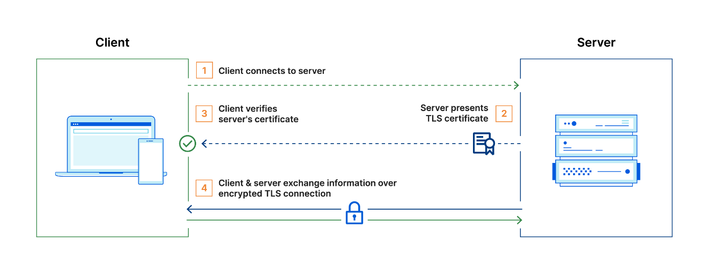
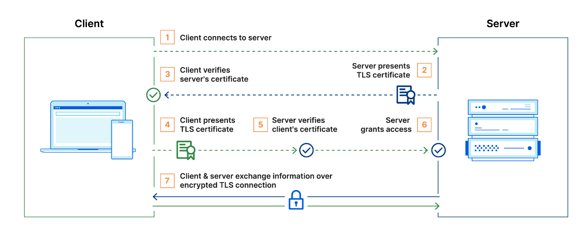

## mTLS
mTLS는 TLS의 확장된 형태로, TLS는 서버의 신원만을 인증하는 반면 mTLS는 서버 뿐만 아니라 클라이언트도 자신의 신원을 인증서를 통해 증명해야 하는 상호 인증 방식입니다. 이는 양방향 인증이라고도 하며, 서로의 인증서를 검증함으로써 보다 강화된 보안을 제공합니다.


**TLS 통신 과정**


1. 클라이언트가 서버에 연결
2. 서버가 TLS 인증서를 제시
3. 클라이언트가 서버의 인증서를 확인
4. 클라이언트와 서버가 암호화된 TLS 연결을 통해 정보를 교환

<br>

**mTLS 통신 과정**

일반적으로 TLS에서 서버에는 TLS 인증서와 공개/개인 키 쌍이 있지만 클라이언트에는 없습니다. 그러나 mTLS에서는 클라이언트와 서버 모두에 인증서가 있고 양측 모두 공개/개인 키 쌍을 사용하여 인증합니다.일반 TLS와 비교하여 mTLS에는 양 당사자를 확인하기 위한 추가 단계가 있습니다.



1. 클라이언트가 서버에 연결
2. 서버가 TLS 인증서를 제시
3. 클라이언트가 서버의 인증서를 확인
4. 클라이언트가 TLS 인증서를 제시
5. 서버가 클라이언트의 인증서를 확인
6. 서버가 액세스 권한을 부여
7. 클라이언트와 서버가 암호화된 TLS 연결을 통해 정보를 교환


mTLS는 조직 내의 사용자, 장치, 서버를 확인하기 위해 Zero Trust 보안 프레임워크에서 자주 사용됩니다. API 엔드포인트를 확인하여 승인되지 않은 당사자가 잠재적으로 악의적인 API 요청을 보낼 수 없도록 하여 API를 안전하게 유지하는 데에도 도움이 될 수 있습니다.

> Zero Trust는 사용자, 장치, 네트워크 트래픽이 기본적으로 신뢰할 수 없음을 의미하며, 이는 많은 보안 취약점을 제거하는 데 도움이 되는 접근 방식입니다.


### OpenSSL 사설 인증서 만들기
사설 인증서를 만들기 전에 알아두어야할 용어는 다음과 같습니다.

* Self Signed Certificate(SSC)
    * 일반적으로 인증서는 개인키 소유자의 공개키를 인증기관(CA)에 전달하면 인증기관에서는 전달받은 공개키와 기타 정보를 사용하여 인증기관의 개인키로 암호화하여 인증서를 만들게 됩니다. 즉, 인증서는 개인키 소유자의 공개키(public key)에 인증기관의 개인키로 서명한 데이터입니다. 따라서 모든 인증서는 발급기관(CA)이 있어야 합니다. 하지만 최상위에 있는 인증기관(root ca)은 서명해줄 상위 인증기관이 없으므로 root ca의 개인키로 스스로의 인증서에 서명하여 최상위 인증기관 인증서를 만들게 됩니다. 이렇게 스스로 서명한 root ca 인증서를 Self Signed Certificate(SSC)라고 합니다.
    * IE, FireFox, Chrome 등의 Web Browser 제작사는 VeriSign 이나 comodo 같은 유명 ROOT CA 들의 인증서를 신뢰하는 CA로 브라우저에 미리 탑재해 놓습니다. 위와 같은 기관에서 발급된 SSL 인증서를 사용해야 browser 에서는 해당 SSL 인증서를 신뢰할수 있는데 OpenSSL 로 만든 ROOT CA와 SSL 인증서는 Browser가 모르는 기관이 발급한 인증서이므로 보안 경고를 발생시키게 되나 내부 서버간의 통신 용도 혹은 테스트 사용시에는 지장이 없습니다.
* Certificate Signing Request(CSR)
    * CSR(Certificate Signing Request) 은 인증기관에 인증서 발급 요청을 하는 특별한 ASN.1 형식의 파일이며(PKCS#10 - RFC2986) 그 안에는 내 공개키 정보와 사용하는 알고리즘 정보등이 들어 있습니다. 개인키는 외부에 유출되면 안 되므로 특별한 형식의 파일을 만들어서 인증기관에 전달하여 인증서를 발급 받습니다. 쉽게 말하자면, CSR은 인증기관에 내 인증서를 만들어달라는 인증서 발급 신청서라고 볼 수 있습니다.
    * SSL 인증서 발급시 CSR 생성은 Web Server 에서 이루어지는데 Web Server 마다 방식이 상이하여 사용자들이 CSR 생성등을 어려워하니 인증서 발급 대행 기관에서 개인키까지 생성해서 보내주고는 합니다.

<br>

**인증서 생성 순서**

1. 자체 서명 루트 인증서 생성 (ca.crt)
2. 서버 인증서 키 생성 (server.key)
3. 서버 인증서 CSR 생성 (server.csr)
4. 서버 인증서 생성 및 CA루트 키로 서명
5. 클라이언트 인증서 키 생성 (client.key)
6. 클라이언트 인증서 CSR 생성 (client.csr)
7. 클라이언트 인증서 생성 및 CA루트 키로 서명

#### 인증서 생성 config 파일

인증서를 만들때 openssl 명령어를 사용하는데 명령어로 모든 설정을 명시하기 번거로우므로 보통 config 파일을 만들어 두고 명령어에 사용합니다. config 파일은 대괄호([])로 구성된 여러 섹션으로 구성되며 섹션 내에서는 key/value 형태로 값이 할당됩니다. 같은 섹션에서 key가 반복되면 마지막 값을 제외한 모든 값들이 무시됩니다.

```shell
# req 섹션은 openSSL의 예약되어 있는 섹션명으로 config 파일로 명시할 경우, 
# CSR을 만드는 명령어일때 참조됩니다.
# 예약된 명령어 참조 : https://www.openssl.org/docs/man3.0/man1/openssl.html
[ req ]
# 생성될 키의 크기를 비트 단위로 지정
default_bits       = 2048
# CSR에 포함될 주체(Subject)의 정보를 입력받는 섹션의 이름을 지정
distinguished_name = req_distinguished_name
# SR 생성 시 적용할 추가 확장 설정을 포함하는 섹션의 이름을 지정
req_extensions     = req_ext

# 구체적인 주체 정보 필드(예: 국가명, 조직명, 공통 이름 등)를 정의
[ req_distinguished_name ]
countryName                 = Country Name (2 letter code)
countryName_default         = KR
stateOrProvinceName         = State or Province Name (full name)
stateOrProvinceName_default = Gyeonggi-do
localityName                = Locality Name (eg, city)
localityName_default        = Seongnam-si
organizationName            = Organization Name (eg, company)
organizationName_default    = junseong
commonName                  = Common Name (e.g. server FQDN or YOUR name)
commonName_max              = 64
commonName_default          = localhost

[ req_ext ]
subjectAltName = @alt_names

[ alt_names ]
DNS.1 = localhost
IP.1 = 127.0.0.1

# 아래는 CA, 서버, client 인증서를 만들때 사용할 커스텀 섹션입니다.
# 설정 참조 
#   https://www.openssl.org/docs/man3.0/man5/x509v3_config.html
#   https://superuser.com/questions/738612/openssl-ca-keyusage-extension
# 사용자 커스텀 섹션으로 적용하기 위해서는 명령어에 -extension 으로 명시해야 합니다.

# 인증서가 CA(인증기관)로서 작동해야할 때 사용되는 extension
[ v3_ca ]
basicConstraints = critical,CA:TRUE
keyUsage = digitalSignature,keyCertSign,cRLSign
subjectKeyIdentifier = hash
authorityKeyIdentifier = keyid:always,issuer:always
subjectAltName = @alt_names

# 사용자 커스텀 섹션으로 적용하기 위해서는 명령어에 -extension 으로 명시해야 합니다.
# 인증서가 client, server 인증서로 사용되며 하위 인증서를 발행할 권한로서 작동해야할 때 사용되는 extension
[ v3_req ]
basicConstraints = CA:FALSE
keyUsage = nonRepudiation,digitalSignature,keyEncipherment
extendedKeyUsage = serverAuth,clientAuth
subjectKeyIdentifier = hash
authorityKeyIdentifier  = keyid:always,issuer:always
subjectAltName = @alt_names
```
* basicConstraints : X.509 인증서에 대한 확장으로 인증서가 CA로 사용될 수 있을지 여부를 결정합니다.
* keyUsage : X.509의 확장 필드로 인증서에 포함된 공개 키가 어떤 목적으로 사용될 수 있을지 명시합니다.
    * digitalSignature : 공개 키를 사용하여 디지털 서명을 생성하고 검증할 수 있음을 나타냅니다. 이는 데이터의 무결성과 발신자의 인증을 보장하는 데 사용됩니다.
    * keyCertSign : 인증서가 다른 인증서에 대한 서명을 할 수 있음을 나타냅니다.
    * cRLSign : 인증서 폐지 목록(Certificate Revocation List, CRL)에 서명할 수 있음을 나타냅니다.
    * nonRepudiation : 데이터의 송신자가 나중에 데이터를 보냈다는 사실을 부인하는 것을 방지하는 데 사용됩니다.
    * keyEncipherment : 공개 키를 사용하여 세션 키와 같은 다른 키들을 암호화하는 데 사용됩니다.
* extendedKeyUsage : 증서에 포함된 공개 키가 사용될 수 있는 특정 목적을 제한하고 추가적으로 상세화하는 데 사용합니다.
    * serverAuth : 서버 인증서에 사용
    * clientAuth: 클라이언트 인증서에 사용
* subjectKeyIdentifier : 인증서에 포함된 공개키 식별자 제공 방식
* authorityKeyIdentifier : 인증서가 발행된 인증 기관(CA)의 식별 정보를 포함합니다. 이 정보는 인증서 체인을 검증하는 과정에서 해당 인증서가 어떤 CA에 의해 서명되었는지를 식별하는 데 사용됩니다.
* subjectAltName (Subject Alternative Name)
    * 지정된 도메인 이름들은 해당 SSL/TLS 인증서를 사용하는 서버가 클라이언트로부터 받는 요청의 유효성을 검증하는 데 사용됩니다. 클라이언트는 SSL/TLS 핸드셰이크 과정에서 서버로부터 인증서를 받고, 인증서에 포함된 도메인 이름이 요청한 도메인과 일치하는지 검사합니다.
    * 과거에는 CN(common name)이 주로 사용되었지만 CN에는 오직 하나의 도메인 이름만 명시할 수 있는 한계가 있어 현재는 CN보다 subjectAltName을 우선적으로 사용합니다.

#### CA 인증서 생성
```shell
# CA 키 & 인증서 생성
openssl req -x509 -nodes -days 36500 -newkey rsa:2048 -keyout ca.key -out ca.crt -extensions v3_ca -config ssl.conf

# 인증서 점검
openssl x509 -in ca.crt -text -noout
```
* -x509 : 인증요청서(csr)을 대신 자체 서명된 인증서 생성
* -nodes : 개인 키를 암호 없이 저장
* -days : 인증서 유효기간
* -newkey rsa:2048 : 2048 비트 rsa 키 생성
* -keyout : 생성된 개인키 파일명 지정
* -out : 생성된 자체 서명된 인증서 파일명 지정
* -extensions : 확장 기능 설정으로 config 파일에 명시한 v3_ca를 적용

#### Server 인증서 생성
```shell
# 서버키 생성
openssl genrsa -out _server.key 2048

# 형식 변환
# genrsa를 사용하여 키를 생성하면 PKCS#1형식으로 생성됩니다. 
# 자바에서는 PKCS#8 형식을 지원하기 때문에 변환해줘야 합니다.
openssl pkcs8 -topk8 -inform PEM -outform PEM -nocrypt -in _server.key -out server.key

# 키 제거
rm _server.key

# 서버 csr 생성
openssl req -new -key server.key -out server.csr -config ssl.conf

# CA로 서명된 서버 인증서 생성
openssl x509 -req -days 36500 -in server.csr -CA ca.crt -CAkey ca.key -out server.crt -CAcreateserial -extensions v3_req -extfile ssl.conf

# 인증서 점검
openssl x509 -in server.crt -text -noout
```

#### Client 인증서 생성
```shell
# 클라이언트키 생성
openssl genrsa -out _client.key 2048

# 형식 변환
openssl pkcs8 -topk8 -inform PEM -outform PEM -nocrypt -in _client.key -out client.key

# 키 제거
rm _client.key

# 클라이언트 csr 생성
openssl req -new -key client.key -out client.csr -config ssl.conf

# CA로 서명된 클라이언트 인증서 생성
openssl x509 -req -days 36500 -in client.csr -CA ca.crt -CAkey ca.key -out client.crt -CAcreateserial -extensions v3_req -extfile ssl.conf 

# 인증서 점검
openssl x509 -in client.crt -text -noout
```


### 프로젝트에 mTLS 적용하기


#### grpc-server
```kotlin
@Configuration
class ArmeriaConfig {
    
  // 생략 
    
  @Bean
  fun armeriaServerConfigurator(
    grpcService: GrpcService,
  ): ArmeriaServerConfigurator {
    return ArmeriaServerConfigurator {
        
      // 생략  

      /**
       * mTLS 적용
       * https://github.com/grpc/grpc-java/blob/master/examples/example-tls/src/main/java/io/grpc/examples/helloworldtls/HelloWorldServerTls.java
       */
      val serverCertInputStream = GrpcApplication::class.java.classLoader.getResourceAsStream("tls/server.crt")!!
      val serverKeyInputStream = GrpcApplication::class.java.classLoader.getResourceAsStream("tls/server.key")!!
      val caCertInputStream = GrpcApplication::class.java.classLoader.getResourceAsStream("tls/ca.crt")!!

      it.https(8443)
      serverCertInputStream.use { serverCertStream ->
        serverKeyInputStream.use { serverKeyStream ->
          it.tls(serverCertStream, serverKeyStream)
        }
      }
      it.tlsCustomizer { builder ->
        caCertInputStream.use { caCertStream ->
          val caCert = CertificateFactory.getInstance("X.509").generateCertificate(caCertStream) as X509Certificate
          builder.trustManager(caCert)
        }
        builder.clientAuth(ClientAuth.REQUIRE)
      }
    }
  }
}
```
실제 운영환경에서는 k8s의 secret으로 마운트해서 사용하지만, demo 프로젝트이므로 resource 폴더 하위에 인증서를 넣어주고 ArmeriaServerConfigurator 설정에서 인증서 정보를 등록해줍니다.

#### rest-client
```kotlin
@Configuration
class GrpcChannelConfig(
  private val grpcTracing: GrpcTracing,
  private val grpcProperties: GrpcProperties,
) {

  @Bean
  fun grpcChannel(): ManagedChannel {
    val clientCertInputStream = RestClientApplication::class.java.classLoader.getResourceAsStream("tls/client.crt")!!
    val clientKeyInputStream = RestClientApplication::class.java.classLoader.getResourceAsStream("tls/client.key")!!

    val builder = NettyChannelBuilder.forAddress(grpcProperties.endpoint, grpcProperties.port)
      .intercept(grpcTracing.newClientInterceptor())
      .negotiationType(NegotiationType.TLS)

    clientCertInputStream.use { clientCertStream ->
      clientKeyInputStream.use { clientKeyStream ->
        builder.sslContext(
          GrpcSslContexts.forClient()
            .trustManager(InsecureTrustManagerFactory.INSTANCE) // 서버 인증서 검증 비활성화
            .keyManager(
              clientCertStream, clientKeyStream,
            )
            .build(),
        )
          .build()
      }
    }

    return builder.build()
  }
}
```
client 모듈에서는 channel을 생성할 때 인증서 정보를 등록해줍니다. 기본적인 설정에서는 서버의 인증서가 신뢰할 수 있는 CA에 의해 발행되었는지 등을 검증하는 설정이 포함되어 있습니다. 현재 서버 인증서는 자체 서명된 ca에 의해 서명되었기 때문에 검증하지 않도록 trustManager 체이닝에서 검증을 비활성화하는 설정을 추가합니다.

**참고**
-   [상호 TLS(mTLS)란](https://www.cloudflare.com/ko-kr/learning/access-management/what-is-mutual-tls/)
-   [OpenSSL 로 ROOT CA 생성 및 SSL 인증서 발급](https://www.lesstif.com/system-admin/openssl-root-ca-ssl-6979614.html)
