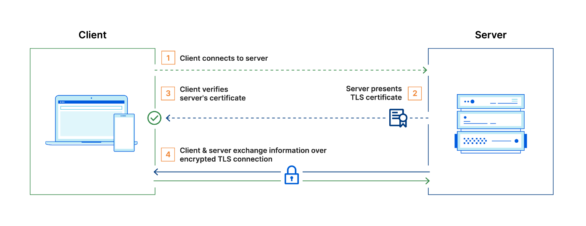
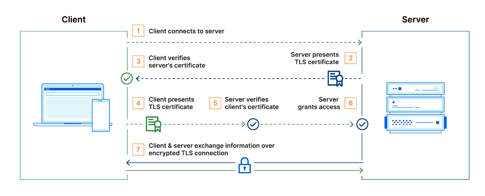
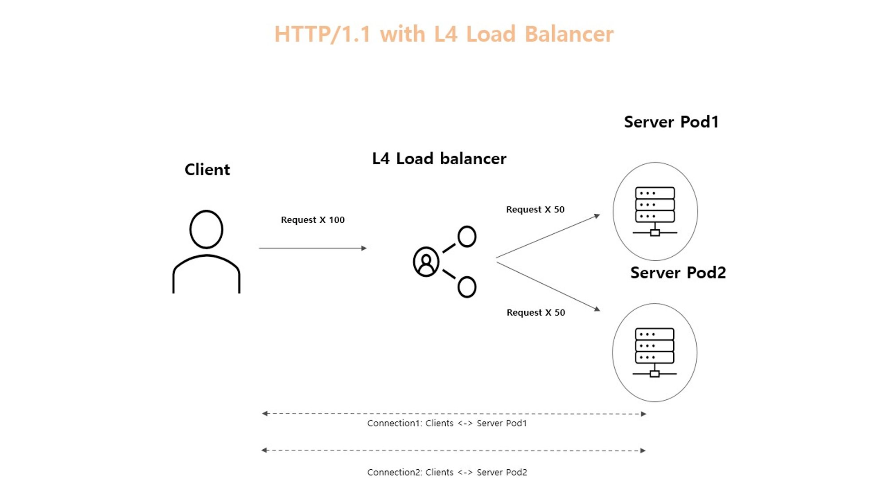
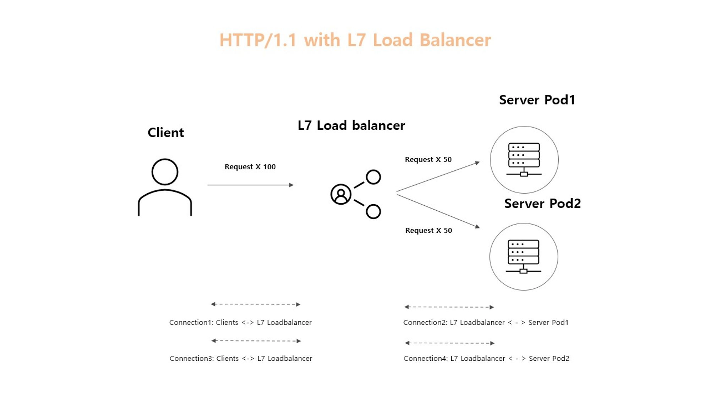

# mTLS
mTLS는 TLS의 확장된 형태로, 서버 뿐만 아니라 클라이언트도 자신의 신원을 인증서를 통해 증명해야 합니다. 이는 양방향 인증이라고도 하며, 서로의 인증서를 검증함으로써 보다 강화된 보안을 제공합니다. 간단히 말해서, TLS는 서버의 신원만을 인증하는 반면, mTLS는 클라이언트와 서버 양쪽 모두 신원을 인증합니다. 이로 인해 mTLS는 더욱 안전한 통신을 가능하게 합니다.


**TLS 통신 과정**


1. 클라이언트가 서버에 연결
2. 서버가 TLS 인증서를 제시
3. 클라이언트가 서버의 인증서를 확인
4. 클라이언트와 서버가 암호화된 TLS 연결을 통해 정보를 교환

<br>

**mTLS 통신 과정**

일반적으로 TLS에서 서버에는 TLS 인증서와 공개/개인 키 쌍이 있지만 클라이언트에는 없습니다. 그러나 mTLS에서는 클라이언트와 서버 모두에 인증서가 있고 양측 모두 공개/개인 키 쌍을 사용하여 인증합니다.일반 TLS와 비교하여 mTLS에는 양 당사자를 확인하기 위한 추가 단계가 있습니다



1. 클라이언트가 서버에 연결
2. 서버가 TLS 인증서를 제시
3. 클라이언트가 서버의 인증서를 확인
4. 클라이언트가 TLS 인증서를 제시
5. 서버가 클라이언트의 인증서를 확인
6. 서버가 액세스 권한을 부여
7. 클라이언트와 서버가 암호화된 TLS 연결을 통해 정보를 교환


mTLS는 조직 내의 사용자, 장치, 서버를 확인하기 위해 Zero Trust 보안 프레임워크에서 자주 사용됩니다. API 엔드포인트를 확인하여 승인되지 않은 당사자가 잠재적으로 악의적인 API 요청을 보낼 수 없도록 하여 API를 안전하게 유지하는 데에도 도움이 될 수 있습니다.

> Zero Trust는 사용자, 장치, 네트워크 트래픽이 기본적으로 신뢰할 수 없음을 의미하며, 이는 많은 보안 취약점을 제거하는 데 도움이 되는 접근 방식입니다.


## OpenSSL 사설 인증서 만들기
사설 인증서를 만들기 전에 알아두어야할 용어는 다음과 같습니다.

* Self Signed Certificate(SSC)
  * 일반적으로 인증서는 개인키 소유자의 공개키를 인증기관(CA)에 전달하면 인증기관에서는 전달받은 공개키와 기타 정보를 사용하여 인증기관의 개인키로 암호화하여 인증서를 만들게 됩니다. 즉, 인증서는 개인키 소유자의 공개키(public key)에 인증기관의 개인키로 서명한 데이터입니다. 따라서 모든 인증서는 발급기관(CA)이 있어야 합니다. 하지만 최상위에 있는 인증기관(root ca)은 서명해줄 상위 인증기관이 없으므로 root ca의 개인키로 스스로의 인증서에 서명하여 최상위 인증기관 인증서를 만들게 됩니다. 이렇게 스스로 서명한 root ca 인증서를 Self Signed Certificate(SSC)라고 합니다.
  * IE, FireFox, Chrome 등의 Web Browser 제작사는 VeriSign 이나 comodo 같은 유명 ROOT CA 들의 인증서를 신뢰하는 CA로 브라우저에 미리 탑재해 놓습니다. 위와 같은 기관에서 발급된 SSL 인증서를 사용해야 browser 에서는 해당 SSL 인증서를 신뢰할수 있는데 OpenSSL 로 만든 ROOT CA와 SSL 인증서는 Browser가 모르는 기관이 발급한 인증서이므로 보안 경고를 발생시키게 되나 내부 서버간의 통신 용도 혹은 테스트 사용시에는 지장이 없습니다.
* Certificate Signing Request(CSR)
  * CSR(Certificate Signing Request) 은 인증기관에 인증서 발급 요청을 하는 특별한 ASN.1 형식의 파일이며(PKCS#10 - RFC2986) 그 안에는 내 공개키 정보와 사용하는 알고리즘 정보등이 들어 있습니다. 개인키는 외부에 유출되면 안 되므로 특별한 형식의 파일을 만들어서 인증기관에 전달하여 인증서를 발급 받습니다. 쉽게 말하자면, CSR은 인증기관에 내 인증서를 만들어달라는 인증서 발급 신청서라고 볼 수 있습니다.
  * SSL 인증서 발급시 CSR 생성은 Web Server 에서 이루어지는데 Web Server 마다 방식이 상이하여 사용자들이 CSR 생성등을 어려워하니 인증서 발급 대행 기관에서 개인키까지 생성해서 보내주고는 합니다.

<br>

**인증서 생성 순서**

1. 자체 서명 루트 인증서 생성 (ca.crt)
2. 서버 인증서 키 생성 (server.key)
3. 서버 인증서 CSR 생성 (server.csr)
4. 서버 인증서 생성 및 CA루트 키로 서명
5. 클라이언트 인증서 키 생성 (client.key)
6. 클라이언트 인증서 CSR 생성 (client.csr)
7. 클라이언트 인증서 생성 및 CA루트 키로 서명

### 인증서 생성 config 파일

인증서를 만들때 openssl 명령어를 사용하는데 명령어로 모든 설정을 명시하기 번거로우므로 보통 config 파일을 만들어 두고 명령어에 사용합니다. config 파일은 대괄호([])로 구성된 여러 섹션으로 구성되며 섹션 내에서는 key/value 형태로 값이 할당됩니다. 같은 섹션에서 key가 반복되면 마지막 값을 제외한 모든 값들이 무시됩니다.

```shell
# req 섹션은 openSSL의 예약되어 있는 섹션명으로 config 파일로 명시할 경우, 
# CSR을 만드는 명령어일때 참조됩니다.
# 예약된 명령어 참조 : https://www.openssl.org/docs/man3.0/man1/openssl.html
[ req ]
# 생성될 키의 크기를 비트 단위로 지정
default_bits       = 2048
# CSR에 포함될 주체(Subject)의 정보를 입력받는 섹션의 이름을 지정
distinguished_name = req_distinguished_name
# SR 생성 시 적용할 추가 확장 설정을 포함하는 섹션의 이름을 지정
req_extensions     = req_ext

# 구체적인 주체 정보 필드(예: 국가명, 조직명, 공통 이름 등)를 정의
[ req_distinguished_name ]
countryName                 = Country Name (2 letter code)
countryName_default         = KR
stateOrProvinceName         = State or Province Name (full name)
stateOrProvinceName_default = Gyeonggi-do
localityName                = Locality Name (eg, city)
localityName_default        = Seongnam-si
organizationName            = Organization Name (eg, company)
organizationName_default    = junseong
commonName                  = Common Name (e.g. server FQDN or YOUR name)
commonName_max              = 64
commonName_default          = localhost

[ req_ext ]
subjectAltName = @alt_names

[ alt_names ]
DNS.1 = localhost
IP.1 = 127.0.0.1

# 아래는 CA, 서버, client 인증서를 만들때 사용할 커스텀 섹션입니다.
# 설정 참조 
#   https://www.openssl.org/docs/man3.0/man5/x509v3_config.html
#   https://superuser.com/questions/738612/openssl-ca-keyusage-extension
# 사용자 커스텀 섹션으로 적용하기 위해서는 명령어에 -extension 으로 명시해야 합니다.

# 인증서가 CA(인증기관)로서 작동해야할 때 사용되는 extension
[ v3_ca ]
basicConstraints = critical,CA:TRUE
keyUsage = digitalSignature,keyCertSign,cRLSign
subjectKeyIdentifier = hash
authorityKeyIdentifier = keyid:always,issuer:always
subjectAltName = @alt_names

# 사용자 커스텀 섹션으로 적용하기 위해서는 명령어에 -extension 으로 명시해야 합니다.
# 인증서가 client, server 인증서로 사용되며 하위 인증서를 발행할 권한로서 작동해야할 때 사용되는 extension
[ v3_req ]
basicConstraints = CA:FALSE
keyUsage = nonRepudiation,digitalSignature,keyEncipherment
extendedKeyUsage = serverAuth,clientAuth
subjectKeyIdentifier = hash
authorityKeyIdentifier  = keyid:always,issuer:always
subjectAltName = @alt_names
```
* basicConstraints : X.509 인증서에 대한 확장으로 인증서가 CA로 사용될 수 있을지 여부를 결정합니다.
* keyUsage : X.509의 확장 필드로 인증서에 포함된 공개 키가 어떤 목적으로 사용될 수 있을지 명시합니다.
    * digitalSignature : 공개 키를 사용하여 디지털 서명을 생성하고 검증할 수 있음을 나타냅니다. 이는 데이터의 무결성과 발신자의 인증을 보장하는 데 사용됩니다.
    * keyCertSign : 인증서가 다른 인증서에 대한 서명을 할 수 있음을 나타냅니다.
    * cRLSign : 인증서 폐지 목록(Certificate Revocation List, CRL)에 서명할 수 있음을 나타냅니다.
    * nonRepudiation : 데이터의 송신자가 나중에 데이터를 보냈다는 사실을 부인하는 것을 방지하는 데 사용됩니다.
    * keyEncipherment : 공개 키를 사용하여 세션 키와 같은 다른 키들을 암호화하는 데 사용됩니다.
* extendedKeyUsage : 증서에 포함된 공개 키가 사용될 수 있는 특정 목적을 제한하고 추가적으로 상세화하는 데 사용합니다.
    * serverAuth : 서버 인증서에 사용
    * clientAuth: 클라이언트 인증서에 사용
* subjectKeyIdentifier : 인증서에 포함된 공개키 식별자 제공 방식
* authorityKeyIdentifier : 인증서가 발행된 인증 기관(CA)의 식별 정보를 포함합니다. 이 정보는 인증서 체인을 검증하는 과정에서 해당 인증서가 어떤 CA에 의해 서명되었는지를 식별하는 데 사용됩니다.
* subjectAltName (Subject Alternative Name)
    * 지정된 도메인 이름들은 해당 SSL/TLS 인증서를 사용하는 서버가 클라이언트로부터 받는 요청의 유효성을 검증하는 데 사용됩니다. 클라이언트는 SSL/TLS 핸드셰이크 과정에서 서버로부터 인증서를 받고, 인증서에 포함된 도메인 이름이 요청한 도메인과 일치하는지 검사합니다.
    * 과거에는 CN(common name)이 주로 사용되었지만 CN에는 오직 하나의 도메인 이름만 명시할 수 있는 한계가 있어 현재는 CN보다 subjectAltName을 우선적으로 사용합니다.

### CA 인증서 생성
```shell
# CA 키 & 인증서 생성
openssl req -x509 -nodes -days 36500 -newkey rsa:2048 -keyout ca.key -out ca.crt -extensions v3_ca -config ssl.conf

# 인증서 점검
openssl x509 -in ca.crt -text -noout
```
* -x509 : 인증요청서(csr)을 대신 자체 서명된 인증서 생성
* -nodes : 개인 키를 암호 없이 저장
* -days : 인증서 유효기간
* -newkey rsa:2048 : 2048 비트 rsa 키 생성
* -keyout : 생성된 개인키 파일명 지정
* -out : 생성된 자체 서명된 인증서 파일명 지정
* -extensions : 확장 기능 설정으로 config 파일에 명시한 v3_ca를 적용

### Server 인증서 생성
```shell
# 서버키 생성
openssl genrsa -out _server.key 2048

# 형식 변환
# genrsa를 사용하여 키를 생성하면 PKCS#1형식으로 생성됩니다. 
# 자바에서는 PKCS#8 형식을 지원하기 때문에 변환해줘야 합니다.
openssl pkcs8 -topk8 -inform PEM -outform PEM -nocrypt -in _server.key -out server.key

# 키 제거
rm _server.key

# 서버 csr 생성
openssl req -new -key server.key -out server.csr -config ssl.conf

# CA로 서명된 서버 인증서 생성
openssl x509 -req -days 36500 -in server.csr -CA ca.crt -CAkey ca.key -out server.crt -CAcreateserial -extensions v3_req -extfile ssl.conf

# 인증서 점검
openssl x509 -in server.crt -text -noout
```

### Client 인증서 생성
```shell
# 클라이언트키 생성
openssl genrsa -out _client.key 2048

# 형식 변환
openssl pkcs8 -topk8 -inform PEM -outform PEM -nocrypt -in _client.key -out client.key

# 키 제거
rm _client.key

# 클라이언트 csr 생성
openssl req -new -key client.key -out client.csr -config ssl.conf

# CA로 서명된 클라이언트 인증서 생성
openssl x509 -req -days 36500 -in client.csr -CA ca.crt -CAkey ca.key -out client.crt -CAcreateserial -extensions v3_req -extfile ssl.conf 

# 인증서 점검
openssl x509 -in client.crt -text -noout
```


## Armeria-grpc에 mTLS 적용


### grpc-server
```kotlin
@Configuration
class ArmeriaConfig {
    
  // 생략 
    
  @Bean
  fun armeriaServerConfigurator(
    grpcService: GrpcService,
  ): ArmeriaServerConfigurator {
    return ArmeriaServerConfigurator {
        
      // 생략  

      /**
       * mTLS 적용
       * https://github.com/grpc/grpc-java/blob/master/examples/example-tls/src/main/java/io/grpc/examples/helloworldtls/HelloWorldServerTls.java
       */
      val serverCertInputStream = GrpcApplication::class.java.classLoader.getResourceAsStream("tls/server.crt")!!
      val serverKeyInputStream = GrpcApplication::class.java.classLoader.getResourceAsStream("tls/server.key")!!
      val caCertInputStream = GrpcApplication::class.java.classLoader.getResourceAsStream("tls/ca.crt")!!

      it.https(8443)
      serverCertInputStream.use { serverCertStream ->
        serverKeyInputStream.use { serverKeyStream ->
          it.tls(serverCertStream, serverKeyStream)
        }
      }
      it.tlsCustomizer { builder ->
        caCertInputStream.use { caCertStream ->
          val caCert = CertificateFactory.getInstance("X.509").generateCertificate(caCertStream) as X509Certificate
          builder.trustManager(caCert)
        }
        builder.clientAuth(ClientAuth.REQUIRE)
      }
    }
  }
}
```
예시 프로젝트 이므로 resource 폴더 하위에 인증서를 넣어주고 ArmeriaServerConfigurator 설정에서 인증서 정보를 등록해줍니다. 실제 운영환경에서는 secret mount해서 사용합니다.

### rest-client
```kotlin
@Component
class StubFactory(
    private val grpcProperties: GrpcProperties,
) {

    fun <T> createStub(clientType: Class<T & Any>, responseTimeoutMillis: Long = 3000, maxResponseLength: Long = 10485760): T {

        val clientCertInputStream = RestClientApplication::class.java.classLoader.getResourceAsStream("tls/client.crt")!!
        val clientKeyInputStream = RestClientApplication::class.java.classLoader.getResourceAsStream("tls/client.key")!!
        
        // endpoint : gproto+https://localhost:8443
        return GrpcClients.builder(grpcProperties.endpoint)
            .responseTimeoutMillis(responseTimeoutMillis)
            .maxResponseLength(maxResponseLength)
            .factory(
                ClientFactory.builder()
                    .apply {
                        // Increase the connect timeout from 3.2s to 5s.
                        connectTimeout(Duration.ofSeconds(5))
                        // Shorten the idle connection timeout from 10s to 5s.
                        idleTimeout(Duration.ofSeconds(5))

                        // mTLS를 위한 client 인증서 정보 등록
                        clientCertInputStream.use { clientCertStream ->
                            clientKeyInputStream.use { clientKeyStream ->
                                tls(clientCertStream, clientKeyStream)
                            }
                        }

                        // 서버의 TLS 인증서 체인 검증을 비활성화하는 기능을 제공
                        // 서버의 인증서가 신뢰할 수 있는 CA에 의해 발행되었는지, 인증서가 만료되었는지 등등 확인하는 것을 비활성화
                        tlsNoVerify()
                    }
                    .build(),
            )
            .intercept(LoggingInterceptor())
            .build(clientType)
    }
}
```
grpc를 호출하는 client 모듈에서 stub을 만드는 곳에서는 client의 인증서 정보를 등록해줍니다. 기본적인 설정에서는 서버의 인증서가 신뢰할 수 있는 CA에 의해 발행되었는지 등을 검증하는 설정이 포함되어 있습니다. 현재 서버 인증서는 자체 서명된 ca에 의해 서명되었기 때문에 검증하지 않도록 tlsNoVerify를 사용해줍니다.


# gRPC의 로드밸런싱

## HTTP/2.0 vs HTTP/1.1
gRPC는 HTTP/2.0기반의 프로토콜입니다. HTTP/2.0은 HTTP/1.1과 달리 Multiplexing을 지원합니다. Multiplexing은 하나의 Connection에서 복수의 Stream을 동시에 처리하는 것을 의미합니다. Multiplexing은 HTTP Message를 독립적인 Frame으로 분해하여 보내고 수신단에서 다시 재조립합니다.

HTTP/1.1의 경우 하나의 Connection에서 하나의 Request만 처리할 수 있습니다.  따라서 하나의 Connection에서 동시에 복수의 Request를 처리하기 위해서 복수의 HTTP/1.1 Connection을 생성해야합니다.

반면에 HTTP/2.0의 경우 하나의 Connection에서 동시에 여러개의 Request를 처리할 수 있습니다. 따라서 동시에 복수의 Request가 발생해도 별도로 Connection을 생성할 필요가 없습니다.

## L7 로드 밸런서 vs L4 로드 밸런서
Kubernetes의 서비스 타입인 로드 밸런서는 L4 로드 밸런서입니다. L4 로드 밸런서는 Client가 만든 Connection을 사용하여 Request를 분산시킵니다.

HTTP/1.1의 경우 L4로드 밸런서를 사용하면 다음 예시와 같이 로드 밸런싱이 진행됩니다.



L4 로드 밸런서를 사용하면 Client와 Server가 직접 Connection을 맺습니다. HTTP/1.x의 경우 복수의 요청을 처리하기 위해서 복수의 Connection을 생성합니다. Client가 보내는 요청에 대해서는 L4 로드 밸런서가 Client와 Server간에 맺어진 Connection을 사용하며 NAT을 사용하여 Request를 분산합니다.


반면에 HTTP/2.0와 L4 로드 밸런서를 사용하는 경우에는 하나의 Connection을 가지고 다수의 요청을 보내기 때문에 L4 로드 밸런서로는 로드 밸런싱이 되지 않습니다.


L4 로드 밸런서를 사용하면 Client와 Server가 직접 Connection을 맺습니다. HTTP/2.0의 경우 복수의 요청을 처리하기 위해서 Connection이 생성되지 않습니다. 따라서 Connection은 Client와 Server사이에서만 생성됩니다. L4 로드 밸런서는 최초로 Connection을 맺은 Server Pod1에만 Request를 보내고 나머지 Server Pod2에는 Request를 전달하지 않습니다.


Kubernetes에서 L7 로드 밸런서를 제공하지 않지만 Third Party L7 로드 밸런서를 찾아볼 수 있습니다 (e.g. Traefik, Linkerd, Istio). L7 로드 밸런서는 Application Layer에서 로드 밸런싱합니다. Client와 L7 로드 밸런서가 직접 Connection을 맺고 L7 로드 밸런서와 서버(Pod)와 Connection을 맺습니다. HTTP/2.0와 L7 로드 밸런서를 사용하는 경우에는 다음과 같이 로드 밸런싱이 진행됩니다.



Client와 L7 로드 밸런서 그리고 L7 로드 밸런서와 Server간에 Connection이 맺어집니다. Client가 요청을 보내게 되면 L7 로드 밸런서에서 이를 Application Layer까지 읽고 이를 다시 Server로 전달합니다.

# treafik


https://traefik.io/traefik/
https://doc.traefik.io/traefik/
https://velog.io/@zuckerfrei/Traefik-1.-Traefik-%EA%B0%9C%EB%85%90
> https://blog.annotation-ai.com/grpc-loadbalancing-in-k8s/
https://danawalab.github.io/common/2021/07/14/traefik-reverse-froxy.html
https://minpeter.github.io/home-lab/%EC%B4%9D%EC%A0%95%EB%A6%AC-traefik-proxy
https://snark16x.gitlab.io/16x/how-to-use-traefik/
https://blog.zarathu.com/posts/2022-02-08-traefik-reverseproxy/
https://bysssss.tistory.com/169


## 소개

Traefik은 라우팅 외에도 SSL, Logging, Load balancing 등등의 여러가지 기능을 제공하지만 주요한 컨셉은 Edge Router와 Auto Service Discovery 입니다.


들어오는 모든 트래픽을 가로채서 규칙에 따라 적절한 서비스로 연결해주는 역할을 담당합니다.


전통적으로 엣지 라우터(또는 리버스 프록시)는 서비스로의 모든 가능한 경로를 포함하는 구성 파일이 필요하지만, Traefik은 서비스 자체로부터 이러한 정보를 얻습니다. 즉, 서비스가 배포될 때 Traefik이 즉시 감지하고 실시간으로 라우팅 규칙을 업데이트합니다. 

**Entrypoints, Routers, Service**

Request가 traefik으로 전달되면 Entrypoint -> Router (+middleware) -> Service 순으로 처리되며 각각 다음과 같이 동작합니다.

* Entrypoints : Traefik의 네트워크 진입점으로 패킷을 수신할 포트와 TCP 또는 UDP를 수신할지 여부를 정의합니다.
* Router : 들어오는 요청을 처리할 수 있는 서비스에 연결하는 역할을 합니다. 
* middleware : 라우터에 연결된 미들웨어는 요청이나 응답이 서비스로 전송되기 전에 수정할 수 있습니다.
* Services : 서비스는 들어오는 요청을 최종적으로 처리할 실제 서비스에 도달하는 방법을 구성하는 역할을 담당합니다.


## 설치
https://doc.traefik.io/traefik/getting-started/quick-start/
https://minpeter.github.io/home-lab/%EC%B4%9D%EC%A0%95%EB%A6%AC-traefik-proxy
https://blog.annotation-ai.com/grpc-loadbalancing-in-k8s/

helm은 쓸수는 없으니 dockerfile로 설명해보자.


**참고**
> https://www.lesstif.com/software-architect/pem-cer-der-crt-csr-113345004.html
> https://www.lesstif.com/system-admin/openssl-root-ca-ssl-6979614.html
> https://www.cloudflare.com/ko-kr/learning/access-management/what-is-mutual-tls/


===

# 인증서 정리


https://gist.github.com/leevigraham/e70bc5c0a585f40536252abab61875d8
https://gist.github.com/fntlnz/cf14feb5a46b2eda428e000157447309
https://superuser.com/questions/738612/openssl-ca-keyusage-extension
https://github.com/cert-manager/cert-manager/issues/279
https://www.nerdieworks.nl/posts/client-certificate-authentication-with-traefik/

# 사설 인증서 만들기
https://binwrite.com/openssl-certificate/#google_vignette
https://goldsony.tistory.com/223
https://wiki.navercorp.com/pages/viewpage.action?pageId=1856598977
https://binwrite.com/openssl-certificate/
https://www.lesstif.com/system-admin/openssl-root-ca-ssl-6979614.html
https://www.ehostidc.co.kr/cscenter/technical.php?ptype=view&code=technical&idx=596&category=
https://blog.naver.com/njaegyu/220358064434
https://www.runit.cloud/2020/04/https-ssl.html#%EC%84%9C%EB%B2%84%20%EC%9D%B8%EC%A6%9D%EC%84%9C%EB%A5%BC%20%EB%A7%8C%EB%93%A4%EA%B3%A0%20%EC%9E%90%EC%B2%B4%20%EC%84%9C%EB%AA%85%ED%95%98%EA%B8%B0
https://learn.microsoft.com/ko-kr/azure/application-gateway/self-signed-certificates
