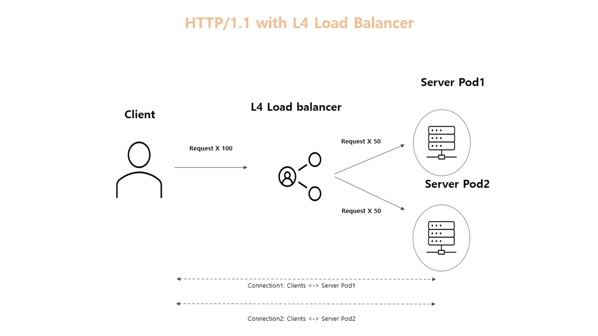
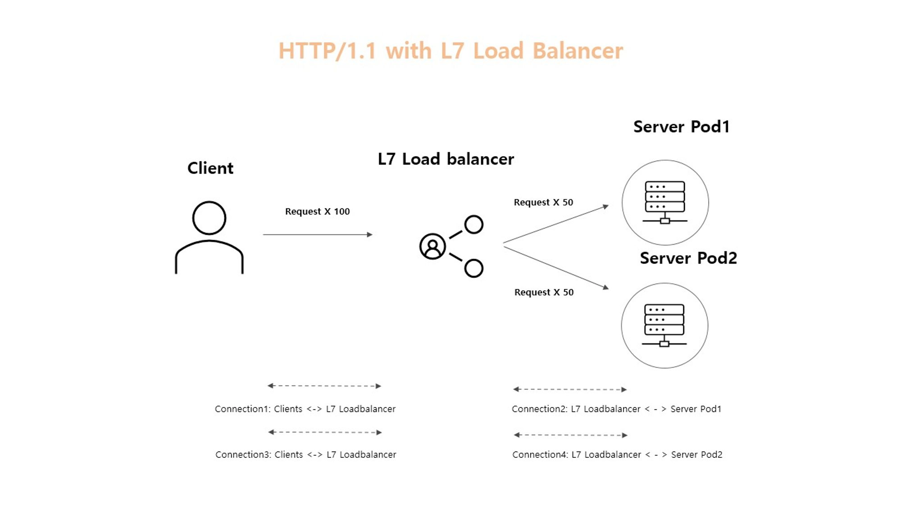
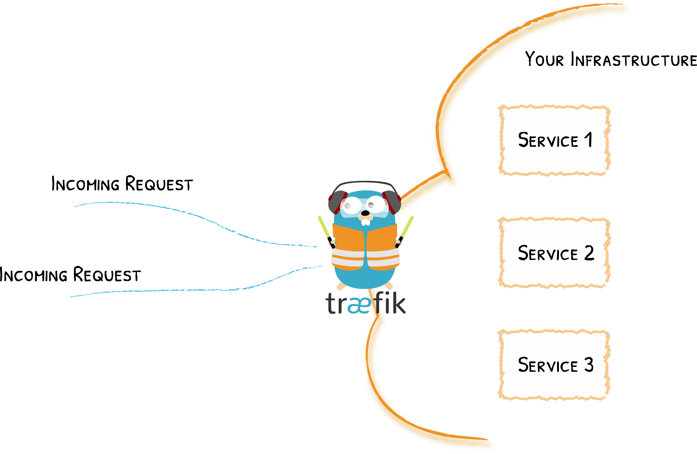

# gRPC의 로드밸런싱

## HTTP/2.0 vs HTTP/1.1
gRPC는 HTTP/2.0기반의 프로토콜입니다. HTTP/2.0은 HTTP/1.1과 달리 Multiplexing을 지원합니다. Multiplexing은 하나의 Connection에서 복수의 Stream을 동시에 처리하는 것을 의미합니다. Multiplexing은 HTTP Message를 독립적인 Frame으로 분해하여 보내고 수신단에서 다시 재조립합니다.

HTTP/1.1의 경우 하나의 Connection에서 하나의 Request만 처리할 수 있습니다. 따라서 하나의 Connection에서 동시에 복수의 Request를 처리하기 위해서 복수의 HTTP/1.1 Connection을 생성해야합니다.

반면에 HTTP/2.0의 경우 하나의 Connection에서 동시에 여러개의 Request를 처리할 수 있습니다. 따라서 동시에 복수의 Request가 발생해도 별도로 Connection을 생성할 필요가 없습니다.

## L7 로드 밸런서 vs L4 로드 밸런서
Kubernetes의 서비스 타입인 로드 밸런서는 L4 로드 밸런서입니다. L4 로드 밸런서는 Client가 만든 Connection을 사용하여 Request를 분산시킵니다.

HTTP/1.1의 경우 L4로드 밸런서를 사용하면 다음 예시와 같이 로드 밸런싱이 진행됩니다.



L4 로드 밸런서를 사용하면 Client와 Server가 직접 Connection을 맺습니다. HTTP/1.x의 경우 복수의 요청을 처리하기 위해서 복수의 Connection을 생성합니다. Client가 보내는 요청에 대해서는 L4 로드 밸런서가 Client와 Server간에 맺어진 Connection을 사용하며 NAT을 사용하여 Request를 분산합니다.


반면에 HTTP/2.0와 L4 로드 밸런서를 사용하는 경우에는 하나의 Connection을 가지고 다수의 요청을 보내기 때문에 L4 로드 밸런서로는 로드 밸런싱이 되지 않습니다.


L4 로드 밸런서를 사용하면 Client와 Server가 직접 Connection을 맺습니다. HTTP/2.0의 경우 복수의 요청을 처리하기 위해서 Connection이 생성되지 않습니다. 따라서 Connection은 Client와 Server사이에서만 생성됩니다. L4 로드 밸런서는 최초로 Connection을 맺은 Server Pod1에만 Request를 보내고 나머지 Server Pod2에는 Request를 전달하지 않습니다.


Kubernetes에서 L7 로드 밸런서를 제공하지 않지만 Third Party L7 로드 밸런서를 찾아볼 수 있습니다 (e.g. Traefik, Linkerd, Istio). L7 로드 밸런서는 Application Layer에서 로드 밸런싱합니다. Client와 L7 로드 밸런서가 직접 Connection을 맺고 L7 로드 밸런서와 서버(Pod)와 Connection을 맺습니다. HTTP/2.0와 L7 로드 밸런서를 사용하는 경우에는 다음과 같이 로드 밸런싱이 진행됩니다.



Client와 L7 로드 밸런서 그리고 L7 로드 밸런서와 Server간에 Connection이 맺어집니다. Client가 요청을 보내게 되면 L7 로드 밸런서에서 이를 Application Layer까지 읽고 이를 다시 Server로 전달합니다.

# traefik

## 소개

Traefik은 라우팅 외에도 SSL, Logging, Load balancing 등등의 여러가지 기능을 제공하지만 주요한 컨셉은 Edge Router와 Auto Service Discovery 입니다.


들어오는 모든 트래픽을 가로채서 규칙에 따라 적절한 서비스로 연결해주는 역할을 담당합니다.



전통적으로 엣지 라우터(또는 리버스 프록시)는 서비스로의 모든 가능한 경로를 포함하는 구성 파일이 필요하지만, Traefik은 서비스 자체로부터 이러한 정보를 얻습니다. 즉, 서비스가 배포될 때 Traefik이 즉시 감지하고 실시간으로 라우팅 규칙을 업데이트합니다. 

**Entrypoints, Routers, Service**

Request가 traefik으로 전달되면 Entrypoint -> Router (+middleware) -> Service 순으로 처리되며 각각 다음과 같이 동작합니다.

* Entrypoints : Traefik의 네트워크 진입점으로 패킷을 수신할 포트와 TCP 또는 UDP를 수신할지 여부를 정의합니다.
* Router : 들어오는 요청을 처리할 수 있는 서비스에 연결하는 역할을 합니다. 
* middleware : 라우터에 연결된 미들웨어는 요청이나 응답이 서비스로 전송되기 전에 수정할 수 있습니다.
* Services : 서비스는 들어오는 요청을 최종적으로 처리할 실제 서비스에 도달하는 방법을 구성하는 역할을 담당합니다.


## 설치
https://doc.traefik.io/traefik/getting-started/quick-start/

### Role
k8s의 API 서버에 아무나 접근을 허용하면 안되기 때문에 k8s에서는 Role 기반의 인증 작업을 제공합니다. 이 인증 작업을 Role 기반의 액세스 제어(Role-based access control = RBAC)라고 합니다.

Role에는 어떠한 자원에 어떤 API를 허용할지를 명시하고, ServiceAccount라는 사용자가 있으면 이 둘을 이어주는 RoleBinding이 존재합니다.  

```yml
kind: Role
apiVersion: rbac.authorization.k8s.io/v1
metadata:
  name: 'traefik-role'
  namespace: namespace
  labels:
    app.kubernetes.io/name: 'traefik'
    app.kubernetes.io/instance: 'traefik'
    app.kubernetes.io/version: 'v20230601'
rules:
  - apiGroups: # 어떤 리소스에 대한 접근 권한을 부여할지 명시
      - ""
    resources:
      - services
      - endpoints
      - secrets
    verbs:
      - get # 해당 리소스에 대한 읽기 권한을 부여
      - list # 해당 리소스의 목록을 가져올 수 있는 권한 부여
      - watch # 해당 리소스의 변경사항을 감시(watch)할 수 있는 권한 부여
  - apiGroups:
      - traefik.containo.us
    resources:
      - ingressroutes
      - ingressroutetcps
      - ingressrouteudps
      - middlewares
      - middlewaretcps
      - tlsoptions
      - tlsstores
      - traefikservices
      - serverstransports
    verbs:
      - get
      - list
      - watch
```

apiGroup은 api resource들을 묶어놓은 Group을 의미합니다. api Resource는 pods, service, jobs 등 k8s에서 사용하는 resource들을 의미합니다. 보통 k8s resource yml에 맨 처음에 들어가는 apiVersion이 명시되는데 여기에 명시된 것이 apiGroup에 해당합니다. pod, service 같은 것들을 정의할 땐 단순히 v1이라고 명시하는데 core api에 해당하는 resource들은 group을 작성하지 않아도 됩니다. core api에는 pod, service, pv, namespace, configmap 등이 있습니다. 위에서 apiGroup이 ""으로 비어있는 것이 core api를 의미합니다. `kubectl api-resources -o wide` 명령어를 통해 어떤 kind가 어떤 apiGroup에 해당하는지 확인할 수 있습니다.

위에서는 core api와 traefik에 대한 특정 리로스에 대한 특정 권한을 부여합니다.

### serviceAccount
```yml
# Source: traefik/templates/rbac/serviceaccount.yaml
kind: ServiceAccount
apiVersion: v1
metadata:
  name: 'traefik-serviceaccount'
  namespace: namespace
  labels:
    app.kubernetes.io/name: 'traefik'
    app.kubernetes.io/instance: 'traefik'
    app.kubernetes.io/version: 'v20230601'
```
ServiceAccount를 하나 만들어줍니다.

### RoleBinding
```yml
kind: RoleBinding
apiVersion: rbac.authorization.k8s.io/v1
metadata:
  name: 'traefik-rolebinding'
  namespace: namespace
  labels:
    app.kubernetes.io/name: 'traefik'
    app.kubernetes.io/instance: 'traefik'
    app.kubernetes.io/version: 'v20230601'
roleRef:
  apiGroup: rbac.authorization.k8s.io
  kind: Role
  name: 'traefik-role'
subjects:
  - kind: ServiceAccount
    name: 'traefik-serviceaccount'
    namespace: namespace # 네임스페이스 지정
```
roleBinding은 serviceAccount와 role을 매핑해주는 역할을 합니다. 특정 serviceAccount를 subjects에 명시하고 매핑하고자 하는 role을 roleRef에 명시해주면 됩니다.

### service

```yml
apiVersion: v1
kind: Service
metadata:
  name: traefik-blue
  namespace: namespace
  labels:
    app.kubernetes.io/name: 'traefik'
    app.kubernetes.io/instance: 'traefik'
    app.kubernetes.io/version: 'v20230601'
spec:
  type: LoadBalancer
  selector:
    app.kubernetes.io/name: 'traefik'
    app.kubernetes.io/instance: 'traefik'
  ports:
  - port: 9000
    name: "traefik"
    targetPort: traefik
    protocol: TCP
  - port: 80
    name: "web"
    targetPort: web
    protocol: TCP
  - port: 443
    name: "websecure"
    targetPort: websecure
    protocol: TCP
```

### deployment
```yml
apiVersion: apps/v1
kind: Deployment
metadata:
  name: traefik-blue
  namespace: namespace
  labels:
    app.kubernetes.io/name: 'traefik'
    app.kubernetes.io/instance: 'traefik'
    app.kubernetes.io/version: 'v20230601'
  annotations:
spec:
  replicas: 1
  selector:
    matchLabels:
      app.kubernetes.io/name: 'traefik'
      app.kubernetes.io/instance: 'traefik'
      app.kubernetes.io/version: 'v20230601'
  strategy: 
    rollingUpdate: 
      maxSurge: 1 # 1개씩 띄우고 전환시키는 방식
      maxUnavailable: 0 # maxSurge가 1이면 이 옵션은 무조건 0
    type: RollingUpdate
    
  minReadySeconds: 0
  template: 
    metadata:
      labels:
        app.kubernetes.io/name: 'traefik'
        app.kubernetes.io/instance: 'traefik'
        app.kubernetes.io/version: 'v20230601'
    spec:
      imagePullSecrets:
        - name: ###
      serviceAccountName: traefik-serviceaccount # serviceAccount 지정
      terminationGracePeriodSeconds: 15
      hostNetwork: false
      containers:
      - name: traefik
        imagePullPolicy: Always
        image: traefik:2.9.1
        resources:
        readinessProbe:
          httpGet:
            path: /ping
            port: 9000
            scheme: HTTP
          failureThreshold: 3
          initialDelaySeconds: 10
          periodSeconds: 5
          successThreshold: 1
          timeoutSeconds: 2
          
        livenessProbe:
          httpGet:
            path: /ping
            port: 9000
            scheme: HTTP
          failureThreshold: 3
          initialDelaySeconds: 10
          periodSeconds: 10
          successThreshold: 1
          timeoutSeconds: 2
          
        lifecycle:
        ports:
        - name: "traefik"
          containerPort: 9000
          protocol: "TCP"
        - name: "web"
          containerPort: 80
          protocol: "TCP"
        - name: "websecure"
          containerPort: 443
          protocol: "TCP"
        volumeMounts:
          - name: access-logs-volume
            mountPath: /home1/irteam/logs/access
        args: # https://doc.traefik.io/traefik/reference/static-configuration/cli/
          # 새로운 버전 체크
          - "--global.checknewversion=false" 
          
          # 데이터 제공 비활성화 https://doc.traefik.io/traefik/contributing/data-collection/
          - "--global.sendanonymoususage=false"
          
          # 대시보드 활성화
          - "--api.dashboard=true"
          - "--api.insecure=true"
          
          # 핑 활성화 readness liveness에서 사용
          - "--ping=true"
          
          # v3.0 부터는 oTel 만 지원함
          # https://doc.traefik.io/traefik/v2.1/observability/tracing/zipkin/
          - "--tracing.zipkin=true"
          - "--tracing.zipkin.httpEndpoint=http://url:9411/api/v2/spans"
          - "--tracing.zipkin.id128Bit=true"
          - "--tracing.zipkin.sampleRate=1"
          
          # CRD를 사용하여 Traefik의 라우팅 및 서비스 구성을 관리하는 제공자(provider)를 활성화
          # 이 제공자 설정을 통해 Traefik은 Kubernetes API와 상호 작용하여 
          # CRD를 통해 정의된 라우팅 규칙과 서비스 설정을 동적으로 읽고 적용
          - "--providers.kubernetescrd"
          - "--providers.kubernetescrd.namespaces="
            
          ## 로그 설정 ##
          - "--log.format=json"
          - "--log.level=INFO"
          - "--accesslog=true"
          - "--accesslog.format=json"
          - "--accesslog.filepath=경로"
          - "--accesslog.bufferingsize=100"
          - "--accesslog.fields.defaultmode=keep"
          - "--accesslog.fields.headers.defaultmode=keep"
          
          # entrypoints.<name>.address 정의
          # name은 IngressRoute의 entrypoints에서 사용됨
          - "--entrypoints.traefik.address=:9000/tcp"
          - "--entrypoints.web.address=:80/tcp"
          - "--entrypoints.websecure.address=:443/tcp"            
      volumes:
        - name: access-logs-volume
          emptyDir: {}
```

### tls, ingress
ServersTransport은 Traefik과 server 간의 통신 방식을 정의하고, TLSOption는 TLS에 대한 상세 옵션 설정하는데 클라이언트와의 mtls 설정을 할 수 있습니다. ingress는 client의 요청을 받으면 어디로 요청을 보낼지를 정의합니다.
```yml
# https://doc.traefik.io/traefik/routing/services/#serverstransport
# https://doc.traefik.io/traefik/master/routing/providers/kubernetes-crd/#kind-serverstransport
# Traefik과 server 간의 통신 방식을 정의 (TLS, 네트워크 옵션, health check 등)
# 정의된 ServersTransport은 IngressRoute에 적용
apiVersion: traefik.containo.us/v1alpha1
kind: ServersTransport
metadata:
  name: 'traefik-transport'
  namespace: ''
  labels:
    app.kubernetes.io/name: 'traefik'
    app.kubernetes.io/instance: 'traefik'
    app.kubernetes.io/version: 'v20230601'
spec:
  # 자체 서명으로 인한 인증서이므로 공인된 CA에 의한 인증서 인지 등등의 검증을 skip
  insecureSkipVerify: true
  rootCAsSecrets: # 서버 인증서 검증을 위한 루트 인증서
    - traefik-ca
  certificatesSecrets: # mTLS를 위해 server 측에 제시할 인증서
    - traefik-client 

---
# https://doc.traefik.io/traefik/https/tls/#tls-options
# https://doc.traefik.io/traefik/routing/providers/kubernetes-crd/#kind-tlsoption
# TLS에 대한 상세 옵션 설정 
# 정의된 TLSOption은 IngressRoute에 적용
apiVersion: traefik.containo.us/v1alpha1
kind: TLSOption
metadata:
  name: 'traefik-tlsoption'
  namespace: ''
  labels:
    app.kubernetes.io/name: 'traefik'
    app.kubernetes.io/instance: 'traefik'
    app.kubernetes.io/version: 'v20230601'
spec:
  clientAuth:    
    secretNames:
      - traefik-ca
    # mTLS 방식 명시
    # 클라이언트 인증서가 필요하며, 이 인증서는 clientAuth.secretNames에 나열된 ca의해 서명되어야 한다.
    clientAuthType: RequireAndVerifyClientCert 
  # https://doc.traefik.io/traefik/https/tls/#strict-sni-checking  
  sniStrict: true

---

# https://doc.traefik.io/traefik/providers/kubernetes-crd/
# k8s Ingress와 유사하며 Traefik에서 만든 CRD이며, entrypoint가 어떤 service로 route 할 지 규칙을 정의
apiVersion: traefik.containo.us/v1alpha1
kind: IngressRoute
metadata:
  name: 'traefik-ingressroute'
  namespace: ''
  labels:
    app.kubernetes.io/name: 'traefik'
    app.kubernetes.io/instance: 'traefik'
    app.kubernetes.io/version: 'v20230601'
spec:
  # entrypoints.<name>.address에 정의했던 name을 명시
  entryPoints:
    - websecure
  # 라우팅 정의
  routes:
    - match: Host(`xxx.com`,`xxx.com`)
      kind: Rule
      services:
        - kind: Service
          name: grpc # 대상 서비스 명
          port: 8443
          namespace: ''
          scheme: https
          serversTransport: 'traefik-transport'
  tls:
    secretName: traefik-server # client 쪽으로 traefik이 제시할 인증서
    options:
      name: 'traefik-tlsoption'
      namespace: ''
```


## mTLS 구성 : Query ↔ Traefik
Traefik의 TLSOption CRD 생성
clientAuthType: RequireAndVerifyClientCert 옵션 설정
secretNames: k8s의 Secret으로 등록한 CA 인증서 설정 (다중 설정 가능)
https://doc.traefik.io/traefik/https/tls/#client-authentication-mtls


## mTLS 구성 : Traefik ↔ gRPC
Traefik의 ServersTransport CRD 생성
rootCAs 및 certificates 설정 (다중 설정 가능)
certificates 에는 Traefik이 gRPC 서버에 제시할 인증서 설정 (client)
https://doc.traefik.io/traefik/routing/services/#serverstransport


## 참고
> https://doc.traefik.io/traefik/routing/routers/#passthrough

위에 옵션들은 query <-> traefik <-> gRPC 에서 traefik이 인증서를 들고 있어서 각각 제시하는 형태인데 passthrough 옵션이 존재하는 것 같음.
이 경우에는 tlsOption, ServersTransport 없이 아래와 같이 ingressRoute만 띄우면 bypass 형태가 가능해보인다.

```yml
apiVersion: traefik.containo.us/v1alpha1
kind: IngressRoute
metadata:
  name: your-ingressroute
  namespace: default
spec:
  entryPoints:
    - websecure
  routes:
    - match: Host(`example.com`)
      kind: Rule
      services:
        - name: your-service
          port: 443
          scheme: https
          serversTransport: your-serverstransport
  tls:
    passthrough: true
```


**참고**
https://github.com/traefik/traefik-helm-chart
https://doc.traefik.io/traefik/
https://traefik.io/traefik/

