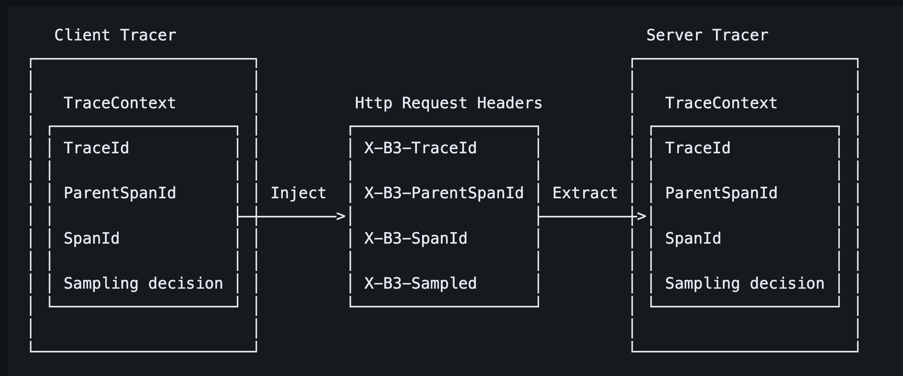

## MSA 환경과 OpenTracing이란
모놀리식(monolithic)과 MSA(Micro Service Architecture)에 대해서 간단하게 설명하겠습니다. 모놀리식의 경우 하나의 서버가 서비스의 전반적인 기능을 모두 제공합니다. 그로 인해 복잡도가 증가하고 역할을 나누기 어려운 등 많은 문제가 발생하지만, 클라이언트의 요청을 받으면 하나의 스레드에서 모든 요청을 실행하므로 로그를 확인하기 쉽다는 장점이 있습니다. 그에 반해 MSA의 경우에는 각 서비스의 복잡도가 낮아지고 역할 분담이 용이하지만 클라이언트의 요청을 받았을 때 여러 개의 마이크로 서비스 간에 통신이 발생해 로그를 확인하기 어려운 문제가 있습니다.

이런 문제를 해결하기 위한 방법으로 OpenTracing이 알려져 있습니다. OpenTracing은 간단히 말해 애플리케이션 간 분산 추적을 위한 표준이라고 할 수 있습니다. 이 표준의 대표적인 구현체로 Jaeger와 Zipkin이 있습니다.

**분산 추적이란?**


하나의 요청이 두 개의 서버를 거칠 때 각 서버가 남기는 로그를 연결할 수단이 필요합니다. 먼저 최초로 요청을 받은 서비스에서 traceId를 생성하고 로깅할 때 이 아이디를 함께 기록합니다. 그리고 다른 서비스로 요청이 넘어갈 때 traceId를 함께 전송합니다. traceId를 전파시키는 방법은 다양하지만 대표적으로 HTTP 요청의 경우 헤더에 traceId를 포함한 추적 문맥 정보를 첨부하여 전송합니다.

## zipkin 아키텍처
### Flow


Zipkin의 Flow는 다음과 같습니다.

1. Reporter가 Transport(전송)를 통해서 Collector에 트레이스 정보를 전달합니다.
  * Transport(전송) 방법으로는 HTTP, Kafka가 있습니다.
2. 전달된 트레이스 정보는 Database에 저장됩니다.
3. Zipkin UI에서 API를 통해 해당 정보를 시각화해서 제공합니다.

### Components
Zipkin은 4가지 컴포넌트로 구성됩니다.

* Collector
  * trace 데이터가 collector 데몬에 도착하면 검증 및 저장되며, collector에 의해 조회를 위한 인덱싱이 진행됩니다.
* Storage
  * zipkin은 초기에 Cassandra에 데이터를 저장하기 위해 만들어졌으나 현재는 ES와 MySQL도 지원합니다. [참고](https://github.com/openzipkin/zipkin#storage-component)
* Query Service
  * 데이터가 저장되고 인덱싱된 후에는 추출하는 방법이 필요합니다. 쿼리 데몬은 추적을 찾고 검색하기 위한 간단한 JSON API를 제공합니다.
* WEB UI
  * WEB UI는 서비스, 시간 및 주석을 기반으로 추적을 볼 수 있는 방법을 제공합니다.

### Zipkin 헤더


Zipkin은 [B3-Propagation](https://github.com/openzipkin/b3-propagation)을 통해서 OpenTracing을 구현하고 있습니다. B3 propagation은 간단히 말해 'X-B3-'으로 시작하는 X-B3-TraceId와 X-B3-ParentSpanId, X-B3-SpanId, X-B3-Sampled, 이 4개 값을 전달하는 것을 통해서 트레이스 정보를 관리합니다. HTTP를 통해 다른 서버로 전달하는 경우에는 HTTP 헤더를 통해서 전달하고, Kafka 메시지를 통해 전달하는 경우에는 Kafka 헤더를 통해서 전달합니다.


1. A Service가 request를 받아 Trace ID, Span ID를 생성하고 Parent Span ID는 null로 지정됩니다.
2. B Service가 A서비스로부터 요청을 받으면 X-B3 헤더를 기반으로 Trace ID는 그대로 이어받고 Span ID는 새롭게 생성하며, Parent Span ID는 A service의 Span ID로 지정합니다.

Request의 전체 흐름은 Trace ID를 기준으로 트래킹하며 Span ID로는 해당 Request가 속했던 서비스를 식별이 가능합니다. Parent ID로는 호출 간의 상관관계를 파악할 수 있습니다.


## 프로젝트 적용


Demo에서는 위와 같은 구조로 Transport 도구로 Kafka를 사용하겠습니다.

각 서버는 계측(instrumented) 라이브러리를 사용해야 Reporter로서 동작할 수 있습니다. Zipkin에서는 다양한 언어에 대한 [라이브러리](https://zipkin.io/pages/tracers_instrumentation.html)를 제공하고 있습니다. Java 환경에서는 [Brave](https://github.com/openzipkin/brave)를 지원하고 있고 Spring 3.x 이전에는 Spring Cloud Sleuth가 BraveTracer를 통해서 트레이스 데이터를 관리하기 위한 대부분의 기능을 제공했지만 3.x 부터는 지원을 [중단](https://docs.spring.io/spring-cloud-sleuth/docs/current-SNAPSHOT/reference/html/)하고 [Micrometer Tracing](https://micrometer.io/docs/tracing)으로 이전되었습니다. spring boot 3.x버전부터는 [공식 문서 13.8 Tracing](https://docs.spring.io/spring-boot/docs/current/reference/htmlsingle/#actuator.micrometer-tracing)를 참고하여 다양한 분산 추적 라이브러리와 연동할 수 있습니다. 그리고 Armeria zipkin 연동 방법은 [공식 문서](https://armeria.dev/docs/advanced-zipkin/)에서 제공하고 있습니다.

### grpc-server
#### build.gradle.kts
```groovy
dependencies {
    
    // 생략
  
    // zipkin - 필수 의존성
    implementation("com.linecorp.armeria:armeria-spring-boot3-actuator-starter:$armeriaVersion")
    implementation("com.linecorp.armeria:armeria-brave:$braveVersion")
    implementation("io.micrometer:micrometer-tracing-bridge-brave")
    implementation("io.zipkin.reporter2:zipkin-reporter-brave")
  
    // zipkin - kafka 전송을 위한 optional 의존성
    implementation("io.zipkin.reporter2:zipkin-sender-kafka")
}
```

#### application.yml
```yml
# 생략 ..
management:
  tracing:
    enabled: true
    sampling:
      probability: 1.0
    propagation:
      type: B3

zipkin:
  endpoint: http://localhost:19092
  messageTimeout: 1
```
[probability](https://opentelemetry.io/docs/specs/otel/trace/tracestate-probability-sampling/)를 1.0으로 지정하며 모두 샘플링 하도록 하였고, propagation은 B3로 지정했습니다. propagation은 B3, B3_MULTI, W3C 방식을 제공하는데 B3는 헤더를 하나로 뭉쳐서 보내는 방식이고 multi는 각 헤더별를 별개로 나눠서 보내는 방식입니다. 자세한 내용은 [문서](https://github.com/openzipkin/b3-propagation#multiple-headers)를 참고 바랍니다.


#### ArmeriaConfig
```kotlin
@Configuration
class ArmeriaConfig {
  
    // 생략
    
    @Bean
    fun armeriaServerConfigurator(
        grpcService: GrpcService,
        tracing: Tracing
    ): ArmeriaServerConfigurator {
        return ArmeriaServerConfigurator {            
            // 생략

            it.service(grpcService, BraveService.newDecorator(tracing))
        }
    }
}
```
Armeria 설정은 grpcService를 등록할 때, Armeria에서 제공하는 BraveService 데코레이터를 추가해주면 끝입니다.


#### ZipkinConfiguration

```kotlin
import com.linecorp.armeria.common.brave.RequestContextCurrentTraceContext;

import brave.Tracing;
import brave.http.HttpTracing;
import zipkin2.reporter.brave.AsyncZipkinSpanHandler;

AsyncZipkinSpanHandler spanHandler = ...
Tracing tracing = Tracing.newBuilder()
                         .localServiceName("myService")
                         .currentTraceContext(RequestContextCurrentTraceContext.ofDefault())
                         .addSpanHandler(spanHandler)
                         .build();
HttpTracing httpTracing = HttpTracing.create(tracing);
```
[공식 문서](https://armeria.dev/docs/advanced-zipkin/)에서 제공하는 Armeria zipkin 연동방식은 위와 같습니다. 눈여결 볼 점은 RequestContextCurrentTraceContext 입니다. Armeria는 내부에서 요청을 처리할 때 여러 스레드를 거칠 수 있습니다. 때문에 로깅할 때 이 점을 고려하여 slf4j.MDC를 관리해주어야 합니다. 추적 문맥 역시 요청을 처리하다 스레드가 바뀌면 정보를 유지해야 합니다. Armeria는 여러 스레드를 걸친 요청 문맥 정보(추적 문맥 포함)를 RequestContext에 넣어 저장합니다. RequestContextCurrentTraceContext는 추적 문맥을 RequestContext에 저장하고 자동으로 추적 문맥을 로드하는 기능을 제공하여 비동기프로그래밍에서 threadLocal를 사용하면서 발생하는 문제를 회피할 수 있는 역할을 제공합니다.

공식 문서는 spring을 사용하지 않은 예시이므로 spring을 활용해봅시다.

* currentTraceContext를 armeria에서 제공하는 RequestContextCurrentTraceContext로 변경
* 추적 데이터 kafka로 전송

spring은 BraveAutoConfiguration 클래스에 의해 기본적으로 추적에 필요한 대부분의 빈들이 자동으로 등록되므로 위와 같은 부분만 수정해주면 됩니다.

```kotlin
/**
 * @see org.springframework.boot.actuate.autoconfigure.tracing.BraveAutoConfiguration
 */
@Configuration
class ZipkinConfiguration(
    private val zipkinProperties: ZipkinProperties,
) {

    private val log = KotlinLogging.logger { }

    @Bean
    fun reporter(sender: Sender): AsyncReporter<Span> {
        return AsyncReporter.builder(sender).build(SpanBytesEncoder.PROTO3)
    }

    @Bean
    fun sender(): Sender {
        return KafkaSender.newBuilder()
            .encoding(Encoding.PROTO3)
            .bootstrapServers(zipkinProperties.endpoint)
            // kafkaConfig properties 수정하는 경우 사용
            // .overrides()
            .build()
    }

    /**
     * @see https://armeria.dev/docs/advanced-zipkin/
     * @see org.springframework.boot.actuate.autoconfigure.tracing.BraveAutoConfiguration.braveTracing
     * @see org.springframework.boot.actuate.autoconfigure.tracing.BraveAutoConfiguration.braveCurrentTraceContext
    */
    @Bean
    fun braveCurrentTraceContext(
        scopeDecorators: List<CurrentTraceContext.ScopeDecorator>,
        currentTraceContextCustomizers: List<CurrentTraceContextCustomizer>,
    ): CurrentTraceContext {
        
        val builder = RequestContextCurrentTraceContext.builder()
        scopeDecorators.forEach(
            Consumer { scopeDecorator: CurrentTraceContext.ScopeDecorator ->
                builder.addScopeDecorator(
                    scopeDecorator,
                )
            },
        )
        for (currentTraceContextCustomizer in currentTraceContextCustomizers) {
            currentTraceContextCustomizer.customize(builder)
        }

        return builder.build()
    }
}
```

### client

#### build.gradle.kts
```groovy
dependencies {
    // 생략

    // for zipkin
    implementation("org.springframework.boot:spring-boot-starter-actuator")
    implementation("io.micrometer:micrometer-tracing-bridge-brave")
    implementation("io.zipkin.reporter2:zipkin-reporter-brave")
    implementation("io.zipkin.reporter2:zipkin-sender-kafka")
    implementation("io.zipkin.brave:brave-instrumentation-grpc")
}
```
grpc-server와 같은 의존성에서 instrumentation-grpc가 추가적으로 들어갔습니다. 이는 stub으로 grpc-server를 호출할 때, 추적 문맥을 추가하는 기능을 제공합니다. application.yml설정은 grpc-server와 동일합니다.

#### zipkinConfiguration
```kotlin
/**
 * @see org.springframework.boot.actuate.autoconfigure.tracing.zipkin
 */
@Configuration
class ZipkinConfiguration(
    private val zipkinProperties: ZipkinProperties,
) {

    private val log = KotlinLogging.logger { }

    @Bean
    fun grpcTracing(tracing: Tracing): GrpcTracing {
        return GrpcTracing.create(tracing)
    }

    @Bean
    fun reporter(sender: Sender): AsyncReporter<Span> {
        return AsyncReporter.builder(sender).build(SpanBytesEncoder.PROTO3)
    }

    @Bean
    fun sender(): Sender {
        return KafkaSender.newBuilder()
            .encoding(Encoding.PROTO3)
            .bootstrapServers(zipkinProperties.endpoint)
            // kafkaConfig properties 수정하는 경우 사용
            // .overrides()
            .build()
    }
}
```
grpc-server의 zipkinConfiguration과 똑같지만 armeria를 사용하지 않으므로 RequestContextCurrentTraceContext 관련 설정은 할 수 없습니다. 이와 관련된 해결책으로는 [이슈](https://github.com/spring-projects/spring-boot/issues/33372#issuecomment-1443766925)를 참고하여 Application에 다음과 같이 hook을 추가해줄 수 있습니다.

```kotlin
@ConfigurationPropertiesScan
@SpringBootApplication
class RestClientApplication

fun main(args: Array<String>) {
    runApplication<RestClientApplication>(*args)
    Hooks.enableAutomaticContextPropagation()
}
```

#### GrpcChannelConfig
```kotlin
@Configuration
class GrpcChannelConfig(
    private val grpcTracing: GrpcTracing,
    private val grpcProperties: GrpcProperties,
) {

    @Bean
    fun grpcChannel(): ManagedChannel {
      
        // 생략
        val builder = NettyChannelBuilder.forAddress(grpcProperties.endpoint, grpcProperties.port)
            .intercept(grpcTracing.newClientInterceptor())
            .negotiationType(NegotiationType.TLS)
        
        // 생략
      
        return builder.build()
    }
}
```
Channel을 만들 때, 앞서 생성해준 grpcTracing을 주입받아서 interceptor로 추가해줍니다. 해당 인터셉터는 타 서비스의 호출 간의 추적 문맥을 이어주는 역할을 제공합니다.

만약 stub이 아닌 일반적인 restTemplate 혹은 webClient를 사용하는 경우라면, RestTemplateBuilder, WebClientBuilder를 사용하여 인스턴스를 생성하면 추가적인 인터셉터 등록 없이 사용할 수 있습니다. 자세한 내용은 [문서](https://docs.spring.io/spring-boot/docs/current/reference/htmlsingle/#actuator.micrometer-tracing.propagating-traces)를 참고바랍니다.


### 설치
```dockerfile
# docker-compose -f docker-compose.yml up

version: '3.7'

services:
  storage:
    image: ghcr.io/openzipkin/zipkin-elasticsearch8:${TAG:-latest}
    container_name: elasticsearch
    ports:
      - 9200:9200

  kafka:
    image: ghcr.io/openzipkin/zipkin-kafka:${TAG:-latest}
    container_name: kafka
    ports:
      - 19092:19092

  zipkin:
    image: ghcr.io/openzipkin/zipkin:${TAG:-latest}
    container_name: zipkin
    ports:
      - 9411:9411
    environment:
      - STORAGE_TYPE=elasticsearch
      - ES_HOSTS=elasticsearch:9200
      - KAFKA_BOOTSTRAP_SERVERS=kafka:9092
    depends_on:
      storage:
        condition: service_healthy
      kafka:
        condition: service_healthy
```

위 docker-compose 구성은 es, kafka, zipkin을 띄우고, zipkin은 kafka에서 데이터를 수급하여 es에 저장하는 형태입니다. zipkin github에서 제공되는 [샘플](https://github.com/openzipkin/zipkin/tree/master/docker/examples)을 참고하여 작성하였고, 추가적인 옵션은 [문서](https://github.com/openzipkin/zipkin/blob/master/zipkin-server/README.md)를 참고 바랍니다.

### web ui


여기까지 세팅으로 client가 grpc-server를 호출하는 api를 호출하고 localhost:9411로 접속해보면 zipkin에서 제공하는 web ui로 추적을 확인할 수 있습니다. 

### kafka
> actor -> client -> grpc-server -> kafka -> consumer

이번에는 위와 같은 형태의 요청으로 추적이 잘 되는지 확인해보겠습니다. 자세한 내용은 [문서](https://docs.spring.io/spring-kafka/reference/kafka/micrometer.html)를 참고 바랍니다. 

> 참고로 consumer batch listener의 경우 지원하지 않습니다.

#### grpc-server
**build.gradle**
```groovy
implementation("org.springframework.kafka:spring-kafka")
```

**CommonKafkaProducerConfig**
```kotlin
@Configuration
class CommonKafkaProducerConfig {
    
    // 생략
    @Bean
    fun commonKafkaTemplate(): KafkaTemplate<String, Any> {
        return KafkaTemplate(commonProducerFactory()).apply {
            setObservationEnabled(true) // zipkin
        }
    }
}
```

#### consumer
**consumerConfig**
```kotlin
@EnableKafka
@Configuration
class ConsumerConfig {
    
    // 생략
    
    @Bean(COMMON)
    fun commonKafkaListenerContainerFactory(
        commonConsumerFactory: ConsumerFactory<String, Any>,
        commonErrorHandler: CommonErrorHandler,
    ): KafkaListenerContainerFactory<ConcurrentMessageListenerContainer<String, Any>> {
        return ConcurrentKafkaListenerContainerFactory<String, Any>().apply {
            consumerFactory = commonConsumerFactory
            containerProperties.isObservationEnabled = true // zipkin
        }
    }
}
```

#### web ui


여기까지 세팅으로 호출하고 web ui로 확인해보면 잘 추적되는 것을 확인할 수 있습니다.

## 이슈
### kafka로 데이터를 전송하기 전에 app이 종료되는 경우


app을 종료할 때, kafka로 데이터를 전송하기 전에 종료되는 경우 위와 같은 예외가 발생하여 아래와 같이 코드를 수정하여 해결할 수 있습니다.
```kotlin
@Configuration
class ZipkinConfiguration(
    private val zipkinProperties: ZipkinProperties,
) {

    private val log = KotlinLogging.logger { }

    @Bean
    fun reporter(sender: Sender): AsyncReporter<Span> {
        val reporter = AsyncReporter.builder(sender).build(SpanBytesEncoder.PROTO3)

        // zipkin에 전송하기 전에 app이 종료되는 경우 방지
        // https://github.com/openzipkin/zipkin-reporter-java/issues/202
        // https://github.com/spring-cloud/spring-cloud-sleuth/blob/3.1.x/spring-cloud-sleuth-autoconfigure/src/main/java/org/springframework/cloud/sleuth/autoconfig/zipkin2/ZipkinAutoConfiguration.java#L136
        Runtime.getRuntime().addShutdownHook(
            Thread {
                log.info { "Flushing remaining spans on shutdown" }
                reporter.flush()
                try {
                    Thread.sleep(TimeUnit.SECONDS.toMillis(zipkinProperties.messageTimeout) + 500)
                    log.debug { "Flushing done - closing the reporter" }
                    reporter.close()
                } catch (e: Exception) {
                    throw IllegalStateException(e)
                }
            },
        )

        return reporter
    }
}
```

### 빈 초기화 순서 문제로 수집이 안되는 경우
ObservationRegistryPostProcessor와 ObservationRegistry는 Spring Boot 3에서 모니터링과 관찰 관련 기능을 효율적으로 관리하기 위해 사용됩니다. ObservationRegistry는 애플리케이션에서 발생하는 다양한 이벤트와 메트릭을 관찰하고 기록하는 중앙 집중식 저장소 역할을 하고, ObservationRegistryPostProcessor는 BeanPostProcessor의 구현체로, Spring 컨테이너의 빈 생명주기 중 특정 시점에 개입하여 ObservationRegistry 빈에 추가적인 설정이나 초기화 작업을 수행합니다.

별도의 빈 설정이 없다면 ObservationRegistryPostProcessor, ObservationRegistry 순으로 초기화 됩니다. 하지만 특정 빈 등록으로 인해 이 순서가 꼬일 수 있습니다. 경험상으로는 MethodSecurityExpressionHandler를 static bean으로 등록하면서 둘의 순서가 꼬이게 되었습니다. 

ObservationRegistryPostProcessor가 자동으로 ObservationRegistry를 후처리하기 전에 ObservationRegistry가 초기화되어 버린 경우 아래와 같이 처리할 수 있습니다.

```kotlin
@Configuration
class ObservationConfig(
    private val observationRegistryPostProcessor: BeanPostProcessor,
    private val observationRegistry: ObservationRegistry,
) {

    @PostConstruct
    fun postProcess() {
        observationRegistryPostProcessor.postProcessAfterInitialization(observationRegistry, "observationRegistry")
    }
}
```
이 코드는 ObservationRegistry가 초기화된 후 필요한 설정이 적용되지 않았을 때, @PostConstruct를 통해 이를 보정하고, 모든 관련 설정이 적절하게 적용되도록 하는 해결책을 제공합니다. 

**참고**
* [zipkin 공식 문서](https://zipkin.io/)
* [LINE 광고 플랫폼의 MSA 환경에서 Zipkin을 활용해 로그 트레이싱하기](https://engineering.linecorp.com/ko/blog/line-ads-msa-opentracing-zipkin)


