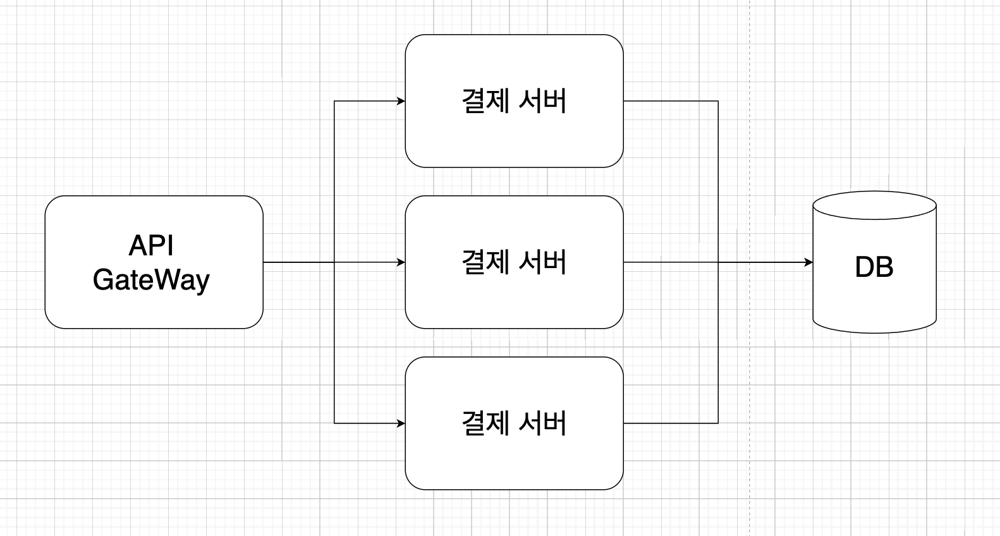

## 분산 서버 동시성 제어



ApiGateway로 인해 여러 서버로 분산된 요청들이 DB의 같은 자원에 접근해서 수정하게 되는 경우, 최종적으로 커밋된 데이터의 형태로 자원이 저장되게 됩니다. 예를 들어, A 요청이 먼저 들어와서 1이라는 자원을 수정하고 있는데, B요청이 들어와서 A보다 먼저 자원을 수정하고 커밋하고 이후에 A가 커밋하게 된다면 최종적으로는 A에서 커밋한 데이터가 반영되게 되면서 정합성이 깨지게 됩니다.  

분삭락을 사용하게 되는 경우, 가장 먼저 들어온 요청이 락을 획득하여 작업을 처리하기 때문에 이후 들어온 요청은 락을 획득하기까지 기다리고 이전 작업이 락을 해제해야만 다음 요청이 락을 획득하여 작업을 처리할 수 있게 됩니다.

## Redisson 라이브러리
Redis를 사용하게 되면 보통 Lettuce 구현체를 사용하게 됩니다. Lecttuce를 사용하여 분산락을 구현할 경우, setnx,setex과 같은 명령어를 통해 지속적으로 Redis에게 락이 해제되었는지 요청을 보내 확인하는 스핀락 방식으로 동작합니다. 이 경우 요청이 많아질수록 Redis가 받는 부하가 커지게 됩니다. 

이에 비해 Redisson은 Pub/Sub 방식을 이용하기 때문에 락이 해제되면 락을 subscribe하는 클라이언트가 락이 해제되었다는 신호를 받고 락 획득을 시도하게 됩니다. 뿐만 아니라 Lock interface를 별도로 지원하여 락에 대한 타임아웃과 같은 설정을 통해 더욱 안전하게 사용할 수 있습니다.

## 프로젝트 설정
### build.gradle.kts
```groovy
implementation("org.springframework.boot:spring-boot-starter-webflux")
implementation("org.springframework.boot:spring-boot-starter-data-redis-reactive")
implementation("org.apache.commons:commons-pool2:2.12.0")

implementation("org.redisson:redisson-spring-boot-starter:3.31.0")
```
spring-redis 라이브러리는 redis의 커넥션 풀을 지원하지 않기 때문에 사용하고자 한다면 [공식문서](https://docs.spring.io/spring-data/redis/docs/3.1.6/reference/html/#redis:connectors:connection)에서는 commons-pool을 의존성으로 추가하길 가이드하고 있습니다. 

### application.yml
```groovy
spring:
  data:
    redis:
      url: localhost
      port: 6379
      connect-timeout: 3000
      timeout: 3000
```

### RedisConfig
의존성 추가로 인해 기본적인 세팅은 RedisAutoConfiguration과 RedissonAutoConfiguration으로 인해 자동으로 세팅됩니다. 따라서 필요한 pool설정을 위해 redisConnectionFactory와 RedissonClient만 빈으로 등록해주면 됩니다.

```kotlin
@Configuration
class RedisConfig(
    private val redisProperties: RedisProperties,
) {

    @Bean
    fun redissonClient(): RedissonClient {
        val config = Config()
        val poolConfig = lettucePoolingClientConfiguration().poolConfig
        config.useSingleServer().setAddress("redis://${redisProperties.url}:${redisProperties.port}")
            .setConnectionPoolSize(poolConfig.maxTotal)
            .setConnectionMinimumIdleSize(poolConfig.minIdle)
            .setTimeout(redisProperties.timeout.toMillis().toInt())
            .setConnectTimeout(redisProperties.connectTimeout.toMillis().toInt())
            .setIdleConnectionTimeout(3_000)
        return Redisson.create(config)
    }

    @Bean
    fun redisConnectionFactory(): RedisConnectionFactory {
        return LettuceConnectionFactory(
            RedisStandaloneConfiguration(redisProperties.url, redisProperties.port),
            lettucePoolingClientConfiguration(),
        )
        // 아래는 클러스터 설정
//        return LettuceConnectionFactory(RedisClusterConfiguration(listOf(redisProperties.url)), lettuceClientConfiguration)
    }

    private fun lettucePoolingClientConfiguration(): LettucePoolingClientConfiguration {
        val topologyRefreshOptions = ClusterTopologyRefreshOptions.builder()
            .enableAllAdaptiveRefreshTriggers()
            .enablePeriodicRefresh(Duration.ofSeconds(30)) // 기본값이 disabled이므로 설정 필수, 권장 주기 30초
            .dynamicRefreshSources(true) // 기본값이 true이므로 설정하지 않아도 되지만 false로 변경은 금지
            .build()


        val timeoutOptions = TimeoutOptions.builder()
            .timeoutCommands()
            .fixedTimeout(redisProperties.timeout) // 사용 용도에 따라 자유롭게 설정
            .build()

        val clientOptions = ClusterClientOptions.builder()
            .topologyRefreshOptions(topologyRefreshOptions)
            .timeoutOptions(timeoutOptions)
            .build()

        return LettucePoolingClientConfiguration.builder()
            .clientOptions(clientOptions)
            .poolConfig(GenericObjectPoolConfig<Any>())
            .build()
    }
}
```

## 분산락 구현
기본적으로 Redisson의 락은 특정 스레드에 바인딩되어 있어서 락을 건 스레드만이 해당 락을 해제할 수 있도록 설계되어 있습니다. 락을 건 스레드와 락을 해제하는 스레드가 다르면 데드락(교착 상태)이나 레이스 컨디션과 같은 동기화 문제가 발생할 수 있기 때문에 동기화 문제와 데이터의 일관성을 보장하기 위해 이렇게 구현되어 있습니다. 


하지만 코루틴의 경우 실제 스레드와 독립적으로 실행되기 때문에 락을 건 스레드와 해제하는 스레드가 다를 수 있어 락을 건 스레드와 해당 락을 해제하려는 스레드가 다르다는 예외가 발생할 수 있습니다. Redisson에서는 이를 위한 해결책으로 threadId를 인자로 받는 API를 제공합니다.

```java
/**
 * Returns Lock instance by name.
 * <p>
 * Implements a <b>non-fair</b> locking so doesn't guarantees an acquire order by threads.
 * <p>
 * To increase reliability during failover, all operations wait for propagation to all Redis slaves.
 *
 * @param name name of object
 * @return Lock object
 */
RLockReactive getLock(String name);

/**
 * Tries to acquire the lock by thread with specified <code>threadId</code> and  <code>leaseTime</code>.
 * Waits up to defined <code>waitTime</code> if necessary until the lock became available.
 *
 * Lock will be released automatically after defined <code>leaseTime</code> interval.
 *
 * @param threadId id of thread
 * @param waitTime time interval to acquire lock
 * @param leaseTime time interval after which lock will be released automatically 
 * @param unit the time unit of the {@code waitTime} and {@code leaseTime} arguments
 * @return <code>true</code> if lock acquired otherwise <code>false</code>
 */
Mono<Boolean> tryLock(long waitTime, long leaseTime, TimeUnit unit, long threadId);

/**
 * Unlocks the lock. Throws {@link IllegalMonitorStateException}
 * if lock isn't locked by thread with specified <code>threadId</code>.
 *
 * @param threadId id of thread
 * @return void
 */
Mono<Void> unlock(long threadId);
```
* getLock: 지정한 name으로 lock 인스턴스를 획득합니다.
* tryLock : lock을 획득합니다.
  * waitTime : lock 획득에 기다리는 시간
  * leaseTime : lock이 leaseTime내에 해제되지 않으면 자동으로 해제됩니다.
* unlock : lock을 해제합니다.


Coroutine에서는 마땅히 넣어줄 threadId가 존재하지 않기 때문에 이를 대신해줄 값으로 SecureRandom을 사용할 수 있습니다. 


```kotlin
@Component
class DistributedLockUtils(
  private val redissonReactiveClient: RedissonReactiveClient,
  private val transactionUtils: TransactionUtils,
) {

  val random = SecureRandom()

  suspend fun <T> run(targetClassName: String, id: String, block: suspend () -> T): T {
    val uniqueId = random.nextLong()
    val lockName = "$targetClassName:$id"
    val lock = redissonReactiveClient.getLock(lockName)
    var isTimeout = false

    val available = lock.tryLock(TRY_LOCK_TIME_OUT, LEASE_TIME, TimeUnit.SECONDS, uniqueId).awaitSingle()

    check(available) { "Fail to get lock $lockName. Acquire lock timeout." }

    try {
      return transactionUtils.executeInNewTransaction(
        timeoutSecond = TARGET_METHOD_TIME_OUT,
        operation = { block.invoke() }
      )
    } catch (ex: Exception) {
      when (ex) {
        is TimeoutCancellationException -> {
          isTimeout = true
          throw IllegalStateException(
            "Lock lease time expired. LockName : $lockName ", ex
          )
        }

        else -> throw ex
      }
    } finally {
      if (isTimeout.not()) {
        withContext(NonCancellable) {
          lock.unlock(uniqueId).awaitSingleOrNull()
        }
      }
    }
  }

  companion object {
    // 획득까지 대기 시간
    private const val TRY_LOCK_TIME_OUT = 5L

    // 획득 이후 잡고 있을 시간, 이 시간이 지나도 unlock되지 않으면 자동으로 unlock
    private const val LEASE_TIME = 4L

    private const val TARGET_METHOD_TIME_OUT = 3L
  }
}
```
trailing lambda 방식으로 구현한 DistributedLockUtils 클래스입니다. threadId 대신 secureRandom의 nextLong 값을 사용해서 채웠습니다. leaseTime이 지나면 lock이 자동으로 해제되기 때문에 다른 요청이 락을 획득해서 사용하게 되면 문제가 발생할 수 있습니다. 따라서 아래 transactionaUtils 클래스에서 LeaseTime보다 작은 값으로 target 메서드를 호출하는 로직에 withTimeout으로 감싸서 제한시간 내에 메서드 수행이 완료되지 않는 경우 예외를 발생시키도록 했습니다.

lock을 획득하는 코드와 실제 타겟 메서드 호출의 트랜잭션을 분리해하기 때문에 해당 메서드의 호출은 transactioUtils 클래스에서 처리합니다. 만약 같은 트랜잭션에서 호출하게 되는 경우, 타겟 메서드의 트랜잭션이 커밋되지 않은 상태에서 락을 해제하게 되므로 데이터 정합성을 보장할 수 없게 되기 때문입니다.
```kotlin
@Component
class TransactionUtils {

  @Transactional(propagation = Propagation.REQUIRES_NEW)
  suspend fun <T> executeInNewTransaction(
    timeoutSecond: Long = -1,
    operation: suspend () -> T,
  ): T {
    if (timeoutSecond == -1L) {
      return operation()
    }

    try {
      return withTimeout(timeoutSecond.toDuration(DurationUnit.SECONDS)) {
        operation()
      }
    } catch (ex: Exception) {
      throw ex
    }
  }
}
```
현재는 coroutine에 대한 지원이 없어 약간의 우회를 통해 사용했지만 [이슈](https://github.com/redisson/redisson/issues/5667)에 feature로 등록된 것으로 보아 추후 기능이 추가될 것으로 예상됩니다. aop 대신 trailing lambda 문법을 사용한 이유는 아직 spring coroutine 환경에서 aop와 transactional을 동시에 사용하면 버그가 있기 때문입니다. 관련 내용은 [스프링 이슈](https://github.com/spring-projects/spring-framework/issues/33095)에서 해결중입니다


**참고**
* [풀필먼트 입고 서비스팀에서 분산락을 사용하는 방법 - Spring Redisson](https://helloworld.kurly.com/blog/distributed-redisson-lock/)
* [Generating Unique Positive long Using UUID in Java](https://www.baeldung.com/java-uuid-unique-long-generation)
* [Don’t Use Java RedissonClient With Kotlin Coroutines for Distributed Redis Locks](https://betterprogramming.pub/dont-use-java-redissonclient-with-kotlin-coroutines-for-distributed-redis-locks-41da2e85c54a)


