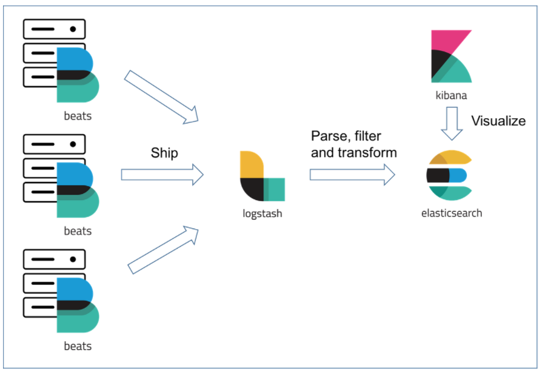
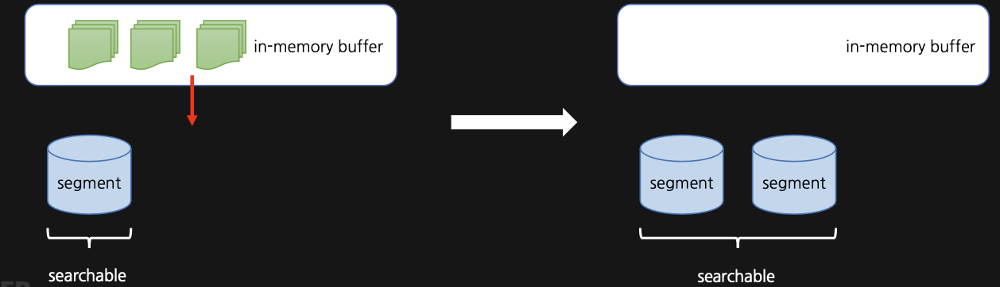
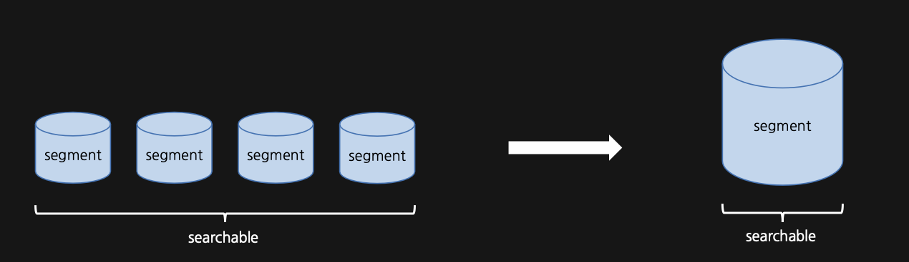
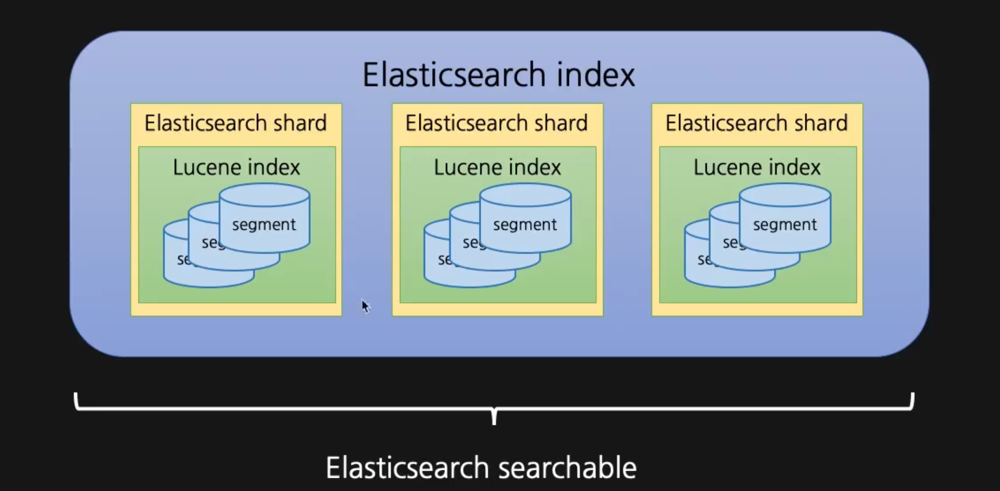
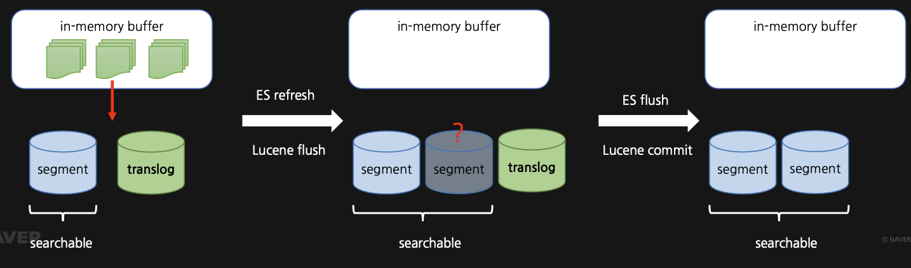
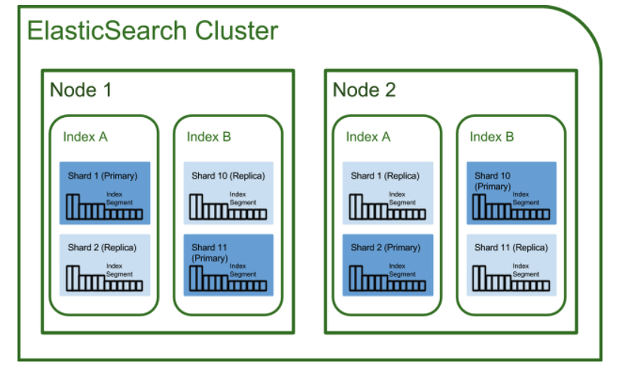
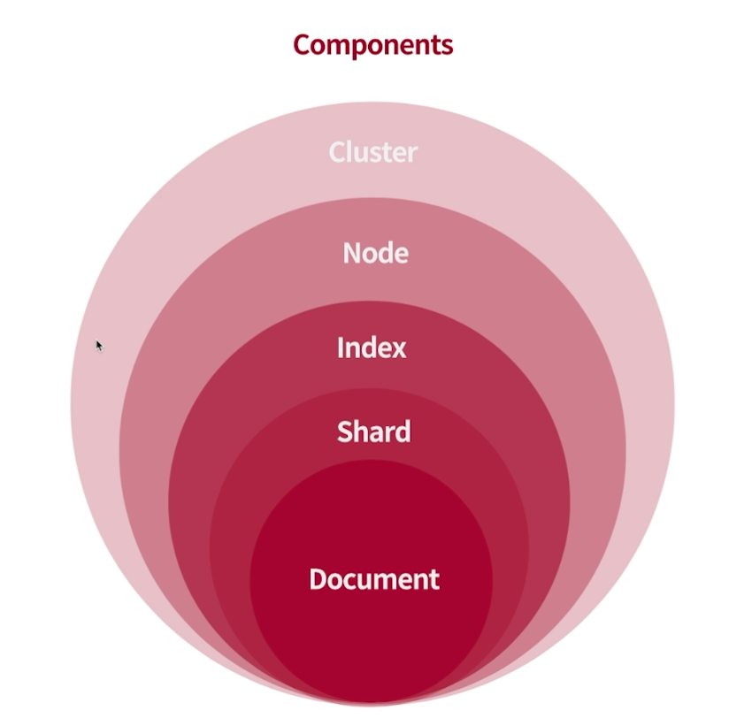
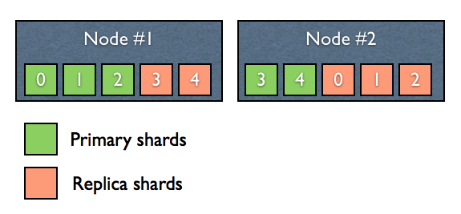
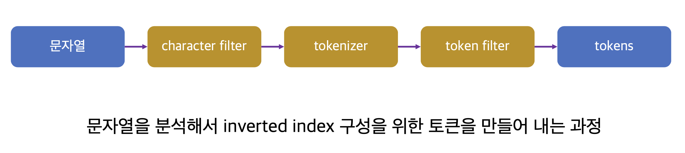

## ElasticSearch 기본 콘셉트
루씬은 데이터를 색인하고 검색하는 기능을 제공하는 검색 엔진의 코어 라이브러리입니다. 엘라스틱서치는 루씬을 코어로 이용하여 JSON 문서의 저장, 색인, 검색 등의 작업을 분산 처리하는 검색 엔진입니다.

**검색 엔진**
단순한 텍스트 매칭 검색이 아닌 전문 검색이 가능하며 다양한 종류의 검색 쿼리를 지원합니다. 검색 엔진이기 때문에 역색인을 사용하여 검색 속도도 매우 빠르며, 다양한 애널라이저를 조합하여 요구사항에 맞는 색인을 구성할 수 있고 형태소 분석도 가능합니다.

**분산 처리**
데이터를 여러 노드에 분산 저장하여 검색이나 집계 작업 등을 수행할 때도 분산 처리를 지원합니다.

**고가용성 제공**
클러스터를 구성하고 있는 일부 노드에 장애가 발생해도 복제본 데이터를 이용해 중단 없이 서비스를 지속할 수 있습니다. 이때 엘라스틱서치는 다시 복제본을 만들어 복제본의 개수를 유지하면서 노드 간 데이터의 균형을 자동으로 맞춥니다.

**수평적 확장성**
더 많은 처리가 필요할 때 새로운 노드에 엘라스틱서치를 설치하여 클러스터에 참여시키는 것만으로도 확장이 가능합니다. 새 노드에 데이터를 복제하거나 옮기는 작업도 엘라스틱서치가 자동으로 수행합니다.

**JSON 기반의 REST API 제공**
JSON 형태의 문서를 저장, 색인, 검색하며, 작업 요청을 보낼 때도 JSON 기반의 REST API를 사용합니다.

**데이터 안정성**
데이터 색인 요청 후 200 OK를 받았다면 데이터는 확실히 디스크에 기록됩니다.

**다양한 플러그인을 통한 기능 확장 지원**
공식적으로 지원하는 플러그인도 많고 커뮤니티에서 다양한 서드파티 플러그인을 공개하고 있습니다.

**준실시간 검색**
데이터를 색인하자마자 조회하는 것은 가능하지만, 데이터 색인 직후의 검색 요청은 성공하지 못할 가능성이 높습니다. 역색인을 구성하고 역색인으로부터 검색이 가능해지기까지 시간이 걸리기 때문입니다. 기본 설정으로 운영할 경우 최대 1초 정도 시간이 걸립니다.

**트랜잭션 지원 않함**
RDBMS와 달리 트랜잭션을 지원하지 않습니다.

**조인을 지원하지 않음**
join이라는 특별한 데이터 타입이 있지만 제한적인 상황을 위한 기능이며 성능도 떨어집니다. RDBMS와 다르게 데이터를 비정규화해야 하며 설계에 있어서는 조인을 사용하지 않는다고 생각해야 합니다.

## ELK stack


엘라스틱서치는 단독으로 검색을 위해 사용하거나 ELK(Elasticsearch & Logstash & Kibana) 스택을 기반으로 사용합니다.

+ Filebeat : 로그를 생성하는 서버에 설치래 로그를 수집하여 Logstash 서버로 로그를 전송합니다.
+ Logstash : 로그 및 트랜잭션 데이터를 수집하여 집계 및 파싱(정제 및 전처리)을 하고 ES로 전달합니다.
+ Elasticsearch : Logstash로부터 전달받은 데이터를 저장하고, 검색 및 집계 등의 기능을 제공합니다.
+ Kibana : 저장된 로그를 Elasticsearch의 빠른 검색을 통해 가져와 시각화 및 모니터링 기능을 제공합니다.


## 엘라스틱서치 내부 구조와 루씬
루씬은 문서를 색인하고 검색하는 라이브러리로 엘라스틱서치는 아파치 루씬을 코어 라이브러리로 사용합니다.

**루씬 flush**



문서 색인 요청이 들어오면 루씬은 문서를 분석해서 역색인을 생성합니다. 최초 생성 자체는 메모리 버퍼에 들어갑니다. 문서 색인, 업데이트, 삭제 등의 작업이 수행되면 루씬은 변경들을 메모리에 들고 있다가 주기적으로 디스크에 flush 합니다. 루씬은 색인한 정보를 파일로 저장하기 때문에 루씬에서 검색을 하려면 먼저 파일을 열어야 합니다. 루씬은 파일을 연 시점에 색인이 완료된 문서만 검색할 수 있습니다. 이후 색인에 변경사항이 발생했고, 그 내용을 검색 결과에 반영하고 싶다면 파일을 새로 열어야 합니다. 이러한 작업을 엘라스틱서치에서는 refresh라고 합니다. refresh는 어느 정도 비용이 있는 작업이기 때문에 엘라스틱서치는 색인이 변경될 때마다 refresh를 수행하지 않고 적절한 간격마다 주기적으로 실행합니다.

**루씬 commit**
루씬의 flush는 시스템의 페이지 캐시에 데이터를 넘겨주는 것까지만 보장할 뿐 디스크에 파일이 실제로 안전하게 기록되는 것까지 보장하지는 않습니다. 따라서 루씬은 fsync 시스템 콜을 통해 주기적으로 커널 시스템의 페이지 캐시의 내용과 실제로 디스크에 기록된 내용의 싱크를 맞추는 작업을 수행합니다. 이를 루씬 commit이라고 합니다. 엘라스틱서치의 flush 작업은 내부적으로 루씬 commit을 거칩니다. 루씬의 flush와 엘라스틱서치의 flush는 다른 개념입니다. 엘라스틱서치의 flush는 엘라스틱서치 refresh보다도 훨씬 비용이 더 드는 작업입니다. 따라서 refresh와 마찬가지로 적절한 주기로 수행됩니다.


**세그먼트**


앞의 작업을 거쳐 디스크에 기록된 파일들이 모이면 세크먼트라는 단위가 됩니다. 루씬 검색은 모든 세그먼트를 대상으로 수행합니다. 세그먼트 자체는 불변인 데이터로 구성되며 새로운 문서가 들어오면 새로운 세그먼트가 생성됩니다. 기존 문서를 삭제하는 경우 삭제 플래그만 표시하며 기존 문서가 업데이트 되는 경우도 삭제 플래그를 추가하고 세그먼트를 생성합니다. 불변인 세그먼트 개수를 계속 늘릴 수는 없기 때문에 루씬은 적당히 세그먼트의 병합을 수행하고 병합이 수행될 때 삭제 플래그가 표시된 데이터를 실제로 삭제합니다.

**루씬 인덱스와 엘라스틱서치 인덱스**


여러 세그먼트가 모이면 하나의 루씬 인덱스가 됩니다. 루씬은 이 인덱스 내에서만 검색이 가능합니다. 엘라스틱서치 샤드는 루씬 인덱스 하나를 래핑한 단위입니다. 엘라스틱서치 샤드 여러 개가 모이면 엘라스틱서치 인덱스가 됩니다. 엘라스틱서치 레벨에서는 여러 샤드에 있는 문서를 모두 검색할 수 있고 새 문서가 들어오면 해당 내용을 라우팅하여 여러 샤드에 분산시켜 저장, 색인합니다. 이후 클라이언트가 엘라스틱서치에 검색 요청을 보내면 엘라스틱서치는 해당하는 각 샤드를 대상으로 검색을 한 뒤 그 결과를 모아 병합하여 최종 응답을 만듭니다. 이런 구조를 통해 루씬 레벨에서는 불가능한 분산 검색을 엘라스틱서치 레벨에서는 가능하게 됩니다.

**translog**

엘라스틱서치에 색인된 문서들은 루씬 commit까지 완료되어야 디스크에 안전하게 기록됩니다. 그렇다고 문서에 변경이 있을때마다 루씬 commit을 수행하기에는 비용이 부담되고 한번에 모아서 처리하자니 장애가 발생할 때 데이터 유실이 발생할 우려가 있습니다. 이런 문제를 해결하기 위해 엘라스틱서치 샤드는 모든 작업마다 translog라는 이름의 작업 로그를 남깁니다.

translog는 색인, 삭제 작업이 루씬 인덱스에 수행된 직후에 기록됩니다. translog 기록까지 끝난 이후에야 작업 요청이 성공으로 승인됩니다. 엘라스틱서치에 장애가 발생한 경우 엘라스틱서치는 샤드 복구 단계에서 translog를 읽습니다. translog 기록은 성공했지만 루씬 commit에 포함되지 못했던 작업 내용이 있다면 샤드 복구 단계에서 복구됩니다.

translog가 너무 크면 복구 시간이 오래걸리게 됩니다. 엘라스틱서치 flush는 루씬 commit을 수행하고 새로운 translog를 만드는 작업입니다. 엘라스틱서치 flush가 백그라운드에서 주기적으로 수행되며  translog의 크기를 적절한 수준으로 유지합니다.


## 엘라스틱서치 구조



* 노드 : 엘라스틱서치 프로세스 하나가 노드 하나를 구성합니다. 엘라스틱서치 노드 하나는 여러 개의 샤드를 가지며 고가용성을 위해 같은 종류의 샤드는 다른 노드에 배치합니다.
* 클러스터 : 여러 노드가 모여 하나의 클러스터를 구성합니다.
* 노드의 역할 : 엘라스틱서치 노드는 데이터 노드, 마스터 노드, 조정 노드 등 여러 역할 중 하나 이상의 역할을 맡아 수행합니다.
  * 데이터 노드 : 샤드를 보유하고 샤드에 실제 읽기와 쓰기 작업을 수행
  * 마스터 노드 : 클러스터를 관리하는 역할
  * 조정 노드 : 클라이언트의 요청을 받아서 데이터 노드에 요청을 분배하고 클라이언트에게 응답을 돌려주는 역할




* 문서(document) : 저장하고 색인을 생성하는 JSON 문서
* 샤드 : 여러 문서의 모음 
* 인덱스 : 분산된 샤드에 저장된 문서들의 논리적입 집합

하나의 인덱스에 여러 개의 샤드가 있고 이 샤드 안에는 여러 도큐먼트를 담아서 보관합니다. 그리고 샤드는 각 노드에 분산되어 저장됩니다. 


**RDBMS와 엘라스틱서치 비교**

RDBMS|Elasticsearch
---|---
DBMS HA 구성(MMM, M/S)|Cluster
DBMS Instance|Node
Table|Index
Partition|Shard/ Routing
Row|Document
Column|Field
Primary Key|_id
Schema|Mappings

**노드별 하드웨어 권장 사양**

노드|cpu|메모리|저장장치
---|---|---|---
마스터|저사양|저사양|저사양
데이터|고사양|고사양|고사양
조정|저사양|중간|저사양

마스터 노드는 클러스터의 상태 관리가 주 역할이기 때문에 하드웨어 성능이 중요하진 않습니다.

**노드 warm cold 구성**
데이터 노드는 저장하는 데이터 성격에 따라 hot, warm, cold로 구분할 수 있습니다.

* hot : 인덱싱과 검색이 활발
* warm : 자주 사용하지 않는 데이터, 쿼리 빈도가 낮고 인덱싱은 일어나지 않는 인덱스 저장
* cold : 검색을 수행하진 않지만 데이터 보존 기간 정책상 보관해야만 하는 freeze 모드의 인덱스들을 저장

## 인덱스 설계

### 샤드 개수와 크기


엘라스틱서치는 고가용성을 위해 샤드를 복제하여 여러 노드에 분산하여 저장합니다. 원본 샤드를 primary shard라고 하고 복제본을 replica shard라고 합니다. node1, node2를 보면 원본과 복제본이 서로 다른 노드에 위치한 것을 알 수 있습니다. 따라서 하나의 노드에 장애가 발생하더라도 복제본이 다른 노드에 존재하기 때문에 Primary shard가 유실된 경우 남아있던 복제본이 Primary shard로 승격되고 다른 노드에 새로 복제본을 생성하게 되면서 고가용성을 제공할 수 있습니다.

샤드는 다음과 같은 옵션으로 개수를 설정할 수 있습니다.

* number_of_shard : 프라이머리 샤드 개수
* number_of_replicas : 레플리카 개수

만약 인덱스에 위 옵션을 3, 2로 지정했다면 해당 인덱스는 프라이머리 샤드 3개에 대한 복제본이 2개씩 생기므로 프라이머리 3개, 레플리카 6개로 총 9개의 샤드가 생성됩니다. 

number_of_shard는 인덱스가 데이터를 몇 개의 샤드로 쪼갤 것인지를 지정하는 값이므로 신중하게 설계해야 합니다. 한 번 지정하면 reindex 같은 동작을 통해 인덱스를 통째로 재색인하는 등 특별한 작업을 수행하지 않는 한 바꿀 수 없기 때문입니다. 샤드 개수를 어떻게 지정하느냐는 엘라스틱서치 성능에도 영향을 미칩니다. 클러스터에 샤드 숫자가 너무 많아지면 클러스터 성능이 떨이지나 인덱스당 샤드 숫자를 적게 지정하면 샤드 하나의 크기가 커집니다. 샤드 크키가 커지면 장애 상황 등에서 샤드 복구에 많은 시간이 소요되므로 클러스터 안정성이 떨어지게 됩니다. 공식 문서에는 샤드 하나의 크기를 10GB ~ 40GB 정도를 권장하지만 20GB만 되어도 느리다는 감각이 느껴지므로 보통 수 GB 내외로 조정하는 것이 좋습니다. 또한 노드의 heap 1GB당 20개 이하의 shards를 들고 있는 것이 권장되지만 32g heap 기준으로 노드당 640개의 샤드를 가지고 있어야 하는데 이 또한 조금 빡빡하므로 더 적은 개수의 샤드를 갖는 것이 좋습니다. 

이는 상황마다 다르기 때문에 직접 테스트해보면서 조정해보는 수밖에 없습니다. 성능에 문제가 있다면 샤드 수를 늘리거나 데이터 노드를 스케일 아웃/업하면서 최적의 수치를 찾아야 합니다. 데이터 노드의 cpu가 여유롭다면 색인과 검색작업을 수행하는 프라이머리 샤드의 개수를 늘려볼 수도 있고, cpu 사용량이 많다면 노드를 추가하는 작업을 진행할 수도 있습니다. 

### 필드 타입

#### 엘라스틱서치 필드 타입 종류

분류|종류
---|---
심플 타입|text, keyword, date, long, double, boolean, ip..
계층 구조를 지원하는 타입|object, nested..
그 외 특수한 타입|geo_point, geo_shape, completion(자동완성 검색을 위한 특수타입)..

#### date
date 타입은 인입되는 데이터의 형식을 format이라는 옵션으로 지정합니다. format은 여러 형식으로 지정할 수 있으며 문서가 어떤 형식으로 들어오더라도 엘라스틱서치 내부적으로 UTC 시간대로 변환하는 과정을 거쳐 epoch milliseconds 형식의 long 숫자로 색인됩니다. format에는 java의 DateTimeFormatter로 인식 가능한 패턴을 사용할 수 있고 그 외에 빌트인 형식이 미리 갖춰져 있습니다.

종류|설명
---|---
epoch_millis|밀리초 단위로 표현한 epoch 시간
epoch_second|초 단위로 표현한 epoch 시간
date_time|yyyyMMdd 형태로 표현한 날짜
strict_date_time|yyyy-MM-dd'T'HH:mm:ss.SSSZZ로 표현한 날짜와 시간
date_optional_time|최소 연 단위의 날짜를 포함해야 하며, 선택적으로 시간 정보도 포함하여 ISO datetime형태로 표현된 날짜와 시간 ex) yyyy-MM-dd 또는 yyyy-MM-dd'T'HH:mm:ss.SSSZ
strict_date_optional_time|date_optional_time과 동일하지만 연, 월, 일이 각각 4자리, 2자리, 2자리임을 보장


#### 계층 구조를 지원하는 타입
object 타입과 nested 타입은 계층 구조를 지원합니다. 기본적으로 타입을 명시하지 않는 경우 object 타입으로 매핑되는데 두 타입간의 배열을 처리하는 동작에서 차이가 있습니다. 


```json
// 색인
PUT object_test/_doc/2
{
  "spec": [
    {
      "cores": 12,
      "memory": 128,
      "storage": 8000
    },
    {
      "cores": 6,
      "memory": 64,
      "storage": 8000
    }
    ,{
      "cores": 6,
      "memory": 32,
      "storage": 4000
    }
  ]
}
```
```json
// 검색
GET object_test/_search
{
  "query": {
    "bool": {
      "must": [
        {
          "term": {
            "spec.cores": "6"
          }
        },
        {
          "term": {
            "spec.memory": "128"
          }
        }
      ]
    }
  }
}
```
위와 같이 색인 후 검색하면 spec.cores가 6개이며 spec.memory는 128인 문서를 검색하게 되므로 두 조건을 동시에 만족하는 객체는 존재하지 않으므로 결과는 비어는 것으로 예상할 수 있습니다. 하지만 실제 수행 결과는 위에 색인한 도큐먼트가 검색됩니다. 이는 object 타입의 평탄화 때문입니다. 

```json
{
  "spec.cores": [12, 6, 6],
  "spec.memory": [128, 64, 32],
  "spec.storage": [8000, 8000, 4000],
}
```
object 타입의 경우는 위와 같이 데이터가 평탄화되기 때문에 cores 6과 memory 128인 경우가 존재하니 검색 결과에 포함되게 됩니다. 반면에 nested 타입의 경우 똑같이 실행하게 되면 일반적으로 예상하는 결과대로 결과는 비어있게 됩니다. 결과 자체는 비어있어서 예상한대로 동작한 것 같지만 검색 조건에서 spec.memory 를 64로 수정하면 검색이 되어야하지만 이 또한 결과는 비어있습니다.

nested 타입은 객체 배열의 각 객체를 내부적으로 별도의 루씬 문서를 분리해 저장합니다. 배열의 원소가 100개라면 부모 문서까지 해서 101개의 문서가 내부적으로 생성됩니다. nested의 동작 방식은 엘라스틱서치 내에서도 특수하기 때문에 nested 쿼리라는 전용 쿼리를 이용해서 검색해야 합니다.
```json
GET object_test/_search
{
  "query": {
    "nested": {
      "path": "spec",
      "query": {
        "bool": {
          "must": [
            {
              "term": {
                "spec.cores": "6"
              }
            },
            {
              "term": {
                "spec.memory": "128"
              }
            }
          ]
        }
      }
    }
  }
}
```
nested 쿼리를 지정하고 path 부분에 검색 대상이 될 nested 타입의 필드를 지정하고 nested 아래 query 절에 기존에 사용하던 쿼리를 넣으면 됩니다. spec.memory 값을 64로 지정하면 검색에 걸리고, 128로 지정하면 걸리지 않습니다.

nested 타입은 내부적으로 각 객체를 별도의 문서로 분리해서 저장하기 때문에 성능에 문제가 있을 수 있습니다. 따라서 엘라스틱서치는 nested 타입의 무분별한 사용을 막기 위해 두 가지 제한을 걸어두었습니다. index.mapping.nested_fields.limit 설정은 한 인덱스에 nested 타입을 몇 개까지 지정할 수 있는지를 제한합니다. 기본값은 50입니다. index.mapping.nested_objects.limit 설정은 한 문서가 nested 객체를 몇 개까지 가질 수 있는지를 제한합니다. 기본값은 10000입니다. 이 값들을 무리하게 높이면 OOM 발생 위험이 있습니다.

타입|object|nested
---|---|---
용도|일반적인 계층 구조에 사용|배열 내 각 객체를 독립적으로 취급해야 하는 특수한 상황에 사용
성능|상대적으로 가볍다|상대적으로 무겁다
검색|일반적인 쿼리|전용 nested 쿼리


#### text타입과 keyword타입


> charater filter, tokenizer, token filter를 사용하여 analyzer를 만들 수 있습니다.

문자열 자료형을 담는 필드에는 text 타입과 keyword 타입이 있습니다. text 타입은 문자열 값이 그대로 역색인이 되지 않고 값을 분석하여 여러 토큰으로 쪼개지고 쪼개진 토큰으로 역색인을 구성합니다. 쪼개진 토큰에 지정한 필터를 적용하는 등의 후처리 작업 후 최종적으로 역색인에 들어가는 형태를 텀(term)이라고 합니다.  

반면에 keyword로 지정된 필드에 들어온 문자열 값은 토큰으로 쪼개지지 않고 역색인을 구성합니다. 애널라이저로 분석하는 대신 노멀라이저를 적용합니다. 노멀라이저는 간단한 전처리만을 거친 뒤 커다란 단일 텀으로 역색인을 구성합니다. 만약 특정 노멀라이저를 지정하지 않으면 아무 작업도 수행하지 않고 전체 문자열로 역색인을 생성합니다.

예를 들어, hello world 라는 문자열에 대해서 text 타입이라면 hello로 검색했을 때 검색이 가능하지만 keyword 타입의 경우에는 검색이 불가능합니다. keyword 타입의 경우는 여러 토큰으로 쪼개지지 않고 hello world 그대로 역색인이 되어있기 때문에 정확히 hello world로 검색을 해야만 검색이 됩니다.  

이 외에도 두 타입은 정렬과 집계, 스크립트 작업을 수행할 때 동작의 차이가 있습니다. 보통 정렬과 집계, 스크립트 작업의 대상이 될 필드는 keyword 타입을 쓰는 편이 낫습니다. keyword 타입은 기본적으로 doc_values라는 캐시를 사용하고 text 타입은 fielddata라는 캐시를 사용하기 때문입니다.


#### doc_values
엘라스틱서치는 term을 보고 역색인에서 문서를 찾는 방식이나 정렬, 집계, 스크립트 작업 시에는 접근법이 다릅니다. 문서를 보고 필드 내의 term을 찾습니다. docs_values는 디스크를 기반으로 한 자료 구조로 파일 시스템 캐시를 통해 효율적으로 정렬, 집계, 스크립트 작업을 수행할 수 있게 설계되었습니다. 엘라스틱서치에서는 text와 annotated_text 타입을 제외한 거의 모든 필드 타입이 doc_values를 지원합니다.

#### fielddata
text 타입은 docs_values를 사용할 수 없고 정렬, 집계, 스크립트 작업에서 fielddata 캐시를 사용합니다. fielddata를 사용해 해당 작업을 수행할 때는 전체를 읽어들여 힙 메모리에 올립니다. 이 때문에 OOM 등의 많은 문제를 발생시킬 수 있어 기본값은 비활성화 상태입니다.

### 애널라이저와 토크나이저


애널라이저는 0개 이상의 캐릭터 필터, 1개의 토크나이저, 0개 이상의 토큰 필터로 구성됩니다. 동작 역시 순차적으로 적용됩니다. 애널라이저는 입력한 텍스트에 캐릭터 필터를 적용하여 문자열을 변형시킨 뒤 토크나이저를 적용하여 여러 토큰으로 쪼갭니다. 쪼개진 토큰의 스트림에 토큰 필터를 적용해서 토큰에 특정한 변형을 가한 결과가 최종적으로 분석 완료된 텀(term)입니다. 


#### 캐릭터 필터
캐릭터 필터는 텍스트를 캐릭터의 스트림으로 받아서 특정한 문자를 추가, 변경, 삭제합니다. 0개 이상 지정할 수 있으므로 지정하지 않을 수도 있습니다. 엘라스틱서치에는 내장 빌트인 캐릭터 필터가 있습니다.

* HTML strip : HTML 요소 안쪽 데이터를 꺼내고, HTML 엔티티도 디코딩합니다.
* mapping : 치환할 대상이 되는 문자와 치환 문자를 맵 형태로 선언합니다.
* patter replace : 정규 표현식을 이용해서 문자를 치환합니다.

#### 토크나이저
토크나이저는 캐릭터 스트림을 받아서 여러 토큰으로 쪼개어 토큰 스트림을 만듭니다. 애널라이저에는 한 개의 토크나이저만 지정할 수 있습니다.

* standard : default 토크나이저로 대부분의 문장 부호를 제거합니다.
* keyword : 텍스트를 쪼개지 않고 그대로 하나의 토큰으로 만듭니다.
* ngram : 텍스트를 min_gram 이상, max_gram 값 이하의 단위로 쪼갭니다.
  * 2, 3을 값으로 하여 hello를 예시로 들면, he, hel, el, ell, ll, llo 토큰으로 쪼개집니다.
  * token_chars 속성을 통해 토큰에 포함시킬 타입의 문자를 지정할 수 있습니다. 기본은 모든 문자를 포함합니다.
    * letter : 언어의 글자로 분류되는 문자
    * digit : 숫자로 분류되는 문자
    * whitespace : 띄어쓰기나 줄바꿈 문자 등 공백으로 인식되는 문자
    * punctuation : !, ' 등의 문장 부호
    * symbol : $나 루트 같은 기호
    * custom : custom_token_chars를 설정해서 따로 지정한 커스텀 문자
* edge_ngram : ngram과 유사하나, 먼저 입력된 텍스트를 token_chars에 지정된 문자를 기준으로 단어를 쪼개고 min, max_gram 값을 기준으로 모든 토큰의 시작 글자를 단어의 시작 글자로 고정시켜 다시 쪼갭니다.
  * 3, 4를 기준으로 letter 옵션으로 Hello, World! 를 쪼개면 Hel, Hell, Wor, Worl 의 토큰으로 쪼개집니다.
* letter : 공백, 특수문자 등 언어의 글자로 분류되는 문자가 아닌 문자를 만났을 때 쪼갭니다.
* whitespace : 공백 문자를 만났을 때 쪼갭니다.
* pattern : 지정한 정규표현식을 단어의 구분자로 쪼갭니다.

#### 토큰 필터
토큰 필터는 토큰 스트림을 받아서 토큰을 추가, 변경, 삭제 합니다. 하나의 애널라이저에 0개 이상 지정할 수 있습니다. 여러 개가 지정될 경우 순차적으로 적용됩니다.

* lowercase / uppercase : 토큰 내용을 소/대문자로 치환
* stop : 불용어를 제거합니다. (a, an, the, in ..)
* synonym : 유의어 사전 파일을 지정하여 지정된 유의어를 치환
* pattern_replace : 정규식을 사용하여 치환
* stemmer : 지원되는 몇몇 언어의 어간 추출을 수행(한국어 지원 X)
* trim : 토큰 전후의 공백 제거
* truncate : 지정한 길이로 토큰 자르기


#### 내장 애널라이저

애널라이저는 캐릭터 필터, 토크나이저, 토큰 필터의 조합으로 구성되고 엘라스틱서치에는 내장 애널라이저가 있습니다.

* standard(default) : standard 토크나이저 + lowercase 토큰 필터
* simple : letter가 아닌 문자 단위로 쪼갠 뒤 lowercase 토큰 필터
* whitespace : whitespace 토크나이저
* stop : standard 애널라이저와 동일 + stop 토큰 필터
* keyword : keyword 토크나이저
* pattern : patter 토크나이저 + lower 토큰 필터
* language : 여러 언어 분석 지원(한국어 X)


```json
PUT analyzer_test
{
  "settings": {
    "analysis": {
      "analyzer": {
        "default": {
          "type": "keyword"
        }
      }
    }
  },
  "mappings": {
    "properties": {
      "defaultText": {
        "type": "text"
      },
      "standardText": {
        "type": "text",
        "analyzer": "standard"
      }
    }
  }
}
```
settings.analysis.analyer 설정에 커스텀 애널라이저를 추가할 수 있습니다. 여기에 default라는 이름으로 애널라이저를 지정하면 기본 애널라이저를 변경할 수 있습니다. 위에서는 기본값인 standard에서 keyword로 변경했습니다. 그리고 아래와 같이 커스텀 필터를 추가해서 적용할 수 있습니다.

```json
PUT analyzer_test2
{
  "settings": {
    "analysis": {
      "char_filter": {
        "my_char_filter": {
          "type": "mapping",
          "mappings": [
            "i. => 1.",
            "ii. => 2."
            ]
        }
      },
      "analyzer": {
        "my_analyzer": {
          "char_filter": [
            "my_char_filter"
            ],
            "tokenizer": "whitespace",
            "filter": [
              "lowercase"
            ]
          
        }
      }
    }
  },
  "mappings": {
    "properties": {
      "myText": {
        "type": "text",
        "analyzer": "my_analyzer"
      }
    }
  }
}
```

#### 노멀라이저
노멀라이저는 애널라이저와 비슷한 역할을 하지만 text타입이 아닌 keyword 타입에 적용한다는 차이가 있습니다. 또한 애널라이저와는 다르게 단일 토큰을 생성합니다. 

노멀라이저는 토크나이저 없이 캐릭터 필터와 토큰 필터로 구성됩니다. 최종적으로 단일 토큰을 생성해야 하기 때문에 애널라이저에서 사용했던 캐릭터 필터와 토큰 필터를 모두 조합해서 사용할 수는 없고 ASCII folding, lowercase, upppercase 등 글자 단위로 작업을 수행하는 필터만 사용할 수 있습니다. 엘라스틱서치에서 제공하는 빌트인 노멀라이저는 lowercase밖에 없고 커스텀 노멀라이저를 등록해서 사용해야 합니다. 애널라이저의 경우 text타입에 아무것도 등록하지 않으면 standard 애널라이저가 기본으로 적용되었지만 keyword 타입의 경우 아무것도 등록하지 않으면 어떤 노멀라이저도 동작하지 않습니다.


```json
PUT analyzer_test4
{
  "settings": {
    "analysis": {
      "normalizer": {
        "my_normalizer": {
          "type": "custom",
          "char_filter": [],
          "filter": [
            "asciifolding",
            "uppercase"
          ]
        }
      }
    }
  },
  "mappings": {
    "properties": {
      "myNormalizerKeyword": {
        "type": "keyword",
        "normalizer": "my_normalizer"
      }
    }
  }
}
```

**인덱스 템플릿**
인덱스를 생성할 때마다 설정, 매핑, 애널라이저 등록 등의 작업을 매번 지정하면 수고가 많이 들어갑니다. 템플릿을 사전에 정의해 두면 인덱스 생성 시 사전 정의한 설정대로 인덱스가 생성됩니다. index_patterns 부분에 인덱스 패턴을 지정하고 새로 생성되는 인덱스의 이름이 패턴에 부합하면 템플릿에 맞춰 인덱스가 생성됩니다. priority 값을 이용하면 여러 인덱스 템플릿 간 우선순위를 지정할 수 있습니다. priority 값이 높을수록 우선순위가 높습니다.

```json
PUT _index_template/my_template
{
  "index_patterns": ["pattern_test_index-*"],
  "priority": 1,
  "template": {
    "settings": {
      "number_of_shards": 2,
      "number_of_replicas": 2
    },
    "mappings": {
      "properties": {
        "myTextField": {
          "type": "text"
        }
      }
    }
  }
}
```


#### 라우팅
라우팅은 엘라스틱서치가 인덱스를 구성하는 샤드 중 몇 번 샤드를 대상으로 작업을 수행할지 지정하기 위해 사용하는 값 입니다. 라우팅 값은 문서를 색인할 때 문서마다 하나씩 지정할 수 있습니다. 작업 대상 샤드 번호는 지정된 라우팅 값을 해시한 후 주 샤드의 개수로 나머지 연산을 수행한 값이 됩니다. 라우팅 값을 지정하지 않고 문서를 색인하는 경우 라우팅 기본값은 _id가 됩니다. 색인 시 라우팅 값을 지정했다면, 조회, 업데이트, 삭제, 검색 등의 작업에서도 똑같이 라우팅을 지정해야 합니다.

```json
PUT routing_test/_doc/1?routing=myId
{
  "login_id":"myId",
  "comment": "hello world"
}
```
샤드를 가진 인덱스를 생성한 뒤 myid라는 값을 라우팅 값으로 지정하여 문서를 색인했습니다. 엘라스틱서치는 검색할 때 라우팅 값을 기입하지 않으면 전체 샤드를 대상으로 검색을 수행하지만 라우팅 값을 명시하면 단일 샤드를 대상으로 검색합니다. 따라서 제대로 명시했을 경우 검색 성능이 높아지지만, 색인한 라우팅 값과 다르게 라우팅값을 넣어서 검색할 경우 검색 결과에 원하는 문서가 포함되지 않을 수 있습니다. **운영 환경에서 많은 데이터가 저장되기 때문에 문서를 색인하거나 검색할 때는 가능한 한 라우팅 값을 지정해 주는 것이 권장됩니다.**

예를 들어, 로그인한 사용자가 작성한 댓글을 색인하는 인덱스를 만드는 경우 특정 아이디가 작성한 댓글을 모아서 조회하는 요청이 많이 들어올 것이 예상된다면 로그인 아이디를 라우팅 값으로 지정하는 것이 좋습니다. 로그인 아이디가 동일한 문서끼리 같은 샤드에 위치시켜 검색 성능을 끌어올릴 수 있기 때문입니다. 

실무에서는 엘라스틱서치에 인덱스를 설계하고 생성하는 주체, 인덱스에 데이터를 색인하는 주체, 색인된 데이터를 조회하는 주체가 각각 다를 수 있습니다. 따라서 담당자들 간에 라우팅 지정에 대한 정책을 세우고 조율해야 합니다. 그러나 다양한 조직의 여러 사람들과 협업하면서 일관된 정책을 유지하는 것은 쉽지 않고 라우팅이 누락되는 경우가 발생할 수 있습니다. 이런 일이 방생하는 것을 막기 위해 인덱스 매핑에서 routing 메타 필드를 지정하여 라우팅 값 명시를 필수로 설정할 수 있습니다.

```json
PUT routing_test2
{
  "mappings": {
    "_routing": {
      "required": true
    }
  }
}
```

