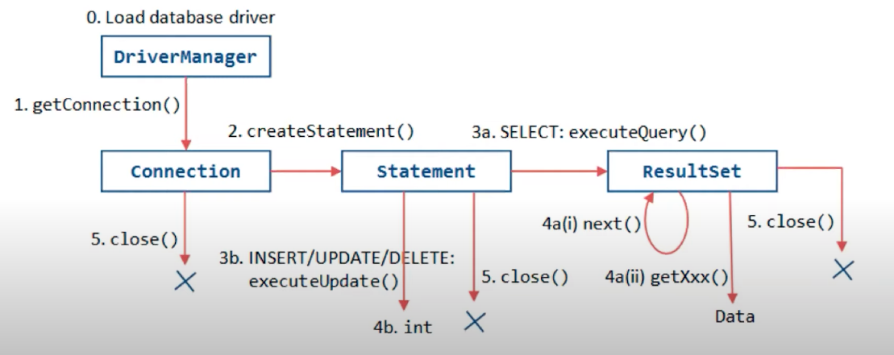
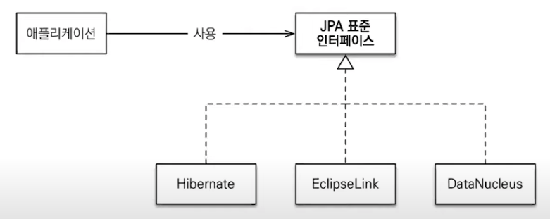
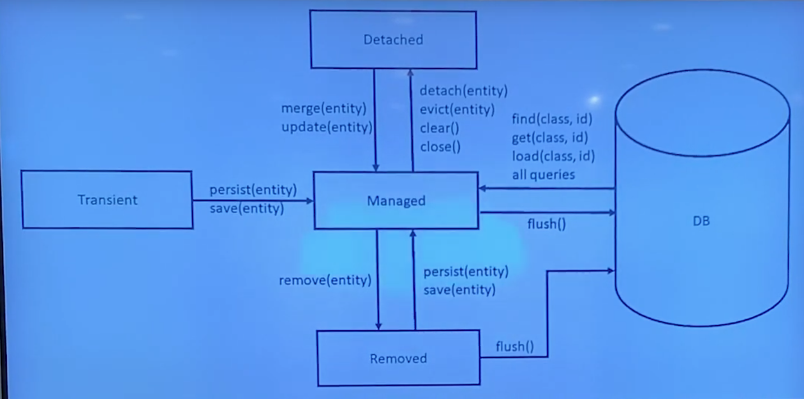
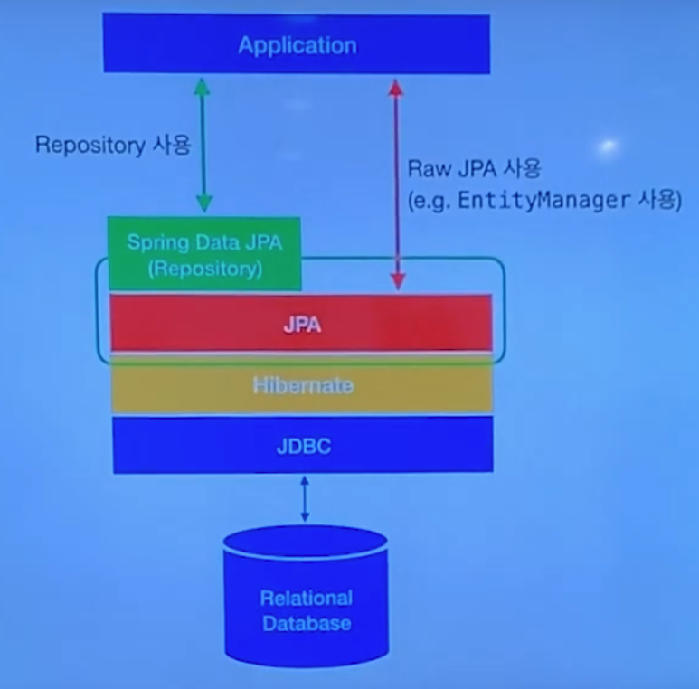

## 기술 출시 순서

## JDBC
  
JDBC API는 JAVA 진영의 __Database 연결 표준 인터페이스__ 입니다. 위 그림을 보시면 JDBC API 명세를 JDBC DriverManager가 구현하고, JDBC API에 맞게 동작할 수 있게 각 제품군에 따른 Driver가 만들어져 있습니다. 따라서, 사용하는 API를 변경하지 않고 Driver만 변경해주면 어떤 제품이든 사용이 가능해집니다.  

  
하지만 JDBC만을 이용하여 코딩하게 되면 위와 같은 작업을 직접 해주어야 하기 때문에 중복된 코드, 예외 처리 등 불편한 점이 많습니다.

## SQL MAPPER
Java Persistence Framwork중 하나인 SQL Mapper의 컨셉은 객체의 필드와 SQL문을 매핑하여 데이터를 객체화 하는 것인데 여기서 객체와 관계를 매핑하는 것이 아니라 직접 작성한 SQL문의 질의 결과와 객체의 필드를 매핑하여 데이터를 객체화 하는 것입니다. SQL Mapper에는 두 가지 기술이 있습니다.

### Spring JDBC
Spring JDBC에서는 JDBC template에 DataSource, 즉 커넥션을 위한 설정들을 주입시켜주고 template을 통해 데이터를 꺼내오면서 한단계 더 추상화했습니다. 이로 인해 Spring JDBC를 사용하면, 개발자가 연결, statement 준비와 실행, 트랜잭션 제어, 예외 처리 등을 따로 신경쓰지 않아도 되게 됩니다.

### MyBatis
SQL을 분리하는 것을 목적으로, Query를 Java에서 XML로 관리하는 방식입니다.  

## ORM(Object Relational Mapping)

>데이터베이스 연결 -> JDBC 등장 -> String으로 쿼리 관리 불편 -> MyBatis 등장 -> 객체지향적으로 구현된 코드를 관계형 데이터베이스에 엮는 것과 쿼리 작성 등의 불편 -> ORM 등장

작성하는 코드는 객체지향이고, 관계형 데이터베이스는 데이터 중심의 구조를 갖고 있기 때문에 추상화, 상속, 다형성같은 개념을 갖는 객체를 데이터베이스에 직접 저장, 조회하기에는 어려움이 있습니다. 따라서 각각 지향하는 목적이 다르기 때문에 패러다임 불일치가 발생하여 ORM이 탄생하게 됩니다. ORM(Object Relational Mapping)은 말 그대로 객체와 관계형 DB를 맵핑하는 것입니다.  
ORM은 객체간의 관계를 바탕으로 SQL문을 자동으로 생성하고, 직관적인 코드로 데이터를 조작할 수 있도록 합니다.

### JPA
  
객체지향의 복잡한 구조를 데이터베이스에 어떻게 하면 넣을 수 있을까 하는 __API 명세가 JPA 인퍼테이스__ 입니다. 그리고 해당 인터페이스를 구현한 __구현체가 Hibernate__ , EclipseLink, DataNucleus 입니다.  

### EntityManager와 영속성 컨텍스트
  
ORM의 핵심 모델은 EntityManager과 영속성 컨텍스트입니다. EntityManager는 위 그림과 같이 여러 가지 메서드를 사용해 말 그대로 어떤 엔티티 하나를 Manage(관리)합니다. Hibernate는 컨텍스트를 Managed, Detached, Removed, Transient 4개로 분리합니다. 새로운 엔티티를 persist 해주면 영속성 컨텍스트로 올라가고 EntityManager은 해당 엔티티를 관리하게 됩니다. flush를 하게 되면 이때 SQL이 생성되어 DB에 들어가게 됩니다. 이를 통해 Lazy Loading, Dirty Checking, Caching 등이 가능해 집니다.

### Spring Data JPA

일반적으로 개발자들이 사용하게 되는 JPA는 Spring Data JPA입니다. EntityManager 사용이 복잡하고 번거로운 부분이 많으니 이를 Repository라는 개념으로 한 단계 더 추상화한 것이 Spring Data JPA입니다.

### Spring Data JDBC
  
Spring Data JDBC는 Spring Data JPA와 달리 엔티티 매니저를 사용하지 않고 간단하게 접근하자는 컨셉에서 나오게 되었습니다. 따라서, 위와 같이 Hibernate를 사용하지 않고 JDBC API를 스스로 구현했습니다.

  

__참고__  
<a href="https://www.youtube.com/watch?v=1grtWKqTn50&list=PLo0ta52hn1uHQ5iQ3hAeRoMUeLJFIeRew" target="_blank"> [10분 테코톡] 🧘‍♂️코즈의 JDBC, SQLMAPPER, ORM</a>  
<a href="https://www.youtube.com/watch?v=VTqqZSuSdOk&list=PLo0ta52hn1uHQ5iQ3hAeRoMUeLJFIeRew" target="_blank"> [10분 테코톡] ⏰ 아마찌의 ORM vs SQL Mapper vs JDBC</a>
