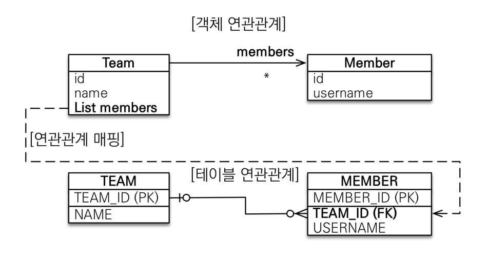

## 다양한 연관관계 
### 다대일
#### 단방향


+ 가장 많이 사용하는 연관관계
+ 다대일 중 다에 @ManyToOne 붙여서 다대일을 명시
+ 다대일 중 다에 @JoinColumn 으로 FK 명시

```kotlin
@Entity
class Member(
    name: String,
    team: Team,
) : BaseEntity() {

    @Id
    @GeneratedValue(strategy = GenerationType.IDENTITY)
    @Column(name = "member_id")
    var id: Long? = null
        protected set

    var name: String = name

    @ManyToOne
    @JoinColumn(name = "team_id")
    var team: Team = team
}

@Entity
class Team(
  name: String,
) : BaseEntity() {

  @Id
  @GeneratedValue(strategy = GenerationType.IDENTITY)
  @Column(name = "team_id")
  var id: Long? = null
    protected set

  var name: String = name
}
```

#### 양방향


+ 다대일 단방향에서 테이블은 변화없이 일에서 다쪽으로 단방향 추가한 상태 -> 양쪽을 서로 참조하도록 개발
+ 다대일 중 다에는 단방향과 마찬가지로 @ManyToOne, @JoinColumn
+ 단방향과 다르게 다대일 중 일에는 @OneToMany(mappedBy="")를 붙여줌으로써 양방향임을 명시해주고 mappedBy로 연관관계 주인 명시
    - 다대일 중 일에 mappedBy를 명시해주면서 다를 연관관계 주인으로 지정

```kotlin
@Entity
class Member(
    name: String,
    team: Team,
) : BaseEntity() {

    @Id
    @GeneratedValue(strategy = GenerationType.IDENTITY)
    @Column(name = "member_id")
    var id: Long? = null
        protected set

    var name: String = name

    @ManyToOne
    @JoinColumn(name = "team_id")
    var team: Team = team
}

@Entity
class Team(
  name: String,
  members: MutableList<Member> = mutableListOf()
) : BaseEntity() {

  @Id
  @GeneratedValue(strategy = GenerationType.IDENTITY)
  @Column(name = "team_id")
  var id: Long? = null
    protected set

  var name: String = name

  @OneToMany(mappedBy = "team")
  var member: MutableList<Member> = members
}
```

### 일대다
대부분 다대일 관계를 사용하고 일대다는 거의 사용하지 않습니다. 일대다의 경우 객체 관계에서는 일쪽에 세팅을 진행하게 되면서 마치 FK가 일쪽에 있는 것처럼 보입니다. 하지만 실제로 DB 테이블 관계에서는 FK는 다쪽에 존재합니다. 따라서 객체 관계에서 세팅되어 있는 일쪽의 데이터를 수정하게 되면 실제로는 DB 테이블의 다쪽 테이블로 쿼리가 나가게 됩니다. 따라서 확인하기도 어렵고 여러 개의 테이블을 다룰 때는 복잡해질 뿐만 아니라 성능 이슈도 있기 때문에 일대다보다는 **다대일 관계를 권장**합니다.

#### 단방향


+ 일대다 중 일이 연관관계의 주인
+ DB 테이블에는 항상 다쪽에 외래 키가 있기에 객체기준에서 보면 반대편 테이블의 외래 키를 관리하는 특이한 구조
+ 일에 @OneToMany, @JoinColumn -> 객체 기준 일쪽에서 FK를 매핑시켰기 때문에 일쪽에서 작업하면 DB 테이블 상으로는 다쪽 테이블로 쿼리가 나가므로 실무에서 확인하기 힘들 수가 있습니다.
+ @JoinColumn 반드시 사용, 사용 하지 않으면 조인 테이블 방식으로 중간에 테이블이 추가됨
  + JoinColum에는 Many쪽 테이블에 생성될 컬럼 명으로 One쪽의 id 컬럼명을 명시해줍니다.
  + 일대다 단방향 관계에서는 @joinColum을 사용하지 않으면 두 테이블의 id값만을 컬럼으로 가진 매핑 테이블이 자동으로 생성된다. 객체 관계에서는 보이지 않은 DB 테이블이 생성되는 것이므로 필요하지 않다면 @joinColumn을 명시하는 것이 좋습니다.


```kotlin
@Entity
class Member(
  name: String,
) : BaseEntity() {

  @Id
  @GeneratedValue(strategy = GenerationType.IDENTITY)
  @Column(name = "member_id")
  var id: Long? = null
    protected set

  var name: String = name
}

@Entity
class Team(
    name: String,
    members: MutableList<Member> = mutableListOf()
) : BaseEntity() {

    @Id
    @GeneratedValue(strategy = GenerationType.IDENTITY)
    @Column(name = "team_id")
    var id: Long? = null
        protected set

    var name: String = name

    @OneToMany
    @JoinColumn(name = "team_id")
    var member: MutableList<Member> = members
}
```


<br>

#### 양방향


+ 공식적으로 존재하진 않으나 약간의 트릭을 써서 만든 것입니다. 따라서 사용하지 않는 것이 좋습니다.
+ 일에는 단방향과 마찬가지로 @OneToMany, @JoinColumn
+ 다쪽에는 @ManyToOne, @JoinColumn(insertable=false,updatable=false)
    - 공식적으로 존재하는게 아니기에 mappedBy를 사용할 수 없고, 속성으로 읽기 전용으로 만들어준 것입니다.

```kotlin
@Entity
class Member(
    name: String,
    team: Team,
) : BaseEntity() {

    @Id
    @GeneratedValue(strategy = GenerationType.IDENTITY)
    @Column(name = "member_id")
    var id: Long? = null
        protected set

    var name: String = name

    @ManyToOne
    @JoinColumn(name = "team_id", insertable = false, updatable = false)
    var team: Team = team
}

@Entity
class Team(
  name: String,
  members: MutableList<Member> = mutableListOf(),
) : BaseEntity() {

  @Id
  @GeneratedValue(strategy = GenerationType.IDENTITY)
  @Column(name = "team_id")
  var id: Long? = null
    protected set

  var name: String = name

  @OneToMany
  @JoinColumn(name = "team_id")
  var member: MutableList<Member> = members
}
```


### 일대일
+ 주 테이블이나 대상 테이블 중에 외래 키를 선택해서 넣으면 됩니다.
+ 일대일로 만들어야 하니 외래 키에 데이터베이스 __유니크 제약조건을 추가__ 해줘야 합니다. -> 외래 키를 설정하는 joinColumn 부분에서 옵션으로 unique = true로 주면 됩니다.


#### 주 테이블 외래 키 단방향


+ 주 테이블에 외래 키를 설정한 단방향 모델
    - 주 테이블이란 주로 사용하는 테이블
+ 외래 키를 설정한 주 테이블의 객체에 @OneToOne, @JoinColumn

```kotlin
@Entity
class Team(
  name: String,
) : BaseEntity() {

  @Id
  @GeneratedValue(strategy = GenerationType.IDENTITY)
  @Column(name = "team_id")
  var id: Long? = null
    protected set

  var name: String = name
}

@Entity
class Member(
    name: String,
    team: Team,
) : BaseEntity() {

    @Id
    @GeneratedValue(strategy = GenerationType.IDENTITY)
    @Column(name = "member_id")
    var id: Long? = null
        protected set

    var name: String = name

    @OneToOne
    @JoinColumn(name = "team_id", unique = true)
    var team: Team = team
}
```


#### 주 테이블 외래 키 양방향


+ 외래 키를 설정한 주 테이블의 객체에는 @OneToOne, @JoinColumn
+ 반대편 객체에는 @OneToOne(mappedby="")

```kotlin
@Entity
class Member(
    name: String,
    team: Team,
) : BaseEntity() {

    @Id
    @GeneratedValue(strategy = GenerationType.IDENTITY)
    @Column(name = "member_id")
    var id: Long? = null
        protected set

    var name: String = name

    @OneToOne
    @JoinColumn(name = "team_id", unique = true)
    var team: Team = team
}

@Entity
class Team(
  name: String,
  member: Member,
) : BaseEntity() {

  @Id
  @GeneratedValue(strategy = GenerationType.IDENTITY)
  @Column(name = "team_id")
  var id: Long? = null
    protected set

  var name: String = name

  @OneToOne(mappedBy = "team")
  var member: Member = member
}
```

#### 대상 테이블 외래 키 단방향


일대다에서 사용했던 관계랑 똑같다고 보면 되지만 일대일에서는 이런 관계를 지원하지 않습니다. 


#### 대상 테이블 외래 키 양방향


주 엔티티 대신 대상 엔티티를 연관관계 주인으로 만들어서 대상 테이블에서 외래 키를 관리하도록 하면 됩니다.

```kotlin
@Entity
class Member(
    name: String,
    team: Team,
) : BaseEntity() {

    @Id
    @GeneratedValue(strategy = GenerationType.IDENTITY)
    @Column(name = "member_id")
    var id: Long? = null
        protected set

    var name: String = name

    @OneToOne(mappedBy = "member")
    var team: Team = team
}

@Entity
class Team(
  name: String,
  member: Member,
) : BaseEntity() {

  @Id
  @GeneratedValue(strategy = GenerationType.IDENTITY)
  @Column(name = "team_id")
  var id: Long? = null
    protected set

  var name: String = name

  @OneToOne
  @JoinColumn(name = "member_id")
  var member: Member = member
}
```

### 주 테이블 외래 키 vs 대상 테이블 외래 키
+ 주 테이블 외래 키
    - 대부분의 비즈니스는 웬만하면 주 테이블은 조회해와야 하기 때문에 주 테이블에 외래 키를 두게 되면 주 테이블만 조회해도 대상 테이블에 데이터가 있는 지 확인할 수 있고 JPA 매핑이 편리합니다.
    - 값이 없으면 외래 키에 null 허용하는 단점
    - 객체지향 개발자 선호
+ 대상 테이블 외래 키
    - 양방향 구조만 지원
    - 일대일에서 일대다 관계로 변경할 때 테이블 구조 유지 장점
    - 프록시 기능의 한계로 지연 로딩으로 설정해도 항상 즉시 로딩 되는 단점
    - 데이터베이스 개발자 선호

<br>

### 다대다


설명하기에 앞서, 다대다 관계는 실무에서 피하는 것이 권장됩니다. @ManyToMany 애노테이션을 사용하면 엔티티 없이 중간에 테이블을 하나 만들어서 매핑해주는데 사실 실무에서는 중간에 여러가지 변경, 추가 작업이 있기 때문에 이렇게 보이지 않는 테이블을 묶어서 만들어 놓으면 수정작업을 할 수가 없습니다. 해결 방안으로는 @ManyToMany를 @OneToMany @ManyToOne 관계로 풀어서 중간에 연결 테이블용 엔티티를 추가로 만들어서 사용하는 것입니다. 그럼 중간 테이블이 엔티티로 추가되었기 때문에 변경, 추가 작업같은 수정작업을 할 수 있게 됩니다. 따라서 @ManyToMany 애노테이션은 지양하고 다대다 관계는 일대다 다대일 관계로 풀어서 사용하는 것이 좋습니다.

만약 중간 테이블을 따로 건들일이 없어서 ManyToMany를 사용하게 된다면 다음과 같이 사용할 수 있습니다.
```kotlin
@Entity
class Member(
    name: String,
    team: MutableList<Team> = mutableListOf(),
) : BaseEntity() {

    @Id
    @GeneratedValue(strategy = GenerationType.IDENTITY)
    @Column(name = "member_id")
    var id: Long? = null
        protected set

    var name: String = name

    @ManyToMany
    @JoinTable(
        name = "member_team", // 매핑 테이블 명
        joinColumns = [JoinColumn(name = "member_id")], // 매핑 테이블에 현재 객체 표기 id
        inverseJoinColumns = [JoinColumn(name = "team_id")], // 매핑 테이블에 대상 객체 표기 id
    )
    var team: MutableList<Team> = team
}
```

## 프록시와 연관관계 관리
### 프록시를 사용해야하는 이유


위와 같이 Member에 프로퍼티로 Team을 가지고 있다고 하고 member 객체를 만들어서 값을 다 세팅했다고 가정해봅시다. 그럼 em.find로 member을 조회하면 쿼리로 member와 team을 같이 땡겨오게 됩니다. 그런데 만약 지금은 team은 사용하지 않을 것이고 member의 username 프로퍼티만 사용할 것이 었다고 한다면 team은 굳이 조회하지 않아도 되는데 조회하게 된 셈입니다. 그렇다면 한 번에 땡겨오지 말고 필요한 순간에 땡겨오게 하는 방법을 고민하게 되는데 그것이 바로 프록시의 역할입니다.

### 프록시 기초

em.find을 사용하면 DB를 통해 쿼리를 날려 실제 엔티티 객체를 조회합니다. 반면에 em.getReference()를 사용하면 DB로 쿼리를 날리지 않고 파라미터로 넣어준 클래스를 상속받은 가짜(프록시) 엔티티를 만들어서 프록시 객체가 영속성 컨텍스트에 들어갑니다. 파라미터로 받은 클래스를 상속받았기 때문에 모든 기능이 같고 다른점은 Entity target이라는 필드를 가지고 있는 것입니다. 이는 실제 객체의 참조를 보관하는 곳입니다. 처음 em.getReference 시점에 받아온 프록시 엔티티는 target 값이 비어있습니다.


처음 getReference를 하면 프록시 객체가 null을 참조하고 있다가 사용자가 객체의 프로퍼티를 사용하기 위해 메서드를 호출하면 프록시는 영속성 컨텍스트에 초기화 요청을 보내고 DB에서 실제 Entity를 조회한 뒤, 참조값을 target에 세팅해줍니다. 이것을 지연로딩(Lazy Loading)이라고 합니다. 

참고로 @Id 필드인 pk를 조회하는 경우에는 영속성 컨텍스트에 초기화를 요청하지 않습니다. 초기에 파라미터로 id값을 넘겨줬기 때문에 id값은 이미 알고 있기 때문에 DB에 쿼리를 보낼 필요가 없기 때문입니다.


### 즉시 로딩과 지연 로딩
```kotlin
@Entity
class Member(
  name: String,
  team: Team,
) : BaseEntity() {

  @Id
  @GeneratedValue(strategy = GenerationType.IDENTITY)
  @Column(name = "member_id")
  var id: Long? = null
    protected set

  var name: String = name

  // @ManyToOne(fetch = FetchType.EAGER) // 즉시 로딩
  @ManyToOne(fetch = FetchType.LAZY) // 지연 로딩
  @JoinColumn(name = "team_id")
  var team: Team = team
}
```
* FetchType.EAGER : 즉시 로딩
  * 하나의 엔티티를 조회할 때, 연관관계를 가지고 있는 다른 엔티티도 같이 조회하게 되면서 한번의 find 메서드가 여러 번의 쿼리를 DB에 요청하게 됩니다.
  * @ManyToOne, @OneToOne -> XXXToOne은 default가 즉시 로딩입니다.
  * 하나의 find 메서드가 여러 번의 쿼리를 DB에 요청하므로 하나의 메서드가 N개의 쿼리를 날리는 N+1 문제가 발생합니다.
    * 예를 들면, member만 필요해서 find 쿼리를 날렸는데 즉시 로딩으로 설정되어 있으면 만약 10개의 member을 찾았다면 안에 있는 team이 즉시 로딩이므로 10개의 쿼리가 더 나갑니다.
* FetchType.LAZY : 지연 로딩
  * 하나의 엔티티를 조회할 때, 연관관계를 가지고 있더라도 요청한 하나의 엔티티만 조회하고 나머지는 프록시로 가져오게 되면서 한번의 find 메서드가 한 번의 쿼리만 DB에 요청합니다.
  * @OneToMany, @ManyToMany -> XXXToMany은 default가 지연 로딩입니다.

휴먼 에러를 방지하기 위해, 우선적으로 지연 로딩으로 명시적으로 설정해두고 필요에 따라 fetch 조인이나 엔티티 그래프 기능을 사용하여 즉시 로딩하는 것이 권장됩니다.

### OneToOne 양방향 관계 Lazy 로딩
OneToOne 양방향 관계에서는 연관관계 주인이 호출할 때는 Lazy가 동작하지만, 주인이 아닌 곳에서 호출하게 되면 Lazy가 동작하지 않습니다. 이유는 프록시는 null을 감쌀 수 없기 때문에 프록시의 한계로 나타나는 문제 입니다.


User과 Cart가 일대일 양방향관계이고 연관관계 주인은 User라고 가정해봅시다. Cart 테이블을 보면 Cart는 User_Id 값을 알지 못합니다. 알기 위해서는 User 테이블을 조회해야하는데 이렇게 되면 User 테이블을 조회해야하기 때문에 Lazy의 의미가 없어집니다. 그래서 Lazy로 설정해도 Eager로 동작하는 것입니다.

그렇다면 OneToMany의 경우에도 마찬가지가 아닐까 라고 생각할 수 있지만 OneToMany는 Lazy가 정상 동작합니다. 이유는 컬렉션의 경우는 비어있다고 isEmpty로 표현이 가능하지만, OneToOne은 없다면 Null값이 들어가기 때문입니다.


## 영속성 전이(cascade)
특정 엔티티를 영속 상태로 만들 때 연관된 엔티티도 함께 영속 상태로 만들고 싶을 때 사용합니다. 영속성 전이는 연관관계 매핑하는 것과 아무런 관련이 없고 영속화(persist)를 한 번에 처리하기 위한 편의를 위해 제공하는 것입니다.

### 영속성 전이를 사용하는 이유
```kotlin
@Entity
class Team(
  name: String,
  members: MutableList<Member> = mutableListOf(),
) : BaseEntity() {

  @Id
  @GeneratedValue(strategy = GenerationType.IDENTITY)
  @Column(name = "team_id")
  var id: Long? = null
    protected set

  var name: String = name

  @OneToMany(mappedBy = "team")
  var member: MutableList<Member> = members
}

@Entity
class Member(
  name: String,
  team: Team,
) : BaseEntity() {

  @Id
  @GeneratedValue(strategy = GenerationType.IDENTITY)
  @Column(name = "member_id")
  var id: Long? = null
    protected set

  var name: String = name

  @ManyToOne
  @JoinColumn(name = "team_id")
  var team: Team = team
}
```
Member와 Team이 다대일 양방향 관계로 매핑되어 있고 member 2개와 team을 save하려면 team을 먼저 save하고 save한 team을 각 member에 매핑한 뒤 save하는 순차적인 과정이 필요합니다. 만약 team을 save할 때, member 2개도 같이 save 된다면 불필요한 코드가 줄어들 것입니다. 이런 기능을 제공하는 것이 영속성 전이(casecade) 입니다.

```kotlin
@Entity
class Member(
  name: String,
  team: Team? = null,
) : BaseEntity() {

  @Id
  @GeneratedValue(strategy = GenerationType.IDENTITY)
  @Column(name = "member_id")
  var id: Long? = null
    protected set

  var name: String = name

  @ManyToOne
  @JoinColumn(name = "team_id")
  var team: Team? = team
    protected set

  fun changeTeam(team: Team) {
    this.team = team
    team.members.add(this)
  }
}

@Entity
class Team(
  name: String,
  members: MutableList<Member> = mutableListOf(),
) : BaseEntity() {

  @Id
  @GeneratedValue(strategy = GenerationType.IDENTITY)
  @Column(name = "team_id")
  var id: Long? = null
    protected set

  var name: String = name

  @OneToMany(mappedBy = "team", cascade = [CascadeType.ALL])
  val members: MutableList<Member> = members

  fun addMembers(newMembers: List<Member>) {
    for (member in newMembers) {
      member.changeTeam(this)
    }
  }
}
```
위 코드와 같이 One 쪽에 매핑 애노테이션의 속성으로 cascade의 값을 줄 수 있습니다. 값으로는 ALL, PERSIST, REMOVE, MBERGE, REFRECH, DETACH가 있는데 ALL하면 모든 속성이 적용되고 PERSIST하면 영속만, REMOVE하면 삭제만 적용됩니다. 위와 같이 CASCADE를 사용했다면 team을 save한다면 team을 먼저 save하고 내부에 cascade 속성값이 persist 또는 all이라면 해당 프로퍼티에 대해서도 save를 진행합니다.

```kotlin
@Service
@Transactional
class SampleService(
  private val memberRepository: MemberRepository,
  private val teamRepository: TeamRepository,
) {

  fun test() {
    val team = Team(name = "team").apply {
      addMembers(listOf(Member(name = "member1"), Member(name = "member2")))
    }

    teamRepository.save(team)
  }
}
```
정상적으로 cascade가 동작하기 위해서는 Team과 member 객체 양쪽에 서로가 매핑되어 있어야 합니다.


### 주의사항
+ cascade는 참조하는 곳이 하나일 때만 사용해야 합니다. 
  + 위의 코드에서는 Team 엔티티만이 Member를 소유합니다. 만약 Club이라는 엔티티가 있고 이 또한 Member 엔티티를 소유한다면 cascade는 사용하면 안됩니다. 한 쪽에서 제거할 때 cascade로 인해 지워졌는데 다른 쪽에서 참조하고 있다면 문제가 생길 수 있기 때문입니다.
+ __영속성 전이 cascade는 연관관계 매핑하는 것과 전혀 관련이 없습니다.__
  + 연관관계 매핑과 관련이 있었다면 team의 members 프로퍼티는 읽기전용이므로 team을 delete했을때 member는 db에 그대로 있어야 합니다. 하지만 cascade는 매핑과 관련이 없기 때문에 member에도 delete 쿼리를 날립니다.

## 고아 객체 제거
고아 객체는 부모 엔티티와 연관관계가 끊어진 자식 엔티티를 말합니다.

```kotlin
@Entity
class Team(
  name: String,
  members: MutableList<Member> = mutableListOf(),
) : BaseEntity() {

  @Id
  @GeneratedValue(strategy = GenerationType.IDENTITY)
  @Column(name = "team_id")
  var id: Long? = null
    protected set

  var name: String = name

  @OneToMany(mappedBy = "team", cascade = [CascadeType.ALL], orphanRemoval = true)
  val members: MutableList<Member> = members
}

@Service
@Transactional
class SampleService(
  private val teamRepository: TeamRepository,
) {

  fun delete() {
    val team = teamRepository.findByIdOrNull(1) ?: throw RuntimeException("not found")
    team.members.clear()
  }
}
```
위와 같이 매핑 애노테이션의 속성으로 orphanRemoval = true 을 세팅했습니다. 만약 find로 Team를 조회해서 members의 인덱스를 제거했다고 해봅시다. 원래는 연관관계의 주인이 아니기 때문에 수정쿼리가 날라가지 않아야 하지만 orphanRemoval 속성에 의해 db에 member 제거 쿼리가 나갑니다.  

### 주의점
+ cascade와 마찬가지로 참조하는 곳이 하나일 때만 사용해야 한다.
+ @OneToXXX만 사용 가능합니다. 그래야만 자식처럼 하나를 가지거나(OneToOne) 혹은 자식을 여러명 List로(OneToMany) 가질 수 있기 때문입니다.
+ find로 team를 찾아와서 em.remove로 찾은 team를 지워버리면 안에 있는 member도 지워집니다.
  - 여기서 그럼 cascadeType.REMOVE를 쓰지 왜 orphanRemoval을 쓰냐고 생각할 수 있는데 orphanRemoval은 리스트에서 개별적으로 제거한 경우에도 부모와 연결이 끊어진 것으로 판단해서 개별적인 delete 쿼리가 가능합니다.


## 정리
### 연관관계 설계 방식
* 연관관계 모델링 초기에는 최대한 단방향 매핑으로 설계를 끝내야 합니다.
  * 여러 연관관계들이 있지만 단방향 매핑만으로도 이미 연관관계 매핑은 완료된 상태로 볼 수 있습니다.  
  * 양방향 매핑은 반대 방향으로 조회 기능만 추가된 것일 뿐으로 개발상 편의와 조회를 위한 것으로 단방향 매핑 이후 필요할 때 추가하는 방향이 좋습니다.
  * 연관관계 매핑은 oneToXX 보다 ManyToXX 으로 다대일 관계를 사용하는 것이 좋습니다.
* 연관관계의 주인은 외래 키가 있는 곳(일보다는 다쪽)으로 지정하는 것이 좋습니다.
  * db 테이블 관점과 객체 관점에서 헷갈리는 부분도 많고, 성능 이슈도 있기 때문에 외래 키가 있는 곳을 주인으로 지정하는 것이 좋습니다.
* 어떤 연관관계든 fetchType은 Lazy로 명시해두는 것이 좋습니다.
  * XXToOne은 Eager, XXToMany은 Lazy가 default 값입니다. 휴먼 에러를 유발할 수 있으므로 fetchType은 명시해두는 것이 좋습니다.
  * 웬만하면 Lazy로 두고 필요할때 Eager로 두는 것이 좋습니다.

### 연관관계의 주인 주의사항
* 연관관계 주인이 아닌 쪽은 읽기만 가능합니다.
  * mappedBy로 명시된 객체에서 수정을 하고 save를 해도 DB에는 반영되지 않습니다.(쓰기가 DB에 반영되지 않습니다.) 
* 연관관계 주인아 이닌 쪽은 읽기만 가능하므로 값을 세팅하지 않아도 될까?
  * member, team 양방향 연관관계에서 member가 연관관계 주인이라고 해봅시다. team을 만들고 members를 세팅하지 않은 상태에서 save하고 member를 만들어 team을 세팅하고 save했다고 한다면 개발자는 meber가 연관관계 주인이고 team을 세팅해서 save했으니 db에는 team 테이블에 members가 반영되었다고 생각할 수 있습니다. entityManager에서 flush가 되었다면 맞는 말입니다. 하지만 flush되지 않은 상태에서 team을 find하면 영속성 컨텍스트의 1차 캐시에서 데이터를 가져오므로 member가 비어있는 team 객체를 가져오게 됩니다. 또한, 테스트 케이스에서는 jpa 없이도 가능해야하는데 jpa가 없으면 당연히 한쪽에만 값을 넣은 것이니 반대쪽 값은 null이 됩니다.
  * 위와 같은 경우를 위해 양방향 관계의 연관관계 주인이 아닌 쪽에도 값을 세팅해주는 것이 올바를 수 있습니다.

```kotlin
// 연관관계 값 세팅 편의 메서드 -> 연관관계의 주인 or 대상이든 편한 쪽에 작성하면 됩니다.
public void changeTeam(Team team){
  this.team = team;
  team.getMembers().add(this);
}
```

### cascade와 고아 객체
* 영속성 전이 + 고아 객체 = 생명 주기 입니다.
 * cascade와 고아 객체를 사용하게 되면 부모와 자식 관계에서 생명주기를 부모가 가져가게 됩니다.
* 영속성 전이와 고아 객체는 참조가 한 곳일때만 사용해야 합니다.


__참고__  
<a href="https://www.inflearn.com/course/ORM-JPA-Basic/dashboard" target="_blank"> 자바 ORM 표준 JPA 프로그래밍 - 기본편</a>


