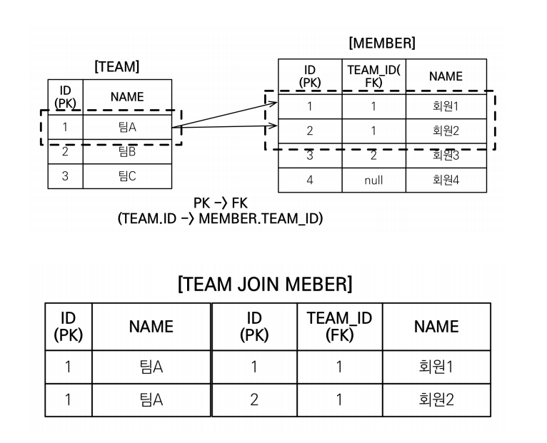

## @Transactional(readOnly = true)
service layer에서 @Transactional을 대부분 사용합니다. 데이터 변경이 있는 경우 @Transactional을 붙이고 데이터 조회만 하는 경우라면 @Transactional(readOnly = true)를 명시합니다. readOnly가 true로 붙은 조회용의 경우 스냅샷이 생기지 않습니다. 즉, 영속성 컨텍스트에서 관리는 하고 있지만 dirty checking을 안하기 때문에 수정해도 DB에 결과가 반영되지 않습니다. 

## N+1
N+1 은 엔티티를 조회할 때, 해당 엔티티에 연관관계를 갖는 다른 엔티티를 프록시로 가져오면서(LazyLoading) 실제 데이터에 접근하는 시점에 해당 엔티티를 가져오기 위해 또 다른 조회 쿼리를 보내게 되는 현상을 말합니다. 즉, 엔티티를 조회하기 위한 find 메서드 하나를 호출 했더니 결과적으로 1개의 쿼리가 아닌 추가적인 N개의 쿼리가 더 발생한다는 의미입니다.  

N+1 문제는 fetch join / @EntityGraph / Batch Size 3가지 방식으로 해결할 수 있습니다.

**fetch join & @EntityGraph**
```java
public interface MemberRepository extends JpaRepository<Member,Long> {
    @Query("select m from Member m join fetch m.team where m.name = :name")
    Optional<Member> findByName(String name);

    @EntityGraph(attributePaths = {"team"})
    List<Member> findByUsername(String username)
}
```
fetch join을 사용하면 entity의 fetch type를 LAZY로 지정했더라도 EAGER로 지정한 것으로 인식하여 한 번에 데이터를 가져옵니다.(fetch join이라고 했지만 jpql에서는 join fetch, left join fetch 이런 순서의 문법입니다.) entityGraph는 fetch join을 더 손쉽게 사용할 수 있는 방식입니다. @EntityGraph(attributePaths = {"필드명"}) 으로 페치 조인할 필드를 넣어주면 페치 조인해서 가져올 수 있습니다. 둘의 차이가 있다면 entityGraph는 left outer join이고, fetch join은 명시하지 않는 경우 inner join으로 수행됩니다.  


**Batch Size**
batch size는 프록시로 가져온 연관관계 엔티티를 실제 접근하는 시점에 batchSize로 설정한 개수만큼 in 절을 사용해서 한번에 가져오는 방식입니다. fetch join 방식에 비해 몇 번의 쿼리가 더 발생합니다.

```yml
# application.yml
spring:
  jpa:
    properties:
      hibernate:
        default_batch_fetch_size: 1000
```
```java
@BatchSize(size=100)
@OneToMany(mappedBy="team")
```

batchSize는 application.yml에 전역적으로 설정해줄 수도 있고, 개별적으로 엔티티의 연관관계 매핑 애노테이션에 @BatchSize 애노테이션을 추가해 개별적으로 지정해줄 수도 있습니다. DB에 따라 IN절 파라미터를 1000으로 제한하기도 하므로 batchSize의 크기는 100 ~ 1000 사이의 값이 권장되고 애플리케이션 부하에 따라 판단해야 합니다. 애매하다면 100 ~ 500 사이의 값을 사용합니다.  

그렇다면 fetch join이 더 좋은 방식인 것이 아닌가 할 수 있지만 fetch join에는 한계가 존재합니다.  


## fetch 조인 한계
+ __fetch 조인 대상에는 별칭을 줄 수 없습니다.__ = __따라서 페치 조인의 대상을 where문과 on절에서 사용할 수 없습니다.__
    - __fetch 조인은 나와 연관된 것들을 다 끌고 오겠다는 의미입니다.__ 대상에 별칭을 주고 그것을 활용해서 where문을 통해 몇개를 걸러서 가져오고 싶다고 한다면 fetch조인으로 접근하는게 아니라 따로 조회하는 것이 의도에 맞습니다. 
    - jpa에서 의도한 설계는 .을 통해 객체 그래프를 이어나간다면 모든 것에 접근할 수 있어야 한다는 것입니다. 그런데 fetch join에서 대상에 별칭을 주고 where로 데이터를 걸러서 가져온다면 특정 데이터에는 접근하지 못하게 됩니다. 객체 그래프라는 건 데이터를 다 조회한다는게 의도된 설계입니다. 따라서 절대로 fetch 조인 대상에는 별칭을 주면 안됩니다.
    - __따라서 페치 조인의 대상을 where문과 on절에서 사용할 수 없습니다.__
+ 둘 이상의 컬렉션은 fetch 조인 할 수 없습니다. -> __하나의 컬렉션과만 fetch join이 가능합니다.__
    + XXToOne과 같이 단일 관계의 자식 테이블에는 Fetch Join 여러 번 사용해도 됩니다. 하지만 XXToMany의 경우 2개 이상의 OneToMany 자식 테이블에 Fetch Join을 시도했을때 MultipleBagFetchException이 발생합니다.
    + 이유는, fetch join을 둘 이상의 컬렉션과 하게 되면 곱하기 곱하기가 되어 데이터의 정합성이 맞지 않기 때문입니다.
    + 해결책은 Batch Size를 이용하는 것입니다. 자주 사용하는 컬렉션 쪽에는 Fetch join을 걸어주고, 나머지는 Lazy Loading으로 가져오면서 Batch Size를 활용하는 것입니다.
+ 컬렉션을 fetch 조인하면 경우에 따라 페이징 API를 사용할 수 없습니다.
    - 일대일, 다대일 같은 단일 값 연관 필드는 fetch 조인해도 페이징 API가 사용 가능하지만. OneToMany의 경우에는 fetch join의 경우 페이징 API를 사용할 수 없습니다.


## oneToMany fetch join 페이징 
ManyToXX, OneToOne 관계에서는 fetch join 시 페이징 이슈가 없습니다. 하지만 OneToMany 관계의 경우 fetch join 시 페이징 이슈가 존재합니다.  



oneToMany의 경우 fetch join을 하게 되면 데이터가 뻥튀기가 됩니다. team 테이블에 팀A는 한개의 row만 있지만 fetch join을 하게 되면서 결과는 team은 2개의 row로 증가합니다. 중복을 제거하기 위해 distinct를 추가해도 데이터가 완전히 똑같지 않으므로 distinct만으로는 팀A 행을 한개의 row로 만들 수 없습니다. 그러나 JPA에서 distinct를 사용하는 경우 애플리케이션 단에서 pk를 기준으로 중복 제거를 시도합니다. 여기서 이슈가 되는 부분은 페이징입니다. DB에서는 distinct로 데이터가 걸러지지 않았고 애플리케이션에서 중복이 제거되기 때문에 DB는 데이터가 뻥튀기된 상태로 페이징을 처리하기 때문에 원하는대로 동작하지 않습니다.

```java
public interface TeamRepository extends JpaRepository<Team,Long> {
    @Query("select distinct t from Team t join fetch t.member where t.name = :name")
    Optional<Member> findByName(String name, Pageable page);
}
```
따라서 oneToMany의 fetch join의 결과값은 페이징을 사용할 수 없습니다. 또한 페이징이 아니더라도 데이터를 사용하기 위해서는 distinct를 명시해줘야 합니다. 

> hibernate 6.0 버전부터는 default로 distinct가 추가되므로 distinct를 명시하지 않아도 됩니다. https://docs.jboss.org/hibernate/orm/6.0/migration-guide/migration-guide.html#query-sqm-distinct


## Projection & DTO
DB에서 데이터를 가져올 때, 엔티티 전체 컬럼이 아닌 특정 컬럼만 가져오고 싶을 경우 사용합니다. fetch join으로 전체 컬럼이 아닌 일부의 컬럼만 가져올 때 유용할 수 있습니다. 하지만 실무에서는 대부분 사용하지 않습니다. 특정 로직에만 맞는 로직이 생성되기 때문에 재사용성이 떨어질 뿐더러 애초에 조인으로 엄청난 컬럼이 생겨날 정도로 도메인을 설계하지 않습니다. 그리고 몇 개의 컬럼만 가져온다고 해서 네트워크 성능이 비약적으로 증가하지도 않습니다.


## Page 방식에서 totalPages 최적화
Page방식에서는 전체 데이터의 개수를 구해주는데 이 데이터의 개수를 구하는 카운트 쿼리는 프로젝션만 count(id값)으로 변경되고 from 이후에는 기존 쿼리랑 동일합니다. 만약 기존 쿼리가 조인으로 인해 복잡해지면 카운트 쿼리도 조인되어 복잡한 쿼리가 나갑니다. 하지만 카운트 쿼리는 그냥 개수만 세면 되므로 join할 필요가 없는 경우도 있습니다. 이런 경우 카운트 쿼리를 분리해서 해결할 수 있습니다.
```java
public interface MemberRepository extends JpaRepository<Member,Long> {
    @Query(value = "select m from Member m left join m.team t",
        countQuery = "select count(m) from Member m")
    Page<Member> findByAge(int age, Pageable pageable);
}
```

## 벌크성 수정 쿼리
```java
public interface MemberRepository extends JpaRepository<Member,Long> {
    @Modifying(clearAutomatically = true)
    @Query("update Member m set m.age = m.age + 1 where m.age >= :age")
    int bulkAgePlus(@Param("age") int age);
}
```
+ @Modifying : 조회성 쿼리가 아니라는 것을 알려주는 것으로 JPA가 만들어 줄때 .getResultList가 아니라 .executeUpdate를 붙여주게 됩니다.
+ 벌크성 수정 쿼리는 영향 받은 데이터의 개수가 반환됩니다.
+ clearAutomatically = true : 쿼리 날린 후 영속선 컨텍스트 비워줍니다.
    - 벌크성 수정 쿼리는 영속성 컨텍스트를 무시하고 바로 DB에 날리기 때문에 영속성 컨텍스트와 DB 간의 불일치가 생깁니다. 따라서 벌크성 쿼리 이후에는 영속성 컨텍스트를 비워줘야하는데 이 옵션이 비워주는 역할을 합니다.


