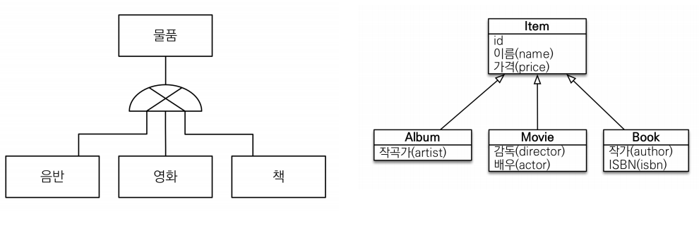
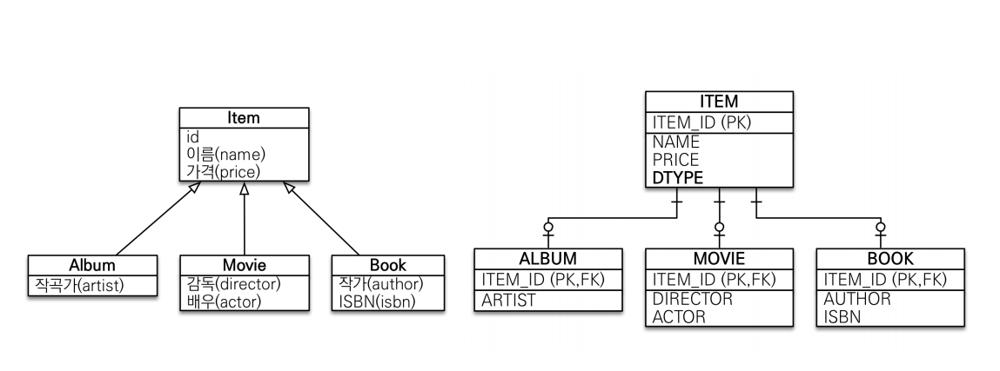
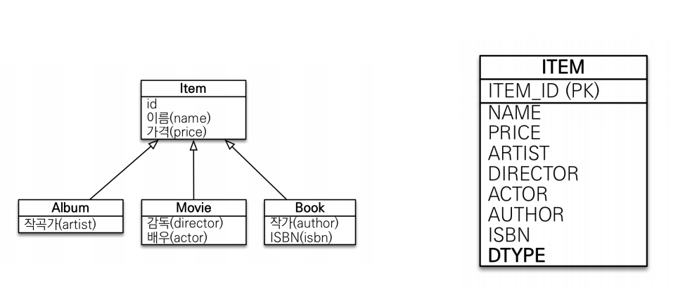
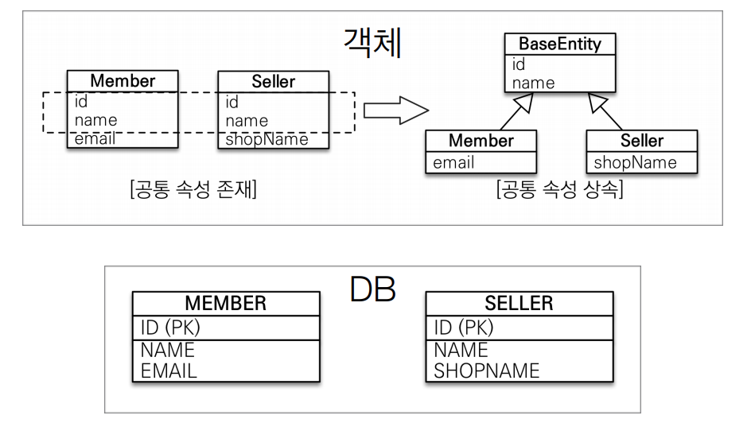
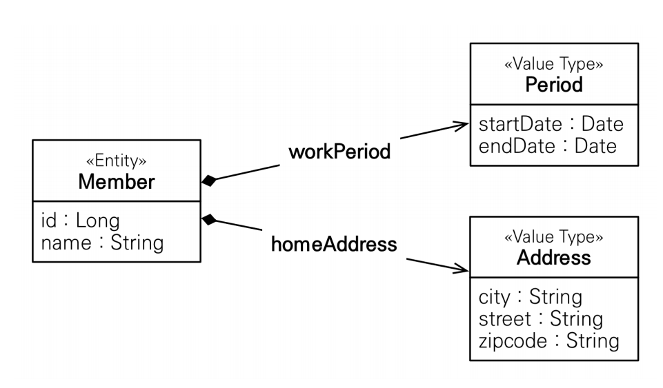

## 상속관계 매핑
관계형 데이터베이스는 상속 관계 개념은 없고 슈퍼타입 서브타입 관계라는 모델링 기법이 객체의 상속과 유사합니다. 그래서 상속 관계 매핑을 객체의 상속 구조와 DB의 슈퍼타입 서브타입 관계를 매핑하는 형식으로 진행합니다. 이에 대해 슈퍼타입 서브타입 논리 모델을 실제 물리 모델로 구현하는 3가지 전력이 있습니다.



객체 관점에서 Item은 혼자 사용되는 경우가 없는 추상 클래스이고, album, movie, book이 이를 상속받아서 사용하는 것이라고 가정합시다.

### 조인 전략


* 일반적으로 가장 많이 채택되는 전략입니다.
* 조회시에 join으로 인한 성능 저하가 있다.
* 추상 클래스와 구현 클래스 모두 별도의 테이블이 만들어집니다.
* 운영을 위해서 @DiscriminatorColumn으로 DTYPE열을 만들어주는게 좋습니다.

```java
@Entity
@Inheritance(strategy = InheritanceType.JOINED)
@DiscriminatorColumn // DTYPE 열 만들어주는 애노테이션 name 속성으로 DTYPE말고 다른 이름으로 변경 가능
// DTYPE은 만들어주는게 좋음운영하기 편하기 위해
public abstract class Item {// Item을 단일로 사용하는 경우는 절때없음 -> 추상 클래스

    @Id @GeneratedValue
    private Long id;

    private String name;
    private int price;
}
```
자바코드에서는 일반적인 추상 클래스와 이를 상속받아서 사용하는 클래스와 같습니다. 추상클래스에 @Inheritance(strategy = InheritanceType.JOINED) 애노테이션을 붙여주면 DB에는 조인 전략으로 세팅됩니다. 쿼리가 나가는 것을 보면 Item, Album, Movie, Book 테이블이 별도로 만들어진 것을 확인할 수 있습니다. 만약 Book에 author,isbn, name, price를 세팅하고 persist한다면 insert 쿼리는 book 테이블과 item 테이블로 총 두번이 나가게 되고 find로 찾아오게 되는 경우는 Item의 PK와 book의 FK가 조인되어 select 쿼리가 나갑니다. 따라서 조회시 조인과 저장시 insert 두번 호출로 성능이 저하될 수 있지만 테이블의 정규화, 외래 키 참조 무결성 제약조건, 저장공간 효율화로 가장 효율적인 전략이라고 볼 수 있습니다.

<br>

@DiscriminatorColumn 애노테이션은 DTPYE열을 만들어주는 애노테이션입니다. name 속성으로 열이름을 DTYPE에서 다른 이름으로 변경할 수 있습니다. 운영에서 db에 item만 select 쿼리를 날리면 어디서 들어온 건지 모르므로 dtype으로 나타내어주는게 좋습니다. 상속받은 클래스에서는 DTYPE 열에 클래스명 그대로 들어갑니다. 예를 들어, Book 클래스면 DTYPE열에 Book이라고 찍히는데 이를 바꾸고 싶다면 해당 클래스에 @DiscriminatorValue(“B”) 애노테이션의 속성으로 B로 바꿀 수도 있습니다.  

### 싱글 테이블 전략


* 추상 클래스 테이블이 만들어지고 하나의 테이블이 전체를 관리
* @DiscriminatorColumn 애노테이션 없이 기본으로 DTYPE열이 생성
* 자식 엔티티가 매핑한 컬럼은 모두 null허용 -> 치명적 단점

```java
@Entity
@Inheritance(strategy = InheritanceType.SINGLE_TABLE)
public abstract class Item {// Item을 단일로 사용하는 경우는 절때없음 -> 추상 클래스

    @Id
    @GeneratedValue
    private Long id;

    private String name;
    private int price;
}
```
싱글 테이블 전략은 말 그대로 하나의 테이블에서 모든 것을 관리한다는 뜻입니다. Album, Book, Movie 클래스가 상속받아서 엔티티로 등록되어도 테이블은 ITEM 테이블은 만드는 쿼리만 나가고 DTYPE으로 구분합니다. 싱글 테이블 전략의 경우 조인 전략과 달리 전략 자체에 DTYPE이 기본값으로 들어가 있습니다. 하나의 테이블에 모든 정보가 들어있으므로 조인 전략과 다르게 조회시 조인이 필요 없고, 삽입도 한 번만 삽입하면 되기 때문에 성능상 빠르다. 하지만 자식 엔티티가 매핑한 컬럼은 모두 null을 허용해야 하기 때문에 치명적인 단점이 존재합니다. 단순한 상속관계에서는 싱글 테이블 전략을 사용하는 경우도 많습니다.  


## @MappedSuperclass 


객체끼리 공통되는 속성(프로퍼티)가 겹치는 경우 객체마다 일일이 작성해주지 않고 특정 클래스를 만들어서 상속받아서 사용하는게 훨씬 편할 것입니다. 자바 코드에서는 단순히 상속받아서 하면 되지만, db에서도 이 행위를 인식시키기 위해서 @MappedSuperclass 애노테이션을 사용합니다. 공통 속성들을 모아놓은 클래스는 단독으로 사용할 일이 없으므로 abstract 추상 클래스로 만들어 주는 것이 좋고 해당 추상 클래스에 @MappedSuperclass 애노테이션만 붙여주면 됩니다.

## 임베디드 타입

기본 값 타입(자바 기본 타입(int ..) & 래퍼 클래스(Integer ..))을 모아서 하나의 클래스로 만들어 놓은 것을 JPA에서는 임베디드 타입이라고 합니다. 예를 들면, Entity에 id, name, startDate, endDate, city, street, zipcode 필드가 있다면 기간과 주소는 별도의 class로 만들어 두고 필요한 Entity에서 이를 가져와서 사용하게 할 수 있게 해주는 것입니다. 따로 뽑아낸 클래스에는 @Embeddable 애노테이션을 붙여 값 타입을 정의하는 곳으로 표시해두고, Entity에서 사용할 때는 @Embedded 애노테이션을 사용해서 값 타입을 사용한다고 표시해줍니다. 이렇게 따로 클래스로 관리해주면 이에 대한 의미 있는 메서드도 만들 수도 있고 재사용도 편리해 집니다. 생명주기는 소유한 엔티티에 의존하며, 임베디드 타입도 엔티티처럼 스펙상 기본 생성자는 꼭 있어야합니다. 참고로 임베디드 타입의 값으로 Entity를 가질 수도 있습니다.

```java
@Embeddable
public class Period{
    private LocalDateTime startDate;
    private LocalDateTime endDate;
    // 게터, 다른 메서드 등등 응집성 있게 사용 가능
}
```
```java
@Embedded
private Address homeAddress;

@Embedded
@AttributeOverrides({
        @AttributeOverride(name="startDate",column = @Column("WORK_STARTDATE")),
        @AttributeOverride(name="endDate",column = @Column("WORK_ENDDATE")),
})
private Address companyAddress;
```
위와 같이 한 엔티티에 같은 값 타입을 사용한다면 컬럼명이 중복되므로 @AttributeOverrides로 각 필드에 대해서 컬럼명을 새로 지정해줄 수 있습니다. 임베디드 타입에 아무것도 넣어주지 않으면 모든 필드에 null이 들어갑니다.  


### 주의 사항
같은 임베디드 객체를 여러 엔티티에서 공유하면 side effect가 발생합니다.
```java
Address address = new Address("city","street","1111");

Member member = new Member();
member.setName("member1");
member.setHomeAddress(address);
em.persist(member);

// Address copyAddress = new Address(address.getCity(),address.getZipcode(),address.getZipcode());
// 복사한 값을 member2의 address값 세팅에 대입

Member member2 = new Member();
member.setName("member2");
member.setHomeAddress(address);
em.persist(member2);
```
기본 타입(primitive type)의 경우 = 을 사용하면 값을 참조하는게 아니라 값을 복사하지만, 객체 타입의 경우 = 을 사용하거나 파라미터로 객체를 넘기면 객체가 복사되는게 아니라 객체의 참조값이 넘어갑니다. 위와 같이 임베디드 타입인 Address를 member1과 memeber2가 공유하고 있게되면 member1.getHomeAddress().setCity로 값을 변경해버리면 member2에 들어가있는 address에도 영향을 주게 됩니다. 따라서 주석처리 해놓은 것처럼 객체를 복사해서 새로운 객체를 복사해 만들고 그것을 넣어주어야 합니다.  

<br>

이런 문제를 원천 차단하려면 수정할 수 없도록 생성자로만 값을 세팅할 수 있도록 불변 객체로 만들면 됩니다. 만약 값 수정이 필요하다면 새로운 객체를 만들어서 갈아끼워줘야 한다는 단점이 있지만 다소 불편하더라도 이후 원인모를 오류를 예방할 수 있습니다.

### 값타입 컬렉션
관계형 DB에는 컬렉션의 구조를 담을 수 있는 개념이 없습니다. 따라서 테이블을 따로 만들어서 관리하는데 사실 상 거의 사용하지 않고 이 대신 일대다 관계 매핑에 영속성 전이 + 고아 객체를 사용합니다. 값타입 컬렉션이 있다는 정도만 알아두면 됩니다.


## 정리
* 상속관계 매핑
  * 객체간의 상속관계를 DB에 적용시키기 위한 작업
  * 부모 클래스에 @Inheritance 애노테이션 붙여서 상속관계 명시
  * JOINED 전략이 제일 합리적, 간단하면 SINGLE_TABLE 전략 사용
  * 부모, 자식 클래스 모두 @Entity
* @MappedSuperclass
  * 객체끼리 공통되는 속성(프로퍼티)를 뽑아서 만든 클래스
  * Item을 부모로 book, album 같이 포함되는 상속관계가 아니라 id, name같이 객체끼리 공통되는 필드가 겹칠 때 사용
  * 자바에서는 상속으로 사용하나 상속관계 매핑과 다르게 엔티티가 아니라 DB상에 올라가지 않음
* @MappedSuperclass vs 임베디드 타입
  * 사실상 @MappedSuperclass와 임베디드 타입은 거의 똑같습니다.
  * MappedSuperclass은 부모에 @MappedSuperclass을 붙이고 상속받아 사용하고, 임베디드 타입은 부모에 @Embeddable 애노테이션을 붙이고 사용하는 곳에 상속이 아니라 @Embedded만 붙여서 위임합니다.
  * 객체지향의 일반적인 법칙에 따르면 상속보다 위임이 좋기 때문에 위임을 보통 선택하지만, 편의에 따라 상속을 선택하는게 좋은 선택이 될 수도 있습니다. (sql문에서 임베디드 타입은 한번 더 .로 체이닝을 들어가야 합니다.)
* 값 타입
  * 생명주기는 엔티티에 의존
  * 공유하지 않는 것이 안전하고 웬만하면 불변 객체로 만드는 것을 권장
  * 값 타입 컬렉션보다는 일대다 + 영속성 전이 + 고아 객체를 사용
