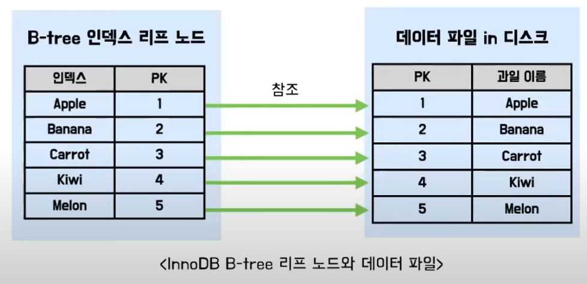
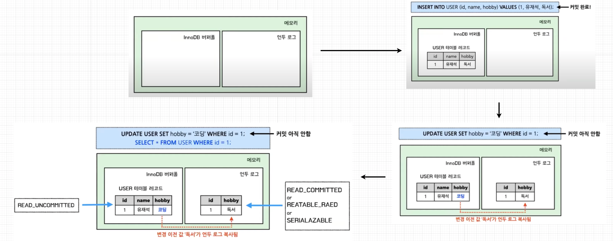
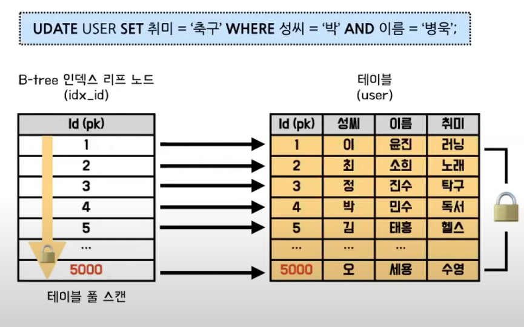

## MySQL 아키턱처

+ MySQL 접속 클라이언트
    - 대부분의 프로그래밍 언어에 대한 접속 API 제공
    - 쉘 스크립트를 통해 접속 가능
+ MySQL 엔진
    - 클라이언트 접속과 SQL 요청 처리 담당
    - 쿼리 파서, 전처리기, 옵티마이저(요청된 SQL문을 최적화해서 실행하기 위한 실행계획을 짜는 역할), 실행 엔진 등으로 구성
+ MySQL 스토리지 엔진
    - 데이터를 실제로 디스크에 저장하거나 읽어오는 역할
    - 옵티마이저가 작성한 실행 계획에 따라서 적절히 실행
    - MySQL 엔진이 스토리 엔진을 호출할 때 사용하는 API를 핸들러 API라고 함
+ 운영체제, 하드웨어
    - 실제 테이블 데이터와 로그 데이터를 파일로 저장하는 부분

 

## 쿼리 실행 과정
 

1. 사용자가 SQL 요청을 MySQL로 보냅니다.
2. 가장 먼저 쿼리 캐시를 만나는데 쿼리 캐시는 쿼리 요청 결과를 캐싱하는 모듈로 이를 통해 동일한 SQL 요청에 대한 결과를 빠르게 받을 수 있습니다.
    - 쿼리 캐시는 캐싱하고 있는 데이터의 테이블이 변경된다면 이 데이터를 삭제하는 과정에서 쿼리 캐시에 접근하는 쓰레드에 Lock이 걸리면서 심각한 동시 처리 성능을 저하하기 때문에 MySQL 8.0 버전 부터는 삭제되었습니다.
3. 쿼리 파서는 기본적인 SQL 문장 오류를 체크하고 의미 있는 단위의 토큰으로 쪼갠 다음 트리(Parse Tree)로 만듭니다. 이를 통해 쿼리를 실행합니다.
4. 전처리기는 Parse Tree를 기반으로 SQL의 문장 구조를 검사하고, 파스 트리의 토큰을 하나씩 검사하면서 토큰에 해당하는 테이블 이름이나 컬럼 등이 실제로 존재하는지 체크하고 접근 권한에 대해서도 체크합니다.
5. 옵티마이저는 SQL 실행을 최적화해서 실행 계획을 만듭니다.
    - 규칙 기반 최적화
        - 옵티마이저에 내장된 우선순위에 따라 실행 계획 수립
    - 비용 기반 최적화
        - SQL을 처리하는 다양한 방법을 만들어 두고, 각 방법의 비용과 테이블 통계 정보를 바탕으로 실행 계획 수립
6. 쿼리 실행 엔진은 옵티마이저가 만든 실행 계획대로 스토리지 엔진을 호출해서 쿼리를 수행합니다.
7. 스토리지 엔진은 쿼리 실행 엔진이 요청하는대로 데이터를 디스크로 저장하고 읽습니다.
    - 대표적으로 InnoDB가 있고, 플러그인 형태로 제공되어 사용자가 원하는 엔진 선택이 가능합니다.
    - 핸들러 API에 의해 동작하고 핸들러라고도 불립니다.

## InnoDB 스토리지 엔진
 

+ Primary Key에 의한 클러스터링
+ 트랜잭션 지원
    - MVCC, Redo & undo 로그, 레코드 단위 잠금
+ InnoDB 버터풀 & 어댑티브 해시 인덱스 제공

### 특징 1 - PK에 의한 클러스터링
 

+ 레코드를 PK순으로 정렬해서 저장
+ PK 인덱스 자동 생성
+ PK를 통해서만 레코드에 접근 가능
+ PK를 통한 범위 검색이 매우 빠름
+ 클러스터링 때문에 쓰기 성능 저하

### 특징 2 - 트랜잭션 MVCC(Multi Version Concurrency Control)
  
__트랜잭션 격리 레벨에 따라 조회되는 데이터가 달라지게 하는 기술을 MVCC__ 라고 합니다. __MVCC를 통해 레코드에 잠금을 걸지 않고도 트랜잭션 격리레벨에 따라 일관된 읽기를 할 수 있습니다.__  InnoDB 버퍼풀은 변경된 데이터를 디스크에 반영하기 전까지 잠시 버퍼링 하는 공간입니다. 언두 로그는 변경되기 이전 데이터를 백업해두는 공간입니다.
 

1. 데이터를 Insert하고 커밋하면 InnoDB 버퍼풀에 새로 삽입한 레코드가 생깁니다.
2. Update 쿼리를 날리면 InnoDB 레코드 값이 변경되고 이전 레코드 값은 언두 로그로 복사됩니다.
3. 이때 다른 트랜잭션이 해당 레코드를 조회한다면 데이터베이스에 설정된 트랜잭션 격리 수준에 따라 다릅니다.
4. READ_UNCOMMITTED 라면 InnoDB 버퍼풀 값을, READ_COMMITTED, REATABLE_READ, SERIALAZBLE 이라면 언두 로그에 있는 값을 읽습니다.

 

__cf) 격리 수준__
+ Dirty read
    - 변경 사항이 반영되지 않은 값을 다른 트랜잭션에서 읽는 현상
+ Nonrepeatable read
    - 한 트랜잭션 내에서 같은 쿼리를 두 번 수행할 때 그 사이에 다른 트랜잭션이 값을 수정 또는 삭제함으로써 두 쿼리의 결과가 상이하게 나타나는 비 일관성 발생하는 현상
    - 즉, select 조회 후 다른 트랜잭션에서 해당 값을 update 해버리고, 현재 트랜잭션에서 같은 select 조회했을 때 데이터가 다른 값을 갖는 경우
+ Phantom read
    - 한 트랜잭션 안에서 __일정범위__ 의 레코드를 두번 이상 읽을 때, 첫 번재 쿼리에서 없던 유령 레코드가 두번째 쿼리에서 나타나는 현상
    - 첫 조회 당시 A,B,C 데이터가 있었는데 같은 트랜잭션 내에서 같은 조회 쿼리 날릴 경우 A,B,C,D 데이터가 있는 경우

 

위 세 문제에 대한 대응 책으로 4개의 트랜잭션 고립 단계가 존재합니다.  
 

+ READ UNCOMMITTED
    - 커밋하지 않은 데이터를 읽을 수 있습니다.
    - Dirty read 발생
+ READ COMMITTED
    - 커밋한 데이터만 읽을 수 있습니다.
    - Dirty read 방지
    - Nonrepeatable read 발생
+ REPEATABLE READ
    - 한번 조회한 데이터는 반복해서 조회해도 같은 데이터가 나옵니다.
    - Dirty read, Nonrepeatable read 방지
    - Phantom read 발생
+ SERIALIZABLE
    - 가장 엄격한 수준으로 앞선 문제들을 방지합니다.
    - 동시성 처리 성능이 급격히 하락합니다.

 

### 특징 3 - Undo Log & Redo Log
 

+ Undo Log
    - 변경되기 이전 데이터를 백업합니다.
    - 트랜잭션이 보장되기 때문에 롤백 시 언두 로그에 백업된 데이터로 복원해주면 됩니다.
    - 트랜잭션 격리 수준도 보장해줍니다.
+ Redo Log
    - 커밋이 완료된 변경된 데이터를 백업합니다.
    - 하드웨어 또는 소프트웨어 문제로 MySQL이 비정상 종료되면 Redo Log를 통해 복원합니다.

 

### 특징 4 - 레코드 단위 잠금
 

데이터베이스에서 데이터를 변경할 때는 동시성 문제를 고려하여 레코드에 대한 접근을 막는데 이를 __잠금__ 이라고 합니다.  
InnoDB는 __레코드 단위로 잠금__ 을 걸기 때문에 동시처리 성능이 좋습니다. 실질적으로는 레코드 자체를 잠그는 것이 아니라 __인덱스 레코드__ 를 잠그게 됩니다.

#### 예시
 

다음과 같은 상황을 예시로 진행하겠습니다.
 

+ User 테이블에 5000 개의 레코드
+ 성씨 칼럼은 인덱스가 적용
+ 성씨 칼럼은 '박'인 레코드는 300개 존재
+ 성씨는 '박'이고 이름은 '병욱'인 레코드는 1개만 존재

  
업데이트할 레코드를 검색할 때 사용된 박씨 인덱스 레코드가 모두 잠기게 됩니다.  
 

  
만약 성씨 인덱스가 없었다면 기본으로 생성된 PK 인덱스를 사용하여 테이블을 풀스캔하게 되면서 5000 개의 데이터에 대해 잠금이 걸리게 됩니다.
 

  
만약 성씨와 이름에 대한 복합 인덱스를 생성했다면 딱 한개의 레코드에 대해서만 잠금이 걸리게 됩니다.

 

### 특징 5 - 버퍼풀
 

버퍼풀의 용도는 데이터 캐싱과 쓰기 지연 버퍼 2가지로 사용됩니다.
 

#### 데이터 캐싱
 

버퍼풀은 SQL 요청 결과를 일정한 크기의 페이지 단위로 캐싱합니다. 운영체제가 가상 메모리를 효율적으로 사용하기 위해 페이징 하는 것처럼 데이터베이스도 테이블 데이터에 대해 페이징합니다. InnoDB는 페이지 교체 알고리즘으로 LRU 알고리즘을 사용하고 있습니다.
 

#### 쓰기 지연 버퍼
 

Insert, Update, Delete 명령으로 변경된 페이지를 더티 페이지라고 합니다. InnoDB는 더티 페이지들을 모았다가 주기적으로 이벤트를 발생시켜 한 번에 디스크에 반영합니다.(JPA 영속성 컨텍스트와 유사) 이렇게 변경된 데이터를 한 번에 모았다가 처리하는 이유는 랜덤 I/O를 줄이기 위해서 입니다.
 

#### 어댑티브 해시 인덱스
 

어댑티브 해시 인덱스는 페이지에 빠르게 접근하기 위한 키와 페이지 주소값 쌍으로 이루어진 해시 자료구조 기반 인덱스 입니다. 어댑티브 해시 인덱스는 사용자가 자주 요청하는 데이터에 대해서 InnoDB가 자동으로 만들어줍니다. 이를 통해 원하는 페이지에 빠르게 접근할 수 있기 때문에 쿼리를 더 빠르게 처리할 수 있습니다.

  

__참고__  
<a href="https://www.youtube.com/watch?v=vQFGBZemJLQ&list=PLo0ta52hn1uHQ5iQ3hAeRoMUeLJFIeRew" target="_blank"> [10분 테코톡] 🔫 우기의 MySQL 아키텍처</a>  

