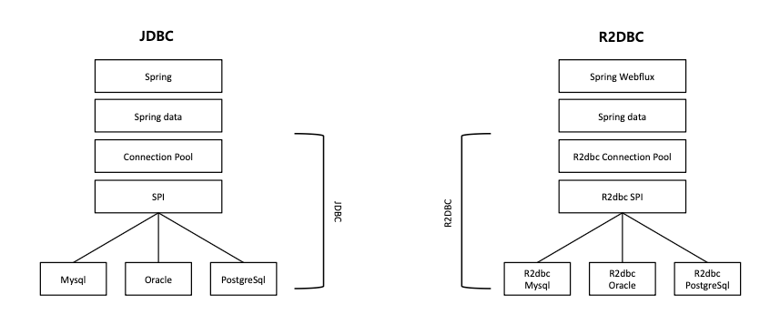
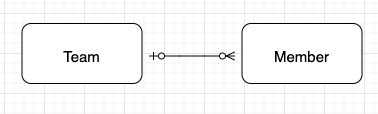
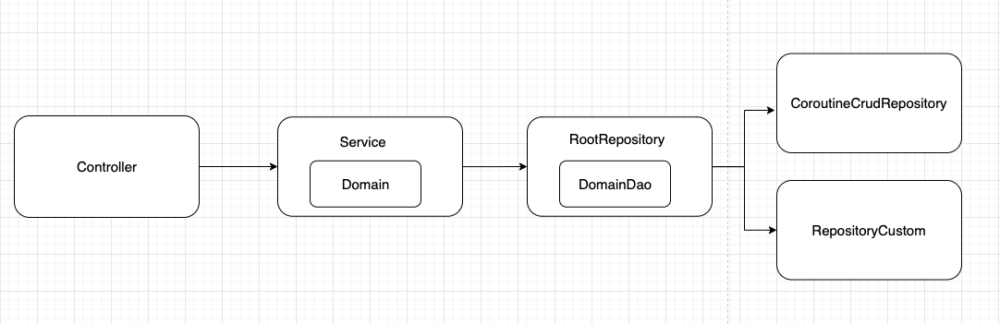
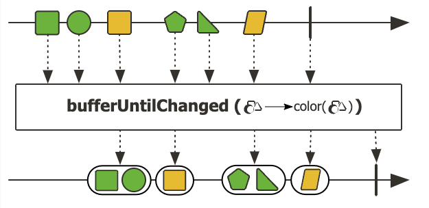

## R2DBC란?
R2DBC(Reactive Rela tional Database Connectivity)는 드라이버 공급업체가 관계형 데이타베이스에 액세스 하기 위해서 구현한 리액티브 API를 선언하는 API 명세입니다.

R2DBC가 만들어진 이유 중 하나는 적은 스레드로 동시성을 처리하기 위해, 더 적은 하드웨어 리소스로 확장할 수 있는 논-블로킹 애플리케이션 스택이 필요해서 입니다. JDBC는 완전한 블로킹 API 이기 때문에, 표준화된 관계형 데이타베이스 액세스 API(즉, JDBC)를 재이용하더라도 이 요구를 충족할 수가 없습니다. ThreadPool를 사용하여 블로킹 동작을 비슷하게 구현할 수도 있지만 이는 제약 사항이 많습니다.

이는 결국 논블로킹 데이터베이스 드라이버와도 잘 동작하는 새로운 공통 API를 만드는 계기가 되었고, 적은 스레드와 하드웨어로 더 많은 동시 처리를 할 수 있는 R2DBC가 탄생했습니다.

## Reactive란?
리액티브라는 용어는 변화, 가용성, 처리 가능 상태에 반응하는 것을 중심에 두고 만든 프로그래밍 모델을 의미합니다. 논블로킹은 작업을 기다리기보단 완료되거나 데이터를 사용할 수 있게 되면 반응하므로 그런 의미에서 논블로킹은 리액티브라고 볼 수 있습니다. 

Spring은 리액티브와 연결하는 중요한 메커니즘으로 논-블로킹 백-프레셔가 있습니다. 동기식 명령형 코드에서 블로킹 호출은 호출자를 강제로 기다리게 하는 일종의 백-프레셔입니다. 논블로킹 코드에선 많은 트래픽이 몰릴 경우 문제가 발생하거나 성능이 제대로 나오지 않을 수 있기에 백-프레셔(배압, 역압)을 통해 요청 갯수를 제한(프로듀셔 속도가 컨슈머 속도를 압도하지 않도록)하여 고가용성을 보장합니다.

기존에는 멀티스레드로써 병렬처리를 했기에 쓰레드의 확장만으로는 CPU와 메모리의 제한이 있었지만, 리액티브는 쓰레드를 점유하지 않고 작업을 수행하여 하나의 쓰레드 내에서 동시에 많은 작업을 수행하게 되어 적은 고정된 수의 스레드와 적은 메모리로 최대한의 효율을 내며 확장할 수 있다는 장점이 있습니다. 


## demo 프로젝트
spring boot 3.2.5 버전을 기준으로 demo 프로젝트를 만들고 spring data r2dbc 사용법에 대해 알아보겠습니다.

### 세팅


r2dbc를 사용하기 위해서는 spring webflux가 필요합니다.

**build.gradle.kts**
```groovy
dependencies {
   // kotlin
   implementation("com.fasterxml.jackson.module:jackson-module-kotlin")
   implementation("io.projectreactor.kotlin:reactor-kotlin-extensions")
   implementation("org.jetbrains.kotlin:kotlin-reflect")
   implementation("org.jetbrains.kotlinx:kotlinx-coroutines-reactor")

   // webflux
   implementation("org.springframework.boot:spring-boot-starter-webflux")
   kapt("org.springframework.boot:spring-boot-configuration-processor")

   // r2dbc
   implementation("org.springframework.boot:spring-boot-starter-data-r2dbc")
   implementation("io.asyncer:r2dbc-mysql:1.1.0")
}
```
[R2DBC 공식](https://r2dbc.io/drivers/)에 따르면 jasync-sql은 java와 kotlin을 위한 r2dbc wrapper로 postgreSQL와 MySQL을 지원하고 r2dbc-mysql은 MySQL을 지원하는 native driver입니다. 여기서는 r2dbc-mysql을 사용하겠습니다. r2dbc-mysql에 관한 자세한 설명은 [Github](https://github.com/asyncer-io/r2dbc-mysql)와 [Wiki](https://github.com/asyncer-io/r2dbc-mysql/wiki)를 참고 바랍니다.

<Br>

**R2dbcConfiguration**
```kotlin
@Configuration
@EnableR2dbcRepositories 
@EnableR2dbcAuditing
class R2dbcConfiguration
```
@EnableR2dbcRepositories는 r2dbcRepository 구성을 활성화하며, @EnableR2dbcAuditing는 auditing을 활성화합니다.


기본적으로 spring-boot-starter-data-r2dbc 의존성에 의해 별도의 빈 등록이 없으면 필요한 빈들은 application.yml의 값을 읽어서 자동으로 빈으로 등록됩니다. 별도의 수정이 필요한 경우, [AbstractR2dbcConfiguration](https://docs.spring.io/spring-data/r2dbc/docs/current-SNAPSHOT/reference/html/#r2dbc.connectionfactory)을 상속받아 구현할 수 있습니다. 해당 클래스를 구현하면 ConnectionFactory, [r2dbcConverter](https://docs.spring.io/spring-data/r2dbc/docs/current-SNAPSHOT/reference/html/#mapping), [R2dbcCustomConversions](https://docs.spring.io/spring-data/r2dbc/docs/current-SNAPSHOT/reference/html/#mapping.configuration) 등을 수정할 수 있습니다. 

**application.yml**
```yml
spring:
  application:
    name: r2dbc

  # https://github.com/asyncer-io/r2dbc-mysql/wiki/getting-started
  r2dbc:
    url: r2dbc:mysql://localhost:3306/r2dbc
    username: root
    password: root
    properties:
      serverZoneId: Asia/Seoul
      # Duration.parse 를 사용하므로 3s 형식으로 넣으면 예외가 발생
      # MySqlConnectionFactoryProvider#setup 메서드 참고
      connectTimeout: PT3S
      
    # https://github.com/r2dbc/r2dbc-pool
    # https://javadoc.io/doc/io.r2dbc/r2dbc-pool/0.9.0.M1/io/r2dbc/pool/ConnectionPoolConfiguration.Builder.html
    # @See org.springframework.boot.autoconfigure.r2dbc.R2dbcProperties.Pool
    pool:
      initial-size: 10
      max-size: 10
      max-life-time: 30m
      max-create-connection-time: 3s

# https://github.com/asyncer-io/r2dbc-mysql/wiki/logging-statements
logging:
  level:
    io.asyncer.r2dbc.mysql: INFO
    io.asyncer.r2dbc.mysql.QUERY: DEBUG
```
spring.r2dbc에서는 공통된 설정만을 제공하므로 url, password, username같은 공통된 설정만 적용할 수 있습니다. 이외의 설정은 properties로 자동완성 없이 직접 넣어줘야 하는데 [문서](https://github.com/asyncer-io/r2dbc-mysql/wiki/getting-started)에서 참고할 수 있습니다. 이외의 설명은 주석으로 대체하겠습니다.

### 도메인


demo 프로젝트의 도메인은 team과 member 1:N 구성으로 구성됩니다. 



demo 프로젝트의 전체적인 구조는 전통적인 layer구조입니다. 특이한 점이 있다면 domain과 dao가 분리되어있습니다. JPA의 경우에는 lazy 로딩등 여러 기능이 지원되지만 R2DBC에서는 지원되지 않기 때문에 Repository계층에서 Service계층으로 넘겨줄 때, Domain을 다 채워넣는 형식으로 설계되었습니다.

**domainDao**
```kotlin
@Table("member")
data class Member(
    @Id
    val id: Long? = null,
    val name: String,
    val introduction: String?,
    val type: String,
    val teamId: Long?,
    val registeredBy: String,
    @CreatedDate
    val registeredDate: LocalDateTime,
    val modifiedBy: String,
    @LastModifiedDate
    val modifiedDate: LocalDateTime,
) 
```

**domain**
```kotlin
class Member(
    val id: Long? = null,
    val name: String,
    introduction: String? = null,
    val type: Type,
    teamId: Long? = null,
    val registeredBy: String,
    val registeredDate: LocalDateTime = LocalDateTime.now(),
    modifiedBy: String,
    val modifiedDate: LocalDateTime = LocalDateTime.now(),
    private val teamProvider: suspend () -> Team? = { null },
) {

    // 생략
}
```
domain과 dao의 차이를 보면 dao의 경우에는 teamId만 가지고 있고, domain의 경우에는 teamProvider이라는 람다를 가지고 있습니다. JPA에서 lazyLoading을 제공하는 것처럼 repository에서 service 계층으로 Member를 만들어서 넘겨줄 때, teamProvider에 team을 가져오는 람다식을 넘겨주고 필요시 해당 teamProvider를 호출하여 JPA와 유사하게 lazy하게 가져오는 방식의 도메인 구성입니다. 

### repository
```kotlin
@Repository
interface MemberRepository : CoroutineCrudRepository<Member, Long>, MemberRepositoryCustom
```
repository는 JPA에서 사용하는 것과 비슷하게 CoroutineCrudRepository에서 간단한 쿼리를 제공해주며, Querydsl 사용방식과 유사하게 Custom 인터페이스를 구현하도록 하여 복잡한 쿼리를 구현합니다.


```kotlin
@Repository
class MemberRootRepository(
    private val memberRepository: MemberRepository,
    private val teamRootRepository: TeamRootRepository,
) {
    
    // team db 조회
    suspend fun findById(id: Long): Member? {
        return memberRepository.findById(id)?.let {
            MemberMapper.mapToDomain(it) { it.teamId?.let { teamRootRepository.findById(it) } }
        }
    }
   
    // 이미 join해서 가져온 경우
    suspend fun findByIdFetch(id: Long): Member? {
        return memberRepository.findByIdFetch(id)
            ?.let { MemberMapper.mapToDomain(it) }
    }
}
```
앞서 언급한 것처럼 리포지토리 계층에서 service로 넘겨줄 때 mapper를 사용하여 dao를 domain으로 변환하게 되는데 teamProvider로 db를 호출하는 repository에서 찾는 방식으로 넘겨줄 수도 있고, member를 조회할 때 team과 join해서 이미 가져왔다면 해당 team을 바로 넣어주는 형식으로 개발할 수 있습니다.

#### R2dbcEntityTemplate
R2dbcEntityTemplate은 Spring Data R2DBC에서 제공하는 고수준의 데이터베이스 액세스 추상화 클래스입니다. Spring Data JPA의 JdbcTemplate이나 MongoTemplate과 유사하게 작동하며, R2DBC를 통해 데이터베이스 작업을 수행할 때 편리한 기능을 제공합니다.

대부분의 간단한 CRUD는 CoroutineCrudRepository를 통해 구현하게 되고, 나머지 복잡한 쿼리의 경우 Querydsl 사용처럼 CustomRepository를 구현하도록 하여 추가적으로 구현하게 되는데 이때 비교적 간단한 쿼리에서는 R2dbcEntityTemplate을 사용합니다.

```kotlin
@Repository
class MemberRepositoryCustomImpl(
    private val template: R2dbcEntityTemplate,
    private val converter: MappingR2dbcConverter
): MemberRepositoryCustom {

    override suspend fun findById(id: Long): Member? {
        val sql = template.select<Member>()
        val whereBuilder = Criteria.where("id").`is`(id)

        return sql
            .matching(Query.query(whereBuilder))
            .one() // all or one
            .awaitSingleOrNull()
    }
}
```
sql.matching 이후 one을 체이닝하면 mono가 반환되고, all을 체이닝하면 flux가 반환됩니다. 코루틴을 사용하므로 awaitSingleOrNull을 사용하여 리액티브 타입을 제거해줍니다. R2dbcEntityTemplate의 자세한 사용법은 [문서](https://docs.spring.io/spring-data/r2dbc/docs/current-SNAPSHOT/reference/html/#r2dbc.entityoperations)를 참고 바랍니다.

#### join
join과 같이 비교적 복잡한 퀴리의 경우, DatabaseClient를 사용합니다. DatabaseClient는 Spring Data R2DBC에서 제공하는 저수준의 데이터베이스 액세스 클래스입니다. 이를 통해 직접 SQL 쿼리를 작성하고 실행할 수 있습니다. R2dbcEntityTemplate이 내부적으로 DatabaseClient를 사용합니다.

```kotlin
data class MemberWithTeam(
    val memberId: Long,
    val memberName: String,
    val memberIntroduction: String?,
    val memberType: String,
    val memberRegisteredBy: String,
    val memberRegisteredDate: LocalDateTime,
    val memberModifiedBy: String,
    val memberModifiedDate: LocalDateTime,
    val teamId: Long?,
    val teamName: String?,
    val teamRegisteredBy: String?,
    val teamRegisteredDate: LocalDateTime?,
    val teamModifiedBy: String?,
    val teamModifiedDate: LocalDateTime?,
)
```
```kotlin
@Repository
class MemberRepositoryCustomImpl(
   private val template: R2dbcEntityTemplate,
   private val converter: MappingR2dbcConverter
): MemberRepositoryCustom {

   override suspend fun findByIdFetch(id: Long): MemberWithTeam? {

      val sql = """
         SELECT 
             m.id as member_id,
             m.name as member_name,
             m.introduction as member_introduction,
             m.type as member_type,
             m.team_id as team_id,
             m.registered_by as member_registered_by,
             m.registered_date as member_registered_date,
             m.modified_by as member_modified_by,
             m.modified_date as member_modified_date,
             t.name as team_name,
             t.registered_by as team_registered_by,
             t.registered_date as team_registered_date,
             t.modified_by as team_modified_by,
             t.modified_date as team_modified_date
         FROM member m 
         LEFT JOIN team t on m.team_id = t.id
         WHERE m.id =:memberId
     """.trimIndent()

      return template.databaseClient
         .sql(sql)
         .bind("memberId", id)
         .map { row, metaData -> converter.read(MemberWithTeam::class.java, row, metaData) }
         .one()
         .awaitSingleOrNull()
   }
}
```
DatabaseClient를 사용하게 되면 쿼리를 직접 작성해야 합니다. 따라서 매핑에 필요한 클래스도 별도로 생성해야 합니다. bind를 통해서 쿼리에 파라미터를 매핑할 수 있고, MappingR2dbcConverter 를 사용하여 row를 객체로 매핑할 수 있습니다. MappingR2dbcConverter에 대해서는 [문서](https://docs.spring.io/spring-data/r2dbc/docs/current-SNAPSHOT/reference/html/#mapping)를 참고바랍니다. 

one-to-one 혹은 many-to-one 관계의 join의 경우에는 위와 같이 일반적인 형태로 쿼리를 구성하면 됩니다. 하지만 one-to-many의 경우에는 다른 방식의 접근이 필요합니다. 


one-to-many의 경우 join을 하면 데이터가 뻥튀기 됩니다. 팀 A의 경우 행이 1개이지만 join을 하게 되면 결과값으로 행이 2개가 나옵니다. JPA의 경우에는 distinct가 이를 해결해 주었지만(hibernate 6.0 버전부터는 default로 distinct가 들어가기 때문에 문제가 해결되었습니다. [문서](https://docs.jboss.org/hibernate/orm/6.0/migration-guide/migration-guide.html#query-sqm-distinct)) r2dbc에서는 별도로 제공되는 것이 없기 때문에 직접 해결해야만 합니다.

해결 방법은 2가지가 있습니다.

* bufferUntilChanged + sort
* groupBy 


**bufferUntilChanged + sort**


[bufferUntilChanged](https://projectreactor.io/docs/core/release/api/reactor/core/publisher/Flux.html#bufferUntilChanged-java.util.function.Function-)는 R2dbc, Spring-data-r2dbc에서 제공하는 것이 아닌 Reactor Flux에서 제공되는 메서드입니다. 위 그림과 같이 인자로 받은 조건에 의해 리스트로 묶어주는 기능을 제공합니다. 

```kotlin
team A // 1
team A // 2
team B // 3
team B // 4
```
예를 들어 위와 같은 결과가 나왔을 때, 1,2가 하나의 리스트, 3,4가 하나의 리스트로 만들어 `Flux<List<Team>>` 형태로 반환합니다. 여기서 주의해야할 점은 기준값이 끊어지는 순간 리스트도 끊어집니다.

```kotlin
team A // 1
team B // 2
team A // 3
team B // 4
```
위와 같은 결과가 나왔을 때는, A가 연속적이지 않기 때문에 1이 하나의 리스트, 2가 하나의 리스트로 만들어지면서 총 4개의 리스트가 만들어집니다. 따라서 이를 방지하기 위해서는 정렬이 필요합니다. 

```kotlin
@Repository
class TeamRepositoryCustomImpl(
    private val template: R2dbcEntityTemplate,
    private val converter: MappingR2dbcConverter,
) : TeamRepositoryCustom {

    override suspend fun findAllTeamWithMembers(): List<TeamWithMembers> {
        val sql = """
            SELECT 
                m.id as member_id,
                m.name as member_name,
                m.introduction as member_introduction,
                m.type as member_type,
                m.team_id as team_id,
                m.registered_by as member_registered_by,
                m.registered_date as member_registered_date,
                m.modified_by as member_modified_by,
                m.modified_date as member_modified_date,            
                t.name as team_name,
                t.registered_by as team_registered_by,
                t.registered_date as team_registered_date,
                t.modified_by as team_modified_by,
                t.modified_date as team_modified_date
            FROM team t 
            JOIN member m on m.team_id = t.id
            order by t.id
        """.trimIndent()

        return template.databaseClient
            .sql(sql)
            .map { row, metaData -> converter.read(TeamWithMemberData::class.java, row, metaData) }
            .all()
            .bufferUntilChanged { it.teamId }
            .map { dataList ->
                TeamWithMembers(
                    team = Team.from(dataList.first()),
                    members = dataList.map { Member.from(it) }
                )
            }
            .collectList()
            .awaitSingle()
    }
}
```
bufferUntilChanged에서 사용되는 기준을 orderBy 절에 추가하여 앞선 bufferUntilChanged의 문제를 해결하고 나면 결과적으로 map 단계에서 team이 같은 member들에 대한 결과값들이 list로 나오게 되므로 이를 mapping하여 one-to-many join을 처리할 수 있습니다.

```kotlin
@Repository
class TeamRepositoryCustomImpl(
    private val template: R2dbcEntityTemplate,
    private val converter: MappingR2dbcConverter,
) : TeamRepositoryCustom {

    override suspend fun findAllTeamWithMembers(): List<TeamWithMembers> {
       
        // 생략
        
        return template.databaseClient
            .sql(sql)
            .map { row, metaData -> converter.read(TeamWithMemberData::class.java, row, metaData) }
            .all()
            .groupBy { it.teamId }
            .flatMap { groupFlux ->
                groupFlux.collectList().map { dataList ->
                    TeamWithMembers(
                        team = Team.from(dataList.first()),
                        members = dataList.map { Member.from(it) }
                    )
                }
            }
            .collectList()
            .awaitSingle()
    }
}
```
kotlin에서 제공하는 groupBy를 사용할 경우, 비교적 간단하게 기준값으로 묶어서 처리할 수 있습니다.

#### 페이징
```kotlin
@Repository
class MemberRepositoryCustomImpl(
    private val template: R2dbcEntityTemplate,
    private val converter: MappingR2dbcConverter
): MemberRepositoryCustom {

    override suspend fun search(searchCondition: MemberDto.SearchCondition): List<MemberWithTeam> {
        val baseSql = """
            SELECT 
                m.id as member_id,
                m.name as member_name,
                m.introduction as member_introduction,
                m.type as member_type,
                m.team_id as team_id,
                m.registered_by as member_registered_by,
                m.registered_date as member_registered_date,
                m.modified_by as member_modified_by,
                m.modified_date as member_modified_date,
                t.name as team_name,
                t.registered_by as team_registered_by,
                t.registered_date as team_registered_date,
                t.modified_by as team_modified_by,
                t.modified_date as team_modified_date
            FROM member m 
            LEFT JOIN team t on m.team_id = t.id
        """.trimIndent()

        val whereConditions = generateWhereCondition(searchCondition)

        return template.databaseClient
            .sql(
                baseSql
                    .plusWhere(whereConditions)
                    .plusOrderBy(searchCondition.sort.map { Pair("m.${it.field}", Sort.Direction.valueOf(it.sort.name)) })
                    .plusPagination(searchCondition.page, searchCondition.size)
            )
            .bindConditions(whereConditions)
            .bindPage(searchCondition.page, searchCondition.size)
            .map { row, metaData -> converter.read(MemberWithTeam::class.java, row, metaData) }
            .all()
            .collectList()
            .awaitSingle()
    }

    private fun generateWhereCondition(searchCondition: MemberDto.SearchCondition): MutableMap<String, Any?> {
        val whereConditions = mutableMapOf<String, Any?>()
        searchCondition.name?.let { whereConditions["m.name = :name"] = it }
        searchCondition.type?.let { whereConditions["m.type = :type"] = it }
        return whereConditions
    }
}
```
페이징 쿼리처럼 동적 쿼리가 필요한 경우에는 아직 지원해주는 것이 없기 때문에 조건에 따라 sql을 수정하는 작업이 필요합니다. 이를 공통화하기 위해서 util을 만들어서 처리 합니다.

```kotlin
fun String.plusWhere(conditions: Map<String, Any?>): String {
    if (conditions.isEmpty()) {
        return this
    }

    return "$this\nWHERE ${conditions.keys.joinToString(" AND ")}"
}

fun String.plusGroupBy(vararg columns: String): String {
    return "$this\nGROUP BY ${columns.joinToString(",")}"
}

fun String.plusHaving(conditions: Map<String, Any?>): String {
    if (conditions.isEmpty()) {
        return this
    }

    return "$this\nHAVING ${conditions.keys.joinToString(" AND ")}"
}

// 바인딩 지원 X
fun String.plusOrderBy(conditions: List<Pair<String, Sort.Direction>>): String {

    val orderByClause = conditions.joinToString(", ") { (field, direction) ->
        "${field.toSnakeCase()} ${direction.name}"
    }

    return if (orderByClause.isNotEmpty()) {
        "$this\nORDER BY $orderByClause"
    } else {
        this
    }
}

fun String.toSnakeCase(): String {
    return this.replace(Regex("([a-z])([A-Z])"), "$1_$2").lowercase()
}

fun String.plusPagination(page: Int?, size: Int?): String {
    if (page == null && size == null) {
        return this
    }

    if (page != null && size != null) {
        return "$this\nLIMIT :page, :size"
    }

    return "$this\nLIMIT :size"
}

fun DatabaseClient.GenericExecuteSpec.bindConditions(
   conditions: Map<String, Any?>,
): DatabaseClient.GenericExecuteSpec {
   val source = conditions.entries.mapNotNull { (condition, value) ->
      val param = Regex(":(\\w+)").find(condition)?.value?.removePrefix(":")
      if (param == null) {
         null
      } else {
         param to value
      }
   }.toMap()

   return this.bindValues(source)
}

fun DatabaseClient.GenericExecuteSpec.bindPage(
   page: Int,
   size: Int,
): DatabaseClient.GenericExecuteSpec {
   var spec = this
   spec = spec.bind("page", (page - 1) * size)
   spec = spec.bind("size", size)
   return spec
}

```
order by의 경우, bind를 지원하지 않기 때문에 직접 값을 넣는 방식으로 처리했습니다. where, having 절 같은 경우에는 key에 sql 쿼리를 넣고 value에 실제 바인딩 되는 값을 넣어주도록 만들어두고 util을 통해 sql절을 수정하면서 bind할 때는 GenericExecuteSpec에 확장함수로 bindConditions을 만들어서 key값에 해당하는 값을 바인딩하는 형식으로 만들었습니다. page의 경우에는 where, having과 공통화하기가 어려워 별도의 bind 확장함수를 만들었습니다.


### 캐시
```kotlin
class Member(
    val id: Long? = null,
    val name: String,
    introduction: String? = null,
    val type: Type,
    teamId: Long? = null,
    val registeredBy: String,
    val registeredDate: LocalDateTime = LocalDateTime.now(),
    modifiedBy: String,
    val modifiedDate: LocalDateTime = LocalDateTime.now(),
    private val teamProvider: suspend () -> Team? = { null },
) 
```
만약 도메인의 teamProvider에 DB를 조회하는 로직이 있다면, teamProvider를 호출할 때마다 db 조회 쿼리가 발생합니다. 이를 방지하기 위해 한번이라도 teamProvider가 사용된 경우 캐시해서 항상 동일한 값을 반환하도록 하는 추가적인 작업이 필요할 수 있습니다.

```kotlin
class AsyncLazy<T>(private val initializer: suspend () -> T?) {
    private var value: T? = null
    private var initialized = false

    suspend fun get(): T? {
        if (!initialized) {
            value = initializer()
            initialized = true
        }
        return value
    }
}

class AsyncListLazy<T>(private val initializer: suspend () -> List<T>) {
    private var value: List<T> = emptyList()
    private var initialized = false

    suspend fun get(): List<T> {
        if (!initialized) {
            value = initializer()
            initialized = true
        }
        return value
    }
}
```
```kotlin
class Member(
    val id: Long? = null,
    val name: String,
    introduction: String? = null,
    val type: Type,
    teamId: Long? = null,
    val registeredBy: String,
    val registeredDate: LocalDateTime = LocalDateTime.now(),
    modifiedBy: String,
    val modifiedDate: LocalDateTime = LocalDateTime.now(),
    private val teamProvider: suspend () -> Team? = { null },
) {
    private val cachedTeam = AsyncLazy { teamProvider() }
    suspend fun getTeam() = cachedTeam.get()
}
```
AsyncLazy 클래스를 사용하여 한 번이라도 provider가 호출된 경우 값을 저장해두고, 이후의 반환부터는 그대로 사용하도록 할 수 있습니다. 해당 값은 teamId가 변경되어도 그대로 고정되기 때문에 만약 teamId가 수정된다면 한번 save하고 사용해야 한다는 점을 주의해야 합니다.


**참고**
* [spring 문서](https://docs.spring.io/spring-data/r2dbc/docs/current-SNAPSHOT/reference/html/#get-started:first-steps:what)
* [spring 문서 번역](https://godekdls.github.io/Spring%20Data%20R2DBC/r2dbcsupport/)

