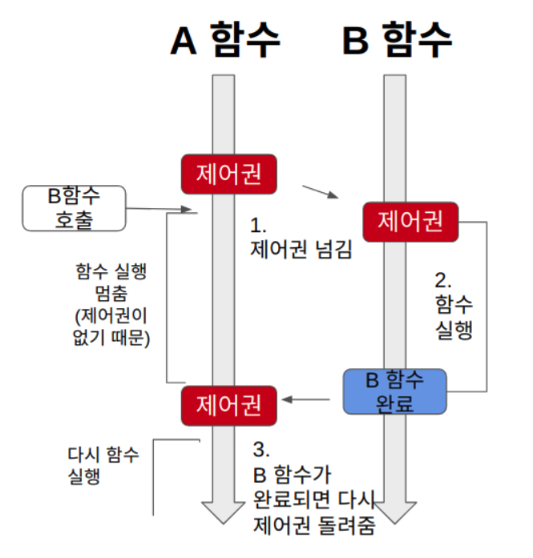
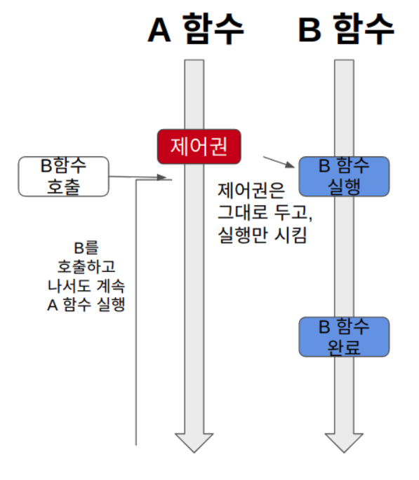
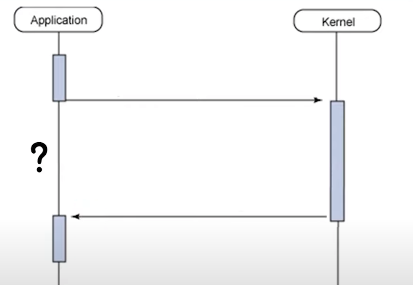
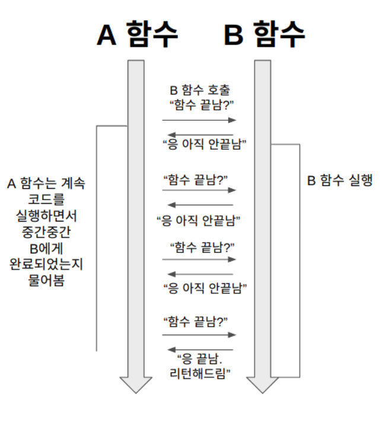
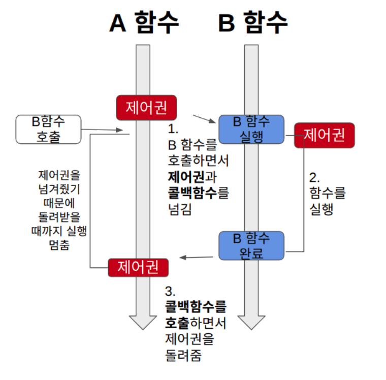
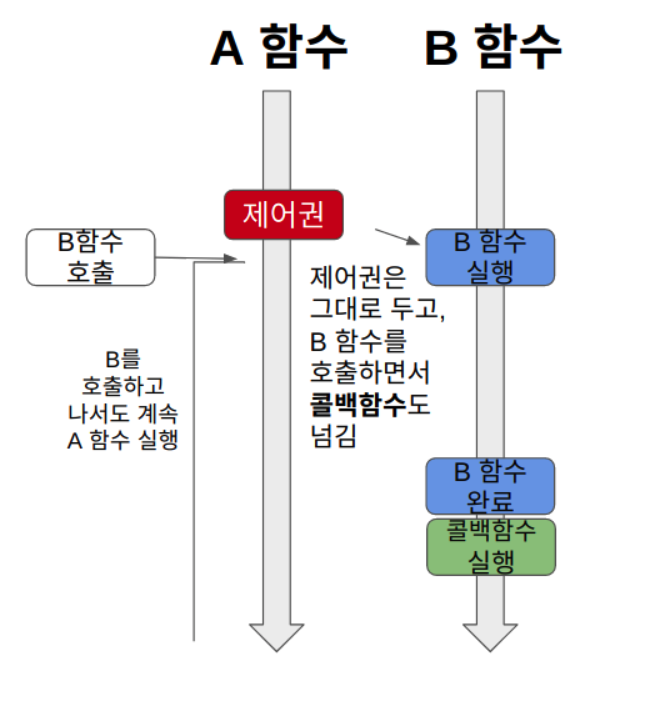

## Blocking vs Non-Blocking
 
두 가지의 차이점은 __다른 주체가 작업할 때 자신이 코드를 실행할 제어권이 있는지 없는지로 판단__ 할 수 있습니다.

### Blocking
 

  
Blocking 자신의 작업을 진행하다가 다른 주체의 작업이 시작되면 __제어권을 다른 주체로 넘깁니다.__ 따라서 자신은 제어권이 없기 때문에 실행할 수 없고, 다른 주체가 실행을 완료하고 제어권을 돌려줄 때까지 아무 작업도 할 수 없습니다.

### Non-Blocking
 

  
Non-Blocking은 다른 주체의 작업에 __관련없이 자신이 제어권을 갖고 있습니다.__ 따라서, 자신은 계속 작업을 수행할 수 있습니다.

 

## Sync vs Async
 

두 가지의 차이점은 __결과를 돌려주었을 때 순서와 결과에 관심이 있는지 없는지__ 에 차이가 있습니다. 아래 설명부터 A는 Application이고 B는 Kernel로 표현하겠습니다.

 

### Sync(동기)
 

  
동기는 함수 A가 B를 호출한 뒤, A는 다른 일을 하거나 멈춰있고 B가 결과값을 반환해주면 해당 결과값을 가지고 작업을 처리하는 방식입니다. A가 다른일을 하거나 멈춰있다고 표현했는데 이는 blocking이냐 non-blocking이냐에 따라 다릅니다. blocking의 경우에는 제어권이 없기 때문에 멈춰있고, non-blocking의 경우에는 다른 작업을 하면서 중간 중간에 B에게 작업이 끝났는지 물어보고 끝났으면 결과값을 가져와서 작업을 처리합니다.

 

### Async(비동기)
 

  
비동기는 A가 함수 B를 호출한 뒤, A는 다른 일을 하거나 멈춰있고 B가 결과값을 반환해주면 처리를 할 수도, 안 할수도 있는 방식입니다. 즉, 결과값에 대해서 신경쓰지 않습니다. 이 또한 동기 방식과 마찬가지로 다른 일을 하거나 멈춰있거는 것에 대해서는 blocking이냐 non-blocking이냐에 따라 다릅니다. blocking 방식의 경우 멈춰있고, B의 작업이 끝나면 A는 자신의 작업을 계속 할 수도 있고 반환된 값으로 작업을 할 수도 있습니다. 반면에 non-blocking의 경우에는 B가 작업하는 동안에 A는 자신의 작업을 하지만, 동기 방식과 달리 결과값에 관심이 없기 때문에 B에게 물어보는 과정이없습니다. B는 결과값을 반환해주면 A는 그 결과값을 가지고 작업을 할 수도 있고 안 할 수도 있습니다.

 

## 4가지 조합
### Sync-Blocking

 

  
Sync(동기)이므로 A는 B의 리턴값을 필요로 합니다. Blocking 방식이므로 A함수가 B를 호출하면 제어권은 B로 넘어가게 되면서 A는 다른 작업을 할 수 없습니다. 이후 B함수에서 작업을 완료하면 반환된 리턴값과 제어권을 갖고 A에서는 작업을 재개합니다.

 

### Sync-NonBlocking
 

  
Sync(동기)이므로 A는 B의 리턴값을 필요로 합니다. NonBlocking 방식이므로 A함수는 제어권을 그대로 유지하고 있어 작업을 수행할 수 있기 때문에 다른 작업을 하면서 중간 중간 B에게 완료되었는지 확인하는 요청을 보냅니다. B의 실행이 완료되었다면 결과값을 가져와서 해당 결과값에 대한 처리를 진행합니다.

 

### Async-Blocking

 

  
Async(비동기)이므로 A는 B에게 콜백함수를 전달하고, A는 B의 리턴값을 신경쓰지 않습니다. Blocking 방식이므로 B가 실행되면 제어권은 B에게 넘어가서 A는 작업을 할 수 없습니다. 콜백함수가 호출되어 제어권이 A로 넘어가면 A는 결과값에 대한 처리 작업을 할 수도 있고, 안 할 수도 있습니다.

 

### Async-NonBlocking
 

  
Async(비동기)이므로 A는 B에게 콜백함수를 전달하고, A는 B의 리턴값을 신경쓰지 않습니다. NonBlocking 방식이므로 B가 실행되어도 A는 제어권을 갖고 있어 작업을 계속 진행합니다. B는 자신의 작업이 끝나면 콜백함수로 A에게 작업이 끝났음을 알리지만, A는 이에 대한 처리 작업을 할 수도 있고, 안 할수도 있습니다.

 

## 요약
 

동기와 비동기의 차이는 __결과값을 반환했을 때, 순서와 결과값에 대해 관심이 있는지 없는지__ 로 판단할 수 있습니다. 예를 들어, A함수가 B함수를 호출했을 때 동기방식의 경우 A함수는 B의 결과값에 관심이 있기 때문에 B함수가 결과값을 반환해줘야만 그에 대한 처리를 할 수 있습니다. B 함수가 작업을 처리하는 동안에 A가 작업을 할 수 있는지, 없는지는 Blocking 방식이냐 Non-blocking 방식이냐에 따라 다릅니다. 비동기 방식에서는 A함수가 B함수의 결과값에 관심이 없기 때문에 B함수가 작업이 끝나면 결과값에 대한 처리할 수도 있고 안 할수도 있습니다. 여기서도 마찬가지로 B함수가 작업을 처리하는 동안 A가 작업을 할 수 있는지, 없는지는 Blocking 방식이냐 Non-blocking 방식이냐에 따라 다릅니다.

  

__참고__  
<a href="https://www.youtube.com/watch?v=oEIoqGd-Sns&list=PLo0ta52hn1uHQ5iQ3hAeRoMUeLJFIeRew" target="_blank"> [10분 테코톡] 🐰 멍토의 Blocking vs Non-Blocking, Sync vs Async</a>   
<a href="https://velog.io/@nittre/%EB%B8%94%EB%A1%9C%ED%82%B9-Vs.-%EB%85%BC%EB%B8%94%EB%A1%9C%ED%82%B9-%EB%8F%99%EA%B8%B0-Vs.-%EB%B9%84%EB%8F%99%EA%B8%B0" target="_blank"> 블로킹 Vs. 논블로킹, 동기 Vs. 비동기</a>   

