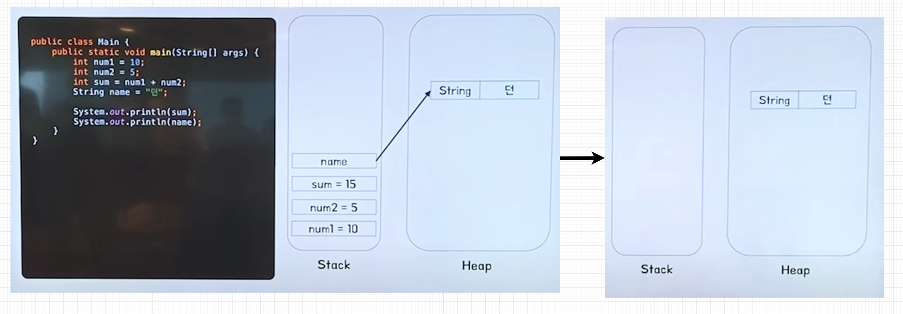
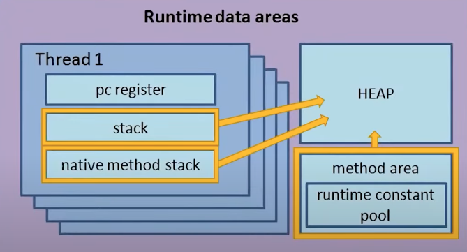
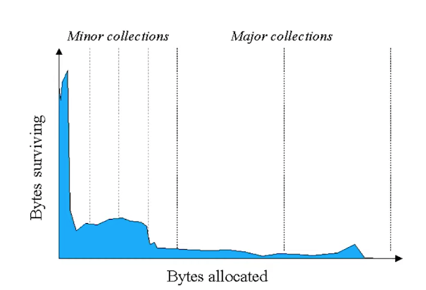
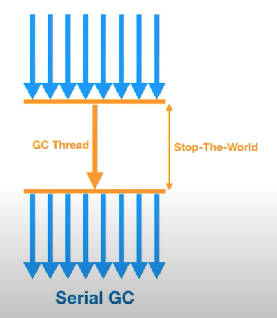

## 메모리 구조
 

모든 프로그램은 메모리에 올라와야 실행할 수 있습니다. 따라서 프로그램에 사용되는 변수들을 저장할 메모리가 필요한데 운영체제는 프로그램의 실행을 위해 다양한 메모리 공간을 제공합니다. 대표적으로 위와 같은 4가지 영역이 있습니다.
 

+ Code 영역
    - 실행한 프로그램의 코드가 저장되는 영역으로 텍스트 영역이라고도 합니다.
    - CPU는 코드 영역에서 저장된 명령어를 하나씩 가져가서 처리합니다.
+ Data 영역
    - 전역 변수, 정적 변수가 저장되는 영역입니다.
    - 프로그램의 시작과 함께 할당되어 프로그램이 종료되면 소멸합니다.
+ Heap 영역
    - 프로그램을 실행하면서 생성한 모든 객체가 저장되는 영역입니다.(흔히 new를 통해 성상한 모든 Object 타입의 인스턴스가 저장되는 영역)
    - 힙 영역에 보관되는 메모리는 메소드 호출이 끝나도 사라지지 않고 유지되다가 이것을 __JVM의 가비지 컬렉터__ 가 메모리 해제하여 처리합니다.
+ Stack 영역
    - 함수의 호출과 관계되는 지역 변수와 매개변수가 저장되는 영역입니다.
    - 힙 영역에 생성된 Object 타입의 데이터의 참조값을 할당합니다.
    - 함수의 호출과 함께 할당되며, 함수의 호출이 완료되면 소멸합니다.
    - 컴파일 타임에 크기가 결정됩니다.

 

### JVM의 메모리 구조
 

  
JVM은 OS로부터 메모리르 할당 받은 후 메모리를 용도에 따라 여러 영역으로 나누어서 관리합니다. 이는 크게 두 영역으로 나눌 수 있습니다. 모든 쓰레드가 공유하는 영역으로 Method Area와 Heap 영역이 있고, 각 쓰레드마다 고유하게 생성하며 쓰레드 종료시 소멸되는 Stack, Pc Register, Native Method Stack 영역이 있습니다. 간단하게 살펴보면 다음과 같습니다.
 

+ Method Area( = Class Area, Static Area)
    - 클래스 파일의 바이트 코드가 로드되는 곳입니다.
    - 메인 메서드에서 사용하는 __클래스와 static 변수__ 가 메서드 영역에 저장됩니다.
    - 프로그램의 클래스 구조를 메타 데이터처럼 가지고 있고 메서드의 코드를 저장해둡니다.
    - 메서드 영역에 코드가 올라가는 것을 클래스 로딩이라고 하는데 메서드가 호출되려면 해당 메서드를 갖고 있는 클래스 파일이 메모리에 로딩되어 있어야하기 때문입니다.
+ Heap
    - 애플리케이션 실행 중에 생성되는 객체 인스턴스를 저장하는 영역으로 __JVM GC에 의해 관리__ 되는 영역
+ Stack
    - 메서드 호출을 스택 프레임이라는 블록으로 쌓으며 로컬 변수, 중간 연산 결과들이 저장되는 영역
+ pc register
    - 쓰레드가 현재 실행할 스택 프레임의 주소를 저장
+ Native Method Stack
    - C/C++ 등의 Low level 코드를 실행하는 스택

 

## 가비지 컬렉터
가비지 컬렉터는 __동적으로 할당한 메로리 영역 중 사용하지 않는 영역을 탐지하여 해제하는 역할__ 을 합니다.  
  
메인 메서드가 실행되면 스택에 num1, num2, sum 값이 쌓이게 되고, name은 Heap 영역에 쌓이고 스택에서는 이를 참조합니다. 메인 메서드가 끝나게 되면 스택이 전부 pop되고 Heap 영역에 객체 타입의 데이터만 남게 됩니다. 이런 객체를 __Unreachable Object__ 라고 표현하고 __가비지 컬렉터의 대상__ 이 됩니다.

## 가비지 컬렉터의 필요성
 

+ 장점
    - 메모리 누수 방지
    - 해제된 메모리 접근 방지
    - 해제한 메모리를 다시 이중 해제하는 것 방지
+ 단점
    - 개발자가 언제 GC가 메모리를 해제하는지 모름
    - 실행중인 애플리케이션이 리소스를 GC 작업에 내줘야 하므로 오버헤드 발생

 

## GC 알고리즘
### Reference Counting
 
  
reference count는 몇 가지 방법으로 해당 객체에 접근할 수 있는지를 의마합니다. 해당 객체에 접근할 수 있는 방법이 없다면, reference count가 0이 되면 가비지 컬렉션의 대상이 됩니다. 하지만 이 알고리즘은 순환참조의 문제가 발생합니다. Root Space에서 Heap space 접근을 모두 끊는다고 가정하면, 오른쪽 그림의 노란색 부분은 서로가 서로를 참조하고 있기 때문에 reference count가 1로 유지되면서 사용하지 않는 메모리 영역이 해제되지 못하고 메모리 누수가 발생하게 됩니다.

### Mark And Sweep
 

  
root space 에서부터 해당 객체에 접근 가능한지를 해제의 기준으로 합니다. 루트부터 그래프 순회를 통해 연결된 객체를 찾아내고, 연결이 끊어진 객체를 지우는 방식입니다. 루트로부터 연결된 객체를 __Reachable__, 연결되지 않았다면 __Unreachable__ 이라고 합니다. 위의 오른쪽 그림에서는 Sweep이후에 분산되었던 메모리가 정리된 것을 확인할 수 있는데 이를 메모리 파편화를 막는 Compaction이라고 합니다. 다만, 이 과정은 필수가 아닙니다. __자바는 Mark And Sweep 방식으로 CG를 진행합니다.__

 

1. 가비지 컬렉터가 Stack의 모든 변수를 스캔하면서 각각 어떤 힙에 있는 객체를 참조하고 있는지 찾아서 마킹합니다. (Mark 과정)
2. 마킹하고 있는 객체가 참조하고 있는 객체 또한 찾아서 마킹합니다. (Mark 과정)
3. 마킹되지 않는 객체를 Heap에서 제거합니다. (Sweep 과정)

 

#### 특징
 

+ 의도적으로 GC를 실행시켜줘야 한다.
+ 애플리케이션 실행과 GC 실행이 병행된다.

즉, 어느 순간에는 실행중인 애플리케이션이 GC에게 리소스를 내줘야 한다는 것입니다.

#### root space
 

  
포스팅의 제일 첫 부분에서 JVM의 메모리를 설명했습니다. 기억이 안나신다면 다시 맨위로 돌아가서 JVM 메모리 구조를 보시고 오면 됩니다. 위 그림에서 노란색 영역으로 표시된 부분이 GC의 시작점 Root Space에 해당하는 영역입니다.

 

## 언제 수행되는가?
 

  
위 그림은 JVM의 Heap 영역 구성입니다. JVM의 Heap 영역은 크게 __Young Generation과 Old Generation__ 으로 나뉩니다. Young Generation에서 발생하는 GC는 __Minor GC__ , Old Generation에서 발생하는 GC는 __Major GC__ 라고 부릅니다. young과 old가 모두 꽉차면 Full GC(minor GC + Major GC)가 발생합니다. Young Generation은 __Eden, Survival 0, Survival 1__ 영역으로 나뉩니다.

 

+ Eden
    - 새롭게 생성된 객체들이 할당되는 영역
+ Servival 0, 1
    - Minor GC로부터 살아남은 객체들이 존재하는 영역
    - 0 또는 1 둘중 하나는 반드시 비어있어햐 합니다.
    - 둘로 나눠져 있는 이유는 __메모리의 단편화__ 를 막기 위해서 입니다.

 

구성을 살펴보았으니 이제 어떻게 언제 수행되고 어떻게 동작하는지 순서대로 보겠습니다.
 

새로운 객체가 계속 생성되다가 Eden 영역이 꽉차는 순간 Minor GC가 발생합니다. mark and sweep이 진행되고 Unreachable은 해제되고 Reachable이라고 판단되는 객체들은 Survival 0 역역으로 옮겨지면서 age-bit가 0에서 1로 증가합니다. age-bit는 Minor GC에서 살아남을 때마다 1씩 증가합니다.
 

  
시간이 지나 Eden 영역이 꽉차게 되면 다시 Minor GC가 발생합니다. 이번에는 Reachable이라고 판단된 객체들이 Survival 1 영역으로 이동합니다.
 

  
시간이 지나 Eden 영역이 꽉차게 되면 다시 Minor GC가 발생합니다. 이번에는 Reachable이라고 판단된 객체들이 Survival 0 영역으로 이동합니다.  
 

  
JVM GC에서는 일정 수준의 age-bit를 넘어가면 오래도록 참조될 객체라고 판단하여 해당 객체를 Old Generation으로 넘겨주는데 이 과정을 __Promotion__ 이라고 합니다. java8 Parallel GC 사용 기준 age-bit가 15가 되면 promotion이 진행됩니다. 
 

  
언젠가 Old Generation 영역이 꽉차게되면 이때는 __Major GC__ 가 발생합니다. Mark And Sweep 방식을 통해 필요없는 메모리를 비워줍니다. Major GC는 Minor GC보다 더 오래 걸립니다.
 

### Young Generation과 Old Generation
 

  
heap 영역을 두 영역으로 나눈데는 이유가 있습니다. GC 개발자들이 애플리케이션을 분석해보니 대부분의 객체들의 수명이 짧다는 것을 확인했습니다. GC도 결국 비용이므로 메모리의 특정 부분만을 탐색하여 해제하면 효율적이기 때문에 Young Generation에서 최대한 처리하도록 나눴다고 합니다.

## 어떻게 애플리케이션과 병행되는가?
 

+ Stop The World
    - GC를 실행하기 위해 JVM이 애플리케이션 실행을 멈추는 것을 의미합니다.
    - 모든 GC는 STW를 발생시키는데 Minor GC는 객체의 수명이 짧고 많은 객체를 검사하지 않기 때문에 매우 빨라 애플리케이션에 거의 영향을 주지 않습니다. __반면에 Major GC의 경우 살아있는 모든 객체를 검사해야 하기 때문에 오랜 시간이 걸립니다.__
       
    - 
### Serial GC
  
__Serial GC는 하나의 쓰레드로 GC를 실행하는 방식입니다.__ 하나의 쓰레드로 GC를 실행시키다 보니 Stop The World 시간이 오래 걸립니다. 싱글 쓰레드 환경 및 Heap 영역이 매우 작을 때 사용하기 위한 방식 입니다.

### Parallel GC
  
__Parallel GC는 여러 개의 쓰레드로 GC를 실행하는 방식입니다.__ 여러 개의 쓰레드를 사용하므로 Stop The World 시간이 짧아지고, 멀티 코어 환경에서 애플리케이션 처리 속도를 향상시키기 위해 사용됩니다.  
Java 8에서 기본으로 사용되는 방식입니다.

### CMS GC
  
CMS는 Concurrent-Mark-Sweep의 줄임말으로 Stop The World 시간을 최소화하기 위해 고안되었습니다. 대부분의 가비지 수집 작업을 애플리케이션 쓰레드와 동시에 수행해서 Stop The World 시간을 최소화 시키는 방식입니다. 하지만 메모리와 CPU를 많이 사용하고, Mark And Sweep 과정 이후 메모리 파편화를 해결하는 Compaction이 기본적으로 제공되지 않기 때문에 G1 GC가 등장하면서 대체되었다고 합니다.

### G1 GC
  
G1는 Garbage First의 줄임말으로 Heap을 일정 크기의 Region으로 나눠서 어떤 영역은 Young Generation, 어떤 영역은 Old Generation으로 활용합니다. 런타임에 G1 GC가 필요에 따라 영역별 Region 개수를 튜닝합니다. 이에 따라 Stop The World를 최소화 할수 있게 되어 __Java9 이상부터는 G1 GC를 기본 GC를 기본 실행방식__ 으로 사용합니다.

#### 동작과정

1. Young 영역에서는 기본 GC와 마찬가지로 용량이 일정 수준 이상으로 올라가면 Minor GC가 발생하면서 Survivor 영역으로 객체들이 복사되고 age 값이 증가합니다. age가 일정 수준으로 올라가면 old 영역으로 promotion 됩니다.
2. G1에서 Full GC가 수행될 때는 다음과 같은 과정을 진행합니다.
> Initial Mark -> Root Region Scan -> Concurrent Mark -> Remark -> Cleanup -> Copy

+ Initial Mark
    - STW가 발생합니다.
    - Survivor 영역에서 Old 영역을 참조하고 있을 수 있는 영역들을 찾아 마킹합니다.
+ Root Region Scan
    - Initial Mark 단계에서 찾은 Survivor Region에 대한 GC 대상 객체 스캔 작업을 진행합니다.
+ Concurrent Mark
    - 전체 힙 영역에 대한 스캔으로 살아있는 객체가 존재하는 Region만 식별합니다.
+ Remark
    - STW가 발생하며 최종적으로 살아남은 객체를 식별합니다.
+ Cleanup
    - STW가 발생하며 살아남은 객체가 가장 적은 Region의 GC대상을 제거 한 뒤 빈 영역을 Available Region으로 변경합니다.
+ Copy
    - GC 대상이었지만 Cleanup 단계에서 완전히 비워지지 않은 지역의 남은 객체를 Available Region으로 복사하여 조각모음(Compaction)을 수행합니다.

 

## 정리

 
+ 가비지 컬렉터는 동적으로 할당한 메로리 영역 중 사용하지 않는 영역을 탐지하여 해제하는 역할
+ 자바 가비지 컬렉터는 Mark And Sweep 알고리즘을 사용
    - Java8 : Parallel GC 사용
    - Java9 이상 : G1 GC 사용

__동작 과정__
1. 새로운 객체 생성은 Heap의 Eden 영역에 저장
2. Eden 영역이 꽉차면 Minor GC가 수행되고, Reachable 객체는 Survival 0 영역으로 이동과 동시에 age-bit 1 상승
3. 2번 과정이 반복되면서 Survival 1 -> 0 -> 1 이동이 반복
4. age-bit가 일정 값 이상이 되면 해당 객체에 대해 promotion 과정이 진행되어 Old Generation 영역으로 이동
5. Old Generation 영역이 꽉차면 Major GC가 발생

  

__참고__  
<a href="https://www.youtube.com/watch?v=FMUpVA0Vvjw&list=PLo0ta52hn1uHQ5iQ3hAeRoMUeLJFIeRew" target="_blank"> [10분 테코톡] 🤔 조엘의 GC</a>  

