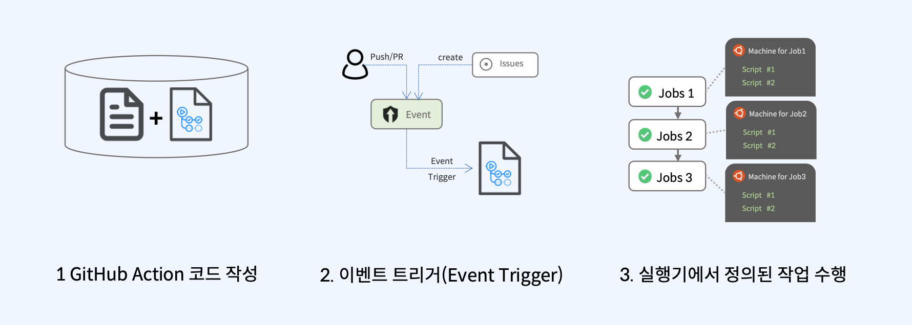
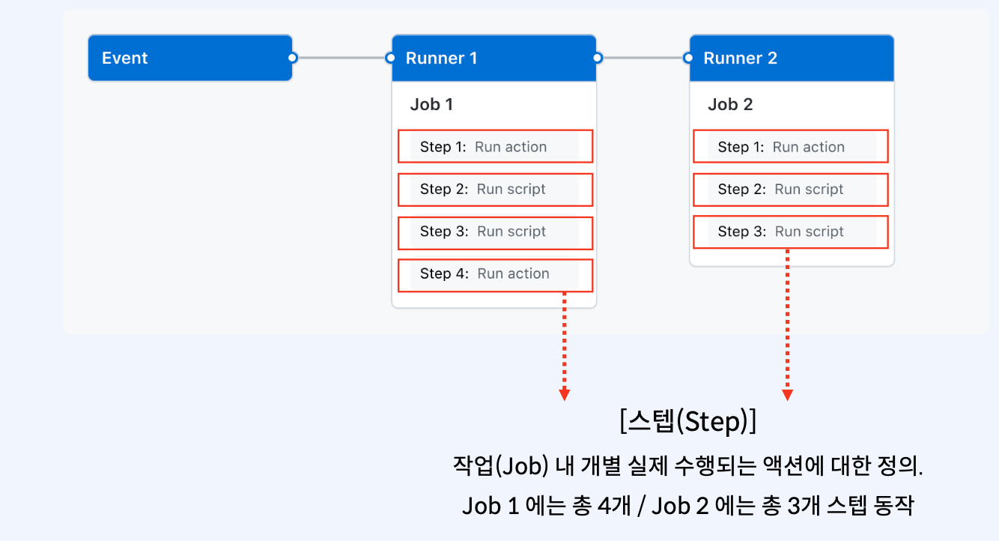
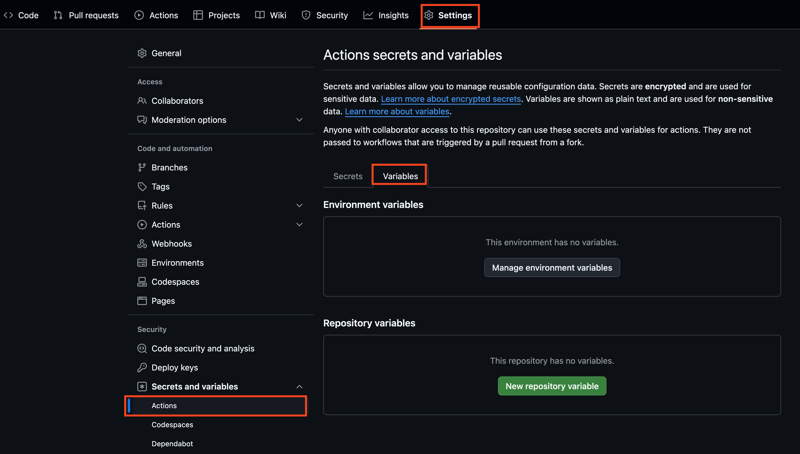
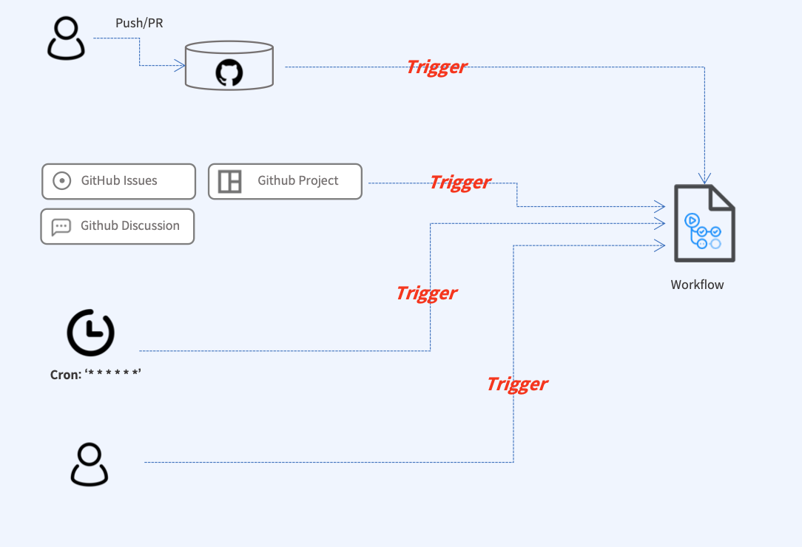
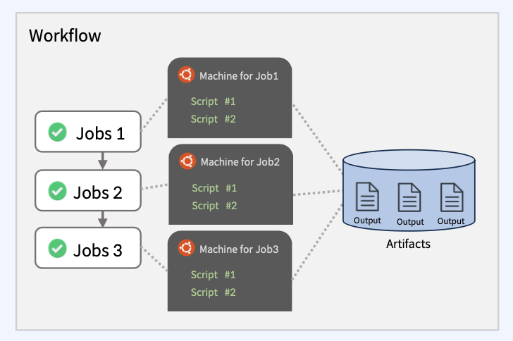
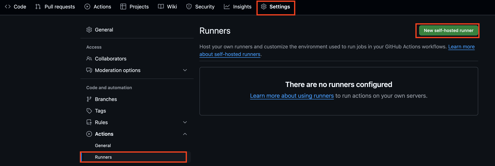
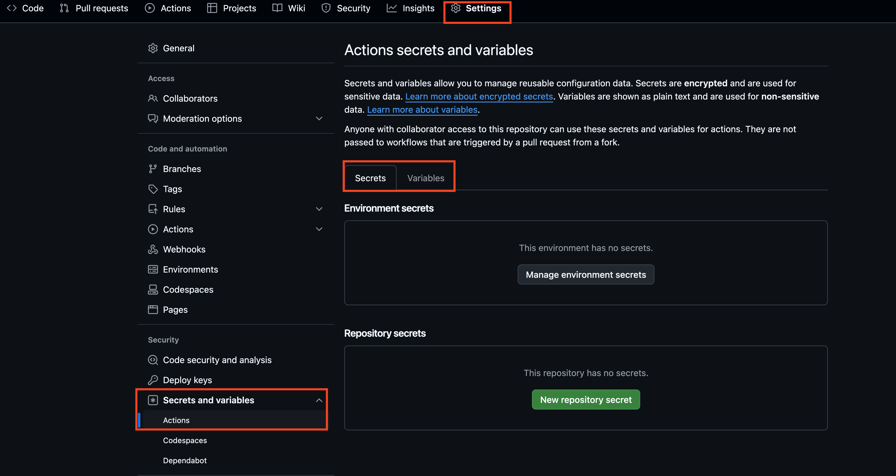
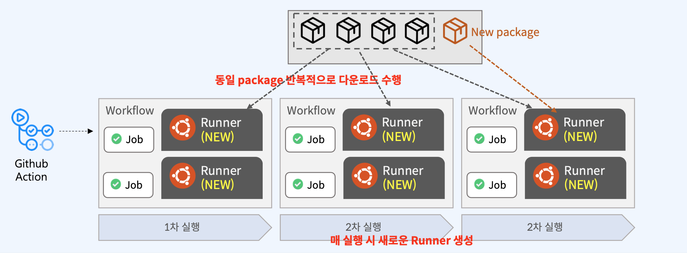

## 기본 flow

<br>

### 작동 단계
  

1. github push
2. event trigger
3. job 순서대로 작업 수행

<br>

### 이벤트 트리거
* repository에서 일어나는 push, fort 등의 작업
* github project, issue에서 일어나는 작업
* 사용자가 직접 트리거

<br>

### 코드 작성

  

**.github.workflows** 폴더 하위에 github action으로 실행하고자 하는 일들을 파일별로 정의하면 별도의 설정 과정 없이 project의 actions 탭들을 통해 실행할 수 있습니다. actions 탭에서는 워크플로우 실행 결과를 확인할 수 있습니다.

<br>

### workflow
workflow란 이벤트 발생시, 어떠한 행위를 할 것인가에 대한 작업 정의합니다.

  

* runner : job별 별도의 공간에서 실행하는 작업 공간에 대한 정의로 작업간 내용 공유는 기본적으로 제공되지 않습니다.
* job : 워크플로우 내 작동하는 작업 단위
* step : job 내 개별 수행되는 액션에 대한 정의

```yml
name: Sample # workflow의 이름 => github action 버튼에서 노출
on: workflow_dispatch # 이벤트 트리거 정의 => 여기서는 수동 트리거
jobs:
  build: # job 1
    runs-on: ubuntu-latest # 해당 작업을 어떤 환경에서 수행할 것인지
    steps: # 순차적 step 정의
    - name: Checkout 
      uses: actions/checkout@v2
    - name: Build project
      run: |
        echo "Build Project"
    - name: Run tests
      run: |
        echo "Run Test"
  deploy: # job 2
    needs: build 
    runs-on: ubuntu-latest
    steps:
    - name: Deploy to production
      run: |
        echo "Deploying to production server"
```

<br>

## 기본 사용법

<br>

### 변수 사용법
* workflow 파일에서 사용되는 동적인 값으로 주로 환경 변수(environment variables), 시크릿(secret)값을 저장하고 사용합니다.
* workflow 파일에 env 키로 정의하여 단일 workflow에서 정의할 수도 있고 github organization이나 repository에서 정의하여 전체 workflow 내에서 global하게 사용할 수도 있습니다.
* 이외에도 Default로 제공되는 변수도 있습니다.
  * prefix로 GITHUB_X 또는 RUNNER_X로 네이밍되어 있습니다.

<br>

**workflow level에서 정의**
```yml
name: variable-1
on: workflow_dispatch

env:
  fruit: Apple

jobs:
  build_1:
    runs-on: ubuntu-latest
    env:
      fruit: Orange
    steps:
    - name: Step 1 
      run: |
        echo "Run Step 1, Make $fruit Juice!" 
  build_2:
    runs-on: ubuntu-latest
    steps:
    - name: Step 1
      run: |
        echo "Run Step 1, Make $fruit Juice!"
```

build_1 에서는 fruit이 재정의 되어있으므로 Orange가 출력되고 build_2에서는 바깥에 정의된 Apple을 사용하게 됩니다.

<br>

**repo, organization level**
  

위 탭에서 전역으로 사용할 변수를 지정할 수 있으나 다음과 같은 제약 조건이 있습니다. secret 탭에서는 보안에 관련된 변수들을 지정해두고 사용할 수 있습니다.

* 이름에는 영문 숫자 또는 언더바만 사용 가능
* 공백 허용 X
* Default variable과 겹치지 않도록 권장
* 숫자로 시작 불가
* 대소문자를 구분 X

```yml
name: global variable
on: workflow_dispatch
jobs:
  build:
    runs-on: ubuntu-latest
    steps:
    - name: Checkout 
      uses: actions/checkout@v2
    - name: Build project
      run: |
        echo "Build Project ${{ vars.PROJECT_NAME }}"
```
실제로 사용하는 시점에는 **vars.**를 붙여서 사용할수 있습니다.

<br>

### Step간 데이터 전달

* $GITHUB_OUTPUT 을 활용해 전달합니다.
* Key=value 형태로 $GITHUB_OUTPUT 에 기록합니다.
* 이후 `steps.<step_id>.outputs.<key>` 로 데이터 접근합니다.
* 기본적으로 job간의 공유는 불가능하고 외부 스토리지나 Artifact를 활용해야 합니다.

```yml
name: Step Output
on: workflow_dispatch
jobs:
  test-job:
    runs-on: ubuntu-latest
    steps:
    - name: Checkout 
      uses: actions/checkout@v2
    - id: generate-random-id
      name: Generate random string
      run: echo "random_id=$RANDOM" >> "$GITHUB_OUTPUT"
    - id: build-project
      name: Build project
      run: |
        echo "Random ID: ${{ steps.generate-random-id.outputs.random_id }}"
```

<br>

### 조건과 연산자
* startsWith : 특정 문자열로 시작 시, true로 반환
* endsWith : 특정 문자열로 끝날 시, true 반환
* format : 특정 포맷의 string 값을 변수로 변경
* join : array 배열의 문자열 값을 연결
* if: 조건문
* success, failure, canceled, always : 전 step의 상태에 따른 step 수행 결정  


if문을 사용할 수 있습니다.

```yml
name: if
on: workflow_dispatch
jobs:
  build:
    runs-on: ubuntu-latest
    if: ${{ github.event_name == 'workflow_dispatch' && github.ref == 'refs/heads/master' }}
    steps:
      - name: Say Hello
        run: |
          echo "Say Hello to $GITHUB_ACTOR"    
```

<br>


issue를 활용할 수도 있습니다.
```yml
name: issue
on: 
  issues:
    types: [opened, edited, labeled, unlabeled]
jobs:
  auto-assignee:
    runs-on: ubuntu-latest
    permissions:
      issues: write
    if: ${{ contains(github.event.issue.labels.*.name, 'bug') }}
    steps:
    - name: Auto assign issue
      uses: pozil/auto-assign-issue@v1
      with:
        assignees: ${{ vars.BUG_HUNTERS }}
```
bug라는 라벨이 포함되어 있으면 assignees를 bug_hunters로 지정하는 job입니다.

<br>

## workflow
<br>

### trigger
  

* workflow가 위치한 repository에서 발행한 이벤트
* repository 외 관련 서비스에서 발생항 이벤트
* 예약된 시간에 트리거
* 수동으로 직접 이벤트 트리거(workflow_dispatch)

<br>

**repository에서 발생한 이벤트**

push, pull_request, fork, release, tag, workflow 등의 이벤트를 트리거로 사용할 수 있습니다. on절에 명시합니다. paths-ignore 을 통해 무시할 수 있는 경우도 추가할 수 있습니다.

```yml
name: branch push
on: 
  push:
    branches:
      - '!test-**'
      - '!main'
      - '*'
    paths-ignore:
      - 'README.md'
      - '.github/workflows/**'
jobs:
  build:
    ...
```
<br>

**workflow 연동**
```yml
name: branch push
on: 
  push:
    tags:
      - 'v1.**'
jobs:
  build:
    ...
```
```yml
name: workflow next
on: 
  workflow_run:
    workflows: ["branch push"]
    types:
      - completed
jobs:
  build:
    ...
```

<br>

**schedule**
```yml
name: cron
on: 
  schedule:
  - cron: '*/5 * * * *'
jobs:
  build:
    ...
```

<br>

**수동 트리거 input**
```yaml
name: PART3 - CH2 - Workflow Dispatch
on: 
  workflow_dispatch:
    inputs:
      tag:
        description: 'Tag to deploy'
        required: true
        default: '1.0.0'

jobs:
  test-job:
    runs-on: ubuntu-latest
    steps:
      - name: Checkout
        uses: actions/checkout@v2
      - id: input
        name: input test
        run: echo "input=${{ github.event.inputs.tag }}"
```
github repo에서 수동으로 트리거하는 경우 input 값을 받아서 사용할 수도 있습니다.  

<br>

### artifact
  
GitHub Action 에서는 아티팩트(artifacts) 라는 기능을 통해 워크플로우(Workflow) 가 실행하는 동안 이전에 동일 업로드된 아티팩트(artifacts) 를 다운로드 받을 수 있게 지원합니다. Job 간의 특정 공유가 필요한 경우 사용합니다.  

```yaml
name: artifact
on: workflow_dispatch
jobs:
  job-1:
    runs-on: ubuntu-latest
    steps:
    - name: Get Random UUID
      id: uuid
      run: echo "::set-output name=uuid::$(uuidgen)"
    - name: Print UUID
      run: |
        echo "UUID: ${{ steps.uuid.outputs.uuid }}"
        echo "${{ steps.uuid.outputs.uuid }}" > uuid.txt
    - name: Upload UUID
      uses: actions/upload-artifact@v3
      with:
        name: uuid
        path: uuid.txt
  job-2:
    runs-on: ubuntu-latest
    needs: job-1
    steps:
    - name: Download UUID
      uses: actions/download-artifact@v3
      with:
        name: uuid
    - name: Print UUID
      run: |
        echo "UUID: $(cat uuid.txt)"
```
<br>

## job

### 구조
```yaml
name: job sample
on: workflow_dispatch
jobs:
  build: # id : job에 대한 고유 식별자
    name: Build and Test # job의 이름으로 github ui 상으로 표기
    runs-on: ubuntu-latest # runs-on : runner에 대한 정의, 작업을 수행할 머신의 형식 설정
    defaults: # run단계에서 적용될 shell과 working directory 설정
      run:
        shell: bash
        working-directory: ./build_sample/python    
    steps: # job 내의 실행 step 설정
      - id: checkout # step 고유 식별자
        name: Checkout # step 이름으로 ui 상에 표기
        uses: actions/checkout@v2
      - id: build-test
        name: Run npm build
        run: | # 쉘을 사용하여 명령어 실행. 단일/다중 명령 실행 가능
          npm ci
          npm run build
      - name: Login to Docker Hub
        if: always() # if문 
        uses: docker/login-action@v1
        with:
          username: ${{ secrets.DOCKERHUB_USER }}
          password: ${{ secrets.DOCKERHUB_PASSWORD }}
```

<br>

### runner

보통 실행기(Runner) 에서 코드를 다운 받고, 빌드를 위한 소프트웨어 설치 및 다양한 사전 실행 작업 및 빌드 행위를 수행합니다. 그렇기 때문에 다양한 OS 환경을 지원합니다. runner는 크게 두 가지 방식으로 제공합니다. 


* GitHub Hosting Runners
  * github에서 무료로 제공하는 공식 실행기(runner)
  * github에서 자체 관리하므로 최신 os와 보안 업데이트
  * 다양한 운영체제 환경과 버전에 맞춘 실행기
  * 동시에 실행할 수 있는 job에 제한이 있습니다.(월간 사용량, 계정 유형에 따라 상이)
  * 제공되는 환경
    * ubuntu, windows, macOS 
    * 3가지 모두 같은 방식으로 지원
      * latest 지정 : ex) ubuntu-latest
      * 버전 지정 : ex) ubuntu-22.04
* Self-hosted runners
  * 자체 관리 : 사용자가 직접 관리하는 방식으로 직접 인스턴스를 설치하고 해당 인스턴스를 지정
  * 해당 인스턴스에 github runner를 설치
  * 등록하여 사용 가능한 OS가 제한이 있지만 대부분을 지원

<Br>

**self-host 지정 & 사용**
  

settings 탭에서 self-host runner를 생성하면 가이드가 나와있으니 참고하여  github-runner로 사용할 인스턴스 내부에 github runner를 설치해야합니다.

```yaml
name: Self-Hosted Runner
on: 
  workflow_dispatch:
jobs:
  build:
    name: Build on self-hosted
    runs-on: self-hosted
    steps:
      - name: Say Hello
        run: |
          echo "Say Hello to $GITHUB_ACTOR"    
```

<br>


**matrix 사용법**
```yaml
name: Multi Matrix Runner 
on: workflow_dispatch
jobs:
  build:
  name: Multi OS Build 
  strategy:
    matrix:
      os: [ubuntu-20.04, ubuntu-22.04]
      version: [10, 12, 14] 
  runs-on: ${{ matrix.os }} 
  steps:
    - id: checkout
      name: Checkout
      uses: actions/checkout@v2 
    - id: setup-node
      name: Setup Node.js
      uses: actions/setup-node@v2 
      with:
        node-version: ${{ matrix.version }}
```
matrix를 사용하면 여러 환경에 대해 여러번 수행이 가능합니다. 위 케이스에서는 ubuntu-20.04환경에서 10, 12, 14 변수를 차례로 사용하여 수행하고 ubuntu-22.04 에서도 마찬가지 입니다. 즉, 총 6번을 수행하게 됩니다. 

<Br>

### 동시성
Job은 별도의 설정이 없다면 정의된 job들이 동시에 병렬 수행됩니다. 이를 제어하려면 **needs** 키워드를 사용합니다. 만약 grouping하여 group내 포함된 job들끼리 동시성을 제어하고자 한다면 **group** 키워드를 사용합니다.  

<br>

**needs를 사용한 의존성**
```yaml
name: needs
on: workflow_dispatch
jobs:
  job-1:
    name: Concurrency Job Test 1
    runs-on: ubuntu-latest
    steps:
    - id: checkout
      name: Checkout 
      uses: actions/checkout@v3
    - id: test-1
      name: Test 1
      run: echo "Test 1"
  job-2:
    name: Concurrency Job Test 2
    runs-on: ubuntu-latest
    needs: job-1
    steps:
    - id: checkout
      name: Checkout 
      uses: actions/checkout@v3
    - id: test-2
      name: Test 2
      run: echo "Test 2"
```

<br>

**Group**
```yaml
name: Groups
on: workflow_dispatch
jobs:
  job-1:
    name: Concurrency Job Test 1
    runs-on: ubuntu-latest
    concurrency:
      group: ${{ github.workflow }}-${{ github.ref }}-1
    steps:
    - id: checkout
      name: Checkout 
      uses: actions/checkout@v3
    - id: test-1
      name: Test 1
      run: echo "Test 1"
  job-2:
    name: Concurrency Job Test 2
    runs-on: ubuntu-latest
    concurrency:
      group: ${{ github.workflow }}-${{ github.ref }}-1
    steps:
    - id: checkout
      name: Checkout 
      uses: actions/checkout@v3
    - id: test-2
      name: Test 2
      run: echo "Test 2"
  job-3:
    name: Concurrency Job Test 3
    runs-on: ubuntu-latest
    concurrency:
      group: ${{ github.workflow }}-${{ github.ref }}-2
    steps:
    - id: checkout
      name: Checkout 
      uses: actions/checkout@v3
    - id: test-3
      name: Test 3
      run: echo "Test 3"
```
job-1, job-2는 같은 그룹으로 매핑되어 있고 job-3는 별도의 group으로 매핑되어있습니다. 따라서 job-3는 바로 수행되지만 job-1, 2는 동시 실행을 시도하게 되고, 그 중 하나가 먼저 실행을 시작하고 나머지 하나는 앞선 job이 완료된 이후 수행됩니다. 의존성을 추가하고 싶다면 needs를 마찬가지로 추가해줘서 순서를 지정할 수 있습니다.

<br>

### 권한
실행하고자 하는 행위가 Github이나 issue, discussion 등등 이라면 해당 서비스에 접근하기 위해 권한이 필요로 합니다.

* permission
  * action : github action 작업 수행 권한 설정
  * checks : 검사 실행
  * contents : repository 컨텐츠 접근 작업
  * discussions : discussion 접근
  * id-token : OIDC 토큰을 가져오는 작업
  * issues : issue 접근 작업
  * pages : pages 접근 작업
  * pull-requests : pr 관련 작업
  * security-events : github 코드 검사, dependabot 경고 관련 작업
* 권한 설정
  * write : 쓰기
  * read : 읽기
  * none: 지정하지 않음. 기본적으로 permissions에 키를 지정하지 않으면 모두 none


```yaml
permissions: 
  contents: read 
  pull-requests: write 
  issues: none
```


<br>

## 보안

<br>

### secret


secret 탭에서는 보안에 관련된 변수들을 지정해두고 사용할 수 있습니다.  
```yml
name: Github Secrets
on: workflow_dispatch
jobs:
  build:
    name: Build and Test
    runs-on: ubuntu-latest
    permissions:
      contents: read
      actions: read
    steps:
    - name: Checkout 
      uses: actions/checkout@v2
    - name: Build project
      env:
        SLACK_WEBHOOK_URL: ${{ secrets.SLACK_WEBHOOK_URL }}
      run: |
        echo "$SLACK_WEBHOOK_URL"
```

<br>

### Github Action 토큰 인증

워크플로우(Workflow) 실행 시, GitHub 관련 서비스에 접근하여 작업을 처리해야 하는 경우 해당 서비스에 접근하기 위한 API인증절차가 필요합니다. GITHUB_TOKEN 변수를 사용하면 github action에서 토큰을 자동으로 생성해주고 Job이 완료되거나 최대 24시간 내에 만료됩니다. 

<br>

github_token은 다음과 같은 권한 설정이 가능합니다.  

<br>

SCOPE|허용|제한
---|---|---
actions|read/write|none
checks|read/write|none
contents|read/write|none
deployments|read/write|none
id-token|none|none
issues|read/write|none
metadata|read|read
packages|read/write|none
pages|read/write|none
pull-requests|read/write|none
repository-projects|read/write|none
security-events|read/write|none
statuses|read/write|none

<br>

```yml
name: Github Token
on:
  - pull_request_target

jobs:
  triage:
    runs-on: ubuntu-latest
    permissions:
      contents: read
      pull-requests: write
    steps:
      - uses: actions/labeler@v4
        with:
          repo-token: ${{ secrets.GITHUB_TOKEN }}
```

<br> 

## workflow 캐시
  

반복적으로 다운로드 받게 되는 종속성을 가진 패키지를 매번 다운 받는 대신, 캐시 영역에 저장 후 캐시 히트시 저장된 파일을 바로 사용하게 하여 패키지 설치 과정을 최소화할 수 있습니다. 캐싱을 사용하려면 github action에서 제공해주는 cache action을 사용해야 합니다. cache action은 unique 키를 통해 캐시 공간 생성 및 히트 여부를 확인합니다. 패키지 매니저 캐싱을 위해서는 setup-XX action을 설정해야 사용 가능합니다. 캐시 설정에는 다음과 같은 설정이 필요합니다.

* key(필수) : 캐시 저장 시 캐싱 여부를 결정하는 키값으로 최대 512자
* path(필수) : 캐시 히트 되었다고 판단시, runner에 캐싱된 파일들을 복원하는 경로로 절대/상대 경로 모두 지정 가능
* restore-keys(옵션) : 캐싱 키를 찾지 못할 경우, 차선으로 restore-keys 값에 선언된 순서대로 키를 추가 확인(키가 완전히 매치되지 않아도 prefix를 확인하며 추가로 히트 여부를 확인)
* enableCrossOsArchive(옵션) : 다른 OS의 Runner에서 생성된 캐시라도 캐싱되면 사용 가능하도록 설정
* cache-hit : cache에 설정된 키와 일치하여 히트 여부 확인하는 것으로 히트된 경우 true 값을 리턴합니다.
* cache version : 캐시된 데이터를 저장하는데 사용된 압축툴과 디렉토리 경로를 조합하여 생성된 hash값으로 runner가 다른 OS인 경우 캐시 key가 동일해도 복원되지 않습니다.


```yml
name: Caching Dependencies
on: workflow_dispatch
jobs:
  build-using-cache:
    runs-on: ubuntu-latest
    steps:
      - uses: actions/checkout@v3
      - name: Move JS Sample code
        run: |
          mv cache_sample/* ./
      - name: Setup Node
        uses: actions/setup-node@v3
        with:
          node-version: '18.x'
          registry-url: 'https://registry.npmjs.org/'
      - id: node-cache
        name: Cache node modules
        uses: actions/cache@v3
        env:
          cache-name: cache-node-modules
        # node_mudules 위치에 있는 것을 캐싱
        with:
          path: node_modules
          key: ${{ runner.os }}-build-${{ env.cache-name }}-${{ hashFiles('**/package-lock.json') }}
          restore-keys: |
            ${{ runner.os }}-build-${{ env.cache-name }}-
            ${{ runner.os }}-build-
            ${{ runner.os }}-
      - name: Install dependencies
        # 캐시가 히트되지 않은 경우 install
        if: steps.node-cache.outputs.cache-hit != 'true'
        run: npm install
        # 캐시가 히트되었을때 잘 가져왔는지 확인
      - name: List packages from node modules
        continue-on-error: true
        run: npm list
```

<br>

**캐시 사용시 유의 사항**
* 7일 이상 액세스 되지 않은 캐시는 자동으로 삭제
* 저장할 수 있는 캐시 수는 제한이 없으나 모든 캐시 총 합은 최대 10GB
* 저장소가 한계에 도달 시 가장 오래된 캐시부터 삭제 수행


