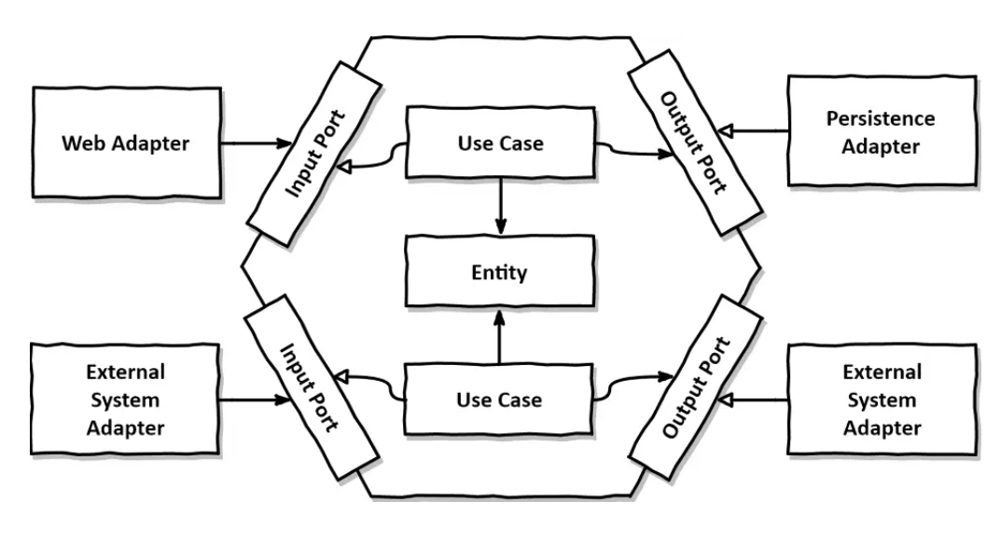
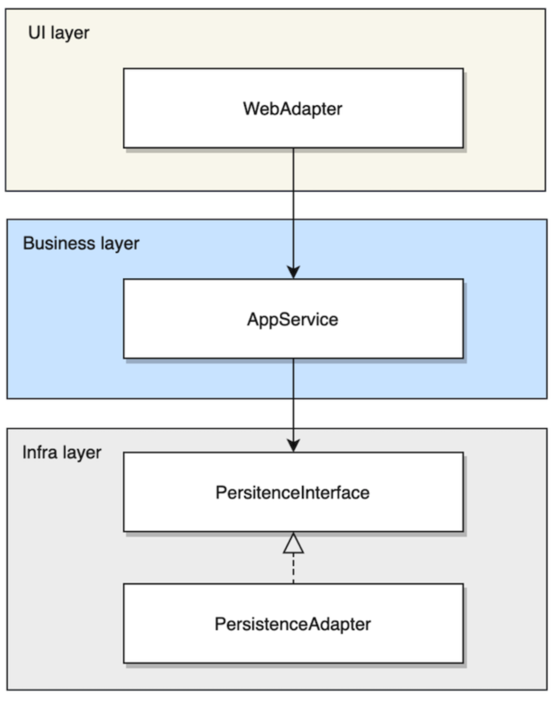
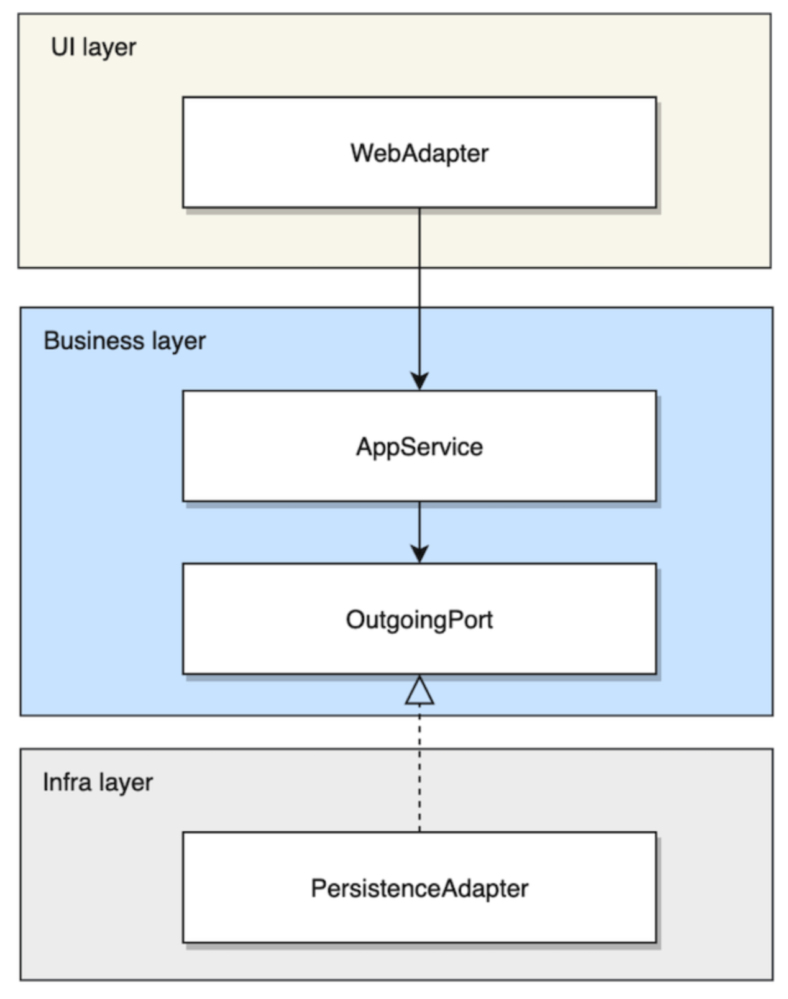
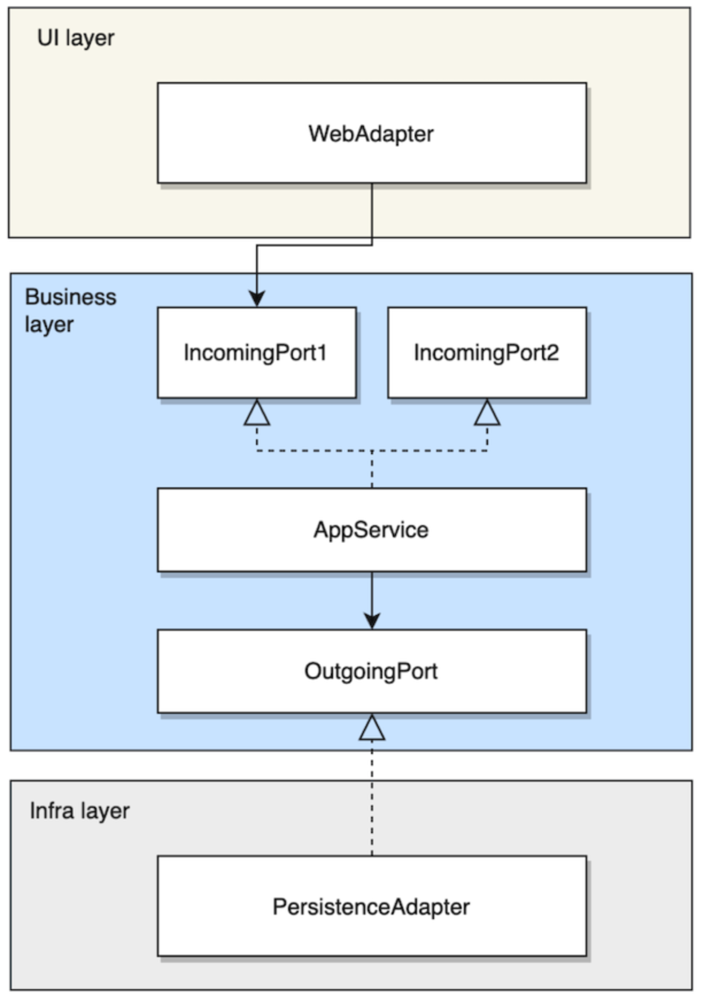

## Hexagonal 아키텍처


헥사고날 아키텍처(Hexagonal Architecture)는 포트와 어댑터 아키텍처(Ports and Adapters Architecture)라고도 불리는 소프트웨어 아키텍처 중 하나로 주요 목표는 응용 프로그램의 비즈니스 로직을 외부 세계로부터 격리시켜 유연하고 테스트하기 쉬운 구조를 만드는 것입니다. 이를 위해 핵심 비즈니스 로직은 중앙의 도메인 영역에 위치하며, 입력과 출력을 처리하는 포트와 어댑터를 통해 외부와 소통합니다.

* Adapter : 모든 외부 시스템과의 직접적인 상호작용을 담당
  * ex) Controller, Kafka Listener, DB DAO
* Inbound & Outbound port : 각 서비스 비즈니스 로직에 맞게 정의된 인터페이스

> 인바운드 어댑처 -> 인바운드 포트 -> 비즈니스 로직 -> 아웃바운드 포트 -> 아웃바운드 어댑터

내부의 로직은 오직 외부를 통해서만 접근이 가능한 컨셉으로 외부 서비스와의 상호 작용을 담당하는 Adapter는 비즈니스 로직과의 작업을 정의한 포트(인터페이스)랑만 서로 통신합니다.


### Layered 아키텍처에서 Hexagonal 아키텍처로



레이어드 아키텍처는 비즈니스 레이어가 인프라 레이어에 의존하여 강결합되는 구조를 가지고 있습니다. JPA로 예를 들면, PersistenceInterface는 JPA interface가 되고, 이에 대한 Adapter로는 SimpleJpaRepository가 될 수도 있고 QueryDsl을 사용한다면 추가적인 customImpl이 Adapter가 될 수 있습니다. 

**의존성 역전**
비즈니스 레이어가 인프라 레이어에 의존하게 되면서 인프라 레이어의 인터페이스가 변경되면 비즈니스 레이어도 함께 변경되어야 합니다. 즉, 인프라 레이어 내의 코드 변경에 의해 비즈니스 레이어도 함께 오염됩니다. 헥사고날 아키텍처에서는 다음과 같이 의존성을 역전합니다.



의존성 역전 원칙을 아웃고잉 어댑터에 적용하여 핵심 도메인 부분은 다른 레이어에 의존하지 않게 되어 독자적으로 개발 및 배포가 가능해졌습니다. 덕분에 테스트 용이성 또한 확보되었습니다.

**인터페이스 분리**
보통 비즈니스 레이어의 서비스는 하나 이상의 유즈케이스를 구현하고 있습니다. 즉, UI 레이어에서 비즈니스 레이어의 서비스를 호출할 때, 어떤 유즈케이스를 사용해야할지 명확하지 않은 경우가 발생할 수 있습니다. 또한, 위 그림의 appService를 그대로 사용하게 되면 여러 유즈케이스들의 불필요한 부분들을 모두 의존하는 상황이 발생합니다. 헥사고날 아키텍처에서는 다음과 같이 인터페이스를 분리합니다.




인터페이스를 분리하고 이를 appService가 구현하게 하고 UI 레이어에서는 적절한 인커밍 포트를 사용하게 됩니다. 이를 통해 해당 기능과 관련 없는 다른 부분에 의존하지 않게 됩니다. 

레이어드 아키텍처를 헥사고날 아키텍처로 변환하는 과정을 보면 다음과 같은 장점을 볼 수 있습니다.
* 유지보수성 : 책임이 분리되어 있어 코드 이해와 수정이 용이합니다.
* 유연성 : 포트와 어댑터를 사용함으로써, 다양한 변화에 대해 유연하게 대처할 수 있습니다.
* 테스트 용이성 : 각 컴포넌트를 독립적으로 외부 의존성 없이 테스트할 수 있습니다.
* 구조적으로 SOLID 원칙을 더욱 쉽게 적용 가능합니다.


헥사고날 아키텍처가 모든 상황에 적합한 것은 아닙니다. 헥사고날 아키텍처의 경우 기존 레이어드 아키텍처에 비해 코드량이 상당히 증가하며 처음 개발 이후 큰 비즈니스 로직의 변화가 존재하지 않는 프로젝트의 경우 오히려 레이어드 아키텍처가 더욱 안정적일 수 있습니다. 헥사고날 아키텍처는 보통 빠른 확장성과 유연성이 필연적으로 필요한 MSA 환경에서 적절한 아키텍처라고 표현하는 경우도 있으니 적절한 상황에 맞게 사용해야 합니다.


## 멀티 프로젝트로 Hexagonal 아키텍처 구축하기
하나의 레포지토리로 안에 여러 개의 프로젝트를 만들고 각각의 프로젝트는 멀티 모듈로 구성하는 데모를 만들어보겠습니다.

### 사전 지식
멀티 프로젝트 멀티 모듈을 구축하기 위해서는 사전 지식이 필요합니다.

#### implementation과 api
* implementation : implementation를 사용하면 해당 종속성은 현재 모듈 내부에서만 접근할 수 있습니다. 즉, 이 모듈을 의존하는 다른 모듈에서는 implementation으로 추가된 종속성에 직접 접근할 수 없습니다.
* api : 현재 모듈과 이 모듈을 의존하는 다른 모듈에서도 접근할 수 있도록 합니다. 즉, 현재 모듈이 api로 종속성을 추가하면, 이 모듈을 사용하는 모든 다른 모듈도 해당 종속성을 직접 사용할 수 있습니다. 

```groovy
// A Module
public class A 

// B Module
implementation project(':A')

// C Module
implementation project(':B')

public class C {
  public void act() {
    new A() // compile error
  }
}
```
A 모듈에서 A라는 클래스를 제공한다고 했을때, B 모듈에서 A모듈을 implementation으로 의존성을 가져온다면 B모듈에서는 A 클래스를 사용할 수 있습니다. 이 상태에서 C 모듈에서 B 모듈을 implementation으로 의존성으로 가져온다면 C모듈에서는 A클래스를 사용할 수 없습니다. 하지만 B모듈에서 implementation이 아닌 api를 사용해서 A모듈의 의존성을 가져왔다면 C모듈에서도 A모듈에서 제공하는 기능을 사용할 수 있으므로 A 클래스를 사용할 수 있게 됩니다.

#### include와 includeBuild
> https://docs.gradle.org/current/userguide/composite_builds.html

* include : 일반적으로 하나의 루트 프로젝트와 여러 서브 프로젝트로 구성된 구조에서 사용됩니다. include를 사용하면 서브 프로젝트들을 하나의 설정으로 결합하고, 이들 사이에 의존성을 관리할 수 있습니다.
* includeBuild : 다른른 독립적인 빌드를 포함하는 데 사용됩니다. 보통 여러 개의 독립적으로 빌드 가능한 프로젝트를 하나의 빌드에 포함하고자 할 때 사용합니다.

멀티 모듈의 경우 보통 include만 사용하지만 멀티 프로젝트를 만드는 경우, 타 프로젝트의 모듈을 가져오기 위해 includeBuild를 사용합니다.

```shell
├── common-library
│ ├── json
│ ├── settings.gradle.kts
│ └── build.gradle.kts
├── sample-service
│ ├── application
│ ├── build.gradle.kts
│ └── settings.gradle.kts
├── build.gradle.kts
└── settings.gradle.kts
```
위와 같은 구조의 sample-service, common-library 프로젝트가 있을 때, common-library 프로젝트의 json 모듈을 sample-service 프로젝트의 application 모듈에서 사용하기 위해서 includeBuild를 사용합니다.


```groovy
// root 프로젝트의 settings.gradle.kts
includeBuild("common-library")
includeBuild("sample-service")

// sample-service의 settings.gradle.kts
rootProject.name = "sample-service"

includeBuild("../common-library")

// sample-service의 application 모듈의 build.gradle.kts
dependencies {
  // 패키지명:모듈명
  implementation("com.sample.hexagonal.common:json")
}
```
위와 같은 구조로 의존성을 받아올 수 있습니다.


### 프로젝트 구조 
```shell
├── build-plugin
├── common-library
│ ├── exception
│ ├── json
│ └── utils
├── sample-service
│ ├── adapter
│ │ ├── inbound
│ │ │ ├── controller
│ │ │ └── listener
│ │ └── outbound
│ │     ├── producer
│ │     └── repository
│ ├── application
│ ├── domain
│ ├── infrastructure
│ │ ├── h2
│ │ └── mongo
│ ├── server
│ │ ├── api
│ │ └── consumer
```
* build-plugin : 여러 모듈에서 사용할 build-plugin을 관리하는 프로젝트
* common-library : 여러 모듈에서 공용으로 사용할 library를 관리하는 프로젝트
* sample-service : 서비스 프로젝트
  * adapter.inbound : 외부 시스템과의 상호작용을 담당하는 Adapter 모듈로 외부에서 내부를 호출하는 역할 (controller, kafka-listener 모듈) 
  * adapter.outbound : 외부 시스템과의 상호작용을 담당하는 Adapter 모듈로 내부에서 외부를 호출하는 역할 (repository, kafka-producer 모듈)
  * application : 비즈니스 모듈 
  * domain : 도메인 모듈
  * infrastructure : outbound 모듈에서 사용하는 외부 인프라 (h2, mongo 모듈)
  * server : 서버를 띄우기 위한 (api, consumer 모듈)

**최상위 settings.gradle.kts** 
```groovy
includeBuild("build-plugin")
includeBuild("common-library")
includeBuild("sample-service")
```
최상위 settings.gradle.kts에는 composite build를 위해 includeBuild를 사용하여 각각의 프로젝트를 등록해줍니다. 

### build-plugin 프로젝트
build-plugin 프로젝트는 타 프로젝트의 모듈에서 사용할 공통적인 의존성을 관리하기 위한 목적의 프로젝트 입니다. 공식문서에서 가이드하는 [Precompiled script plugin](https://docs.gradle.org/current/userguide/custom_plugins.html#sec:precompile_script_plugin) 방식을 사용하여 여러 프로젝트에서 공용으로 사용할 build-plugin을 만들겠습니다.

```shell
├── build.gradle.kts
├── settings.gradle.kts
└── src
    └── main
        └── kotlin
            ├── sample-kotlin-jvm.gradle.kts
            └── sample-springboot.gradle.kts
```
build-plugin 프로젝트의 tree구조는 위와 같습니다.

<br>

**sample-kotlin-jvm.gradle.kts**
해당 파일은 spring이 아닌 단순 kotlin만을 사용하는 모듈을 위한 플러그인 파일입니다.
```groovy
import org.jetbrains.kotlin.gradle.tasks.KotlinCompile
import org.jlleitschuh.gradle.ktlint.reporter.ReporterType

plugins {
    id("org.jlleitschuh.gradle.ktlint")
    id("org.jetbrains.kotlinx.kover")
    id("java-library")

    kotlin("jvm")
    kotlin("kapt")
}

repositories {
    mavenCentral()
}

java {
    sourceCompatibility = JavaVersion.VERSION_17
}

dependencies {
    implementation("org.jetbrains.kotlin:kotlin-stdlib-jdk8")
    implementation("org.jetbrains.kotlin:kotlin-reflect")
    implementation("com.fasterxml.jackson.module:jackson-module-kotlin")

    implementation("io.github.microutils:kotlin-logging-jvm:3.0.5")

    testImplementation("io.kotest:kotest-runner-junit5-jvm:5.8.0")
    testImplementation("io.kotest:kotest-assertions-core-jvm:5.8.0")
    testImplementation("io.kotest:kotest-framework-datatest:5.8.0")
    testImplementation("io.mockk:mockk:1.13.8")
}

tasks.withType<KotlinCompile> {
    kotlinOptions {
        freeCompilerArgs = listOf("-Xjsr305=strict")
        jvmTarget = "17"
    }
}

tasks.withType<Test> {
    useJUnitPlatform()
}
```

<br>

**sample-springboot.gradle.kts**
해당 파일은 spring을 사용하는 모듈을 위한 플러그인 파일입니다.

```groovy
plugins {
    id("sample-kotlin-jvm") // 앞서 작성한 sample-kotlin-jvm.gradle.kts 파일을 플러그인으로 사용합니다.
    id("org.springframework.boot")
    id("io.spring.dependency-management")
    kotlin("plugin.spring")
}

dependencies {
    kapt("org.springframework.boot:spring-boot-configuration-processor")

    testImplementation("org.springframework.boot:spring-boot-starter-test")
    testImplementation("io.kotest.extensions:kotest-extensions-spring:1.1.3")
    testImplementation("com.ninja-squad:springmockk:4.0.2")
}
```
앞서 만들었던 sample-kotlin-jvm.gradle.kts 파일을 플러그인으로 사용했습니다. 이와 같은 방식으로 이제 앞으로 만들어낼 모듈들의 build.gradle.kts 파일에는 spring이 필요한 경우 **id("sample-springboot")** 를 사용하고 kotlin에 대한 의존성만 필요할 경우 **id("sample-kotlin-jvm")** 을 사용해서 build.gradle.kts 파일을 더욱 간결하게 만들어낼 수 있습니다. 

**build.gradle.kts**
build.gradle.kts의 plugins 블록에는 원래는 플러그인의 버전 정보를 함께 명시해야 합니다. 하지만 convention 플러그인을 만들 때는 명시한 플러그인의 버전은 build.gradle의 dependency로 지정해줘야 합니다. 관련 내용은 [forums](https://discuss.gradle.org/t/applying-a-plugin-version-inside-a-convention-plugin/42160)에서 확인할 수 있습니다.

```groovy
plugins {
    `kotlin-dsl`
}

repositories {
    mavenCentral()
    gradlePluginPortal()
}

dependencies {
    // jvm
    implementation("org.jetbrains.kotlin:kotlin-gradle-plugin:1.9.20")
    implementation("org.jetbrains.kotlin.kapt:org.jetbrains.kotlin.kapt.gradle.plugin:1.9.20")
    implementation("org.jetbrains.kotlinx.kover:org.jetbrains.kotlinx.kover.gradle.plugin:0.7.5")
    implementation("org.jlleitschuh.gradle:ktlint-gradle:11.0.0")

    // spring
    implementation("org.jetbrains.kotlin:kotlin-allopen:1.9.20")
    implementation("org.springframework.boot:spring-boot-gradle-plugin:3.2.0")
    implementation("io.spring.gradle:dependency-management-plugin:1.1.4")
}
```

### common-library 프로젝트
common-library는 생략하겠습니다. 자세한 코드는 [github]()를 참고 바랍니다.

### sample-service 프로젝트
```shell
├── adapter
 ├── inbound
  └── controller
 └── outbound
     └── repository
├── application
├── domain
├── infrastructure
 └── h2
├── server
 └── api
```
데모 코드에는 여러가지 모듈이 더 있지만 본 포스팅에서는 sample-service의 위 모듈에 대해서만 설명하겠습니다. 

#### domain 모듈
**build.gradle.kts**
```groovy
plugins {
    id("sample-kotlin-jvm")
}
```
domain 모듈은 앞서 만들어둔 build-plugin 프로젝트의 kotlin 플러그인만 사용합니다.

**Sample**
```kotlin
class Sample(
    val id: String? = null,
    name: String,
    val createdAt: LocalDateTime = LocalDateTime.now(),
    updatedAt: LocalDateTime = LocalDateTime.now(),
) {
    // 생략
}
```
앞으로 나오는 코드는 이 Sample 클래스를 기반으로 작성됩니다.

#### application 모듈
```shell
├── build.gradle.kts
└── src
    └── main
        └── kotlin
            └── com
                └── sample
                    └── hexagonal
                        └── sample
                            └── application
                                ├── port
                                │ ├── inbound
                                │ │ └── sample
                                │ │     ├── SampleDeleteInboundPort.kt
                                │ │     ├── SampleFindInboundPort.kt
                                │ │     └── SampleSaveInboundPort.kt
                                │ └── outbound
                                │     └── sample
                                │         ├── SampleDeleteOutboundPort.kt
                                │         ├── SampleFindOutboundPort.kt
                                │         └── SampleSaveOutboundPort.kt
                                ├── service
                                │ └── sample
                                │     └── SampleService.kt
```
application 모듈의 간략한 tree 구조는 위와 같습니다. inbound와 outbound는 앞서 언급했듯이 외부에서 내부로, 내부에서 외부로 나가는 통로 인터페이스입니다. application모듈의 service는 InboundPort 인터페이스를 구현하게 됩니다. 외부에서 내부로 들어오는 요청은 InboundPort를 통해 내부로 들어오고 내부에서 외부로 나가는 요청은 OutbountPort 인터페이스를 통해 나가게 됩니다.

**build.gradle.kts**
```groovy
plugins {
    id("sample-springboot")
}

dependencies {
    api(project(":domain"))
    implementation("com.sample.hexagonal.common:kafka-producer")
    implementation("com.sample.hexagonal.common:exception")
    implementation("com.sample.hexagonal.common:kafka-producer")

    implementation("org.springframework.data:spring-data-commons")
    implementation("org.springframework:spring-context")
    implementation("org.springframework:spring-tx")
}

// 생략
```
application 모듈은 domain 모듈과 common-library 프로젝트에서 필요한 모듈을 의존성으로 받아서 사용합니다.

**SampleService**
```kotlin
@Service
class SampleService(
    private val sampleDeleteOutboundPort: SampleDeleteOutboundPort,
    private val sampleFindOutboundPort: SampleFindOutboundPort,
    private val sampleSaveOutboundPort: SampleSaveOutboundPort,
) : SampleDeleteInboundPort, SampleSaveInboundPort, SampleFindInboundPort {

    @Transactional
    override fun saveSample(name: String): Sample {
        return sampleSaveOutboundPort.save(
            Sample.create(name),
        )
    }
  // 생략
}
```
SampleService는 InbountPort 인터페이스를 구현하게 되고 외부로의 요청은 OutbountPort 인터페이스를 사용하여 처리합니다.

#### adapter.inbound.controller 모듈
데모 코드에는 여러 inbound 모듈이 있지만 controller 모듈만 살펴보겠습니다.

**build.gradle.kts**
```groovy
plugins {
    id("sample-springboot")
}

dependencies {
    implementation(project(":application"))
    implementation("com.sample.hexagonal.common:json")
    implementation("com.sample.hexagonal.common:utils")

    implementation("org.springframework.boot:spring-boot-starter-web")
}

// 생략
``` 
application 모듈과 common-library 프로젝트에서 필요한 모듈을 의존성으로 받습니다.

**SampleController**
```kotlin
@RestController
class SampleController(
    private val sampleFindInboundPort: SampleFindInboundPort,
    private val sampleSaveInboundPort: SampleSaveInboundPort,
    private val sampleDeleteInboundPort: SampleDeleteInboundPort,
) {

    @PostMapping("/v1/sample")
    fun saveSample(@RequestBody sampleSaveRequest: SampleSaveRequest): SampleResponse {
        val sample = sampleSaveInboundPort.saveSample(sampleSaveRequest.name)
        return SampleResponse.from(sample)
    }
    // 생략
}
```
controller는 내부와 통신하기 위해 InbountPort 인터페이스를 사용하여 요청합니다.

#### adapter.outbound.repository 모듈
데모 코드에는 여러 outbound 모듈이 있지만 repository 모듈만 살펴보겠습니다.

**build.gradle.kts**
```groovy
plugins {
    id("sample-springboot")
}

dependencies {
  implementation(project(":application"))
  implementation(project(":infrastructure:h2"))
//    implementation(project(":infrastructure:mongo"))
}

// 생략
``` 
Repository모듈은 application과 infra의 h2모듈을 의존성으로 사용합니다.

**SampleRepository**
```kotlin
@Repository
class SampleRepository(
    private val sampleDao: SampleEntityDao,
) : SampleDeleteOutboundPort, SampleFindOutboundPort, SampleSaveOutboundPort {
  
    override fun save(sample: Sample): Sample {
        return sampleDao.save(SampleMapper.mapDomainToEntity(sample))
            .let { SampleMapper.mapEntityToDomain(it) }
    }
    // 생략
}
```
Repository는 내부에서 외부의 요청에 사용되는 OutboundPort 인터페이스의 구현체를 생성합니다. 

#### infrastructure.h2 모듈

**build.gradle.kts**
```groovy
dependencies {
    implementation("com.sample.hexagonal.common:utils")
    implementation("com.sample.hexagonal.common:json")

    api("org.springframework.boot:spring-boot-starter-data-jpa")
    runtimeOnly("com.h2database:h2")
}

// 생략
```
h2 모듈에서는 common-library에서 필요한 의존성을 추가합니다.

**entity & dao**
```kotlin
@Entity
class SampleEntity(

    @Id
    @GeneratedValue(strategy = GenerationType.IDENTITY)
    val id: Long? = null,

    val name: String,

    @CreatedDate
    val createdAt: LocalDateTime,

    @LastModifiedDate
    val updatedAt: LocalDateTime,
)
```
```kotlin
@Repository
interface SampleEntityDao : JpaRepository<SampleEntity, Long>
```
h2 모듈에서는 Repository 모듈에서 사용할 인프라 기술들을 구현합니다.

#### server.api 모듈

**build.gradle.kts**
```groovy
plugins {
  id("sample-springboot")
}

dependencies {
    implementation(project(":domain"))
    implementation(project(":application"))
    implementation(project(":adapter:inbound:controller"))
    implementation(project(":adapter:outbound:repository"))
    implementation(project(":adapter:outbound:producer"))
    implementation(project(":infrastructure:h2"))

    implementation("com.sample.hexagonal.common:actuator")
    implementation("org.springframework.boot:spring-boot-starter-web")
  
    // 명시적으로 확인하기 위해서 추가
    implementation("com.sample.hexagonal.common:utils")
    implementation("com.sample.hexagonal.common:json")
    implementation("com.sample.hexagonal.common:kafka-producer")
    implementation("com.sample.hexagonal.common:exception")
}

// 생략
```
server-api 모듈은 서버를 띄우기 위한 껍데기 모듈입니다. 컴포넌트 스캔을 위해 해당 서버를 띄울때 사용할 의존성들을 추가합니다. 외부 프로젝트 모듈의 경우 이미 내부 모듈의 의존성으로 들어가 있기 때문에 스프링 부트의 컴포넌트 스캔 메커니즘상 클래스패스에 존재하는 모든 패키지를 스캔할 수 있기 때문에 외부 프로젝트 모듈은 의존성으로 추가하지 않아도 됩니다. 하지만 외부 프로젝트 모듈을 추가하지 않으면 컴포넌트 스캔으로 지정할 basePackage를 누락할 가능성이 있기 때문에 명시적으로 의존성을 추가해두고 basePackage를 지정할때 참고할 수 있도록 해두었습니다.

**SampleApplication**
```kotlin
@SpringBootApplication(
    scanBasePackages = [
        "com.sample.hexagonal.sample.server.api",
        "com.sample.hexagonal.sample.adapter",
        "com.sample.hexagonal.sample.application",
        "com.sample.hexagonal.sample.infrastructure",
        "com.sample.hexagonal.common"
    ],
)
class SampleApplication

fun main(args: Array<String>) {
    TimeZone.setDefault(TimeZone.getTimeZone(ZoneOffset.UTC))
    runApplication<SampleApplication>(*args)
}
```
외부 프로젝트의 의존성은 common-library 프로젝트의 모듈만 사용하므로 common을 추가했고 나머지는 내부 모듈의 패키지 경로를 추가했습니다. 현재 데모 코드상에서는 사실 **com.sample.hexagonal** 만 명시하거나 **com.sample.hexagonal.sample**으로 sample-service 패키지 경로를 입력해서 스캔 목록을 간소화할 수 있습니다. 하지만 위와 같이 한 이유는 만약 현재 api 서버에서 adapter.controller 모듈을 사용하나 adapter.controller.external 패키지만 사용하므로 해당 패키지만 추가하고 싶을 수 있고 이는 스캔 목록을 통해 컨트롤할 수 있다는 것을 보여드리기 위함입니다.


**참고**
* [Hexagonal Architecture](https://devocean.sk.com/blog/techBoardDetail.do?ID=165581)

