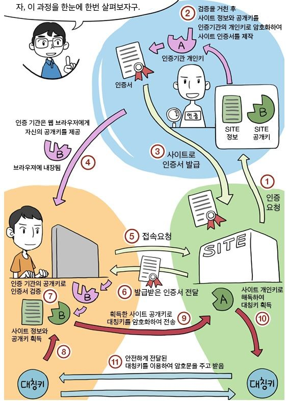

## HTTP와 HTTPS
 

* HTTP
  * Hypertext Transfer Protocol의 줄임말
  * 서로 다른 시스템들 사이에서 통신을 주고받게 하는 가장 기본적인 프로토콜입니다.
  * 서버에서 브라우저로 데이터를 전송하는 용도로 가장 많이 사용합니다.
* HTTPS
  * Hypertext Transfer Protocol Secure의 줄임말
  * SSL(보안 소켓 계층)을 사용
  * SSL은 서버와 브라우저 사이에 안전하게 암호화된 연결을 만들 수 있게 도와주고, 서버와 브라우저가 민감한 정보를 주고받을 때 해당 정보가 도난당하는 것을 막아줍니다.
  * Header는 암호화하지 않고 HTTP Message Body만 암호화합니다.

## SSL/TLS
 

SSL/TLS는 HTTPS에서 암호화 시 사용하는 방식입니다. SSL의 업그레이드 버전이 TLS로, 보통 같은 의미로 사용합니다. SSL은 Secure Sokets Layer의 줄임말로, 웹 서버와 웹 브라우저간의 보안을 위해 만든 프로토콜 입니다. 공개키/개인키, 대칭키 방식을 혼합 해서 사용합니다.

### 대칭키
 

대칭키 방식은 누구든지 암호화에 이용된 키를 가지고 있다면, 해당 데이터를 쉽게 복호화 할 수 있습니다. 즉, 클라이언트에서는 대칭키를 이용해 데이터를 암호화해서 서버로 보내면, 서버에서는 대칭키를 가지고 복호화해서 해서 데이터를 사용합니다. 만약 해커가 대칭키를 가지고 있고 중간에 데이터를 가로채간다면 해커도 해당 데이터를 읽을 수 있는 문제가 발생합니다.

### 공개키
 

공개키 방식은 서로 다른 키로 암호화 복호화를 수행하는 방식입니다. 서버측에서는 나에게 데이터를 보낼 때는 이 키를 사용해서 보내달라고 모두에게 공개키를 공유하고 해당 공개키로 암호화된 데이터를 복호화할 수 있는 개인키는 서버 혼자만 갖고 있습니다. 따라서, 중간에 해커가 데이터를 가로채더라도 복호화할 수 있는 개인키가 없기 때문에 해당 데이터를 읽을 수 없습니다. 하지만, 공개키 방식은 암호화 연산 시간이 더 소요되어 비용이 대칭키 방식보다 비용이 큽니다.3

## SSL 통신 과정
 

SSL은 각 방식이 가진 단점 때문에 두 방식을 적절히 혼합하여 사용합니다.

A에서 B로 접속 요청을 보냅니다.

 

B는 A에게 자신의 공개키를 전송합니다.

 

A는 B에게 받은 공개키로 자신의 대칭키를 암호화하여 다시 B에게 전송합니다.

 

B는 자신의 공개키로 암호화된 A의 대칭키를 개인키로 복호화하여 A의 대칭키 값을 얻어냅니다.

 

이렇게 얻어낸 대칭키를 사용하여 A와 B는 안전하게 통신합니다.

 

정리하자면, 한쪽의 대칭키를 다른쪽의 공개키로 암호화하여 전송하면 다른쪽에서는 개인키로 복호화하여 반대편의 대칭키를 알아내고, 이 대칭키를 바탕으로 서로 통신하게 됩니다.

## 유효한 사이트 확인
 

1. 사이트는 사이트 인증서가 필요합니다. 사이트 인증서는 인증기관에서 발급하는 문서입니다. 이를 위해 사이트에서는 인증기관에게 사이트 정보와 사이트 공개키를 전송합니다.
2. 인증기관에서는 전달받은 데이터를 검증하고, 해당 데이터를 자신의 개인키로 암호화하여 인증서를 만듭니다. 이는 인증기관의 공개키로 복호화할 수 있습니다.
3. 생성된 인증서를 사이트에게 전달합니다.
4. 인증기관은 자신의 공개키를 사용자에게 전달합니다. 사용자가 인증기관으로부터 전달받은 인증기관 공개키는 사용자 브라우저에 자동으로 내장됩니다. 여기까지는 사용자가 사이트에 접속하기 전의 내용입니다.
5. 사용자가 사이트에 접속을 요청합니다.
6. 사이트에서는 자신이 신뢰할 수 있는 사이트임을 증명하기 위해서 사이트 인증서를 전송합니다.
7. 사용자는 인증기관의 공개키를 브라우저 내에 내장하고 있으므로 공개키로 복호화하여 사이트 정보와 사이트의 공개키를 획득합니다.
8. 사이트의 공개키로 자신의 대칭키를 암호화합니다.
9. 암호화된 자신의 대칭키를 전송합니다.
10. 전달받은 사용자의 암호화된 대칭키를 자신의 개인키로 복호화하여 사용자의 대칭키를 획득합니다.
11. 사용자의 대칭키를 사용한 암호문으로 통신합니다.
