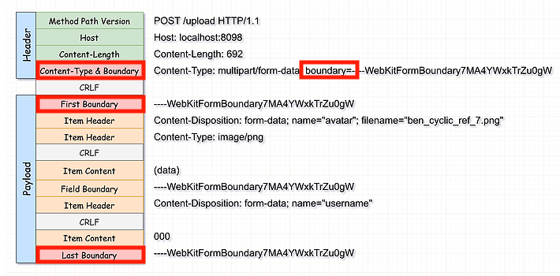
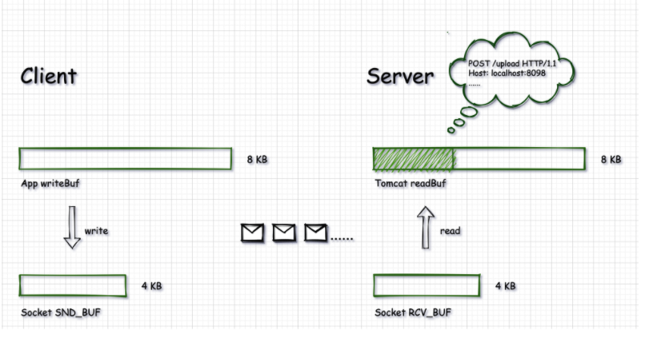
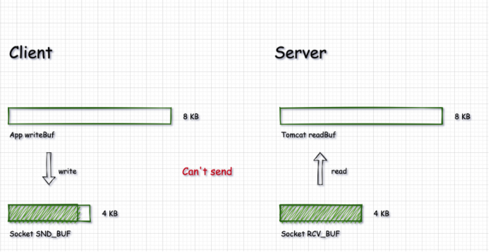

## application/octet-stream은 무엇일까?
 

구글링 결과는 다음과 같습니다.

> application/octet-stream은 이 타입은 이진 파일을 위한 기본값입니다. 이 타입은 실제로 잘 알려지지 않은 이진 파일을 의미하므로, 브라우저는 보통 자동으로 실행하지 않거나 실행해야 할지 묻기도 합니다. Content-Disposition 헤더가 값 attachment 와 함게 설정되었고 'Save As' 파일을 제안하는지 여부에 따라 브라우저가 그것을 다루게 됩니다.

application/octet-stream은 알려지지 않은 이진 파일을 알리는 content-type이라고 볼 수 있습니다.

 

## multipart/form-data
 

클라이언트는 HTTP Request의 Body에 전송하고자 하는 데이터를 넣을 수 있습니다. Body에 들어가는 데이터의 타입을 HTTP Header에 Content-type으로 명시해 줌으로써 서버가 타입에 알맞게 처리하도록 유도할 수 있습니다. 보통 HTTP Request의 Body는 한 종류의 타입이 대부분이고, 그에 따라 Content-type도 타입을 하나만 명시할 수 있습니다. 예를 들면, text이면 text/plain, xml이면 text/xml, jpg이미지면 image/jpeg 입니다. 일반적인 form의 submit에 의한 데이터들의 Content-type은 application/x-www-form-urlencoded 입니다. 하지만 파일 업로드를 예로 들면, 사진에 대한 설명 input과 사진 파일을 위한 input 2개가 들어갑니다. 이 경우에는 두 input 간에 Content-type이 전혀 다릅니다. 사진 설명은 application/x-www-form-urlencoded 이고, 사진 파일은 image/jpeg 입니다. 두 종류의 데이터가 하나의 HTTP Request Body에 들어가야 하는데, 한 Body에서 두 종류의 데이터를 구분에서 넣어주는 방법이 필요해지면서 multipart 타입이 등장하게 됩니다.

위 그림은 multipart/form-data 요청에 대한 HTTP 메시지입니다. HTTP Header 부분은 Boundary가 추가된 것을 제외하면 일반적인 다른 Content-Type과 다른것이 없습니다. 반면에 Payload 부분은 다른 Content-Type의 Payload와 비교했을 때 다른 부분이 존재합니다. Payload를 보면 Boundary를 통해 content-type이 구분되어 있는 것이 보입니다. First Boundary를 보면 ContentType이 image/png인 것이 보이고, 두 번째 data 부분에는 파일이 아니라 일반 데이터인 것이 보입니다. __즉, multipart/form-data는 하나의 요청에 여러 content-type을 담는 방식을 제공하는 방식입니다.__

 

## Tomcat의 파일 업로드 구현 방식

구조적 차이를 설명했고, tomcat에서는 이 두가지 content-type을 사용할 때, file을 처리하는 방식에 차이가 있습니다.

Tomcat을 통해 데이터를 전송하게 되면 다음과 같은 방식으로 동작한다.
1. Client는 Socket Send Buffer로 데이터를 보낸다.
2. Socket Send Buffer가 가득차면 Socket Receive Buffer로 보낸다.
3. Tomcat ReadBuf는 Socket Receive Buffer에 있는 것을 InputStream으로 감싸서 읽어온다.
   - 감싸는 이유는 readbuf가 socketbuf로부터 읽어서 어플리케이션에 제공하는 일련의 과정을 추상화 하기 위해서

즉, 톰켓은 데이터 전송 요청이 오면 Payload에 해당하는 데이터를 한번에 읽어 메모리에 올리지 않습니다. Socket Recieve Buffer를 읽어올 때 InputStream으로 감싸서 읽어오기 때문에 우리는 Controller의 request에서 getInputStream을 사용하여 Socket Receive Buffer를 읽어서 파일을 읽어올 수 있는 것입니다.

 

일반적으로 데이터 전송은 위와 같이 동작하지만 톰캣은 Content-Type이 multipart/form-data일 때는 다르게 동작합니다. 톰캣은 multipart/form-data 타입의 payload 데이터를 메모리에 로딩하지 않고 **서버의 디스크에 임시로 저장하고 나중에 다시 삭제합니다.** 디스크에 저장된 것을 읽어와야하기 때문에 효율성이 낮을 수밖에 없습니다3.

 
그렇다면 왜 이런 방법을 택했을까요?  

**TCP Blocking 때문입니다.** 만약 Disk에 저장되지 않는다면, 클라이언트와 서버가 데이터를 보내고 받는 작업이 계속 진행되게 됩니다. 그런데 서버에서 Socket Receive Buffer가 가득찼는데도 데이터를 읽어가지 않는다면 socket receive buffer가 비워지지 않기 때문에 Socket Send Buffer에서도 socker receive buffer로 데이터를 보낼 수 없게 되고 전체에서 병목 현상이 발생하게 됩니다.

 

그리고 일반적으로 File은 Socket Send Buffer, Socket Receive Buffer의 사이즈보다 큽니다. 따라서 Socket receive Buffer를 사용하게 되면 TCP Connection을 맺게 되면서 TCP Blocking 발생할 수 있으므로 이를 막고자 Payload 부분을 한번에 읽어서 디스크에 저장하는 방식을 선택하고 있는 것입니다. 덕분에 서버는 톰캣에서 디스크에 저장해놓은 것을 읽어오면 되기 때문에 Socket Recieve Buffer가 빨리 비워지지 않아서 TCP Blocking이 일어나는 것을 막을 수 있게 됩니다.

 

상황에 따라 다르겠지만 네트워크 환경이 안좋은 곳이라면 디스크에 저장한 후 읽어오는 방식이 더 좋은 방식입니다. 반면에 한국처럼 네트워크가 빠르다면 TCP Blocking 시간 자체가 없다고 봐도 되기 때문에 디스크에 파일을 저장하고 다시 읽어오는 작업은 비효율적입니다. 더불어, 해당 파일이 큰 경우라면, 디스크에 i/o를 하는 작업이 성능에 영향을 줄 수도 있습니다.  

 

즉, tomcat에서 데이터를 모두 읽어서 임시로 파일로 저장해두느냐, 아니면 읽는대로 바로 처리하는 것을 반복하느냐 정도로 octect-stream 방식과 multipart 방식을 구분해서 사용할 수 있다는 것입니다.

 

## 결론
**결론적으로 네트워크 상황이 좋다면, application/octect-stream이 tomcat에서 파일을 처리하기에 용이합니다.**  
 

왜냐하면 신경쓸게 줄어들기 때문입니다. (디스크 공간, 버퍼 크기 등) 신경쓸게 줄어들고 TCP Blocking이 별다른 성능 저하를 일으키지 않는다면 application/octect-stream을 선택하지 않을 이유가 없습니다. 네트워크 상황이 좋지 않아도 버퍼 크기를 충분히 키운다면 마찬가지로 TCP Blocking이 별다른 성능 저하를 일으키지 않게 됩니다. 좀 더 심화해보자면, 네트워크 상황은 구간별로 봐야합니다. 왜냐면 보통 서버를 단일 레이어로 구성하지 않기 때문입니다.

 

예를 들어, 클라이언트와 리버스 프록시 서버 사이는 대체로 네트워크 상황이 좋지 못하고, 리버스 프록시 서버와 백엔드 서버 사이는 네트워크 상황이 굉장히 좋습니다. 그렇다면 리버스 프록시 서버의 버퍼를 키워서 네트워크 이슈(Blocking)를 회피하고 백엔드로 보낼때는 별다른 고민 없이 보내는 방안을 선택할 수 있습니다.

 

굳이 왜 이렇게 하느냐면, 보통 리버스 프록시가 설정이 간단하고 단순한 작업을 처리하는데 성능이 더 좋기 때문입니다. 게다가 스케일아웃할때 비용도 생각해봐야하는데, 버퍼 역할만 스케일아웃 하면 되는데 비싼 JVM 서버를 올리는건 비용적으로 좋지 못한 선택입니다. tomcat을 띄우려면 jdk가 필요하고 많은 메모리가 필요하고 또 많은 코드가 필요합니다.

 

네트워크 상황이 좋다면 application/octect-stream 방식은 프론트에서는 파일을 청크단위로 쪼개서 굳이 나눠서 올릴 필요는 없습니다. 하지만 상황이 좋지 않다면 이 방식 또한 청크 단위로 쪼개서 청크 크기만큼의 버퍼를 제공해야 합니다. 청크 단위로 나누는 이유는 무한한 크기의 버퍼를 제공할 수는 없기 때문입니다. octect 방식은 쪼갤수도 안쪼갤수도 있지만 multipart 방식은 무조건 청크로 나눠야 합니다. 왜냐하면 tomcat에서 multipart를 스트리밍해서 받는 옵션을 제공하지 않기 때문입니다. octect-stream으로 업로드를 시도하면 스레드 하나가 점유되기 때문에 업로드에 스레드들이 모두 점유되버리면 응답지연이 발생할 수 있기 때문에 큰 경우라면 octect도 쪼개서 진행하는 것이 좋습니다. 

청크로 나누는 이유를 정리해보자면,
* 버퍼 크기에 맞추려고
* 병렬 업로드 하려고
* 1개 세션이 너무 길어지는 것을 방지

한국에서 청크를 나누지 않아도 되는 이유는 버퍼나 병렬이 필요 없을 정도로 네트워크가 빨라서입니다. 한국일지라도 3번때문에 청크로 나누는게 좋습니다.

결론적으로 정리해보면,
+ 적당한 크기 + form-data 들은 multipart/form-date 방식을 사용
+ 본격화된 업로드 기능(대규모 업로드)은 application/octect-stream
+ 파일 크기가 어느 정도 크다면 청크 단위로 나눠서 전송

