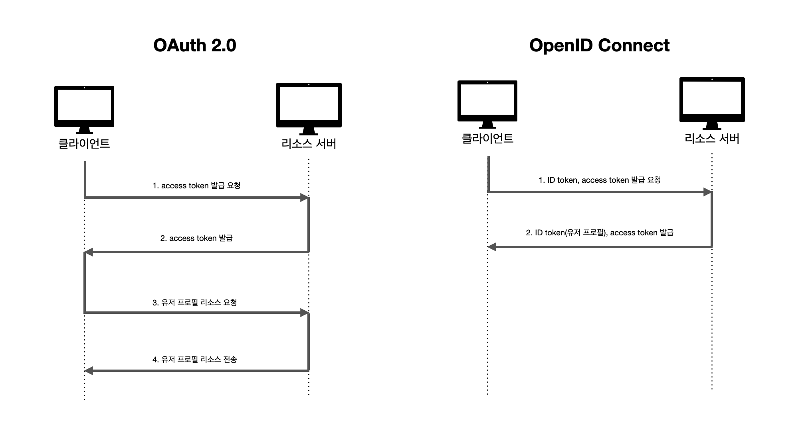
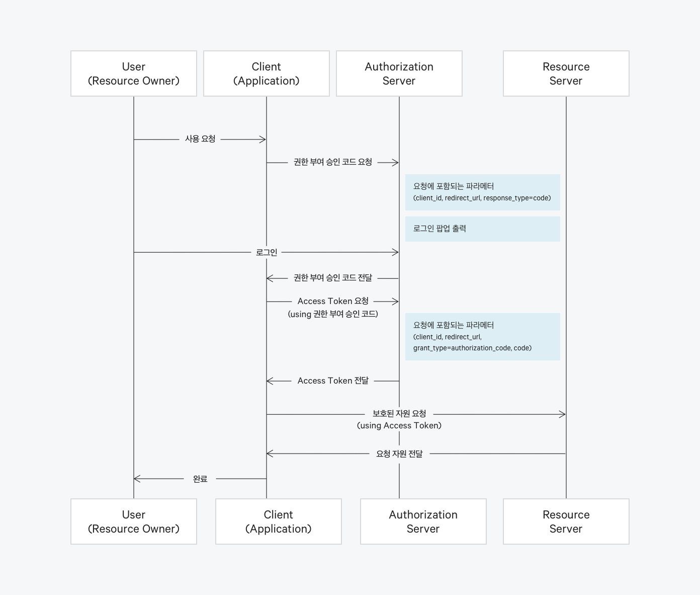

## SSO(Single Sign On)
SSO는 이름 그대로 단일 로그인, 즉 한번의 로그인으로 여러 개의 애플리케이션을 사용할 수 있도록 해주는 인증 체계입니다.  

SSO가 없다면 사용하고자 하는 서비스마다 따로따로 계정을 갖고 있어야만 하지만 SSO가 도입된다면 서비스마다 개별로 계정을 만드는 대신 하나의 계정으로 연관된 서비스를 사용할 수 있게 됩니다. 예시로 구글의 드라이브, gmail 등을 하나의 로그인으로 사용할 수 있는 것입니다.  

SSO 시스템은 여러 표준, 프레임워크에 의해서 구현될 수 있지만 대표적으로 SAML/OAuth/OIDC 세가지 방식이 있습니다.


<br>

## SAML
SAML은 인증 정보 제공자와 서비스 제공자 간의 인증 및 인가 데이터를 교환하기 위한 XML 기반의 표준 데이터 포맷입니다. 

XML 형식이기 때문에 브라우저를 통해서만 동작 가능하고 모바일이나 Native Application에서는 부적절한 방식입니다.

<br>

## OAuth2.0와 OIDC
OAuth주요 목적은 **인가(Authorization)** 이고 OIDC의 주요 목적은 **인증(Authentication** 입니다. 즉, OAuth는 리소스의 API를 사용할 수 있는 권한을 얻는 기술이고, OIDC는 해당 유저의 신원을 검증하는 기술입니다. 

하지만 OAuth도 권한을 얻기 위해 로그인을 해야하므로 유저를 인증하는 과정이 포함되어 있어 차이가 없다고 느낄 수 있습니다. 이는 두 프로토콜의 리턴값을 보면 차이를 알 수 있습니다.

<br>

> 인증은 사용자의 신원을 검증하는 비밀번호, 지문 인식 등을 의미하고 인가는 사용자에게 Admin 권한을 부여하는 등의 권한 부여를 의미합니다.

<br>

  

OAuth는 인증에 성공한 client에게 access token(또는 refresh token을 함께)을 제공합니다. 해당 토큰에는 scope와 expire 정보가 포함되어 있지만 유저에 대한 정보는 존재하지 않습니다. 따라서 유저 정보를 얻기 위해서는 access token을 얻은 후에 다시 해당 토큰을 가지고 유저 정보를 요청하는 작업을 수행해야 합니다.  

이런 단점때문에 생긴 프로토콜이 OICD입니다. OIDC 인증을 통해 발급된 ID Token에는 유저의 프로필, 이메일 등의 정보들이 포함될 수 있습니다. 이 때문에 소셜 프로필을 기반으로 회원 정보를 저장하는 애플리케이션의 경우 리소스 서버에 요청하여 회원정보를 가져오는 작업을 생략할 수 있습니다.  

단순히 네트워크 요청량을 줄이는 점에서도 이득이 있지만 OAuth 토큰을 인증 목적으로 사용하게 됐을 때는 여러 문제들이 있습니다.

* OAuth를 통해 얻는 Access Token은 User 인증 후에 발급되기 때문에 인증의 증거로 간주될 수 있으나, 실제 Access Token에는 user에 대한 정보가 없고 특정 권한에 대한 허가만 존재합니다.
* Access Token을 통해 특정 자원에 접근할 수 있으니 인증의 증거로 간주될 수 있으나 refresh token을 통해 사용자가 인증하지 않아도 access token을 발급받을 수 있으므로 인증의 근거로 사용하기에는 부족합니다.
* OAuth는 audience를 제한하는 기능이 없기 때문에 특정 client에서 발급받은 access token을 다른 client에서도 사용할 수 있습니다.
* OAuth에서 리소스 서버는 Access Token만을 가지고 요청을 처리합니다. 이 과정에서 리소스 서버는 사용자의 세션 상태나 연결 상태를 알 수 없습니다. Access Token의 유효성을 확인하기 위해 인증 서버에 확인을 요청할 수 있지만, 이는 Access Token을 발급할 당시의 인증 상태만을 반영할 뿐 현재 사용자가 여전히 존재하는지 여부 등의 상태를 보장하지 않습니다.


OIDC에서는 인증을 위한 ID Token을 따로 두어 위의 보안적인 위협들을 해소했습니다.

<br>

**OAuth Access token**
```json
{
  "iss": "https://auth.example.com/", // 토큰 발급자
  "sub": "1234567890",                // 사용자 식별자
  "aud": "https://api.example.com/",  // 토큰의 수신자
  "exp": 1516239022,                  // 토큰의 만료 시간
  "iat": 1516239022,                  // 토큰의 발행일
  "scope": "read write"               // 권한
}
```

<br>

**OIDC ID Token**
```json
{
  "iss": "https://example.com",
  "sub": "1234567890",
  "aud": "https://app.example.com",
  "exp": 1516239022,
  "iat": 1516235422,            
  "auth_time": 1516235000,      // 사용자 인증 시간
  "nonce": "abcdef",            // 무작위 문자열, 재생 공격 방지용
  "at_hash": "XYZ123",          // Access Token 토큰 해시
  "email": "user@example.com",  // 사용자의 이메일
  "name": "example",           // 사용자의 이름
  "picture": "https://example.com/profile.jpg"  // 사용자 프로필 사진 URL
}
```

<br>


**OAuth2.0 detail flow**
  

위는 oauth2.0의 detail한 flow입니다. OIDC의 경우 권한 부여 승인 코드 요청에 scope파라미터로 openid가 포함되고 access token을 전달할때 id_token도 함께 전달되게 됩니다.

