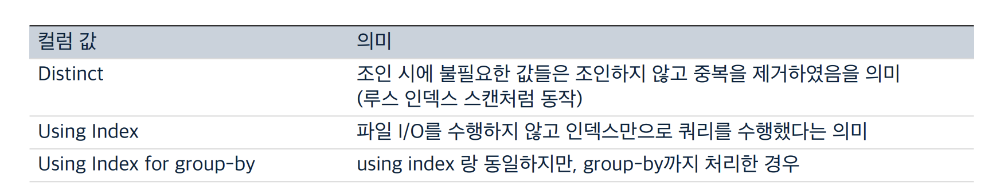

# 쿼리튜닝을 위한 기반지식
## 인덱스의 특징 (innoDB, B-Tree)
### 인덱스는 정렬되어 있다.


+ 왼쪽 컬럼인 column_1 순으로 먼저 정렬되고, column_1이 같다면 column_2 순으로 정렬된다.
+ 따라서 인덱스를 기준으로 조회한 데이터는 인덱스 컬럼 순으로 정렬되어 있다.

### 인덱스는 스캔하는 방식으로 처리된다.


중간중간 데이터를 읽는 것이 아니라, 시작지점을 잡고 종료지점까지 쭉 스캔한다.

### 인덱스는 메모리 위에 존재한다.


+ column_1 = 'A'인 레코드 중에 column_3 이 필요하다면?
    + 실제 column_1 = 'A'인 레코드를 모두 가져온 다음 물리 주소를 파악해서 물리 주소를 기반으로 디스크에서 값을 가져온다.
+ 모든 컬럼 값을 인덱스에 올려놓을 수는 없기 때문에 성능적으로 타협하면서 세팅해야 한다.

### 성능 좋은 Where 절의 조건 = 인덱스를 잘 활용하는 조건
+ 인덱스는 정렬되어 있으므로, 정렬된 데이터를 최대한도로 활용한다.(추가 정렬 작업을 수행하지 않도록)
+ 인덱스는 스캔하는 방식으로 처리되므로, 적절한 범위를 스캔할 수 있도록 구성한다.
+ 인덱스는 메모리 위에 존재하므로, 가능한 인덱스 내의 데이터를 조회한다.


+ A로 끝나는 문자열에 대한 시작지점, 끝지점을 적당히 설정할 수 없기 때문에 모든 데이터를 읽어들이게 된다.
+ B로 시작하는 문자열 조회는, B로 시작하는 문자열의 시작지점과 끝지점을 알 수 있기 때문에 불필요한 데이터를 읽지 않을 수 있다.

# 실행계획

## 쿼리튜닝을 위한 실행계획 보는 법


+ select 쿼리 앞에 `explain`을 붙여서 실행한다.
    + 더 상세한 결과를 원한다면 explain extended, explain partitions 가 있다.
+ update / delete/ insert 구문은 실행계획을 확인할 방법이 따로 없다.
    + 동일한 where 절을 가지는 select 구문의 실행계획을 확인하여 대략적으로 파악할 수 있다.

## 실행계획 표기
### id


- select 쿼리 별로 부여되는 식별자 값
- 서브쿼리를 사용하는 경우에는 id가 2 이상으로 표기될 수 있다.


### select_type


- 각 단위 select 쿼리(id별로 구별되는 쿼리)가 어떤 타입의 쿼리인지 표기한다.
- 색칠된 코멘트는 개선이 필요할 수 있는 코멘트에 해당한다.


#### UNCACACHEABLE


+ 사원번호를 random으로 추출한다음 union All하고 있는데 rand()는 항상 값이 달라지므로 캐시할 수 없다.


+ 무작위 정렬이 필수적인 테이블이라면 임의의 값을 저장하는 컬럼을 만들고 데이터를 생성할 때마다 무작위 값을 넣어준다.
+ 무작위 컬럼에 인덱스를 생성하여 성능을 올린다.

#### dependent


+ dependent는 독립적으로 수행할 수 없어, 외부 쿼리 결과에 의존하는 쿼리이다.


+ dependent는 join으로 해결할 수 있다.

#### derived


+ from 절에서 서브쿼리가 사용되는 경우에 해당한다.
+ 데이터가 적은 경우에는 문제가 없으나 데이터가 커지면 문제가 생긴다.

<br>

__cf) 임시 테이블__

+ 조회한 레코드를 추가적으로 정렬하거나 그룹핑해야 할 때, 사용하는 일시적인 테이블
    + 인덱스를 잘 사용했다면, 추가적인 정렬이 필요 없으므로 임시테이블을 사용하지 않는다.
+ 기본적으로는 메모리 위에서 동작하지만, 지정된 크기를 넘어서는 데이터가 조회되는 경우 디스크를 사용하게 됩니다.
    + 디스크를 사용하는 임시테이블은 큰 속도저하가 있으므로 사용하지 않도록 튜닝이 필요합니다.

임시테이블을 사용하는 조건들이 꽤나 복잡해서 임시테이블을 사용하지 않는 조건을 먼저 알아보자.
+ ORDER BY와 GROUP BY는 가능한 같은 인덱스에 존재하는 컬럼들로 처리한다.
+ ORDER BY와 GROUP BY는 가능한 인덱스 컬럼의 순서대로 정렬/그룹핑을 진행한다.
    - 추가적인 정렬/그룹핑을 최소화한다.
+ 필요한 값만 조회한다. (SELECT * FROM 금지)
    - 불필요한 데이터를 조회해서 임시테이블이 디스크에서 사용되는 상황을 방지한다.
+ 정렬이 필요한 경우라면 DISTINCT 보다는 GROUP BY를 사용한다.
+ 불필요한 서브쿼리는 가능한 조인으로 변경한다.

아래의 경우 임시테이블을 사용하게 된다.
+ 추가적인 정렬/그룹핑이 필요한 경우
    + ORDER BY와 GROUP BY에 명시된 컬럼이 다른 경우
    + ORDER BY나 GROUP BY에 명시된 컬럼이 조인의 순서상 첫 번째 테이블이 아닌 경우
    + DISTINCT와 ORDER BY가 동시에 존재하는 경우
    + DISTINCT가 인덱스로 처리되지 못 한 경우
+ UNION ALL이 사용된 경우
+ 쿼리의 실행 계획에서 select_type이 “DERIVED” 인 경우


### type


+ MySQL 서버가 어떤 방식으로 레코드를 읽었는지를 표시해주는 컬럼으로 튜닝 시에 중요하게 확인해 봐야하는 컬럼
+ ALL 을 제외하고는 모두 인덱스를 사용하지만, 그렇다고 모두 효율적인 것은 아니다.
+ 위 표는 효율적인 순서대로 작성되었다.(빨간색은 매우 나쁨)
    + index는 인덱스를 사용했다는게 아니라 인덱스 풀스캔했다는 뜻으로 문제가 있다는 의미다.

#### 인덱스 레인지 스캔


+ 특정 범위의 데이터만 조회하는 방식
+ 리프노드의 시작 위치를 찾고 해당 지점부터 마지막 범위에 해당하는 위치까지 순차적으로 조회
+ 조회해야하는 데이터가 너무 많아지는 경우, 풀 테이블 스캔이 더 효율적일 수 있다.
    + 데이터가 너무 많으면 사실상 인덱스를 다 스캔하는 것과 별 차이가 없기 때문이다.
    + 이런 경우를 막기위해 where절을 잘 설정해야 한다.


#### 인덱스 풀 스캔


+ 인덱스를 효율적으로 활용하지 못한 스캔 방식
+ 인덱스의 데이터를 전부 조회한다.
+ 인덱스 풀 스캔으로 처리되지 않기 위해서는 인덱스 컬럼의 왼쪽 컬럼부터 조건으로 사용해야 한다.
    - where 절 내에서의 순서는 상관 없다.
+ 파일 I/O가 필요한 경우라면, 매우 비효율적으로 동작한다.

#### 루스(Loose) 인덱스 스캔


+ 인덱스는 기본적으로 정렬되어 있기 때문에 집합함수 중 정렬을 활용할 수 있는 함수들(MAX, MIN)은 인덱슬르 모두 훑지 않고 건너뛰면서 스캔한다.
+ 반대로 AVG, COUNT 집합 함수들은 인덱스 전체를 스캔해야하는데 이런 경우를 Tight 인덱스 스캔이라고 한다.

#### 풀 테이블 스캔

+ 테이블 전체의 데이터를 스캔하는 방식
+ where 절이나 on 절에 인덱스를 이용할 수 있는 적절한 조건이 없는 경우(인덱스를 사용할 수 없는 경우)
+ 인덱스 레인지 스캔을 할 수 있더라도, 옵티마이저가 풀 테이블 스캔이 더 효율적이라고 판단하는 경우
    + B-Tree를 샘플링해서 저장해둔 통계정보를 기준으로 판단
    + 인덱스 레인지 스캔으로 조회해야하는 레코드 수가 전체 레코드 수의 20~25%일 경우


### possible_keys, key


+ possible_keys : 쿼리를 처리할 때 사용될 법했던 인덱스의 목록
+ key : 실제로 선택된 인덱스
+ 인덱스는 옵티마이저가 자체적으로 판단하여 선택하지만 필요한 경우 force index 등의 예약어를 통해 강제할 수 있다.

### extra
+ `튜닝 시에 중요하게 확인해야 하는 컬럼`

#### 요구사항 확인이 필요한 경우


+ 쿼리가 요구사항을 제대로 반영하고 있는지 확인해야하는 코멘트
+ 성능적으로는 문제가 없지만 DB 내에 필요한 값이 존재하지 않는 경우를 나타낸다.

#### 실행 계획이 좋지 못한 경우


+ 해당 코멘트가 조회되면 더 최적화할 수 있는지 컴토가 필요하다.
+ 불필요한 작업들을 추가로 하는 경우가 있을 수 있다.

#### 실행 계획이 좋은 경우



# 해결 방식 예시


===

# REAL MYSQL
# order by 처리(using filesort)
정렬을 처리하는 방법은 인덱스를 이용하는 방법과 쿼리가 실행될 때 `Filesort`라는 별도의 처리를 이용하는 방법이로 나눌 수 있다.

* 인덱스 이용
    * 장점
        * insert, update, delete 쿼리가 실행될 때 이미 인덱스가 정렬돼 있어서 순서대로 읽기만 하면 되므로 매우 빠름
    * 단점
        * insert, update, delete 작업 시 부가적인 인덱스 추가/삭제 작업이 필요하므로 느리다.
        * 인덱스 때문에 추가 디스크 공간이 필요하고 늘어날수록 innoDB의 버퍼 풀을 위한 메모리가 많이 필요하다.
* filesort 이용
    * 장점
        * 인덱스를 생성하지 않아도 되므로 인덱스를 이용할 때의 단점이 장점으로 바뀐다.
        * 정렬해야 할 레코드가 많지 않으면 메모리에서 filesort가 처리되므로 충분히 빠르다.
    * 단점
        * 정렬 작업이 쿼리 실행 시 처리되므로 레코드 대상 건수가 많아질수록 느려진다.

다음과 같은 이유로 모든 경우에 대해서 정렬을 인덱스 튜닝하기는 불가능하다.
* 정렬 기준이 너무 많아서 요건별로 모두 인덱스 생성이 불가능한 경우
* group by의 결과 또는 distinct 같은 처리의 결과를 정렬해야 하는 경우
* union의 결과와 같이 임시 테이블의 결과를 다시 정렬해야하는 경우
* 랜덤하게 결과 레코드를 가져와야하는 경우

인덱스를 잘 활용하는지 아닌지는 explain을 떠보면 extra 컬럼에 using filesort 메시지가 표시되는지 여부로 파악할 수 있다.

쿼리에 order by를 사용하면 반드시 3가지 처리중 한가지가 사용된다.
정렬 처리 방법|실행 계획의 extra 컬럼 내용
---|---
인덱스를 사용한 정렬|X
조인에서 드라이빙(기준) 테이블만 정렬|using filesort
조인에서 조인 결과를 임시 테이블로 저장 후 정렬|using temporary; using filesort

인덱스를 이용할 수 있따면 별도의 표기가 없고 사용할 수 없다면 where 조건에 일치하는 레코드를 검색해 정렬 버퍼에 저장하면서 정렬을 처리(file sort)한다. mysql 옵티마이저는 정렬 대상 레코드를 최소화하기 위해 다음 2가지 방법 중 선택한다.

* 조인의 드라이빙 테이블(기준)만 정렬한 다음 조인을 수행
* 조인이 끝나고 일치하는 레코드를 모두 가져온 후 정렬을 수행

일반적으로 조인이 수행되면 레코드 건수와 레코드의 크기가 배수로 불어나기때문에 가능하다면 드라이빙 테이블(기준)만 정렬한 다음 조인을 수행하는 방법이 효율적이다.

## 인덱스를 이용한 정렬
인덱스를 이용한 정렬을 위해서는 반드시 ORDER BY 절에 명시된 컬럼이 드라이빙 테이블(기준 테이블)에 속하고 ORDER BY의 순서대로 생성된 인덱스가 있어야 한다. 또한 WHERE 절에 드라이빙 테이블(기준 테이블)의 컬럼에 대한 조건이 있다면 그 조건과 ORDER BY는 같은 인덱스를 사용할 수 있어야 한다.

```sql
SELECT *
FROM employee e, salaries s
WHERE s.emp_no = e.emp_no
    AND e.emp_no BETWEEN 100 AND 200
ORDER BY e.emp_no
```

## 조인의 드라이빙 테이블(기준 테이블)만 정렬
일반적으로 조인이 되면 데이터가 불어나기 때문에 드라이빙 테이블만 먼저 정렬하고 조인을 실행하는 것이 차선책이 된다. 이 방법으로 정렬이 처리되려면 드라이빙 테이블의 컬럼만으로 ORDER BY 절을 작성해야 한다.

```sql
SELECT *
FROM employee e, salaries s
WHERE s.emp_no = e.emp_no
    AND e.emp_no BETWEEN 100 AND 200
ORDER BY e.last_name
```

where절이 다음 조건을 갖추고 있어서 옵티아미저는 employees 테이블을 드라이빙 테이블로 선택할 것이다.
* where 절의 검색 조건은 employee의 프라이머리 키를 이용해 검색하면 작업을 줄일 수 있다.
* 드리븐 테이블(salaries)의 조인 컬럼인 emp_no 컬럼에 인덱스가 있다.

검색은 인덱스로 처리할 수 있지만 order by 절에 명시된 컬럼이 프라이머리 키와 전혀 연관이 없으므로 인덱스를 이용한 정렬이 불가능하다. 그런데 정렬 컬럼이 드라이빙 테이블에 포함된 컬럼이므로 옵티마이저는 드라이빙 테이블만 검색해서 정렬을 먼저 수행하고 그 결과를 salaries 테이블과 조인한다.

## 임시 테이블을 이용한 정렬
조인의 드라이빙 테이블 사용을 제외한 2개 이상의 테이블 조인에서는 항상 조인 결과를 임시 테이블에 저장하고 그 결과를 다시 정렬하는 과정을 거친다. 이 방법은 3가지 방법중에 가장 느린 방법이다.
```sql
SELECT *
FROM employee e, salaries s
WHERE s.emp_no = e.emp_no
    AND e.emp_no BETWEEN 100 AND 200
ORDER BY s.salary
```
order by 정렬 컬럼이 드리븐 테이블(salaries)에 있는 컬럼이다. 즉, 정렬이 수행되기 전에 salaries 테이블을 읽어야 하므로 조인된 데이터를 가지고 정렬할 수밖에 없다. 따라서 explain을 떠보면 filesort, using temporary가 표기된다.


# GROUP BY 처리
GROUP BY 절이 있는 쿼리에서는 Having 절을 사용할 수 있는데 이는 GROUP BY 결과에 대해 필터링할 수 있는 역할을 수행한다. `GROUP BY에 사용된 조건은 인덱스를 사용해서 처리될 수 없으므로 Having 절을 튜닝하려고 인덱스를 생성하거나 다른 방법을 고민할 필요는 없다.`

GROUP BY 절도 인덱스를 사용하는 경우와 그렇지 못한 경우로 나뉜다. 인덱스를 이용할 때는 인덱스를 차례대로 읽는 인덱스 스캔 방법과 인덱스를 건너뛰면서 읽는 루스 인덱스 스캔이라는 방법으로 나뉜다. 그리고 인덱스를 사용하지 못하는 쿼리에서 GROUP BY 작업은 임시 테이블을 사용한다.

## 인덱스 스캔을 이용하는 GROUP BY(타이트 인덱스 스캔)
ORDER BY의 경우와 마찬가지로 조인의 드라이빙 테이블에 속한 컬럼만 이용해서 그루핑할 때 GROUP BY 컬럼으로 이미 인덱스가 있다면 그 인덱스를 차례로 읽으면서 그루핑 작업을 수행하고 그 결과로 조인을 처리한다. GROUP BY가 인덱스를 사용해서 처리된다 하더라도 그룹함수(aggregation function) 등의 그룹값을 처리해서 임시 테이블이 필요할 때도 있다. GROUP BY가 인덱스를 통해 처리되는 쿼리는 이미 정렬된 인덱스를 읽는 것이므로 쿼리 실행 시점에 추가적인 정렬 작업이나 내부 임시 테이블은 필요하지 않다. 이러한 그루핑 방식을 사용하는 쿼리의 실행 계획에서는 Extra 컬럼에 별도로 GROUP BY 관련 코멘트인 (using index for group-by)나 임시 테이블 사용 또는 정렬 관련 코멘트(using temporary, using filesort)가 표시되지 않는다.

## 루스 인덱스 스캔을 이용하는 GROUP BY
루스 인덱스 스캔 방식은 인덱스의 레코드를 건너뛰면서 필요한 부분만 읽어서 가져오는 것을 의미하는데, 옵티마이저가 루스 인덱스 스캔을 사용할 때는 실행 계획의 Extra 컬럼에 `Using index for group-by 코멘트가 표시된다.`

```sql
select emp_no
from salaries
where from_date = '1984-03-01'
group by emp_no
```
salaries 테이블의 인덱스는 (emp_no, from_date) 로 생성되어있으므로 where 조건은 인덱스 레인지 스캔 접근 방식으로는 이용할 수 없다. 하지만 explaint을 떠보면 인덱스 레인지 스캔을 이용했으며 extra 컬럼 메시지에 인덱스 사용이 표기된다.(using where; using index for group-by)

이 방식은 단일 테이블 group by에서만 사용할 수 있고 prefix index(컬럼값의 앞쪽 일부만으로 생성된 인덱스)는 사용할 수 없다.

## 임시 테이블을 사용하는 GROUP BY
이는 기준 컬럼이 드라이빙에 있는 드리븐에 있든 관계없이 인덱스를 전혀 사용하지 못할때 사용된다.
```sql
select e.last_name, avg(s.salary)
from employees e, salaries s
where s.emp_no = e.emp_no
group by e.last_name
```
실행 계획을 떠보면 using temporary가 표기된다. 테이블 풀 스캔이 아니라 인덱스를 전혀 사용하지 못하기 때문이다. 그런데 using filesort는 표기되지 않고 useing temporaryt만 표기된다. 8.0 이전버전에는 group by가 사용된 쿼리는 그루핑되는 컬럼을 기준으로 묵시적인 정렬까지 함께 수행됐다. 그래서 이전에는 group by는 있지만 order by 절이 없는 쿼리에 대해서는 기본적으로 그루핑 컬럼인 last_name에 대해서 정렬이 수행된 상태로 결과값을 반환했다. 하지만 8.0부터는 묵시적인 정렬은 실행되지 않고 반환된다.

이러한 이유 때문에 8.0 이전에는 group by후 정렬이 필요하지 않은 경우, `order by null` 사용이 권장되었다.


mysql 8.0에서는 group by가 필요한 경우 내부적으로 group by 절의 컬럼으로 구성된 유니크 인덱스를 가진 임시 테이블을 만들어서 중복 제거와 집합 함수 연산을 수행한다.
```sql
create temporary table ... (
    last_name varchar(16),
    salary int,
    unique index ux_lastname (last_name)
)
```

# Distinct 처리
distinct 처리는 인덱스를 사용하지 못할 때는 항상 임시테이블이 필요하다. 하지만 실행 계획에서는 using temporary가 출력되지 않는다.

## select distinct
```sql
select distinct first_name, last_name from employees;
select distinct (first_name), last_name from employees;
```
distinct키워드는 뒤에 () 괄호는 실행시 제거된다. 즉, distinct는 first_name만 유니크한게 아니고 (first_name, last_name) 조합 전체가 유니크한 레코드를 가져온다.

이에 대한 예외는 집합 함수와 함께 사용되는 경우다.

## 집합 함수와 함께 사용된 distinct
count, min, max 같은 집합 함수 내에서 distinct 키워드가 사용될 수 있는데 일반적으로 select distinct와는 다른 형태로 해석된다. select 쿼리에서 distinct는 조회 컬럼 모든 조합이 유니크한 것들만 가져오지만 집합 함수 내에서는 사용된 distinct의 함수 인자로 전달된 컬럼 값이 유니크한 것들만 가져온다.
```sql
select count(distinct s.salary)
from employees e, salaries s
where e.emp_no=s.emp_no
and e.emp_no between 100 and 200
```
쿼리는 내부적으로 count를 처리하기 위해 임시테이블을 사용하지만 실행 계획에는 표기되지 않는다. 위 쿼리는 조인 결과에서 salary 컬럼의 값만 저장하기 위한 임시테이블을 만들어서 사용한다. 임시 테이블의 salary 컬럼에는 유니크 인덱스가 생성되기 때문에 레코드 건수가 많아진다면 상당히 느려질 수 있다.

```sql
select count(distinct s.salary)
    count(distinct e.last_name)
from employees e, salaries s
where e.emp_no=s.emp_no
and e.emp_no between 100 and 200
```
만약 위와 같이 count 쿼리를 추가하면 임시 테이블이 2개가 생긴다.

# 임시 테이블이 필요한 쿼리
다음과 같은 패턴은 별도의 데이터 가공이 필요하여 내부 임시 테이블이 생성되는 케이스다. 물론 이 밖에도 인덱스를 사용하지 못할 때는 내부 임시테이블을 생성해야할 때가 많다.

* order by와 group by에 명시된 컬럼이 다른 쿼리
* order by나 group by에 명시된 컬럼이 조인의 순서상 첫 번째 테이블이 아닌 쿼리
* distinct와 order by가 동시에 쿼리에 존재하는 경우
* distinct가 인덱스로 처리되지 못하는 쿼리
* union, union distinct가 사용된 쿼리(select_type 컬럼이 union result인 경우)
* 쿼리의 실행 계획에서 select_type이 DERIVED인 쿼리


# 실행 계획 분석
아무런 옵션 없이 explain 을 뜨면 1줄 이상의 결과가 표기된다. 표의 각 라인은 쿼리 문장에서 사용된 테이블(서브쿼리로 임시 테이블을 생성한 경우 그 임시 테이블까지 포함)의 개수만큼 출력된다. 실행 순서는 위에서 아래로 순서대로 표시된다. 출력된 실행 계획에서 위쪽에 출력된 결과일수록(id 컬럼의 값이 작을수록) 쿼리의 바깥부분이거나 먼저 접근한 테이블이고, 아래쪽일수록 쿼리 안쪽부분 또는 나중에 접근한 테이블이다.  
즉, 위쪽에 출력된 결과도(id컬럼이 작을수록) 먼저 접근한 테이블이 아닐 수도 있다는 것이다.

```sql
select ...
from (select ... from tb_test1) tb1, tb_test2 tb2
where tb1.id = tb2.id;
```
위 쿼리는 아래와 같이 분리할 수 있다.
```sql
select ... from tb_test1
select ... from tb1, tb_test2 tb2 where tb1.id = tb2.id;
```
이 예시에서는 실행 계획에서 최소 2개의 id 값이 표기될 것이다.

하나의 select 문장 안에 여러 개의 테이블을 조인하면 조인되는 테이블 개수만큼 실행 계획 레코드가 출력되지만 같은 id값이 부여된다. 다음 예제가 그러하다.
```sql
select e.emp_no, s.from_date
from employee e, salaries s
where e.emp_no = s.emp_no
```

```sql
select ( (select ...) + (select ...)) as total_count;
```
위와 같은 경우 쿼리 문장이 3개의 단위 select로 구성되어 실행 계획의 각 레코드가 각기 다른 id값을 갖는다. 한가지 주의해야할 것이 id 컬럼의 값이 테이블 접근 순서를 의미하지 않는다.

## select Type
### simple
union이나 서브쿼리를 사용하지 않는 단순한 select 쿼리인 경우 select type이 simple로 표기된다.(쿼리에 조인이 포함되어도 마찬가지다.) 쿼리가 복잡하더라도 실행 계획에서 simple인 단위 쿼리는 하나만 존재하며 일반적으로 제일 바깥 select 쿼리의 select_type이 simple로 표기된다.

### primary
union이나 서브쿼리를 가지는 select 쿼리의 실행 계획에서 가장 바깥쪽에 있는 단위 쿼리는 primary로 표기된다. simple과 마찬가지로 하나만 존재한다.

### union
union으로 결합하는 단위 select 쿼리 가운데 첫 번째를 제외한 두 번째 이후 단위의 select 쿼리의 select_type은 union으로 표기된다. 첫 번째 단위의 select는 union이 아니라 union되는 쿼리 결과들을 모아서 저장하는 임시 테이블(DERIVED)이 select_type으로 표시된다.
```sql
select * from(
    (select ... e1) union all
    (select ... e2) union all
    (select ... e3) 
) tb;
```
즉 e1의 select_type이 derived가 되고 e2, e3은 union 타입이 된다.

### 이외..
이외는 필요할때 찾아보자.

## table 컬럼
실행 계획은 단위 select 쿼리 기준이 아니라 테이블 기준으로 표기된다. 테이블 컬럼에는 테이블 이름이나 별칭이 부여된 경우 별칭이 표기된다.

테이블 컬럼에는 <> 표기가 된 경우가 많은데 이는 임시 테이블임을 의미한다. <derived 2> 는 실행 계획 id 2번으로부터 만들어진 파생 테이블을 말한다.

## type 컬럼
각 테이블의 레코드를 어떤 방식으로 읽었는지를 나타낸다. 인덱스를 사용해 레코드를 읽었는지, 아니면 테이블을 처음부터 끝까지 읽는 풀 테이블 스캔으로 레코드를 읽었는지 등을 의미한다. 튜닝할 때 반드시 체크해야할 정보다.

* system, const, eq_ref, ref, fulltext, ref_or_null, unique_subquery, index_subquery, range, index_merge, index, all

위 목록 순서는 성능이 빠른 순서대로 나열한 것이다.  
12 방식 중 all 방식만 인덱스를 사용하지 않고, 테이블을 처음부터 끝까지 읽어서 레코드를 가져오는 풀 테이블 스캔 방식을 의미한다. 하나의 단위 select 쿼리는 위 접근 방법 중에 단 하나만 사용할 수 있다. 그리고 index_merge를 제외한 나머지 접근 방법은 하나의 인덱스만 사용한다. 그러므로 실행 계획의 각 라인에 접근 방법이 2개 이상 표시되지 않으며, index_merge 이외의 type에서는 인덱스 항목에도 단 하나의 인덱스 이름만 표시된다.

### system
레코드가 1건만 존재하는 테이블 또는 한 건도 존재하지 않는 테이블을 참조하는 형태의 접근 방법을 의마한다. innoDB 엔진에서는 사용되지 않고 MyISAM이나 MEMORY 테이블에서만 사용되는 접근 방법이다.

### const
쿼리가 `프라이머리 키나 유니크 키` 컬럼을 이용하는 `WHERE 조건절`을 가지고 있으며, `반드시 1건을 반환`하는 쿼리의 처리 방식을 const라고 한다. 다른 DBMS에서는 이를 유니크 인덱스 스캔(unique index scan)이라고 표현한다.  
인덱스의 일부 컬럼만 조건으로 사용할 때는 const를 사용할 수 없고, ref로 표기된다. 하지만 프라이머리 키나 유니크 인덱스의 모든 컬럼을 동등 조건으로 where을 명시하면 const가 적용된다.

### eq_ref
여러 테이블이 조인되는 쿼리의 실행 계획에서만 사용된다. 조인에서 처음 읽은 테이블의 컬럼 값을 그 다음 읽어야할 테이블의 프라이머리 키나 유니크 키 컬럼의 검색 조건에 사용할 때를 가리켜 eq_ref라고 한다. 두 번째 이후에 읽는 테이블의 type 컬럼에는 eq_ref가 표기된다. 우번째 이후에 읽히는 테이블을 유니크 키로 검색할 때 그 유니크 인덱스는 NOT NULL이어야 하며, 다중 컬럼으로 만들어진 프라이머리 키나 유니크 인덱스라면 인덱스의 모든 컬럼이 비교 조건에 사용돼야만 한다. 즉, 조인에서 두 번째 이후에 읽는 테이블에서 반드시 1건만 존재한다는 보장이 있어야 사용할 수 있는 접근 방법이다.

### ref
eq_ref와 달리 조인의 순서와 관계없이 사용되며, 프라이머리 키나 유니크 키 등의 제약 조건도 없다. 인덱스의 종류와 관계업싱 동등 조건으로 검색할 때는 ref 방법이 사용된다. ref 타입은 반환되는 레코드가 반드시 1건이라는 보장이 없으므로 const, eq_ref보다 빠르지는 않다.

### 중간 정리
* const : 조인의 순서와 관계 없이 프라이머리 키나 유니크 키의 모든 컬럼에 대해 동등 조건으로 검색(반드시 1건만 반환)
* eq_ref : 조인에서 첫 번째 읽은 테이블의 컬럼값을 이용해 두 번째 테이블을 프라이머리 키나 유니크 키로 동등 조건 검색(두 번째 테이블은 반드시 1건의 레코드만 반환)
* ref : 조인의 순서와 인덱스의 종류에 관계없이 동등 조건으로 검색(1건의 레코드만 반환된다는 보장이 없어도 됨)

### fulltext
전문 검색 인덱스를 사용해 레코드를 읽는 방법을 의미한다.

### ref_or_null
ref와 같으나 null 비교가 추가된 형태이다.

### unique_subquery
where 조건에서 사용될 수 있는 in 형태의 쿼리를 위한 접근 방식이다. 서브쿼리에서 중복되지 않는 유니크한 값만 반환할 때 이 방식이 사용된다.

### index_subquery
unique_subquery는 반환값에 중복이 없지만 이건 중복이 있을 수 있지만 인덱스를 이용해 중복을 제거할 수 있다.

### range
인덱스 레인지 스캔 형태로 범위 검색에 인덱스를 검색할 때 사용한다.

### index_merge
2개 이상의 인덱스를 이용해 각 검색을 만들어낸 후, 그 결과를 병합하여 처리하는 방식이다.

### index
인덱스라는 이름때문에 효율적인 인덱스라고 착각하는 경우가 많은데, 인덱스를 처음부터 끝까지 읽는 인덱스 풀 스캔을 의미한다. 테이블을 처음부터 끝까지 읽는 풀 테이블 스캔 반식과 비교했을 때 비교하는 레코드 건수는 같다. 하지만 인덱스는 일반적으로 데이터 파일 전체보다 크기가 작으므로 인덱스 풀 스캔시 풀 테이블 스캔보다 빠르게 처리되며, 쿼리 내용에 따라 정렬된 인덱스의 장점을 이용할 수 있으므로 훨씬 효율적이다. 아래 경우에 사용된다.

* range, const, ref 같은 접근 방법이 불가능 할때
* 인덱스에 포함된 컬럼만으로 처리할 수 있는 쿼리인 경우
* 인덱스를 이용해 정렬이나 그루핑 작업이 가능한 경우

### ALL
풀 테이블 스캔으로 테이블을 처음부터 끝까지 전부 읽어서 불필요한 레코드를 제거하고 반환한다.

## possible_keys 컬럼
옵티마이저는 처리하기 위해 여러 방법을 고려하고 비용이 가장 낮을 것으로 예상하는 실행 계획을 선택해 쿼리를 실행한다. 해당 컬럼은 최적의 실행 계획을 만들기 위해 선정한 후보로 선정했던 접근 방법에서 사용될법 했던 인덱스 목록을 나타낸다. 말그대로 후보군이기 때문에 크게 도움이 되진 않는다.

## key 컬럼
key 컬럼은 실제로 최종 선택된 실행 계획에서 사용하는 인덱스를 의미한다. primary인 경우에는 프라이머리 키를 사용한다는 의미이고 이외의 값은 모두 테이블이나 인덱스를 생성할 때 부여했던 고유 이름이다.  
실행 계획 type이 index_merge가 아닌 경우에는 반드시 테이블 하나당 하나의 인덱스만 이용할 수 있다. 따라서 index_merge의 경우에는 key 컬럼에 콤마로 구분되어 표기된다.

## key_len 컬럼
실제로는 단일 인덱스보다는 다중 컬럼 인덱스를 사용하게 되는데 key_len는 다중 컬럼 인덱스에서 몇개의 컬럼까지 사용했는지를 알려준다. 이는 바이트로 표기되는데 (dept_no, emp_no) 멀티인덱스의 경우, 16으로 표기되면 dept_no가 char(4)이므로 16바이트로 표기된 것이다.

## ref 컬럼
접근 방법이 ref면 참조 조건(equal 비교 조건)으로 어떤 값이 제공됐는지 보여준다.

## row 컬럼
실행 계획의 효율성 판단을 위해 예측했던 레코드 건수를 보여준다. 예상값이라 정확하진 않다. 또한 rows 컬럼에 표시되는 값은 반환하는 레코드의 예측치가 아니라 쿼리를 처리하기 위해 얼마나 많은 레코드를 읽고 체크해야 하는지를 의미한다. 그래서 실행 계획의 rows 컬럼에 출력되는 값과 실제 쿼리 결과 반환된 레코드 건수는 일치하지 않는 경우가 많다.

## extra 컬럼
성능에 관한 중요한 내용이 포함되며 2~3개씩 함께 포함된다.
* const row not found
    * 레코드가 1건도 존재하지 않는 경우 표기
* deleting all rows
    * 모든 레코드를 삭제
* distinct
    * 쿼리의 distinct를 처리하기 위해 조인하지 않아도 되는 항목은 모두 무시하고 꼭 필요한것만 조인하고 필요한 레코드만 읽었음을 표현
* using filesort
    * order by 에 인덱스를 적절하지 사용하지 못할 때 서버가 조회된 레코드를 다시 한번 정렬해야 한다. 조회된 레코드를 정렬용 메모리 버퍼에 복사해 정렬을 수행한다는 의미다. 이는 많은 부하를 발생시키므로 쿼리를 튜닝해야 한다.
* using index(커버링 인덱스)
    * 데이터 파일을 전혀 읽지 않고 인덱스만 읽어서 쿼리를 모두 처리할 수 있을 때 표기된다.


# SELECT 절 실행 순서
```sql
select s.emp_no, COUNT(DISTINCT e.first_name) AS cnt
FROM salaries s
    INNER JOIN employees on e.emp_no=s.emp_no
WHERE s.emp_no IN (10001, 10002)
GROUP BY s.emp_no
HAVING ABG(s.salary) > 1000
ORDER BY AVG(s.salary)
LIMIT 10;
```
1. WHERE 절 및 조인
2. GROUP BY
3. DISTINCT
4. HAVING
5. ORDER BY
6. LIMIT

순으로 적용된다.


위 순서와 다르게 예외적으로 다음과 같은 순서로 적용되는 경우가 있다.
1. where 절
2. ORDER BY 절
3. 조인 실행
4. LIMIT

이와 같은 형태는 주로 GROUP BY 절 없이 ORDER BY만 사용된 쿼리에서 사용될 수 있는 순서다.

위와 같은 두가지 순서가 거의 모든 쿼리에서 적용된다. 이에 벗어나는 쿼리 순서가 있다면 서브쿼리로 작성된 인라인 뷰를 사용해야 한다.

# Where, GROUP BY, ORDER BY 인덱스 사용
## 인덱스 사용 기본 규칙
인덱스를 사용하려면 기본적으로 인덱스된 칼럼 값 자체를 변환하지 않고 그대로 사용한다는 조건을 만족해야 한다. 즉, WHERE 절에서 사용할 떄, 가공(곱셈 같은 연산)을 하면 제대로 적용되지 않는다.

## where 절 인덱스 사용
`where 조건절에 나열된 컬럼 순서는 실제 인덱스의 사용 여부와 무관하다.` where 절에 나열된 컬럼 순서와 인덱스의 컬럼 순서가 다르더라도 옵티마이저가 조건들을 뽑아서 최적화를 수행한다.  
8.0이전 버전까지는 하나의 인덱스를 구성하는 각 컬럼의 `정렬 순서`가 혼합되어 사용할 수 없었지만 8.0부터는 인덱스를 구성하는 컬럼별로 오름차순, 내림차순 정렬을 혼합해서 생성할 수 있게 개선되었다.
```sql
ALTER TABLE ... ADD INDEX hello (col_1 ASC, col_2 DESC)
```
여러 방향으로 정렬을 하고 싶다면 위처럼 인덱스를 만들때, ASC, DESC 옵션을 섞어서 인덱스를 만들어주면 된다.


## GROUP BY 절 인덱스 사용
* `group by 절에 명시된 컬럼이 인덱스 컬럼의 순서와 위치가 같아야 한다.`
* 인덱스를 구성하는 컬럼 중 뒤쪽에 있는 컬럼은 GROUP BY 절에 명시되어있지 않아도 인덱스를 사용할 수 있지만 앞쪽에 있는 컬럼이 GROUP BY 절에 명시되지 않으면 인덱스를 사용할 수 없다.
* WHERE 조건절과 달리 GROUP BY는 인덱스가 하나라도 명시되어있지 않으면 전혀 인덱스를 사용하지 못한다.

## ORDER BY 절 인덱스 사용
GROUP BY 절의 조건과 일치하고 하나더 조건이 있는데 정렬되는 각 컬럼의 오름차순 및 내림차순 옵션이 인덱스와 같거나 정반대인 경우에만 사용할 수 있다.  
예를 들면, 인덱스의 모든 컬럼이 오름차순으로 정렬되어있다면 order by절은 모든 컬럼이 오름차순이거나 내림차순일 때만 사용할 수 있다.  
그리고 모든 인덱스가 order by에 명시되어야 하는 것은 아니지만 순서는 일치해야 한다.

## WHERE + order by
where절과 order by 절이 같이 사용된 쿼리는 다음 3가지 중 하나로 동작한다.

* WHERE 절과 ORDER BY 절이 동시에 같은 인덱스를 이용
    * where 절의 비교 조건에서 사용하는 컬럼과 order by 절의 정렬 대상 컬럼이 모두 하나의 인덱스를 연속해서 포함돼 있을 때 이 방식으로 인덱스를 사용한다.
* WHERE 절만 인덱스를 이용
    * order by 절은 인덱스를 이용한 정렬이 불가능하며, 인덱스를 통해 검색된 결과 레코드를 별도의 정렬 처리 과정(file sort)을 거쳐 정렬을 수행한다. 주로 WHERE 조건절에 일치하는 레코드 건수가 많지 않을 때 효율적이다.
* ORDER BY 절만 인덱스를 사용
    * ORDER BY 절의 순서대로 인덱스를 읽으면서 레코드 한 건씩 where 조건에 일치하는지 비교하고 일치하지 않을 때는 버리는 형태로 처리한다.

또한 where 절에서 조건으로 사용된 컬럼과 order by 절에 명시된 컬럼 순서가 인덱스 컬럼의 왼쪽부터 일치해야 한다. 중간에 빠지는 부분이 있으면 모두 인덱스를 사용할 수 없다.

## group by + order by
두 절 모두 하나의 인덱스를 사용해서 처리되려면 둘다 명시된 컬럼의 순서와 내용이 모두 같아야 한다. 둘중 하나라도 인덱스를 이용할 수 없을때는 둘다 인덱스를 사용할 수 없다.

## where + order by + group by
1. where 절이 인덱스를 탈 수 있는가?
2. group by 절의 인덱스를 사용할 수 있는가?
3. group by 절과 order by 절이 동시에 인덱스를 사용할 수 있는가?

위 세가지 조건을 만족하면 인덱스를 태울 수 있다.

# limit
```sql
select * from .. limit 0 10;
```
limit이 없다면 풀 테이블 스캔이 실행된다. limit 조건이 있으므로 풀 테이블 스캔을 실행하면서 엔진은 10개의 레코드를 읽어들이는 순간 작업을 멈춘다. 이렇게 정렬, 그루핑, distinct가 없으면 쿼리가 상당히 빨리 끝난다.

```sql
selecgt * from .. group by .. limit 0 10;
```
group by가 있으므로 group by가 종료되야 limit을 처리할 수 있다. 따라서 limit이 있더라도 작업을 크게 줄여주진 못한다.

```sql
select distinct .. from .. limit 0 10;
```
엔진은 풀 테이블 스캔을 하면서 레코드를 읽음과 동시에 distinct 중복 제거 작업(임시 테이블 사용)을 진행한다. 이 작업을 처리하다가 유니크한 레코드가 limit 건수만큼 채워지면 쿼리를 종료한다.

```sql
select * from .. where .. order by .. limit 0 10;
```
where 조건에 맞는 레코드를 읽고 정렬을 수행한다. 정렬을 수행하면서 10건이 완성되면 쿼리를 종료한다. 레코드를 전부 읽고 정렬을 해야하므로 작업량이 크게 줄지는 않는다.

# count
레코드 건수를 반환하는 것으로 count(*) 를 사용할 수 있다. 여기서 *는 레코드 자체를 의미하므로 프라이머리 컬럼을 넣거나 1을 넣는 것이랑 똑같이 동작한다.
보통 쿼리 작성할 때 기존 쿼리에서 프로젝션 부분만 count로 바꿔서 사용하는 경우가 있는데 이러면 불필요한 order by 같은 것이 들어가는 경우가 발생할 수 있다. 그래서 8.0부터는 count 쿼리에서 order by는 무시하도록 옵티마이저가 처리한다. 하지만 이를 알고 있더라도 굳이 쿼리의 복잡도가 높아보이도록 작성할 필요는 없기에 count 쿼리에 불필요한 절을 제거할 수 있도록 하자.

# join
## join의 순서와 인덱스
조인에서 드라이빙 테이블을 읽을 때는 인덱스 탐색 작업을 단 한번만 수행하고 이후부터는 스캔만 하면 된다. 하지만 드리븐 테이블에서는 인덱스 탐색 작업과 스캔 작업을 드라이빙 테이블을 읽은 레코드 건수만큼 반복한다. 그래서 옵티마이저는 드라이빙 테이블보다 드리븐 테이블을 최적으로 읽을 수 있게 실행계획을 수립한다.

## outer join 성능과 주의사항
아우터 조인시 실수하는 상황은 아우터 조인되는 테이블에 대한 조건을 where 조건 절에 사용하는 것이다.
```sql
select * 
from employee e
    left join dept_manager mgr on mgr.emp_no = e.emp_no
    where mgr.dept_no='001';
```
on 절에 조인 조건을 명시하고 where 조건절에 outer 조인 되는 테이블의 컬럼을 조건으로 사용했다. 하지만 옵티아미저는 아우터 조인으로 사용된 테이블의 컬럼을 where 조건으로 사용한 것을 보고 해당 쿼리를 inner join으로 바꿔버린다. 따라서 원하는 대로 하고 싶다면 on절에 And를 붙여서 사용해야 한다.


# 잠금을 사용하는 SELECT
레코드를 select할때는 lock 없이 진행되는데 select가 실행된 후 애플리케이션에서 가공해서 업데이트 할때는 다른 트랜잭션이  그 컬럼 값을 변경하지 못하게 해야 한다. 이럴 때는 읽으면서 레코드에 잠금을 걸어 둘 필요가 있다. 이때 사용하는 옵션이 for share와 for update 절이다. for share는 읽기 잠금이고 for update는 select 쿼리가 읽은 레코드에 대해 쓰기 잠금을 건다. 해당 옵션이 사용되었더라고 일반적인 select 구문은 그대로 대기 없이 데이터를 읽어갈 수 있다. 즉, 해당 옵션이 사용된 쿼리끼리만 잠금이 걸리는 것이다.

## 잠금 테이블 선택
8.0 이전에서는 조인한 테이블 전체에 모두 잠금이 걸렸다. 하지만 조인된 테이블은 참고용이라면 8.0에서는 쿼리에 사용된 테이블 중 특정 테이블만 잠금을 획득하는 옵션으로 `for share(for update) of 테이블 별칭` 이 추가되었다.


<br><br>

__참고__
+ [Mysql Explain](https://cheese10yun.github.io/mysql-explian/)