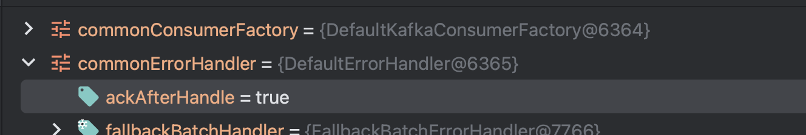
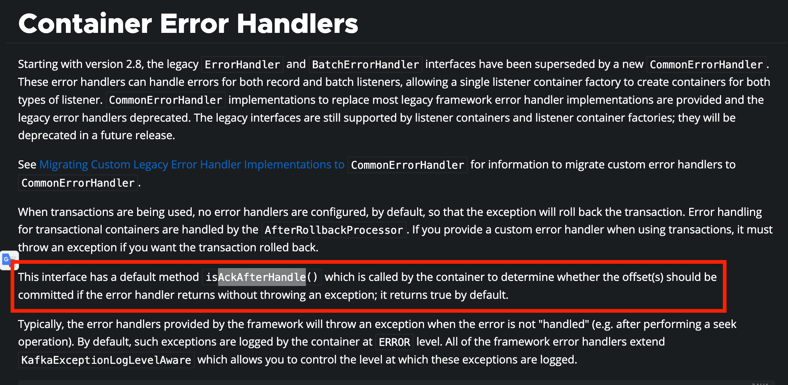
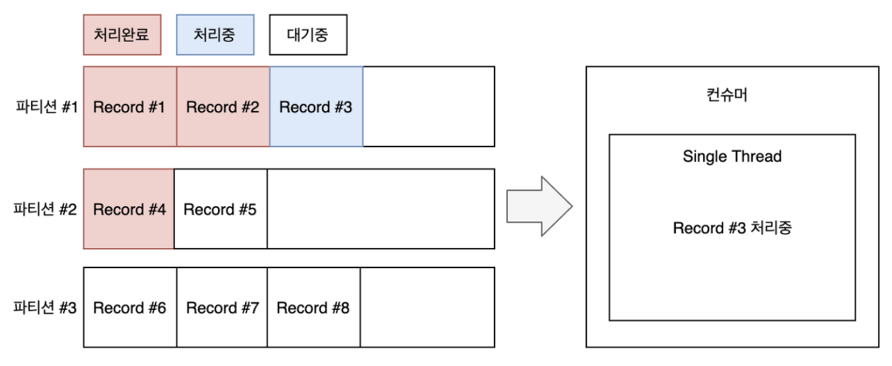
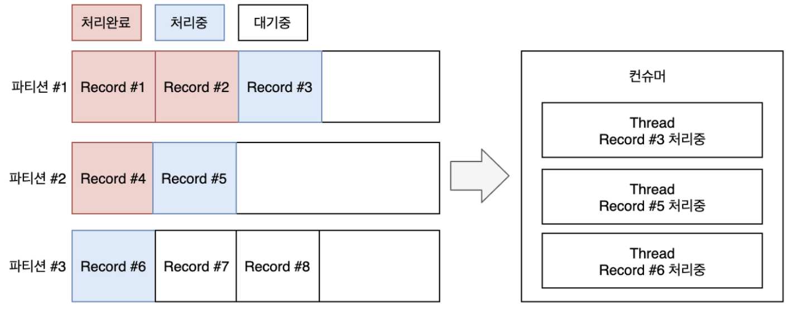

> 본 포스팅은 spring boot 3.2.2 버전을 기준으로 작성되었습니다.  
> 공부한 내용을 정리하는 [블로그](https://backtony.tistory.com/)와 관련 코드를 공유하는 [Github](https://github.com/backtony/blog/tree/main/category/kafka/spring/spring-kafka)이 있습니다.

# 스프링 카프카

스프링 카프카는 카프카를 스프링 프레임워크에서 효과적으로 사용할 수 있도록 만들어진 라이브러리로 기존 카프카 클라이언트 라이브러리를 래핑해서 만들어졌습니다.

## 스프링 카프카 프로듀서

### 의존성

```
implementation 'org.springframework.boot:spring-boot-starter'
implementation 'org.springframework.kafka:spring-kafka'
```

### application.yml

```
spring:
  kafka:
    bootstrap-servers: kafka.sample.url.com:9092
```

### KafkaTemplate과 ProducerFactory 설정

```
@Configuration
class CommonKafkaProducerConfig(
    private val kafkaProperties: KafkaProperties,
    private val sslBundles: SslBundles,
) {

    @Bean
    fun commonKafkaTemplate(): KafkaTemplate<String, Any> {
        return KafkaTemplate(commonProducerFactory())
    }

    @Bean
    fun commonProducerFactory(): ProducerFactory<String, Any> {
        val keySerializer = StringSerializer()
        val valueSerializer = JsonSerializer<Any>()

        return DefaultKafkaProducerFactory(kafkaProperties.buildProducerProperties(sslBundles), keySerializer, valueSerializer)
    }
}
```

스프링 카프카 프로듀서는 프로듀서 팩토리(ProducerFactory) 클래스를 사용하여 프로듀서의 설정값들을 세팅하고 카프카 템플릿(Kafka Template) 클래스를 사용하여 카프카 브로커로 메시지를 전송합니다.

스프링 카프카의 properties 설정값들은 kafkaProperties에서 관리됩니다. application.yml에 설정한 bootstrap-servers값도 kafkaProperties에 주입되어 관리되며, 따로 설정하지 않은 값들은 kafkaProperties에 설정된 기본값으로 세팅됩니다. ProducerFactory에서 보내고자 하는 메시지의 키와 값타입에 따른 serializer를 등록하고 해당 producerFactory를 kafkaTemplate의 인자로 사용하면 세팅이 완료되고 해당 kafkaTemplate을 사용하여 카프카 브로커로 메시지를 전송할 수 있습니다.

JsonSerializer를 등록할 때, objectMapper를 별도로 주입해줄 수 있지만, 주입하지 않으면 kafka에서 제공하는 JsonSerializer는 내부적으로 plain한 ObjectMapper가 아닌 enhancedObjectMapper 메서드를 사용합니다. javaTimeModule, unknownProperties false등 세팅 등 일반적으로 objectMapper를 별도로 빈으로 등록해서 사용해야하는 경우에 대한 세팅이 대부분 들어가 있기 때문에 이외의 추가적인 세팅이 필요한 경우가 아니라면 그대로 사용해도 무방합니다.

**리스너 설정**

```
@Bean
fun commonKafkaTemplate(): KafkaTemplate<String, Any> {
  return KafkaTemplate(commonProducerFactory()).apply {
    setProducerListener(CommonKafkaListener())
  }
}

class CommonKafkaListener : ProducerListener<String, Any> {

    private val log = KotlinLogging.logger { }

    override fun onError(producerRecord: ProducerRecord<String, Any>, recordMetadata: RecordMetadata?, exception: java.lang.Exception?) {
        log.error(
            "Fail to send kafka Message. Topic: ${producerRecord.topic()}, Partition: ${producerRecord.partition()}," +
                " Key: ${producerRecord.key()},  Value: ${producerRecord.value()}",
            exception,
        )
    }
}
```

ProducerListener를 구현하면 kafkaTemplate에 리스너를 붙여 사용할 수 있습니다.

**actuator metric 설정**

```
@Configuration
class CommonKafkaProducerConfig(
  private val kafkaProperties: KafkaProperties,
  private val meterRegistry: MeterRegistry,
  private val sslBundles: SslBundles,
) {

  @Bean
  fun commonProducerFactory(): ProducerFactory<String, Any> {
    val keySerializer = StringSerializer()
    val valueSerializer = JsonSerializer<Any>()

    return DefaultKafkaProducerFactory(kafkaProperties.buildProducerProperties(sslBundles), keySerializer, valueSerializer)
      .apply { addListener(MicrometerProducerListener(meterRegistry)) }
  }
}
```

spring actuator를 사용한다면 producerFactory에 MicrometerProducerListener를 붙여서 모니터링을 할 수 있습니다.

### KafkaTemplate 사용

kafkaTemplate의 send 메서드는 다양한 오버로딩을 제공합니다.

-   send(String topic, V data)
-   send(String topic, K key, V data)
-   send(String topic, Integer partition, K key, V data)
-   send(String topic, Integer partition, Long timestamp, K key, V data)
-   send(ProducerRecord<K,V> record)

topic, key, value를 각각 받아서 처리하는 함수도 있고 producerRecord를 받아서 처리하는 함수도 있지만 결국 내부적으로는 producerRecord를 만들어서 전송하게 됩니다.

```
data class Article(
    val id: String = UUID.randomUUID().toString(),
    val title: String = UUID.randomUUID().toString(),
    val attachment: List<Attachment> = listOf(Attachment()),
    val registeredDate: LocalDateTime = LocalDateTime.now(),
) {
    data class Attachment(
        val id: String = UUID.randomUUID().toString(),
        val path: String = UUID.randomUUID().toString(),
    )
}

data class KafkaMessage(
  val topic: String,
  val key: String,
  val data: Any,
  val headers: MutableMap<String, String> = mutableMapOf(),
) {
  fun buildProducerRecord(): ProducerRecord<String, Any> {
    return ProducerRecord(topic, key, data).apply {
      headers.entries.forEach {
        this.headers().add(it.key, it.value.toByteArray())
      }
    }
  }
}
```

위 객체를 예시로 한다면 아래와 같이 메시지를 발송할 수 있습니다.

```
@RestController
class SamplePublisher(
  private val commonKafkaTemplate: KafkaTemplate<String, Any>,
) {

  @PostMapping("/articles")
  fun publishMessage() {
    val messages = mutableListOf<KafkaMessage>()

    repeat(2) {
      val article = Article()
      messages.add(KafkaMessage(
        topic = "backtony-test",
        key = article.id,
        data = article,
      ))
    }

    for (message in messages) {
      commonKafkaTemplate.send(message.buildProducerRecord())
    }
  }
}
```

## 스프링 카프카 컨슈머

### 의존성

```
implementation 'org.springframework.boot:spring-boot-starter'
implementation 'org.springframework.kafka:spring-kafka'
```

### application.yml

```
spring:
  kafka:
    bootstrap-servers: kafka.sample.url.com:9092
```

### commonKafkaListenerContainerFactory와 ConsumerFactory 설정

```
@EnableKafka // @KafkaListener 애노테이션 활성화
@Configuration
class ConsumerConfig(
  private val kafkaProperties: KafkaProperties,
  private val meterRegistry: MeterRegistry,
  private val sslBundles: SslBundles,
) {

  @Bean(COMMON)
  fun commonKafkaListenerContainerFactory(
    commonConsumerFactory: ConsumerFactory<String, Any>,
  ): KafkaListenerContainerFactory<ConcurrentMessageListenerContainer<String, Any>> {
    return ConcurrentKafkaListenerContainerFactory<String, Any>().apply {
      consumerFactory = commonConsumerFactory
    }
  }

  @Bean
  fun commonConsumerFactory(): ConsumerFactory<String, Any> {
    val keyDeserializer = StringDeserializer()
    val valueDeserializer = JsonDeserializer(Any::class.java).apply {
      addTrustedPackages("com.example.*") // JsonDeserializer 주의사항 파트에서 따로 설명
    }

    return DefaultKafkaConsumerFactory(getCommonConsumerConfigs(), keyDeserializer, valueDeserializer)
      .apply { addListener(MicrometerConsumerListener(meterRegistry)) }
  }

  private fun getCommonConsumerConfigs(): Map<String, Any> {
    return kafkaProperties.buildConsumerProperties(sslBundles)
  }

  companion object {
    const val COMMON = "commonKafkaListenerContainerFactory"
  }
}
```

스프링 카프카 컨슈머는 컨슈머 팩토리(ConsumerFactory) 클래스를 사용하여 컨슈머의 설정값들을 세팅하고 카프카 리스터 컨테이너 팩토리(KafkaListenerContainerFactory) 클래스를 브로커로부터 메시지를 수신합니다.

스프링 카프카의 properties 설정값들은 kafkaProperties에서 관리됩니다. application.yml에 설정한 bootstrap-servers값도 kafkaProperties에 주입되어 관리되며, 따로 설정하지 않은 값들은 kafkaProperties에 설정된 기본값으로 세팅됩니다. ConsumerFactory에서 수신하고자 하는 메시지 키와 값타입에 따른 deserializer를 등록하고 해당 ConsumerFactory를 KafkaListenerContainerFactory의 인자로 사용하면 세팅이 완료되고 카프카 브로커로부터 메시지를 수신할 수 있습니다.

컨슈머와 마찬가지로 spring actuator를 사용하는 경우 MicrometerConsumerListener를 추가하여 모니터링할 수 있습니다.

### 리스너 타입과 offset 커밋

스프링 카프카의 컨슈머는 기존 컨슈머를 크게 2개의 타입으로 나누고 커밋을 7가지로 나누어 세분화했습니다.  리스너 타입에 따라 한번 호출하는 메서드에서 처리하는 레코드의 개수가 달라집니다.

-   레코드 리스너(MessageListener) : 단 1개의 레코드 처리, Default 값
-   배치 리스너(BatchMessageListener) : 한 번에 여러 개의 레코드를 처리 

```
@Bean(COMMON)
fun commonKafkaListenerContainerFactory(
    commonConsumerFactory: ConsumerFactory<String, Any>,
    commonErrorHandler: CommonErrorHandler,
): KafkaListenerContainerFactory<ConcurrentMessageListenerContainer<String, Any>> {
    return ConcurrentKafkaListenerContainerFactory<String, Any>().apply {
        consumerFactory = commonConsumerFactory
        isBatchListener = false // default false
        setCommonErrorHandler(commonErrorHandler)
    }
}
```

옵션은 factory를 빈으로 생성할 때, 설정할 수 있습니다. 해당 값은 @KafkaListener의 옵션으로 override할 수도 있습니다.


스프링 카프카 컨슈머의 기본 리스너 타입은 레코드 리스너이고 아래와 같이 파생된 여러 형태가 있습니다.  

-   Record 타입
    -   MessageListener : Record 인스턴스 단위로 프로세싱, 오토커밋 또는 컨슈머 컨테이너의 ackMode를 사용하는 경우
    -   AcknowledgingMessageListener : Record 인스턴스 단위로 프로세싱, 메뉴얼 커밋을 사용하는 경우
    -   ConsumerAwareMessageListener : Record 인스턴스 단위로 프로세싱, 컨슈머 객체를 활용하고 싶은 경우
    -   AcknowledgingConsumerAwareMessageListener : Record 인스턴스 단위로 프로세싱, 매뉴얼 커밋을 사용하고 컨슈머 객체를 활용하고 싶은 경우
-   batch 타입
    -   BatchMessageListener : Records 인스턴스 단위로 프로세싱, 오토 커밋 또는 컨슈머 컨테이너의 AckMode를 사용하는 경우
    -   BatchAcknowledgingMessageListener : Records 인스턴스 단위로 프로세싱, 매뉴얼 커밋을 사용하는 경우
    -   BatchConsumerAwareMessageListener : Records 인스턴스 단위로 프로세싱, 컨슈머 객체를 활용하고 싶은 경우
    -   BatchAcknowledgingConsumerAwareMessageListener : Records 인스턴스 단위로 프로세싱, 매뉴얼 커밋을 사용하고 컨슈머 객체를 활용하고 싶은 경우


메뉴얼 커밋이란 자동 이 아닌 개발자가 명시적으로 커밋하는 방식을 의미합니다. 메뉴얼 커밋을 사용할 경우에는 Acknowledging이 붙은 리스너를 사용하고, Kafka Cosumer 인스턴스에 직접 접근하여 컨트롤하고 싶다면 ConsumerAware가 붙은 리스너를 사용하면 됩니다.  

spring kafka consumer는 메시지를 소비하고 브로커에게 메시지를 소비했다고 커밋하는 과정이 필요합니다. spring kafka consumer에서 자동으로 일정 시간 이후에 commit하는 옵션인 enable.auto.commit 옵션은 2.3 버전 이후부터 false가 default값으로 변경되었고 AckMode를 통해 컨트롤 됩니다. 


auto.commit이 true 인 경우, AckMode는 무시되며, auto.commit.interval 옵션에 의해 interval 시간마다 커밋됩니다. 반면에 enable.auto.commit옵션이 false인 경우, AckMode에 의해 커밋 주기가 결정됩니다.

| AckMode | 설명 |
| --- | --- |
| RECORD | 레코드 단위로 프로세싱 이후 커밋 |
| BATCH | 스프링 카프카의 기본값   poll 메서드로 호출된 레코드가 모두 처리된 이후 커밋 |
| TIME | 특정시간 이후 커밋   이 옵션을 사용할 경우에는 시간 간격을 선언하는 AckTime 옵션을 설정해야 합니다. |
| COUNT | 특정 개수만큼 레코드가 처리된 이후에 커밋   이 옵션을 사용할 경우에는 레코드 개수를 선언하는 AckCount 옵션을 설정해야 합니다. |
| MANUAL | Acknowledgement.acknowledge() 메서드가 호출되면 다음번 poll 때 커밋 합니다.   매번 acknowledge 메서드를 호출하면 BATCH 옵션과 동일하게 동작합니다.   이 옵션을 사용할 경우에는 AcknowledgingMessageListener 또는 BatchAcknowledgingMessageListener를 리스너로 사용해야 합니다. |
| MANUAL\_IMMEDIATE | Acknowledgement.acknowledge 메서드를 호출한 즉시 커밋합니다.   이 옵션을 사용할 경우에는 AcknowledgingMessageListener 또는 BatchAcknowledgingMessageListener를 리스너로 사용해야 합니다. |

```
@Bean(COMMON)
fun commonKafkaListenerContainerFactory(
  commonConsumerFactory: ConsumerFactory<String, Any>,
): KafkaListenerContainerFactory<ConcurrentMessageListenerContainer<String, Any>> {
  return ConcurrentKafkaListenerContainerFactory<String, Any>().apply {
    consumerFactory = commonConsumerFactory
    containerProperties.ackMode = AckMode.BATCH
  }
}
```

Default값은 Batch이고 위와 같이 factory를 만드는 시점에 옵션으로 지정해줄 수 있습니다.

### @KafkaListener

```
@Configuration
class SampleListener {

    private val log = KotlinLogging.logger { }

    @KafkaListener(
        groupId = "backtony-test-single",
        topics = ["backtony-test"],
        containerFactory = COMMON,
    )
    fun sample(record: Article) {
        log.info { record }
    }

    @KafkaListener(
        groupId = "backtony-test-batch",
        topics = ["backtony-test"],
        containerFactory = COMMON,
        batch = "true",
    )
    fun sampleBatch(event: List<Article>) {
        log.info { "batch count : ${event.size}" }
    }
}
```

앞서 정의한 KafkaListenerContainerFactory 세팅을 통해서 카프카 브로커로부터 메시지를 받을 수 있는 구조가 만들어졌습니다. ConsumerConfig 클래스에 @EnableKafka 애노테이션을 붙였기 때문에 @KafkaListener를 사용할 수 있습니다. @KafkaListener 옵션으로 컨슈머 그룹, 토픽, containerFactory를 명시하면 카프카브로커로부터 메시지 소비가 시작됩니다. containerFactory에는 앞서 정의한 commonKafkaListenerContainerFactory의 빈 이름을 명시해주면 됩니다. batch 옵션은 메시지를 단건으로 받아서 처리할지, 다건(리스트)로 받아서 처리할지 여부를 의미합니다. 해당 옵션의 앞서 언급했던 factory 빈 생성 시 isBatchListener 옵션에 해당하는 값을 override합니다. factory 빈 생성 시 사용한 옵션을 사용하고 없다면 default값은 false입니다. 만약 true로 값을 세팅했다면 listener에서는 반드시 List 형태로 메시지를 소비해야 합니다.

### DefaultErrorHandler

컨슈머에서 로직을 처리하다가 문제가 발생했을 경우, 처리할 수 있도록 컨슈머에 CommonErrorHandler를 정의할 수 있고 여러 구현체가 제공됩니다. 보통 DefaultErrorHandler를 사용하게 됩니다.

```
public DefaultErrorHandler(@Nullable ConsumerRecordRecoverer recoverer, BackOff backOff) {
    this(recoverer, backOff, null);
}
```

여러 생성자가 있지만 위 생성자를 사용해보겠습니다. 예외가 발생했을 때, 수행할 동작을 정의하는 recoverer와 재시도 BackOff를 인자로 넘겨야 합니다.

```
@Component
class CommonConsumerRecordRecoverer : ConsumerRecordRecoverer {

    private val log = KotlinLogging.logger { }

    override fun accept(record: ConsumerRecord<*, *>, ex: Exception) {

        var groupId: String? = ""
        if (ex is ListenerExecutionFailedException) {
            groupId = ex.groupId
        }

        log.error(
            "[Consumer error] occurred error while consuming message. " +
                "topic : ${record.topic()}, groupId : $groupId, offset : ${record.offset()}, " +
                "key : ${record.key()}, value : ${record.value()}, error message : ${ex.message}",
            ex,
        )
    }
}
```

우선 ConsumerRecordRecoverer를 구현하여 예외가 발생했을 때, 로깅을 남기는 recoverer를 정의합니다.

```
@Bean(COMMON)
fun commonKafkaListenerContainerFactory(
  commonConsumerFactory: ConsumerFactory<String, Any>,
  commonErrorHandler: CommonErrorHandler,
): KafkaListenerContainerFactory<ConcurrentMessageListenerContainer<String, Any>> {
  return ConcurrentKafkaListenerContainerFactory<String, Any>().apply {
    consumerFactory = commonConsumerFactory
    setCommonErrorHandler(commonErrorHandler) // 추가
  }
}

@Bean
fun commonErrorHandler(): CommonErrorHandler {
    return DefaultErrorHandler(commonConsumerRecordRecoverer, FixedBackOff(1000L, 3L)) // 1초 간격으로 최대 3회 재시도
}
```

그리고 KafkaListenerContainerFactory 정의 시점에 commonErrorHandler로 등록해주면 됩니다.

#### 예외 발생 후 재처리가 안되는 이유

AckMode가 기본값인 Batch를 사용하고, 위와 같은 commonErrorHandler를 등록해서 사용하는 경우, 메시지 처리 과정에서 예외가 발생하면 offset이 커밋되고 이후 소비에서는 예외가 발생한 메시지를 소비하지 않습니다.

AckMode 기본값인 Batch 모드는 poll 메서드로 호출된 레코드가 모두 처리된 이후 커밋합니다. 즉, 메시지 처리 과정에서 예외가 발생하면 커밋이 되지 않아야 정상입니다. 하지만  CommonErrorHandler에는 ackAfterHandler 옵션이 기본값인 true로 세팅되어있습니다.




CommonErrorHandler는 예외를 받아서 처리하는데 ackAfterHandle 값이 true인 경우, 예외 처리기에서 처리를 완료해서 예외를 던지지 않으면 offset을 커밋하는 옵션입니다. 따라서 위의 경우에는 DefaultErrorHandler에 등록된 recoverer에서 로깅만 하고 넘기므로 offset이 커밋되기 때문에 이후 소비에서 예외가 발생한 메시지를 다시 소비하지 않게 됩니다. 만약 recoverer에서 다시 예외를 발생시킨다면 offset은 커밋되지 않습니다.

### JsonDeserializer 주의사항

프로듀서에서 jsonSerializer를 사용할 경우, 카프카 브로커로 메시지를 직렬화화여 전송할 때 kafkaHeader에 해당 객체의 타입 정보가 들어가게 됩니다. 그리고 컨슈머에서 이를 역직렬화하는 과정에서는 헤더에 들어있는 타입 정보를 사용하게 됩니다.

프로젝트가 멀티모듈 구조인 경우, 프로듀서에서 발송한 메시지 객체를 컨슈머에서 공유해서 사용합니다. 이 경우에는 JsonDeserializer가 헤더에 들어있는 타입의 패키지 경로를 신뢰할 수 있도록 등록해줘야 합니다. 따라서 JsonDeserilizer를 등록할 때, 아래와 같이 카프카 프로듀서에서 전송한 객체의 패키지 경로를 신뢰할 수 있도록 등록해줘야 합니다.

```
val valueDeserializer = JsonDeserializer(Any::class.java).apply {
    addTrustedPackages("com.example.*")
  }
```

반면에 프로젝트가 MSA 환경이라 다른 팀에서 보낸 메시지를 우리 팀에서 수신해야 하는 경우가 있습니다. 이 경우에는 멀티모듈 구조와 달리 해당 객체를 공유해서 사용할 수 없습니다. 이 경우에는 다음과 같은 방법을 사용할 수 있습니다.

* 메시지 값타입을 String 값으로 받아서 consumer 처리 로직에서 objectMapper로 타입을 직접 변환하는 방식
* [header를 이용한 type Mapping 방식](https://docs.spring.io/spring-kafka/reference/kafka/serdes.html#using-headers)
  * 이 방법은 producer와 consumer에서 모두 설정해줘야 합니다.
* [topic별 매핑 방식](https://docs.spring.io/spring-kafka/reference/kafka/serdes.html#by-type)
  * consumer 쪽에서만 설정하면 되나, topic별 단일 deserilizer를 사용할 수 있습니다.
* [messaging message conversion 방식](https://docs.spring.io/spring-kafka/reference/kafka/serdes.html#messaging-message-conversion)

1번의 경우 는 ConsumerConfig에서 설정한 factory들의 value 타입을 String으로 바꾸고 @kafkaListener가 붙은 함수에서 메시지를 String으로 받아서 ObjectMapper로 직접 타입을 변환하고 처리하면 됩니다.

이외의 방법 중에서는 마지막 방법이 가장 수정 범위가 적습니다. header type 매핑 방식을 사용하면 @KafkaHandler를 사용할 수 있지만 producer에 해당하는 팀과 별도의 협의가 필요합니다.

```kotlin
@EnableKafka
@Configuration
class ConsumerConfig(
    private val kafkaProperties: KafkaProperties,
    private val meterRegistry: MeterRegistry,
    private val sslBundles: SslBundles,
    private val commonConsumerRecordRecoverer: ConsumerRecordRecoverer,
) {

    @Bean(COMMON)
    fun commonKafkaListenerContainerFactory(
        commonConsumerFactory: ConsumerFactory<String, Bytes>,
        commonErrorHandler: CommonErrorHandler,
    ): KafkaListenerContainerFactory<ConcurrentMessageListenerContainer<String, Bytes>> {
        return ConcurrentKafkaListenerContainerFactory<String, Bytes>().apply {
            consumerFactory = commonConsumerFactory
            setRecordMessageConverter(JsonMessageConverter()) // jsonMessageConverter 등록 필수 
            setBatchMessageConverter(BatchMessagingMessageConverter(JsonMessageConverter())) // jsonMessageConverter 등록 필수
            setCommonErrorHandler(commonErrorHandler)
        }
    }
 
    @Bean
    fun commonConsumerFactory(): ConsumerFactory<String, Bytes> {
        return DefaultKafkaConsumerFactory(getCommonConsumerConfigs(), StringDeserializer(), getBytesValueDeserializer())
            .apply { addListener(MicrometerConsumerListener(meterRegistry)) }
    }

    private fun getBytesValueDeserializer(): Deserializer<Bytes> {
        return ErrorHandlingDeserializer(
            BytesDeserializer()
        )
    }

    private fun getCommonConsumerConfigs(): Map<String, Any> {
        return kafkaProperties.buildConsumerProperties(sslBundles)
            .apply { put(ConsumerConfig.INTERCEPTOR_CLASSES_CONFIG, LoggingConsumerInterceptor::class.java.name) }
    }

    @Bean
    fun commonErrorHandler(): CommonErrorHandler {
        return DefaultErrorHandler(commonConsumerRecordRecoverer, FixedBackOff(1000L, 3L))
    }

    companion object {
        const val COMMON = "commonKafkaListenerContainerFactory"
        const val MANUAL_ACK = "manualAckKafkaListenerContainerFactory"
    }
}
```
jsonMessageConverter 등록으로 인해 타입 추론을 통해 다음과 같은 방식으로 구현이 가능합니다.

```kotlin
@Configuration
class SampleListener {

    private val log = KotlinLogging.logger { }

    @KafkaListener(
        groupId = "backtony-test-single",
        topics = ["backtony-test"],
        containerFactory = COMMON,
    )
    fun sample(article: Article) {
        log.info { article.id }
    }

    @KafkaListener(
        groupId = "backtony-test-batch",
        topics = ["backtony-test"],
        containerFactory = COMMON,
        batch = "true",
    )
    fun sampleBatch(articles: List<Article>) {

        for (article in articles) {
            log.info { "articleId : ${article.id}" }
        }
    }
}
```


### ErrorHandlingDeserializer

> 브로커로부터 직렬화된 데이터 수집 -> 데이터 역직렬화 -> 데이터 처리 -> 브로커에 commit 요청

컨슈머는 대략 위와 같은 흐름으로 진행되고, 3번 과정인 데이터 처리에서 예외가 발생할 경우, 지정한 ErrorHandler에 의해 retry 횟수만큼 재시도하고 커밋하게 됩니다. 하지만 데이터 역직렬화 단계에서 실패한 경우 DeserializeException가 발생하면서 데이터 처리에서 발생한 예외가 아니기 때문에 ErrorHandler까지 도달하지 못하고 결국 commit되지 못해 같은 offset을 컨슈머가 계속 소비하게 되는 문제가 발생합니다.

```
public class ErrorHandlingDeserializer<T> implements Deserializer<T> {

    // .. 생략
    private Deserializer < T > delegate;

    public ErrorHandlingDeserializer (Deserializer<T> delegate) {
        this.delegate = setupDelegate(delegate);
    }
}
```

ErrorHandlingDeserializer가 이러한 문제를 해결합니다. ErrorHandlingDeserializer는 역직렬화의 처리를 delegate deserializer로 위임하고 역직렬화 실패 시, null을 반환하도록 설계되었습니다. 이를 통해, 결과는 null이지만 역직렬화 과정은 통과하여 데이터 처리 단계까지 도달할 수 있습니다.

```
@Bean
fun commonConsumerFactory(): ConsumerFactory<String, Any> {
    return DefaultKafkaConsumerFactory(getCommonConsumerConfigs(), StringDeserializer(), ErrorHandlingDeserializer(JsonDeserializer(Any::class.java))
}
```

사용 방법은 consumerFactory에 Deserilizer를 넘겨줄 때, ErrorHandlingDeserializer로 한번 감싸서 넘겨주면 됩니다.

### concurrency

KafkaListenerContainerFactory는 KafkaListenerContainerFactory, ConcurrentKafkaListenerContainerFactory 두가지 타입을 제공합니다.



KafkaListenerContainerFactory는 단일 스레드로 동작합니다.(concurrency 옵션이 없습니다.) 따라서 소비해야할 메시지가 많은 경우, 컨슈머 랙이 발생할 수 있습니다.



ConcurrentKafkaListenerContainerFactory는 멀티 스레드로 동작합니다.(concurrency 옵션이 있습니다.) 따라서 소비해야할 메시지가 많은 경우 적합합니다. 카프카 컨슈머 모델에서는 한 파티션을 동시에 여러 컨슈머 스레드가 처리할 수 없습니다. 따라서 파티션의 개수보다 스레드 수가 많아지면 나머지 스레드는 놀게 되면서 자원이 낭비되게 됩니다. 예를 들어, 파티션이 3개이고 concurrency가 5라면 나머지 2개의 스레드는 놀게 되면서 자원이 낭비되게 됩니다. 따라서 concurrency는 컨슈머에 매핑된 파티션의 개수보다 작거나 같아야 합니다.

```
@KafkaListener(
    groupId = "backtony-test-single",
    topics = ["backtony-test"],
    containerFactory = COMMON,
    concurrency = "3" // concurrency 설정
)
fun sample(record: Article) {
    log.info { record }
}
```

### 인터셉터

```
@Bean
fun commonConsumerFactory(): ConsumerFactory<String, Any> {
  return DefaultKafkaConsumerFactory(getCommonConsumerConfigs(), StringDeserializer(), getJsonValueDeserializer())
}

private fun getCommonConsumerConfigs(): Map<String, Any> {
  return kafkaProperties.buildConsumerProperties(sslBundles)
    .apply { put(ConsumerConfig.INTERCEPTOR_CLASSES_CONFIG, LoggingConsumerInterceptor::class.java.name) }
}

class LoggingConsumerInterceptor : ConsumerInterceptor<String, Any> {

    private val log = KotlinLogging.logger { }

    override fun configure(configs: MutableMap<String, *>) {}

    override fun close() {}

    override fun onCommit(offsets: MutableMap<TopicPartition, OffsetAndMetadata>?) {}

    override fun onConsume(records: ConsumerRecords<String, Any>): ConsumerRecords<String, Any> {
        records.forEach {
            log.info("Start consuming the message: ${it.value()}")
        }
        return records
    }
}
```

ConsumerInterceptor를 구현하여 인터셉터를 만들 수 있고 ConsumerFactory를 만들 때, config에 추가하면 적용할 수 있습니다.
