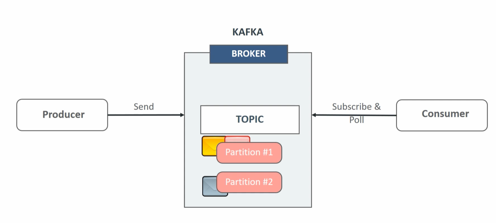
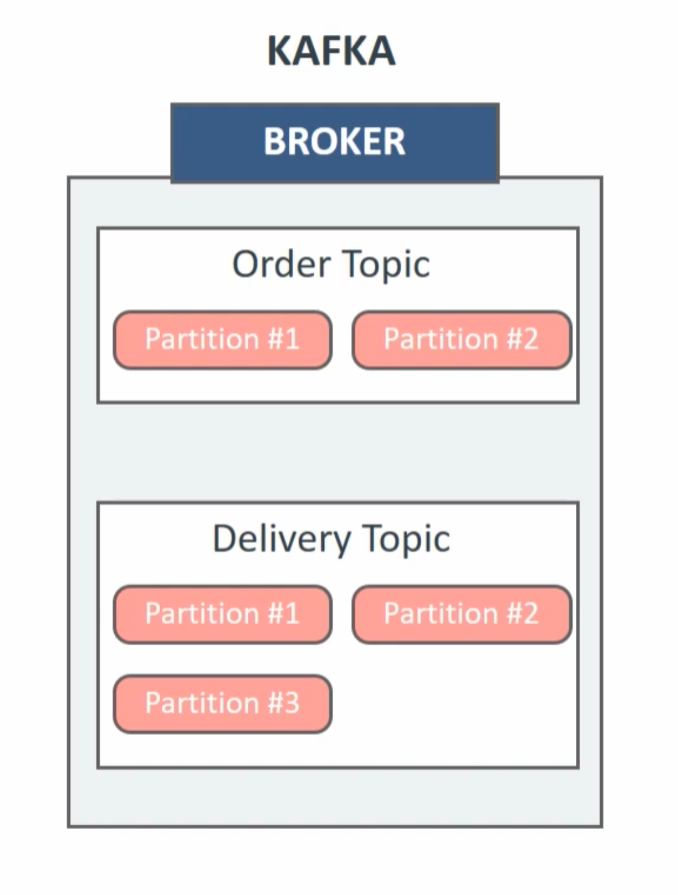
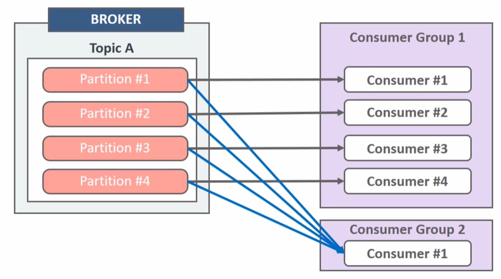
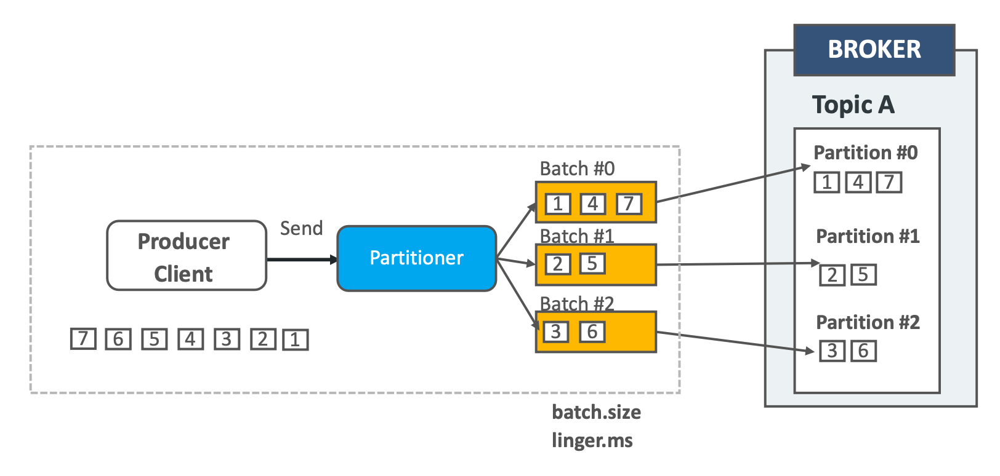
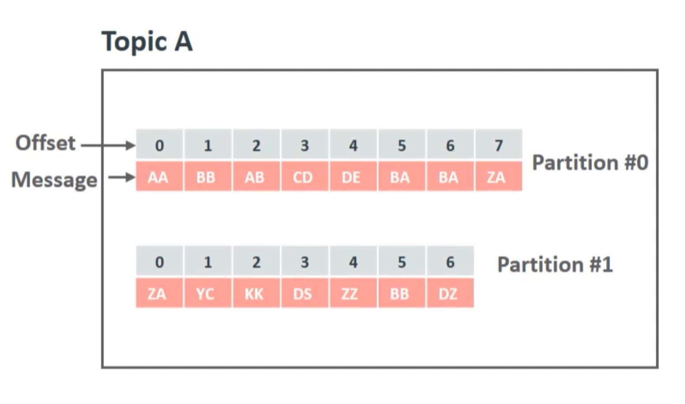
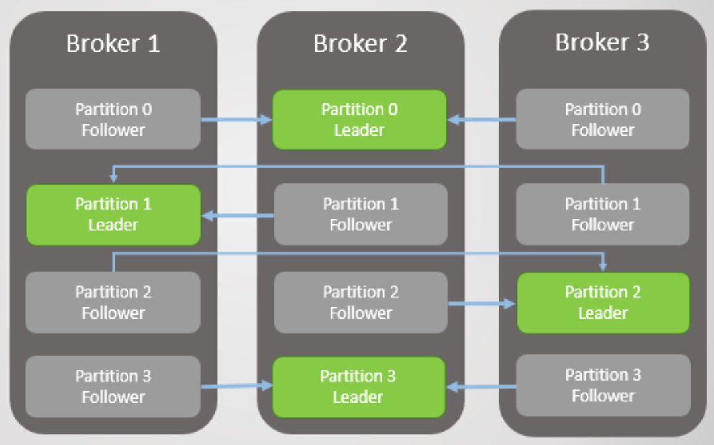

## 카프카 브로커

카프카 브로커는 카프카 클라이언트와 데이터를 주고받기 위해 사용하는 주체이자, 데이터를 분산 저장하여 장애가 발생하더라도 안전하게 사용할 수 있도록 도와주는 애플리케이션입니다. 하나의 서버에는 한 개의 카프카 브로커 프로세스가 실행되며, 보통은 데이터를 안전하게 보관하고 처리하기 위해 3대 이상의 브로커 서버를 1개의 클러스터로 묶어서 운영합니다. 카프카 클러스터로 묶인 브로커들은 카프카 프로듀서가 보낸 데이터를 안전하게 분산 저장하고 복제하는 역할을 수행합니다.

프로듀서로부터 데이터를 전달받으면 카프카 브로커는 프로듀서가 요청한 토픽의 파티션에 데이터를 저장하고 컨슈머가 데이터를 요청하면 파티션에 저장된 데이터를 전달합니다. 프로듀서로부터 전달된 데이터는 메모리, 데이터베이스, 캐시 메모리에 저장되지 않으며, 파일 시스템에 저장됩니다. 파일 시스템에 저장하기 때문에 속도 이슈가 있다고 생각할 수 있지만 카프카는 페이지 캐시를 사용하여 디스크 입출력 속도를 높여 속도 이슈를 해결했습니다. 이러한 특징 때문에 카프카 브로커를 실행하는데 힙 메모리 사이즈를 크게 설정할 필요가 없습니다. 

> 페이지 캐시란 OS에서 파일 입출력의 성능 향상을 위해 만들어 놓은 메모리 영역을 말합니다.

**컨트롤러**
클러스터의 다수 브로커 중 한 대가 컨트롤러의 역할을 합니다. 컨트롤러는 다른 브로커들의 상태를 체크하고 브로커가 클러스터에서 빠지는 경우 해당 브로커에 존재하는 리더 파티션을 재분배합니다. 만약 컨트롤러 역할을 하는 브로커에 문제가 생기면 다른 브로커가 컨트롤러 역할을 수행합니다.

**코디네이터**
클러스터의 다수 브로커 중 한 대는 코디네이터 역할을 수행합니다. 코디네이터는 컨슈머 그룹의 상태를 체크하고 파티션을 컨슈머와 매칭되도록 분배하는 역할을 합니다. 컨슈머가 컨슈머 그룹에서 빠지면 매칭되지 않은 파티션을 정상 동작하는 컨슈머로 할당하여 끊임없이 데이터가 처리되도록 도와줍니다. 이렇게 파티션을 컨슈머로 재할당하는 과정을 **리밸런스** 라고 합니다.

> 주키퍼(deprecated)
카프카 4.0 버전 이전에는 파티션의 위치, 토픽의 설정 정보 같은 메타데이터를 외부 시스템인 주키퍼를 통해 관리했습니다. 하지만 주키퍼의 메타데이터와 브로커의 메타데이터의 불일치가 발생하면서 4.0버전부터는 외부 시스템인 주키퍼가 제거되고 카프카 내부적으로 관리되기 시작했습니다.

## 토픽과 파티션

> 카프카 프로듀서에서 데이터 발송 -> 카프카 브로커에 저장 -> 카프카 컨슈머가 브로커로부터 데이터를 받아서 처리

카프카의 데이터 흐름은 위와 같이 구성됩니다. 카프카 브로커는 데이터를 구분하기 위해 사용하는 단위로 토픽은 1개 이상의 파티션을 보유하고 있습니다. 파티션에는 프로듀서가 전송한 데이터들이 저장되는데 이 데이터를 **레코드**라고 합니다. 카프카 프로듀서는 브로커로 데이터를 전송할 때, 토픽을 반드시 지정해야 하며, 보통 파티션은 지정하지 않으나 특수한 경우라면 파티션도 지정할 수 있습니다.

> 토픽 안에 여러 개의 파티션이 있고 파티션 안에 저장된 데이터들 레코드라고 한다. 

카프카는 여러 컨슈머가 묶인 컨슈머 그룹을 제공하고, 각 컨슈머 그룹이 토픽을 지정하여 카프카 브로커로부터 데이터를 소비합니다. 파티션은 카프카의 병렬처리의 핵심으로써 컨슈머 그룹이 토픽을 지정하게 되면 파티션 단위로 컨슈머와 매핑되게 됩니다. 파티션과 컨슈머는 N:1 매핑관계로 컨슈머는 여러 파티션을 처리할 수 있지만 하나의 파티션이 여러 컨슈머에 매핑될 수는 없습니다. 하지만 카프카 컨슈머 그룹은 그룹간의 격리된 환경을 제공하기 때문에 컨슈머 그룹이 다르다면 같은 토픽을 구독해도 서로에게 영향을 주지 않습니다. 그러므로 파티션과 컨슈머는 N:1 관계이지만 위 그림과 같이 다른 컨슈머 그룹인 경우에는 문제가 되지 않습니다.

최초 토픽 생성 시점에 파티션의 개수를 지정할 수 있는데 이후 파티션의 개수를 늘릴 수는 있지만 줄일 수는 없으므로 다음과 같은 내용을 고려해야 합니다.

+ 프로듀서와 컨슈머 데이터 처리량
+ 메시지 키 사용 여부
+ 브로커 영향도

**데이터 처리량**

보통 컨슈머 서버의 사양을 스케일업해서 처리량을 높이는 데에는 한계가 있기 때문에 파티션의 개수를 늘리고 파티션 개수만큼 컨슈머를 늘리는 방법이 성능 향상에 가장 확실한 방법입니다. 그러므로 프로듀서가 보내는 데이터양과 컨슈머의 데이터 처리량을 계산해서 파티션 개수를 정하면 됩니다. 만약 프로듀서가 보내는 데이터가 초당 1,000 레코드이고 컨슈머가 처리할 수 있는 데이터가 초당 100레코드라면 최소한 필요한 파티션 개수는 10개라고 보면 됩니다.

> 프로듀서 전송 데이터량 < 컨슈머 데이터 처리량 * 파티션 개수

파티션 개수만큼 컨슈머 스레드를 운영한다면 토픽의 병렬 처리를 극대화 할 수 있습니다. 반면에 전체 컨슈머 데이터 처리량이 프로듀서가 보내는 데이터보다 적다면 컨슈머 랙이 생기고, 데이터 처리 지연이 발생하게 됩니다. 따라서, 컨슈머 전체 데이터 처리량이 프로듀서 데이터 처리량보다 많아야 합니다.

**메시지 키**

메시지 키의 사용 여부는 데이터 처리 순서와 관련이 있습니다. 카프카 프로듀서에서 브로커로 메시지를 보낼 때, 메시지 키를 지정할 수 있습니다. 메시지 키를 지정하지 않으면 스티키 파티셔닝(2.4버전 이후)방식으로 특정 파티션으로 전송되는 하나의 배치에 메시지를 빠르게 먼저 채워서 보냅니다. 

반면에 메시지 키를 사용하면 메시지 키를 사용하면 프로듀서가 토픽으로 데이터를 보낼 때 메시지 키를 해시 변환하여 메시지를 파티션에 매칭시킵니다. 따라서 메시지 키가 같다면 항상 같은 파티션으로 메시지가 전송되므로 순서를 보장할 수 있습니다. 하지만 파티션 개수가 달라지면 매칭이 깨지고 다른 파티션에 데이터가 할당되기 때문에 이때부터 컨슈머는 특정 메시지 키의 순서를 보장받지 못합니다. 즉, 메시지 키를 사용하고 처리 순서가 보장되어야 한다면 최대한 파티션의 변화가 발생하지 않는 방식으로 운영해야 합니다. 만약 파티션 개수가 변해야 하는 경우에는 기존에 사용하던 메시지 키의 매칭을 그대로 가져가기 위해 커스텀 파티셔너를 개발하고 적용해야 합니다. 이러한 어려움 때문에 보통 메시지 키별로 처리 순서를 보장하기 위해서는 파티션 개수를 프로듀서가 전송하는 데이터양보다 더 넉넉하게 잡고 생성하는 것이 권장됩니다. 반면에 처리 순서가 관계 없다면 처음부터 넉넉하게 잡지 않아도 됩니다.

**브로커 영향도**
카프카에서 파티션은 각 브로커의 파일 시스템을 사용하기 때문에 파티션이 늘어나는 만큼 브로커에서 접근하는 파일 개수가 많아집니다. 운영체제에서는 프로세스당 열 수 있는 파일 최대 개수를 제한하고 있기 때문에 안정적으로 유지하기 위해서는 각 브로커당 파티션 개수를 모니터링 해야합니다. 데이터양이 많아져서 파티션 개수를 늘려야 하는 상황이라면 브로커당 파티션 개수를 확인하고 진행해야 합니다. 만약 브로커가 관리하는 파티션 개수가 너무 많다면 파티션 개수를 분산하기 위해 카프카 브로커 개수를 늘리는 방안도 같이 고려해야 합니다.

## 레코드와 오프셋

레코드는 타임스탬프, 메시지 키, 메시지 값, 오프셋으로 구성됩니다. 프로듀서가 생성한 레코드가 브로커로 전송되면 오프셋과 타임스탬프가 지정되어 저장됩니다.(필요에 따라 프로듀서에서 레코드 생성 시간, 다른 시간으로 타임스탬프 지정 가능) 브로커에 한번 적재된 레코드는 수정할 수 없고 로그 리텐션 기간 또는 용량에 따라서만 삭제됩니다.

레코드는 저장될 때, 오프셋 값이 부여됩니다. 오프셋은 컨슈머 그룹이 데이터를 어디까지 읽어갔는지 확인하는 용도로 사용됩니다. 레코드의 오프셋은 직접 지정할 수 없고 브로커에 저장될 때 이전에 전송된 레코드의 오프셋 + 1 의 값으로 생성됩니다. 컨슈머 그룹은 토픽의 특정 파티션으로부터 데이터를 가져가서 처리하고 파티션의 어느 레코드까지 읽었는지 알리기 위해 오프셋을 커밋합니다. 커밋한 오프셋은 consumer_offsets 토픽에 저장되고 저장된 오프셋을 토대로 컨슈머 그룹은 다음 레코드를 가져가서 처리합니다. 

## 데이터 삭제
카프카는 다른 메시징 플랫폼과 다르게 컨슈머가 데이터를 가져가더라도 토픽의 데이터는 삭제되지 않습니다. 또한 컨슈머나 프로듀서가 데이터 삭제 요청을 할 수 없고, 오직 브로커만이 데이터를 삭제할 수 있습니다. 데이터 삭제는 파일 단위로 이뤄지는데 이 단위를 **로그 세그먼트**라고 합니다. 이 세그먼트에는 다수의 데이터가 들어 있기 때문에 일반적인 데이터베이스처럼 특정 데이터를 선별해서 삭제할 수 없습니다. 세그먼트는 데이터가 쌓이는 동안 파일 시스템으로 열려있으며 카프카 브로커에 log.segment.bytes 또는 log.segment.ms 값이 설정되면 설정값에 따라 세그먼트 파일이 닫힙니다. 세그먼트 파일이 닫히게 되는 기본값은 1GB입니다. 닫힌 세그먼트 파일은 log.retention.bytes 또는 log.retention.ms 값이 넘으면 삭제 됩니다. 닫힌 세그먼트 파일을 체크하는 간격은 카프카 브로커의 옵션에 설정된 log.retention.check.interval.ms에 따릅니다.

## 데이터 복제, 싱크

카프카는 데이터 복제를 통해 클러스터로 묶인 브로커 중 일부에 장애가 발생하더라도 데이터를 유실하지 않고 안전하게 동작하기 위해 파티션 단위로 복제가 이뤄집니다. 토픽을 생성할 때 파티션의 복제 개수도 같이 설정하는데 직접 옵션을 선택하지 않으면 브로커에 설정된 옵션 값을 따라갑니다. 복제 개수의 최솟값은 1(복제없음)이고 값최댓값은 브로커 개수만큼 사용할 수 있습니다. 만약 복제 개수가 3(자신+복제2개)으로 총 3개의 파티션이 구성된다면 리더 파티션과 팔로워 파티션으로 구성됩니다. 프로듀서 또는 컨슈머와 직접 통신하는 파티션을 리더 파티션, 복제 데이터를 갖는 나머지 파티션을 팔로워 파티션이라고 합니다. 팔로워 파티션들은 리더 파티션의 오프셋을 확인하여 현재 자신이 가지고 있는 오프셋과 차이가 나는 경우 리더 파티션으로부터 데이터를 가져와서 자신의 파티션에 복제합니다. 만약 리더 파티션을 갖고 있는 브로커에 장애가 발생해 다운되면 팔로워 파티션 중 하나가 리더 파티션 지위를 넘겨 받습니다. 이를 통해 데이터가 유실되지 않고 컨슈머, 프로듀서가 데이터를 주고받도록 동작할 수 있게 됩니다.

