## 컨슈머 구조
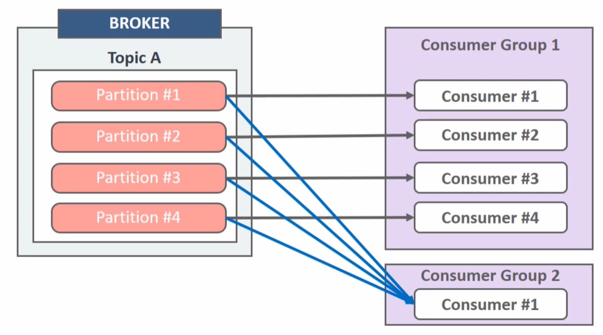

카프카에는 1개 이상의 컨슈머로 이뤄진 컨슈머 그룹이 존재합니다. 컨슈머 그룹을 운영함으로 인해 각 컨슈머 그룹으로부터 격리된 환경에서 안전하게 운영할 수 있습니다. 컨슈머 그룹으로 묶인 컨슈머들은 토픽에 있는 1개 이상 파티션들에 할당되어 데이터를 가져갈 수 있습니다. 반면에 파티션은 최대 1개의 컨슈머에만 할당 가능합니다. 이러한 특징으로 컨슈머 그룹의 컨슈머 개수는 가져가고자 하는 토픽의 파티션 개수와 같거나 작아야 합니다. 만약 그보다 많아지게 되면 특정 컨슈머는 파티션이 할당되지 않아 스레드만 차지하게 되기 때문입니다. 컨슈머 그룹은 다른 컨슈머 그룹과 격리되는 특징을 가지고 있어 컨슈머 그룹끼리 영향을 받지 않게 처리할 수 있으므로 컨슈머 그룹으로 따로 나눌 수 있는 경우는 최대한 나누는 것이 권장됩니다.

## offset

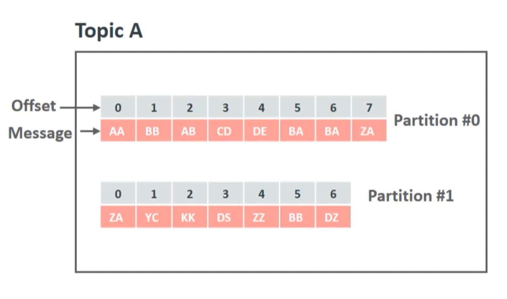
컨슈머는 카프카 브로커로부터 데이터를 어디까지 가져갔는지 커밋을 통해 기록합니다. 특정 토픽의 파티션을 어떤 컨슈머 그룹이 몇 번째까지 가져갔는지 카프카 브로커 내부에서 사용되는 내부 토픽(__consumer_offsets)에 기록됩니다. 컨슈머 동작에 이슈가 발생하여 consumer_offsets 토픽에 어느 레코드까지 읽어갔는지 오프셋 커밋이 기록되지 못했다면 데이터 처리의 중복이 발생할 수 있습니다. 데이터 처리의 중복이 발생하지 않게 하기 위해서는 컨슈머 애플리케이션이 오프셋 커밋을 정상적으로 처리했는지 검증해야만 합니다. 오프셋 커밋은 컨슈머 애플리케이션에서 명시적, 비명시적으로 수행할 수 있습니다. 

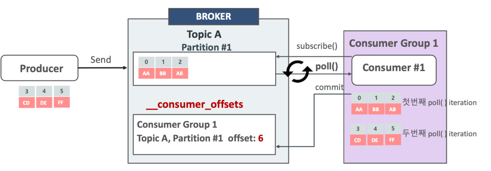

기본적으로 컨슈머는 레코드를 처리하는 poll 메서드가 수행될 때 일정 간격마다 오프셋을 커밋하도록(enable.auto.commit=true)로 설정되어 있습니다. 이렇게 일정 간격마다 자동으로 커밋되는 것을 **비명시 오프셋 커밋** 이라고 합니다. 이 옵션은 auto.commit-interval.ms에 설정된 값과 함께 사용되는데, poll 메서드가 auto.commit-interval.ms에 설정된 값 이상이 지났을 때 그 시점까지 레코드 오프셋을 커밋합니다. 따라서 명시적으로 커밋 관련 코드를 작성할 필요가 없습니다. 비명시 오프셋 커밋은 편리하지만 poll 메서드 호출 이후에 리밸런싱 또는 컨슈머 강제종료 발생 시 컨슈머가 처리하는 데이터가 중복 또는 유실될 수 있는 가능성이 있는 취약한 구조를 갖고 있습니다. 그러므로 데이터 중복이나 유실을 허용하지 않는 서비스라면 자동 커밋을 사용하면 안 됩니다.

명시적으로 오프셋을 커밋하려면 poll 메서드 호출 이후에 반환받은 데이터의 처리가 완료되고 commitSync 메서드를 호출하면 됩니다. commitSync 메서드는 poll 메서드를 통해 반환된 레코드의 가장 마지막 오프셋을 기준으로 커밋을 수행합니다. commitSync 메서드는 브로커에 커밋 요청을 하고 커밋이 정상적으로 처리되었는지 응답하기까지 기다리는데 이는 컨슈머의 처리량에 영향을 끼칩니다. 데이터 처리 시간에 비해 커밋 요청 및 응답에 시간이 오래 걸린다면 동일 시간당 데이터 처리량이 줄어들기 때문입니다. 이를 해결하기 위해 commitAsync 메서드를 사용해 커밋 요청을 전송하고 응답이 오기 전까지 데이터 처리를 수행할 수 있습니다. 하지만 비동기 커밋은 커밋 요청이 실패했을 경우 현재 처리 중인 데이터의 순서를 보장하지 않으며 데이터의 중복 처리가 발생할 수 있습니다.

사실 카프카 컨슈머에서는 어떤 방식을 사용하든 중복이 발생할 수 있습니다. auto commit은 자동으로 커밋하기 전에 consumer가 죽으면 다른 컨슈머가 중복으로 해당 데이터를 처리할 수 있고, 명시적 커밋도 처리 과정에서 예외가 발생하면 마지막 커밋된 오프셋부터 메시지를 다시 가져오기 때문입니다. 즉, 카프카는 메시지가 중복은 있지만 손실은 없음을 보장합니다. 따라서 가능하다면 파티션별로 메시지 순서 의존성이 없도록 설계하는 것이 좋습니다.

## poll 동작

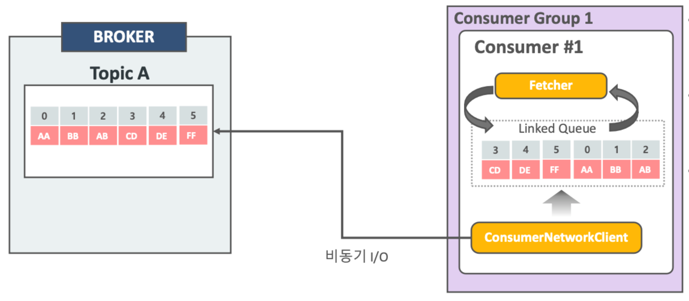

컨슈머는 poll 메서드를 통해 레코드들을 반환받지만 poll 메서드를 호출하는 시점에 클러스터에서 데이터를 가져오는 것은 아닙니다. 컨슈머 애플리케이션을 실행하게 되면 내부에서 Fetcher 인스턴스가 생성되어 poll 메서드를 호출하기 전에 미리 레코드들을 내부 큐로 가져옵니다. 이후에 사용자가 명시적으로 poll을 호출하면 컨슈머는 내부 큐에 있는 레코드들을 반환받아 처리를 수행하게 됩니다.

## 컨슈머 주요 옵션
+ 필수 옵션
    - bootstrap.servers
        - 프로듀서가 데이터를 전송할 대상 카프카 클러스터에 속한 브로커 '호스트 이름:포트' 를 1개 이상 작성
        - 2개 이상 입력하여 일부 브로커에 이슈가 발생하더라도 접속하는 데에 이슈가 없도록 설정 권장
    - key.deserializer, value.deserializer : 역직렬화 클래스 지정
+ 선택 옵션
    - group.id
        - 컨슈머 그룹 아이디
        - 기본값은 null
    - auto.offset.reset
        - 컨슈머 그룹이 특정 파티션을 읽을 때 저장된 컨슈머 오프셋이 없는 경우 어느 오프셋부터 읽을지 선택하는 옵션
        - 이미 컨슈머 오프셋이 있다면 이 옵션값은 무시됩니다.
        - lastest, earliest, none 옵션이 있고 기본값은 latest입니다.
            - lastest : 가장 마지막(최근)의 오프셋부터 읽기
            - earliset : 가장 오래전에 넣은(가장 초기) 오프셋부터 읽기
            - none : 컨슈머 그룹이 커밋한 기록이 없으면 오류를 반환하고 있다면 기존 커밋 기록 이후부터 오프셋을 읽기
    - fetch.min.bytes
        - 한번에 가져올 수 있는 최소 데이터 사이즈
        - 만약 지정한 사이즈보다 작은 경우, 요청에 대해 응답하지 않고 데이터가 누적될 때까지 기다립니다.
        - 무작정 기다리는 것은 아니고 fetch.wait.max.ms 설정의 영향을 받습니다.
    - fetch.wait.max.ms
        - 브로커에 fetch.min.bytes 이상의 메시지가 쌓일때까지 최대 대기 시간
        - 기본은 500ms
    - fetch.max.bytes
        - 한번에 가져올 수 있는 최대 데이터 사이즈
    - request.timeout.ms
        - 요청에 대해 응답을 기다리는 최대 시간
    - enable.auto.commit
        - 자동 커밋 여부 결정
        - 기본값 true
        - auto.commit.interval.ms를 5ms로 설정했다면(기본값) 컨슈머는 poll을 호출하고 5ms후 레코드의 가장 마지막 오프셋을 커밋합니다.
    - auto.commit.interval.ms
        - 자동 커밋일 경우 오프셋 커밋 간격을 지정
        - 기본값 5000(5초)
    - max.poll.records
        - poll 메서드를 통해 반환되는 레코드 개수 지정
        - 기본값 500
    - session.timeout.ms
        - 컨슈머가 브로커와 연결이 끊기는 최대 시간
        - 이 시간 내에 하트비트를 전송하지 않으면 브로커는 컨슈머에 이슈가 발생했다고 가정하고 리밸런싱을 시작합니다.
        - 보통 하트비트 시간 간격의 3배로 설정합니다.
        - 기본값은 10000(10초)
    - heartbeat.interval.ms
        - 하트비트 전송하는 시간 간격
        - 기본값은 3000(3초)
    - max.poll.records
        - 단일 호출 poll에 대한 최대 레코드 수를 조정합니다.
    - max.poll.interval.ms
        - poll 메서드를 호출하는 간격의 최대 시간
        - hearbeat는 주기적으로 보내고 있으나 실제로 메시지를 가져가지 않는 경우가 있을 수 있어, 컨슈머가 무한정 해당 파티션을 점유할 수 없도록 주기적으로 poll을 호출하지 않으면 장애라고 판단합니다.
        - poll 메서드를 호출한 이후에 데이터를 처리하는 데에 시간이 너무 많이 걸리는 경우 비정상으로 판단하고 리밸런싱을 시작합니다.
        - 기본값은 300000(5분)
    - isolation.level
        - 트랜잭션 프로듀서가 레코드를 트랜잭션 단위로 보낼 경우 사용
        - read_committed, read_uncommitted로 설정 가능
        - 전자는 설정하면 커밋이 완료된 레코드만 읽고 후자는 모든 레코드를 읽습니다.
        - 기본값은 read_uncommitted
    - partition.assignment.strategy
        - 파티션을 컨슈머에 할당할 때 어떤 전략을 선택할 것인지 지정하는 옵션

### partition.assignment.strategy
파티션을 컨슈머에 할당할 때 어떤 전략을 선택할 것인지 지정하는 옵션입니다. 해당 옵션을 이해하기 위해서는 Consumer Rebalancing protocol 모드를 이해해야 합니다. 리밸런싱은 다음과 같은 상황에서 발생합니다.

+ 토픽에 새로운 파티션 추가 
+ 컨슈머 그룹 내에 새로운 컨슈머 추가 or 종료

#### Consumer Rebalancing protocol 모드
Rebalancing protocol 모드는 Eager과 Cooperative이 있습니다.

**Eager**
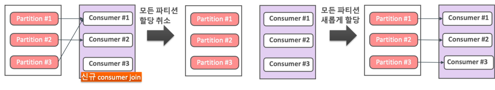
   
* 리밸런싱 시 기존 컨슈머들의 모든 파티션 할당을 취소하고 재할당 전까지 메시지를 읽지 않습니다.
* 모든 컨슈머가 메시지를 재할당 전까지 읽지 않으므로 lag이 발생할 가능성이 높습니다.
* 네이밍에 cooperative가 붙어있지 않는한 Eager이 기본값입니다.

**cooperative**

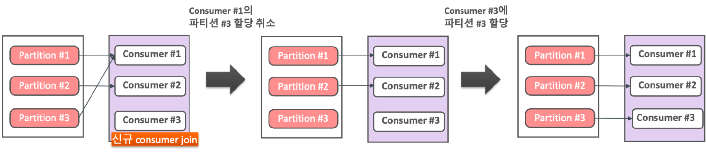

* 리밸런싱 시 기존 컨슈머들의 모든 파티션 할당을 취소하지 않고 대상이 되는 컨슈머들에 대해서 파티션에 따라 점진적으로 컨슈머를 할당하면서 리밸런싱을 수행합니다.
* 전체 컨슈머가 메시지 읽기를 중지하지 않으며 개별 컨슈머가 협력적으로 영향받는 파티션만 리밸런스로 재분배합니다.
  

#### Assigner
**RoundRobinAssignor와 RangeAssigner**
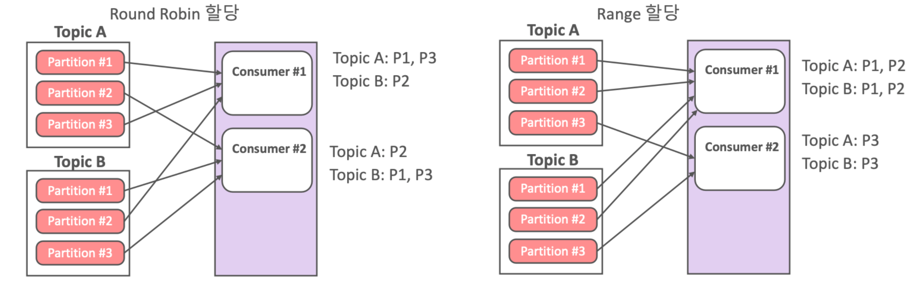
라운드 로빈 방식은 순차적으로 파티션을 할당하는 방식이고, range 방식은 다른 토픽이라도 파티션 번호가 같으면 같은 컨슈머에 할당하는 방식입니다. RangeAssignor가 기본값입니다.

**StickyAssignor**
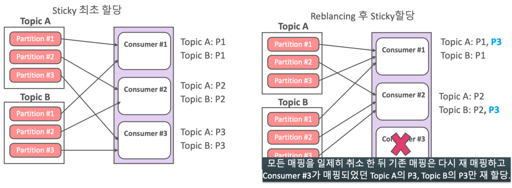

sticky방식은 라운드 로빈 방식과 같으나 리밸런싱할 때, Eager로 다 떨어지고 재분배시 이전을 기억하고 있기 때문에 기존에 붙어있는 것은 그대로 가고 사라진 컨슈머에 매핑되어 있던 것만 round robin으로 동작합니다.

**CoorperativeStickyAssignor**
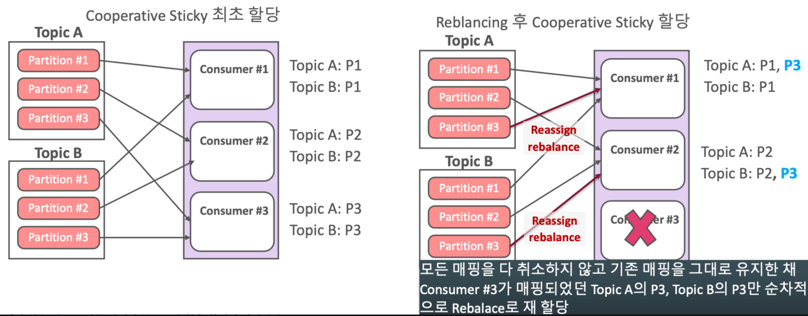

처음에는 라운드 로빈으로 동작하고 리밸런싱할 때, Eager가 아니라 계속 붙어있고 죽은 컨슈머에 붙어있던 파티션만 Round Robin방식으로 붙습니다.

## 리밸런싱

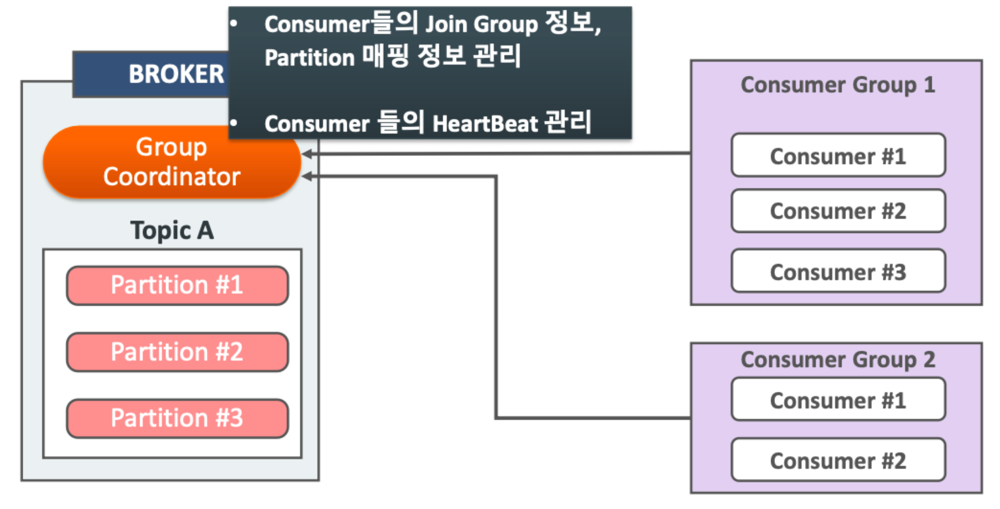
컨슈머 그룹으로 이뤄진 컨슈머들 중 일부 컨슈머에 장애가 발생하면, 장애가 발생한 컨슈머에 할당된 파티션은 장애가 발생하지 않은 컨슈머로 소유권이 넘어가는데 이를 **리밸런싱** 이라고 합니다. 리밸런싱은 크게 컨슈머가 추가되는 상황, 컨슈머가 제외되는 상황 두 가지에서 발생합니다. 이는 카프카 브로커 중 한대가 그룹 조정자의 역할을 수행하는데 그룹 조정자(group coordinator)는 컨슈머 그룹의 컨슈머가 추가되고 삭제될 때를 감지하여 리밸런싱을 수행합니다. 

보통 장애 상황이 아니라면 배포하는 시점에 기존 애플리케이션이 종료되고 새로운 애플리케이션이 추가되면서 리밸런싱이 발생합니다. 애플리케이션은 종료되는 시점에 kafkaConsumer.close 메서드를 호출하면서 코디네이터에게 컨슈머가 종료되었다는 사실을 알리고 코디네이터는 이를 통해 파티션 리밸런싱을 수행합니다. 만약 컨슈머가 종료되면서 close 메서드를 호출하지 않는다고 해도 컨슈머는 heartbeat.interval.ms 간격으로 코디네이터에게 하트비트를 보내게 되는데 이를 받지 못하면서 해당 컨슈머의 장애 및 종료 상태를 인지하고 컨슈머 그룹에서 제외시키면서 리밸런싱을 수행할 수 있습니다.  

이렇게 보면 리밸런싱이 간단해보이나 리밸런싱에도 단점이 있습니다. 기본 설정이라면 리밸런싱이 일어나는 동안 일시적으로 컨슈머는 메시지를 가져갈 수 없습니다. 그래서 파티션 리밸런싱이 발생하면 컨슈머 그룹 전체의 메시지 처리가 멈추는 현상이 발생합니다. 리밸런싱이 일어나는 과정을 하나의 예시로 알아봅시다. 컨슈머 애플리케이션이 종료되는 과정에서 kafkaConsumer.close메서드를 호출해서 코디네이터가 해당 컨슈머를 그룹에서 제외하고 리밸런싱이 일어난다고 가정해봅시다.

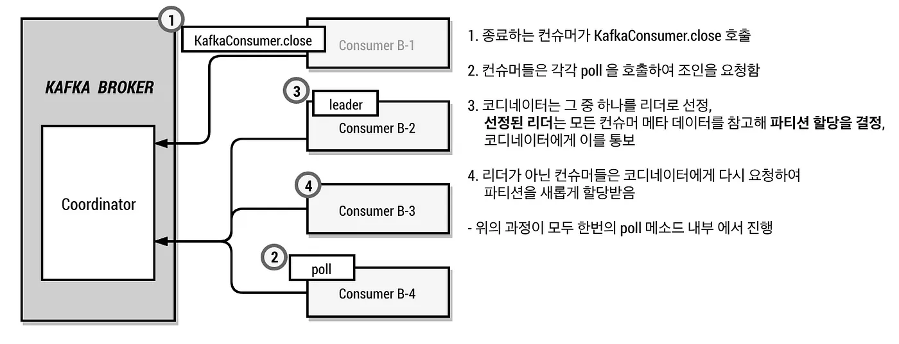

1. 그룹 내 남아있는 컨슈머들은 poll 메소드 호출 시 그룹에 다시 조인해야 하는지를 확인합니다. 컨슈머 그룹에 새로운 컨슈머가 추가되었거나, 기존 컨슈머가 그룹에서 제외된 경우에 컨슈머들은 그룹에 다시 조인해야 합니다. 컨슈머가 그룹에 다시 조인해야 할 때에는 코디네이터에게 조인 요청을 보냅니다. 컨슈머는 조인 요청을 보낼 때 메타데이터를 추가해서 보낼 수 있습니다.
2. 코디네이터가 그룹 내의 모든 컨슈머로부터 조인 요청 받으면 그중 하나를 컨슈머 그룹 리더로 선정합니다.
3. 리더로 선정된 컨슈머는 조인 요청에 대한 응답으로 그룹 내의 모든 컨슈머 목록과 메타데이터를 받습니다. 리더는 컨슈머들의 메타데이터 등을 참고해서 각 컨슈머에게 파티션을 어떻게 할당할지를 결정합니다. 그리고 결정된 사항을 코디네이터에게 전달합니다.
4. 팔로워는(컨슈머 그룹 중에 리더가 아닌 컨슈머들) 새롭게 할당된 파티션 목록을 얻기 위해 코디네이터에게 다시 요청을 보냅니다. 코디네이터는 리더로부터 파티션 할당 정보를 받으면 팔로워의 요청에 대한 응답으로 새롭게 할당된 파티션 목록을 보내줍니다.

> 위의 과정은(1~4) KafkaConsumer.poll 메소드 내부에서 진행됩니다

위에 과정을 통해서 알 수 있듯이 파티션 리밸런싱이 일어났을 때, 파티션을 그룹 내 컨슈머들에게 어떻게 분배할지는 그룹 내 리더가 결정합니다. 코디네이터는 컨슈머 그룹 내의 리더를 선출하고, 리더가 보낸 새로운 파티션 할당 정보를 팔로워에게 분배하는 정도의 역할만 합니다. 

 

그리고 주목할 만 사실은 **코디네이터는 그룹 내의 모든 컨슈머들로부터 조인 요청을 받은 이후에 리더를 선출한다**는 것입니다. 따라서 그룹 내의 모든 컨슈머들이 poll 메소드를 호출해야지만 파티션 리밸런싱이 완료됩니다.

> 그룹 내 특정 컨슈머가 poll 메소드를 호출하지 않은 경우

그룹 내 모든 컨슈머들이 조인 요청을 보내야만 코디네이터가 리더를 선출한다고 했습니다. 특정 컨슈머가 poll 메서드를 호출하지 못하고 있어서 조인 요청을 보내지 못한다고 해서 리더 선출을 못하는 것은 아닙니다. 컨슈머의 조인 요청에는 rebalanceTimeout을 포함하고 있습니다. 컨슈머들은 파티션 리밸런싱이 시작된 이후에 rebalanceTimeout 시간내에 조인 요청을 보내야 하고 만약 컨슈머가 rebalanceTimeout 이내에 조인 요청을 보내지 못하는 경우 그룹에서 제외됩니다.(rebalanceTimeout은 max.poll.interval.ms 값으로 세팅됩니다.)

### 카프카 컨슈머 애플리케이션의 일반적인 구조
일반적인 Spring Kafka 애플리케이션은 poll 메소드를 호출해서 레코드(메시지)를 가져오고 동일한 스레드에서 레코드를 처리합니다. 그리고 가져온 레코드를 전부 처리한 후에 다시 poll 메소드를 호출해서 새로운 레코드를 가져옵니다. poll 메소드를 통해 한 번에 가져올 수 있는 최대 레코드 수는 max.poll.records 속성으로 정해지며 기본값은 500입니다. 기본값을 사용하는 경우 poll 메소드를 통해 레코드를 최대 500개까지 가져올 수 있습니다.

아래와 같은 특징을 가진 컨슈머 애플리케이션이 있다고 가정해보겠습니다.

+ max.poll.records 속성이 500(기본값)으로 세팅됨
+ 하나의 레코드를 처리하는데 약 0.5초가 걸림

위와 같은 특징을 가진 컨슈머 애플리케이션의 poll 메소드 호출 간격을 계산해보면 다음과 같습니다. poll 메소드를 통해 500개의 레코드를 가져오고 하나의 레코드를 처리하는데 약 0.5초 걸린다면, 500개의 레코드를 처리하는 데는 약 250(500 * 0.5)초가 걸립니다. poll 메소드를 통해 가져온 레코드를 전부 처리한 후에 다시 poll을 호출하는 일반적인 구조라면 poll 메소드의 호출 간격이 약 250초입니다.

컨슈머가 계속해서 하트비트만 보내고, 실제로 메시지를 가져가지 않는 경우가 있을 수도 있습니다. 이러면 컨슈머가 메시지를 처리하지 않고 해당 파티션을 무한정 점유할 수 있습니다. 이를 방지하기 위한 설정은 max.poll.interval.ms 입니다. 컨슈머가 이 시간 동안 poll을 호출하지 않으면, 코디네이터는 해당 컨슈머가 장애라고 판단하고 컨슈머 그룹에서 제외하고, 파티션 리밸런싱이 일어납니다.

### 배포 시 고려사항

poll 메소드의 호출 간격이 길다면, 애플리케이션 배포 시 고려해야 할 사항이 있습니다. 위에서 설명했듯이 리밸런싱 과정은 그룹 내 모든 컨슈머들이 poll 메소드를 통해 조인 요청을 코디네이터에게 보내야만 완료됩니다. 따라서 poll 메소드의 호출 간격이 길어지면 그만큼 파티션 리밸런싱이 완료되는 데까지 걸리는 시간이 길어집니다.

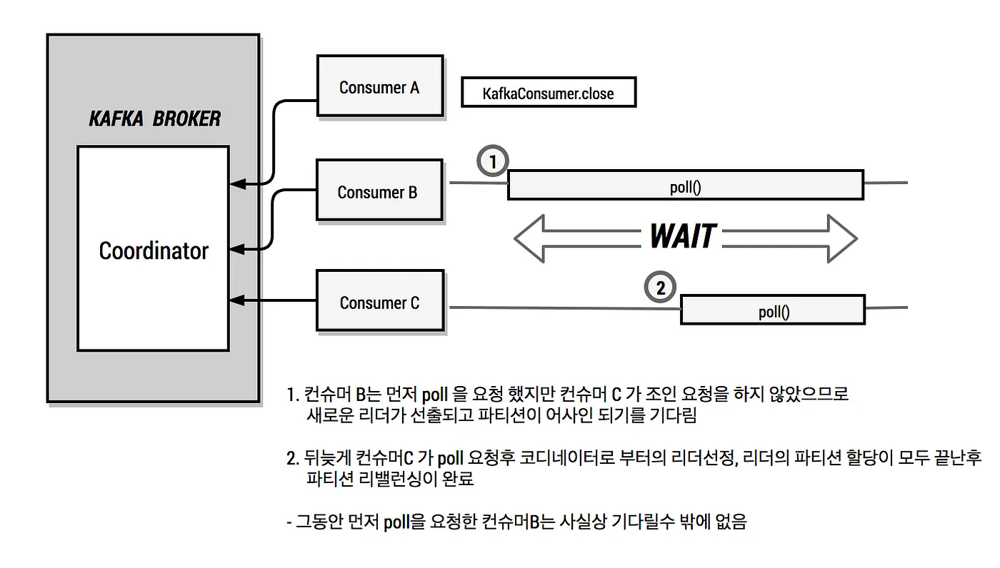

1. 그룹 내의 컨슈머가 3개 존재하며, poll 메소드의 호출 간격이 250초라고 가정해보겠습니다. 그리고 한 개의 컨슈머가 정상적으로 종료되었습니다.
2. 기존 컨슈머가 그룹에서 제거되었기 때문에 파티션 리밸런싱이 일어납니다. 컨슈머 B는 컨슈머 A가 그룹에서 제외된 후 얼마 지나지 않아서 poll 메소드를 호출했습니다. 컨슈머 B는 poll 메소드에서 코디네이터에게 조인 요청을 보냅니다. 그리고 코디네이터가 리더를 선출해서 응답을 줄 때까지 기다립니다.
3. 컨슈머 C는 이전 poll을 통해 가져온 레코드를 전부 처리하지 못했기 때문에 poll 메소드를 아직 호출하지 못하고 있습니다. 코디네이터는 컨슈머 C로부터 조인 요청을 받지 못했기 때문에 리더를 선출할 수 없습니다. 그리고 컨슈머 B는 리더가 선출되기를 기다리고 있습니다.
4. 컨슈머 C가 약 150초 정도 지난 뒤에 poll 메소드를 호출했다고 가정해보겠습니다. 코디네이터는 그룹 내 모든 컨슈머로부터 조인 요청을 받았기 때문에 그룹 내 리더를 선출합니다. 그리고 코디네이터는 컨슈머 B와 컨슈머 C에게 조인 요청에 대한 응답을 보냅니다. 응답에는 어떤 컨슈머가 그룹 내 리더인지 알 수 있는 정보가 포함되어 있습니다.
5. 리더는 컨슈머들의 메타데이터 등을 참고해서 각 컨슈머에게 파티션을 어떻게 할당할지를 결정합니다. 그리고 결정된 사항을 코디네이터에게 전달합니다. 코디네이터는 새로운 파티션 할당 정보를 팔로워에게 전달함으로써 파티션 리밸런싱이 완료됩니다.

위와 같은 상황은 poll 메소드의 호출주기가 길다면 충분히 발생할 수 있습니다. 애플리케이션의 특징에 따라 파티션 리밸런싱 시간이 중요하지 않을 수 있습니다. **하지만 주문처리 혹은 결제와 같은 준 실시간 작업을 카프카를 이용해서 비동기로 처리하고 있다면 파티션 리밸런싱 시간을 단축하는 것이 좋습니다.** 파티션 리밸런싱이 일어나는 동안 컨슈머들이 레코드를 가져오지 못하기 때문에, 파티션 리밸런싱 시간이 오래 걸릴수록 LAG이 커질 수 있습니다. 이로 인해 준 실시간으로 처리되어야 하는 시스템에서는 메시지 처리 지연이 발생할 수 있습니다.

### 해결 방안
파티션 리밸런싱 시간을 줄이기 위해서는 poll 메소드의 호출 간격을 줄여야 합니다. 

**방안 1. 스레드의 분리**
파티션 리밸런싱 시간을 줄이기 위해 고려해볼 수 있는 첫 번째 방법으로는 컨슈머 스레드와 레코드를 처리하는 스레드를 분리하는 것입니다.

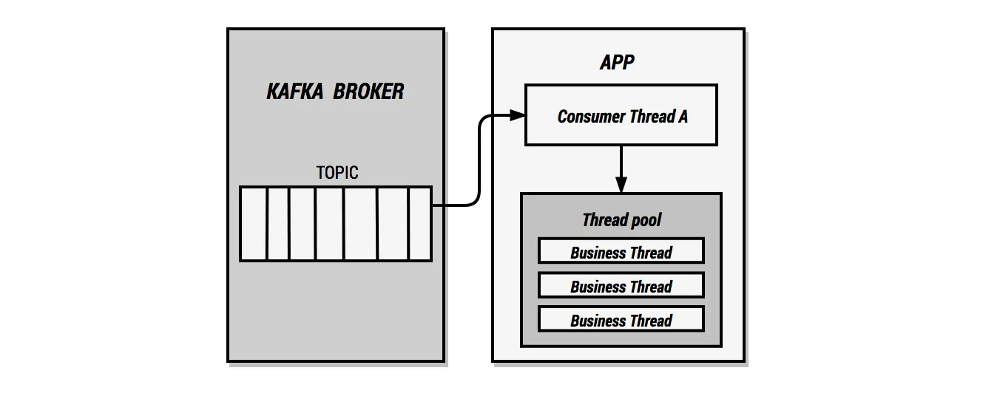

스레드를 분리하는 방법으로 스레드 풀을 사용하는 것을 고려해 볼 수 있습니다. 위와 같이 컨슈머 스레드에서는 레코드만 가져오고, 레코드에 대한 처리는 스레드 풀에서 합니다. 컨슈머 스레드는 레코드가 처리되기까지 기다릴 필요가 없으므로, 아주 짧은 간격으로 poll 메소드를 호출할 수 있습니다.

위와 같은 구조의 가장 큰 단점은 같은 파티션에 있는 레코드들의 처리 순서가 바뀔 수 있다는 것입니다. 예를 들어 0번 파티션에 3개의 레코드가 있다고 가정해보겠습니다. 그리고 0번 파티션을 소비하고 있는 컨슈머가 3개의 레코드를 가져오고 레코드에 대한 처리는 별도의 스레드 풀에서 합니다. 이때 사용 가능한 스레드의 개수가 3개 이상이라면, 3개의 레코드는 거의 동시에 처리되기 시작할 것입니다. 이런 경우 3개의 레코드 중에서 어떤 레코드가 가장 먼저 처리될지는 알 수 없으며 결과적으로 레코드 처리 순서가 보장되지 않습니다. 물론 처리 순서가 중요하지 않은 시스템에서는 이 부분이 문제가 되지 않지만, 같은 파티션에 존재하는 레코드들의 처리 순서가 매우 중요하다면 위와 같은 구조를 사용하지 못합니다.

또한, 스레드 풀 크기를 신중하게 고려해야 합니다. 스레드 풀의 크기가 너무 작으면 버퍼가 무한정 커지게 되며 이는 장애를 일으킬 수 있습니다. 반면에 스레드 풀의 크기가 불필요하게 크다면 메모리가 낭비될 수 있습니다.

> 스레드 풀을 사용하더라도 컨슈머가 메시지를 가져오는 속도와 메시지를 처리하는 속도 간에 차이가 발생할 수 있습니다. 컨슈머가 메시지를 가져오는 속도가 더 빠른 애플리케이션의 경우 스레드 풀의 버퍼가 가득 찰 수 있습니다. 버퍼가 가득 찬 상태에서 스레드 풀이 추가적인 요청을 받으면 예외가 발생합니다. 또한, 메시지 사이즈가 큰 경우, 많은 메시지가 버퍼에 저장되면 Out of Memory 에러가 발생할 수도 있습니다. 따라서 이러한 속도 차이가 존재하는 경우, 백프레셔 구현을 고려해봐야 합니다. 

**방안 2. max.poll.records 속성 변경**
이번에는 레코드 처리를 별도의 스레드에서 하지 않는 단일 스레드 구조에서 poll 메소드 호출 간격을 줄이는 방법입니다.

단일 스레드 구조에서 poll 메소드의 호출 간격은 (레코드 하나를 처리하는데 걸리는 시간) X (poll 메소드를 통해 가져온 레코드의 수) 입니다. 따라서 poll 메소드의 호출 간격을 줄이기 위해서는 레코드 하나를 처리하는데 걸리는 시간을 줄이거나, 한 번의 poll 메소드를 통해 가져오는 레코드의 수를 줄여야 합니다. 하지만 레코드를 처리하는 과정에서 외부 시스템에 의존하거나, DB를 조회하는 등 여러 가지 작업이 일어나는 경우 레코드 처리 시간을 줄이기는 어렵습니다. 반면에 poll 메소드를 통해 가져오는 레코드의 수를 줄이기는 매우 쉽습니다. 컨슈머의 max.poll.records 속성을 변경하기만 하면 됩니다. 

max.poll.records 속성을 5로 설정했다고 가정해보겠습니다. 그러면 poll 메소드 호출을 통해 최대 5개의 레코드를 가져올 수 있습니다. 하나의 레코드를 처리하는데 걸리는 시간이 0.5초라고 한다면 poll 메소드를 통해 가져온 모든 레코드를 처리하는데 걸리는 시간은 약 2.5초가 됩니다. 일반적은 컨슈머 애플리케이션은 poll 메소드 호출을 통해 가져온 레코드를 모두 처리한 후에 다음 poll을 호출합니다. 따라서 poll 메소드 호출주기가 약 2.5초가 됩니다. poll 메소드의 호출 주기가 짧아진 만큼 파티션 리밸런싱이 완료되기까지 걸리는 시간도 짧아집니다. 이런 경우라면 보통 5초 이내에 파티션 리밸런싱 작업이 완료될 것입니다.

max.poll.records를 작게 설정하면 성능이 크게 떨어질 거로 생각할 수 있습니다. 하지만 실제로 `max.poll.records를 작게 설정하더라고 성능에 큰 영향을 주지는 않습니다` 그 이유는 컨슈머가 레코드를 가져올 때 Fetcher 라는 클래스를 사용하기 때문입니다. 실제로 poll 메소드에서 레코드를 가져오는 부분은 아래와 같은 순서로 실행됩니다.

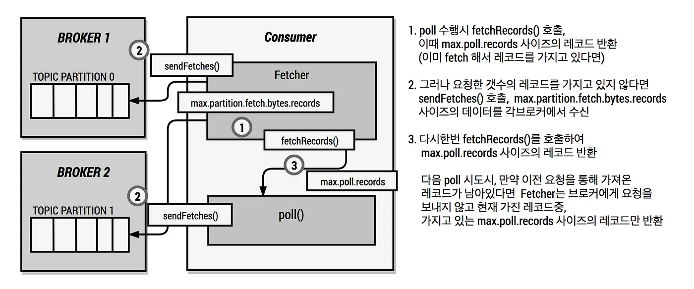

1. 컨슈머는 poll 메소드가 호출되면, Fetcher의 fetchedRecords 메소드를 호출합니다. fetchedRecords 메소드는 최대 max.poll.records 만큼의 레코드를 리턴합니다.
2. 만약에 Fetcher가 레코드를 가지고 있지 않다면, fetchedRecords 메소드는 빈 Map을 반환합니다. 그리고 빈 Map이 반환된 경우에만 컨슈머는 Fetcher#sendFetches 메소드를 호출합니다. sendFetches 메소드에서는 Fetcher가 브로커에게 요청을 보내 레코드를 가져옵니다. 하나의 요청으로 최대 fetch.max.bytes 크기만큼 가져올 수 있고, 파티션당 최대 max.partition.fetch.bytes 크기만큼 가져올 수 있습니다. 그리고 요청은 현재 컨슘하고 있는 파티션의 리더에게 모두 보냅니다. 예를 들어, 현재 컨슈머가 컨슘하고 있는 파티션이 0, 1이고 0번 파티션의 리더가 브로커 1, 1번 파티션의 리더가 브로커 2라면, 컨슈머는 브로커 1, 2에게 각각 요청을 보냅니다. 즉 2개의 요청을 보내게 됩니다.
3. Fetcher#sendFetches 메소드를 호출 후, 컨슈머는 또다시 fetchedRecords 메소드를 호출합니다. 그러면 Fetcher는 요청을 통해 가져온 레코드 중에서 최대 max.poll.records 만큼의 레코드를 반환합니다.
4. 컨슈머의 poll 메소드가 또다시 호출이 된 경우, 컨슈머는 Fetcher#fetchedRecords 메소드를 호출할 것입니다. 이전 요청을 통해 가져온 레코드가 아직 남아있다면, Fetcher는 브로커에게 요청을 보내지 않고 가지고 있는 레코드 중에서 max.poll.records 만큼의 레코드를 바로 반환합니다.

**결과적으로 Fetcher는 가지고 있는 레코드가 없는 경우에만 브로커에게 요청을 보냅니다.** 따라서 max.poll.records를 작게 설정해도 성능에 큰 영향을 주진 않습니다. 오히려 fetch.max.bytes 설정과 max.partition.fetch.bytes 설정이 성능에 큰 영향을 줍니다.

max.poll.records 속성을 작게 설정했음에도 하나의 레코드를 처리하는데 너무 오랜 시간이 걸린다면 poll 메소드 호출 간격이 길어질 수밖에 없습니다. 그러면 배포 시에 파티션 리밸런싱 시간이 길어질 수 있다는 한계가 존재합니다. 이런 경우는 레코드를 별도의 스레드 풀에서 처리하는 모델을 고려해봐야 합니다.

### 결론
컨슈머 애플리케이션을 배포하는 경우 파티션 리밸런싱이 일어납니다. 파티션 리밸런싱은 그룹 내 모든 컨슈머들이 poll 메소드를 호출해야지만 완료됩니다. 따라서 poll 메소드 호출간격이 긴 경우에 파티션 리밸런싱이 오래 걸릴 수 있습니다. 파티션 리밸런싱이 일어나는 동안 컨슈머는 레코드를 가져오지 못하고, 리밸런싱이 끝나기를 기다리기 때문에 파티션 리밸런싱이 LAG을 유발할 수 있습니다. 실시간 처리가 중요하지 않는 경우에는 크게 문제가 되지 않지만 실시간 처리가 중요한 시스템에서는 문제가 될 수 있습니다. 따라서 실시간 처리가 중요하다면 max.poll.records 속성을 충분히 작게 설정하는 것을 고려해야 합니다.

## 튜닝 파라미터
+ Fetch Request
    - fetch.min.bytes
        - fetcher가 record들을 읽어들이는 최소 바이트
        - 브로커는 지정된 만큼 새로운 메시지가 쌓일때 까지 전송하지 않는다.
        - 기본 1바이트
        - 무작정 기다리진 않고 아래 옵션에서 최대 대기 시간이 존재한다.
    - max.partition.fetch.bytes
        - fetcher가 파티션별 한번에 최대로 가져올 수 있는 바이트
        - 기본 1MB
        - 파티션이 10개 있다면 10MB를 가져오는 것인데 무한적 가져올 순 없고 fetch.max.bytes에 제약을 받는다.
    - fetch.max.bytes
        - fetcher가 한번에 가져올 수 있는 최대 데이터 바이트
        - 기본 50mb
    - fetch.wait.max.ms
        - 브로커에 fetch.min.bytes 이상의 메시지가 쌓일때까지 최대 대기 시간
        - 기본은 500ms
    - receive.buffer.bytes
        - 데이터를 읽을 때 사용하는 TCP 수신 버퍼 크기
        - 기본값 64kb
        - -1이면 OS 기본값을 사용
+ Offset auto commit
    - enable.auto.commit
        - true면 컨슈머의 오프셋을 백그라운드에서 주기적으로 커밋한다.
        - 기본 true
        - auto.commit.interval.ms를 5ms로 설정했다면(기본값) 컨슈머는 poll을 호출하고 5ms 후 가장 마지막 오프셋을 커밋한다.
    - auto.commit.interval.ms
        - 자동 커밋 주기
        - 기본 5000ms(5초)
+ Consumer group의 consumer 수 조정(application scale up 또는 out)
  + max.poll.records
      - fetcher가 한번에 가져올 수 있는 레코드 수
      - 기본 500
  + max.poll.interval.ms
      - 이전 poll 호출 후 다음 poll까지 브로커가 기다리는 시간
      - 기본 300000ms

  

**참고**
[카프카 컨슈머 애플리케이션 배포 전략](https://medium.com/11st-pe-techblog/%EC%B9%B4%ED%94%84%EC%B9%B4-%EC%BB%A8%EC%8A%88%EB%A8%B8-%EC%95%A0%ED%94%8C%EB%A6%AC%EC%BC%80%EC%9D%B4%EC%85%98-%EB%B0%B0%ED%8F%AC-%EC%A0%84%EB%9E%B5-4cb2c7550a72)
