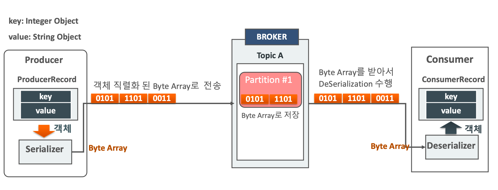
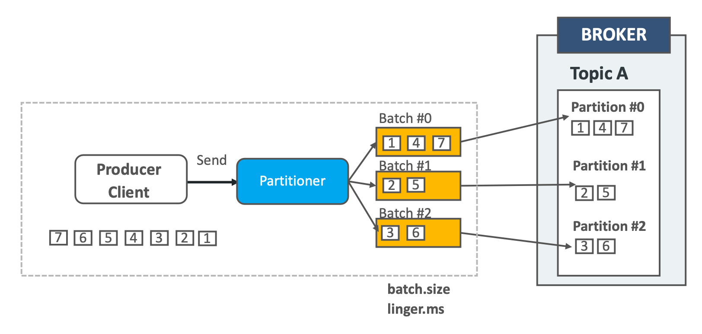
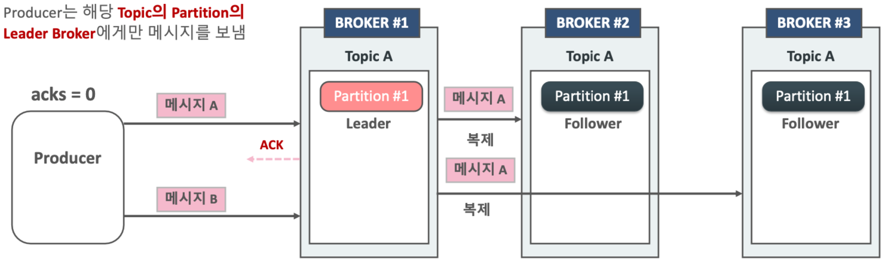
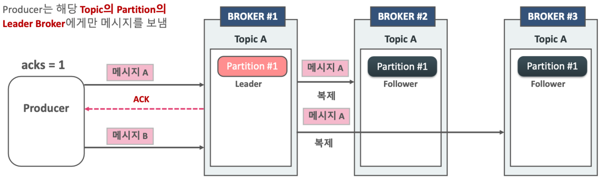
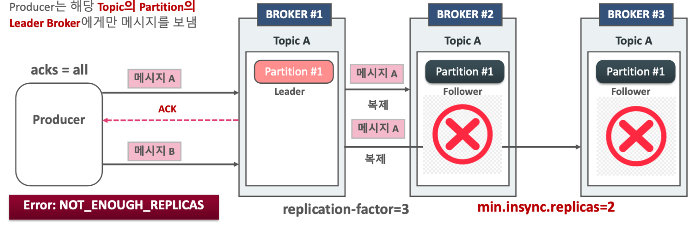
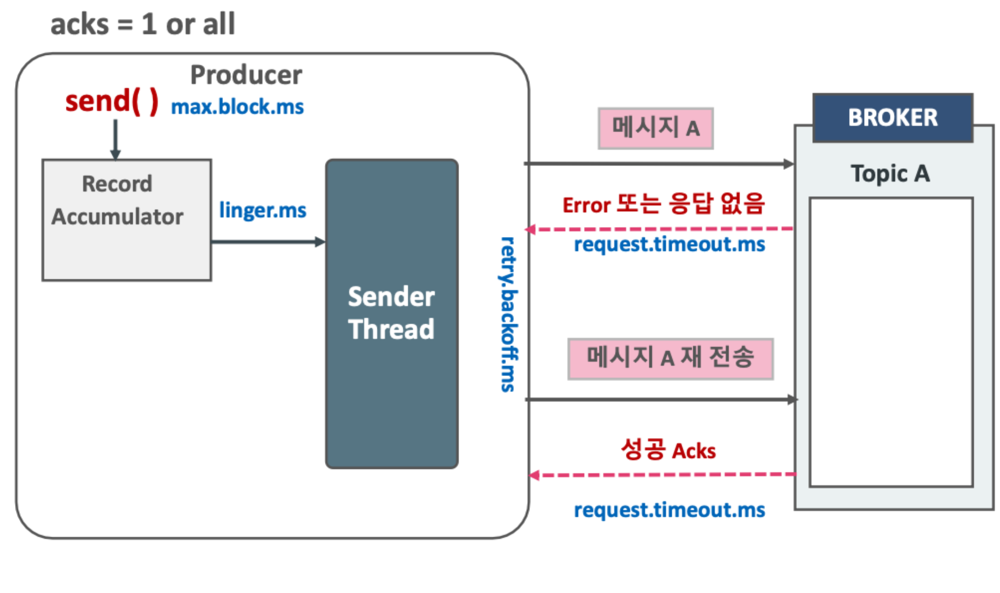
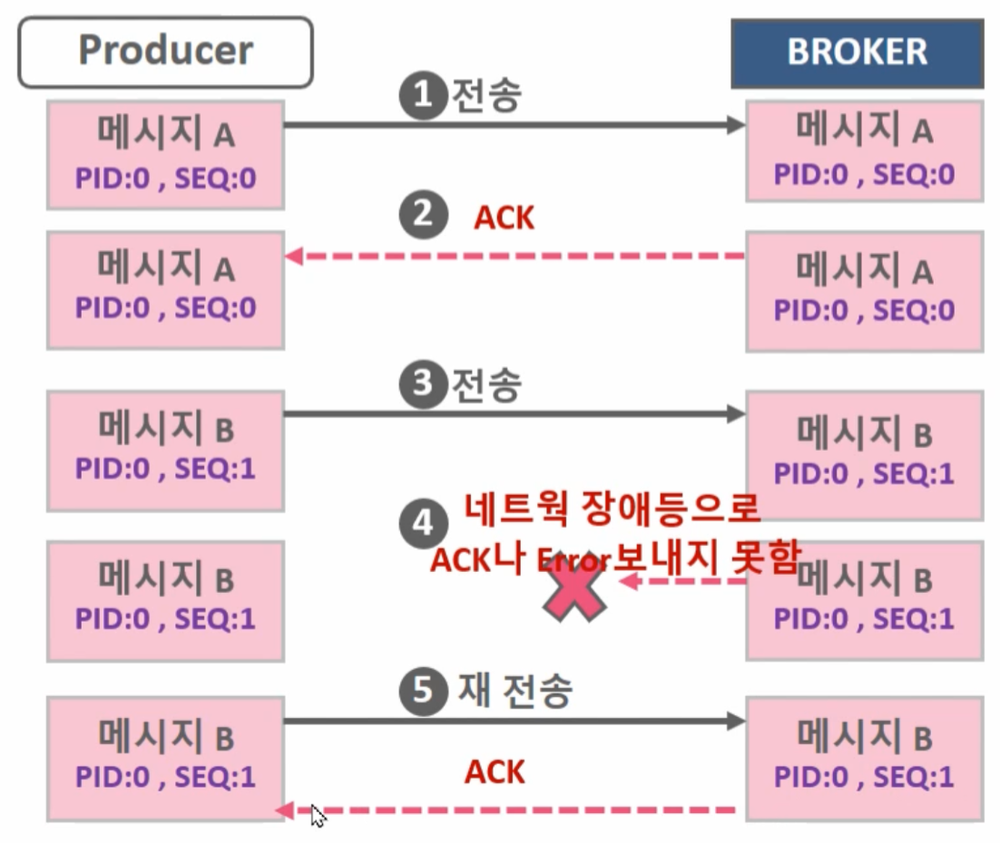

## 프로듀서 객체 직렬화 전송

프로듀서는 보내는 객체를 직렬화화여 바이트 배열 형태로 브로커로 전송합니다. 브로커는 파티션에 바이트 배열 형태로 저장하고 컨슈머는 바이트 배열을 받아서 역직렬화로 객체를 복원합니다.

## 메시지 키값 여부에 따른 전송

메시지 키의 사용 여부는 데이터 처리 순서와 관련이 있습니다. 카프카 프로듀서에서 브로커로 메시지를 보낼 때, 메시지 키를 지정할 수 있습니다. 메시지 키를 지정하지 않으면 스티키 파티셔닝(2.4버전 이후)방식으로 특정 파티션으로 전송되는 하나의 배치에 메시지를 빠르게 먼저 채워서 보냅니다. 이 경우에는 전송하는 대상 토픽이 파티션을 여러 개 가지고 있는 경우, **메시지의 전송 순서가 보장되지 않은 채로 컨슈머가 읽는 경우가 발생합니다.**

반면에 메시지 키를 사용하면 메시지 키를 사용하면 프로듀서가 토픽으로 데이터를 보낼 때 메시지 키를 해시 변환하여 메시지를 파티션에 매칭시킵니다. 따라서 메시지 키가 같다면 항상 같은 파티션으로 메시지가 전송되므로 순서를 보장할 수 있습니다. 하지만 파티션 개수가 달라지면 매칭이 깨지고 다른 파티션에 데이터가 할당되기 때문에 이때부터 컨슈머는 특정 메시지 키의 순서를 보장받지 못합니다. 즉, 메시지 키를 사용하고 처리 순서가 보장되어야 한다면 최대한 파티션의 변화가 발생하지 않는 방식으로 운영해야 합니다. 만약 파티션 개수가 변해야 하는 경우에는 기존에 사용하던 메시지 키의 매칭을 그대로 가져가기 위해 커스텀 파티셔너를 개발하고 적용해야 합니다. 이러한 어려움 때문에 보통 메시지 키별로 처리 순서를 보장하기 위해서는 파티션 개수를 프로듀서가 전송하는 데이터양보다 더 넉넉하게 잡고 생성하는 것이 권장됩니다. 반면에 처리 순서가 관계 없다면 처음부터 넉넉하게 잡지 않아도 됩니다.

## 프로듀서 내부 배치 전송 구조

> ProducerRecord -> send 호출 -> Partitioner -> Accumulator 내부에 토픽별로 배치를 만들어 저장 -> sender -> 카프카 클러스터

프로듀서는 카프카 브로커로 데이터를 전송할 때 내부적으로 파티셔너를 통해 배치 생성 단계를 거칩니다. 프로듀서 인스턴스 생성 시 파티셔너를 따로 설정하지 않는다면 기본값인 DefaultPartitioner로 설정되어 전송되는 파티션이 정해집니다. 파티셔너에 의해 구분된 레코드는 데이터를 전송하기 전에 Accumulator에서 데이터를 버퍼로 쌓아놓고 버퍼로 쌓인 데이터는 배치로 묶여서 전송됩니다.

## 프로듀서 주요 옵션

+ 필수 옵션
    - bootstrap.servers
        - 프로듀서가 데이터를 전송할 대상 카프카 클러스터에 속한 브로커의 '호스트 이름:포트' 를 1개 이상 작성합니다.
        - 2개 이상 브로커 정보를 입력하여 일부 브로커에 이슈가 발생하더라도 접속하는 데에 이슈가 없도록 설정할 수 있습니다.
    - key.serializer
        - 레코드 메시지 키 직렬화 클래스를 지정합니다.
    - value.serializer
        - 레코드 메시지 값을 직렬화 클래스를 지정합니다.
+ 선택 옵션
    - acks
        - 프로듀서가 전송한 데이터가 브로커들에 정상적으로 저장되었는지 전송 성공 여부 확인에 사용하는 옵션으로 0,1,-1(all)로 구성됩니다.
        - 1(기본값) : 리더 파티션에 데이터가 저장되면 전송 성공으로 판단
        - 0 : 프로듀서가 전송한 즉시 브로커에 데이터 저장 여부와 상관없이 성공으로 판단
        - -1 또는 all : min, insync, replicas 개수에 해당하는 리더 파티션과 팔로워 파티션에 데이터가 저장되면 성공으로 판단
    - min.insync.replicas
        - acks옵션과 연관된 옵션을 브로커가 프로듀서로 ack 응답을 보내기 위한 리더가 확인해야할 최소 replicas 개수를 지정
        - replicas가 3개로 구성되어 있고 acks가 all이더라도 이 옵션이 1로 되어있다면 리더만 메시지를 수신해도 조건이 충족되어 ack를 응답
    - buffer.memory
        - 브로커로 전송할 데이터를 배치로 모으기 위해 설정할 버퍼 메모리 양을 지정합니다.
        - 기본값은 32MB
    - retries
        - 프로듀서가 브로커로부터 에러를 받고 난 뒤 재전송을 시도하는 횟수를 지정합니다.
        - 기본값은 2147483647
    - batch.size
        - 배치로 전송할 레코드 최대 용량을 지정합니다.
        - 기본값은 16384
        - 클라이언트에 장애가 발생하면 배치 내 있던 메시지는 전달되지 않기 때문에 고가용성이 필요한 경우라면 배치 사이즈를 주지 않는 것도 방법입니다.
    - linger.ms
        - 배치 전송하기 전까지 기다리는 최대 시간입니다.
        - 기본값 0
        - 배치형태의 메시지를 보내기 전에 추가적인 메시지들을 위해 기다리는 시간으로 배치 사이즈에 도달하면 이 시간과 관계없이 메시지를 즉시 전송하고 배치 사이즈에 도달하지 못한 상황에서 이 시간만큼 도달했을 경우, 메시지를 전송합니다.
    - partitioner.class
        - 레코드를 파티션에 전송할 때 적용하는 파티셔너 클래스를 지정합니다.
        - 기본값은 DefaultPartitioner
    - enable.idempotence
        - 멱등성 프로듀서로 동작할지 여부를 설정합니다.
        - 기본값은 false
    - transaction.id
        - 프로듀서가 레코드를 전송할 때 레코드를 트랜잭션 단위로 묶을지 여부를 설정합니다.
        - 프로듀서의 고유한 트랜잭션 아이디를 설정할 수 있습니다.
        - 이 값을 설정하면 트랜잭션 프로듀서가 동작하고 기본값은 null입니다.
    - max.reqeust.size
        - 프로듀서가 보낼 수 있는 최대 메시지 바이트 사이즈입니다.
        - 기본값은 1MB
    - max.in.flight.requests.per.connection
        - 비동기 전송 시 브로커의 응답없이 한번에 보낼 수 있는 배치의 개수
        - 기본값은 5

### ISR(In-Sync-Replicas)
ISR은 리더 파티션과 팔로워 파티션이 모두 싱크된 상태를 뜻합니다. 예를 들어 복제 개수가 2인 토픽에서 리더 파티션에 오프셋이 [0,3]까지 있고 팔로워 파티션에 [0,2]까지 있으면 동기화가 완벽하게 된 상태가 아닙니다. 팔로워 파티션도 [0,3]까지 있어야 ISR입니다. ISR 용어가 나온 이유는 팔로워 파티션이 리더 파티션으로부터 데이터를 복제하는 데에 시간이 걸리기 때문입니다. 리더 파티션에 데이터가 적재된 이후 팔로워 파티션이 복제하는 시간차 때문에 리더 파티션과 팔로워 파티션 간에 오프셋 차이가 발생하게 되고 이런 차이를 모니터링하기 위해 리더 파티션은 replica.lag.time.max.ms 의 주기를 가지고 팔로워 파티션이 데이터를 복제하는지 확인합니다. 해당 시간보다 더 긴 시간 동안 데이터를 가져가지 않는다면 해당 팔로워 파티션에 문제가 생긴 것으로 판단하고 ISR 그룹에서 제외합니다. ISR로 묶인 파티션은 모두 동일한 데이터가 존재하기 때문에 팔로워 파티션은 리더로 선출될 자격을 가지게 됩니다. 따라서 리더 파티션에 문제가 생기면 ISR 그룹에 속한 파티션 중 하나가 리더 파티션으로 승격됩니다. ISR 이외의 파티션도 리더로 선출 자격을 부여하고 싶다면 unclean.leader.election.enable 값을 true로 주면 됩니다. 다만 false로 설정하면 장애 발생 시 ISR에 남아있는 파티션이 없다면 브로커가 다시 실행될 때까지 서비스가 중단됩니다.

### acks 옵션
카프카 프로듀서의 acks 옵션은 0, 1, all(또는 -1) 값을 가질 수 있습니다. 이 옵션을 통해 프로듀서가 전송한 데이터가 카프카 클러스터에 얼마나 신뢰성 높게 저장할지 지정할 수 있습니다.

**acks=0**

프로듀서가 리더 파티션으로 데이터를 전송했을 때 리더 파티션으로 데이터가 저장되었는지 확인하지 않는다는 뜻입니다. 리더 파티션은 데이터가 저장된 이후에 데이터가 몇 번째 오프셋에 저장됐는지 리턴하는데, 이에 대해 응답을 받지 않는다는 의미입니다. 이때는 프로듀서가 전송 하자마자 데이터가 저장되었음을 가정하고 다음으로 넘어가기 때문에 데이터 전송 실패여부를 알 수 없기에 retries 옵션값도 무의미합니다. 덕분에 전송 속도는 가장 빠르고 데이터가 일부 유실되더라도 전송속도가 중요한 경우 사용합니다.

**acks=1**

프로듀서가 보낸 데이터가 리더 파티션에만 정상적으로 적재되었는지 확인합니다. 적재되지 않았다면 재시도할 수 있습니다. 리더 파티션에 적재됐음을 보장하더라도 데이터는 유실될 수 있습니다. 복제 개수가 2이상이라면 팔로워 파티션에 데이터가 복제되기 직전에 리더 파티션에 문제가 발생하면 동기화되지 못한 일부 데이터가 유실되기 때문입니다.

**acks=all 또는 acks=-1**

프로듀서가 보낸 데이터가 리더 파티션과 팔로워 파티션에 모두 정상적으로 적재되었는지 확인합니다. 따라서 일부 브로커에 장애가 발생하더라도 안전하게 전송, 저장을 보장하지만 앞선 옵션에 비해 느립니다. all로 설정한 경우에는 토픽 단위로 설정 가능한 min.insync.replicas 옵션값에 따라 데이터의 안전성이 달라집니다. all은 모든 리더 파티션과 팔로워 파티션의 적재를 뜻하는 것은 아니고 ISR에 포함된 파티션들을 뜻하는 것이기 때문입니다. min.insync.replicas 옵션은 프로듀서가 리더 파티션과 팔로워 파티션에 적재되었는지 확인하기 위한 최소 ISR그룹의 파티션 개수 입니다.

예를 들어, min.insync.replicas가 1이라면 ISR 중 최소 1개 이상의 파티션에 데이터가 적재되었음을 확인하는 것입니다. 이 경우 acks를 1로 했을 때와 동일한 동작을 하는데 ISR 중 가장 처음 적재가 완료되는 파티션은 리더 파티션이기 때문입니다. 따라서 min.insync.replicas 를 2이상으로 설정했을 때부터 acks=all 설정이 의미가 있어집니다. 2로 둔다면 적어도 리더 파티션과 1개의 팔로워 파티션에 데이터가 적재되었음을 보장합니다. min.insync.replicas를 설정할 때는 복제 개수도 함께 고려해야 합니다. 예를 들어 복제 개수를 3으로 설정하고 min.insync.replicas를 3으로 설정하게 된다면, 브로커 1대가 이슈가 발생하게 되면 브로커가 2개만 남는데 min.insync.replicas는 최소한 3개 복제를 보장해야하기 때문에 동작하지 못하게 됩니다. **즉, min.insync.replicas옵션은 반드시 브로커 개수 미만으로 설정해서 운영해야 합니다.** 상용 환경에서는 브로커를 3대 이상으로 묶어서 클러스터를 구성하게 되는데 가장 안정적인 방식은 토픽 복제 개수는 3, min.insync.replicas는 2로 설정하고 프로듀서는 acks=all로 설정하는 것을 권장합니다.

## 전송과 재전송 매커니즘

record accumulator과 꽉 차있는 상태일 경우 send 메시지를 보내지 못할 경우가 있습니다. 이때는 max.block.ms 옵션 만큼 기다리게 되고 이후에도 보내지 못하면 timeout exception이 발생합니다. 

sender Thread는 record Accumulator에서 배치별로 가지가기 위한 최대 대기시간(linger.ms)동안 대기하고 보냅니다. 그리고 브로커로부터 응답을 request.timeout.ms 만큼 기다립니다. request.timeout.ms 초과 시에도 응답이 오지 않는다면 재시도하거나 timeout exception이 발생합니다. 재시도가 필요하다면 retry.backoff.ms 시간만큼 재시도 전에 대기하고 재시도합니다. deliver.timeout.ms는 producer 메시지 전송에 허용된 최대 시간인데 이보다 더 오래걸리면 재시도를 하지 않고 timeout exception을 보낸다. 따라서 **delivery.timeout.ms >= linger.ms + request.timeout.ms**가 성립해야 한다.

## 중복 없이 전송(idempotence)

프로듀서에서 데이터를 전송하고 브로커에서 데이터를 잘 받았으나 ack 응답이 네트워크 장애 등으로 인해 유실되었을 경우, 프로듀서는 브로커부터 ack 응답을 받지 못했기 때문에 재시도를 수행할 수 있습니다. 이 경우에 브로커에 중복된 메시가 전송되는 이슈가 발생하게 됩니다. 이를 해결하기 위해 프로듀서는 브로커로 메시지를 전송할 때 producerId(PID)와 sequence를 Header에 저장하여 전송합니다. 메시지 Sequence는 메시지 고유한 번호이고 0부터 시작하여 순차적으로 증가하나 producer가 기동시마다 새롭게 생성됩니다. 이를 활용하여 브로커에서는 메시지 sequence가 중복되면 메시지를 기록하지 않고 ack만 응답하게 됩니다. 

idempotence를 위한 프로듀서에는 enable.idempotence=true, acks=all, retries는 0보다 큰값, max.in.flight.requests.per.connection는 1에서 5사이 값으로 해야합니다.

## 트랜잭션 프로듀서
트랜잭션 프로듀서는 다수의 파티션에 데이터를 저장할 경우 모든 데이터에 대해 동일한 원자성(atomic)을 만족시키기 위해 사용됩니다. 원자성을 만족시킨다는 의미는 다수의 데이터를 동일 트랜잭션으로 묶음으로써 전체 데이터를 처리하거나 전체 데이터를 처리하지 않도록 하는 것을 의미합니다. 컨슈머는 기본적으로 파티션에 쌓이는 대로 모두 가져가서 처리합니다. 하지만 트랜잭션으로 묶인 데이터를 브로커에서 가져갈 때는 다르게 동작하도록 설정할 수 있습니다. 트랜잭션 프로듀서를 사용하려면 enable.idempotence를 true로 설정하고 transactional.id를 임의의 String 값으로 정의합니다. 그리고 컨슈머의 isolation.level을 read_committed로 설정하면 프로듀서와 컨슈머는 트랜잭션으로 처리 완료된 데이터만 쓰고 읽게 됩니다.

트랜잭션 프로듀서는 사용자가 보낸 데이터를 레코드로 파티션에 저장할 뿐만 아니라 트랜잭션의 사작과 끝을 표현하기 위해 트랜잭션 레코드를 한 개 더 보냅니다. 트랜잭션 컨슈머는 파티션에 저장된 트랜잭션 레코드를 보고 트랜잭션이 완료(commit)되었음을 확인하고 데이터를 가져갑니다. 만약 데이터만 존재하고 트랜잭션 레코드가 존재하지 않으면 아직 트랜잭션이 완료되지 않았다고 판단하고 컨슈머는 데이터를 가져가지 않습니다. 트랜잭션 레코드는 실질적인 데이터는 가지고 있지 않고 트랜잭션이 끝난 상태를 표기하는 정보만 가지고 있습니다. 대신 레코드의 특성은 그대로 가지고 있어 오프셋 하나를 차지합니다.

## 성능 튜닝 파라미터

+ 메모리 사용량
    + buffer.memory
        - Record accumulator의 전체 메모리 사이즈
        - 32 MB
+ record batch size, 압축
    + batch.size
        - 단일 배치의 사이즈
        - 기본 16KB
    + compression.type
        - 기본 none, gzip, snappy, lz4, zdt 옵션이 존재
        - 압축은 데이터를 배치에 모아 일괄로 처리하므로 얼마나 효율적으로 배치를 구성했는지에 따라 압축률이 달라진다.
+ request size
    - max.request.size
        - 요청의 최대 크기(바이트)프로듀서가 단일 요청으로 전송할 레코드 배치 수
        - 기본 1MB
    - acks
        - 지정시간에 request 에 대한 완료(ack) 회신 방식으로 성능이 떨어져도 보통 all을 권장
        - acks = 0 : 응답 없이 동작(가장 빠름, 유실확률 높음)
        - acks = 1 : Leader write 완료 시 회신, follower의 복제 여부는 확인하지 않음(중간 속도, 중간 유실 정도)
        - acks = all(-1) : 최소 ISR(in-sync-replicas)수까지 복제 완료시 회신(가장 느림, 유실 확률 낮음)
+ request connection
    + linger.ms
        - sender thread로 메시지를 보내기 전 배치로 메시지를 만들어서 보내기 위한 최대 대기시간
        - 기본 0ms
    + max.in.flight.requests.per.connection
        - sender thread가 파티션별로 한번에 전송할 수 있는 배치의 개수
        - 기본 5
        - 값을 넘어가면 블로킹된다.
        - 1보다 큰 설정 시, 전송 실패에 재시도로 인해 메시지 순서가 변경될 수 있다.
            - 기본값에 의해 5개가 넘어갔는데 중간에 몇개가 실패하면 그것들이 재시도되면서 순서가 바뀐다.
    + send.buffer.bytes
        - 카프카 프로듀서가 브로커 서버와 통신할 때 사용하는 소켓의 TCP 버퍼 크기를 의미한다.
        - 기본 128KB
        - -1로 설정 시 운영체제의 기본 설정값을 사용
