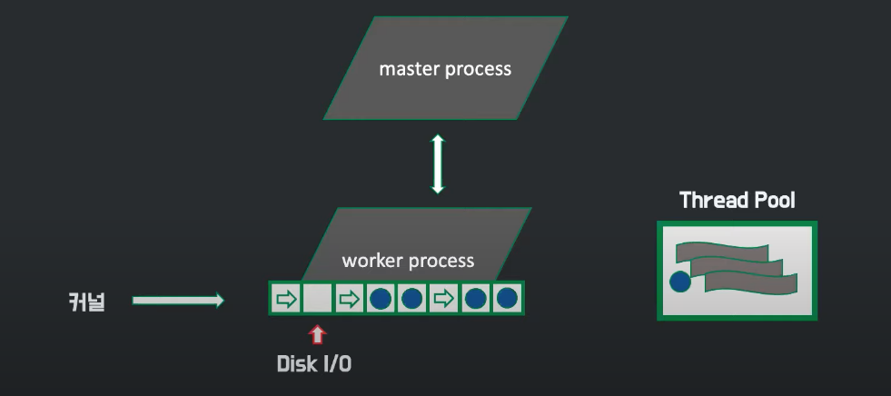

## NginX란?
NginX는 웹 서버이며, 리버스 프록시, 로드 밸런서, HTTP 캐시로 등으로 쓰일 수 있는 소프트웨어 입니다. 요청에 응답하기 위해 이벤트 기반 구조를 채택하여 자원을 효율적으로 사용합니다.

## 등장 배경

최초의 웹서버 NCSA에 수많은 버그로 인해 이를 보완한 아파치 서버가 등장합니다. 아파치 서버는 요청이 들어오면 커넥션을 형성하기 위해 프로세스를 생성하는 방식으로 새로운 클라이언트 요청이 들어올 때마다 새로운 프로세스를 생성합니다. 프로세스를 만드는 작업은 오래 걸리므로 미리 프로세스를 만들어 놓는 prefork 방식을 사용합니다. 만약 미리 만들어 놓은 프로세스가 모두 할당되었다면 추가로 프로세스를 만들게 됩니다. 이런 구조로 인해 개발자는 다양한 모듈을 만들어 빠르게 기능을 추가할 수 있게 되었고 동적 콘텐츠도 처리할 수 있게 되었습니다. 또한 확장성이 좋다는 장점 때문에 요청을 받고 응답하는 과정을 하나의 서버에서 처리하기도 좋아지면서 아파치가 대세로 자리잡습니다.

 

아파치 서버가 대세가 되었을 당시에는 서버가 처리해야할 요청량이 그 당시 감당할 수 있을 정도였습니다. 트래픽이 점점 증가하면서 서버에 동시에 연결된 커넥션이 많아졌을 때 더 이상 커넥션을 형성하지 못하는 문제가 발생하게 되었습니다. 이를 C10K라고 하고 커넥션 10000개의 문제라고 합니다. 동시에 연결된 커넥션 수란 요청을 처리하기 위해 서버가 한 시점에 얼마나 많은 클라이언트와 커넥션을 형성하는지를 나타냅니다.  

 

문제는 아파치 서버의 구조였습니다. 아파치 서버는 구조상 커넥션이 형성될 때마다 새로운 프로세스를 할당하기 때문에 동시에 처리하는 커넥션이 많아지면 그만큼 형성되는 프로세스가 많아지는 것이고 이는 메모리 부족 현상으로 이어지게 됩니다. 그리고 아파치 서버는 여러 가지 기능을 쉽게 추가할 수 있는 특징으로 인해 특정 프로세스가 차지하는 리소스의 양이 늘어나게 됩니다. 또한, 많은 커넥션에서 요청이 들어오기 시작하면 CPU 코어는 계속해서 프로세스를 바꿔가며 작업하는 컨텍스트 스위칭 비용이 커지게 됩니다. 따라서 수많은 동시 커넥션을 감당하기에는 아파치 서버의 구조가 적합하지 않았던 것입니다.

 

이러한 구조를 보완한 nginx가 등장합니다. 초창기에는 아파치 서버와 함께 사용하기 위해 만들어졌습니다. 아파치 서버의 구조적 한계를 극복하기 위해 아파치 서버 앞에 두면서 기존에 아파치 서버가 감당했던 수많은 동시커넥션을 엔진엑스가 받도록 하는 것입니다. 엔진엑스는 웹서버이기 때문에 정적인 처리는 스스로했고, 동적 파일 요청을 받았을 때만 아파치 서버와 커넥션을 만들어 처리했습니다. 아파치의 리소스를 커넥션 유지에 쓰지 않고 실제 로직 처리에 사용하도록 하는 구조로 말입니다.

 

엔진엑스는 마스터 프로세스에서 설정파일을 읽고 설정에 맞게 워커 프로세스를 생성하고 워커 프로세스는 실제로 일을 하게 됩니다. 워커 프로세스는 클라이언트로부터 요청이 들어오면 커넥션을 생성하고 Keep-Alive 시간만큼 커넥션을 유지하면서 요청을 처리합니다. 그런데 커넥션이 형성되었다고 해서 워커 프로세스가 커넥션을 하나만 담당하진 않습니다. 형성된 커넥션에 아무런 요청이 없으면 새로운 커넥션을 형성하거나 이미 만들어진 다른 커넥션으로부터의 요청을 처리합니다. 엔진엑스에서는 이런 커넥션 형성, 커넥션 제거, 새로운 요청을 처리하는 것을 이벤트라고 부릅니다.

 

이벤트들은 OS 커널을 통해 큐형식으로 워커 프로세스에게 전달됩니다. 이벤트는 큐에서 워커 프로세스가 처리할 때까지 비동기 방식으로 대기합니다. 워커 프로세스는 하나의 스레드로 이벤트를 꺼내서 처리하게 되면서 쉬지 않고 일하는 장점을 가져가게 됩니다. 아파치 서버 구조와 비교했을때 요청이 없다면 방치되는 프로세스보다 훨씬 효율적으로 서버자원을 쓰는 셈입니다. 만약 요청중 하나가 시간이 오래걸리는 작업이라면 시간이 오래걸리는 작업을 따로 수행하는 쓰레드풀을 만들어 놓고 오래걸리는 작업은 스레드풀에게 이벤트를 위임하고 다음 이벤트를 수행합니다.

 

보통 워커 프로세스는 cpu 의 코어개수만큼 생성합니다. 이러면 코어가 담당하는 프로세스를 바꾸는 횟수를 대폭 줄일 수 있습니다. 즉, cpu가 컨텍스트 스위칭 사용을 줄일 수 있게 되는 것입니다. 이것이 엔진엑스가 채택한 이벤트 기반 구조로 아파치 서버와 가장 큰 차이점입니다.

 

프로세스를 적게 만드는 구조는 엔진엑스의 설정을 동적으로 바꾸는 것을 가능하게 했습니다. 개발자가 설정파일을 변경하고 엔진엑스에 해당 설정을 적용하면 마스터 프로세스는 그 설정에 맞는 워커 프로세스를 따로 생성하고 기존 워커 프로세스가 더이상 커넥션을 형성하지 않도록 합니다. 시간이 지나 기존 워커 프로세스가 담당하던 이벤트 처리가 끝나면 해당 프록세스를 종료합니다. 대표적으로 엔진엑스가 동시 커넥션을 관리하는 도중에 뒷단에 서버를 추가하는 상황이 있습니다. 동적으로 설정을 변경할 수 있기 때문에 기존 요청을 처리하면서 설정을 변경하여 뒷단에 서버 추가 설정이 가능하게 됩니다.

 

이런 배경으로 NginX가 등장하게 되었습니다. APACHE도 동시 커넥션 관련 업데이트를 해오고 있지만 동시 커넥션 관련 지표에서는 NginX가 성능상 우세한 퍼포먼스를 보이고 있습니다. 동시 커넥션이라는 포인트에만 집중한다면 NginX가 우세하지만, 아파치와 NginX가 점유율을 다투는데는 다 이유가 있습니다. 아파치의 경우 오랜기간 업데이트로 서버 자체가 다양한 OS에서 안정적이라는 장점이 있지만, NginX는 그렇지 않아서 윈도우에서 제대로된 성능을 발휘하지 못합니다. 그리고 아파치는 모듈 추가에서 기능을 확장하기 쉽다는 장점과 모듈의 종류도 NginX보다 훨씬 많습니다. 

## 사용 용도
엔진엑스를 다음과 같은 용도로 많이 사용합니다.

* 웹서버 기능, 로드 밸런서, 캐싱, HSTS, HTTP/2, TCP/UDP 커넥션 부하분산, CORS 처리
* SSL 터미네이션 : 클라이언트와는 https 통신, 서버와는 http 통신하여 서버는 복호화 과정을 담당하지 않는 방식
