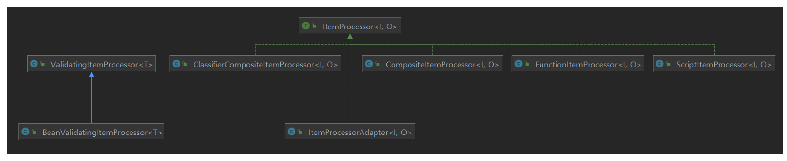
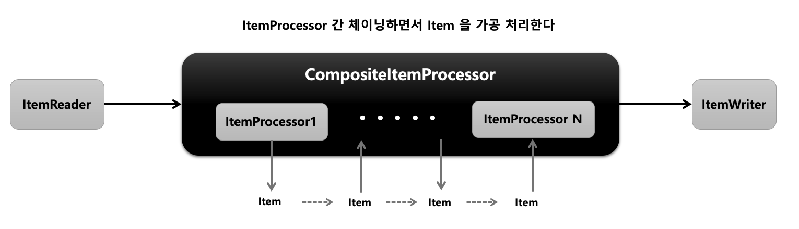
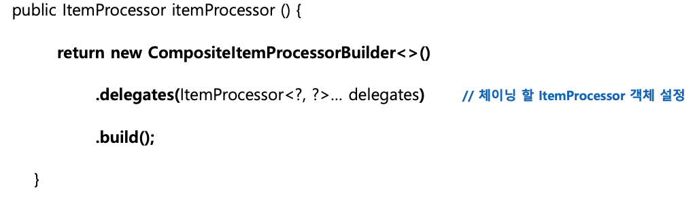

# Spring Batch - ItemProcessor


## ItemProcessor

+ __데이터를 출력하기 전에 데이터를 가공 및 필터링 역할을 하는 인터페이스__ 입니다.
+ ItemReader 및 ItemWriter와 분리되어 비즈니스 로직을 구현할 수 있습니다.
+ ItemReader로부터 받은 아이템을 특정 타입으로 변환해서 ItemWriter에 넘겨 줄 수 있습니다.
+ Itemreader로부터 받은 아이템들 중 필터과정을 거쳐서 원하는 아이템들만 ItemWriter로 넘겨줄 수 있습니다.
+ ChunkOrientedTasklet 실행 시 선택적 요소기 때문에 필수 요소는 아닙니다.
+ O process()
    - I 제네릭은 ItemReader에서 받을 데이터 타입
    - O 제네릭은 ItemWriter에게 보낼 데이터 타입
    - 아이템을 하나씩 가공 처리하며 null을 리턴할 경우 해당 아이템은 Chunk\<O>에 저장되지 않습니다.
+ ItemStream을 구현하지 않고 거의 대부분 Customizing해서 사용하기 때문에 기본적으로 제공되는 구현체가 적습니다.
+ __Null을 반환하면 해당 item은 ItemWriter로 전달되지 않습니다.__


<Br>

  
Processor는 대부분 직접 구현해서 사용하기 때문에 Writer와 Reader에 비해 상대적으로 적은 구현체들을 제공하고 있습니다.

<br>

## CompositeItemProcessor
  
ItemProcessor들을 연결(Chaining)해서 위임하면 각 ItemProcessor를 실행시킵니다. 이전의 ItemProcessor 반환 값은 다음 ItemProcessor 값으로 연결됩니다.

### API


### 예시
```java
@Configuration
@RequiredArgsConstructor
public class HelloJobConfiguration {
    private final JobBuilderFactory jobBuilderFactory;
    private final StepBuilderFactory stepBuilderFactory;
    private int chunkSize = 10;

    @Bean
    public Job helloJob() {
        return jobBuilderFactory.get("job")
                .start(step1())
                .incrementer(new RunIdIncrementer())
                .build();
    }

    @Bean
    public Step step1() {
        return stepBuilderFactory.get("step")
                .<String, String>chunk(chunkSize)
                .reader(customItemReader())
                .processor(customItemProcessor())
                .writer(items -> {
                    for (String item : items) {
                        System.out.println("item = " + item);
                    }
                })
                .build();
    }

    // 구성하는 프로세서 제네릭이 일치하므로 반환값 제네릭 사용 가능
    // 일치하지 않으면 제네릭 사용 불가
    @Bean
    public ItemProcessor<String, String> customItemProcessor() {
        List<ItemProcessor> processorList = new ArrayList<>();
        processorList.add(new CustomItemProcessor1());
        processorList.add(new CustomItemProcessor2());

        CompositeItemProcessor processor = new CompositeItemProcessor<>();
        processor.setDelegates(processorList);

        return processor;
    }


    @Bean
    public ItemReader<String> customItemReader() {
        return new ItemReader<String>() {
            int i = 0;

            @Override
            public String read() {
                i++;
                return i > 10 ? null : "item";
            }
        };
    }

}
-------------------------------------------------------
public class CustomItemProcessor1 implements ItemProcessor<String,String> {

    @Override
    public String process(String item) throws Exception {
        return item + " processor1";
    }
}
-------------------------------------------------------
public class CustomItemProcessor2 implements ItemProcessor<String,String> {
    @Override
    public String process(String item) throws Exception {
        return item + " processor2";
    }
}
```
간단하게 넘어온 아이템에 processor 번호를 붙이는 processor 2개를 만들고 CompositeItemProcessor를 사용해서 묶어서 하나의 Processor로 전달했습니다. CompositeItemProcessor를 구성하는 프로세서가 같은 제네릭 타입을 갖기 때문에 customItemProcessor 메서드의 반환값을 제네릭으로 세팅할 수 있었지만 구성하는 프로세서가 다른 제네릭 타입을 갖는다면 반환값에 제네릭을 세팅할 수 없습니다. 반환값이 다르다면 아래와 같이 세팅하면 됩니다. 

```java
@Bean
public CompositeItemProcessor compositeProcessor() {
    List<ItemProcessor> delegates = new ArrayList<>(2);
    delegates.add(processor1());
    delegates.add(processor2());

    CompositeItemProcessor processor = new CompositeItemProcessor<>();

    processor.setDelegates(delegates);

    return processor;
}
```


CompositeItemProcessor를 제외한 제공되는 다른 processor는 거의 사용할 일이 없고 보통 custom하게 직접 만들어서 사용합니다. 
