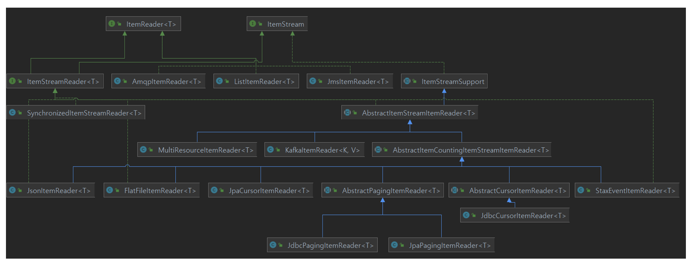
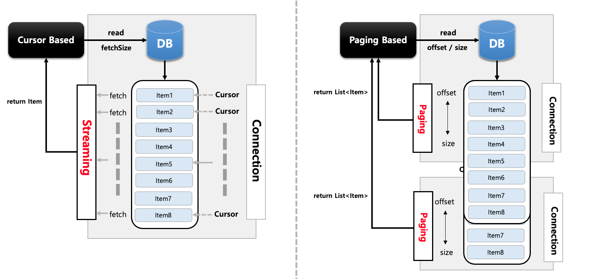
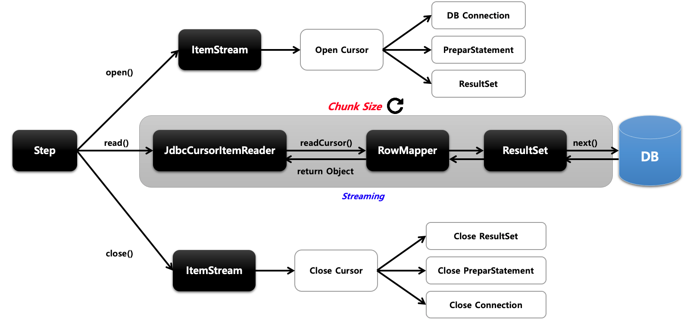
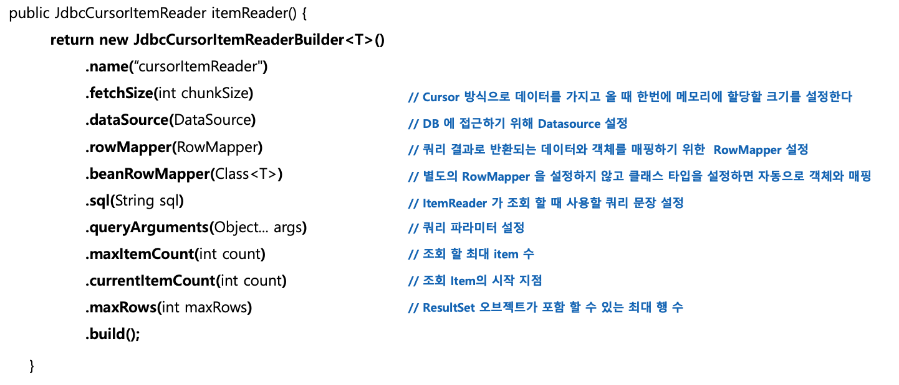
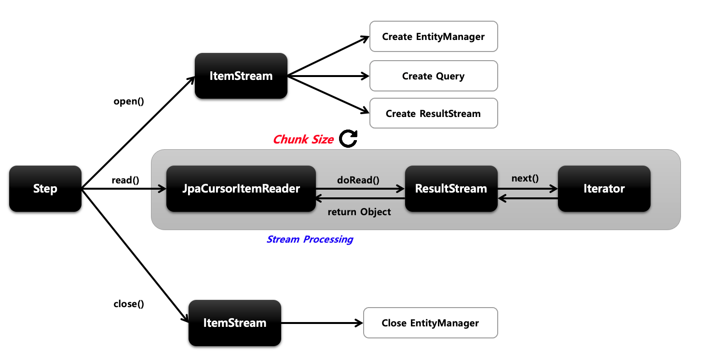
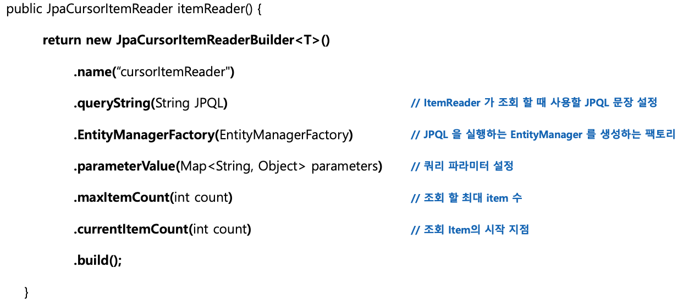
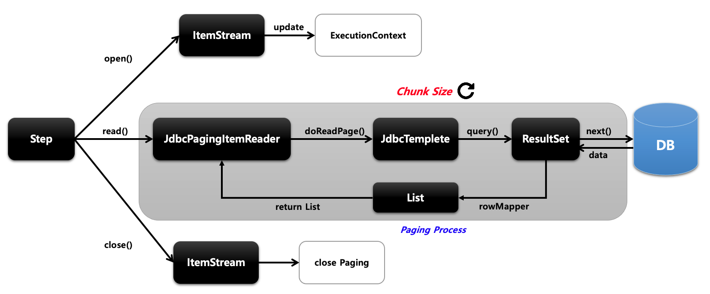
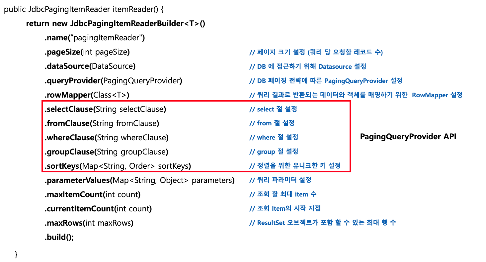
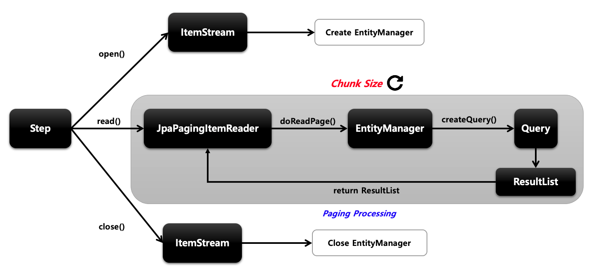
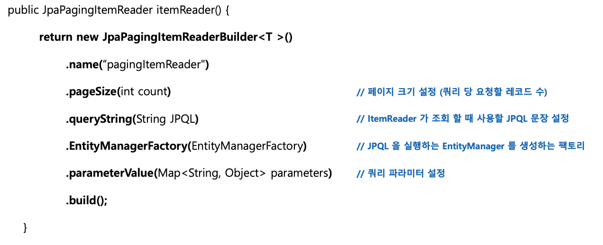

## ItemReader

```java
@FunctionalInterface
public interface ItemReader<T> {
    @Nullable
    T read() throws Exception, UnexpectedInputException, ParseException, NonTransientResourceException;

}
```
+ __itemReader는 다양한 입력으로부터 데이터를 읽어서 제공하는 인터페이스__ 입니다.
    - 플랫 파일 - csv, txt
    - XML, Json
    - Database
    - Message Queuing 서비스
    - Custom reader
+ 다수의 구현체들이 ItemReader와 ItemStream 인터페이스를 동시에 구현하고 있습니다.
    - ItemStream은 파일 스트림 연결 종료, DB 커넥션 연결 종료 등의 장치 초기화 등의 작업에 사용됩니다.
    - ExecutionContext에 read와 관련된 여러 가지 상태 정보를 저장해두고 재시작 시 참조됩니다.
+ ChunkOrientedTasklet 실행 시 필수적 요소로 설정해야 합니다.
+ T read()
    - 입력 데이터를 읽고 다음 데이터로 이동합니다.
    - 아이템 하나를 리턴하며 더 이상 아이템이 없는 경우 null 리턴합니다.
    - 아이템 하나는 파일의 한 줄, DB의 한 row, XML 파일에서 하나의 엘리먼트를 의미합니다.
    - 더 이상 처리해야 할 item이 없어도 예외가 발생하지 않고 itemProcessor와 같은 다음 단계로 넘어갑니다.
+ \<I,O>Chunk
    - I : Reader가 읽는 데이터 타입
    - O : Writer가 받은 데이터 타입

<Br>



위와 같이 다양한 구현체들을 제공하고 있습니다.

<br>

## Cursor 기반 & Paging 기반 이해하기
배치 애플리케이션은 실시간적 처리가 어려운 대용량 데이터를 다루며 이때 DB I/O의 성능 문제와 메모리 자원의 효율성 문제를 해결할 수 있어야 합니다. 스프링 배치에서는 대용량 데이터 처리를 위한 두 가지 해결방안을 제시하고 있습니다.

### Cursor 처리
JDBC ResultSet의 기본 메커니즘을 사용합니다. __현재 행에서 커서를 유지하며 다음 데이터를 호출하면 다음 행으로 커서를 이동하며 데이터 반환이 이뤄지는 Streaming 방식의 I/O 입니다.__ ResultSet이 open될 때마다 next 메서드가 호출되어 DataBase의 데이터 하나가 반환되고 객체와 매핑이 이뤄집니다. DB Connection이 연결되면 배치 처리가 완료될 때까지 Connection이 유지되기 때문에 DB와 SocketTimeout을 충분히 큰 값으로 설정해야 합니다. __모든 결과를 메모리에 할당하기 때문에 메모리 사용량이 많아지는 단점이 있습니다.__ Connection 연결 유지 시간과 메모리 공간이 충분하다면 대량의 데이터 처리에 적합할 수 있습니다.(fetchSize 조절로 한번에 가져올 수도 있습니다.)


### Paging 처리
__페이징 단위로 데이터를 조회하는 방식으로 Page Size만큼 한 번에 메모리로 가져온 다음 한 개씩 데이터를 읽는 방식입니다.__ 한 페이지를 읽을때마다 커넥션을 맺고 끊기를 반복하기 때문에 대량의 데이터를 처리하더라도 SocketTimeout 예외가 거의 발생하지 않습니다. 시작 행 번호를 지정하고 페이지에 반환시키고자 하는 행의 수를 지정한 후 사용합니다.(offest, limit) 페이징 단위의 결과만 메모리에 할당하기 때문에 메모리 사용량이 적어지는 장점이 있습니다. 따라서 커넥션 유지 시간이 길지 않고 메모리를 효율적으로 사용해야 하는 데이터 처리에 적합합니다.

### 비교


+ Cursor 기반
    - 기본적으로 데이터를 하나씩 처리(fetchSize를 이용해서 한번에 처리가 가능하긴 함)
    - 모든 데이터를 처리할 때까지 커넥션 유지
    - 모든 결과를 메모리에 할당
+ Paging 기반
    - Page Size만큼의 데이터를 한번에 처리
    - Page Size만큼의 처리를 할 때마다 커넥션을 맺고 끊음
    - 페이징 단위 결과만 메모리에 할당

<br>

## JdbcCursorItemReader
__Cursor 기반의 JDBC 구현체__ 로서 ResultSet과 함께 사용되며 Datasource에서 connection을 얻어와서 SQL을 실행합니다. Thread 안정성을 보장하지 않기 때문에 멀티 스레드 환경에서 사용할 경우 동시성 이슈가 발생하지 않도록 __동기화 처리를 별도로 진행__ 해야 합니다.

### 처리 과정


1. 커서를 오픈하면서 DB 커넥션 연결, PrepareStatement 생성, ResultSet 생성 등 준비 작업을 합니다.
2. JdbcCursorItemReader에서 데이터를 한건씩 가져오는 작업을 Chunk Size만큼 반복합니다.
3. 모든 배치 작업이 완료되고 더이상 읽을 데이터가 없어지면 커넥션 종료 등 리소스를 해제하고 작업을 종료합니다.


### API


### 예시
```java
@Slf4j
@Configuration
@RequiredArgsConstructor
public class HelloJobConfiguration {
    private final JobBuilderFactory jobBuilderFactory;
    private final StepBuilderFactory stepBuilderFactory;
    private final DataSource dataSource;
    private int chunkSize = 10;

    @Bean
    public Job helloJob() {
        return jobBuilderFactory.get("job")
                .start(step1())
                .incrementer(new RunIdIncrementer())
                .build();
    }

    @Bean
    public Step step1() {
        return stepBuilderFactory.get("step")
                .<Customer, Customer>chunk(chunkSize)
                .reader(customItemReader())
                .writer(customItemWriter())
                .build();
    }

    @Bean
    public ItemReader<Customer> customItemReader() {
        return new JdbcCursorItemReaderBuilder<Customer>()
                .name("jdbcCursorItemReader")
                .fetchSize(chunkSize)
                .sql("select id, name, age from customer where age >= ?")
                .beanRowMapper(Customer.class)
                .queryArguments(25)
                .dataSource(dataSource)
                .build();
    }

    @Bean
    public ItemWriter<Customer> customItemWriter() {
        return items -> {
            for (Customer item : items) {
                System.out.println("item = " + item.toString());
            }
        };
    }
}
```
DB에 Customer 객체를 100개 넣어두고 조건에 맞게 가져와서 출력하는 간단한 예시입니다.

<br>

## JpaCursorItemReader
__Cursor 기반의 JPA 구현체__ 로서 EntityManagerFactory 객체가 필요하여 쿼리는 JPQL을 사용합니다. Spring Batch 4.3버전부터 지원합니다.


### 처리 과정


1. open하는 과정에서 엔티티 매니저 생성, 작성한 JPQL을 실행시켜서 DB에서 값을 받아와서 ResultStream에 데이터를 담아놓습니다. 실상 open 작업에서 데이터를 가져오는 작업이 다 끝납니다.
2. JpaCursorItemReader는 ResultStream에서 이터레이터로 하나씩 데이터를 가져옵니다.
3. close에서는 EntityManager만 닫습니다.


### API


### 예시
```java
@Slf4j
@Configuration
@RequiredArgsConstructor
public class HelloJobConfiguration {
    private final JobBuilderFactory jobBuilderFactory;
    private final StepBuilderFactory stepBuilderFactory;
    private final EntityManagerFactory entityManagerFactory;
    private int chunkSize = 10;

    @Bean
    public Job helloJob() {
        return jobBuilderFactory.get("job")
                .start(step1())
                .incrementer(new RunIdIncrementer())
                .build();
    }

    @Bean
    public Step step1() {
        return stepBuilderFactory.get("step")
                .<Customer, Customer>chunk(chunkSize)
                .reader(customItemReader())
                .writer(customItemWriter())
                .build();
    }

    @Bean
    public ItemReader<Customer> customItemReader() {

        HashMap<String, Object> parameters = new HashMap<>();
        parameters.put("age",25);

        return new JpaCursorItemReaderBuilder<Customer>()
                .name("jpaCursorItemReader")
                .entityManagerFactory(entityManagerFactory)
                .queryString("select c from Customer c where age >=:age ") // JPQL -> 테이블명은 첫글자만 대문자
                .parameterValues(parameters)
                .build();
    }

    @Bean
    public ItemWriter<Customer> customItemWriter() {
        return items -> {
            for (Customer item : items) {
                System.out.println("item = " + item.toString());
            }
        };
    }
}
```
<Br>

## JdbcPagingItemReader
Paging 기반의 JDBC 구현체로 쿼리에 시작 행 번호(offset)와 페이지에서 변환할 행수(limit)를 지정해서 SQL을 실행합니다. 스프링 배치에서 offset과 limit을 PageSize에 맞게 자동으로 생성해 주며 페이징 단위로 데이터를 조회할 때마다 새로운 쿼리가 실행됩니다. 페이지 마다 새로운 쿼리를 실행하기 때문에 페이징 시 결과 데이터의 순서가 보장될 수 있도록 __order by 구문이 필수__ 입니다. __멀티 스레드 환경에서 Thread 안정성을 보장__ 하기 때문에 별도의 동기화 처리가 필요하지 않습니다.

### PagingQueryProvider
쿼리 실행에 필요한 쿼리문을 ItemReader에게 제공하는 클래스입니다. 데이터베이스마다 페이징 전략이 다르기 때문에 각 데이터 베이스 유형마다 다른 PaingQueryProvider을 사용하게 되는데 이는 DataSource 설정 값을 보고 자동으로 선택합니다. Select, from, sortKey는 필수로 설정해야 합니다.

### 동작 과정


1. open에서 update로 ExecutionContext에 상태정보를 업데이트 합니다.
2. JdbcPagingItemReader에서 JdbcTemplate을 이용해 쿼리를 날리고 페이지 사이즈 만큼 데이터를 가져옵니다.(커넥션 얻고 종료)
3. 이 과정을 청크 사이즈만큼 반복합니다.(보통 청크 사이즈와 페이징 사이즈를 일치시키는 것을 권장합니다.)
4. 더이상 처리할 것이 없으면 종료하게 됩니다.

### API


queryProvider가 제공된다면 위의 빨간 박스 내용은 작성하지 않아도 됩니다.

### 예시
```java
@Slf4j
@Configuration
@RequiredArgsConstructor
public class HelloJobConfiguration {
    private final JobBuilderFactory jobBuilderFactory;
    private final StepBuilderFactory stepBuilderFactory;
    private final DataSource dataSource;
    private int chunkSize = 10;

    @Bean
    public Job helloJob() throws Exception {
        return jobBuilderFactory.get("job")
                .start(step1())
                .incrementer(new RunIdIncrementer())
                .build();
    }

    @Bean
    public Step step1() throws Exception {
        return stepBuilderFactory.get("step")
                .<Customer, Customer>chunk(chunkSize)
                .reader(customItemReader())
                .writer(customItemWriter())
                .build();
    }

    @Bean
    public ItemReader<Customer> customItemReader() throws Exception {

        Map<String, Object> parameters = new HashMap<>();
        parameters.put("age",25);

        return new JdbcPagingItemReaderBuilder<Customer>()
                .name("jdbcPagingItemReader")
                .pageSize(10)
                .dataSource(dataSource)
                .rowMapper(new BeanPropertyRowMapper<>(Customer.class))
                .queryProvider(createQueryProvider()) // 쿼리 생성
                .parameterValues(parameters) // 파라미터 입력
                .build();
    }

    @Bean
    public PagingQueryProvider createQueryProvider() throws Exception {
        Map<String, Order> sortKeys = new HashMap<>();
        sortKeys.put("id", Order.ASCENDING);

        // 쿼리 생성
        SqlPagingQueryProviderFactoryBean queryProvider = new SqlPagingQueryProviderFactoryBean();
        queryProvider.setDataSource(dataSource);
        queryProvider.setSelectClause("id,name,age"); // select 절
        queryProvider.setFromClause("from customer"); // from 절
        queryProvider.setWhereClause("where age > :age"); // where 절
        queryProvider.setSortKeys(sortKeys); // order by 절

        return queryProvider.getObject();
    }

    @Bean
    public ItemWriter<Customer> customItemWriter() {
        return items -> {
            for (Customer item : items) {
                System.out.println("item = " + item.toString());
            }
        };
    }
}
```

<br>

## JpaPagingItemReader
__Paging 기반의 JPA 구현체__ 로 EntityManagerFactory 객체가 필요하며 쿼리는 JPQL을 사용합니다.

### 동작 과정

1. open에서 엔티티 매니저를 생성합니다.
2. JpaPagingItemReader에서 엔티티 매니저로를 사용해 쿼리를 날려 데이터를 가져옵니다.(커넥션 얻고 종료)
3. 이 과정을 청크 사이즈 만큼 반복합니다.
4. 더이상 읽을 데이터가 없으면 엔티티 매니저를 종료합니다.


### API



### 예시
```java
@Slf4j
@Configuration
@RequiredArgsConstructor
public class HelloJobConfiguration {
    private final JobBuilderFactory jobBuilderFactory;
    private final StepBuilderFactory stepBuilderFactory;
    private final EntityManagerFactory entityManagerFactory;
    private int chunkSize = 10;

    @Bean
    public Job helloJob() {
        return jobBuilderFactory.get("job")
                .start(step1())
                .incrementer(new RunIdIncrementer())
                .build();
    }

    @Bean
    public Step step1() {
        return stepBuilderFactory.get("step")
                .<Customer, Customer>chunk(chunkSize)
                .reader(customItemReader())
                .writer(customItemWriter())
                .build();
    }

    @Bean
    public ItemReader<Customer> customItemReader() {

        Map<String, Object> parameters = new HashMap<>();
        parameters.put("age",25);

        return new JpaPagingItemReaderBuilder<Customer>()
                .name("jpaPagingItemReader")
                .entityManagerFactory(entityManagerFactory)
                .pageSize(10)
                .queryString("select c from Customer c where age >= :age order by c.id")
                .parameterValues(parameters)
                .build();
    }


    @Bean
    public ItemWriter<Customer> customItemWriter() {
        return items -> {
            for (Customer item : items) {
                System.out.println("item = " + item.toString());
            }
        };
    }
}
```
<br>

## ItemReaderAdapter
이미 존재하는 DAO나 다른 서비스를 ItemReader 안에서 사용하고자 할 때 위임하는 역할을 합니다.
```java
@Slf4j
@Configuration
@RequiredArgsConstructor
public class HelloJobConfiguration {
    private final JobBuilderFactory jobBuilderFactory;
    private final StepBuilderFactory stepBuilderFactory;
    private int chunkSize = 10;

    @Bean
    public Job helloJob() {
        return jobBuilderFactory.get("job")
                .start(step1())
                .incrementer(new RunIdIncrementer())
                .build();
    }

    @Bean
    public Step step1() {
        return stepBuilderFactory.get("step")
                .<String, String>chunk(chunkSize)
                .reader(customItemReader())
                .writer(customItemWriter())
                .build();
    }

    @Bean
    public ItemReader<String> customItemReader() {

        ItemReaderAdapter<String> reader = new ItemReaderAdapter<>();
        reader.setTargetObject(customerService()); // 클래스 이름
        reader.setTargetObject("customRead"); // 메서드 명
        return reader;
    }


    @Bean
    public ItemWriter<String> customItemWriter() {
        return items -> {
            for (String item : items) {
                System.out.println("item = " + item.toString());
            }
        };
    }
}
```
ItemReaderAdapter를 이용해서 클래스의 이름과 메서드명을 명시하면 해당 메서드가 Reader의 역할을 하게 됩니다.

<br>

## Page Size와 Chunk Size를 일치해야 하는 이유
Chunk Size가 50이고 Page Size가 10이라고 가정했을 때, Chunk Size를 채우기 위해 5번의 Read가 발생합니다. 5번의 Read가 발생한 뒤에 itemProcessor로 넘기게 되는데 itemProcessor에서 만약 item의 LazyLoading이 발생한다면 이때 문제가 생깁니다. __이유는 5번의 Read가 발생하는 동안 각각 트랜잭션이 초기화되기 때문입니다.__ __이 문제는 Page Size와 Chunk Size를 일치시키면 해결할 수 있습니다.__


