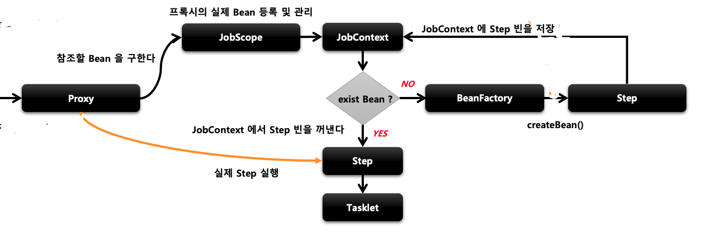

## @JobScope와 @StepScope
Scope는 스프링 컨테이너에서 빈이 관리되는 범위를 의미합니다. JobScope와 StepScope는 Job과 Step의 빈 생성과 실행에 관여하는 스코프입니다. __프록시 모드__ 를 기본값으로 하기 때문에 애플리케이션 구동 시점에는 프록시 빈이 생성되고 실행 시점에 실제 빈 생성이 이뤄집니다. 이를 통해 빈의 실행 시점에 값을 참조할 수 있는 일종의 Lazy Binding이 가능해집니다. 스코프를 사용하게 되면 @Value를 사용하여 아래와 같이 인자로 주입받을 수 있게 됩니다.

- @Value("#{jobParameters[파라미터명]}")
- @Value("#{jobExecutionContext[파라미터명]}")
- @Value("#{stepExecutionContext[파라미터명]}")


## 아키텍처

1. @JobScope가 붙어서 프록시로 생성된 Step에 요청이 들어옵니다.
2. 프록시는 JobScope의 JobContext에서 실제 타겟 빈이 존재하는지 확인합니다.
3. 있으면 찾아서 반환합니다.
4. 없으면 빈 팩토리에서 실제 Step빈을 생성하고 JobContext에 담고 이를 반환합니다.

+ 프록시 객체 생성
  - @JobScope, @StepScope 애노테이션이 붙은 빈 선언은 내부적으로 프록시 빈 객체가 생성되어 등록됩니다.
  - Job 실행 시 Proxy 객체가 실제 빈을 호출해서 해당 메서드를 실행시키는 구조 입니다.
+ JobScope, StepScope
  - Proxy 객체의 실제 대상이 되는 Bean을 등록, 해제하는 역할을 하는 클래스입니다.
  - 실제 대상이 되는 빈을 저장하고 있는 JobContext, StepContext를 갖고 있습니다.
  - Job의 실행 시점에 프록시 객체는 실제 빈을 찾기 위해서 JobScope, StepScope의 JobContext, StepContext를 찾게 됩니다.


## scope를 통해 인자를 주입받는 이유
+ 표현식 언어를 통해 유연하고 편리하게 주입받아 파라미터로 사용할 수 있게 됩니다.
  - StepContribution에서 일일이 원하는 값을 꺼내서 사용하지 않아도 됩니다.
+ Step 빈 생성이 구동시점이 아닌 런타임 시점에 생성되어 객체의 지연 로딩이 가능해집니다.
  - 이 덕분에 위에 표현식을 사용할 수 있는 것입니다.
  - 표현식으로 작성한 값들은 컴파일 시점에 존재하지 않고 런타임 시점에 채워지면서 존재하게 되는 값입니다.
  - 만약 빈이 애플리케이션 로딩 시점에 만들어진다면 DI를 해야하는데 해당 값들이 현재 존재하지 않기 때문에 찾을 수가 없습니다.
  - 하지만 런타임 시점에 빈을 만들게 되면 값을 다 받아놓고(표현식에 명시한 값들) 빈을 만들기 때문에 주입이 가능하게 됩니다.
+ 병렬 처리시에 각 스레드마다 Step 객체가 생성되어 할당되기 때문에 Tasklet에 멤버 변수가 존재해도 동시성에 문제가 없습니다.

보통은 런타임 시에 주입받는 JobParameters를 손쉽게 처리하기 위한 목적으로 사용됩니다.

## JobScope
+ Step 선언문에 붙입니다.
+ @Value로 JobParameter과 JobExectionContext만 사용 가능합니다.

## StepScope
+ Tasklet이나 ItemReader, ItemWriter, ItemProcessor 선언문에 붙입니다.
+ @Value로 JobParameter, JobExecutionContext, StepExecutionContext 사용 가능합니다.


## 예시
```java
@Configuration
@RequiredArgsConstructor
public class Test2Config {
    private final JobBuilderFactory jobBuilderFactory;
    private final StepBuilderFactory stepBuilderFactory;

    @Bean
    public Job helloJob() {
        return jobBuilderFactory.get("job")
                .start(step1(null)) // 런타임시 주입받을 것이므로 현재는 null로 주입
                .listener(new CustomJobListener())
                .build();
    }

    @Bean
    @JobScope
    public Step step1(@Value("#{jobParameters['message']}") String message) {
        System.out.println("message = " + message);
        return stepBuilderFactory.get("step1")
                .tasklet(tasklet(null,null)) // 런타임 시 주입되므로 null 
                .listener(new CustomStepListener())
                .build();
    }

    @Bean
    @StepScope
    public Tasklet tasklet(@Value("#{jobExecutionContext['name']}") String name,
                           @Value("#{stepExecutionContext['name2']}") String name2){
        return (stepContribution, chunkContext) -> {
            System.out.println("name = " + name);
            System.out.println("name2 = " + name2);
            return RepeatStatus.FINISHED;
        };
    }
}
```
```java
public class CustomJobListener implements JobExecutionListener {
    @Override
    public void beforeJob(JobExecution jobExecution) {
        jobExecution.getExecutionContext().putString("name","user1");
    }

    @Override
    public void afterJob(JobExecution jobExecution) {

    }
}
```
```java
public class CustomStepListener implements StepExecutionListener {
    @Override
    public void beforeStep(StepExecution stepExecution) {
        stepExecution.getExecutionContext().putString("name2","user2");
    }

    @Override
    public ExitStatus afterStep(StepExecution stepExecution) {
        return null;
    }
}
```
@Value를 통해서 주입되는 값들을 런타임 시에 제공하기 때문에 컴파일 시점에 에러를 없애기 위해 null로 값을 채워줘야 합니다. 리스너를 통해서 name, name2 값을 넣어주었고, 실행 시점에 intellij IDE의 Configuration을 통해서 arguments로 message=message로 주고 실행시키면 주입한 값이 정상적으로 찍히게 됩니다.

