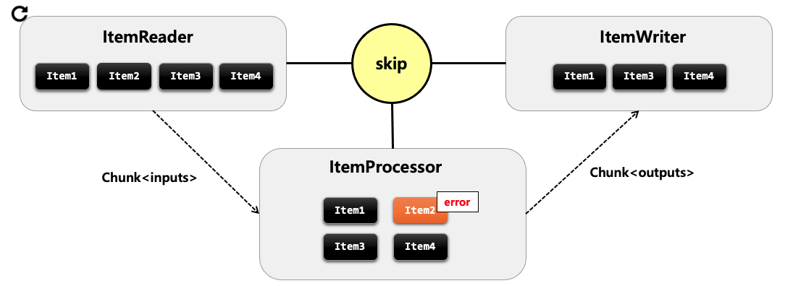

## Repeat
+ 스프링 배치는 특정 조건이 충족될 때까지 Job 또는 Step을 반복하도록 배치 애플리케이션을 구성할 수 있습니다.
+ 스프링 배치에서는 Step과 Chunk의 반복을 RepeatOperation을 사용해 처리하고 있습니다.
+ 기본 구현체로 RepeatTemplate을 제공합니다.

**구조**


Step은 RepeatTemplate을 사용해 Tasklet을 반복적으로 실행합니다. ChunkOrientedTasklet은 내부적으로 ChunkProvider를 통해 ItemReader로 데이터를 읽어올 것을 지시합니다. ChunkProvider는 내부적으로 RepeatTemplate을 갖고 있고 이를 이용해 반복적으로 ItemReader에게 반복적으로 데이터를 읽어오도록 처리합니다.

<br>

## FaultTolerant
스프링 배치는 Job 실행 중에 오류가 발생할 경우 장애를 처리하기 위한 기능을 제공합니다. 오류가 발생해도 Step이 즉시 종료되지 않고 Retry 혹은 Skip 기능을 활성화 함으로 내결함성 서비스가 가능합니다. 

+ Skip
    - ItemReader, ItemProcessor, ItemWriter에 적용 가능
+ Retry
    - ItemProcessor, ItemWriter에 적용 가능

<Br>

### API


### Skip
+ Skip은 데이터를 처리하는 동안 설정된 Exception이 발생했을 경우, 해당 데이터 처리를 건너뛰는 기능입니다.
+ ItemReader, ItemProcessor, ItemWriter에 적용 가능합니다.
+ 데이터의 사소한 오류에 대해 Step의 실패처리 대신 Skip함으로써, 배치수행의 빈번한 실패를 줄일 수 있습니다.

#### 동작 방식


+ itemReader
    - item을 한건씩 읽다가 예외가 발생하게 되면 해당 item을 skip하고 다음 item을 읽습니다.
+ itemProcessor
    - itemProcessor는 item을 처리하다가 예외가 발생하면 해당 Chunk의 첫 단계로 돌아가서 itemReader로부터 다시 데이터를 받습니다.
    - 이때 itemReader에서 실제로 데이터를 다시 읽는 것은 아니고 캐시에 저장한 아이템을 다시 사용해서 itemProcessor로 다시 보내줍니다.
    - itemProcessor는 다시 아이템들을 받아서 실행하게 되는데 도중에 이전에 실행에서 예외가 발생했던 정보가 내부적으로 남아있기 때문에 위의 그림처럼 item2의 차례가 오면 처리하지 않고 넘어갑니다.
    - 결론적으로 skip하는 건 맞는데 itemReader와 동작 방식이 다릅니다.
+ itemWriter
    - 위 그림에서 Writer에서 item4번에서 예외가 발생했다면 다시 Chunk 단위로 ItemReader로 돌아갑니다.
    - 캐싱된 데이터로 itemReader는 itemProcessor로 넘깁니다.
    - itemProcessor는 이전처럼 청크 단위만큼 item을 처리하고 한번에 writer로 넘기는게 아니라 단건 처리후 writer로 단건을 넘깁니다. 


#### 예시 : itemReader Skip
```java
@Configuration
@RequiredArgsConstructor
public class HelloJobConfiguration {
    private final JobBuilderFactory jobBuilderFactory;
    private final StepBuilderFactory stepBuilderFactory;
    private int chunkSize = 5;

    @Bean
    public Job helloJob() {
        return jobBuilderFactory.get("job")
                .start(step1())
                .incrementer(new RunIdIncrementer())
                .build();
    }

    @Bean
    public Step step1() {
        return stepBuilderFactory.get("step")
                .<String, String>chunk(chunkSize)
                .reader(customItemReader())
                .writer(items -> System.out.println("items = " + items))
                .faultTolerant()
                .skip(SkippableException.class)                
                .skipLimit(4)
                .build();
    }

    @Bean
    public ItemReader<String> customItemReader() {
        return new ItemReader<String>() {
            int i = 0;

            @Override
            public String read() throws SkippableException {
                i++;
                if (i==3){
                    throw new SkippableException("skip exception");
                }
                System.out.println("itemReader : " + i);
                return i > 20 ? null : String.valueOf(i);
            }
        };
    }
}
```
3번째 데이터를 읽을 때 SkippableException 예외가 터지지만 4번까지 허용하므로 skip하고 진행됩니다. 청크 사이즈가 5이기 때문에 첫 번째 읽기 작업에서는 1,2,4,5,10 이 다음 작업으로 넘어갑니다. skip에 체이닝으로 .skip을 연달아서 사용하여 여러 개의 Exception을 등록할 수도 있습니다.

#### 예시 : itemProcessor Skip
```java
@Configuration
@RequiredArgsConstructor
public class HelloJobConfiguration {
    private final JobBuilderFactory jobBuilderFactory;
    private final StepBuilderFactory stepBuilderFactory;
    private int chunkSize = 5;

    @Bean
    public Job helloJob() {
        return jobBuilderFactory.get("job")
                .start(step1())
                .incrementer(new RunIdIncrementer())
                .build();
    }

    @Bean
    public Step step1() {
        return stepBuilderFactory.get("step")
                .<String, String>chunk(chunkSize)
                .reader(customItemReader())
                .processor(customItemProcessor1())
                .writer(items -> System.out.println("items = " + items))
                .faultTolerant()
                .skip(SkippableException.class)
                .skipLimit(3)
                .build();
    }

    @Bean
    public ItemReader<String> customItemReader() {
        return new ItemReader<String>() {
            int i = 0;

            @Override
            public String read() throws SkippableException {
                i++;
                System.out.println("itemReader : " + i);
                return i > 5 ? null : String.valueOf(i);
            }
        };
    }

    @Bean
    public ItemProcessor<? super String, String> customItemProcessor1() {
        return item -> {
            System.out.println("itemProcessor " + item);

            if (item.equals("3")) {
                throw new SkippableException("Process Failed ");

            }
            return item;
        };
    }
    
}
---------------------------------------------------------------------------
// 출력
itemReader : 1
itemReader : 2
itemReader : 3
itemReader : 4
itemReader : 5
itemProcessor 1
itemProcessor 2
itemProcessor 3
itemProcessor 1
itemProcessor 2
itemProcessor 4
itemProcessor 5
items = [1, 2, 4, 5]
itemReader : 10
```
itemProcessor 부분에서 3번째 아이템에서 예외가 발생합니다. itemReader는 캐싱된 데이터를 읽어서 다시 itemProcessor로 넘기기 때문에 출력이 찍히지 않습니다. 

#### 예시 : itemWriter Skip
```java
@Configuration
@RequiredArgsConstructor
public class HelloJobConfiguration {
    private final JobBuilderFactory jobBuilderFactory;
    private final StepBuilderFactory stepBuilderFactory;
    private int chunkSize = 5;

    @Bean
    public Job helloJob() {
        return jobBuilderFactory.get("job")
                .start(step1())
                .incrementer(new RunIdIncrementer())
                .build();
    }

    @Bean
    public Step step1() {
        return stepBuilderFactory.get("step")
                .<String, String>chunk(chunkSize)
                .reader(customItemReader())
                .processor(customItemProcessor1())
                .writer(customItemWriter())
                .faultTolerant()
                .skip(SkippableException.class)
                .skipLimit(3)
                .build();
    }

    @Bean
    public ItemReader<String> customItemReader() {
        return new ItemReader<String>() {
            int i = 0;

            @Override
            public String read() throws SkippableException {
                i++;
                System.out.println("itemReader : " + i);
                return i > 5 ? null : String.valueOf(i);
            }
        };
    }

    @Bean
    public ItemProcessor<? super String, String> customItemProcessor1() {
        return item -> {
            System.out.println("itemProcessor " + item);
            return item;
        };
    }

    @Bean
    public ItemWriter<? super String> customItemWriter() {
        return items -> {
            for (String item : items) {
                if (item.equals("4")){
                    throw new SkippableException("4");
                }
            }
            System.out.println("items = " + items);
        };
    }

    
}
------------------------------------------------------------
// 출력 결과
itemReader : 1
itemReader : 2
itemReader : 3
itemReader : 4
itemReader : 5
itemProcessor 1
itemProcessor 2
itemProcessor 3
itemProcessor 4
itemProcessor 5
itemProcessor 1
items = [1]
itemProcessor 2
items = [2]
itemProcessor 3
items = [3]
itemProcessor 4
itemProcessor 5
items = [5]
itemReader : 10
```
예외가 발생하고 난 후 itemProcessor는 itemWriter로 리스트가 아니라 한건씩만 보내서 처리하고 있는 것을 확인할 수 있습니다.


### Retry
+ ItemProcessor, ItemWriter에서 설정된 Exception이 발생했을 때, 지정한 정책에 따라 데이터 처리를 재시도하는 기능입니다.
+ **ItemReader에서는 지원하지 않습니다.**
+ 예외 발생 시 재시도 설정에 의해서 해당 Chunk의 처음부터 다시 시작합니다.
+ __Retry Count는 Item마다 각각 가지고 있습니다.__
+ RetryLimit 횟수 이후에도 재시도가 실패한다면 __recover__ 에서 후속작업을 처리할 수 있습니다.

#### 동작 방식


기존에는 itemProcessor와 itemWriter는 ChunkProcessor에서 실행이 되었지만, Retry 기능이 활성화되면 RetryTemplate 안에서 ItemProcessor와 itemWriter가 실행됩니다. 예외가 발생하면 RetryTemplate 안에서 처리가 진행이 됩니다. itemProcessor에서 예외가 발생하면 다시 Chunk 단계의 처음부터 시작합니다. skip과 마찬가지로 itemReader는 캐시에 저장된 값을 itemProcessor에 전달합니다. itemWriter에서 skip의 경우에는 단건 처리로 변경되었지만 retry의 경우에는 원래대로 다건 처리 형태가 유지됩니다.


#### 예시 : retry Writer
```java
@Configuration
@RequiredArgsConstructor
public class HelloJobConfiguration {
    private final JobBuilderFactory jobBuilderFactory;
    private final StepBuilderFactory stepBuilderFactory;
    private int chunkSize = 5;

    @Bean
    public Job helloJob() {
        return jobBuilderFactory.get("job")
                .start(step1())
                .incrementer(new RunIdIncrementer())
                .build();
    }

    @Bean
    public Step step1() {
        return stepBuilderFactory.get("step")
                .<String, String>chunk(chunkSize)
                .reader(customItemReader())
                .processor(customItemProcessor1())
                .writer(customItemWriter())
                .faultTolerant()
                .retry(RetryableException.class)
                .retryLimit(2)
                .build();
    }

    @Bean
    public ItemReader<String> customItemReader() {
        return new ItemReader<String>() {
            int i = 0;

            @Override
            public String read() throws SkippableException {
                i++;
                System.out.println("itemReader : " + i);
                return i > 5 ? null : String.valueOf(i);
            }
        };
    }


    @Bean
    public ItemProcessor<? super String, String> customItemProcessor1() {
        return item -> {
            System.out.println("itemProcessor : " + item);

            return item;
        };
    }


    @Bean
    public ItemWriter<? super String> customItemWriter() {
        return items -> {
            for (String item : items) {
                if (item.equals("4")){
                    throw new RetryableException("4");
                }
            }
            System.out.println("items = " + items);
        };
    }
}
------------------------------------------------
// 출력 결과
itemReader : 1
itemReader : 2
itemReader : 3
itemReader : 4
itemReader : 5
itemProcessor : 1
itemProcessor : 2
itemProcessor : 3
itemProcessor : 4
itemProcessor : 5
itemProcessor : 1 // retryCount 1
itemProcessor : 2
itemProcessor : 3
itemProcessor : 4
itemProcessor : 5 
itemProcessor : 1 // retryCount 2 이제 더이상 재시작 못함
```
itemWriter 4번째 Item을 처리할 때 예외가 터지게 되지만 retry 옵션에 의해 재시도 하게 됩니다. itemReader에서는 캐시한 데이터를 사용하기에 콘솔에 찍히지 않습니다. Writer에서 예외로 재시작되어도 Processor에서 한개씩 보내지 않고 List로 한번에 보내서 처리하게 됩니다. retryLimit이 2이므로 2번 재시작이 가능하고 3세트 진행 도중에 retryLimit 범위를 넘어가기 때문에 예외가 발생합니다.

#### 예시 : retry Processor
```java
@Configuration
@RequiredArgsConstructor
public class HelloJobConfiguration {
    private final JobBuilderFactory jobBuilderFactory;
    private final StepBuilderFactory stepBuilderFactory;
    private int chunkSize = 5;

    @Bean
    public Job helloJob() {
        return jobBuilderFactory.get("job")
                .start(step1())
                .incrementer(new RunIdIncrementer())
                .build();
    }

    @Bean
    public Step step1() {
        return stepBuilderFactory.get("step")
                .<String, String>chunk(chunkSize)
                .reader(customItemReader())
                .processor(customItemProcessor1())
                .writer(customItemWriter())
                .faultTolerant()
                .retry(RetryableException.class)
                .retryLimit(2)
                .build();
    }

    @Bean
    public ItemReader<String> customItemReader() {
        return new ItemReader<String>() {
            int i = 0;

            @Override
            public String read() throws SkippableException {
                i++;
                System.out.println("itemReader : " + i);
                return i > 5 ? null : String.valueOf(i);
            }
        };
    }

    @Bean
    public ItemProcessor<? super String, String> customItemProcessor1() {
        return item -> {


            if (item.equals("4")) {
                throw new RetryableException("Process Failed ");
            }
            System.out.println("itemProcessor : " + item);

            return item;
        };
    }

    @Bean
    public ItemWriter<? super String> customItemWriter() {
        return items -> {
            System.out.println("items = " + items);
        };
    }
}
-------------------------------------------
// 출력 결과
itemReader : 1
itemReader : 2
itemReader : 3
itemReader : 4
itemReader : 5
itemProcessor : 1
itemProcessor : 2
itemProcessor : 3
itemProcessor : 1 // retryCount 1
itemProcessor : 2
itemProcessor : 3
itemProcessor : 1 // retryCount 2
itemProcessor : 2
itemProcessor : 3
```
itemProcessor에서는 4번째 Item을 처리할 때 예외가 터지게 되지만 retry 옵션에 의해 재시도 하게 됩니다. itemReader에서는 캐시한 데이터를 사용하기에 콘솔에 찍히지 않습니다. 결과적으로 3세트 진행 도중에 retryLimit 범위를 넘어가기 때문에 예외가 발생합니다.

#### 예시 : retry + skip
위의 예시들처럼 예외가 발생했을 때 해당 아이템을 Skip하고 재시도하고 싶을 수 있습니다. 이때는 Skip과 함께 사용하면 됩니다.
```java
@Bean
public Step step1() {
    return stepBuilderFactory.get("step")
            .<String, String>chunk(chunkSize)
            .reader(customItemReader())
            .processor(customItemProcessor1())
            .writer(customItemWriter())
            .faultTolerant()
            .retry(RetryableException.class)
            .retryLimit(2)
            .skip(RetryableException.class)
            .skipLimit(2)
            .build();
}

// 출력
itemReader : 1
itemReader : 2
itemReader : 3
itemReader : 4
itemReader : 5
itemProcessor : 1
itemProcessor : 2
itemProcessor : 3
itemProcessor : 1 // retryCount 1
itemProcessor : 2
itemProcessor : 3
itemProcessor : 1 // retryCount 2
itemProcessor : 2
itemProcessor : 3 // 4에서 3번째 예외가 터지면 recover로 skip되고 다음 item으로 넘어간다. -> skipLimit Count 1
itemProcessor : 5
items = [1, 2, 3, 5]
```
바로 위의 예시코드에서 step1에 skip관련 코드만 추가한 코드입니다. itemProcessor 처리과정에서 아이템 4번에서 예외가 발생했습니다. retryLimit이 2이므로 2번의 RetryableException가 허용되어 2세트 동안 재시작 처리되고 3세트에서는 여전히 4번째에서 예외가 터져서 종료되는게 정상입니다. __하지만 위 코드에서는 RetryableException가 2번 터지고 3세트에서 예외가 터지면 recover 코드로 들어가 skip이 동작합니다.__ recover코드로 진입하여 여기서 해당 item을 skip 처리하고 skipCount를 1올리고 해당 item을 제외하고 바로 다음 처리로 넘어갑니다. 따라서, 1,2,3,4,5가 아니라 1,2,3,5를 처리하게 됩니다. 만약 Writer에서 2번 예외가 발생해서 3회차에 skip처리까지 온다면 3회차 과정에서는 writer 일괄 처리 없이 processor 1개 처리, writer 1개 처리하는 방식으로 진행됩니다.


#### 예시 : item마다 갖는 retry Count
```java
@Configuration
@RequiredArgsConstructor
public class HelloJobConfiguration {
    private final JobBuilderFactory jobBuilderFactory;
    private final StepBuilderFactory stepBuilderFactory;
    private int chunkSize = 5;

    @Bean
    public Job helloJob() {
        return jobBuilderFactory.get("job")
                .start(step1())
                .incrementer(new RunIdIncrementer())
                .build();
    }

    @Bean
    public Step step1() {
        return stepBuilderFactory.get("step")
                .<String, String>chunk(chunkSize)
                .reader(customItemReader())
                .processor(customItemProcessor1())
                .writer(items -> System.out.println("items = " + items))
                .faultTolerant()
                .retry(RetryableException.class)
                .retryLimit(2)
                .skip(RetryableException.class)
                .skipLimit(4)
                .build();
    }

    @Bean
    public ItemReader<String> customItemReader() {
        return new ItemReader<String>() {
            int i = 0;

            @Override
            public String read() throws RetryableException {
                i++;
                return i > 5 ? null : String.valueOf(i);
            }
        };
    }

    @Bean
    public ItemProcessor<? super String, String> customItemProcessor1() {
        return item -> {

          System.out.println("itemProcessor : " + item);
            if (item.equals("2") || item.equals("4")) {
                throw RetryableException("Process Failed ");
            } else {
              System.out.println("itemProcessor : " + item);

              return item;
            }
        };
    }
}
--------------------------------
// 출력 결과
itemReader = 1
itemReader = 2
itemReader = 3
itemReader = 4
itemReader = 5
itemProcessor : 1
itemProcessor : 1 // item 2 재시도 1회
itemProcessor : 1 // item 2 재시도 2회 , 재시도 횟수 끝 -> skip 처리 (1회)
itemProcessor : 3
itemProcessor : 1 // item 4 재시도 1회
itemProcessor : 3
itemProcessor : 1 // item 4 재시도 2회 
itemProcessor : 3 
itemProcessor : 5 // item 4 재시도 횟수 끝 -> skip 처리 (2회)
items : [1, 3, 5]        
```
위 코드는 item이 2,4일 경우 RetryableException이 발생합니다. 즉, RetryableException이 retryLimit으로 작성한 2보다 더 많이 발생합니다. 하지만 Retry Count는 item마다 갖고 있기 때문에 item마다 카운트 됩니다. 따라서 item 2는 재시도 2회 후 skip 처리되고, item 4보다 재시도 2회 후 skip 처리됩니다. 결과적으로 skip 카운트는 최대 4인데 2회만 발생하므로 정상 종료됩니다.

