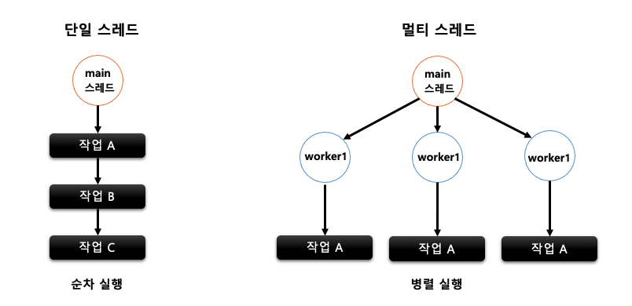
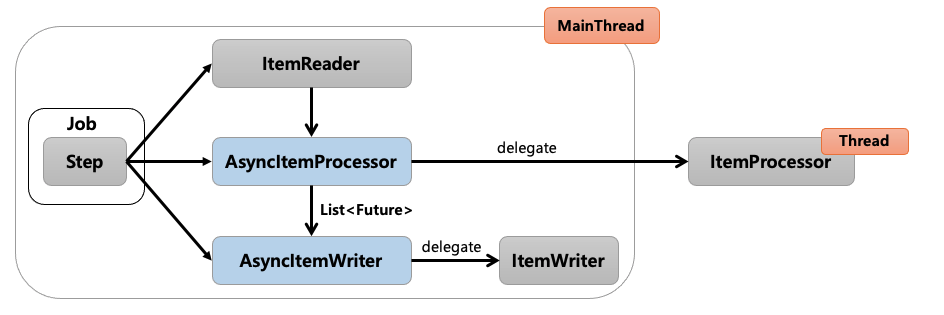
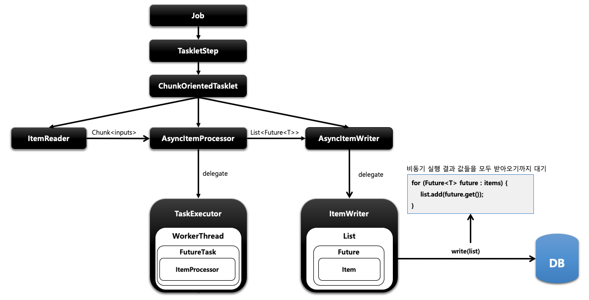
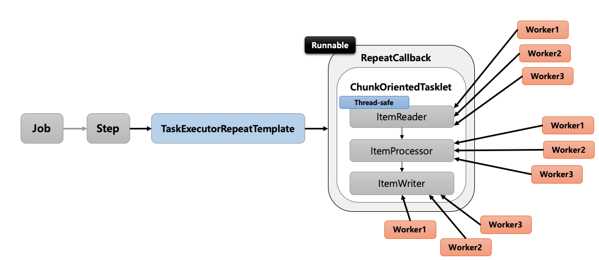
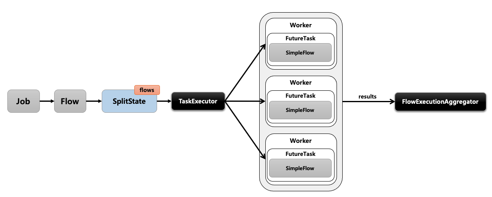
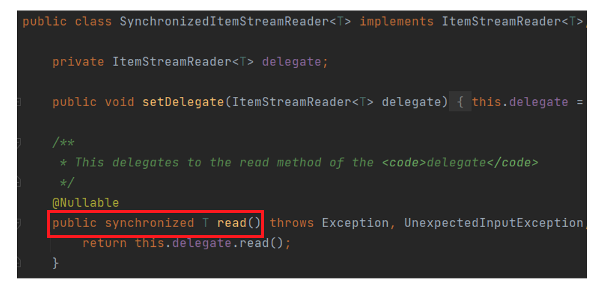
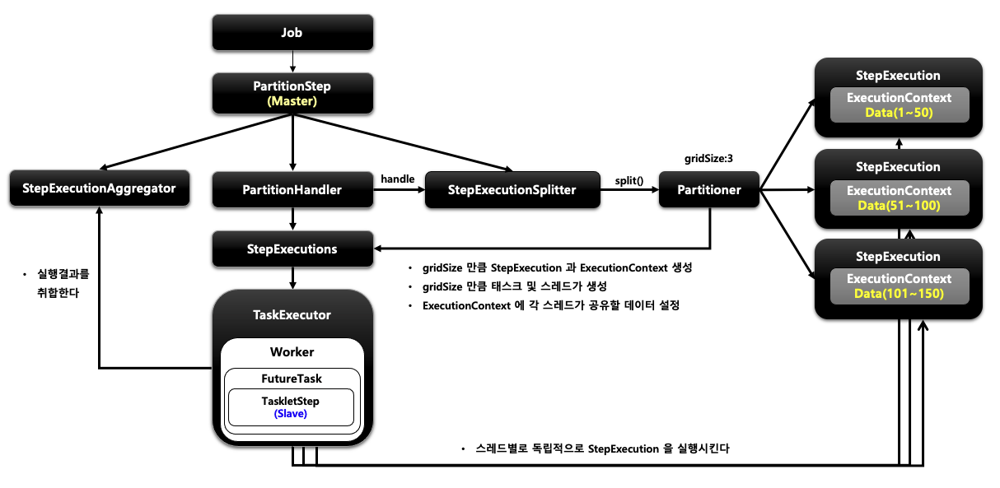
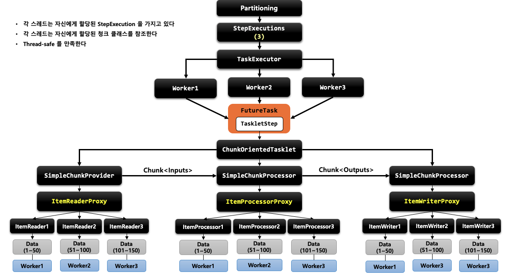

## 단일 스레드 vs 멀티 스레드


프로세스 내 특정 작업을 처리하는 스레드가 하나일 경우 단일 스레드, 여러 개일 경우 멀티 스레드라고 합니다. 작업 처리에 있어서 단일 스레드와 멀티 스레드의 선택 기준은 어떤 방식이 자원을 효율적으로 사용하고 성능 처리에 유리한가 하는 점입니다. 일반적으로 복잡한 처리나 대용량 데이터를 다루는 작업일 경우 전체 소요 시간 및 성능상의 이점을 가져오기 위해 멀티 스레드 방식을 사용합니다. 하지만 멀티 스레드 처리 방식은 데이터 동기화 이슈가 존재하기 때문에 주의해야 합니다.  

<br>

## 스프링 배치 스레드 모델
스프링 배치에서 멀티스레드 환경을 구성하기 위해서 가장 먼저 해야할 일은 사용하고자 하는 Reader와 Writer가 멀티스레드를 지원하는지 확인하는 것입니다. 스프링 배치 모델에서 지원하는 구현체의 reader와 writer를 타고 들어가보면 주석으로 thread-safe 한지 여부를 확인할 수 있습니다. 그리고 **멀티스레드로 각 chunk들이 개별로 진행되다보니 spring batch의 큰 장점중 하나인 실패 지점에서 재시작하는 것이 불가능합니다.** 단일 스레드로 순차적으로 실행할때는 10번째 청크가 실패한다면 9번째 청크까지는 성공했음이 보장되지만, 멀티스레드의 경우 1 ~ 10 개의 청크가 동시에 실행되다보니 10번째 청크가 실패했다고 해서 1 ~ 9까지의 청크가 다 성공된 상태임이 보장되지 않습니다. 그래서 일반적으로 멀티 스레드 환경의 배치를 구성할 때는 ItemReader의 saveState 옵션을 false로 설정하고 사용합니다.(실패한 지점을 저장하지 못하게 해 다음 실행 시에도 무조건 처음부터 다시 읽도록 하는 옵션) 하지만 **파티셔닝 방식은 예외적으로 실패지점에서 재시작이 보장됩니다.**

+ AsyncItemProcessor / AsyncItemWriter
    - 별도의 쓰레드를 통해 ItemProcessor와 ItemWriter를 처리하는 방식
    - spring-batch-integration 추가 의존성 필요
    - 보통 AsyncItemProcessor와 AsyncItemWriter를 함께 사용 
+ Multi-thread Step
    - 단일 Step을 수행하는 경우, Step 내의 Chunk 단위 마다 스레드가 할당되어 처리되는 방식
+ Parallel Steps
  - 여러 개의 Step을 수행하는 경우, Step마다 스레드가 할당되어 여러 개의 Step을 병렬로 실행하는 방법
+ Remote Chunking
    - 분산환경처럼 Step 처리가 여러 프로세스로 분할되어 외부의 다른 서버로 전송되어 처리하는 방식
+ Partitioning
    - Master/Slave 구조
    - 매니저(Master)가 partitioner를 사용하여 각각의 slave에 넘겨줄 데이터 범위를 결정하고 Slave는 해당 데이터를 Chunk 단위로 독립적으로 처리하는 방식
    - 다른 멀티 스레드 모델과 달리 **실패 지점 재시작이 가능**

<br>


### AsyncItemProcessor / AsyncItemWriter



Step 안에서 ItemProcessor가 비동기적으로 동작하는 구조입니다. AsyncItemProcessor / AsyncItemWriter 둘이 함께 구성되어야 합니다. AsyncItemProcessor로부터 AsyncItemWriter가 받는 최종 결과값은 List\<Future\<T>\> 타입이며 비동기 실행이 완료될 때까지 대기합니다. 




AsyncItemProcessor는 ItemProcessor에 실제 작업을 위임합니다. TaskExecutor로 비동기 실행을 하기 위한 스레드를 만들고 해당 스레드는 FutureTask를 실행합니다. FutureTask는 Callable 인터페이스를 실행하면서 그 안에서 ItemProcessor가 작업을 처리하게 됩니다. 이런 하나의 단위를 AsyncItemProcessor가 제공해서 처리를 위임하고 메인 스레드는 바로 다음 AsyncItemWriter로 넘어갑니다. AsyncItemWriter도 ItemWriter에게 작업을 위임합니다. ItemWriter는 Future 안에 있는 item들을 꺼내서 일괄처리하게 되는데 이때 Processor에서 작업 중인 비동기 실행의 결과값들을 모두 받아오기까지 대기합니다.


**예시**
사용하려면 Spring-batch-integration 의존성이 필요합니다.

```
implementation 'org.springframework.batch:spring-batch-integration'
```


```java
@Configuration
@RequiredArgsConstructor
public class HelloJobConfiguration {
    private final JobBuilderFactory jobBuilderFactory;
    private final StepBuilderFactory stepBuilderFactory;
    private final DataSource dataSource;
    private final EntityManagerFactory entityManagerFactory;
    private int chunkSize = 10;

    @Bean
    public Job helloJob() {
        return jobBuilderFactory.get("job")
                .start(step1())
                .incrementer(new RunIdIncrementer())
                .build();
    }

    @Bean
    public Step step1() {
        return stepBuilderFactory.get("step")
                .<Customer, Future<Customer2>>chunk(chunkSize) // Future 타입
                .reader(customItemReader())
                .processor(customAsyncItemProcessor())
                .writer(customAsyncItemWriter())
                .build();
    }

    @Bean
    public ItemReader<? extends Customer> customItemReader() {
        return new JpaPagingItemReaderBuilder<Customer>()
                .name("customItemReader")
                .pageSize(chunkSize)
                .entityManagerFactory(entityManagerFactory)
                .queryString("select c from Customer c order by c.id")
                .build();
    }

    @Bean
    public AsyncItemProcessor<Customer, Customer2> customAsyncItemProcessor() {
        AsyncItemProcessor<Customer, Customer2> asyncItemProcessor = new AsyncItemProcessor<>();
        asyncItemProcessor.setDelegate(customItemProcessor()); // customItemProcessor 로 작업 위임
        asyncItemProcessor.setTaskExecutor(new SimpleAsyncTaskExecutor()); // taskExecutor 세팅

        return asyncItemProcessor;
    }

    @Bean
    public ItemProcessor<Customer, Customer2> customItemProcessor() {
        return new ItemProcessor<Customer, Customer2>() {
            @Override
            public Customer2 process(Customer item) throws Exception {
                return new Customer2(item.getName().toUpperCase(), item.getAge());
            }
        };
    }


    @Bean
    public AsyncItemWriter<Customer2> customAsyncItemWriter() {
        AsyncItemWriter<Customer2> asyncItemWriter = new AsyncItemWriter<>();
        asyncItemWriter.setDelegate(customItemWriter()); // customItemWriter로 작업 위임
        return asyncItemWriter;
    }

    @Bean
    public ItemWriter<Customer2> customItemWriter() {
        return new JdbcBatchItemWriterBuilder<Customer2>()
                .dataSource(dataSource)
                .sql("insert into customer2 values (:id, :age, :name)")
                .beanMapped()
                .build();

    }

}
```
Customer 데이터를 프로세서에서 Customer2객체로 전환하여 Writer로 전달하는 예시입니다. 사실상 코드는 동기 코드와 큰 차이 없이 위임하는 과정만 추가되었다고 봐도 무방합니다. 동기 Processor와 Writer을 만들고 비동기 Processor와 Writer를 만들어 그 안에서 위임하는 코드와 TaskExecutor 설정만 추가해주면 됩니다.

<br>

### Multi-thread Step


+ Step 내에서 멀티 스레드로 Chunk 기반 처리가 이뤄지는 구조 입니다.
+ TaskExecutorRepeatTemplate이 반복자로 사용되며 설정한 개수(throttleLimit)만큼의 스레드를 생성하여 수행합니다.
+ ItemReader는 반드시 Thread-safe인지 확인해야 합니다.
  - 데이터를 소스로 부터 읽어오는 역할이기 때문에 스레드마다 중복해서 데이터를 읽지 않도록 동기화가 보장되어야 합니다.
  - 스프링 배치에서 제공하는 __JdbcPagingItemReader, JpaPagingItemReader가 Thread-safe__ 하게 동작합니다.
+ 스레드끼리는 Chunk를 공유하지 않고 스레드마다 새로운 Chunk가 할당되어 데이터 동기화가 보장됩니다.

**예시**
```java
@Configuration
@RequiredArgsConstructor
public class HelloJobConfiguration {
    private final JobBuilderFactory jobBuilderFactory;
    private final StepBuilderFactory stepBuilderFactory;
    private final DataSource dataSource;
    private final EntityManagerFactory entityManagerFactory;
    private int chunkSize = 10;

    @Bean
    public Job helloJob() {
        return jobBuilderFactory.get("job")
                .start(step1())
                .incrementer(new RunIdIncrementer())
                .build();
    }

    @Bean
    public Step step1() {
        return stepBuilderFactory.get("step")
                .<Customer, Customer2>chunk(chunkSize)
                .reader(customItemReader())
                .processor(customItemProcessor())
                .writer(customItemWriter())
                .taskExecutor(taskExecutor())
                .build();
    }

    @Bean
    public TaskExecutor taskExecutor() {
        ThreadPoolTaskExecutor taskExecutor = new ThreadPoolTaskExecutor();
        taskExecutor.setCorePoolSize(4); // 기본 스레드 풀 크기
        taskExecutor.setMaxPoolSize(8); // 4개의 스레드가 이미 처리중인데 작업이 더 있을 경우 몇개까지 스레드를 늘릴 것인지
        taskExecutor.setThreadNamePrefix("async-thread"); // 스레드 이름 prefix
        return taskExecutor;
    }

    @Bean
    public ItemReader<? extends Customer> customItemReader() {
        return new JpaPagingItemReaderBuilder<Customer>()
                .name("customItemReader")
                .pageSize(chunkSize)
                .entityManagerFactory(entityManagerFactory)
                .queryString("select c from Customer c order by c.id")
                .saveState(false)
                .build();
    }


    @Bean
    public ItemProcessor<Customer, Customer2> customItemProcessor() {
        return new ItemProcessor<Customer, Customer2>() {
            @Override
            public Customer2 process(Customer item) throws Exception {
                return new Customer2(item.getName().toUpperCase(), item.getAge());
            }
        };
    }
  

    @Bean
    public ItemWriter<Customer2> customItemWriter() {
        return new JdbcBatchItemWriterBuilder<Customer2>()
                .dataSource(dataSource)
                .sql("insert into customer2 values (:id, :age, :name)")
                .beanMapped()
                .build();

    }

}
```
코드는 동기 코드에서 taskExecutor세팅만 추가해주면 됩니다.
<br>

### Parallel Steps

+ SplitState를 사용해서 여러 개의 Flow들을 병렬적으로 실행하는 구조 입니다.
+ 실행이 다 완료된 후 FlowExecutionStatus 결과들을 취합해서 다음 단계를 결정합니다.

```java
@Bean
public Job parallelStepsJob() {

  Flow secondFlow = new FlowBuilder<Flow>("secondFlow")          // secondFlow 생성
                        .start(step2())                          // step2 실행 
                        .build();

  Flow parallelFlow = new FlowBuilder<Flow>("parallelFlow")        // parallelFlow 생성
                        .start(step1())                          // step1 실행
                        .split(new SimpleAsyncTaskExecutor())    // split 메서드에 TaskExecutor 를 파라미터로 주고 SplitBuilder 반환 
                        .add(secondFlow)                         // secondFlow 를 추가 -> 병렬로 실행 
                        .build();  
  
  return jobBuilderFactory.get("parallelStepsJob")
                        .start(parallelFlow)                     // parallelFlow 실행
                        .next(nextFlow())
                        .end()
                        .build();
}
```
일반적인 잡에서는 스텝 내에서 처리해야 할 모든 아이템이 처리되기 전에는 해당 스텝이 완료되지 않으며 스텝이 완료되지 않았다면 다음 스텝이 시작되지 않습니다. 하지만 split 메서드를 사용했다면 split 메서드를 통해 add로 추가된 여러 step에 대해서 동시에 병렬로 수행되며, 구성된 모든 플로우가 완료될 때까지 이후 스텝은 실행되지 않습니다. 

<br>

### SynchronizedItemStreamReader


Thread-safe 하지 않은 ItemReader를 Thread-safe하게 처리하도록 하는 기능을 제공합니다. 단순히 Thread-safe하지 않은 ItemReader를 SynchronizedItemStreamReader로 한번 감싸주면 되기 때문에 적용 방식은 매우 간단합니다.

**예시**
```java
@Configuration
@RequiredArgsConstructor
public class HelloJobConfiguration {
    private final JobBuilderFactory jobBuilderFactory;
    private final StepBuilderFactory stepBuilderFactory;
    private final DataSource dataSource;
    private int chunkSize = 10;

    @Bean
    public Job helloJob() {
        return jobBuilderFactory.get("job")
                .start(step())
                .incrementer(new RunIdIncrementer())
                .build();
    }


    @Bean
    public Step step() {
        return stepBuilderFactory.get("step")
                .<Customer,Customer2>chunk(chunkSize)
                .reader(customItemReader())
                .writer(customItemWriter())
                .taskExecutor(taskExecutor())
                .build();
    }
    @Bean
    public TaskExecutor taskExecutor() {
        ThreadPoolTaskExecutor taskExecutor = new ThreadPoolTaskExecutor();
        taskExecutor.setCorePoolSize(4); // 기본 스레드 풀 크기
        taskExecutor.setMaxPoolSize(8); // 4개의 스레드가 이미 처리중인데 작업이 더 있을 경우 몇개까지 스레드를 늘릴 것인지
        taskExecutor.setThreadNamePrefix("async-thread"); // 스레드 이름 prefix
        return taskExecutor;
    }

    @Bean
    public SynchronizedItemStreamReader<Customer> customItemReader() {
        // thread-safe 하지 않은 Reader
        JdbcCursorItemReader<Customer> notSafetyReader = new JdbcCursorItemReaderBuilder<Customer>()
                .name("customItemReader")
                .dataSource(dataSource)
                .fetchSize(chunkSize)
                .rowMapper(new BeanPropertyRowMapper<>(Customer.class))
                .sql("select id, name, age from customer order by id")
                .build();

        // SyncStreamReader 만들고 인자로 thread-safe하지 않은 Reader를 넘기면 
        // Read하는 작업이 동기화 되서 진행된다.
        return new SynchronizedItemStreamReaderBuilder<Customer>()
                .delegate(notSafetyReader)
                .build();
    }

    @Bean
    public JdbcBatchItemWriter<Customer2> customItemWriter() {
        return new JdbcBatchItemWriterBuilder<Customer2>()
                .dataSource(dataSource)
                .sql("insert into customer2 values (:id, :age, :name)")
                .beanMapped()
                .build();
    }

}
```

### Patitioning

파티셔닝은 매니저 (마스터) Step이 대량의 데이터 처리를 위해 지정된 수의 작업자 (Slave) Step으로 일감을 분할 처리하는 방식을 말합니다.(Master/Slave 구조) 각 slave가 처리할 데이터의 범위는 partitioner의 StepExecution을 통해 지정할 수 있으며, Slave Step은 각 스레드에 의해 독립적으로 실행되어 병렬처리됩니다. 파티셔닝은 독립적인 step을 구성하며 각각 별도의 stepExecution을 가지고 처리하므로 reader/writer의 멀티스레드 지원 여부가 중요하지 않고, 다른 멀티 스레드 모델과 달리 **실패 지점 재시작이 가능**합니다.  

#### 구조


파티셔닝은 다른 멀티 스레드 방식과 달리 추가적인 개념들을 알아야 합니다.

**PartitionHandler**
```java
@FunctionalInterface
public interface PartitionHandler {
	Collection<StepExecution> handle(StepExecutionSplitter stepSplitter, StepExecution stepExecution) throws Exception;
}
```

PartitionHandler 인터페이스는 매니저 (마스터) Step이 Worker Step를 어떻게 다룰지를 정의합니다. 예를 들면, Slave step으로 어떤 step을 두고 병렬로 실행할지, 병렬로 실행한다면 쓰레드풀 관리는 어떻게 할지, gridSize는 몇으로 둘지 등등을 비롯하여 모든 작업이 완료되었는지를 식별하는 역할을 하기도 합니다. 일반적으로 PartitionerHandler는 직접 구현하지 않고 제공되는 구현체를 사용합니다.
<Br>

* TaskExecutorPartitionHandler
  * 단일 JVM 내에서 분할 개념을 사용할 수 있도록 같은 JVM 내에서 스레드로 분할 실행
* MessageChannelPartitionHandler
  * 원격의 JVM에 메타 데이터를 전송


<Br>

**Partitioner**
```java
@FunctionalInterface
public interface Partitioner {
	Map<String, ExecutionContext> partition(int gridSize);
}
```
Partitioner는 파티셔닝된 Step (Slave Step)을 위한 Step Executions을 생성하는 인터페이스입니다. 기본 구현체인 SimplePartitioner는 인자로 받은 gridSize 만큼 빈 StepExecutions를 생성합니다. 일반적으로는 StepExecution 1개당 1개의 Slave Step를 매핑하기 때문에 Slave Step의 수와 마찬가지로 봐도 무방합니다.(spring batch에서는 기본적으로 1:1로 매핑하기 때문에 이를 변경하려면 partitionHandler를 통해서 변경해야 합니다.) gridSize만 지정했다고 해서 Slave Step이 자동으로 구성되는 것은 아니기 때문에 gridSize를 이용하여 각 Slave Step마다 어떤 Step Executions 환경을 제공할 지는 개발자가 직접 처리해야합니다.
  




각 스레드는 같은 SlaveStep을 실행하지만, 서로 다른 StepExecution 정보를 가지고 수행됩니다. Partitioning은 StepScope를 지정하게 되는데 이에 따라 서로 같은 SlaveStep을 수행하게 되어 같은 프록시를 바라보지만 실제 실행할 때는 결과적으로 각 스레드마다 타겟 빈을 새로 만들기 때문에 서로 다른 타겟 빈을 바라보게 되어 동시성 이슈가 없습니다.


**예시**
특정 기간의 DB 데이터를 파티션하는 파티셔너를 만들어 처리해보겠습니다. 

```java
// https://github.com/spring-projects/spring-batch/blob/d8fc58338d3b059b67b5f777adc132d2564d7402/spring-batch-samples/src/main/java/org/springframework/batch/sample/common/ColumnRangePartitioner.java
// spring 공식 샘플 코드 참고
@Slf4j
@RequiredArgsConstructor
public class ProductIdRangePartitioner implements Partitioner {

    private final ProductRepository productRepository;
    private final LocalDate startDate;
    private final LocalDate endDate;

    @Override
    public Map<String, ExecutionContext> partition(int gridSize) {
        long min = productRepository.findMinId(startDate, endDate); // 기간 동안의 최소 pk
        long max = productRepository.findMaxId(startDate, endDate); // 기간 동안의 최대 pk
        long targetSize = (max - min) / gridSize + 1;

        Map<String, ExecutionContext> result = new HashMap<>();
        long number = 0;
        long start = min;
        long end = start + targetSize - 1;
        
        // min, max를 통해 처리해야할 총 데이터 수를 구하고 gridSize로 나눠
        // 각 slaveStep에서 처리해야할 데이터의 시작, 끝 pk를 구해 ExecutionContext에 put
        while (start <= max) {
            ExecutionContext value = new ExecutionContext();
            result.put("partition" + number, value);

            if (end >= max) {
                end = max;
            }

            value.putLong("minId", start); // 각 파티션마다 사용될 minId
            value.putLong("maxId", end); // 각 파티션마다 사용될 maxId
            start += targetSize;
            end += targetSize;
            number++;
        }

        return result;
    }
}
```
조회 대상인 Product의 Repository (productRepository)를 통해 Job Parameter로 받은 시작일과 종료일로 전체 조회 대상의 맨 첫 PK값과 맨 끝 PK값을 가져옵니다. 그리고 이를 gridSize에 맞게 각 파티션 ExecutionContext으로 할당합니다. 예를 들어 2021.1.12 ~ 2021.1.13 기간에 해당하는 Product의 PK가 1부터 10까지 있다면 partition(5) (gridSize=5)를 수행시 다음과 같은 결과가 리턴됩니다. 
```
partition0 (minId:1, maxId:2)
partition1 (minId:3, maxId:4)
partition2 (minId:5, maxId:6)
partition3 (minId:7, maxId:8)
partition4 (minId:9, maxId:10)
```


```java
@Slf4j
@RequiredArgsConstructor
@Configuration
public class PartitionLocalConfiguration {
    public static final String JOB_NAME = "partitionSampleBatch";

    private final JobBuilderFactory jobBuilderFactory;
    private final StepBuilderFactory stepBuilderFactory;
    private final EntityManagerFactory entityManagerFactory;
    private final ProductRepository productRepository;
    private final ProductBackupRepository productBackupRepository;

    private int chunkSize = 100;
    private int poolSize = 100;

    @Bean(name = JOB_NAME)
    public Job job() {
        return jobBuilderFactory.get(JOB_NAME)
                .start(step1Manager())
                .build();
    }

    @Bean(name = JOB_NAME +"_step1Manager")
    public Step step1Manager() {
        // partitionHandler를 지정할 수도 있지만 지정하지 않으면 TaskExecutorPartitionHandler가 기본으로 사용
        return stepBuilderFactory.get("step1.manager")
                .partitioner("step1", partitioner(null, null)) // 파티셔너 등록
                .step(step1()) // slave Step 등록
                .gridSize(poolSize) // StepExecution이 형성될 개수 = 파티션 되는 데이터 뭉텅이 수 = 스레드 풀 사이즈과 일치시키는게 좋음
                .taskExecutor(taskExecutor()) // MasterStep이 SlaveStep을 다루는 스레드 형성 방식
                .build();
    }

    // partitioning에서 사용할 taskExecutor 정의
    @Bean(name = JOB_NAME+"taskPool")
    public TaskExecutor executor() {
      ThreadPoolTaskExecutor executor = new ThreadPoolTaskExecutor();
      executor.setCorePoolSize(poolSize);
      executor.setMaxPoolSize(poolSize);
      executor.setThreadNamePrefix("partition-thread");
      executor.setWaitForTasksToCompleteOnShutdown(Boolean.TRUE);
      executor.initialize();
      return executor;
    }

    @Bean(name = JOB_NAME +"_partitioner")
    @StepScope
    public ProductIdRangePartitioner partitioner(
            @Value("#{jobParameters['startDate']}") String startDate,
            @Value("#{jobParameters['endDate']}") String endDate) {
        LocalDate startLocalDate = LocalDate.parse(startDate, DateTimeFormatter.ofPattern("yyyy-MM-dd"));
        LocalDate endLocalDate = LocalDate.parse(endDate, DateTimeFormatter.ofPattern("yyyy-MM-dd"));

        return new ProductIdRangePartitioner(productRepository, startLocalDate, endLocalDate);
    }

    @Bean(name = JOB_NAME +"_step")
    public Step step1() {
        return stepBuilderFactory.get(JOB_NAME +"_step")
                .<Product, ProductBackup>chunk(chunkSize)
                .reader(reader(null, null))
                .processor(processor())
                .writer(writer())
                .build();
    }

    @Bean(name = JOB_NAME +"_reader")
    @StepScope
    // 파티셔너를 통해 넣은 minId와 maxId값을 사용하여 reader의 sql params 구성
    public JpaPagingItemReader<Product> reader(
            @Value("#{stepExecutionContext[minId]}") Long minId,
            @Value("#{stepExecutionContext[maxId]}") Long maxId) {
        
        Map<String, Object> params = new HashMap<>();
        params.put("minId", minId);
        params.put("maxId", maxId);

        log.info("reader minId={}, maxId={}", minId, maxId);

        return new JpaPagingItemReaderBuilder<Product>()
                .name(JOB_NAME +"_reader")
                .entityManagerFactory(entityManagerFactory)
                .pageSize(chunkSize)
                .queryString(
                        "SELECT p " +
                        "FROM Product p " +
                        "WHERE p.id BETWEEN :minId AND :maxId")
                .parameterValues(params)
                .build();
    }

    private ItemProcessor<Product, ProductBackup> processor() {
        return ProductBackup::new;
    }

    @Bean(name = JOB_NAME +"_writer")
    @StepScope
    public ItemWriter<ProductBackup> writer() {

        return items -> {
            productBackupRepository.saveAll(items);
        };
    }
}
```
