## 배치 애플리케이션이란?
__배치(Batch)는 일괄처리란 뜻을 갖고 있습니다.__ 쇼핑몰에서 매일 전날의 매출 데이터를 집계해야 한다고 가정해보겠습니다. 매출 데이터가 대용량이라면 하루 매출 데이터를 읽고, 가공하고, 저장한다면 해당 서버는 순식간에 CPU, I/O 등의 자원을 다 써버려서 다른 작업을 할 수 없게 됩니다. 집계 기능은 하루에 1번만 수행된다면 이를 위해 API를 구성하는 것은 낭비가 될 수 있고, 데이터 처리 중에 실패했다면 처음부터가 아니라 실패시점부터 다시 처리하고 싶을 수 있습니다. 이런 단발성으로 __대용량의 데이터를 처리하는 애플리케이션을 배치 애플리케이션__ 이라고 합니다. 배치 애플리케이션은 다음 조건을 만족해야 합니다.

+ 대용량 데이터 - 배치 애플리케이션은 대량의 데이터를 가져오거나, 전달하거나, 계산하는 등의 처리를 할 수 있어야 합니다.
+ 자동화 - 배치 애플리케이션은 심각한 문제 해결을 제외하고는 사용자 개입이 없이 실행되어야 합니다.
+ 견고성 - 배치 애플리케이션은 잘못된 데이터를 충돌/중단 없이 처리할 수 있어야 합니다.
+ 신뢰성 - 배치 애플리케이션은 무엇이 잘못되었는지를 추적할 수 있어야 합니다.(로깅, 알림)
+ 성능 - 배치 애플리케이션은 지정한 시간 안에 처리를 완료하거나 동시에 실행되는 다른 애플리케이션을 방해하지 않도록 수행되어야 합니다.

__Spring 진영에서는 배치 애플리케이션을 지원하는 모듈로 Spring Batch가 있습니다.__

<br>

## 스프링 배치 계층 구조
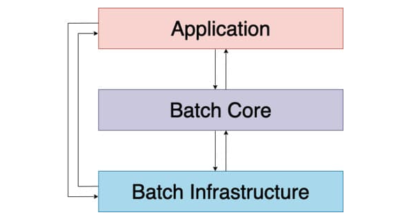

스프링 배치는 레이어 구조로 세 개로 구분되어 있습니다.
+ 인프라 레이어
    - 애플리케이션과 코어 모두 공통 인프라 위에서 빌드됩니다.
    - Job 실행의 흐름과 처리를 위한 __틀__ 을 제공합니다.
    - 개발자와 애플리케이션에서 사용하는 일반적인 Reader와 Writer 그리고 RetryTemplate과 같은 서비스를 포함합니다.
+ 코어 레이어
    - 배치 작업을 시작하고 제어하는데 필요한 핵심 런타임 클래스를 포함합니다.
    - JobLauncher, Job, Step, Flow
+ 애플리케이션 레이어
    - 개발자가 작성한 모든 배치 작업과 사용자 정의 코드를 포함합니다.

스프링 배치는 계층 구조로 설계되어 있기 때문에 개발자는 Application 계층의 비즈니스 로직에 집중할 수 있습니다. 배치의 동작과 관련된 것은 Batch Core에 있는 클래스들을 이용하여 제어할 수 있습니다.

<br>


## 기본 용어 이해와 샘플 배치
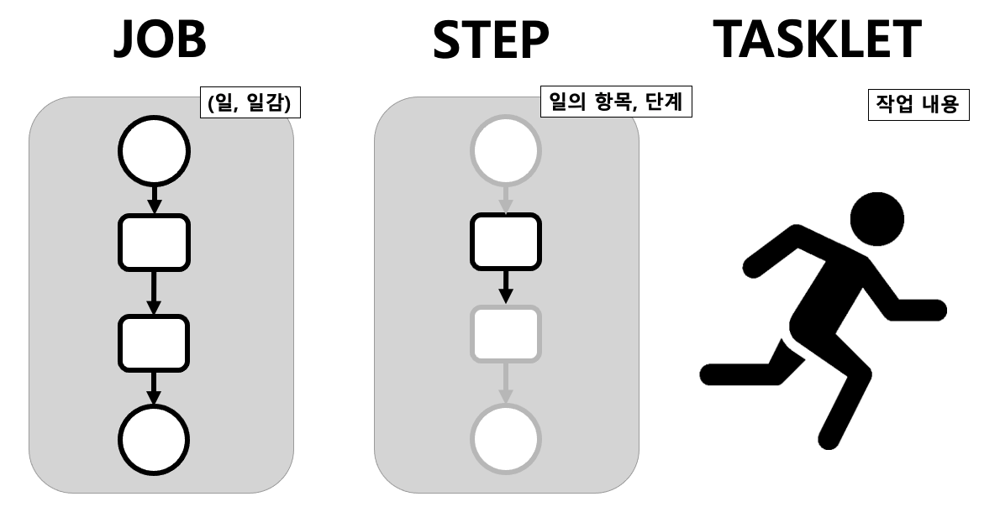

+ Job : 하나의 일을 말합니다.
+ Step : 하나의 일(Job) 안에서 단계를 의미합니다.
+ Tasklet : 하나의 단계(Step) 안에서 실질적으로 수행하는 작업 내용을 의미합니다.

<Br>

위에서 설명한 개념만으로 배치 애플리케이션을 하나 만들어보겠습니다. 
```kotlin
@Configuration // 하나의 배치 Job을 정의하고 빈으로 등록
class HelloWorldJobConfig(
                private val jobRepository: JobRepository,
                private val transactionManager: PlatformTransactionManager,
                ) {

    @Bean
    fun helloWorldJob(): Job {
        return JobBuilder("helloWorldJob", jobRepository)
                .start(helloStep1())
                .build()
    }

    @Bean
    fun helloStep1(): Step {
        return StepBuilder("helloStep1", jobRepository) // helloStep1을 생성합니다.
                .tasklet(
                        Tasklet { contribution, chunkContext ->

                // Step의 작업 내용 Tasklet을 정의합니다. 
                println("hellStep1")
            // Step은 기본적으로 Tasklet을 무한 반복시킵니다.  
            // 따라서 null이나 RepeatStatus.FINISHED를 반환해줘야 1번만 Tasklet을 실행합니다.
            RepeatStatus.FINISHED
        },
        transactionManager
            )
            .build()
    }
}

```
<br>

> Job -> Step -> Tasklet

지금까지 설명한 바에 의하면 Job은 위와 같이 구성됩니다. 스프링 배치는 내부적으로 Job이 구성이 되면 Job의 실행 정보와 상태 정보 등의 메타 데이터를 저장하는 JobExecution 클래스가 생성됩니다. Step도 마찬가지로 StepExecution 클래스가 생성됩니다. 이러한 데이터를 담고 있는 클래스들은 DB에 저장되어 현재 Job, Step들의 정보를 보관하게 됩니다. 스프링 배치에서는 위와 같은 클래스의 DB 스키마를 스크립트로 제공합니다. 

## Spring Batch DB 스키마
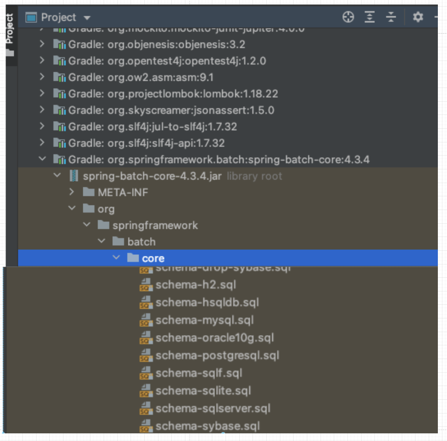

> 라이브러리 : org.springframework.batch:spring-batch-core  
> 패키지 : org.springframework.batch.core.schema-*.sql

위의 위치에서 DB 유형별로 스크립트가 제공됩니다.

```yml
spring:
  batch:
    jdbc:
      initialize-schema: always
```

+ 수동 생성
    - 위의 위치에서 제공하는 스크립트로 쿼리를 복사 후 직접 실행
+ 자동 생성
    - application.yml에서 spring.batch.jdbc.initialize-schema 속성 설정
        - EMBEDDED : __내장 DB일 때만__ 실행되며 스키마가 자동으로 생성(Default)
        - ALWAYS : 스크립트 항상 실행
        - NEVER
            - 스크립트 항상 실행 안 하기 때문에 내장 DB를 사용할 경우 스크립트가 생성이 안되기 때문에 오류 발생
            - __운영에서는 수동으로 스크립트 생성 후 NEVER로 설정하는 것이 권장__


<br>

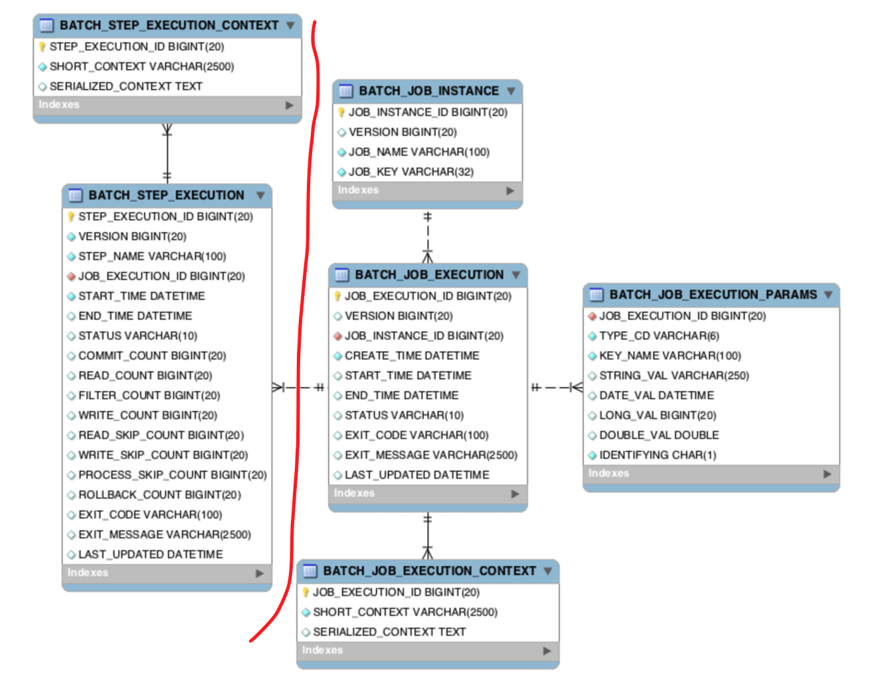

스키마는 왼쪽에 Step 관련 테이블 2개, 오른쪽에 Job 관련 테이블 4개로 구성되어 있습니다.

### BATCH_JOB_INSTANCE

필드명|설명
---|---
JOB_INSTANCE_ID|고유하게 식별할 수 있는 기본 키
VERSION|업데이트 될 때마다 1씩 증가
JOB_NAME|job을 구성할 때 부여하는 job 이름
JOB_KEY|job_name과 jobParameter를 합쳐서 해싱한 값

+ job이 실행될 때 JobInstace 정보가 저장됩니다.
+ __동일한 job_name과 job_key로 중복 저장될 수 없습니다.__
    - 즉, 동일한 job name의 job instance를 만들려면 매번 다른 jobParameter를 사용해야 합니다.


<br>

### BATCH_JOB_EXECUTION

필드명|설명
---|---
JOB_EXECUTION_ID|JobExecution을 고유하게 식별하는 기본키, JOB_INSTANCE와 다대일 관계(자신기준)
VERSION|업데이트 될 때마다 1씩 증가
JOB_INSTANCE_ID|JOB_INSTANCE의 기본 키
CREATE_TIME|실행(Execution)이 생성된 시점을 TimeStamp 형식으로 기록
START_TIME|실행(Execution)이 시작된 시점을 TimeStamp 형식으로 기록
END_TIME|실행(Execution)이 종료된 시점을 TimeStamp 형식으로 기록하며 job 실행 도중 오류가 발생해서 job이 중단된 경우 값이 저장되지 않을 수 있음
STATUS|실행 상태(BatchStatus)를 저장(COMPLETED,FAILED,STOPPED..)
EXIT_CODE|실행 종료된(ExitStatus)를 저장(COMPLETED,FAILED..)
EXIT_MESSAGE|Status가 실패일 경우 실패 원인 등의 내용을 저장
LAST_UPDATED|마지막 실행(Execution) 시점을 TimeStamp 형식으로 기록

job의 실행정보가 저장되며 job 생성 시간, 시작 시간, 종료 시간, 실행 상태, 메시지 등을 관리합니다.


<br>

### BATCH_JOB_EXECUTION_PARAMS

필드명|설명
---|---
JOB_EXECUTION_ID|JobExecution 식별 키, JOB_EXECUTION과 다대일 관계(자신기준)
TYPE_CD|String, Long, Date, Double 타입 정보
KEY_NAME|파라미터 키 값
STRING_VAL|파라미터 문자 값
DATE_VAL|파라미터 날짜 값
LONG_VAL|파라미터 Long 값
DOUBLE_VAL|파라미터 Double 값
IDENTIFYING|식별 여부(True, False)

+ job과 함께 실행되는 JobParameter 정보를 저장합니다.
+ job 파라미터는 key-value 형태로 저장합니다.

<br>

### BATCH_JOB_EXECUTION_CONTEXT


필드명|설명
---|---
JOB_EXECUTION_ID|JobExecution 식별 키
SHORT_CONTEXT|Job의 실행 상태 정보, 공유 데이터 등의 정보를 문자열로 저장
SERIALIZED_CONTEXT|직렬화(Serialized)된 전체 컨텍스트

+ job의 실행동안 여러가지 상태정보, 공유 데이터를 직렬화(Json 형식)하여 저장합니다.
+ __Step에서 해당 데이터를 서로 공유하여 사용합니다.__

<br>

### BATCH_STEP_EXECUTION


필드명|설명
---|---
STEP_EXECUTION_ID|Step 실행정보를 고유하게 식별하는 기본 키
VERSION|업데이트 될 때마다 1씩 증가
STEP_NAME|Step을 구성할 때 부여하는 이름
JOB_EXECUTION_ID|JobExecution의 기본키, JobExecution과 다대일 관계(자신기준)
START_TIME|실행(Execution)이 시작된 시점을 TimeStamp 형식으로 기록
END_TIME|실행이 종료된 시점을 TimeStamp 형식으로 기록하며, job 실행 도중 오류가 발생해서 job이 중단된 경우 값이 저장되지 않을 수 있음
STATUS|실행 상태(BatchStatus)를 저장(Completed, Failed, Stopped..)
COMMIT_COUNT|트랜잭션 당 커밋되는 수를 기록
READ_COUNT|실행시점에 Read한 Item 수를 기록
FILTER_COUNT|실행도중 필터링한 Item 수를 기록
WRITE_COUNT|실행도중 저장되고 커밋된 Item 수를 기록
READ_SKIP_COUNT|실행도중 Read가 Skip된 Item 수를 기록
WRITE_SKIP_COUNT|실행도중 Write가 Skip된 Item 수를 기록
PROCESS_SKIP_COUNT|실행도중 Process가 Skip된 Item 수를 기록
ROLLBACK_COUNT|실행도중 rollback이 일어난 수를 기록
EXIT_CODE|실행종료코드(ExitStatus)를  저장(Completed, Failed)
EXIT_MESSAGE|Status가 실패일 경우 실패 원인 등의 내용을 저장
LAST_UPDATED|마지막 실행(Execution) 시점을 TimeStamp형식으로 기록


Step의 실행정보가 저장되며 생성 시간, 종료 시간, 실행상태, 메시지 등을 관리합니다.

<br>


### BATCH_STEP_EXECUTION_CONTEXT

필드명|설명
---|---
STEP_EXECUTION_ID|StepExecution의 기본 키
SHORT_CONTEXT|Step의 실행 상태 정보, 공유 데이터 등의 정보를 문자열로 저장
SERIALIZED_CONTEXT|직렬화(Serialized)된 전체 컨텍스트

+ Step의 실행동안 여러가지 상태정보, 공유 데이터를 직렬화(Json 형식)하여 저장합니다.
+ __Step 별로 저장되기 때문에 Step간 서로 공유할 수 없습니다.__


## Spring Batch 도메인 이해

### Job
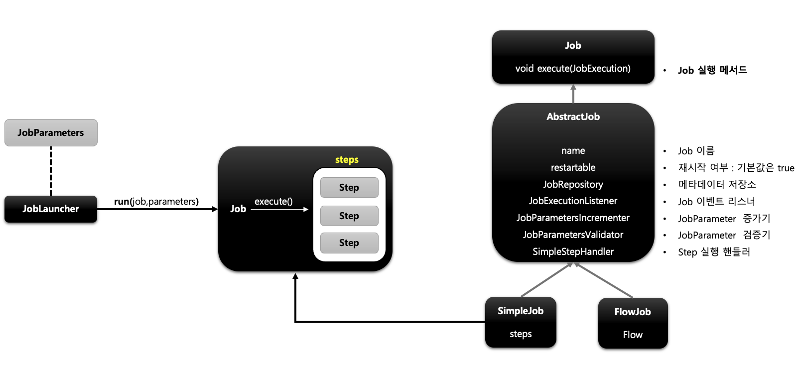

+ 배치 계층 구조에서 가장 상위에 있는 개념으로서 __하나의 배치작업 자체__ 를 의미합니다.
+ Job Configuration을 통해 생성되는 객체 단위로서 __배치 작업을 어떻게 구성하고 실행할 것인지 전체적으로 설정하고 명세해 놓은 객체__ 입니다.
+ Job은 여러 Step을 포함하고 있는 컨테이너로서 반드시 __한 개 이상의 Step__ 으로 구성되어야 합니다.
+ 배치 Job을 구성하기 위한 최상위 인터페이스이며 스프링 배치가 기본 구현체(SimpleJob, FlowJob)를 제공합니다.
    - SimpleJob
        - 순차적으로 Step을 실행시키는 Job
        - 가장 보편적이고 모든 Job에서 사용할 수 있는 표준 기능 제공
    - FlowJob
        - 특정 조건과 흐름에 따라 Step을 구성하여 실행시키는 Job
        - Flow 객체를 실행시켜서 작업을 진행

<br>

#### JobInstance
+ Job이 실행될 때 생성되는 __Job의 논리적 실행 단위 객체__ 로서 __고유하게 식별 가능한 작업 실행__ 을 나타냅니다.
+ 같은 Job이라도 여러번 실행될 수 있는데 각각의 실행을 구분하기 위한 것을 JobInstance라고 보면 됩니다. (Job : JobInstance = 1:M 관계)
    - 처음 시작하는 Job + JobParameters 일 경우 새로운 JobInstance를 생성합니다.
    - 이전과 동일한 Job + JobParameters으로 실행할 경우 이미 존재하는 JobInstance를 리턴합니다.
        - 내부적으로 JobName + jobKey(JobParameters의 해시값)을 통해서 존재하던 JobInstance를 얻습니다.
        - 이전 수행이 실패했을 경우에는 다시 수행이 가능하지만, 이전 수행이 성공했다면 다시 수행할 수 없습니다.(같은 내용을 반복할 필요가 없기 때문)
+ BATCH_JOB_INSTANCE 테이블과 매핑됩니다.

<br>


#### JobParameter
+ __Job을 실행할 때 함께 포함되어 사용되는 파라미터를 가진 도메인 객체__
+ 하나의 Job에 존재할 수 있는 여러 개의 JobInstance를 구분하기 위한 용도
+ JobParameters와 JobInstance는 1:1관계
+ BATCH_JOB_EXECUTION_PARAM 테이블과 매핑됩니다.

<br>


#### JobExecution
+ JobExecution은 __JobInstance에 대한 한 번의 시도를 의미하는 객체로서 Job 실행 중에 발생한 정보들을 저장하고 있는 객체__ 입니다.
+ 시작시간, 종료시간, 상태(시작됨,완료,실패), 종료상태의 속성을 갖습니다. Job은 실행될 때 JobParameters를 받아서 JobInstance를 생성하고 JobInstance가 실행될 때마다 JobExecution이 생성됩니다. 
+ JobInstance는 같은 파라미터에 대해서 단 한번만 실행 가능하다고 했지만 JobExecution이 JobInstance가 실행될 때마다 생성될 수 있는 이유는 JobInstance의 상태에 따라 예외 케이스가 있기 때문입니다.
+ BATCH_JOB_EXECUTION 테이블과 매핑됩니다.

<Br>

__JobExecution과 JobInstance와의 관계__
+ JobExecution은 'FAILED' 또는 'COMPLETED' 등의 Job의 실행 상태를 갖고 있습니다.
+ JobExecution의 실행 상태 결과가 'COMPLETED'면 JobInstance 실행이 완료된 것으로 간주해서 재실행이 불가능합니다.
+ __JobExecution의 실행 상태 결과가 'FAILED'면 JobInstance 실행이 완료되지 않은 것으로 간주해서 재실행이 가능합니다.__ 
    - JobParameters가 동일한 값으로 Job을 실행할지라도 이전의 JobExecution이 실패했기 때문에 기존의 JobInstance에서 __새로운 JobExecution을 생성하여 실행이 이뤄집니다.__
    - 즉, JobExecution의 실행 상태 결과가 'COMPLETE' 될 때까지 하나의 JobInstance 내에서 JobExecution이 생성될 수 있습니다.


<br>

### Step
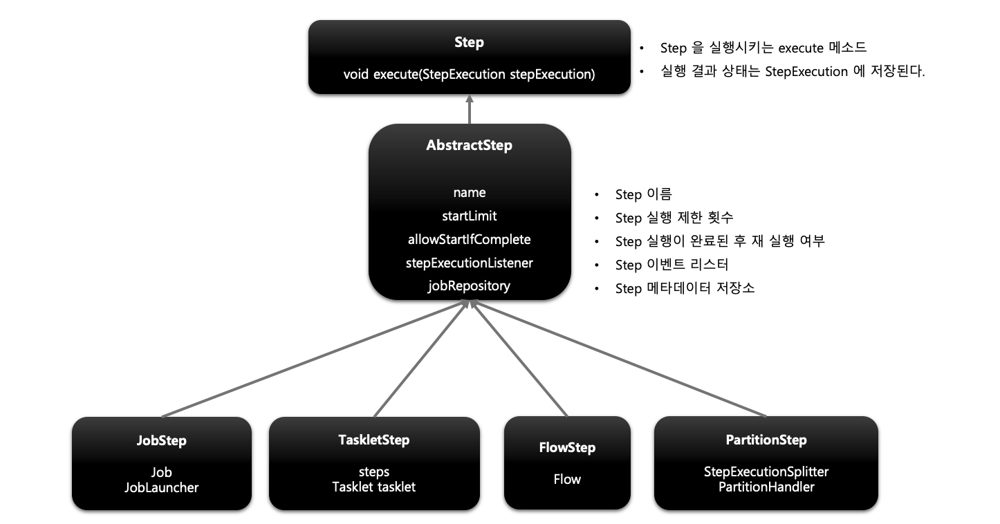

+ __Batch Job을 구성하는 독립적인 하나의 단계로서, 실제 배치 처리를 정의하고 컨트롤하는데 필요한 모든 정보를 가지고 있는 도메인 객체__
+ 단순한 단일 태스크뿐 아니라 입력과 처리 그리고 출력과 관련된 복잡한 비즈니스 로직을 포함하는 모든 설정들을 담고 있습니다.
+ __모든 Job은 하나 이상의 Step으로 구성됩니다.__
+ Step 인터페이스는 Step을 실행하는 execute 메서드를 갖고 있고, 구현체로 AbstractStep이 있습니다. 그리고 이를 상속받은 4가지 Step이 있습니다.
  + TaskletStep
      - 가장 기본이 되는 클래스로서 Tasklet 타입의 구현체들을 제어합니다.
  + PartitionStep
      - 멀티 스레드 방식으로 Step을 여러 개로 분리해서 실행합니다.
  + JobStep
      - Step 내에서 Job을 실행합니다.
  + FlowStep
      - Step 내에서 Flow를 실행합니다.

<Br>

#### StepExecution
+ __Step에 대한 한 번의 시도를 의미하는 객체로서 Step 실행 중에 발생한 정보들을 저장하고 있는 객체__
    - 시작시간, 종료시간, 상태, commit count, rollback count 등의 속성을 갖습니다.
+ Step이 __매번 시도될 때마다 새로 생성__ 되며 __각 Step 별로 생성__ 됩니다.
+ __Job이 실패되어 재시작될 경우 이미 성공적으로 완료된 Step은 재실행되지 않고 실패한 Step만 실행됩니다.__
    - 모두 재시작 할 수 있는 옵션도 존재합니다.
+ 이전 단계 Step이 실패해서 현재 Step을 실행되지 않았다면 StepExecution은 생성되지 않습니다.
+ JobExecution과의 관계
    - JobExecution과 StepExecution은 1:M 관계
    - Step의 StepExecution이 모두 정상적으로 완료되야만 JobExecution이 정상적으로 완료됩니다.
    - Step의 StepExecution 중 하나라도 실패하면 JobExecution은 실패합니다.
+ BATCH_STEP_EXECUTION 테이블에 매핑됩니다.


#### StepContribution
+ __청크 프로세스의 변경 사항을 버퍼링 한 후 StepExecution 상태를 업데이트하는 도메인 객체__
    - 쉽게 말하면, Step에서 정의한 일들을 처리한 결과들을 저장해두다가 StepExecution에 업데이트 하는 일을 말합니다.
+ 청크 커밋 직전에 StepExecution의 apply 메서드를 호출하여 상태를 업데이트합니다.
+ ExitStatus의 기본 종료코드 외 사용자 정의 종료코드를 생성해서 적용할 수 있습니다.

**동작 과정**
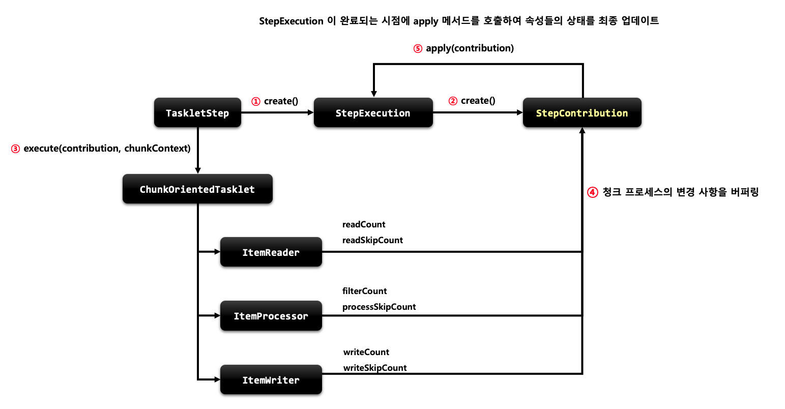

1. 잡이 실행되면 TaskletStep에서 StepExecution을 생성합니다.
2. StepExecution은 StepContribution을 만듭니다.
3. Chunk 기반 Tasklet이 실행됩니다.
4. 청크 프로세스의 데이터들이 StepContribution에 쌓입니다.
5. StepExecution이 완료되는 시점에 apply 메서드를 호출하여 StepContribution의 필드 값들을 StepExecution에 업데이트 시킵니다.

<br>

### ExecutionContext
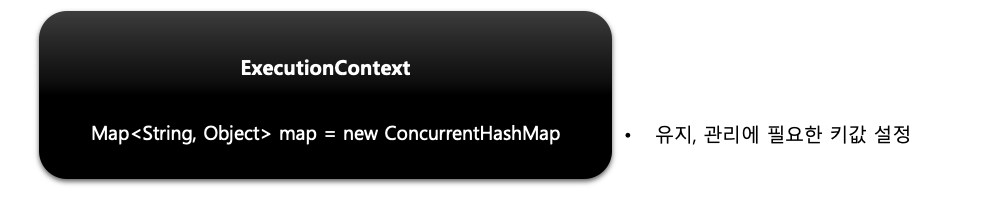

+ __프레임워크에서 유지 및 관리하는 "key-value"으로 된 컬렉션으로 StepExecution 또는 JobExecution 객체의 상태(필드값들)을 저장하는 공유 객체__
+ DB에 직렬화 한 값으로 저장됩니다.("key":"value")
+ 공유 범위
    - Step 범위 : 각 Step Execution에 저장되며 __Step 간 서로 공유 불가능__
    - Job 범위 : 각 Job의 Execution에 저장되며 Job간 서로 공유는 되지 않지만, __해당 Job에 속한 Step은 공유 가능__
+ Job 재시작시 이미 처리한 Row 데이터는 건너뛰고 이후부터 수행하도록 상태 정보를 활용합니다.


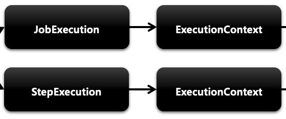  
JobExecution과 StepExecution 각각 필드값으로 ExecutionContext를 갖고 있습니다.

```java
public class ExecutionContextTasklet implements Tasklet {
    @Override
    public RepeatStatus execute(StepContribution contribution, ChunkContext chunkContext) throws Exception {
        ExecutionContext jobExecutionContext = contribution.getStepExecution().getJobExecution().getExecutionContext();
        ExecutionContext stepExecutionContext = contribution.getStepExecution().getExecutionContext();

        ExecutionContext jobExecutionContext2 = chunkContext.getStepContext().getStepExecution().getJobExecution().getExecutionContext();
        ExecutionContext stepExecutionContext2 = chunkContext.getStepContext().getStepExecution().getExecutionContext();
        return RepeatStatus.FINISHED;
    }
}
```
인자 두개에서 모두 꺼내서 사용할 수 있습니다.

<br>

### JobRepository
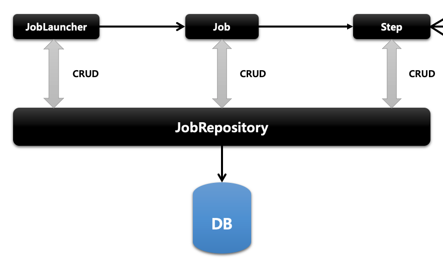

+ __배치 작업 중의 정보를 저장하는 저장소 역할__
+ Job이 언제 수행되었고, 언제 끝났으며, 몇 번이 실행되었고 실행에 대한 결과 등의 배치 작업의 수행과 관련된 모든 메타 데이터를 저장합니다.
    - JobLauncher, Job, Step 구현체 내부에서 CRUD 기능을 처리합니다.
    - 실행 과정에서 데이터를 DB에 저장하고, 필요한 데이터는 읽어오는 작업을 하는 객체라고 보면 됩니다.


<br>

### JobLuancher
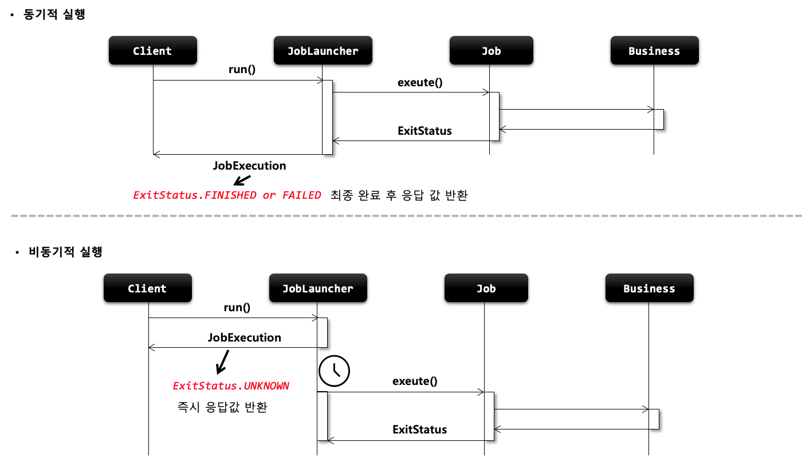
+ __배치 Job을 실행시키는 역할__
+ Job과 Job Parameters를 인자로 받아 배치 작업을 수행한 후 최종 client에게 JobExecution을 반환합니다.
+ 스프링 부트 배치가 구동되면 JobLauncher 빈이 __자동 생성__ 됩니다.
+ Job 실행
    - JobLauncher.run(job,jobParameters)
    - 스프링 부트 배치에서는 jobLauncherApplicationRunner가 자동적으로 JobLuancher을 실행시킵니다.
    - 동기적 실행
        - taskExecutor를 SyncTaskExecutor로 설정한 경우(기본값)
        - JobExecution을 획득하고 배치 처리를 최종 완료한 이후 Client에게 JobExecution을 반환
        - 스케줄러에 의한 배치처리에 적합(배치처리시간이 길어도 무관한 경우)
    - 비동기적 실행
        - taskExecutor가 SimpleAsyncTaskExecutor로 설정할 경우
        - JobExecution을 획득한 후 Client에게 바로 JobExecution을 반환하고 배치처리를 진행
        - HTTP 요청에 의한 배치처리에 적합(배치처리 시간이 길 경우 응답이 늦어지지 않도록 함)


