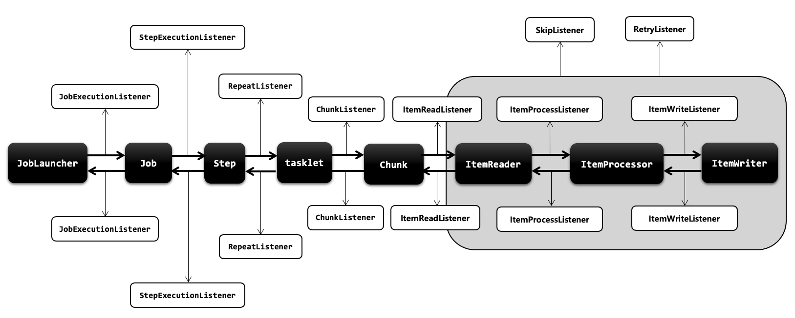

## Listener
배치 흐름 중에 Job, Step, Chunk 단계의 실행 전후에 발생하는 이벤트를 받아 용도에 맞게 활용할 수 있도록 제공하는 인터셉터 개념의 클래스입니다. 각 단계별로 로그기록을 남기거나 소요된 시간을 계산하거나 실행상태 정보들을 참조 및 조회할 수 있습니다.



+ Job
    - JobExecutionListener : Job 실행 전후
+ Step
    - StepExecutionListener : Step 실행 전후
    - ChunkListener : Chunk 실행 전후(Tasklet 실행 전후), 오류 시점
    - ItemReaderListener : ItemReader 실행 전후, 오류 시점, 단, item이 null일 경우에는 호출 X
    - ItemProcessorListener : ItemProcessor 실행 전후, 오류 시점, 단, item이 null일 경우에는 호출 X
    - ItemWriterListener : ItemWriter 실행 전후, 오류 시점, 단, item이 null일 경우에는 호출 X
+ SkipListener : item 처리가 Skip 될 경우 Skip된 item을 추적
+ RetryListener : Retry 시작, 종료, 에러 시점


<br>

## JobExecutionListener / StepExecutionListener

listener를 등록하는 방식은 인터페이스를 구현하거나 애노테이션을 사용하는 방식이 있습니다. 

### 예시
```java
@Configuration
@RequiredArgsConstructor
public class HelloJobConfiguration {
    private final JobBuilderFactory jobBuilderFactory;
    private final StepBuilderFactory stepBuilderFactory;
    private final EntityManagerFactory entityManagerFactory;
    private int chunkSize = 10;

    @Bean
    public Job helloJob() {
        return jobBuilderFactory.get("job")
                .incrementer(new RunIdIncrementer())
                .start(step())
                .listener(new CustomJobExecutionListener())
                //.listener(new CustomJobAnnotationExecutionListener()) // 애노테이션 방식
                .build();
    }


    @Bean
    public Step step() {
        return stepBuilderFactory.get("step")
                .<Customer, Customer2>chunk(chunkSize)
                .reader(customItemReader())
                .writer(items -> System.out.println("items = " + items))
                .listener(new CustomStepExecutionListener())
                .build();
    }


    @Bean
    public JpaPagingItemReader<Customer> customItemReader() {
        return new JpaPagingItemReaderBuilder<Customer>()
                .name("customItemReader")
                .pageSize(chunkSize)
                .entityManagerFactory(entityManagerFactory)
                .queryString("select c from Customer c order by c.id")
                .build();

    }
}
```
```java
public class CustomJobExecutionListener implements JobExecutionListener {
    @Override
    public void beforeJob(JobExecution jobExecution) {
        System.out.println("job name : " + jobExecution.getJobInstance().getJobName() + " start");
    }

    @Override
    public void afterJob(JobExecution jobExecution) {
        String jobName = jobExecution.getJobInstance().getJobName();
        long startTime = jobExecution.getStartTime().getTime();
        long endTime = jobExecution.getEndTime().getTime();
        long executionTime = endTime - startTime;
        System.out.println("job name : " + jobName  + " end "+ " execution time : "+executionTime);

    }
}
```
```java
public class CustomStepExecutionListener implements StepExecutionListener {
    @Override
    public void beforeStep(StepExecution stepExecution) {
        String stepName = stepExecution.getStepName();
        System.out.println("stepName = " + stepName+ " start");
    }

    @Override
    public ExitStatus afterStep(StepExecution stepExecution) {
        String stepName = stepExecution.getStepName();
        ExitStatus exitStatus = stepExecution.getExitStatus();
        System.out.println("stepName = " + stepName + " end " + " exitStatus : "+ exitStatus);
        // exitStatus 조작 가능
        //return ExitStatus.FAILED
        return null;
    }
}
```
각각의 인터페이스를 구현해서 원하는 로직을 작성하면 됩니다. StepListener의 반환값으로 ExitStatus를 수정해서 Job의 ExitStatus에 반영되는 값을 수정할 수 있습니다. 아래 코드는 인터페이스를 구현하지 않고 애노테이션으로 리스너를 작성한 방식입니다.
```java
public class CustomJobAnnotationExecutionListener {

    @BeforeJob
    public void beforeJob(JobExecution jobExecution) {
        System.out.println("job name : " + jobExecution.getJobInstance().getJobName() + " start");
    }

    @AfterJob
    public void afterJob(JobExecution jobExecution) {
        String jobName = jobExecution.getJobInstance().getJobName();
        long startTime = jobExecution.getStartTime().getTime();
        long endTime = jobExecution.getEndTime().getTime();
        long executionTime = endTime - startTime;
        System.out.println("job name : " + jobName  + " end : "+ " execution time : "+executionTime);

    }
}
```
실제로 리스너를 등록하는 방식은 똑같고 구현하는 방식만 애노테이션으로 변경된 것입니다. 애노테이션 방식은 인터페이스를 구현하지 않고 애노테이션으로 언제 동작하는지 명시하기만 하면 됩니다.  

<br>

## ChunkListener / ItemReadListener / ItemProcessorListener / ItemWriterListener
청크 리스너는 청크 주기마다 호출됩니다. 즉, reader - writer 하나의 싸이클 마다 호출됩니다. 네 가지 리스너 모두 애노테이션 방식을 지원합니다.

### 예시
```java
@Configuration
@RequiredArgsConstructor
public class HelloJobConfiguration {
    private final JobBuilderFactory jobBuilderFactory;
    private final StepBuilderFactory stepBuilderFactory;
    private final EntityManagerFactory entityManagerFactory;
    private int chunkSize = 10;

    @Bean
    public Job helloJob() {
        return jobBuilderFactory.get("job")
                .incrementer(new RunIdIncrementer())
                .start(step())
                .build();
    }

    @Bean
    public Step step() {
        return stepBuilderFactory.get("step")
                .<Customer, Customer2>chunk(chunkSize)
                .reader(customItemReader())
                .processor(customItemProcessor())
                .writer(customItemWriter())
                .listener(new CustomChunkListener())
                .listener(new CustomItemReadListener())
                .listener(new CustomItemProcessorListener())
                .listener(new CustomItemWriterListener())
                .build();
    }


    @Bean
    public JpaPagingItemReader<Customer> customItemReader() {
        return new JpaPagingItemReaderBuilder<Customer>()
                .name("customItemReader")
                .pageSize(chunkSize)
                .entityManagerFactory(entityManagerFactory)
                .queryString("select c from Customer c order by c.id")
                .build();

    }
    @Bean
    public ItemProcessor<? super Customer, ? extends Customer2> customItemProcessor() {
        return item -> {
            return new Customer2(item.getName(), item.getAge());
        };
    }
    @Bean
    public ItemWriter<? super Customer2> customItemWriter() {
        return items -> {
            System.out.println("items = " + items);
        };
    }

}
```
```java
public class CustomChunkListener implements ChunkListener {
    private int count;

    @Override
    public void beforeChunk(ChunkContext context) {
        count++;
        System.out.println("before chunk : "+ count);
    }

    @Override
    public void afterChunk(ChunkContext context) {
        System.out.println("after chunk : "+ count);
    }

    @Override
    public void afterChunkError(ChunkContext context) {
        System.out.println("error chunk : "+ count);
    }
}
```
```java
public class CustomItemReadListener implements ItemReadListener {
    private int count;

    @Override
    public void beforeRead() {
        count++;
        System.out.println("before reader : "+ count);
    }

    @Override
    public void afterRead(Object item) {
        System.out.println("after reader : "+ count);

    }

    @Override
    public void onReadError(Exception ex) {
        System.out.println("error reader : "+ count);

    }
}
```
```java
public class CustomItemProcessorListener implements ItemProcessListener<Customer, Customer2> {
    private int count;

    @Override
    public void beforeProcess(Customer item) {
        count++;
        System.out.println("before processor : "+ count);
    }

    @Override
    public void afterProcess(Customer item, Customer2 result) {
        System.out.println("after processor : "+ count);

    }

    @Override
    public void onProcessError(Customer item, Exception e) {
        System.out.println("error processor : "+ count);

    }
}
```
```java
public class CustomItemWriterListener implements ItemWriteListener<Customer2> {
    private int count;


    @Override
    public void beforeWrite(List<? extends Customer2> items) {
        count++;
        System.out.println("before writer : "+ count);
    }

    @Override
    public void afterWrite(List<? extends Customer2> items) {
        System.out.println("after writer : "+ count);

    }

    @Override
    public void onWriteError(Exception exception, List<? extends Customer2> items) {
        System.out.println("error writer : "+ count);

    }
}
```
사용 방식은 전부 유사합니다. 인터페이스를 구현해서 로직을 작성하고 listener로 등록해주면 됩니다.


