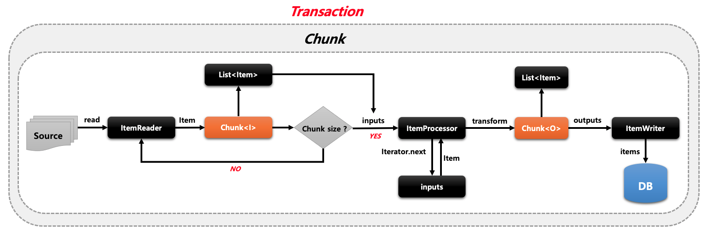
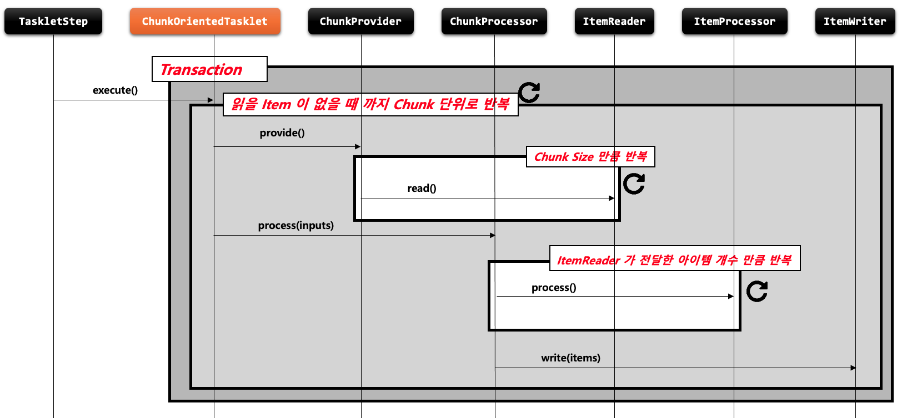
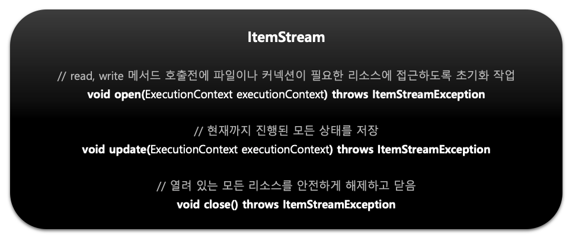
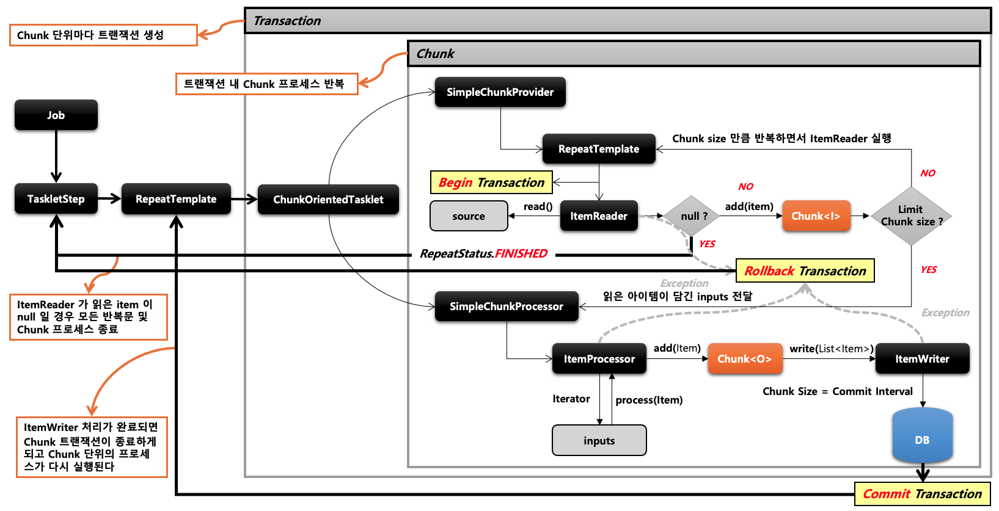

## Chunk
+ __여러 개의 아이템을 묶은 하나의 덩어리__ 를 의미합니다.
+ 한 번에 하나씩 아이템을 입력받아 Chunk 단위의 덩어리로 만든 후 Chunk 단위로 트랜잭션을 처리합니다.
    - Chunk 단위로 Commit과 Rollback
+ 일반적으로 대용량 데이터를 한 번에 처리하는 것이 아닌 청크 단위로 쪼개어 반복해서 수행합니다.

### Chunk\<I> , Chunk\<O>
+ Chunk\<I>
    - ItemReader로 읽은 하나의 아이템을 Chunk 크기만큼 반복해서 저장하는 타입
+ Chunk\<O>
    - ItemReader로부터 전달받은 Chunk\<I>를 참조해서 ItemProcessor에서 적절하게 가공한 뒤 ItemWriter로 전달되는 타입
    - 여기서 O는 Processor가 없다면 ItemReader로부터 전달받는 타입, Processor가 있다면 Processor로부터 전달받는 타입입니다.

### 아키텍처

1. ItemReader가 Source를 한 건씩 읽고 한 건씩 Chunk크기 만큼 Chunk\<I>에 저장합니다.
2. Chunk 크기만큼 쌓였다면 Chunk\<I>를 ItemProcessor에 전달합니다.
3. ItemProcessor는 전달받은 Chunk를 적절하게 가공해서 Chunk\<O>에 저장합니다.
4. Chunk\<O>를 ItemWriter에 전달합니다.
5. itemWriter는 데이터를 쓰기작업합니다.

__ItemReader와 ItemProcessor는 각각의 하나씩 아이템을 처리하지면 ItemWriter는 Chunk 크기만큼을 한 번에 일괄 처리합니다.__

 

## ChunkOrientedTasklet
+ 스프링 배치에서 제공하는 __Tasklet 구현체로 Chunk 지향 프로세싱을 담당하는 도메인 객체__ 입니다.
+ ItemReader, ItemWriter, ItemProcessor를 사용해 Chunk 기반 데이터 입출력을 담당합니다.
+ TaskletStep에 의해서 반복적으로 실행되며, ChunkOrientedTasklet이 실행될 때마다 __매번 새로운 트랜잭션이 생성__ 되어 처리됩니다.
+ exception이 발생할 경우, 해당 Chunk는 롤백되며 이전에 커밋한 Chunk는 완료 상태가 유지됩니다.
+ 내부적으로 ItemReader를 핸들링하는 ChunkProvider와 ItemProcessor, ItemWriter를 핸들링하는 ChunkProcessor 타입의 구현체를 갖습니다.

### ChunkProvider
+ __ItemReader를 사용해서 소스로부터 아이템을 Chunk size만큼 읽어서 Chunk단위로 만들어 제공하는 도메인 객체__
+ Chunk\<I>를 만들고 내부적으로 반복문을 사용해서 ItemReader.read()를 계속 호출하면서 item을 Chunk\<I>에 쌓습니다.
  - Chunk size만큼 item을 읽으면 반복문이 종료되고 ChunkProcessor로 넘깁니다.
  - ItemReader가 읽은 item이 null일 경우 read 반복문이 종료되고 해당 Step의 반복문도 종료됩니다.
+ 외부로부터 ChunkProvider이 호출될 때마다 __새로운 Chunk__ 를 생성합니다.

### ChunkProcessor
+ __ItemProcessor를 사용해서 Item을 변형, 가공, 필터링하고 ItemWriter를 사용해서 Chunk 데이터를 저장, 출력합니다.__
+ Chunk\<O>를 만들고 앞에서 넘어온 Chunk\<I>의 item을 __한 건씩__ itemProcessor를 통해 처리한 후 Chunk\<O>에 저장합니다.
  - 만약 ItemProcessor가 존재하지 않는다면 바로 Chunk\<O>에 저장합니다.
+ ItemProcessor 처리가 완료되면 Chunk\<O>에 있는 List\<item>을 ItemWriter에게 전달합니다.
+ __ItemWriter 처리가 완료되면 Chunk 트랜잭션이 종료되고 Step 반복문에서는 다시 ChunkOrientedTasklet가 새롭게 실행됩니다.__
+ ItemWriter는 Chunk size만큼 데이터를 커밋하기 때문에 Chunk size는 곧 Commit Interval(커밋 간격)이 됩니다.

### 실행 순서

1. TaskletStep이 execute 메서드로 ChunkOrientedTasklet를 호출합니다.
2. ChunkOrientedTasklet는 provide 메서드로 ChunkProvider를 호출합니다.
3. ChunkProvider는 ItemReader에게 Item을 __한 건씩__ read하도록 지시합니다.
4. 이 과정이 Chunk size만큼 반복됩니다.
5. ChunkOrientedTasklet는 ChunkProcessor에게 읽은 데이터를 가공하라고 명령합니다.
6. ChunkProcessor는 ItemProcessor에게 명령하고 ItemProcessor는 전달된 아이템 개수만큼 반복하여 가공합니다.
7. ChunkProcessor는 가공된 아이템을 ItemWriter에 전달합니다.
8. ItemWriter는 저장하는 등 쓰기 처리를 합니다.
9. 이것이 하나의 Chunk Size 사이클로 이후 다시 ChunkOrientedTasklet에 가서 읽을 Item이 없을 때까지 반복합니다.

### ItemReader

+ __다양한 입력으로부터 데이터를 읽어서 제공하는 인터페이스__ 입니다.
    - 플랫 파일 - csv, txt
    - XML, Jsono
    - Database
    - Message Queuing 서비스
    - Custom reader
+ 다수의 구현체들이 ItemReader와 ItemStream 인터페이스를 동시에 구현하고 있습니다.
    - ItemStream은 파일 스트림 연결 종료, DB 커넥션 연결 종료 등의 장치 초기화 등의 작업에 사용됩니다.
    - ExecutionContext에 read와 관련된 여러 가지 상태 정보를 저장해두고 재시작 시 참조됩니다.
+ ChunkOrientedTasklet 실행 시 필수적 요소로 설정해야 합니다.
+ T read()
    - 입력 데이터를 읽고 다음 데이터로 이동합니다.
    - 아이템 하나를 리턴하며 더 이상 아이템이 없는 경우 null 리턴합니다.
    - 아이템 하나는 파일의 한 줄, DB의 한 row, XML 파일에서 하나의 엘리먼트를 의미합니다.
    - 더 이상 처리해야 할 item이 없어도 예외가 발생하지 않고 itemProcessor와 같은 다음 단계로 넘어갑니다.

### ItemWriter

+ __Chunk 단위로 데이터를 받아 일괄 출력 작업을 위한 인터페이스__ 입니다.
    - 플랫 파일 - csv, txt
    - XML, Jsono
    - Database
    - Message Queuing 서비스
    - Mail Service
    - Custom reader
+ 다수의 구현체들이 itemReader와 같은 맥락으로 itemWriter와 ItemStream을 동시에 구현하고 있습니다.
+ 하나의 아이템이 아닌 아이템 리스트를 전달받아 수행합니다.
+ ChunkOrientedTasklet 실행 시 필수적 요소로 설정해야 합니다.
+ void write()
    - 출력 데이터를 아이템 리스트로 받아서 처리합니다.
    - 출력이 완료되고 트랜잭션이 종료되면 새로운 Chunk 단위 프로세스로 이동합니다.

### ItemProcessor

+ __데이터를 출력하기 전에 데이터를 가공 및 필터링 역할을 하는 인터페이스__ 입니다.
+ ItemReader 및 ItemWriter와 분리되어 비즈니스 로직을 구현할 수 있습니다.
+ ItemReader로부터 받은 아이템을 특정 타입으로 변환해서 ItemWriter에 넘겨 줄 수 있습니다.
+ Itemreader로부터 받은 아이템들 중 필터과정을 거쳐서 원하는 아이템들만 ItemWriter로 넘겨줄 수 있습니다.
+ ChunkOrientedTasklet 실행 시 선택적 요소기 때문에 필수 요소는 아닙니다.
+ O process()
    - I 제네릭은 ItemReader에서 받을 데이터 타입
    - O 제네릭은 ItemWriter에게 보낼 데이터 타입
    - __아이템을 하나씩 가공 처리하며 null을 리턴할 경우 해당 아이템은 Chunk\<O>에 저장되지 않습니다.__
+ ItemStream을 구현하지 않고 거의 대부분 Customizing해서 사용하기 때문에 기본적으로 제공되는 구현체가 적습니다.

### ItemStream

+ ItemReader와 ItemWriter 처리 과정 중 상태를 저장하고 오류가 발생하여 재시작 시 해당 상태를 참조하여 실패한 곳부터 재시작하도록 지원합니다.
+ 리소스를 열고(open) 닫아야(close) 하며 입출력 장치 초기화 등의 작업을 해야하는 경우 사용합니다.
    - 대부분의 구현체는 다 만들어져 있기 때문에 구현체를 사용한다면 직접 구현할 일은 없습니다.
+ open과 update 메서드에서 ExecutionContext를 인수로 받는데 이는 상태 정보를 ExecutionContext에 업데이트 해두고 재시작 시 open에서 해당 정보를 가져와서 사용하기 때문입니다.
    - 예를 들어, 총 10개의 데이터를 Chunk 5단위로 진행한다면 총 2번의 update가 발생합니다. 만약 9번째 데이터를 읽는 과정에서 문제가 발생하면 첫번째 청크 커밋은 완료가 된 상태로 재시작 시에는 open에서 ExecutionContext에서 정보를 가져와 6번째 데이터부터 다시 시작할 수 있습니다.
+ Stream이 구현된 ItemReader와 ItemWriter를 직접 만들려면 ItemStreamReader, ItemStreamWrtier 인터페이스를 구현하면 됩니다.

 

## 청크 기반 프로세스 아키텍처

1. Job을 실행하면 TaskletStep이 실행됩니다.
2. Tasklet은 내부에 RepeatTemplate라는 반복기를 가지고 있어 ChunkOrientedTasklet을 반복합니다.
3. ChunkOrientedTasklet이 실행될 때 스프링 배치는 Transaction 경계를 생성합니다.
4. Chunk 단위로 작업을 시작합니다.
5. SimpleChunkProvider도 내부적으로 RepeatTmplate 반복기를 갖고 있어 ItemReader을 Chunk size만큼 반복시켜서 데이터를 읽습니다.
6. Chunk Size만큼 읽고 읽은 아이템이 담긴 Chunk\<I>를 SimpleChunkProcessor에 넘깁니다.
7. SimpleChunkProcessor는 전달받은 Chunk 데이터를 한 건씩 읽어서 ItemProcessor로 데이터를 가공하여 Chunk\<O>에 저장합니다.
8. ItemWriter에게 Chunk가 갖고 있는 List값을 전달하고 ItemWriter는 출력 처리를 합니다.(트랜잭션 커밋)
9. 이 과정이 청크 단위로 반복되고 ItemReader에서 null 값을 읽을 때 반복 작업이 끝나게 됩니다.

중간에 예외가 발생한다면 트랜잭션 롤백이 발생하고 작업이 중단되며, ItemReader에서 null값을 읽어오게 된다면 RepeatStatus.FINISHED를 통해 현재 작업을 마지막으로 다음부터는 반복 작업이 일어나지 않게 됩니다. __Chunk 단위마다 새로운 트랜잭션__ 이 생성되고 커밋되는 과정이 존재하는 것을 알아둡시다.

