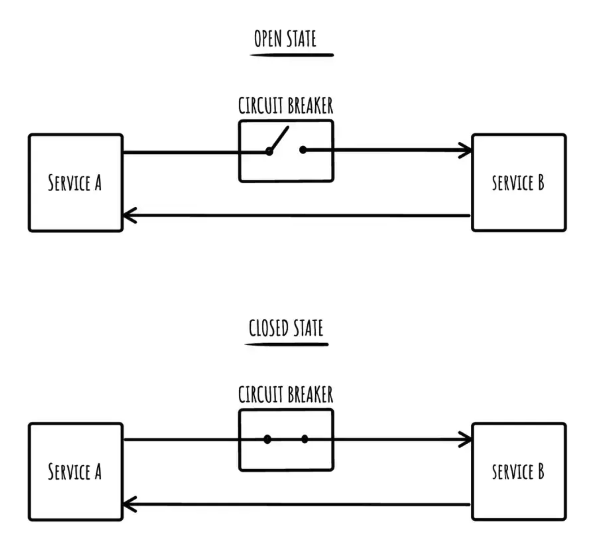
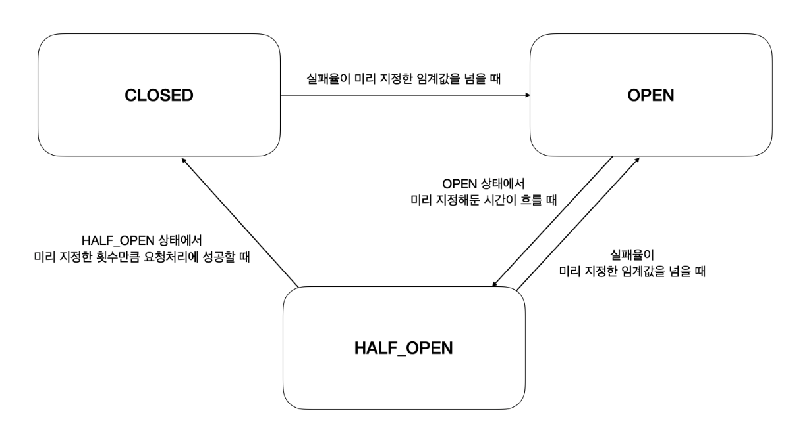

https://hyeon9mak.github.io/spring-circuit-breaker/
https://oliveyoung.tech/blog/2023-08-31/circuitbreaker-inventory-squad/
https://mangkyu.tistory.com/289
https://www.baeldung.com/spring-cloud-circuit-breaker
https://spring.io/projects/spring-cloud-circuitbreaker
https://docs.spring.io/spring-cloud-circuitbreaker/reference/spring-cloud-circuitbreaker-resilience4j/default-configuration.html

## CircuitBreaker란?

CircuitBreaker는 문제가 발생한 지점을 감지하고 실패하는 요청을 계속하지 않도록 방지하며, 이를 통해 시스템의 장애 확산을 막고 장애 복구를 도와주는 기능을 제공합니다. 위 그림과 같이 A가 B를 호출할 때, B가 반복적으로 실패한다면 CircuitBreaker를 Open하여 B에 대한 흐름을 차단하는 기능을 제공합니다.  

 

**CircuitBreaker를 지원하는 라이브러리**

* Netflix Hystrix (deprecated)
  * Netflix 에서 개발한 라이브러리로 MSA 환경에서 서비스 간 통신이 원활하지 않을 경우 각 서비스가 장애 내성과 지연 내성을 갖게 하는 라이브러리
* Resilience4j
  * Netflix Hystrix로 부터 영감을 받아 개발된 Fault Tolerance Library로 Java 전용으로 개발된 경량 라이브러리
  * CircuitBreaker, Bulkhead, RateLimiter, Retry, TimeLimiter 등의 여러 가지 코어 모듈이 존재합니다.

## 상태

CircuitBreaker는 3가지 상태가 있습니다.

* closed : 정상
  * 정상적인 상태로 임계치가 넘어가면 OPEN 상태로 변경됩니다.
* open : 장애
  * 장애 상태로 외부 요청을 차단하고 예외를 발생시키거나 fallback 함수를 호출합니다.
  * 장애 상태 판단 기준
    * slow call : 기준보다 오래 걸린 요청
    * failure call : 실패 혹은 오류 응답을 받은 요청
* helf open : 장애 이후 임계치 재측정 상태
  * open 상태가 된 이후 일정 요청 횟수/시간이 지난 뒤 open/closed 중 어떤 상태로 변경할지에 대한 판단이 다시 이뤄지는 상태입니다.

CircuitBreaker는 호출 결과를 저장하고 집계하기 위해 슬라이딩 윈도우를 사용합니다. 슬라이딩 윈도우는 마지막 N번의 호출 결과를 기반으로 하는 count-based sliding window(횟수 기반 슬라이딩 윈도우)와 마지막 N초의 결과를 기반으로 하는 time-based sliding window(시간 기반 슬라이딩 윈도우)가 있습니다. 

느린 호출율과 호출 실패율이 서킷브레이커에 설정된 임계값보다 크거나 같다면 closed에서 open으로 상태가 변경됩니다. 모든 예외 발생은 실패로 간주됩니다. (특정 예외만 예외 목록으로 지정하거나 ignore 등록 가능) 일정 호출 수가 기록된 후에 느린 호출율과 호출 실패율이 계산됩니다.  

CircuitBreaker는 서킷이 open 상태라면 CallNotPermittedException을 발생시킵니다. 그리고 특정 시간이 지나면 half open 상태로 바뀌고 설정된 수의 요청을 허용하여 동일하게 느린 호출율과 실패율에 따라 서킷의 상태를 open 또는 closed로 변경합니다.

Resilience4J는 일반 CircuitBreaker의 3가지 상태에 DISABLED와 FORCED_OPEN 이라는 2가지 상태를 추가로 지원합니다. 
* disabled : 서킷브레이커를 비활성화하여 항상 요청을 허용
* forced open : 강제로 서킷을 열어 항상 요청을 거부하는 상태

## Resilience4j Property

### close -> open
* failureRateThreshold 
  * 기본값 : 50
  * 실패율 임계치 백분율로 해당 값을 넘어갈 경우 open 상태로 전환
* slowCallDurationThreshold
  * 기본값 : 600000ms
  * 해당 설정값을 넘어서는 경우 slow call로 판단 
* slowCallRateThreshold
  * 기본값 : 100
  * slow call 임계값 백분율로 넘어가면 open 상태로 변경

### open -> half open
* waitDurationInOpenState
  * 기본값 : 600000ms
  * open 상태에서 half open 상태로 변경 대기 시간
* automaticTransitionFromOpenToHalfOpenEnabled
  * 기본값 : false
  * true이면 시간동안 대기하지 않고 half open으로 전환

### half open
* permittedNumberOfCallsInHalfOpenState
  * half open 상태일 때 허용할 call 개수

### half open -> open
* maxWaitDurationInHalfOpenState
  * 기본값 : 0
  * half open 상태에서 open 상태로 변경되기전까지 최대 유지 시간
  * 0인 경우 일부 허용된 call이 완료될 때까지 대기

### sliding window
* slidingWindowType
  * 기본값 : COUNT_BASED
  * 요청 결과를 기록할 sliding window 타입으로 COUNT_BASED, TIME_BASED 중 선택 
  * count based는 slidingWindowSize 요청 중 실패율이 설정된 임계값을 초과하면, time based는 slidingWindowSize 시간 동안 실패율이 설정된 임계값을 초과하면 서킷브레이커가 동작  
* slidingWindowSize
  * 기본값 : 100
  * sliding window 크기로 count_based 인 경우 개수, time_Based인 경우 초
* minimumNumberOfCalls
  * 기본값 : 100
  * failureRate, slowCallRate 비율을 계산하기 위한 최소 call 개수
  * 기본값이 100이라면 99번까지 실패해도 circuitBreaker가 동작하지 않음.
* recordExceptions
  * 실패로 기록할 Exception 리스트 (기본값: empty)
* ignoreExceptions
  * 실패나 성공으로 기록하지 않을 Exception 리스트 (기본값: empty)
* recordFailurePredicate
  * 기본값 : throwable -> true
  * failure로 집계할 exception인지 판단할 predicate
* ignoreExceptionPredicate
  * 기본값 : throwable -> false
  * failure로 집계하지 않을 exception인지 판단할 predicate

## spring 설정
