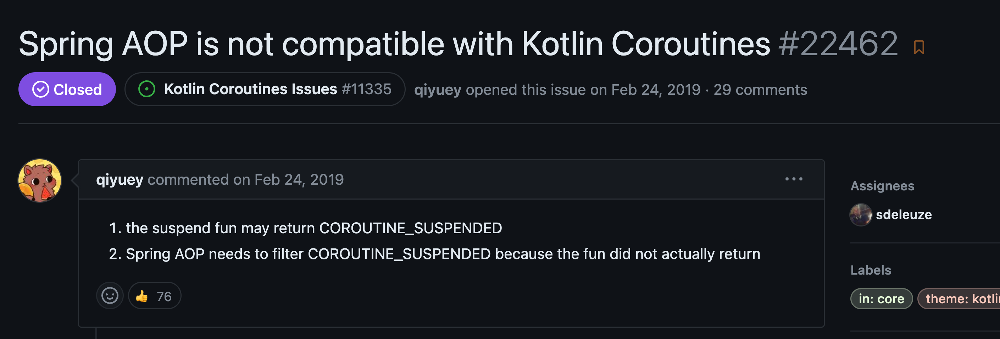

## Coroutine 환경에서 Spring AOP 사용하기


MVC 환경에서 AOP를 적용할 때는 위와 같이 적용하게 됩니다. 


일반적으로 AOP에서 advice를 정의할 때, 타겟 메서드 전후로 특정 서비스의 메서드를 호출하는 경우가 있을 수 있습니다. 여기서 Coroutine을 사용한다면 타겟 메서드 호출 전후로 suspend 함수를 호출해야하는 경우가 발생합니다. advice에서 suspend 함수를 호출하게 되면 위와 같이 suspend 함수를 호출하기 위해서는 현재 함수가 suspend 함수이거나 coroutine 환경이어야된다는 메시지가 표기됩니다.


그렇다면 에러 메시지에서 제시한 해결책 중에 간단해보이는 해결책인 advice 함수에 suspend 키워드를 붙이고 실행시켜보면 아래와 같은 메시지가 표기됩니다.


2개의 인자를 예상했는데 1개의 인자만 들어왔다는 에러 메시지가 표기됩니다. coroutine의 경우 CPS 패턴을 사용하기 때문에 suspend 키워드가 붙은 함수는 컴파일되면 함수의 마지막 인자로 continuation이 추가되게 되는데 아직까지 advice 함수에서는 이를 지원하지 않기 때문에 해당 메시지가 표기된 것으로 보입니다. CPS 패턴은 포스팅 가장 마지막에 따로 설명하겠습니다.

그렇다면 에러 메시지에서 보여준 해결책 중 coroutine 환경에서 suspend 함수를 호출해야할 것 같습니다. 



> https://github.com/spring-projects/spring-framework/issues/22462

사실 Spring AOP에서 coroutine 지원에 대한 논의는 오래전부터 있었습니다. 해당 이슈의 코멘트를 보면 아래와 같이 advice에서 coroutine을 사용할 수 있는 샘플도 확인할 수 있습니다.

```kotlin
// https://gist.github.com/pjanczyk/5d958821bafd911a5996bc0b66788ea3#file-aopwithcoroutines-kt-L92

// continuation을 사용하여 suspend 함수를 호출하는 기능을 제공하는 확장 함수
fun ProceedingJoinPoint.runCoroutine(
    block: suspend () -> Any?,
): Any? = block.startCoroutineUninterceptedOrReturn(this.coroutineContinuation())

// 마지막 인자인 continuation 을 가져오는 확장 함수
@Suppress("UNCHECKED_CAST")
fun ProceedingJoinPoint.coroutineContinuation(): Continuation<Any?> {
    return this.args.last() as Continuation<Any?>
}

// continuation을 제외한 인자를 가져오는 확장 함수
fun ProceedingJoinPoint.coroutineArgs(): Array<Any?> {
    return this.args.sliceArray(0 until this.args.size - 1)
}

// 실질적인 target 함수 호출에 호출 continuation을 전달하는 확장 함수
suspend fun ProceedingJoinPoint.proceedCoroutine(
    args: Array<Any?> = this.coroutineArgs(),
): Any? = suspendCoroutineUninterceptedOrReturn { continuation ->
    this.proceed(args + continuation)
}
```
코드를 간단하게 설명해보자면 다음과 같습니다.


**startCoroutineUninterceptedOrReturn**


> Starts an unintercepted coroutine without a receiver and with result type T and executes it until its first suspension. Returns the result of the coroutine or throws its exception if it does not suspend or COROUTINE_SUSPENDED if it suspends. In the latter case, the completion continuation is invoked when the coroutine completes with a result or an exception.

전달받은 Continuation을 가지고 suspend 함수 block을 실행할 수 있도록 합니다.


**suspendCoroutineUninterceptedOrReturn**


> [코루틴 공식 가이드 자세히 읽기](https://myungpyo.medium.com/%EC%BD%94%EB%A3%A8%ED%8B%B4-%EA%B3%B5%EC%8B%9D-%EA%B0%80%EC%9D%B4%EB%93%9C-%EC%9E%90%EC%84%B8%ED%9E%88-%EC%9D%BD%EA%B8%B0-part-2-dive-1-4c468828319)
> 전달된 코드 블럭에서 호출 코루틴(Continuation) 정보에 접근할 수 있도록 해줍니다. 또한, 전달된 코드 블럭에서 COROUTINE_SUSPENDED 라는 미리 정의된 값을 반환할 경우에는 코루틴이 처리를 위해 시간이 필요하여 값을 바로 반환하지 않고 처리가 완료되면 continuation 파라미터를 통해 결과를 전달할 것임을 나타내고, 그 이외의 값을 반환할 경우에는 중단 없이 바로 결과 값을 반환한 것을 나타냅니다.

jointPoint.proceed()의 타겟 메서드가 suspend 함수이기 때문에 마지막 인자로 continuation을 넘겨주기 위해 사용한다고 보시면 됩니다. 

확장함수를 사용해서 아래와 같이 처리할 수 있습니다.

```kotlin
@Aspect
@Component
class TestAspect(
    private val suspendService: SuspendService
) {

    @Around("@annotation(com.example.aopwithtransaction.aop.Logging)")
    fun logging(joinPoint: ProceedingJoinPoint): Any? {

        return joinPoint.runCoroutine {
            suspendService.intercept("전처리")

            val result = joinPoint.proceedCoroutine()

            suspendService.intercept("후처리")
            
            result
        }
    }
}
```

위와 같이 처리하면 Coroutine 환경에서도 AOP를 사용할 수 있습니다.

그런데 굳이 이렇게 까지 해야할까. 너무 복잡한 것 같은데 라는 생각이 들었습니다. (suspendCoroutineUninterceptedOrReturn과 startCoroutineUninterceptedOrReturn 두 함수의 사용이 코드의 복잡성을 증가시킨다는 느낌이 들었습니다.)


## 6.1.0 버전 이상 부터는
spring에서 coroutine의 호환성을 대응하기 시작하면서 spring aop에 관련된 대응도 진행되기 시작했습니다.


코멘트를 확인 해보면 6.1.0-RC1 버전부터는 advice에서 타겟메서드가 suspend 함수인 경우 Mono를 리턴한다고 합니다.


실제로 advice 타겟 메서드가 suspend 함수인 경우 Mono를 리턴하는 것을 확인할 수 있습니다. 

advice 함수에서 mono를 반환해도 문제가 없다면 **advice 함수에서 suspend 함수를 실행하는 mono를 반환하면 앞서 구현한 방식보다 더 간단하게 처리할 수 있지 않을까?** 라는 생각이 들었습니다. 이에 대한 힌트는 Webflux가 어떻게 coroutine을 처리하는지에서 확인할 수 있었습니다.

Spring webflux의 HTTP 요청은 DisptacherHandler -> HandlerAdaptor 순으로 받게 됩니다.


HandlerAdaptor의 구현체인 RequestMappingHandlerAdpater를 보면 요청에 따른 매핑 method를 찾아서 invoke하는 부분이 있습니다.


invoke를 더 타고 들어가다 보면 suspend 함수인 경우 CoroutinesUtils.invokeSuspendingFunction를 호출하게 됩니다. CoroutinesUtils.invokeSuspendingFunction를 따라가다 보면 아래와 같은 코드를 보게 됩니다.


**MonoKt.mono** 메서드는 코루틴 컨텍스트와 람다 함수를 받아 Mono를 생성합니다. 람다 내부에서 **KCallables.callSuspendBy(function, argMap, continuation)**를 호출하여 실제 suspend 함수를 실행합니다. 이 과정을 통해 suspend 함수가 Project Reactor의 Mono로 변환됩니다. 이렇게 함으로써 코루틴 기반의 비동기 코드를 리액티브 스트림과 호환되는 형태로 변환할 수 있습니다.

그렇다면 다시 돌아와서 Advice 함수를 다음과 같이 수정할 수 있습니다.


더 이상 이전처럼 확장함수를 사용할 필요 없이 mono를 한번 감싸주면 잘 동작합니다.


## @Transactional과 AOP를 사용하는 경우 AOP가 무시되는 경우
```kotlin
@Service
class TargetService() {
    private val log = KotlinLogging.logger { }

    @Logging
    @Transactional
    suspend fun aop(): String {
        delay(100)
        log.info { "aop target method call" }

        return "ok"
    }
}
```
```kotlin
@Aspect
//@Order(1) 
@Component
class LoggingAspect {

    private val log = KotlinLogging.logger {}

    @Around("@annotation(com.example.aopwithtransaction.aop.Logging)")
    fun logging(joinPoint: ProceedingJoinPoint): Any? {
        return mono {
            log.info { "Aop Logging started" }

            val result = joinPoint.proceed().let { result ->
                if (result is Mono<*>) {
                    result.awaitSingleOrNull()
                } else {
                    result
                }
            }

            log.info { "Aop Logging completed" }

            result
        }
    }
}
```

@Logging 애노테이션과 @Transactional을 함께 붙여서 실행시켜 보면 advice가 동작하지 않고 @Order 애노테이션을 명시해야만 advice가 동작하는 이슈가 있습니다. 

> https://github.com/spring-projects/spring-framework/issues/33095

원인파악이 잘 안돼서 spring에 이슈를 남겼고 버그라고 답변을 받았습니다. 6.1.11 버전에서 수정되었습니다.


## CPS 패턴

Kotlin 은 비동기 프로그래밍을 지원을 위해 CSP(Communicating Sequential Process) 기법을 사용합니다. Suspend 함수는 Suspension point(중단점)을 제공하여 함수가 중단될 수 있도록 하며, 이를 통하여 blocking 로직으로부터 벗어나서 비동기로 동작할 수 있도록 합니다. Kotlin 은 이 중단점을 제공하기 위해 Suspend 함수를 컴파일 할 때, 함수 마지막 인자로 Continuation 이라는 객체를 추가합니다.

```kotlin
// Kotlin 
suspend fun makeHelloWorld(): String

// 위 Kotlin 코드를 아래와 같은 Java 코드로 변환 

// Java/JVM 
fun makeHelloWorld(@NotNull `$completion`: Continuation?): Any? 
```

continuation은 다음과 같은 구조를 가지고 있습니다.

```kotlin
interface Continuation<in T> {
	val context: CoroutineContext
	fun resumeWith(result: Result<T>)
}
```
continuation은 resumeWith 호출로 결과값을 전달해 원래 함수를 재개시키는 기능을 제공합니다. 함수를 일시중지 시키고 재개하려면 어디까지 진행했고 어디서부터 다시 재개해야 하는지 알고 있어야 합니다. 이는 코틀린 컴파일러가 코드를 변환할 때 label을 두어 표시합니다.

```kotlin
suspend fun makeHelloWorld(): String {
    val msg = "hello world"
    delay(1000)
    return msg
}
```
위 코드는 디컴파일해보면 다음과 같습니다.


위 그림을 보면 중단되는 포인트(suspension point)마다 label을 통해 case로 나누고 해당 케이스마다 결과값들을 continuation에 저장하여 상태관리하는 것을 확인할 수 있습니다.  

그렇다면 이렇게 만들어진 함수는 continuation에서 어떻게 호출되는지를 Continuation 의 구현체인 BaseContinuationImpl의 resumeWith로 살펴보겠습니다.


invokeSuspend 함수 호출부가 바로 앞서 만들었던 makeHelloWorld 함수를 호출하는 부분입니다. 해당 함수의 리턴 값이 COROUTINE_SUSPENDED라면 해당 함수를 return해버립니다. 즉, 중단지점이 없는 경우라면 while문의 반복으로 앞선 switch case문들이 계속 돌아가면서 타겟함수의 수행이 완료되는 것이고, 중단지점이 존재한다면 COROUTINE_SUSPENDED를 리턴 받으면서  특정 switch문까지만 진행되고 일시중지되었다가 해당 작업이 완료되면 코루틴 프레임워크에 의해 자동으로 resumeWith가 호출되면서 다시 작업이 이어지는 것입니다.


**참고**
* [spring 이슈](https://github.com/spring-projects/spring-framework/issues/22462#issuecomment-1683102470)
* [kotlinCoroutineKR](https://github.com/hikaMaeng/kotlinCoroutineKR#%EC%BD%94%EB%A3%A8%ED%8B%B4-%EB%82%B4%EC%9E%A5%ED%95%A8%EC%88%98)
* [코루틴 공식 가이드 자세히 읽기 — Part 2— Dive 1](https://myungpyo.medium.com/%EC%BD%94%EB%A3%A8%ED%8B%B4-%EA%B3%B5%EC%8B%9D-%EA%B0%80%EC%9D%B4%EB%93%9C-%EC%9E%90%EC%84%B8%ED%9E%88-%EC%9D%BD%EA%B8%B0-part-2-dive-1-4c468828319)
* [코루틴 공식 가이드 자세히 읽기 — Part 5 — Dive 2](https://myungpyo.medium.com/%EC%BD%94%EB%A3%A8%ED%8B%B4-%EA%B3%B5%EC%8B%9D-%EA%B0%80%EC%9D%B4%EB%93%9C-%EC%9E%90%EC%84%B8%ED%9E%88-%EC%9D%BD%EA%B8%B0-part-5-dive-2-b4e7a1626c59)

