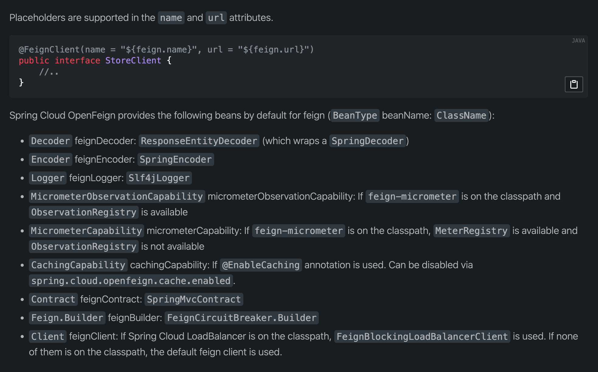

해당 포스트는 아래 버전을 기준으로 작성되었습니다.

* spring boot 3.2.2
* java 17

## open feign이란?
feign은 Netflix 에서 개발된 Http client binder로 REST Call을 위해 호출하는 클라이언트를 보다 쉽게 작성할 수 있도록 도와주는 라이브러리입니다. spring의 경우 **spring-cloud-starter-openfeign** 라이브러리 추가로 사용할 수 있습니다. spring cloud는 spring mvc annotation에 대한 지원과 sprinb web에서 사용되는 것과 동일한 HttpMessageConverters를 지원합니다.

## 의존성 및 client
### build.gradle.kts
```groovy
dependencies {
	implementation("org.springframework.cloud:spring-cloud-starter-openfeign")
	// okhttp
	implementation("io.github.openfeign:feign-okhttp")
	// apache
//    implementation("io.github.openfeign:feign-hc5")
	implementation("io.github.openfeign:feign-jackson")
}

extra["springCloudVersion"] = "2023.0.0"

dependencyManagement {
    imports {
        mavenBom("org.springframework.cloud:spring-cloud-dependencies:${property("springCloudVersion")}")
    }
}
```
Feign은 Apache HttpClient, OkHttp Client 등 다양한 HTTP 클라이언트를 주입 받아서 동작합니다. 특별한 설정을 하지 않으면 Feign이 제공하는 기본 클라이언트를 사용합니다. java 17버전 이전의 경우, 기본 클라이언트는 HttpURLConnection 클래스를 사용하기 때문에 동시성 문제가 발생할 수 있습니다. 따라서 공식 문서에 언급되어 있는 apache 또는 okhttp 사용이 권장됩니다. 

### application.yml
```yml
spring:
  cloud:
    openfeign:
	  # okhttp의 경우
      okhttp:
        enabled: true
	  # apache의 경우	
	  httpclient:
		hc5:
		  enabled: true
```
사용하는 client에 따라 application.yml에 설정을 해줍니다.

### @EnableFeignClients
```kotlin
@EnableFeignClients
@SpringBootApplication
class ClientApplication

fun main(args: Array<String>) {
    runApplication<ClientApplication>(*args)
}
```
@EnableFeignClients는 @FeignCleint 애노테이션이 붙은 클래스를 찾아다니면서 구현체를 만들어줍니다. 따라서 root package에 있어야 하며, 그렇지 않은 경우 basePackages 또는 basePackageClasses를 지정해줘야 합니다.

## @FeignClient
```kotlin
@FeignClient(name = "article")
interface ArticleClient {

    @PostMapping("/articles")
    fun save(@RequestBody articleSaveCommand: ArticleSaveCommand): ArticleResponse

    @GetMapping("/articles/{id}")
    fun get(@PathVariable id: String): ArticleResponse?

    @PatchMapping("/articles/{id}")
    fun update(@PathVariable id: String, @RequestBody articleUpdateCommand: ArticleUpdateCommand): ArticleResponse?

    @DeleteMapping("/articles/{id}")
    fun delete(@PathVariable id: String): ArticleResponse?
}
```

인터페이스만 위와 같이 만들어주고 사용하는 곳에서는 가져다 사용하면 됩니다.

```kotlin
@Component
class ArticleTest(
	private val articleClient: ArticleClient,
) {

    fun test() {
        articleClient.save(command)
        articleClient.update(id, command)
        articleClient.delete(id)
        articleClient.get(id)
    }
}
```

### timeout
해당 클라이언트에 대한 url 및 timeout 설정은 application.yml에서 할 수 있습니다.
```yml
spring:
  cloud:
    openfeign:
      okhttp:
        enabled: true
      client:
        config:
          article: # feign client name
            url: http://localhost:8081
            connectTimeout: 3000
            readTimeout: 3000
		  default:
			connectTimeout: 3000
			readTimeout: 3000
```
**spring.cloud.openfeign.client.config.XXX**에 클라이언트에 대한 설정을 명시할 수 있습니다. 앞서 **@FeignClient(name = "article")**에 name이 article이므로 article 클라이언트에 대한 설정은 위와 같이 작성할 수 있습니다. 이외의 추가적인 client에 대한 properties는 **org.springframework.cloud.openfeign.support.FeignHttpClientProperties**에서 확인할 수 있습니다. 그리고 해당 properties를 사용하여 client를 만드는 과정은 **org.springframework.cloud.openfeign.FeignAutoConfiguration** 클래스에서 확인할 수 있습니다. 특정 client에 대한 설정이 아닌 global 설정은 default에서 설정할 수 있습니다.


### 로깅
feign
```yml
## 로깅 DEBUG 설정
logging.level.<packageName>.<className> = DEBUG
logging.level.<packageName> = DEBUG


# ex
logging.level.com.example.client.client.ArticleClient: DEBUG
```
feign에 대한 로깅을 활성화하려면 application.yml에 feign 클라이언트가 포함된 클래스나 패키지에 대해서 로깅 수준을 DEBUG로 설정해야 합니다.

```yml
spring:
	cloud:
	openfeign:
		client:
			config:
			article:
				# 로깅 레벨 설정  
				loggerLevel: basic
```
그리고 각 feign 클라이언트에 대한 로깅 수준을 설정할 수 있습니다.

* NONE : 로깅하지 않음(default)
* BASIC : 요청 method, url, 응답 상태 코드, 실행 시간
* HEADERS : basic + request, response header
* FULL : headers + body + meta data for both requests, response

## @FeignClient Configuration
```kotlin
@FeignClient(name = "article", configuration = [ArticleFeignConfig::class])
interface ArticleClient
```
@FeignClient의 configuration 속성으로 client에 적용될 default config를 override할 수 있습니다.



공식문서에 따르면 위와 같은 config가 default로 세팅됩니다.

### interceptor

```kotlin
@FeignClient(name = "article", configuration = [ArticleFeignConfig::class])
interface ArticleClient

@Configuration
class ArticleFeignConfig {

    @Bean
    fun authorizationHeaderInterceptor() = RequestInterceptor {
        it.header(HttpHeaders.AUTHORIZATION, "Bearer ${UUID.randomUUID()}")
    }
}
```
interceptor를 사용해서 헤더를 추가할 수 있습니다.

### error handling
```kotlin
@FeignClient(name = "article", configuration = [ArticleFeignConfig::class])
interface ArticleClient

@Configuration
class ArticleFeignConfig {

	@Bean
	fun errorDecoder(): ErrorDecoder {
		return ErrorDecoder { _, response ->
			when (response.status()) {
				401 -> RuntimeException("401 발생")
				500 -> RuntimeException("500 발생")
				else -> RuntimeException("전대미문 article error 발생!")
			}
		}
	}
}
```
기본적으로 feign 클라이언트에서 예외가 발생하면 FeignException이 발생합니다. ErrorDecoder를 구현해서 빈으로 등록하면 Error처리를 별도로 핸들링할 수 있습니다. 

### retry
```kotlin
@FeignClient(name = "article", configuration = [ArticleFeignConfig::class])
interface ArticleClient

@Configuration
class ArticleFeignConfig {

	@Bean
	fun retryer(): Retryer {
		// 1초를 시작으로 1.5를 곱하면서 재시도
		// 재시도 최대 간격은 2초
		// 최대 3번까지만 재시도
		return Retryer.Default(1000, 2000, 3)
	}
}
```
retryer의 경우 별도로 등록하지 않으면 Retryer.NEVER_RETRY 타입의 retryer 빈이 자동으로 등록되어 재시도를 비활성화합니다. 하지만 retryer 빈을 위와 같이 별도로 등록하 경우, IOException이 발생하거나 errorDecoder에서 retryableException이 발생하게 되면 재시도를 수행합니다.

```kotlin
@FeignClient(name = "article", configuration = [ArticleFeignConfig::class])
interface ArticleClient

@Configuration
class ArticleFeignConfig {

	@Bean
	fun retryer(): Retryer {
		return Retryer.Default(1000, 2000, 3)
	}

	@Bean
	fun errorDecoder(): ErrorDecoder {
		return ErrorDecoder { _, response ->
			when (response.status()) {
				401 -> RuntimeException("401 발생")
				500 ->
					RetryableException(
						response.status(),
						"500 에러 발생, 재시도합니다.",
						response.request().httpMethod(),
						1, // retryer에서 설정한 최대 시간보다는 작아야함.
						response.request(),
					)

				else -> RuntimeException("전대미문 article error 발생!")
			}
		}
	}
}
```


## file up / download
아직까지 feign에서는 request에 대한 stream upload를 지원하진 않고, stream download만 지원합니다. 

**feign file stream 관련 이슈**
> https://github.com/OpenFeign/feign/issues/220
> https://github.com/OpenFeign/feign/issues/1243

기본적으로 feign client에는 별도의 설정이 없다면 FeignClientsConfiguration클래스의 feignEncoder 메서드로 인해 SpringEncoder가 빈으로 등록됩니다. 그리고 해당 코드를 따라 들어가다 보면 SpringEncoder가 등록되는데 아래와 같은 코드로 등록됩니다.

```java
@Configuration(proxyBeanMethods = false)
public class FeignClientsConfiguration {
    
    @Bean
    @ConditionalOnMissingBean
    @ConditionalOnMissingClass("org.springframework.data.domain.Pageable")
    public Encoder feignEncoder(ObjectProvider<AbstractFormWriter> formWriterProvider,
    ObjectProvider<HttpMessageConverterCustomizer> customizers) {
        return springEncoder(formWriterProvider, encoderProperties, customizers);
    }

	private Encoder springEncoder(ObjectProvider<AbstractFormWriter> formWriterProvider,
	FeignEncoderProperties encoderProperties, ObjectProvider<HttpMessageConverterCustomizer> customizers) {
		AbstractFormWriter formWriter = formWriterProvider.getIfAvailable();

		if (formWriter != null) {
			return new SpringEncoder(new SpringPojoFormEncoder(formWriter), messageConverters, encoderProperties,
			customizers);
		}
		else {
			return new SpringEncoder(new SpringFormEncoder(), messageConverters, encoderProperties, customizers);
		}
	}
}
```

spring-cloud-starter-openfeign 의존성에 의해 spring web에서 사용하는 messageConverters가 주입되기 때문에 별도의 세팅 없이 multipart/form-data 형식의 데이터를 처리할 수 있습니다. 따라서 업로드의 경우에는 multipart/form-data를 사용할 수 있습니다.


```kotlin
@FeignClient(name = "article", configuration = [ArticleFeignConfig::class])
interface ArticleClient {

    @PostMapping(value = ["/upload"], consumes = [MediaType.MULTIPART_FORM_DATA_VALUE])
    fun upload(@RequestPart file: MultipartFile): String

    @GetMapping("/download/{path}")
    fun download(@PathVariable path: String): Response
}
```

download의 경우에는 feign package의 Response 클래스를 사용하여 아래와 같이 스트림으로 처리할 수 있습니다.

```kotlin
@RestController
class ArticleController(
    private val articleClient: ArticleClient,
) {

    @GetMapping("/download/{path}")
    fun download(@PathVariable path: String, response: HttpServletResponse) {

        articleClient.download(path).body().asInputStream().use { ins ->
            response.outputStream.use { os -> ins.transferTo(os) }
        }
    }
}
```


**참고**
* [공식문서](https://docs.spring.io/spring-cloud-openfeign/docs/current/reference/html/#spring-cloud-feign)

