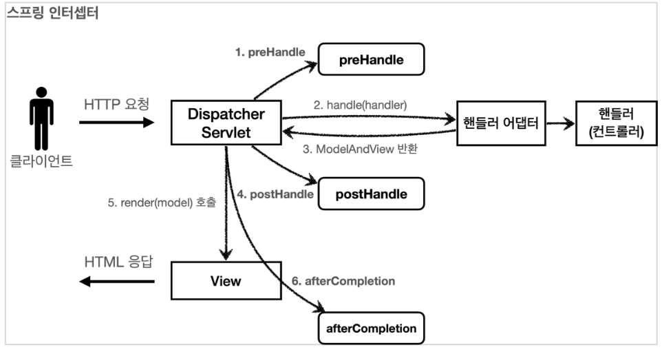

## Spring의 요청 Flow


> HTTP 요청 -> WAS -> 필터 -> 서블릿(디스패치) -> 스프링 인터셉터 -> 컨트롤러

Spring은 위와 같은 flow를 가지고 있습니다.

## 필터

필터는 서블릿이 지원하고 서블릿 앞에서 동작하면서 공통 관심 사항 처리 및 부가 기능을 수행합니다. 필터를 적용하면 필터가 호출된 다음에 서블릿이 호출되기 때문에 서블릿이 호출되기 전에 부가적인 작업을 하거나 서블릿 호출을 막을 수 있습니다. 예를 들면, 모든 요청에 대한 로그를 남긴다든지, 특정 url 패턴으로 들어온 요청을 막는다든지, 비 로그인 사용자에 대한 접근을 막는다든지에 대한 기능을 수행할 수 있습니다. 특히, 필터는 적절한 요청이 아니라고 판단되면 서블릿 호출전에 끝낼 수 있기 때문에 로그인 여부를 체크하기에 좋습니다. 스프링 시큐리티도 필터를 사용하여 구성되어 있습니다.

```java
public interface Filter {

    public default void init(FilterConfig filterConfig) throws ServletException {}
   
    public void doFilter(ServletRequest request, ServletResponse response,
            FilterChain chain) throws IOException, ServletException;

    public default void destroy() {}
}
```
Spring에서 제공하는 필터 인터페이스는 위와 같이 구성되어 있습니다. 그리고 __필터는 서블릿 컨테이너가 싱글톤 객체로 생성하고 관리합니다.__
+ init
    - 필터 초기화 메서드
    - 서블릿 컨테이너가 생성될 때 호출
+ doFilter
    - 요청이 들어올 때마다 호출
    - 필터의 로직을 구현하는 부분
+ destroy
    - 필터 종료 메서드
    - 서블릿 컨테이너가 종료될 때 호출

보통 Filter를 만들어 사용하게 된다면 `OncePerRequestFilter` 를 상속한 클래스를 만들어 사용하게 됩니다. `OncePerRequestFilter`는 네이밍처럼 Http Request의 한 번의 요청에 대해 한 번만 실행하는 Filter입니다. 예를 들어 Forwarding이 발생하는 Filter Chain이 다시 동작하여 인증처럼 딱 한번만 진행해도 되는 Logic이 불필요하게 여러번 수행될 수 있습니다. 그래서 보통 Filter를 만들어서 사용한다고 하면 `OncePerRequestFilter`를 만들어 사용하게 됩니다. 

<br>

### 필터 생성
```kotlin
class SampleFilter : OncePerRequestFilter() {

    override fun doFilterInternal(
        request: HttpServletRequest,
        response: HttpServletResponse,
        filterChain: FilterChain
    ) {
        if (!DEFAULT_ANT_PATH_REQUEST_MATCHER.matches(request)) {
            return filterChain.doFilter(request, response)
        }

        try {
            // 다음 필터로 보내기 전에 특정 작업 수행..
            filterChain.doFilter(request, response)
            // 필터 통과 후 후처리 작업
        } catch (e: Exception) {
            // 
        }
    }
  
    companion object {
        private val DEFAULT_ANT_PATH_REQUEST_MATCHER = AntPathRequestMatcher(
            "/authorize/test",
            "POST",
        )
    }
}
```
특정 경우에는 아무런 로직 없이 다음 필터로 진행되고, 조건에 맞으면 다음 필터로 보내기 전, 후처리 작업을 수행할 수 있습니다.


### 필터 등록
필터를 등록하는 방법은 대표적으로 3가지가 있습니다.

```kotlin
@Component
@Order(Integer.MIN_VALUE)
class SampleFilter : OncePerRequestFilter() {
}
```

빈 등록 후 order로 필터 순서를 조정할 수 있습니다.

```kotlin
class WebConfig {
    
    @Bean
    fun sampleFilter(): FilterRegistrationBean<SampleFilter> {
        val filterRegistrationBean = FilterRegistrationBean<SampleFilter>()
        filterRegistrationBean.setFilter(SampleFilter())
        filterRegistrationBean.setOrder(1)
        filterRegistrationBean.addUrlPatterns("/*")
        return filterRegistrationBean
    }
}
```

FilterRegistrationBean을 사용하여 마찬가지로 등록할 수 있습니다.
+ setFilter
    - 원하는 필터 지정
+ setOrder
    - 필터체인의 순서 등록
+ addUrlPatterns
    - 어떤 URL 패턴에 필터를 적용할지 지정
    - 여러 패턴 지정 가능


```kotlin
@Bean
fun SecurityFilterChain(
  http: HttpSecurity,
): SecurityFilterChain {

    http.addFilterAfter(
        SampleFilter(),
        SecurityContextHolderFilter::class.java,
    )

    return http.build()
}
```
Spring Security를 사용한다면 특정 필터 앞, 뒤를 지정해서 등록 할 수도 있습니다. 

### 예외 처리
필터에서 예외가 발생하는 경우, Spring에서 일반적으로 사용하는 @RestControllerAdvice 를 통해 처리할 수 없습니다. 따라서 Filter에서 발생하는 예외를 처리하고자 한다면 예외 처리 필터를 추가해서 처리해줘야 합니다. order를 Integer.MIN_VALUE 로 세팅해주면 가장 먼저 필터가 등록되므로 필터에서 발생하는 예외를 처리할 수 있습니다.

```kotlin
@Component
@Order(Integer.MIN_VALUE)
class ExceptionHandlingFilter : OncePerRequestFilter() {
    override fun doFilterInternal(request: HttpServletRequest, response: HttpServletResponse, filterChain: FilterChain) {
        runCatching {
        filterChain.doFilter(request, response)
        }.onFailure { e ->
            logger.error("occurred error! msg: ${e.message}", e)
            response.status = HttpStatus.UNAUTHORIZED.value()
            response.writer.write(e.message ?: "unknown error.")
        }
    }
}
```

## 인터셉터

인터셉터는 필터와 달리 스프링 MVC가 제공하는 기술입니다.

>HTTP 요청 -> WAS -> 필터 -> 서블릿(디스패치) -> 스프링 인터셉터 -> 컨트롤러

필터와 마찬가지로 공통 관심 사항 및 부가 기능을 담당하지만, 컨트롤러 앞에서 동작하고 필터보다 더 편리하고 정교하며 더 많은 기능을 제공합니다. 따라서 __필터를 사용해야하는 상황이 아니라면 인터셉터를 사용하는 것이 더 편리할 수 있습니다.__ 인터셉터도 컨트롤러의 호출 전에 동작해서 적절하지 않은 요청이라면 컨트롤러를 호출하지 않고 끝낼 수 있습니다.
```java
public interface HandlerInterceptor {
	
	default boolean preHandle(HttpServletRequest request, HttpServletResponse response, Object handler)
			throws Exception {

		return true;
	}

	default void postHandle(HttpServletRequest request, HttpServletResponse response, Object handler,
			@Nullable ModelAndView modelAndView) throws Exception {
	}

	default void afterCompletion(HttpServletRequest request, HttpServletResponse response, Object handler,
			@Nullable Exception ex) throws Exception {
	}
}
```
필터의 경우 단순하게 doFilter 메서드에서 chain.doFilter를 기준으로 호출 전과 호출 후의 과정을 분리해서 사용해야 했습니다. 하지만 인터셉터의 경우 호출전(preHandle), 호출 후(postHandle), 요청 완료 이후(afterCompletion)로 세분화 되어 있습니다. 또한, 어떤 컨트롤러(handler)가 호출되는지, 어떤 modelAndView가 반환되는지 응답 정보도 받을 수 있습니다.


+ preHandle
    - 디스패처가 컨트롤러 찾고 어뎁터로 넘기기 전에 실행
    - 응답 값이 true이면 다음으로 진행
    - 응답 값이 false이면 더이상 진행 X
+ postHandle
    - 컨트롤러가 수행을 끝내고 어댑터가 ModelAndView를 디스패처 서블릿에 반환한 후에 실행
    - __컨트롤러에서 예외가 발생한다면 호출 X__
+ afterCompletion
    - 뷰가 랜더링 된 이후에 수행
    - __항상 호출되므로 예외가 발생해도 작동하며 ex로 예외 정보 획득 가능.__

### 인터셉터 생성
```kotlin
class SampleInterceptor: HandlerInterceptor {
    override fun preHandle(request: HttpServletRequest, response: HttpServletResponse, handler: Any): Boolean {
        // 전처리 로직 수행
        request.setAttribute("key", "value")
        return true // true 라면 진행되고 false라면 이후 호출 과정 중단
    }

    override fun postHandle(request: HttpServletRequest, response: HttpServletResponse, handler: Any, modelAndView: ModelAndView?) {
        // 후처리 로직, ex가 발생되었다면 호출되지 않음.
        val value = request.getAttribute("key")
    }

    override fun afterCompletion(request: HttpServletRequest, response: HttpServletResponse, handler: Any, ex: Exception?) {
        // 무조건 호출되는 로직 수행
    }
}
```
인터셉터는 HandlerInterceptor를 구현해서 만들면 되는데 default이므로 필요한 메서드만 선택해서 만들면 됩니다. 필터의 경우 chain.doFilter로 앞뒤 과정이 분류되지만 결과적으로는 하나의 메서드 안에서 동작하기 때문에 지역변수를 공유해서 사용할 수 있었습니다. 하지만 인터셉터의 경우 메서드가 분리되어 있기 때문에 공유할 수 없고, 싱글톤으로 관리되기 때문에 전역변수로도 사용할 수 없습니다. 따라서 이때는 request에다가 Attribute로 값을 실어 보내거나 MDC를 사용할 수도 있습니다.

### 인터셉터 등록
```java
@Configuration
class WebConfig : WebMvcConfigurer {
    override fun addInterceptors(registry: InterceptorRegistry){
        registry.addInterceptor(SampleInterceptor()) // 인터셉터 등록
        .order(1) // 순서
        .addPathPatterns("/**") // 등록 패턴
        .excludePathPatterns("/css/**","/*.ico","/error") // 제외 패턴
    }
}
```
인터셉터의 등록의 경우, WebMvcConfigurer를 구현하고 addInterceptors를 재정의 해주면 됩니다. __앞서 필터에서 등록한 URL 경로와 스프링이 제공하는 URL 경로는 완전히 다릅니다.__ 더욱 자세하고 상세하게 설정할 수 있는데 이는 [공식문서](https://docs.spring.io/spring-framework/docs/current/javadoc-api/org/springframework/web/util/pattern/PathPattern.html)를 확인해보시길 바랍니다.

### 예외 처리

인터셉터의 경우, 필터와 달리 @RestControllerAdvice에서 처리할 수 있습니다.
```kotlin
@RestControllerAdvice
class GlobalExceptionHandler {

    private val logger = KotlinLogging.logger {}

    @ResponseStatus(value = HttpStatus.INTERNAL_SERVER_ERROR)
    @ExceptionHandler(RuntimeException::class)
    fun processRuntimeException(e: Exception, request: HttpServletRequest): ResponseEntity<String> {
        logger.error(
            "occurred error!: ${e.message} ${request.method} ${request.requestURI} ${request.queryString.orEmpty()}",
            e,
        )
        return ResponseEntity.status(HttpStatus.INTERNAL_SERVER_ERROR)
            .body(e.message)
    }
}
```