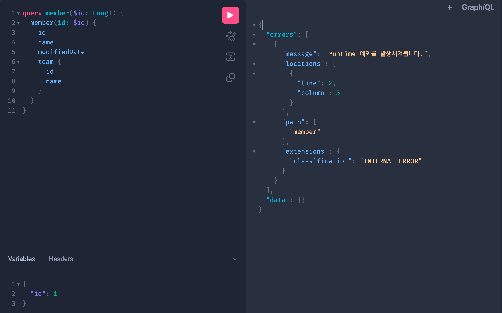

## GraphQL 이란?
Graph QL(이하 gql)은 Structed Query Language(이하 sql)와 마찬가지로 쿼리 언어입니다. 하지만 gql과 sql의 언어적 구조 차이는 매우 큽니다. 또한 gql과 sql이 실전에서 쓰이는 방식의 차이도 매우 큽니다. gql과 sql의 언어적 구조 차이가 활용 측면에서의 차이를 가져왔습니다. 이 둘은 애초에 탄생 시기도 다르고 배경도 다릅니다. sql은 데이터베이스 시스템에 저장된 데이터를 효율적으로 가져오는 것이 목적이고, gql은 웹 클라이언트가 데이터를 서버로 부터 효율적으로 가져오는 것이 목적입니다. sql의 문장(statement)은 주로 백앤드 시스템에서 작성하고 호출 하는 반면, gql의 문장은 주로 클라이언트 시스템에서 작성하고 호출 합니다.

**SQL 쿼리 예시**
```sql
SELECT * FROM member;
```

**gql 쿼리 예시**
```graphql
query team($id: Long!) {
     team(id: $id) {
        id
        name
        registeredBy
        registeredDate
        modifiedBy
        modifiedDate
    }
}
```


[graphQL 공식 문서](https://graphql.org/learn/)에서는 graphQL을 API용 쿼리 언어이자, 데이터에 대해 정의한 타입 시스템을 사용하여 쿼리를 실행하기 위한 server runtime 이라고도 소개합니다. 서비스 측면에서 graphQL 서비스는 API가 노출하는 데이터 구조를 설명하는 runtime layer를 제공하는데 runtime layer는 graphQL 요청을 파싱하고 각 필드에 대해 적절한 데이터 페처(resolver)를 호출하는 역할을 담당합니다. 여기서 개발자는 각 필드에 대한 데이터 페처(resolver)를 구현하게 됩니다.

서버사이드 gql 어플리케이션은 gql로 작성된 쿼리를 입력으로 받아 쿼리를 처리한 결과를 다시 클라이언트로 돌려줍니다. HTTP API 자체가 특정 데이터베이스나 플렛폼에 종속적이지 않은것 처럼 마찬가지로 gql 역시 어떠한 특정 데이터베이스나 플렛폼에 종속적이지 않습니다. 심지어 네트워크 방식에도 종속적이지 않습니다. 일반적으로 gql의 인터페이스간 송수신은 네트워크 레이어 L7의 HTTP POST 메서드와 웹소켓 프로토콜을 활용합니다.  

### GraphQL vs Rest API 


REST API는 URL, METHOD등을 조합하기 때문에 다양한 Endpoint가 존재 합니다. 반면, gql은 단 하나의 Endpoint가 존재 합니다. 또한, gql API에서는 불러오는 데이터의 종류를 쿼리 조합을 통해서 결정 합니다. 예를 들면, REST API에서는 각 Endpoint마다 데이터베이스 SQL 쿼리가 달라지는 반면, gql API는 gql 스키마의 타입마다 데이터베이스 SQL 쿼리가 달라집니다.

Rest API는 HTTP 요청방식 (GET, POST, PUT DELETE 등)을 사용하여 데이터를 요청하고 응답받습니다. 따라서, 상황에 따라 다른 Method를 사용해야하고 api별로 각각의 다른 end point를 갖습니다. 반면, GraphQL은 동일하게 HTTP 요청방식을 사용하지만 POST만 사용하고 단일 end point를 사용합니다. 그리고 gql API에서 응답받는 데이터는 쿼리 조합을 통해 결정됩니다. 위 그림에서 Rest API의 경우 post, comment, author 데이터를 조회하기 위해서는 3번의 호출이 필요했지만, graphql에서는 하나의 쿼리 요청에 3가지 데이터를 포함할 수 있기 때문에 한번의 네트워크 호출로 처리할 수 있습니다. 

Rest API를 사용하면 같은 url을 사용할 경우 항상 동일한 응답 결과를 받게 됩니다. 경우에 따라 응답 데이터의 모든 필드가 필요하지 않을 수 있는데 모두 받게 되어 over fetching이 발생하는 경우가 있습니다. 하지만 GraphQL 의 경우 응답 데이터의 필요한 필드만 선택해서 받을 수 있습니다.

### Schema
> GraphQL 스키마는 namespace를 지원하지 않습니다. 따라서 모든 Object의 이름이 중복되면 안됩니다.

**Object**
```graphql
type Book {
    id : Int
    name : String!
    author: String!
    price: Float
    ratings: [Rating]
}

type Rating {
    id: Int
}
```
GraphQL의 스키마는 object 타입으로 구성되며, 기본적으로 아래와 같은 scalar 타입을 제공합니다.

* INT
* Float
* String
* Boolean
* ID

`!`는 non-null을 의미하며, 대괄호([])는 리스트를 의미합니다.  

**Enum**
자바와 유사한 ENUM 타입도 제공됩니다.
```graphql
enum Episode {
    NEWHOPE
    EMPIRE
    JEDI
}
```

**interface**
자바와 유사한 Interface 타입도 제공됩니다.

```graphql
interface Character {
    id: ID!
    name: String!
}

type Human implements Character {
    id: ID!
    name: String!
    age: Int!
}

type Droid implements Character {
    id: ID!
    name: String!
    expiredAt: String!
}
```

**Mutation과 Query**
Rest API에서는 HTTP method(GET, POST..)를 사용했던 것처럼 GraphQL에는 3가지 Operation이 존재합니다.

* query : 조회(read)
* mutation : 쓰기(write)
* subscription : 지속적인 읽기(websocket)

```graphql
type Query {
    hero(episode: Episode!): Character
}

type Mutation {
    addBook(name: String!, author: String!, publisher: String!, price: Float!): BookInfo!
}
```
최종적으로 client가 호출하게 되는 API 명세라고 봐도 무방합니다.

**Input**
스칼라 인자로 API를 정의하는 대신, input type이라는 복잡한 객체를 정의할 수 있습니다. 바로 위의 Mutation의 경우 스칼라 인자가 4개 이상이므로 input type으로 처리할 수 있습니다.
```graphql
type Mutation {
    addBook(input: BookInput!): BookInfo!
}

input BookInput {
    name : String
    author: String
    publisher: String
    price: Float
}
```

**Fragment**
Fragment는 쿼리에서 반복적으로 사용되는 필드 목록을 묶는 단위로 복잡성을 낮추고 재사용성을 위해 사용됩니다.
```graphql
query {
    lauches() {
        lauch_year
        rocket {
            rocket_name
            rocket {
                ...RocketDetail
            }
        }
    }
    rockets {
        ...RocketDetail
    }    
}

fragment RocketDetail on Rocket {
    name
    company
    boosters
    height {
        feet
        meters
    }
}
```
Rocket 정보 중 필요한 정보 모음을 RocketDetail이라는 이름의 프레그먼트로 정의했습니다. 쿼리 중 Rocket 타입을 반환받는 모든 곳에서 ...RocketDetail과 같이 사용할 수 있습니다. 반복적으로 입력하지 않아도 되므로 쿼리 작성 효율성과 가독형 향상에 도움이 된다. 또한 GraphQL 클라이언트 라이브러리에서는 이 프래그먼트를 기준으로 캐시를 구성하기도 하므로 중요하게 사용됩니다.

**Union**
타입의 집합을 정의할 때 사용됩니다.
```graphql
union SearchResult = Human | Driod | Starship

type Query {
    search(text: String!): SearchResult
}
```

**Directive**
directive는 GraphQL 스키마의 일부를 애노테이션 처리하여 추가 적인 동작을 처리하는 방법입니다. @ 문자로 시작하는 지시자를 정의할 수 있으며, 이름, 인자(선택 사항) 및 실행 위치가 같이 정의됩니다.

```graphql
# 내장되어 제공되는 deprecated directive
directive @deprecated(
  reason: String = "No longer supported"
) on FIELD_DEFINITION | ENUM_VALUE
```
디렉티브의 이름은 @deprecated 이고 reason 필드를 가지고 있으며 default 값이 명시되어있습니다. 이 directive는 필드 정의와 enum 값에 적용할 수 있어 아래와 같이 사용할 수 있습니다.

```graphql
type Book {
    id: ID
    bookName: String
    name: String @deprecated(reason: "Use `bookName`.")
}
```
```graphql
query findFilm($filmId: ID, $withProducer: Boolean = false) {
    film(id: $filmId) {
        director
        title
        releaseDate
        producers @include(if:$withProducers)
    }
}
```
자세한 내용은 [공식 문서](https://graphql.org/learn/queries/#directives)를 참고 바랍니다.


## Spring GraphQL
+ graphql-java / graphql-java-spring
+ graphql-java-kickstart / graphql-spring-boot
+ Netflix / dgs-framework

기존 Java 진영에서 Spring과 함께 GraphQL을 사용하기 위해서는 위 3개가 대표적인 라이브러리/프레임워크로 3개 중 1개를 선택해 스프링에서 graphql을 사용했었습니다. 이 중 graphql-java에서 spring에서 사용하기 위해 제공하던 graphql-java-spring 라이브러리가 spring project로 이전되어 spring-graphql로 변경되었습니다. 

앞서 설명한 라이브러리/프레임워크를 사용하면 Resolver를 개발하고 별도의 설정이 필요했지만, Spring for GraphQL은 graphql-java의 단순 후속 프로젝트뿐 아니라 graphql-java 개발팀이 개발을 하여서 Spring이 추구하는 방향답게 추가적인 코드 없이 기존 MVC 개발하는 방식대로 개발이 가능해졌습니다.


### build.gradle.kst
```groovy
dependencies {
    implementation("org.springframework.boot:spring-boot-starter-webflux")
    implementation("org.springframework.boot:spring-boot-starter-validation")

    // graphql
    implementation("org.springframework.boot:spring-boot-starter-graphql")
    implementation("org.springframework.data:spring-data-commons")
    implementation("com.graphql-java:graphql-java-extended-scalars:22.0")
    implementation("com.tailrocks.graphql:graphql-datetime-spring-boot-starter:6.0.0")
    implementation("com.github.ben-manes.caffeine:caffeine")
    
}
```
* com.graphql-java:graphql-java-extended-scalars : 기본적으로 GraphQL에서 제공하는 scalar 외의 Java의 scalar를 제공합니다.
* com.tailrocks.graphql:graphql-datetime-spring-boot-starter : java의 LocalDate 관련 scalar Scalar를 제공합니다.
* com.github.ben-manes.caffeine:caffeine : schema 로컬 캐시를 위해 사용합니다.

### runtimeWiring
Spring GraphQL은 mvc 처럼 애노테이션 방식으로 구성할 수 있습니다. 하지만 애노테이션 방식으로 바로 구현하기 전에 애노테이션 방식을 사용하지 않고 GraphQL Java API의 저수준 구현하면서 중요한 개념을 몇가지 다뤄보겠습니다.

```graphql
type Query {
    member(id: Long!): Member
}

type Member {
    id: Long!
    name: String!
    # 생략    
}
```

```kotlin
  @Bean
fun runtimeWiringConfigurer(memberService: MemberService): RuntimeWiringConfigurer {
    return RuntimeWiringConfigurer { builder ->
        builder.type("Query") { typeBuilder ->
            typeBuilder
                .dataFetcher("member", DataFetcher { environment: DataFetchingEnvironment ->
                    memberService.getMember(environment.getArgument<Long>("id"))
                })
        }
            .scalar(ExtendedScalars.GraphQLLong)
            .scalar(ExtendedScalars.Json)
            .scalar(LocalDateTimeScalar.create(null, true, null))
            .scalar(LocalDateScalar.create(null, true, null))
    }
}
```

GraphQL Java의 RuntimeWiring.Builder는 DataFetchers, TypeRevolser, Custom Scalar Type 등을 등록하는데 사용됩니다. 실질적인 로직은 RuntimeWiringConfigurer에 dataFetcher를 등록하므로써 graphQL API 호출에 대해 로직이 동작합니다. 위 코드는 member 필드 데이터를 가져오는 dataFetcher를 등록한 코드입니다. DataFetcher는 GraphQL Java 서버에서 가장 중요한 개념 중 하나입니다. GraphQL API 요청을 받으면 쿼리가 실행되는 동안 쿼리에서 요청한 각 필드들에 대해 적절한 DataFetcher가 호출됩니다. 스키마의 모든 필드에는 연결된 DataFetcher가 존재하는데 특정 필드에 대해 DataFetcher를 지정하지 않으면 기본값으로 PropertyDataFetcher가 사용됩니다. 위의 예시에서는 member 필드에 대한 dataFetcher는 등록했지만 member.id, member.name의 필드에 대한 dataFetcher는 등록하지 않았습니다. 따라서 PropertyDataFetcher가 기본값으로 등록되어 getXX를 통해 해당 필드 데이터를 가져오게 됩니다.


GraphQL은 Int, Float, Boolean, ID, String 스칼라 타입만 제공합니다. 별도의 커스텀 스칼라를 추가하기 위해 build.gradle 의존성에 scalar 관련 라이브러리를 추가해줬었습니다. 이를 활용하여 scalar를 추가할 수 있습니다. 위와 같이 scalar를 추가한 경우 graphql schema에서 아래와 같이 명시한 scalar를 읽어올 수 있습니다.

```graphql
scalar LocalDate
scalar LocalDateTime
scalar Long

type Member {
    id: Long! # custom scalar
    registeredDate: LocalDateTime! # custom scalar
}
```

### Controller
이제 본격적으로 애노테이션 방식을 알아보겠습니다. 앞서 언급했듯이, spring GraphQL은 애노테이션 방식으로 MVC 방식과 유사하게 개발할 수 있습니다.

```graphql
type Mutation {
    createMember(input: CreateMemberInput!): Member!
}

type Query {
    member(id: Long!): Member
}

type Member {
    id: Long!
    name: String!
    teamId: Long
    team: Team
}

type Team {
    id: Long!
    name: String!
}

input CreateMemberInput {
    name: String! 
}
```
위와 같은 스키마를 기준으로 아래와 같은 Controller를 만들 수 있습니다.

```kotlin
@Controller
class MemberController(
    private val memberService: MemberService,
    private val teamService: TeamService,
)  {

    private val log = KotlinLogging.logger { }
    
    @QueryMapping
    suspend fun member(@Argument id: Long, env: DataFetchingEnvironment): Member? {
        return memberService.getMember(id)
    }
    
    @MutationMapping
    suspend fun createMember(@Argument input: CreateMemberInput, env: DataFetchingEnvironment): Member {
        return memberService.createMember(input)
    }
}
```
Spring은 @Controller 빈을 감지하고 아래 애노테이션이 붙은 핸들러 메서드를 DataFetcher로 등록합니다.

* SchemaMapping : query, mutation 모두 처리합니다.
* QueryMapping : query operation을 처리합니다. 
* MutationMapping : mutation operation을 처리합니다.
* BatchMapping : N+1 문제를 처리합니다.

위 세가지는 MVC의 RequestMapping, PostMapping, GetMapping과 유사합니다. PostMapping과 GetMapping은 RequestMapping의 축약형이듯이, MutationMapping과 QueryMapping은 SchemaMapping의 축약형입니다. 실제로 애노테이션을 까보면 아래와 같이 포함되어 있습니다.

> 참고로 @Argument는 인자를 받는데 사용됩니다. MVC 관점에서 @RequestBody 와 유사하다고 인지하면 됩니다.

```java
@SchemaMapping(typeName = "Query")
public @interface QueryMapping

@SchemaMapping(typeName = "Mutation")
public @interface MutationMapping
```

위와 같이 controller를 만들고 @Controller와 데이터에 맞는 @MutationMapping, @QueryMapping 애노테이션을 마킹해주면 실질적으로 graphql의 DataFetcher 개발이 완료된 것입니다.

Member 타입에는 Team 타입이 team필드로 정의되어있습니다. graphQL의 경우 응답 데이터의 특정 필드만 선택해서 요청할 수 있기 때문에 team 필드를 요청하지 않는 요청들이 존재할 수 있습니다. 만약 team 필드를 요청하지 않았는데 member를 가져오는 과정에서 추가적인 외부 api를 호출해서 team 데이터를 가져오거나, 조인해서 가져오는 경우 불필요한 작업이 될 수 있습니다. 이런 경우, team 필드에 대해 DataFetcher를 추가적으로 등록할 수 있습니다.  

```kotlin
@Controller
class MemberController(
    private val memberService: MemberService,
    private val teamService: TeamService,
)  {
    
    // 리턴하는 Member에는 team을 null로 지정
    @QueryMapping
    suspend fun member(@Argument id: Long, env: DataFetchingEnvironment): Member? {
        return memberService.getMember(id)
    }

    // @SchemaMapping(typeName = "Member", field = "team")
    //  @SchemaMapping(typeName = "Member")
    @SchemaMapping
    suspend fun team(@Argument member: Member, env: DataFetchingEnvironment): Team? {
        if (member.teamId == null) {
            return null
        }
        return teamService.getTeam(member.teamId!!)
    }
}
```
특정 필드에 대한 DataFetcher를 등록하는 경우, @SchemaMapping을 사용합니다. SchemaMapping에는 TypeName과 field 속성이 있습니다. TypeName은 상위 Object 클래스를 의미하고 field는 해당 상위 Object의 필드를 의미합니다. 즉, TypeName 클래스의 field를 가져오는 DataFetcher를 등록한다는 것을 의미합니다. typeName과 field 속성을 생략하는 경우, 인자의 타입이 TypeName이 되고, 함수의 이름이 field가 됩니다. 

위의 경우, Member 타입의 team 필드에 대한 DataFetcher를 등록했기 때문에 member 데이터를 조회하는 dataFetcher에서는 team 필드는 고려하지 않고 null로 리턴해주면 됩니다. 만약 member 데이터를 조회하는 과정에서 team 필드가 요청된 경우, team 메서드가 Member의 team 필드를 채워서 리턴해주게 됩니다.


team필드에 대해 DataFetcher를 등록함으로써, member 데이터 조회시 불필요한 team 조회를 막을 수 있었습니다. 하지만 여러명의 Member를 조회하게 되는 경우 문제가 발생합니다.
```graphql
type Query {
    members(ids: [Long!]!): [Member!]!
}
```
```kotlin
@Controller
class MemberController(
    private val memberService: MemberService,
    private val teamService: TeamService,
)  {
    
    @QueryMapping
    suspend fun members(@Argument ids: Long<Long>, env: DataFetchingEnvironment): List<Member> {
        return memberService.getMembers(ids)
    }

    @SchemaMapping
    suspend fun team(@Argument member: Member, env: DataFetchingEnvironment): Team? {
        if (member.teamId == null) {
            return null
        }
        return teamService.getTeam(member.teamId!!)
    }
}
```
member를 여러명 조회하는 GraphQL API가 추가된 경우, members를 조회하면서 team 필드를 요청하는 경우, members에서 리턴하는 member 개수만큼 team이 호출되면서 N+1 문제가 발생합니다. 이를 해결하기 위해 Spring에서는 BatchMapping을 제공합니다.

```kotlin
@Controller
class MemberController(
    private val memberService: MemberService,
    private val teamService: TeamService,
)  {

    @QueryMapping
    suspend fun members(@Argument ids: Long<Long>, env: DataFetchingEnvironment): List<Member> {
        return memberService.getMembers(ids)
    }

    // @BatchMapping(typeName = "Member", field = "team", maxBatchSize = -1)
    // @BatchMapping(typeName = "Member")
    @BatchMapping
    suspend fun team(members: List<Member>, env: DataFetchingEnvironment): Map<Member, Team?> {
        val teams = teamService.getTeams(members.mapNotNull { it.teamId })
        return members.associateWith { member ->
            teams.firstOrNull { it.id == member.teamId }
        }
    }
}
```
BatchMapping도 SchemaMapping과 같은 속성이 존재합니다. TypeName은 상위 Object 클래스를 의미하고 field는 해당 상위 Object의 필드를 의미합니다. 생략하면, 함수 인자의 타입이 typeName이 되고, field는 함수 명이 됩니다. @BatchMapping은 members 데이터를 조회할 때 team 필드를 요청한 경우, members 함수에서 리턴한 List<Member> 데이터를 함수의 인자로 받고 Map형태의 응답값을 갖습니다. Map 형태는 Key에는 상위 object, value에는 field 타입을 명시해야 합니다. 따라서 리턴할 때, Member에 대응하는 Team을 Map의 Value에 넣어주면 members 메서드에서 리턴한 List<Member>의 각각의 team 필드에 데이터를 매핑해줍니다.

BatchMapping에는 maxBatchSize 옵션으로 배치로 처리할 개수를 지정하여 끊어서 처리할 수 있습니다. -1은 제한을 두지 않는 default값이고 만약 members 함수에서 리턴한 member 리스트의 size가 3개인데 maxBatchSize가 2라면 team 함수가 2번 호출되면서 처음에는 members가 2개로 2번째에는 1개로 끊어서 들어옵니다.

> 여기서 주의할 점은 MutationMapping과 BatchMapping을 함께 사용하는 경우입니다. 위의 경우에서 만약 members 메서드가 MutationMapping이었다고 가정하면, MutationMapping의 리턴값의 리스트 요소가 5개라면 마치 maxBatchSize가 1인 것처럼 batchMapping의 인자로 요소가 1개씩 들어가면서 총 5번의 BatchMapping이 호출됩니다. 즉, N+1 문제가 발생합니다. 따라서 MutationMapping의 경우, BatchMapping을 사용하지 않아야 합니다. 필요한 경우라면 다시 Query로 조회하는 방식을 사용해야만 합니다.


결론적으로, 필드에 별도 DataFetcher를 등록해야하는 경우 SchemaMapping과 BatchMapping 중에 선택하여 사용할 수 있는데 경험상 resource는 단일조회만 있는 경우는 거의 없습니다. 따라서 단일 조회만 고려하여 SchemaMapping을 사용하기보다는 처음에 만들때부터 BatchMapping을 만들어두는 것이 더 좋은 선택일 수 있습니다. 

<br>

**GraphQLContext**
GraphQLContext는 GraphQL 요청의 실행 중에 공유되는 컨텍스트로, 여러 데이터 페처 간에 공통으로 필요한 데이터를 전달하고, 상태 정보를 유지하며, 유틸리티 메서드를 제공하는 역할을 합니다.
```kotlin
@Controller
class MemberController(
    private val memberService: MemberService,
    private val teamService: TeamService,
)  {

    @QueryMapping
    suspend fun members(@Argument ids: Long<Long>, env: DataFetchingEnvironment): List<Member> {
        env.graphQlContext.put("hello", "world")
        return memberService.getMembers(ids)
    }

    @BatchMapping
    suspend fun team(members: List<Member>, context: GraphQLContext): Map<Member, Team?> {
        context.get<String>("hello") // world
        val teams = teamService.getTeams(members.mapNotNull { it.teamId })
        return members.associateWith { member ->
            teams.firstOrNull { it.id == member.teamId }
        }
    }
}
```
QueryMapping에서는 DataFetchingEnvironment를 통해 graphqlContext에 값을 넣어주고 BatchMapping에서는 GraphQLContext를 인자로 받아 context에서 값을 꺼내 사용할 수 있습니다. BatchMapping에서는 suspend 키워드를 사용할 경우, 아직 호환이 잘 안되는지 코루틴 관련 이슈가 발생합니다. 따라서 GraphQLContext를 인자로 받아서 사용해야 합니다.


### Schema Inspection & dev tools
Spring GraphQL에서는 dev tools로 graphiql 대시보드를 제공합니다.

```yaml
spring:
  graphql:
    graphiql:
      enabled: true
    schema:
      inspection:
        enabled: true
    cors:
      allowCredentials: true
      allowedHeaders: "Content-Type"
      allowedMethods: GET, POST, OPTIONS
      allowedOriginPatterns: '*'
```
application.yml 에 graphiql을 enable: true로 지정하고 localhost:포트/graphiql로 접속하면 아래와 같은 화면을 확인할 수 있습니다.  


왼쪽 최상단 버튼을 누르면 Docs를 통해 API 명세를 확인할 수 있고, 중앙에 GraphQL API 요청을 보낼 수 있는 화면을 제공합니다.

application.yml에 cors 설정도 지정할 수 있으며, inspection을 true(default: true)로 주면 아래와 같은 unmapped된 schema를 표기해줍니다. 아래 사진은 schema에 query member가 있지만 실제 @QueryMapping으로 매핑되어 있는 메서드가 없다는 의미입니다.


### Strategy


GraphQL 클래스를 타고 들어가보면 GraphQL은 기본적으로 queryExecutionStrategy는 AsyncExecutionStrategy, mutationExecutionStrategy는 AsyncSerialExecutionStrategy를 사용합니다. 이 두가지 전략은 GraphQL 쿼리를 실행할 때, 필드들을 어떻게 처리할지 결정합니다.

* AsyncExecutionStrategy : 비동기적으로 각 필드를 병렬로 실행합니다.
* AsyncSerialExecutionStrategy : 비동기적으로 각 필드를 순차적으로 실행합니다.

```graphql
query all($id: Long!) {
  team(id: $id) {
    id
    name
  }
  member(id: $id) {
    id
    name
  }
}
```
위와 같은 query이기 때문에 AsyncExecutionStrategy가 적용되면서, team과 member는 작성 순서와 관계없이 DataFetcher가 동작합니다. 즉, member가 먼저 수행될 수도, team이 먼저 수행될 수도 있습니다. 

```graphql
mutation all($id: Long!) {
  team(id: $id) {
    id
    name
  }
  member(id: $id) {
    id
    name
  }
}
```
반면에 mutation의 경우, 작성 순서와 순서가 동일하게 DataFetcher가 동작합니다. 즉, team을 먼저 수행하고 나서 완료되어야 member를 수행합니다.

특별히 해당 strategy를 수정할 일은 없지만 nullValue에 대해서 별도의 처리가 필요한 경우, 재정의가 필요할 수 있습니다.
```graphql
type Query {
    members(ids: [Long!]!): [Member!]!
}

type Query {
    members(ids: [Long!]!): [Member!]
}
```
대체로 query에서 리스트 형태를 반환해야하는 경우, 요소도 non-null, 리턴 타입도 non-null로 적용하는 것이 일반적입니다.(요소가 없더라도 emptyList를 반환하는 것이 일반적) 하지만 개발자의 실수로 반환 타입으로 null을 허용한 경우가 발생했다고 가정해봅시다. 이 경우, 리턴 값이 emptyList가 아닌 null이 리턴되면서 일관성을 해칠 수 있습니다.

AsyncExecutionStrategy의 메서드 재정의를 통해 이를 해결할 수 있습니다. AsyncExecutionStrategy는 ExecutionStrategy를 상속받아서 구현되어 있는데 ExecutionStrategy에는 아래와 같은 메서드가 존재합니다.


응답값이 null인 경우 completeValueForNull가 호출되면서 처리가 진행됩니다. 이를 다음과 같이 재정의하여 리턴타입이 List에 해당하는 경우 emptyList를 반환하도록 처리해줄 수 있습니다.

```kotlin
class AsyncExecutionStrategy: AsyncExecutionStrategy() {

    override fun completeValueForNull(
        executionContext: ExecutionContext,
        parameters: ExecutionStrategyParameters
    ): CompletableFuture<ExecutionResult> {
        when (parameters.executionStepInfo.unwrappedNonNullType) {
            // List type
            is GraphQLList -> {
                return CompletableFuture.completedFuture(
                    ExecutionResultImpl(emptyList<Any>(), executionContext.errors),
                )
            }
        }

        return super.completeValueForNull(executionContext, parameters)
    }
}
```
해당 Strategy는 GraphqlSourceBuilderCustomizer를 빈으로 등록해줌으로써 등록할 수 있습니다.

```kotlin
@Configuration
class GraphQLConfig {

    /**
     * https://docs.spring.io/spring-graphql/reference/request-execution.html#execution.graphqlsource
     */
    @Bean
    fun graphQLSourceBuilderCustomizer(
    ): GraphQlSourceBuilderCustomizer {

        return GraphQlSourceBuilderCustomizer { sourceBuilder ->
            sourceBuilder.configureGraphQl { builder ->
                builder.queryExecutionStrategy(AsyncExecutionStrategy())
                builder.mutationExecutionStrategy(AsyncSerialExecutionStrategy())
            }
        }
    }
}
```

### Operation caching
GraphQL Java 엔진이 쿼리를 실행하기 전에 쿼리를 구문 분석하고 유효성을 검사합니다. 이는 성능에 영향을 미칠 수 있으므로 재구문 분석 및 유효성 검사를 피하기 위해, GraphQL.Builder는 PreparsedDocumentProvider 인스턴스를 사용하여 Document 인스턴스를 재사용할 수 있도록 하는 기능을 제공합니다. `이 과정은 쿼리의 결과를 캐시하는 것이 아니라, 단지 구문 분석된 Document만을 캐시합니다.`

```kotlin
@Configuration
class GraphQLConfig {

    @Bean
    fun graphQLSourceBuilderCustomizer(): GraphQlSourceBuilderCustomizer {
        // https://docs.spring.io/spring-graphql/reference/request-execution.html#execution.graphqlsource.operation-caching
        // https://www.graphql-java.com/documentation/execution/#query-caching
        val cache = Caffeine.newBuilder()
            .recordStats()
            .expireAfterWrite(30, TimeUnit.MINUTES)
            .initialCapacity(500)
            .maximumSize(1_000)
            .build<String, PreparsedDocumentEntry>()

        val provider = PreparsedDocumentProvider { executionInput, computeFunction ->
            val mapCompute = Function<String, PreparsedDocumentEntry> { key -> computeFunction.apply(executionInput) }
            cache[executionInput.query, mapCompute]
        }

        return GraphQlSourceBuilderCustomizer { sourceBuilder ->
            sourceBuilder.configureGraphQl { builder ->
                builder.queryExecutionStrategy(AsyncExecutionStrategy())
                builder.mutationExecutionStrategy(AsyncSerialExecutionStrategy())
                builder.preparsedDocumentProvider(provider)
            }
        }
    }
}
```

mapCompute 부분에 디버깅을 찍어보면 같은 요청의 경우, 2번째 요청부터 cache가 hit된 것을 확인할 수 있습니다. 자세한 내용은 [공식 문서](https://www.graphql-java.com/documentation/execution/#query-caching)를 확인 바랍니다.


### Instrumentation

Instrumentation는 query의 실행을 관찰하고 런타임 동작을 변경할 수 있는 코드를 주입할 수 있습니다. 일종의 interceptor와 유사합니다. graphql에서 제공하는 SimplePerformantInstrumentation를 상속하여 구현할 수 있습니다. 아래는 query요청을 zipkin의 tag로 남기는 instrument입니다.

```kotlin
class RequestLoggingInstrumentation(
    private val httpTracing: HttpTracing,
    private val activeProfile: String,
    private val objectMapper: ObjectMapper,
) : SimplePerformantInstrumentation() {

    private val log = KotlinLogging.logger { }

    override fun beginExecution(
        parameters: InstrumentationExecutionParameters,
        state: InstrumentationState?,
    ): InstrumentationContext<ExecutionResult>? {
        loggingTracingTag(parameters)
        return super.beginExecution(parameters, state)
    }

    private fun loggingTracingTag(
        parameters: InstrumentationExecutionParameters,
    ) {
        try {
            val span = httpTracing
                .tracing()
                .tracer()
                .currentSpan() ?: return

            span.tag("profile", activeProfile)

            if (!parameters.query.isNullOrEmpty()) {
                span.tag("query.string", parameters.query)
            }

            if (!parameters.operation.isNullOrEmpty()) {
                span.tag("query.operationName", parameters.operation)
            }

        } catch (e: Exception) {
            log.warn("loggingTracingTag error : ${objectMapper.writeValueAsString(parameters.executionInput)}")
        }
    }
}
```
Instrumentation 또한 GraphQlSourceBuilderCustomizer를 통해 등록할 수 있습니다. 


```kotlin
@Configuration
class GraphQLConfig {

    @Bean
    fun graphQLSourceBuilderCustomizer(): GraphQlSourceBuilderCustomizer {
        val cache = Caffeine.newBuilder()
            .recordStats()
            .expireAfterWrite(30, TimeUnit.MINUTES)
            .initialCapacity(500)
            .maximumSize(1_000)
            .build<String, PreparsedDocumentEntry>()

        val provider = PreparsedDocumentProvider { executionInput, computeFunction ->
            val mapCompute = Function<String, PreparsedDocumentEntry> { key -> computeFunction.apply(executionInput) }
            cache[executionInput.query, mapCompute]
        }

        return GraphQlSourceBuilderCustomizer { sourceBuilder ->
            sourceBuilder.configureGraphQl { builder ->
                builder.queryExecutionStrategy(AsyncExecutionStrategy())
                builder.mutationExecutionStrategy(AsyncSerialExecutionStrategy())
                builder.preparsedDocumentProvider(provider)
                builder.instrumentation(RequestLoggingInstrumentation(httpTracing, activeProfile, objectMapper))
            }
        }
    }
}
```

graphql에서 별도로 제공되는 Instrumentation는 MaxQueryComplexityInstrumentation와 MaxQueryDepthInstrumentation가 있습니다.

* MaxQueryDepthInstrumentation : query의 depth를 제한합니다.
* MaxQueryComplexityInstrumentation : query의 복잡도를 제한합니다.
  * 별도의 설정이 없다면 필드 1개당 복잡도는 1로 계산됩니다.

```graphql
query teams($id: Long!) {
    member(id: $id) {
        id
        name
        modifiedDate
        team {
            id
            name
        }
    }
}
```
위 쿼리의 경우, 필드가 총 7개이므로 복잡도는 7이고, depth는 3에 해당합니다. 따라서 아래와 같이 등록하여 depth와 complexity를 지정할 수 있습니다. instrumentation을 여러개 등록할 경우에는 ChainedInstrumentation로 묶어줘야 합니다.

```kotlin
@Configuration
class GraphQLConfig {

    @Bean
    fun graphQLSourceBuilderCustomizer(): GraphQlSourceBuilderCustomizer {
        val cache = Caffeine.newBuilder()
            .recordStats()
            .expireAfterWrite(30, TimeUnit.MINUTES)
            .initialCapacity(500)
            .maximumSize(1_000)
            .build<String, PreparsedDocumentEntry>()

        val provider = PreparsedDocumentProvider { executionInput, computeFunction ->
            val mapCompute = Function<String, PreparsedDocumentEntry> { key -> computeFunction.apply(executionInput) }
            cache[executionInput.query, mapCompute]
        }

        return GraphQlSourceBuilderCustomizer { sourceBuilder ->
            sourceBuilder.configureGraphQl { builder ->
                builder.queryExecutionStrategy(AsyncExecutionStrategy())
                builder.mutationExecutionStrategy(AsyncSerialExecutionStrategy())
                builder.preparsedDocumentProvider(provider)
                builder.instrumentation(
                    ChainedInstrumentation(
                        RequestLoggingInstrumentation(httpTracing, activeProfile, objectMapper),
                        MaxQueryComplexityInstrumentation(100), // 복잡도 
                        MaxQueryDepthInstrumentation(5), // 뎁스 
                    ),
                )
            }
        }
    }
}
```

depth와 complexity를 낮게 설정하는 경우, graphiql에서 제공되는 Docs API 명세가 아래와 같이 노출되지 않는 경우가 있으니 적절히 조절해서 사용해야 합니다.


### Exception handling
예외 처리는 MVC와 유사하게 처리됩니다. ControllerAdvice 애노테이션을 클래스에 붙이고 메서드에 @GraphQlExceptionHandler 애노테이션을 붙이면 DataFetcher에서 발생한 예외를 처리할 수 있습니다. 

```kotlin
@ControllerAdvice
class GlobalExceptionHandler {

    @GraphQlExceptionHandler
    fun handleRuntimeException(ex: IllegalArgumentException, env: DataFetchingEnvironment): GraphQLError {
        return GraphqlErrorBuilder.newError()
            .message(ex.message)
            .path(env.executionStepInfo.path)
            .location(env.field.sourceLocation)
            .errorType(ErrorType.BAD_REQUEST)
            .build()
    }

    @GraphQlExceptionHandler
    fun handleRuntimeException(ex: RuntimeException, env: DataFetchingEnvironment): GraphQLError {
        return GraphqlErrorBuilder.newError()
            .message(ex.message)
            .path(env.executionStepInfo.path)
            .location(env.field.sourceLocation)
            .errorType(ErrorType.INTERNAL_ERROR)
            .build()
    }
}
```
spring graphql은 execution ErrorType으로 5개의 타입을 제공하므로 적절히 선택해서 사용할 수 있습니다. 자세한 내용은 [공식 문서](https://docs.spring.io/spring-graphql/reference/request-execution.html#execution.exceptions)를 확인 바랍니다.

* BAD_REQUEST
* UNAUTHORIZED
* FORBIDDEN
* NOT_FOUND
* INTERNAL_ERROR

의도적으로 RuntimeException을 발생시켜보면 아래와 같은 결과를 보여줍니다.



### codeGen
Spring GraphQL 서버를 구축하려면 Schema에 명시한 GraphQL API 명세해야하며, 이에 따라 매핑되는 클래스와 데이터 클래스들을 만들어줘야 합니다. 명세에 따라 동일한 클래스도 만들어주는 과정은 번거로우며 휴먼 에러가 발생하기 쉬운 작업입니다. 이를 방지하기 위해 Schema 명세대로 클래스를 자동으로 생성해주는 플러그인을 사용할 수 있습니다.

플러그인을 세팅하기 전에 resources 디렉토리의 트리 구조와 스키마 구조를 살펴보겠습니다.

```sh
    └── resources
            ├── application.yml
            ├── graphql
             ├── common
              ├── directive.graphqls
              └── scalar.graphqls
             ├── hello
              ├── mutation.graphqls
              └── query.graphqls
             ├── member
              └── member.graphqls
             └── team
                 └── team.graphqls
```
graphql은 namspace가 존재하지 않기 때문에 모든 파일에서 같은 네이밍을 갖는 schema가 존재하면 안됩니다. 그렇다고 하나의 파일에서 모든 것들을 관리할 수 없으니 각각의 디렉토리로 분리할 하여 관리하도록 합니다. 여기서 중요한 점은 extend 키워드 입니다. 각각의 디렉토리에 Query와 Mutation을 정의하기 위해서는 최상위의 Mutation과 Query 타입이 필요합니다. 따라서 이를 처리하기 위해 Dummy에 해당하는 hello 디렉토리에 다음과 같이 정의합니다.
hello 디렉토리에는 다음과 같은 Mutation과 Query 타입이 있습니다.  
```graphql
# mutation.graphqls
type Mutation {
    createHello : String!
}
```
```graphql
# query.graphqls
type Query {
  hello : String!
}
```

이렇게 정의함으로써 각각의 디렉토리는 extend 키워드를 사용하여 Query와 Mutation을 확장할 수 있습니다.
```graphql
# member.graphqls
extend type Mutation {
    createMember(input: CreateMemberInput!): Member!
}

extend type Query {
    member(id: Long!): Member
}

type Member {
    id: Long!
    name: String!
#   .. 생략
}
```

이제 본격적으로 플러그인 세팅을 진행해보겠습니다.

```groovy
// build.gradle.kts
plugins {
    id("io.github.kobylynskyi.graphql.codegen") version "5.10.0"
}

dependencies {
// 생략
}

// graphql
// https://kobylynskyi.github.io/graphql-java-codegen/plugins/gradle/
tasks.named<GraphQLCodegenGradleTask>("graphqlCodegen") {
    
    outputDir = layout.buildDirectory.dir("generated").get().asFile
    generatedLanguage = GeneratedLanguage.KOTLIN // 코틀린 언어로 generate
    modelPackageName = "com.example.springgraphql.model" // type, input, enum, union 타입들이 생성되는 패키지
    apiPackageName = "com.example.springgraphql.api" // query, mutation 인터페이스가 생성되는 패키지
    generateApisWithSuspendFunctions = true // query, mutation 인터페이스 메서드에 suspend keyword 추가
    generateDataFetchingEnvironmentArgumentInApis = true // query, mutation 인터페이스 메서드에 마지막 인자에 DataFetchingEnvironment 추가

    apiInterfaceStrategy = ApiInterfaceStrategy.DO_NOT_GENERATE // 개별 인터페이스 생성 X
    apiRootInterfaceStrategy = ApiRootInterfaceStrategy.INTERFACE_PER_SCHEMA // Schema 별 루트 인터페이스 생성
    apiNamePrefixStrategy = ApiNamePrefixStrategy.FOLDER_NAME_AS_PREFIX // api 인터페이스 prefix
    
    // api 인터페이스 메서드 인자에 @Argument 와 @Valid 애노테이션 추가
    resolverArgumentAnnotations = setOf("org.springframework.graphql.data.method.annotation.Argument", "jakarta.validation.Valid")
    
    // Query, Mutation, Subscription 
    // https://github.com/kobylynskyi/graphql-java-codegen/issues/983#issue-1280078675
    customAnnotationsMapping = mapOf(
        "^Query\\.\\w+\$" to listOf("org.springframework.graphql.data.method.annotation.QueryMapping"), // XXQueryXX.fieldName 매칭되는 것들에 @QueryMapping 추가 
        "^Mutation\\.\\w+$" to listOf("org.springframework.graphql.data.method.annotation.MutationMapping"),
        "^Subscription\\.\\w+$" to listOf("org.springframework.graphql.data.method.annotation.SubscriptionMapping"),
    )
    
    // Custom Scalar에 대해 타입 매핑 추가
    // https://github.com/kobylynskyi/graphql-java-codegen/issues/644#issuecomment-932054916
    // https://github.com/kobylynskyi/graphql-java-codegen/issues/1019
    customTypesMapping = mutableMapOf<String, String>(
        "Long" to "Long",
        "LocalDateTime" to "java.time.LocalDateTime",
        "LocalDate" to "java.time.LocalDate",
        "JSON" to "Any",
    )
    
    // Schema가 너무 많은 경우, generate token 개수 제한 해제
    // https://github.com/kobylynskyi/graphql-java-codegen/issues/1216
    ParserOptions.setDefaultParserOptions(
        ParserOptions.getDefaultParserOptions().transform { o -> o.maxTokens(Int.MAX_VALUE) },
    )
}

// Automatically generate GraphQL code on project build:
sourceSets {
    getByName("main").java.srcDirs(layout.buildDirectory.dir("generated").get().asFile)
    getByName("main").kotlin.srcDirs(layout.buildDirectory.dir("generated").get().asFile)
}

// Add generated sources to your project source sets:
tasks.named<KotlinCompile>("compileKotlin") {
    dependsOn("graphqlCodegen")
}

tasks.withType<KaptGenerateStubsTask> {
    dependsOn(tasks.named("graphqlCodegen"))
}
```
설명은 주석으로 적어두었고 다양한 옵션이 있으므로 [공식 문서](https://github.com/kobylynskyi/graphql-java-codegen/blob/main/docs/codegen-options.md)를 확인바랍니다. 참고로 아직 BatchMapping의 경우는 플러그인에서 지원해주지 않기 때문에 직접 작성해야 합니다.


이렇게 세팅하고 빌드하게 되면 위와 같이 build 디렉토리에 schema를 기반으로 클래스들이 자동으로 생성됩니다. 자동으로 생성된 클래스를 활용하면 아래와 같습니다.


왼쪽이 기존에 작성했던 클래스고, 오른쪽이 자동으로 생성된 클래스를 활용한 코드입니다. 언뜻보면 별차이가 없지만 실제 작업량에는 큰 차이가 있습니다. 왼쪽 코드의 경우, 모든 메서드와 메서드에 사용되는 모든 타입을 개발자가 직접 만들어야 합니다. 하지만 오른쪽의 경우는, 인터페이스를 구현해서 override를 하면 뼈대가 자동으로 만들어집니다. 

또한, 왼쪽의 경우 개발자가 모든 코드를 작성하다보니 Schema에는 명시되어 있지만 DataFetcher 구현이 누락된 경우가 발생할 수 있습니다. 앞서, application.yml에 spring.graphql.schema.inspection.enable 값을 true로 주면 application 실행 시점에 매핑되지 않은 Schema를 확인할 수 있지만, 로깅에만 찍히고 application은 정상적으로 띄워지면서 실행 시점에 DataFetcher를 찾지 못하는 런타임 예외가 발생하게 됩니다. 하지만 인터페이스를 구현하게 되면 컴파일 시점에 미구현된 DataFetcher를 확인할 수 있으므로 휴먼 에러를 방지할 수 있습니다.  

### validation
Spring GraphQL은 기본적으로 Spring MVC에서 사용되는 것과 같이 Validation을 지원합니다. 하지만 CodeGen을 사용하면서 자동으로 생성되는 클래스들에 Validation 애노테이션을 붙여야 하기에 CodeGen의 설정에 애노테이션을 붙일 방법이 필요합니다. 이때 Directive를 사용하여 처리할 수 있는데 Directive를 사용하여 Validation을 처리해주는 라이브러리가 있으므로 기본적인 validation의 경우는 라이브러리를 활용하여 처리할 수 있습니다.

```groovy
implementation("com.graphql-java:graphql-java-extended-validation:22.0")
```
```kotlin
@Configuration
class GraphQLConfig {

    @Bean
    fun runtimeWiringConfigurer(): RuntimeWiringConfigurer {

        val validationRules = ValidationRules.newValidationRules()
            .onValidationErrorStrategy(OnValidationErrorStrategy.RETURN_NULL)
            .build()

        return RuntimeWiringConfigurer { builder ->
            builder
                .scalar(ExtendedScalars.GraphQLLong)
                .scalar(ExtendedScalars.Json)
                .scalar(LocalDateTimeScalar.create(null, true, null))
                .scalar(LocalDateScalar.create(null, true, null))
                .directiveWiring(ValidationSchemaWiring(validationRules))
        }
    }
}
```
의존성을 추가하고  ValidationRule을 Schema Directive Wiring하여 Directive를 통해 validation을 수행하도록 할 수 있습니다. 

```graphql
# directive.graphqls
directive @NotBlank(message : String = "graphql.validation.NotBlank.message") on ARGUMENT_DEFINITION | INPUT_FIELD_DEFINITION
directive @NotEmpty(message : String = "graphql.validation.NotEmpty.message") on ARGUMENT_DEFINITION | INPUT_FIELD_DEFINITION
directive @Max(value : Int! = 2147483647, message : String = "graphql.validation.Max.message") on ARGUMENT_DEFINITION | INPUT_FIELD_DEFINITION
directive @Min(value : Int! = 0, message : String = "graphql.validation.Min.message") on ARGUMENT_DEFINITION | INPUT_FIELD_DEFINITION
directive @Size(min : Int = 0, max : Int = 2147483647, message : String = "graphql.validation.Size.message") on ARGUMENT_DEFINITION | INPUT_FIELD_DEFINITION
```

[공식 문서](https://github.com/graphql-java/graphql-java-extended-validation?tab=readme-ov-file#the-supplied-directive-constraints)를 참고하여 필요한 directive를 명세에 등록해줍니다.

```graphql
input CreateMemberInput {
    name: String! @NotBlank
    introduction: String @NotBlank
    requestedBy: String! @NotBlank
#  ...
}
```
그리고 실제 Validation이 필요한 필드에 해당 Directive를 명시하면 validation이 적용됩니다. graphiql를 통해 테스트를 해보면 validation이 적용된 것을 확인할 수 있습니다.


만약 라이브러리에서 지원하지 않는 custom한 애노테이션을 만들고자 한다면 directive를 별도로 만들고 codeGen 설정을 통해 추가할 수 있습니다. 만약 notBlank validation을 jakarta.validation.constraints로 사용하고 싶다면 다음과 같이 만들 수 있습니다.
```graphql
directive @notBlank on INPUT_FIELD_DEFINITION| ARGUMENT_DEFINITION

input CreateMemberInput {
  name: String! @notBlank
  introduction: String @notBlank
  requestedBy: String! @notBlank
  #  ...
}
```
```groovy
// build.gradle.kts
tasks.named<GraphQLCodegenGradleTask>("graphqlCodegen") {
  
    // 생략..
  
    // validation
    directiveAnnotationsMapping = mapOf(
        "notBlank" to listOf("@jakarta.validation.constraints.NotBlank"),
    )
}
```
위 설정 상태로 codeGen을 진행하면 아래와 같이 애노테이션이 붙은 클래스가 생성된 것을 확인할 수 있습니다. 이런 방식으로 custom annotation을 붙일 수 있습니다.


**참고**
* [Spring GraphQL 공식 문서](https://docs.spring.io/spring-graphql/reference/)
* [GraphQL Java 공식 문서](https://www.graphql-java.com/documentation/getting-started)
* [GraphQL 공식 문서](https://graphql.org/learn/)
* [GraphQL 개념 잡기](https://tech.kakao.com/posts/364)
