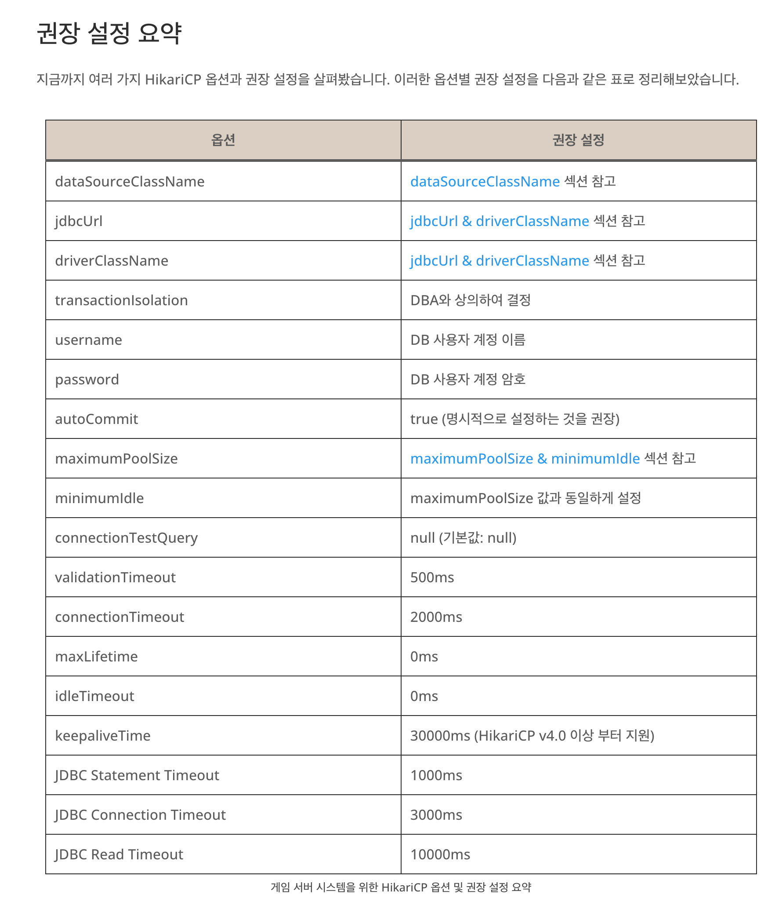

## datasource
spring boot 2.x.x 기준에서 사용 가능한 connection pool은 3가지가 있습니다.
+ hikariCP
+ tomcat pooling datasource
+ common dbcp2

spring boot 1.x.x에서는 tomcat이 default였으나 2.0.0부터 hikaricp가 default가 되었습니다. 그래서 spring-boot-starter-jdbc, spring-boot-starter-data-jpa를 사용하면, HikariCP(가장 높음) -> Tomcat pooling -> Commons DBCP2 의 순위로 지정됩니다.  

위의 우선순위를 무시하고 spring.datasource.type에 값을 통해 설정할 수도 있습니다.
```yml
spring.datasource.type=org.apache.tomcat.jdbc.pool.DataSource
```

## hikaricp의 옵션
### auto-commit (default : true)
connection이 종료되거나 pool에 반환될 때, connection에 속해있는 transaction을 commit 할지를 결정합니다.

### connection-timeout(default: 30000 - 30 seconds)
- pool에서 커넥션을 얻어오기전까지 기다리는 최대 시간, 허용가능한 wait time을 초과하면 SQLException을 던짐
- 설정가능한 가장 작은 시간은 250ms (default: 30000 (30s))

### idle-timeout(default : 600000 - 10 minutes)
- pool에 일을 안하는 커넥션을 유지하는 시간
- 이 옵션은 minimum-idle이 maximum-pool-size보다 작게 설정되어 있을 때만 설정
- pool에서 유지하는 최소 커넥션 수는 minimum-idle(A connection will never be retired as idle before this timeout)
- 최솟값은 10000ms (default: 600000 (10minutes))

### max-lifetime(default : 1800000 - 30 minutes)
- 커넥션 풀에서 살아있을 수 있는 커넥션의 최대 수명시간
- 사용중인 커넥션은 max-lifetime에 상관없이 제거되지않음 사용중이지 않을 때만 제거됨
- pool 전체가아닌 커넥션 별로 적용이되는데 그 이유는 풀에서 대량으로 커넥션들이 제거되는 것을 방지하기 위함임
- 강력하게 설정해야하는 설정 값으로 데이터베이스나 인프라의 적용된 connection time limit보다 작아야함
- 0으로 설정하면 infinite lifetime이 적용됨
- (idle-timeout설정 값에 따라 적용 idle-timeout값이 설정되어 있을 경우 0으로 설정해도 무한 lifetime 적용 안됨)

### minimum-idle (default : maximum-pool-size)
- 아무런 일을 하지않아도 적어도 이 옵션에 설정 값 size로 커넥션들을 유지해주는 설정
- 최적의 성능과 응답성을 요구한다면 이 값은 설정하지 않는게 좋음
- default값을 보면 이해할 수있음
- HikariCP에서는 최고의 performance를 위해 maximum-pool-size와 minimum-idle값을 같은 값으로 지정해서 connection Pool의 크기를 fix하는 것을 강력하게 권장한다

### maximum-pool-size (default: 10)
- pool에 유지시킬 수 있는 최대 커넥션 수
- pool의 커넥션 수가 옵션 값에 도달하게 되면 idle인 상태는 존재하지 않음.
- 성능 테스트 시 DB 부하에 따라 결정합니다. (DB CPU 부하가 높다면 풀 개수를 줄이고, 부하가 낮다면 풀 개수를 증가시킵니다.)

### pool-name (default : auto-generated)
- 이 옵션은 사용자가 pool의 이름을 지정함
- logging이나 JMX management console에 표시되는 이름

### initialization-fail-timeout
- pool에서 커넥션을 초기화할 때 성공적으로 수행할 수 없을 경우 빠르게 실패하도록 해준다
- 상세 내용은 한국말보다 원문이 더 직관적이라 생각되어 다음 글을 인용함
- This property controls whether the pool will “fail fast” if the pool cannot be seeded with an initial connection successfully. Any positive number is taken to be the number of milliseconds to attempt to acquire an initial connection; the application thread will be blocked during this period. If a connection cannot be acquired before this timeout occurs, an exception will be thrown. This timeout is applied after the connectionTimeout period. If the value is zero (0), HikariCP will attempt to obtain and validate a connection. If a connection is obtained, but fails validation, an exception will be thrown and the pool not started. However, if a connection cannot be obtained, the pool will start, but later efforts to obtain a connection may fail. A value less than zero will bypass any initial connection attempt, and the pool will start immediately while trying to obtain connections in the background. Consequently, later efforts to obtain a connection may fail. Default: 1


### validation-timeout
- valid 쿼리를 통해 커넥션이 유효한지 검사할 때 사용되는 timeout
- 최소 250ms 이상부터 설정가능(default: 5000ms)

### connection-test-query (default : none)
- JDBC4 드라이버를 지원한다면 이 옵션은 설정하지 않는 것을 추천
- 이 옵션은 JDBC4를 지원안하는 드라이버를 위한 옵션임(Connection.isValid() API)
- 커넥션 pool에서 커넥션을 획득하기전에 살아있는 커넥션인지 확인하기 위해 valid 쿼리를 던지는데 사용되는 쿼리
- (보통 SELECT 1 로 설정)
- JDBC4드라이버를 지원하지않는 환경에서 이 값을 설정하지 않는다면 error레벨 로그를 뱉어냄

### read-only (default : false)
- pool에서 커넥션을 획득할 때 read-only 모드로 가져옴
- 몇몇의 database는 read-only모드를 지원하지 않음
- 커넥션이 read-only로 설정되어있으면 몇몇의 쿼리들이 최적화 됨
- 이 설정은 database에서 지원하지 않는다면 readOnly가 아닌 상태로 open되기 때문에, 지원되는 database 목록을 확인해보고 사용해야 된다

### transaction-isolation (default : none)
- java.sql.Connection 에 지정된 Transaction Isolation을 지정한다
- 지정된 Transaction Isoluation은 다음과 같다
    - Connection.TRANSACTION_NONE : transaction을 지원하지 않는다
    - Connection.TRANSACTION_READ_UNCOMMITTED : transaction이 끝나지 않았을 때, 다른 transaction에서 값을 읽는 경우 commit되지 않은 값(dirty value)를 읽는다
    - Connection.TRANSACTION_READ_COMMITTED : transaction이 끝나지  않았을 때, 다른 transaction에서 값을 읽는 경우 변경되지 않은 값을 읽는다
    - Connection.TRANSACTION_REPEATABLE_READ : 같은 transaction내에서 값을 또다시 읽을 때, 변경되기 전의 값을 읽는다 TRANSACTION_READ_UNCOMMITTED 와 같이 사용될 수 없다
    - Connection.TRANSACTION_SERIALIZABLE : dirty read를 지원하고, non-repeatable read를 지원한다
    - 기본값을 각 Driver vendor의 JDBCDriver에서 지원하는 Transaction Isoluation을 따라간다. (none으로 설정시)

### category (default : none)
- connection에서 연결할 category를 결정한다
- 값이 설정되지 않는 경우, JDBC Driver에서 설정된 기본 category를 지정하게 된다

### leak-detection-threshold (default : 0)
- 커넥션이 누수 로그메시지가 나오기 전에 커넥션을 검사하여 pool에서 커넥션을 내보낼 수 있는 시간
- 0으로 설정하면 leak detection을 이용하지않음
- 최솟값 2000ms (default: 0)

### Statement Cache
- 많은 connection pool(including dbcp, vibur, c3p0)라이브러리들은 PreparedStatement caching을 지원하지만 HikariCP는 지원하지 않는다
- connection pool layer에서 PreparedStatements는 각 커넥션 마다 캐싱된다
- 애플리케이션에서 250개의 공통적인 쿼리를 캐싱하고 있고 커넥션 pool size가 20이라면 database에 5000 쿼리 실행계획을 hold하고 있게된다
- 대부분의 major database의 jdbc driver들은 이미 설정을 통해 Statement를 캐싱할 수 있다
- (PostgreSQL, Oracle, Derby, MySQL, DB2 등등) 즉 우리가 원하는대로 250개의 쿼리 실행계획만 데이터베이스에 캐싱할 수 있음을 의미한다
- (connection pool에 설정하는 것이 아닌 driver에 설정함으로써)

### driver-class-name (default : none)
- HikariCP는 jdbcUrl을 참조하여 자동으로 driver를 설정하려고 시도함
- 하지만 몇몇의 오래된 driver들은 driver-class-name을 명시화 해야함
- 어떤 에러 메시지가 명백하게 표시 되지않는다면 생략해도 됨
- 이 값이 지정되는 경우, jdbcUrl이 반드시 설정되어야 한다

### jdbc-url
- jdbcUrl을 지정한다
- driverClassName이 지정된 경우, jdbcUrl을 반드시 지정해야 한다

### registerMbeans (default : false)
- JMX management Beans에 등록되는 될지 여부를 지정한다

### username
- Connection을 얻어내기 위해서 사용되는 인증 이름을 넣는다

### password
- username과 쌍이 되는 비밀번호를 지정한다


## 게임 서버 시스템을 위한 HikariCP 옵션 권장 설정


해당 설정은 넷마블 기술 블로그에 있는 권장 설정입니다. 자세한 내용은 [여기](https://netmarble.engineering/hikaricp-options-optimization-for-game-server/) 를 참고하세요.

## spring 적용법
hikaricp의 옵션은 application.yml에 명시하면 됩니다. 관련 설정이 자동완성이 안되는데 **com.zaxxer.hikari.HikariConfig** 파일에서 매핑되는 필드를 확인할 수 있습니다.

__application.yml__  
```yml
spring:
    datasource:
        hikari:
            driver-class-name: com.mysql.cj.jdbc.Driver
            jdbc-url: url
            username: username
            password: password
            maximum-pool-size: 5
            minimum-idle: 5
            connection-timeout: 5000
```


<br><br>

__참고__
+ [hikaricp mysql config](https://github.com/brettwooldridge/HikariCP/wiki/MySQL-Configuration)
+ [hikaricp github](https://github.com/brettwooldridge/HikariCP)
+ [Commons DBCP 이해하기](https://d2.naver.com/helloworld/5102792) 
+ [게임 서버 시스템을 위한 hikaricp 권장 옵션](https://netmarble.engineering/hikaricp-options-optimization-for-game-server/)
+ [Spring Boot & HikariCP Datasource 연동하기](https://jojoldu.tistory.com/296)


