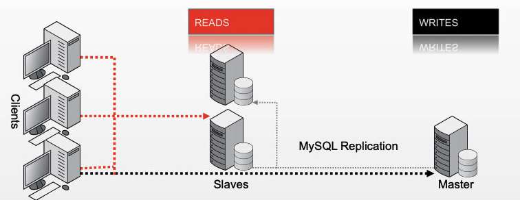
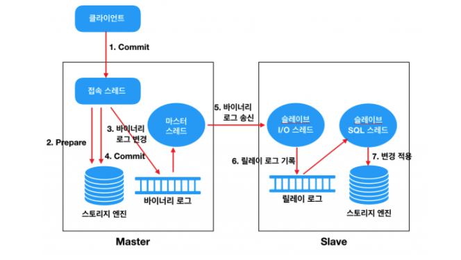
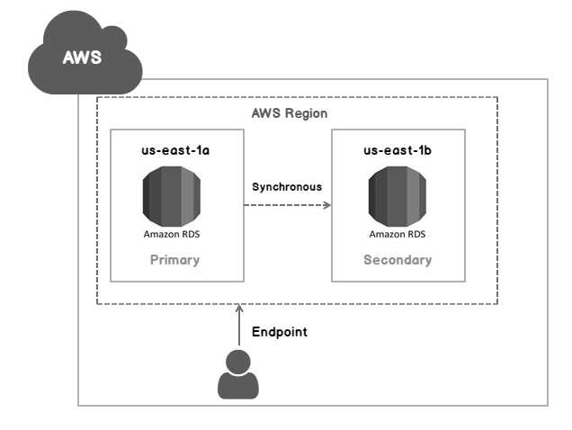
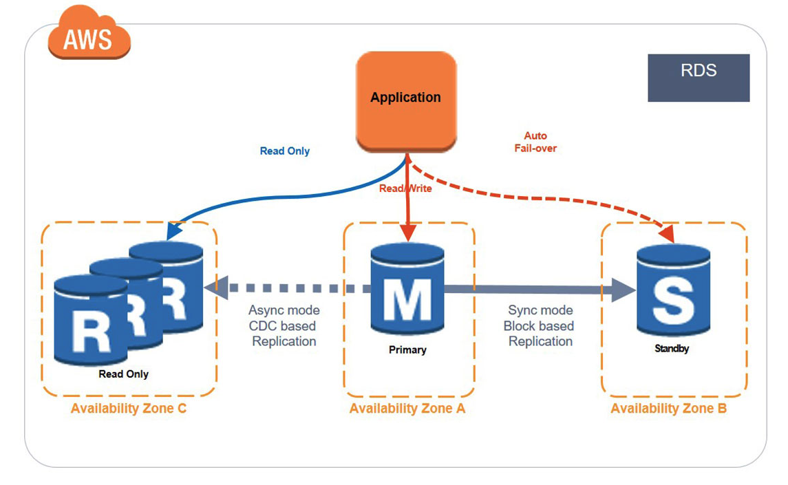
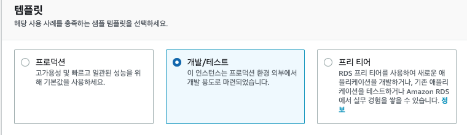
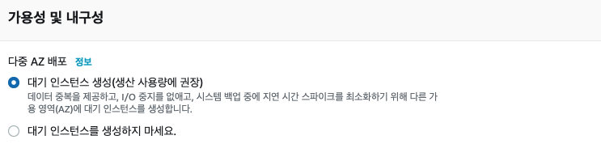
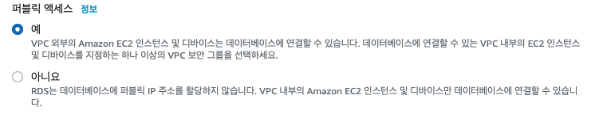
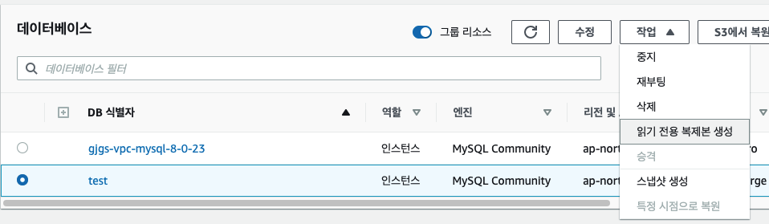

## DB Replication 이란?
데이터베이스 이중화 방식 중 하나로 __하나의 Master DB와 여러대의 Slave DB를 구성하는 방식__ 을 의미합니다.

## 사용하는 이유


__부하 분산__  
서비스에 사용자가 많아져 트래픽이 늘어날 경우, DB에 쿼리를 날리는 일이 빈번하게 일어납니다. DB에서는 쿼리를 모두 처리하기 힘들어지게 되고 이에 따라 부하를 줄이기 위해 DB를 이중화하여 Master에서는 쓰기/수정/삭제 연산을 처리하고 Slave에서는 읽기 연산만을 처리하여 병목 현상을 줄일 수 있습니다.

__데이터 백업__  
Master의 데이터가 날아가더라도 Slave에 데이터가 저장되어 있으므로 어느정도 복구할 수 있습니다. MySQL Replication은 비동기 방식이기 때문에 100% 정합성을 보장할 수 없습니다.

## MySQL Replication 동작 원리


1. 클라이언트(Application)에서 Commit 을 수행한다.
2. Connection Thead 는 스토리지 엔진에게 해당 트랜잭션에 대한 Prepare(Commit 준비)를 수행한다.
3. Commit 을 수행하기 전에 먼저 Binary Log 에 변경사항을 기록한다.
4. 스토리지 엔진에게 트랜잭션 Commit 을 수행한다.
5. Master Thread 는 시간에 구애받지 않고(비동기적으로) Binary Log 를 읽어서 Slave 로 전송한다.
6. Slave 의 I/O Thread 는 Master 로부터 수신한 변경 데이터를 Relay Log 에 기록한다. (기록하는 방식은 Master 의 Binary Log 와 동일하다)
7. Slave 의 SQL Thread 는 Relay Log 에 기록된 변경 데이터를 읽어서 스토리지 엔진에 적용한다.

## MySQL 이중화 방안
MySQL에는 이중화 방안으로 MMM/MHA 이 있습니다. 이와 관련해서는 [MySQL 이중화 진화기](https://www.youtube.com/watch?v=dCVKAJ7tb70) 발표에서 자세히 설명하고 있어서 참고바랍니다.


## AWS 다중 AZ 배포


다중 AZ 배포 방식은 Amazon RDS가 다른 가용 영역에 __동기식 예비 복제본__ 을 자동으로 프로비저닝하고, DB 인스턴스 장애나 가용 영역 장애가 발생할 경우 Amazon RDS가 자동으로 예비 복제본에 장애 조치를 수행해 예비 복제본이 __마스터로 승격__ 되게 하는 관리하는 방식입니다. 다중 AZ 배포의 경우, 동기식이기 때문에 데이터의 정합성을 보장할 수 있지만 복제본의 경우 읽기 작업을 할 수 없습니다. 이는 가용성을 위한 것이지 부하 분산을 통한 성능 향상을 위한 것이 아니기 때문입니다.

## AWS RDS 생성하기


다중 AZ 배포 방식과 Replication을 함께 사용하면 서로의 장점을 이용할 수 있습니다.  
위 그림처럼 마스터는 AZ배포 방식으로 복제본을 만들어 주고, 마스터의 Replication을 따로 만들어주도록 구성하면 됩니다.

 
기본적인 RDS를 만들면 됩니다. 다중 AZ 배포 옵션은 프리티어에서 제공하지 않으므로 개발/테스트를 선택해줍니다.


 
AZ 옵션을 활성화 시켜줍니다.

 
테스트 용이므로 퍼블릭 액세스를 허용해줍니다.


방금 생성한 DB를 선택하시고 읽기 전용 복제본을 생성해줍니다. 기본 옵션으로 진행하면 되고 복제본 생성에서는 AZ 옵션을 꺼주시고, 퍼플릭 엑세스를 허용해줍니다.

## Spring에 적용하기
### 구성
+ @Transactional(readOnly = true) 인 경우는 Slave DB 접근
+ @Transactional(readOnly = false) 인 경우에는 Master DB 접근

### yml 파일 설정
__database/database-dev.yml__
```yml
# https://github.com/brettwooldridge/HikariCP
# https://netmarble.engineering/hikaricp-options-optimization-for-game-server/
database:
  master:
    driver-class-name: com.mysql.cj.jdbc.Driver
    jdbc-url: jdbc:mysql://masterIp:port/maindb?useUnicode=true&characterEncoding=UTF8&useSSL=false&serverTimezone=UTC
    username: name
    password: pw
    maximum-pool-size: 10
    minimum-idle: 5
    connection-timeout: 5000
  slave:
    driver-class-name: com.mysql.cj.jdbc.Driver
    jdbc-url: jdbc:mysql://slaveIp:port/maindb?useUnicode=true&characterEncoding=UTF8&useSSL=false&serverTimezone=UTC
    username: name
    password: pw
    maximum-pool-size: 10
    minimum-idle: 5
    connection-timeout: 5000
```
db설정만 따로 빼서 yml을 만들어줍니다. real과 dev를 분리하기 위해서 dev만 따로 만들어줬습니다.

__application.yml__  
```yml
spring:
  config:
    import:
      - "classpath:database/database-dev.yml"
```
application.yml 파일에 등록해줍니다. real profile인 경우에는 real을 넣어주면 됩니다.

__DataSourceProperty__  
```kotlin
@ConfigurationProperties(prefix = "database.master")
data class MasterDataSourceProperties @ConstructorBinding constructor(
    val driverClassName: String,
    val jdbcUrl: String,
    val username: String,
    val password: String,
    val maximumPoolSize: Int,
    val minimumIdle: Int,
    val connectionTimeout: Long,
) {
    fun convertToHikariDataSource(): HikariDataSource {
        val hikariConfig = HikariConfig()
        hikariConfig.driverClassName = driverClassName
        hikariConfig.jdbcUrl = jdbcUrl
        hikariConfig.username = username
        hikariConfig.password = password
        hikariConfig.maximumPoolSize = maximumPoolSize
        hikariConfig.minimumIdle = minimumIdle
        hikariConfig.connectionTimeout = connectionTimeout
        return HikariDataSource(hikariConfig)
    }
}

@ConfigurationProperties(prefix = "database.slave")
data class SlaveDataSourceProperties @ConstructorBinding constructor(
    val driverClassName: String,
    val jdbcUrl: String,
    val username: String,
    val password: String,
    val maximumPoolSize: Int,
    val minimumIdle: Int,
    val connectionTimeout: Long,
) {
    fun convertToHikariDataSource(): HikariDataSource {
        val hikariConfig = HikariConfig()
        hikariConfig.driverClassName = driverClassName
        hikariConfig.jdbcUrl = jdbcUrl
        hikariConfig.username = username
        hikariConfig.password = password
        hikariConfig.maximumPoolSize = maximumPoolSize
        hikariConfig.minimumIdle = minimumIdle
        hikariConfig.connectionTimeout = connectionTimeout
        return HikariDataSource(hikariConfig)
    }
}

```
앞서 yml에 명시해줬던 값들을 주입받아서 사용하는 클래스입니다.

### dataSource Config 설정
__RoutineDataSource__  
```kotlin
class RoutingDataSource : AbstractRoutingDataSource() {

    override fun determineCurrentLookupKey(): Any {
        val readOnly = TransactionSynchronizationManager.isCurrentTransactionReadOnly()
        val actuallyActive = TransactionSynchronizationManager.isActualTransactionActive()
        val dbKey: String = if (actuallyActive && !readOnly) MASTER else SLAVE
        if (logger.isDebugEnabled) {
            logger.debug("transaction: db=$dbKey (readonly=$readOnly, actuallyActive=$actuallyActive)")
        }
        return dbKey
    }

    companion object {
        const val MASTER = "MASTER"
        const val SLAVE = "SLAVE"
    }
}
```
트랜잭션과 readOnly 여부를 조건으로 master / slave로 분기처리를 하기 위해 AbstractRoutingDataSource클래스를 상속받아 determineCurrentLookupKey 메서드를 재정의 합니다.


__DataSourceConfiguration__
```kotlin
@Configuration
@EnableTransactionManagement(proxyTargetClass = true)
class DataSourceConfiguration(
                private val masterDataSourceProperties: MasterDataSourceProperties,
                private val slaveDataSourceProperties: SlaveDataSourceProperties
        ) {
    
    // 최종적인 dataSource 빈 등록
    @Primary
    @Bean("dataSource")
    fun dataSource(routingDataSource: DataSource): DataSource {
        return LazyConnectionDataSourceProxy(routingDataSource)
    }
    
    // master, slave dataSource를 묶는 routingDataSource 빈 등록
    @Bean("routingDataSource")
    fun routingDataSource(
            @Qualifier("masterDataSource") masterDataSource: DataSource,
            @Qualifier("slaveDataSource") slaveDataSource: DataSource,
            ): DataSource {
        val dataSourceMap = mutableMapOf<Any, Any>(
                RoutingDataSource.MASTER to masterDataSource,
        RoutingDataSource.SLAVE to slaveDataSource,
        )
        val routingDataSource = RoutingDataSource().apply {
            setTargetDataSources(dataSourceMap)
            setDefaultTargetDataSource(slaveDataSource)
        }
        return routingDataSource
    }
    
    // dataSource 빈 등록
    @Bean("masterDataSource")
    fun masterDataSource(): DataSource {
        return masterDataSourceProperties.convertToHikariDataSource()
    }

    // dataSource 빈 등록
    @Bean("slaveDataSource")
    fun slaveDataSource(): DataSource {
        return slaveDataSourceProperties.convertToHikariDataSource()
    }
}
```
master, slave에 대한 데이터 소스를 빈으로 등록하고 그것을 활용하는 routingDataSource를 등록한 뒤, 최종적으로 LazyConnectionDataSourceProxy를 사용해서 dataSource를 등록하는 코드 입니다.

기본적으로 Spring은 @Transactional을 만나면 다음 순서로 처리를 진행합니다.

> transactionManager 선별 -> Datasource에서 connection 획득 -> transaction 동기화

routingDataSource 빈은 transaction 동기화 -> DataSource connection 획득을 순서로 진행해야만 합니다. 즉, spring의 기본적인 순서와 다르게 구성되어야 합니다. 이를 해결하기 위해서 primary로 등록된 dataSource는 LazyConnectionDataSoruceProxy로 감싸서 빈으로 등록되어야 합니다. LazyConnectionDataSoruceProxy는 실질적인 쿼리 실행 여부와 상관없이 트랜잭션이 걸리면 무조건 Connection 객체를 확보하는 Spring의 단점을 보완하여 트랜잭션 시작시에 Connection Proxy 객체를 리턴하고 실제로 쿼리가 발생할 때 데이터소스에서 getConnection()을 호출하는 역할을 합니다. 따라서 다음과 같이 동작하게 됩니다.

> TransactionManager 선별 -> LazyConnectionDataSourceProxy에서 Connection Proxy 객체 획득 -> Transaction 동기화(Synchronization) -> 실제 쿼리 호출시에 routingDataSource.getConnection().determineCurrentLookupKey() 호출


## 테스트해보기
RoutingDataSource 클래스의 determineCurrentLookupKey 메서드에 디버깅을 찍어보면 master / slave 중 어떤 key로 사용되는지 확인해볼 수 있습니다.
cation/" target="_blank"> DB 리플리케이션 적용기</a>   
