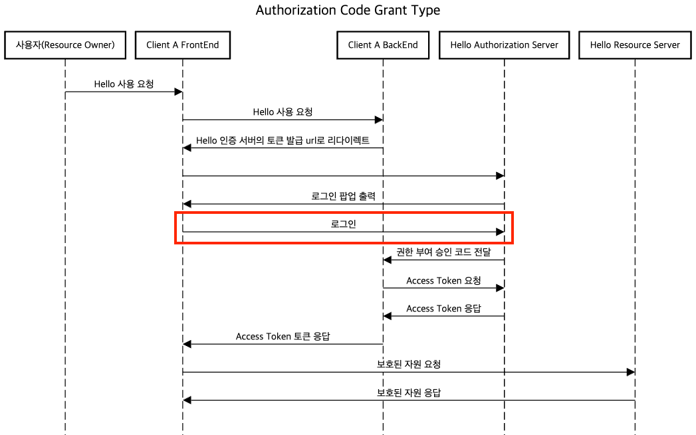

## 개요


Open Authorization 2.0은 **인가를 위한 개방형 표준 프로토콜** 입니다. 이 프로토콜에서는 third-party 애플리케이션이 사용자의 리소스에 접근하기 위한 절차를 정의하고 서비스 제공자의 API를 사용할 수 있는 권한을 부여합니다. 대표적으로 네이버 로그인, 구글 로그인과 같은 소셜 미디어 간편 로그인이 있습니다. OAuth2.0을 사용해 third-party 애플리케이션이 사용자의 소셜미디어 프로필 정보에 접근할 수 있도록 합니다. 즉, **OAuth 2.0는 사용자가 애플리케이션(클라이언트)에게 자신을 대신하여 자원 서버(Resource Server)에서 특정 자원에 접근할 수 있는 권한을 부여하는 것을 목표로 합니다.**  

반면에 인증(authentication) 프로토콜은 사용자의 신원을 확인하는 데 중점을 둡니다. OAuth 2.0 자체는 인증 프로토콜이 아니지만, OpenID Connect와 같은 프로토콜은 OAuth 2.0를 기반으로 하여 인증을 제공하는 기능을 추가합니다. 이 때문에 OAuth2.0을 인증 및 권한 부여를 위한 개방형 표준 프로토콜이라고 하기도 합니다.

## 역할


OAuth 2.0을 구성하는 4가지 역할은 다음과 같습니다.

* 리소스 소유자(Resource Owner): OAuth 2.0 프로토콜을 사용하여 보호되는 리소스에 대한 액세스 권한을 부여하는 사용자입니다. 클라이언트를 인증(Authorize)하는 역할을 수행합니다. 예를 들어 네이버 로그인에서 네이버 아이디를 소유하고 third-party 애플리케이션(클라이언트)에 네이버 아이디로 소셜 로그인 인증을 하는 사용자를 의미합니다.
* 클라이언트(Client): OAuth 2.0을 사용하여 리소스에 접근하려는 third-party 애플리케이션이나 서비스입니다.
* 권한 서버(Authorization Server): 권한 서버는 클라이언트가 리소스 소유자의 권한을 얻을 수 있도록 도와주는 서버입니다. 권한 서버는 사용자 인증, 권한 부여 및 토큰 발급을 관리합니다.
* 리소스 서버(Resource Server): 리소스 서버는 보호되는 리소스를 호스팅하는 서버로, 액세스를 허용하거나 거부합니다. 이 서버는 OAuth 2.0 토큰을 사용하여 클라이언트에게 리소스에 액세스할 권한을 부여하고 실제 데이터를 제공합니다.

## 용어
* 액세스 토큰(Access Token): 클라이언트가 리소스 서버의 리소스에 접근하기 위한 권한을 부여받는 토큰입니다. 액세스 토큰은 권한 서버로부터 발급되며, 일반적으로 제한된 유효 기간을 가지고 있습니다.
* 리프레시 토큰(Refresh Token): 리프레시 토큰은 액세스 토큰의 유효 기간이 만료된 후 새로운 액세스 토큰을 받기 위한 토큰입니다. 이를 통해 사용자는 다시 로그인할 필요 없이 토큰 유효 시간 갱신만으로 계속 애플리케이션을 사용할 수 있습니다.
* 범위(Scope): 범위는 클라이언트가 리소스에 대한 어떤 작업을 수행할 수 있는지를 정의하는 문자열입니다. 범위는 권한 서버에 의해 정의되며, 클라이언트는 특정 범위의 액세스 권한을 요청할 수 있습니다.
* 인증 코드(Authorization Code): 인증 코드는 클라이언트가 액세스 토큰을 얻기 위한 중간 단계로 사용되는 코드입니다. 인증 코드 부여(Authorization Code Grant) 방식을 통해 권한 서버로부터 발급되며, 이를 사용하여 액세스 토큰과 리프레시 토큰을 얻을 수 있습니다.

## 권한 부여 방식
OAuth 2.0에서는 클라이언트 애플리케이션이 리소스 서버에 접근할 권한을 부여하고 관리하기 위해 다양한 권한 부여 방식이 제공됩니다.

<br>

* Authorization Code Grant Type
   * 앞서 용어에서 언급된 인증 코드(Authorization Code)를 사용하는 방식으로 가장 보안이 높은 방식입니다.
* Client Credentials Grant Type
   * client Id와 client secret만 있다면 access token을 발급받는 방식으로 보통 server to server 관계에서 사용됩니다. 
* PKCE-enhanced Authorization Code Grant Type
  * 코드 교환을 위한 증명키로서 CSRF 및 권한부여 코드 삽입 공격을 방지하기 위한 Authorization Code Grant Type의 확장 버전입니다.
* Refresh Token Grant Type
  * access token에는 만료기한이 있기 때문에 만료가 되었을 경우 다시 인증과정을 처음부터 거치지 않고 refresh을 사용하여 바로 access token을 다시 발급받을 수 있는 방식입니다.
   * Authorization Code, Resource Owner Password Type 에서 지원합니다.

<br>

위와 같은 구조에서 Authorization Code Grant Type 방식을 채택하면 아래와 같은 흐름으로 이뤄집니다.


## Spring OAuth2.0 구축하기


위 4개의 컴포넌트를 사용한 OAuth 2.0을 데모로 구축해보겠습니다.

```sh
├── client-login-server
├── hello-authorization-server
├── hello-resource-server
```
멀티 모듈 구조는 위와 같습니다. Client A Frontend는 따로 구축하지 않고 chrome을 활용하겠습니다. 

### Authorization Server 구축하기

#### build.gradle.kts
```groovy
dependencies {
    // authorization server
    implementation("org.springframework.boot:spring-boot-starter-oauth2-authorization-server")

    // for register user
    implementation("org.springframework.boot:spring-boot-starter-web")
    implementation("org.springframework.boot:spring-boot-starter-validation")

    // redis
    implementation("org.springframework.boot:spring-boot-starter-data-redis")
    implementation("org.springframework.session:spring-session-data-redis")
    implementation("org.apache.commons:commons-pool2:2.12.0")

    // db
    implementation("org.springframework.boot:spring-boot-starter-data-jpa")
    implementation("com.mysql:mysql-connector-j")
}
```
authorization-server 의존성을 추가합니다. Authorization server에 사용자를 가입시키기 위한 web과 db 의존성도 추가합니다. redis 의존성을 추가하는 이유는 이후에 다시 설명하겠습니다.


#### schema.sql
```sql
CREATE TABLE if not exists oauth2_authorization_consent (
                                              registered_client_id varchar(100) NOT NULL,
                                              principal_name varchar(200) NOT NULL,
                                              authorities varchar(1000) NOT NULL,
                                              PRIMARY KEY (registered_client_id, principal_name)
);


CREATE TABLE if not exists oauth2_authorization (
                                      id varchar(100) NOT NULL,
                                      registered_client_id varchar(100) NOT NULL,
                                      principal_name varchar(200) NOT NULL,
                                      authorization_grant_type varchar(100) NOT NULL,
                                      authorized_scopes varchar(1000) DEFAULT NULL,
                                      attributes blob DEFAULT NULL,
                                      state varchar(500) DEFAULT NULL,
                                      authorization_code_value blob DEFAULT NULL,
                                      authorization_code_issued_at timestamp DEFAULT NULL,
                                      authorization_code_expires_at timestamp DEFAULT NULL,
                                      authorization_code_metadata blob DEFAULT NULL,
                                      access_token_value blob DEFAULT NULL,
                                      access_token_issued_at timestamp DEFAULT NULL,
                                      access_token_expires_at timestamp DEFAULT NULL,
                                      access_token_metadata blob DEFAULT NULL,
                                      access_token_type varchar(100) DEFAULT NULL,
                                      access_token_scopes varchar(1000) DEFAULT NULL,
                                      oidc_id_token_value blob DEFAULT NULL,
                                      oidc_id_token_issued_at timestamp DEFAULT NULL,
                                      oidc_id_token_expires_at timestamp DEFAULT NULL,
                                      oidc_id_token_metadata blob DEFAULT NULL,
                                      refresh_token_value blob DEFAULT NULL,
                                      refresh_token_issued_at timestamp DEFAULT NULL,
                                      refresh_token_expires_at timestamp DEFAULT NULL,
                                      refresh_token_metadata blob DEFAULT NULL,
                                      user_code_value blob DEFAULT NULL,
                                      user_code_issued_at timestamp DEFAULT NULL,
                                      user_code_expires_at timestamp DEFAULT NULL,
                                      user_code_metadata blob DEFAULT NULL,
                                      device_code_value blob DEFAULT NULL,
                                      device_code_issued_at timestamp DEFAULT NULL,
                                      device_code_expires_at timestamp DEFAULT NULL,
                                      device_code_metadata blob DEFAULT NULL,
                                      PRIMARY KEY (id)
);

CREATE TABLE if not exists oauth2_registered_client (
                                          id varchar(100) NOT NULL,
                                          client_id varchar(100) NOT NULL,
                                          client_id_issued_at timestamp DEFAULT CURRENT_TIMESTAMP NOT NULL,
                                          client_secret varchar(200) DEFAULT NULL,
                                          client_secret_expires_at timestamp DEFAULT NULL,
                                          client_name varchar(200) NOT NULL,
                                          client_authentication_methods varchar(1000) NOT NULL,
                                          authorization_grant_types varchar(1000) NOT NULL,
                                          redirect_uris varchar(1000) DEFAULT NULL,
                                          post_logout_redirect_uris varchar(1000) DEFAULT NULL,
                                          scopes varchar(1000) NOT NULL,
                                          client_settings varchar(2000) NOT NULL,
                                          token_settings varchar(2000) NOT NULL,
                                          PRIMARY KEY (id)
);
```
Authorization server를 띄우기 위해서는 필수적으로 필요한 테이블이 존재합니다. 위 테이블은 **org/springframework/security/oauth2/server/authorization/** 패키지에서 해당 파일을 제공해주고 있으므로 그대로 사용합니다.

#### AuthorizationServerConfig

본격적인 AuthorizationServerConfig를 세팅할 차례입니다. 해당 클래스에는 세팅 코드가 많이 때문에 하나씩 쪼개서 살펴보겠습니다.
```kotlin
@Configuration
@EnableWebSecurity // (debug = true)
class AuthorizationServerConfig(
    private val oAuthClientProperties: OAuthClientProperties,
    private val jwkSourceProperties: JWKSourceProperties,
    private val jdbcTemplate: JdbcTemplate,
) {

    @Bean
    @Order(Ordered.HIGHEST_PRECEDENCE)
    fun authorizationServerSecurityFilterChain(
        http: HttpSecurity,
    ): SecurityFilterChain {
        OAuth2AuthorizationServerConfiguration.applyDefaultSecurity(http)
        http.getConfigurer(OAuth2AuthorizationServerConfigurer::class.java)
//            .oidc(Customizer.withDefaults()) // Enable OpenID Connect 1.0

        http
            // Redirect to the login page when not authenticated from the
            // authorization endpoint
            .exceptionHandling { exceptions ->
                exceptions
                    .defaultAuthenticationEntryPointFor(
                        LoginUrlAuthenticationEntryPoint("/login"),
                        MediaTypeRequestMatcher(MediaType.TEXT_HTML),
                    )
            } // Accept access tokens for User Info and/or Client Registration
            .oauth2ResourceServer { resourceServer ->
                resourceServer.jwt(Customizer.withDefaults())
            }

        return http.build()
    }

    @Bean
    @Order(2)
    @Throws(Exception::class)
    fun defaultSecurityFilterChain(http: HttpSecurity): SecurityFilterChain {
        http
            // rest api csrf disable
            .csrf { csrf: CsrfConfigurer<HttpSecurity> ->
                csrf.ignoringRequestMatchers("/v1/**")
            }
            .authorizeHttpRequests { authorize ->
                authorize
                    .requestMatchers("/v1/**").permitAll()
                    .anyRequest().authenticated()
            }
            .formLogin(Customizer.withDefaults())
//            // only allow /oauth2 path to loginPage
            .exceptionHandling { exceptions ->
                exceptions
                    .defaultAuthenticationEntryPointFor(
                       JsonUnAuthorizedErrorEntryPoint(),
                    ) { request -> request.servletPath.startsWith("/oauth2").not() }
            }

        return http.build()
    }

    @Bean
    fun authorizationServerSettings(): AuthorizationServerSettings {
       return AuthorizationServerSettings.builder().issuer(oAuthClientProperties.issuerUrl).build()
    }

    @Bean
    fun jwtDecoder(jwkSource: JWKSource<SecurityContext>): JwtDecoder {
      return OAuth2AuthorizationServerConfiguration.jwtDecoder(jwkSource)
    }

   // ..
}
```
```kotlin
class JsonUnAuthorizedErrorEntryPoint : AuthenticationEntryPoint {

  override fun commence(request: HttpServletRequest, response: HttpServletResponse, authException: AuthenticationException?) {
    response.contentType = MediaType.APPLICATION_JSON_VALUE
    response.status = HttpStatus.UNAUTHORIZED.value()
  }
}
```

[공식문서](https://docs.spring.io/spring-authorization-server/reference/getting-started.html#defining-required-components)는 위와 같은 AuthorizationServer 세팅을 가이드 하고 있습니다. 그리고 custom하고자 한다면 위의 default 세팅에서 추가적으로 custom을 진행하면 됩니다. 데모에서는 기본적인 세팅에서 AuthorizationServer에서 유저 추가 등의 추가적인 API를 지원하기 위해 /v1 경로에 대한 설정을 추가했고, /oauth2 경로를 제외하고는 Login 페이지로 이동하지 않고 application/json 타입으로 401 응답을 내리는 EntryPoint를 추가했습니다. 

AuthorizationServerSettings는 AuthorizationServer에서 제공하는 기본적인 default url 경로를 수정하는 기능을 제공합니다. 대부분 default로 사용하지만 issuerUrl 같은 경우는 실무 환경에서는 대부분 수정이 필요합니다. issuerUrl은 해당 서버의 실제 도메인을 명시하거나 외부에서 해당 서버를 바라보는 url을 명시해야 합니다. 해당 url은 jwt 토큰을 만드는 곳과 발급한 토큰을 타 서비스에서 검증하기 위해 해당 url 사용합니다.  

AuthorizationServer가 OAuth2ResourceServer 설정을 지정하는 이유는 AuthorizationServer도 User Info(OIDC 역할), ClientRegistration 에 대한 정보(Resource)를 관리하고 있으므로 OAuth2ResourceServer에 해당합니다. 따라서 Jwt 토큰을 해석할 수 있는 JwtDecoder도 빈으로 등록해줘야 합니다.

```kotlin
@Configuration
@EnableWebSecurity // (debug = true)
class AuthorizationServerConfig() {
    // 생략
   
    @Bean
    fun oAuth2AuthorizationService(): OAuth2AuthorizationService {
        return JdbcOAuth2AuthorizationService(jdbcTemplate, registeredClientRepository())
    }

    @Bean
    fun oAuth2AuthorizationConsentService(): OAuth2AuthorizationConsentService {
        return JdbcOAuth2AuthorizationConsentService(jdbcTemplate, registeredClientRepository())
    }

    @Bean
    fun registeredClientRepository(): RegisteredClientRepository {
      val client = getRegisteredClientCodeAndRefreshType(
        oAuthClientProperties.client,
        // RESOURCE에 대한 동의 선택지 추가
        // 예를 들면, 소셜 로그인 시에 선택하는 동의 내용들
        setOf(Scope.RESOURCE), 
      )
  
      return JdbcRegisteredClientRepository(jdbcTemplate).also { repository ->
        saveRegisteredClient(repository, client)
      }
    }
    // ..
}
```
* RegisteredClientRepository : Authorization Server에서 허용하는 Client는 RegisteredClient 클래스로 관리되는데 해당 클래스를 저장, 조회 등의 관리를 하는 클래스
* OAuth2AuthorizationService : Client에 부여된 인가 상태는 OAuth2Authorization 클래스로 관리되는데 해당 클래스를 저장, 조회 등의 관리를 하는 클래스
* OAuth2AuthorizationConsentService : Client 권한 부여에 대한 동의는 OAuth2AuthorizationConsent 클래스로 관리되는데 해당 클래스를 저장, 조회 등의 관리를 하는 클래스

위 클래스 모두 별도로 등록하지 않으면 InMemory 구현체가 사용됩니다. 테스트 환경에서는 문제가 없으나 실무에서는 해당 클래스를 InMemory 구현체를 사용할 경우 OOM 발생 가능성이 있으므로 반드시 Jdbc 구현체를 사용해야합니다. 해당 객체의 DB Schema는 앞서 schema.sql에서 정의했습니다.


```kotlin
@Configuration
@EnableWebSecurity // (debug = true)
class AuthorizationServerConfig {
    // 생략
    private fun getRegisteredClientCodeAndRefreshType(
        oAuthClient: OAuthClient,
        scopes: Set<Scope>,
    ): RegisteredClient {
        return baseRegisteredClientBuilder(oAuthClient, scopes)
            // Authorization Code Grant Type 지정
            .authorizationGrantType(AuthorizationGrantType.AUTHORIZATION_CODE)
            .authorizationGrantType(AuthorizationGrantType.REFRESH_TOKEN)
            // 권한부여 승인 코드를 전달할 redirectUri
            .redirectUri(oAuthClient.redirectUri)
            .build()
    }

    private fun baseRegisteredClientBuilder(oAuthClient: OAuthClient, scopes: Set<Scope>): RegisteredClient.Builder {
        val clientBuilder = RegisteredClient.withId(oAuthClient.id) // RegisteredClient 객체 id값
            .clientId(oAuthClient.clientId) // 클라이언트 식별자
            .clientSecret(passwordEncoder().encode(oAuthClient.clientSecret)) // 클라이언트 비밀값
            .clientIdIssuedAt(Instant.now()) // 클라이언트 식별자가 발급된 시간
            .clientSecretExpiresAt(null) // 클라이언트 비밀값 만료 무제한
            // 클라이언트가 토큰을 발급받기 위해 요청을 보낼 때 client_id, client_secret을 받는 방식을 지정 -> POST 요청의 본문(body)에 포함하여 보내는 방식
            .clientAuthenticationMethod(ClientAuthenticationMethod.CLIENT_SECRET_POST)
            // scope를 추가한 경우, 동의 여부를 물을 것인지 지정
            .clientSettings(ClientSettings.builder().requireAuthorizationConsent(true).build())
            // 토큰 정보 지정
            .tokenSettings(
                TokenSettings.builder()
                    .accessTokenTimeToLive(oAuthClientProperties.accessTokenTtl)
                    .refreshTokenTimeToLive(oAuthClientProperties.refreshTokenTtl)
                    .reuseRefreshTokens(false) // 재발급할때 refresh토큰도 재발급 할지 여부
                    .build(),
            )
        
        // scope 추가
        if (scopes.isNotEmpty()) {
            clientBuilder.scopes {
                it.addAll(scopes.map { it.name })
            }
        }

        return clientBuilder
    }
    
    private fun saveRegisteredClient(
      repository: JdbcRegisteredClientRepository,
      client: RegisteredClient,
    ) {
      val foundClient = repository.findById(client.id)
      if (foundClient == null || foundClient != client) {
        repository.save(client)
      }
    }
    // ..
}
```
위 코드에 대한 설명은 주석으로 대체하겠습니다.

```kotlin
@Configuration
@EnableWebSecurity // (debug = true)
class AuthorizationServerConfig {

    // authorizationServer에서는 다른 서버들에게 jwk set = 암호화 정보를 제공해야 한다.
    @Bean
    fun jwkSource(): JWKSource<SecurityContext> {
        val rsaKey = generateRSAKey(jwkSourceProperties)
        val jwkSet = JWKSet(rsaKey)
        jwkSourceProperties.destroy()
        return ImmutableJWKSet(jwkSet)
    }

    // instance를 여러개 띄우게 된다면 만들어진 keyPair을 공유할 수 있도록 yml에 암호화해서 넣어두고 주입받는 형식으로 사용해야 한다.
    private fun generateRSAKey(jwkSourceProperties: JWKSourceProperties): RSAKey {
        val kf = KeyFactory.getInstance(RSA)

        val decodePublicKey = Base64.decodeBase64(String(jwkSourceProperties.publicKey))
        val x509EncodedKeySpec = X509EncodedKeySpec(decodePublicKey)
        val publicKey = kf.generatePublic(x509EncodedKeySpec) as RSAPublicKey

        val decodePrivateKey = Base64.decodeBase64(String(jwkSourceProperties.privateKey))
        val pkcS8EncodedKeySpec = PKCS8EncodedKeySpec(decodePrivateKey)
        val privateKey = kf.generatePrivate(pkcS8EncodedKeySpec) as RSAPrivateKey

        return RSAKey.Builder(publicKey)
            .privateKey(privateKey)
            .keyID(jwkSourceProperties.kid)
            .build()
    }
}
```
jwkSource는 Jwt토큰에 서명할 때 사용됩니다. 해당 키값들은 ResourceServer들이 application이 뜰때, AuthorizationServer의 /oauth2/jwks 경로를 호출하여 jwt 토큰 검증을 위한 공개키를 얻어 유효성 검사에 사용합니다. 

```kotlin
@Configuration
@EnableWebSecurity // (debug = true)
class AuthorizationServerConfig {
    @Bean
    fun userDetailsService(userRepository: UserRepository): UserDetailsService {
        return CustomUserDetailsService(userRepository)
    }

    @Bean
    fun passwordEncoder(): PasswordEncoder {
        return BCryptPasswordEncoder()
    }
}
```
AuthorizationServer의 formLogin의 사용자 검증을 위해 등록해야하는 기본 Security 세팅입니다. CustomUserDetailsService는 데모 코드를 참고 바랍니다.


```kotlin
@Configuration
@EnableWebSecurity // (debug = true)
class AuthorizationServerConfig {
    @Bean
    fun tokenGenerator(userRepository: UserRepository): OAuth2TokenGenerator<*> {
        return DelegatingOAuth2TokenGenerator(
            JwtGenerator(NimbusJwtEncoder(jwkSource()), userRepository),
            OAuth2AccessTokenGenerator(),
            OAuth2RefreshTokenGenerator(),
        )
    }
}
```
tokenGenerator의 경우 Jwt를 제외하고는 기본값을 사용하고 JwtGenerator만 커스텀해서 세팅했습니다.

#### JwtGenerator
앞서 JwtGenerator는 빈으로 등록했고, 해당 클래스를 살펴보겠습니다.
```kotlin
class JwtGenerator(
    private val jwtEncoder: JwtEncoder,
    private val userRepository: UserRepository,
) : OAuth2TokenGenerator<Jwt> {

    override fun generate(context: OAuth2TokenContext): Jwt? {
        if (!isValidContext(context)) {
            return null
        }
        
        // authorization 타입은 OAuth2Authorization
        val authorization = context.authorization!! 
        val loginId = authorization.principalName
        val user = userRepository.findByLoginId(loginId)
            ?: throw RuntimeException("User not found by loginId. $loginId")

        val issuedAt = Instant.now()
        val claimsBuilder = JwtClaimsSet.builder()
            .id(UUID.randomUUID().toString())
            .issuer(context.authorizationServerContext.issuer)
            .audience(listOf(user.id.toString()))
            .claim("userType", user.type.name)
            .claim("userRole", user.role.name)
            .issuedAt(issuedAt)
            .notBefore(issuedAt)
            .expiresAt(issuedAt.plus(context.registeredClient.tokenSettings.accessTokenTimeToLive))

      // 앞서 등록한 Client는 Scope로는 Resource만 담아두었습니다.
        if (context.authorizedScopes.isNullOrEmpty().not()) {
            claimsBuilder.claim(OAuth2ParameterNames.SCOPE, context.authorizedScopes)
        }

        return jwtEncoder.encode(
            JwtEncoderParameters.from(
                JwsHeader.with(SignatureAlgorithm.RS256).build(),
                claimsBuilder.build(),
            ),
        )
    }

    /**
     * @see org.springframework.security.oauth2.server.authorization.token.JwtGenerator
     */
    private fun isValidContext(context: OAuth2TokenContext): Boolean {
        val tokenType = context.tokenType ?: return false
        val isAccessToken = tokenType == OAuth2TokenType.ACCESS_TOKEN
        val isIdToken = tokenType.value == OidcParameterNames.ID_TOKEN

        if (!isAccessToken && !isIdToken) {
            return false
        }
        if (isAccessToken && context.registeredClient.tokenSettings.accessTokenFormat != OAuth2TokenFormat.SELF_CONTAINED) {
            return false
        }

        return true
    }
}
```
기본적으로 제공되는 org.springframework.security.oauth2.server.authorization.token.JwtGenerator를 참고하여 필요한 값들을 채워넣어서 해당 클래스를 만들었습니다. 

### Client 서버 구축하기
Client의 경우, 토큰 발급에 대한 로직만 설명하겠습니다. 토큰 재발급, 삭제, 검증에 대한 로직은 데모 코드를 참고 바랍니다.


#### build.gradle.kts
```groovy
dependencies {
    implementation("org.springframework.boot:spring-boot-starter-web")
    implementation("org.springframework.boot:spring-boot-starter-validation")
}
```
Client-Backend의 경우 단순한 web 의존성만 추가합니다.

#### Login redirect 로직


```kotlin
@RequestMapping("/v1/oauth2")
@RestController
class OAuthController(
    private val oAuthService: OAuthService,
    private val oAuthProperties: OAuthProperties,
) {

    @GetMapping("/login/{type}")
    fun login(@PathVariable type: String): RedirectView {
        return RedirectView(oAuthService.getOAuthLoginUrl(type))
    }
}
```
```kotlin
@Service
class OAuthService(
    private val oAuthProperties: OAuthProperties,
    private val restTemplate: RestTemplate,
) {

    fun getOAuthLoginUrl(type: String): String {
        return generateOAuthLoginUrl(getOAuthClient(type))
    }

    private fun generateOAuthLoginUrl(client: OAuthClient): String {
        return StringBuilder(client.baseUrl)
            .append("/oauth2/authorize")
            .append("?response_type=code")
            .append("&client_id=${client.clientId}")
            .append("&state=${UUID.randomUUID()}")
            .append("&scope=RESOURCE")
            .toString()
    }
}
```
로그인 요청이 들어온 경우, Authorization Server의 토큰 발급 Url로 리다이렉트 시키는 로직입니다. 리다이렉트 되어 Authorization server가 요청을 받으면 인증이 되어있지 않은 경우 로그인 페이지로 이동하고 인증이 되어있다면 토큰 발급 로직이 진행되어 redirectUrl로 callback을 보내게 됩니다. 

state는 optional한 값이나 보내게 되면 csrf 공격을 방지할 수 있습니다. 초기에 보낸 로그인 요청에서 state값을 보낸 경우, authorizationServer에 저장되고 콜백을 보낼때도 state값을 queryString으로 붙여서 보내줍니다. 그리고 콜백에서 다시 AuthorizationServer로 토큰을 요청할 때, 반드시 state값을 보내야만 AuthorizationServer에서 state값을 비교하여 클라이언트의 요청이 변조되지 않았는지 확인합니다. 만약 로그인 요청 시에는 state값을 보냈으나 callback에서 다시 authorizationServer를 호출할 때 state값을 보내지 않으면 토큰이 발급되지 않습니다.


#### 콜백 수신


```kotlin
@RequestMapping("/v1/oauth2")
@RestController
class OAuthController(
  private val oAuthService: OAuthService,
  private val oAuthProperties: OAuthProperties,
) {
    @GetMapping("/{type}/callback/authorization-code")
    fun issueTokenCallback(
        @PathVariable type: String,
        @RequestParam("code") code: String,
        @RequestParam(name = "state", required = false) state: String?,
    ): ResponseEntity<Unit> {
        val token = oAuthService.issueToken(type, code, state)

        return ResponseEntity.ok()
            .headers(generateTokenCookieHeaders(token, type)) // 응답받은 토큰을 쿠키로 말아서 리턴
            .build()
    }
}
```
```kotlin
@Service
class OAuthService(
  private val oAuthProperties: OAuthProperties,
  private val restTemplate: RestTemplate,
) {
    fun issueToken(type: String, code: String, state: String?): TokenResponse {
        val client = getOAuthClient(type)
        val request = generateIssueTokenRequest(client, code, state)
        val baseUrl = "${client.baseUrl}/oauth2/token"

        return callOrThrow(baseUrl, request)
    }

    private fun generateIssueTokenRequest(client: OAuthClient, code: String, state: String?): HttpEntity<MultiValueMap<String, String>> {
      val params: MultiValueMap<String, String> = LinkedMultiValueMap()
      state?.let { params[STATE] = state }
      params[CODE] = code
      params[GRANT_TYPE] = AUTHORIZATION_CODE
      params[CLIENT_ID] = client.clientId
      params[CLIENT_SECRET] = client.clientSecret
  
      val headers = HttpHeaders().apply { contentType = MediaType.APPLICATION_FORM_URLENCODED }
      return HttpEntity(params, headers)
    }  
}
```
콜백을 받을때 queryString으로 받은 code와 state(optional)을 그대로 request에 담아주고 client_secret과 grant_type도 추가해서 요청을 보내면 AuthorizationServer에서 토큰을 응답해줍니다. 위 컨트롤러에서는 해당 토큰을 쿠키로 말아서 리턴했습니다.


### Resource Server 구축하기
#### build.gradle.kts
```groovy
dependencies {
    implementation("org.springframework.boot:spring-boot-starter-web")
    implementation("org.springframework.boot:spring-boot-starter-validation")
    implementation("org.springframework.boot:spring-boot-starter-oauth2-resource-server")
}
```
resourece 서버 의존성을 추가합니다.

#### application.yml
```yml
spring:
  application:
    name: hello-resource-server
  security:
    oauth2:
      resourceserver:
        jwt:
          issuer-uri: http://127.0.0.1:9000
```
resource 서버는 Jwt 토큰 검증을 위해 AuthorizationServer로부터 공개키를 가져와야 합니다. 따라서 application.yml에는 issuer-uri를 명시해야 합니다. 해당 issuer-uri는 jwt 토큰의 issuer claim 과 비교에도 사용됩니다.

#### SecurityConfig
```kotlin
@Configuration
@EnableMethodSecurity(securedEnabled = true, prePostEnabled = true)
class SecurityConfig(
    private val oAuthProperties: OAuthProperties,
) {

    @Bean
    fun securityFilterChain(http: HttpSecurity): SecurityFilterChain {
        http.csrf { csrf ->
            csrf.disable()
        }
            .authorizeHttpRequests { authorize ->
                authorize
                    .anyRequest().hasAuthority("SCOPE_RESOURCE")
            }
            .oauth2ResourceServer { resourceServer ->
                resourceServer.jwt(Customizer.withDefaults())
            }


        http.addFilterBefore(OAuth2CookieTokenFilter(oAuthProperties), UsernamePasswordAuthenticationFilter::class.java)
        http.addFilterAfter(
            JWTAuthenticationConvertFilter(),
            BearerTokenAuthenticationFilter::class.java,
        )
        return http.build()
    }
}
```
[공식문서](https://docs.spring.io/spring-security/reference/servlet/oauth2/resource-server/jwt.html#oauth2resourceserver-jwt-sansboot) 에 따른 기본 세팅은 위와 같습니다. resourceServer에 대한 설정과 jwt에 대한 설정이 있습니다. 해당 Resource 서버는 AuthorizationServer에서 Scope를 Resource로 받은 토큰에 대해서 허용하기 위해 hasAuthority에 RESOURCE 스코프를 지정했습니다. 기타 부가적인 Security 권한 체크는 데모 코드를 참고 바랍니다. 

#### OAuth2CookieTokenFilter
```kotlin
class OAuth2CookieTokenFilter(
    private val oAuthProperties: OAuthProperties,
) : OncePerRequestFilter() {

    override fun doFilterInternal(request: HttpServletRequest, response: HttpServletResponse, filterChain: FilterChain) {

        val accessToken = WebUtils.getCookie(request, oAuthProperties.cookieName.accessCookieName)?.value
        if (accessToken.isNullOrBlank()) {
            return filterChain.doFilter(request, response)
        }

        val wrappedRequest: HttpServletRequestWrapper = object : HttpServletRequestWrapper(request) {
            override fun getHeader(name: String): String? {
                return if (name == HttpHeaders.AUTHORIZATION) {
                    "$BEARER $accessToken"
                } else {
                    super.getHeader(name)
                }
            }
        }
        return filterChain.doFilter(wrappedRequest, response)
    }

    companion object {
        private const val BEARER = "Bearer"
    }
}
```
앞서 client-backend에서는 토큰을 쿠키로 말아서 front-end로 리턴했고 front-end는 쿠키를 resource-server로 전달하기 때문에 쿠키를 풀어서 bearer 헤더로 넘겨주는 작업이 필요한데 해당 작업을 하는 필터입니다. request에 대한 헤더는 수정이 불가능하기 때문에 한번 감싼 wrapper를 사용합니다. Bearer로 들어간 토큰은 ResourceServer에서 제공하는 BearerTokenAuthenticationFilter에서 검증이 이뤄지고 검증이 성공한다면 JwtAuthenticationToken 클래스로 SecurityContext의 authentication으로 저징됩니다.

#### JWTAuthenticationConvertFilter
```kotlin
class JWTAuthenticationConvertFilter : OncePerRequestFilter() {
    override fun doFilterInternal(request: HttpServletRequest, response: HttpServletResponse, filterChain: FilterChain) {
        val authentication = SecurityContextHolder.getContext().authentication
        if (authentication !is JwtAuthenticationToken || authentication.principal !is Jwt) {
            return filterChain.doFilter(request, response)
        }

        val user = generateUser(authentication)
        SecurityContextHolder.getContext().authentication = UsernamePasswordAuthenticationToken(user, null, user.authorities)
            .apply {
                details = WebAuthenticationDetailsSource().buildDetails(request)
            }

        return filterChain.doFilter(request, response)
    }

    private fun generateUser(authentication: JwtAuthenticationToken): User {

        val claims = (authentication.principal as Jwt).claims
        return User(
            id = (claims["aud"] as List<String>).first().toLong(),
            type = claims["userType"].toString(),
            role = claims["userRole"].toString(),
            authorities = authentication.authorities
        )
    }
}
```
BearerTokenAuthenticationFilter에서 JWT 토큰을 검증하고 SecurityContext에 JWTAuthentication을 넣어주므로 여기서는 해당 Authentication을 꺼내서 사용하기 편한 객체로 변환해서 다시 SecurityContextHolder에 넣어주는 작업을 하는 필터입니다.


#### ResourceController
```kotlin
@RestController
class ResourceController {

    // @PreAuthorize("hasPermission(#id, 'RESOURCE', 'READ')")
    @PreAuthorize("hasRole('RAED_ALL_TITLE') || hasUserType('OPERATOR')")
    @GetMapping("/resource/{id}")
    fun getResource(@AuthenticationPrincipal user: User): String {
        return "resource"
    }
}
```
최종적으로 컨트롤러에서는 SCOPE_RESOURCE를 포함된 jwt 토큰만을 허용하고 해당 토큰에 있는 userType과 userRole을 통해 추가 검증이 가능해집니다.


<br>

## 트러블 슈팅 (Authorization server)
### RSAKey
```kotlin
private fun generateRSAKey(jwkSourceProperties: JWKSourceProperties): RSAKey {
      val kf = KeyFactory.getInstance("RSA")

      val decodePublicKey = Base64.decodeBase64(String(jwkSourceProperties.publicKey))
      val x509EncodedKeySpec = X509EncodedKeySpec(decodePublicKey)
      val publicKey = kf.generatePublic(x509EncodedKeySpec) as RSAPublicKey

      val decodePrivateKey = Base64.decodeBase64(String(jwkSourceProperties.privateKey))
      val pkcS8EncodedKeySpec = PKCS8EncodedKeySpec(decodePrivateKey)
      val privateKey = kf.generatePrivate(pkcS8EncodedKeySpec) as RSAPrivateKey

      return RSAKey.Builder(publicKey)
          .privateKey(privateKey)
          .keyID(jwkSourceProperties.kid)
          .build()
  }
```
AuthorizationServer에서 jwkSource를 만들때 사용되는 키값은 properties를 통해 주입받아서 사용했습니다. Local환경에서는 인스턴스가 1개이기 때문에 주입받지 않고 바로 key값을 만들어서 사용해도 이슈가 없으나 리얼 환경에 배포되면서 인스턴스가 여러개가 생기게 되는 경우 이슈가 발생합니다. 따라서 해당 키는 미리 만들어 properties로 주입받아야 합니다. 해당 키는 아래와 같이 찍힌 값으로 properties에 명시하면 됩니다.

```kotlin
class JwkSourceTest {

    @Test
    fun createJwkSourceKey() {
        val keyPairGenerator = KeyPairGenerator.getInstance("RSA")
        keyPairGenerator.initialize(2048)
        val keyPair = keyPairGenerator.generateKeyPair()

        println(Base64.getEncoder().encodeToString(keyPair.public.encoded))
        println(Base64.getEncoder().encodeToString(keyPair.private.encoded))
    }

}
```

### session


Client에서 Authorization Server로 토큰을 요청할 때, 기본적으로 /oauth2/authorization?.. url로 요청을 보내게 됩니다. 하지만 AuthorizationServer에 인증이 되어있지 않은 경우 /login 경로로 리다이렉트되게 되고 해당 페이지에서 로그인을 성공하면 인증 정보는 세션에 저장되고 다시 원래 요청으로 리다이렉트 됩니다. 로컬에는 인스턴스가 1개이기 때문에 이슈가 없으나 실무에서는 인스턴스가 여러개이기 때문에 리다이렉트된 요청이 다른 인스턴스로 들어가게 되면 세션을 찾지 못하는 이슈가 발생할 수 있습니다. 따라서 모든 인스턴스가 공유할 수 있는 세션 저장소로 redis를 채택했습니다.

```groovy
// redis
implementation("org.springframework.boot:spring-boot-starter-data-redis")
implementation("org.springframework.session:spring-session-data-redis")
implementation("org.apache.commons:commons-pool2:2.12.0")
```
```yml
# application.yml
server:
  port: 9000
  servlet:
    session:
      cookie:
        path: /
        name: HELLOSESSION
        domain: 127.0.0.1 # oauth server domain
        http-only: true
      timeout: 30m # oauth 로그인 후 리다이렉트 세션 유지

spring:
  application:
    name: hello-authorization-server
  session:
    store-type: redis
    redis:
      namespace: oauth:hello

  data:
    redis:
      url: localhost
      port: 6379
      connect-timeout: 3000
      timeout: 3000
      
# 생략..
```
```kotlin
@Configuration
class RedisConfig(
    private val redisProperties: RedisProperties,
) {

    @Bean
    fun redisConnectionFactory(): RedisConnectionFactory {
        return LettuceConnectionFactory(
            RedisStandaloneConfiguration(redisProperties.url, redisProperties.port),
            lettucePoolingClientConfiguration(),
        )
        // 아래는 클러스터 설정
//        return LettuceConnectionFactory(RedisClusterConfiguration(listOf(redisProperties.url)), lettuceClientConfiguration)
    }

    private fun lettucePoolingClientConfiguration(): LettucePoolingClientConfiguration {
        val topologyRefreshOptions = ClusterTopologyRefreshOptions.builder()
            .enableAllAdaptiveRefreshTriggers()
            .enablePeriodicRefresh(Duration.ofSeconds(30)) // 기본값이 disabled이므로 설정 필수, 권장 주기 30초
            .dynamicRefreshSources(true) // 기본값이 true이므로 설정하지 않아도 되지만 false로 변경은 금지
            .build()


        val timeoutOptions = TimeoutOptions.builder()
            .timeoutCommands()
            .fixedTimeout(redisProperties.timeout) // 사용 용도에 따라 자유롭게 설정
            .build()

        val clientOptions = ClusterClientOptions.builder()
            .topologyRefreshOptions(topologyRefreshOptions)
            .timeoutOptions(timeoutOptions)
            .build()

        return LettucePoolingClientConfiguration.builder()
            .clientOptions(clientOptions)
            .poolConfig(GenericObjectPoolConfig<Any>())
            .build()
    }
}
```

### Mixed Content
첫 요청이 https로부터 왔으나 리다이렉트되는 요청이 http인 경우에 발생합니다. 리얼에서는 보통 https를 사용하기 때문에 이슈가 없지만 로컬 테스트환경에서는 이런 경우가 있을 수 있습니다. 이 경우에는 application.yml에 아래 옵션을 추가해서 해결할 수 있습니다.

```yml
# application.yml
server:
  tomcat:
    remoteip:
      protocol-header: x-forwarded-proto
```


**참고**
* [Spring 공식 문서](https://docs.spring.io/spring-authorization-server/reference/getting-started.html)
* [Oauth2.0 개념 및 연동](https://guide.ncloud-docs.com/docs/b2bpls-oauth2)
