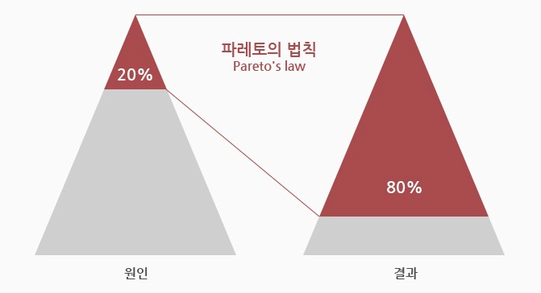
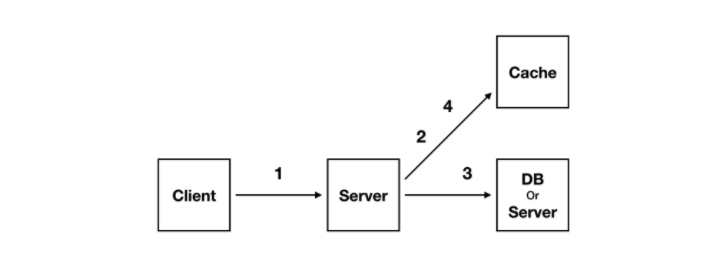

## Cache란?
__Cache란 나중에 요청할 결과를 미리 저장해둔 후 빠르게 서비스해주는 것을 의미__ 합니다. 즉, 미리 결과를 저장하고 나중에 요청이 오면 그 요청에 대해서 DB 또는 API를 참조하지 않고 Cache에 접근하여 요청을 처리하게 됩니다. 이러한 cache가 동작할 수 있는 철학에는 파레토 법칙이 있습니다.  

__파레토 법칙이란 80퍼센트의 결과는 20퍼센트의 원인으로 인해 발생__ 한다는 말입니다.



즉, 이것은 Cache가 효율적일 수 있는 이유가 될 수 있습니다. 모든 결과를 캐싱할 필요는 없으며, 우리는 서비스를 할 때 많이 사용되는 20%를 캐싱한다면 전체적으로 영향을 주어 효율을 극대화 할 수 있다는 말입니다.
<br>

## Cache 사용 방식


1. Client로부터 요청을 받는다.
2. Cache와 작업한다.
3. 실제 DB와 작업한다.
4. 다시 Cache와 작업한다.

Cache는 일반적으로 위와 같은 flow로 사용됩니다. 동일한 flow에서 어떻게 사용하느냐에 따라 look aside cache(Lazy Loading) 방식과와 write back 방식으로 나뉩니다.  


### look aside cache(Lazy Loading)
1. Cache에 Data 존재유무 확인
2. Data가 있다면 Cache의 Data 사용
3. Data가 없다면 실제 DB Data 사용
4. DB에서 가져온 Data를 Cache에 저장

look aside cache는 캐시를 한번 접근하여 데이터가 있는지 판단한 후, 있다면 cache의 데이터를 사용하며 없다면 실제 DB 또는 API를 호출하는 로직으로 구현됩니다. 대부분의 cache를 사용한 개발이 해당 방식을 따르고 있습니다.  


### Write back
1. Data를 Cache에 저장
2. Cache에 있는 Data를 일정 기간 동안 Check
3. Cache에 모여있는 Data를 한번에 DB에 저장
4. Cache에 있는 Data 삭제

write back은 cache를 다르게 이용하는 방법입니다. 애플리케이션은 DB에 접근 횟수가 적을수록 전체 시스템의 퍼포먼스는 좋아집니다. 데이터를 쓰거나 많은 데이터를 읽게되면 DB는 Disk에 접근하게 됩니다. 이렇게 되면 Application의 속도 저하가 일어날 수 있습니다. 따라서 write back은 데이터를 cache에 모으고 일정한 주기 또는 일정한 크기가 되면 한번에 처리하는 것입니다.

## Redis 특징과 주요 사용처

### 특징
+ Redis는 List, Set, Sorted Set, Hash 등과 같은 Collection을 지원합니다.
    - List : redis Strings의 묶음 Collection
    - Set : 중복되지 않는 값을 데이터로 갖는 Colelction
    - Sorted Set : 가중치(Score)를 갖고 가중치(Score)에 따른 정렬된 순서로 중복되지 않는 값을 데이터로 가지는 Colelction
    - Hash : Key 하나에 여러개의 Field와 Value로 구성된 즉, Key 내부에 또 다른 Key - value로 이루어진 Collection
+ Dump 파일과 AOF(Append Of File) 방식으로 메모리 상의 데이터를 디스크에 저장할 수 있습니다.
+ Master/Slave Replication 기능을 통해 데이터의 분산, 복제 기능을 제공하며 Query Off Loading 기능을 통해 Master는 Read/Write를 수행하고 Slave는 Read만 수행할 수 있습니다.
+ 파티셔닝(Partitioning)을 통해 동적인 스케일 아웃(Scale Out)인 수평 확장이 가능합니다.
+ Expiration 기능은 일정 시간이 지났을 때 메모리 상의 데이터를 자동 삭제할 수 있습니다.
+ Redis는 Single Thread -> Atomic 보장

### 주요 사용처
+ Remote Data Store
    - 여러 서버의 Data 공유를 위해 사용될 수 있습니다.    
    - 특히, Redis의 경우 Single Thread 이므로 Race Condition 발생 가능성이 낮다는 것을 활용할 필요가 있을 경우 사용을 고려할 수 있습니다.
+ 세션 스토리지
+ 인증 토큰 개발
+ Ranking Board (Sorted Set)
+ Job Queue

## Redis 설치 및 의존성 세팅
### Mac에서 Redis 설치하기
```sh
# 설치
brew install redis

# 버전확인
redis-server --version

# 실행 - redis를 Homebrew 서비스로 실행하면 재부팅후에도 자동으로 실행됩니다.
brew services start redis

# 중단
brew services stop redis

# 터미널 접속하는 방법
redis-cli -h localhost -p 6379

# 전체 키 조회
keys *

# 키 전체 삭제
flushall
```

### 의존성 및 yml 세팅
__build.gradle__  
```groovy
# redis 의존성
implementation 'org.springframework.boot:spring-boot-starter-data-redis'
implementation("org.apache.commons:commons-pool2:2.11.1")

# test를 위한 embedded redis
testImplementation group: 'it.ozimov', name: 'embedded-redis', version: '0.7.2'

# 만약 test 이외에도 embedded 사용하고 싶은 경우
// redis
implementation 'org.springframework.boot:spring-boot-starter-data-redis'
implementation ('it.ozimov:embedded-redis:0.7.3') {
    exclude group: 'org.slf4j', module: 'slf4j-simple'
}
```

__RedisConfig.java__  
```java
@Configuration
@EnableCaching
public class RedisConfiguration {

  @Bean
  public RedisTemplate<String, String> redisTemplate(RedisConnectionFactory redisConnectionFactory) {
    return new StringRedisTemplate(redisConnectionFactory);
  }

  @Bean
  public RedisConnectionFactory redisConnectionFactory() {
    ClusterTopologyRefreshOptions topologyRefreshOptions = ClusterTopologyRefreshOptions.builder()
            .enableAllAdaptiveRefreshTriggers() // 클라이언트가 클러스터의 상태 변화를 감지하고 자동으로 토폴로지를 새로 고칠 수 있도록 하는 여러 트리거를 활성화
            .enablePeriodicRefresh(Duration.ofSeconds(30)) // 정기적인 토폴로지 새로고침을 설정, 기본값이 disabled이므로 설정 필수, 권장 주기 30초, 
            .dynamicRefreshSources(true) // 기본값이 true이므로 설정하지 않아도 되지만 false로 변경은 금지
            .build();

    TimeoutOptions timeoutOptions = TimeoutOptions.builder()
            .timeoutCommands()
            .fixedTimeout(Duration.ofSeconds(3)) // redis 명령 timeout
            .build();
    
    // 앞선 옵션 적용
    ClusterClientOptions clientOptions = ClusterClientOptions.builder()
            .topologyRefreshOptions(topologyRefreshOptions)
            .timeoutOptions(timeoutOptions)
            .build();

    LettuceClientConfiguration lettuceClientConfiguration = LettucePoolingClientConfiguration.builder()
            .clientOptions(clientOptions)
            .poolConfig(new GenericObjectPoolConfig<>()) // apache에서 제공하는 pool 사용
            .build();

    return new LettuceConnectionFactory(new RedisClusterConfiguration(getRedisServerConnectionInfo()), lettuceClientConfiguration);
  }

  @Bean
  public CacheManager cacheManager(RedisConnectionFactory redisConnectionFactory) {
    // 캐시키 별 TTL 설정도 가능
//    Map<String, RedisCacheConfiguration> cacheConfiguration = new HashMap<>();
//    cacheConfiguration.put("test-key",RedisCacheConfiguration.defaultCacheConfig()
//            .entryTtl(Duration.ofSeconds(30)));
      
    return RedisCacheManager.RedisCacheManagerBuilder
            .fromConnectionFactory(redisConnectionFactory)
            .cacheDefaults(defaultConfiguration())
//            .withInitialCacheConfigurations(cacheConfiguration)
            .build();
  }

  private RedisCacheConfiguration defaultConfiguration() {
    return RedisCacheConfiguration.defaultCacheConfig()
            // 직렬화 도구 설정
            .serializeKeysWith(RedisSerializationContext.SerializationPair.fromSerializer(new StringRedisSerializer()))
            .serializeValuesWith(RedisSerializationContext.SerializationPair.fromSerializer(new GenericJackson2JsonRedisSerializer()))
            // null value는 캐싱 x
            .disableCachingNullValues()
            // ttl 시간 설정
            .entryTtl(Duration.ofHours(1L));
  }
    
  // TODO 자신의 redis ip, port 설정
  private List<String> getRedisServerConnectionInfo() {
    return List.of("ip:port", "ip:port");
  }
}
```

## Redis Repository 사용하기
__Redis용 객체__
```java
@Getter
@RedisHash("logoutAccessToken")
@AllArgsConstructor
@Builder
public class LogoutAccessToken {
    @Id
    private String id; 

    @Indexed // 필드 값으로 데이터 찾을 수 있게 하는 어노테이션(findByAccessToken)
    private String username;

    @TimeToLive
    private Long expiration; // seconds

    public static LogoutAccessToken createLogoutAccessToken(String accessToken, String username,Long remainingMilliSeconds){
        return LogoutAccessToken.builder()
                .id(accessToken)
                .username(username)
                .expiration(remainingMilliSeconds/1000)
                .build();
    }
}
```
+ RedisHash : Hash Collection 명시 -> Jpa의 Entity에 해당하는 애노테이션이라고 인지하면 됩니다.
    - value 값은 Key를 만들 때 사용하는 것으로 Hash의 Key는 value + @Id로 형성됩니다.
+ @Id : key를 식별할 떄 사용하는 고유한 값으로 @RedisHash와 결합해서 key를 생성하는 합니다.
    - 해당 애노테이션이 붙은 변수명은 반드시 id여야 합니다.
+ @Indexed : CRUD Repository를 사용할 때 jpa의 findBy필드명 처럼 사용하기 위해서 필요한 애노테이션입니다.
+ @TimeToLive : 유효시간 값으로 초단위 입니다. 유효 시간이 지나면 자동으로 삭제됩니다.
    - @TimeToLive(unit = TimeUnit.MILLISECONDS) 옵션으로 단위를 변경할 수 있습니다.


__Repository__
```java
public interface LogoutAccessTokenRedisRepository extends CrudRepository<LogoutAccessToken,String> {
        // @Indexed 사용한 필드만 가능
        Optional<LogoutAccessToken> findByUsername(String username);
}
```
이제 Jpa 처럼 redis로 save, findBy 등을 사용할 수 있습니다. Repository를 이용해 구현했지만 RedisTemplate으로도 구현할 수 있습니다. 이와 관련되 내용은 [여기](https://docs.spring.io/spring-data/redis/docs/current/api/org/springframework/data/redis/core/RedisTemplate.html)를 참고하면 좋을 것 같습니다.

## @DataRedisTest
SpringBootTest로 전체를 띄우지 않고 @DataRedisTest를 이용해서 간단하게 Redis와 관련된 것을 테스트할 수 있습니다. 실제 로직은 외부 redis를 사용하고 있으니 Test에서 Redis를 사용할 때는 EmbeddedRedis를 사용해야 합니다. 따라서 EmbeddRedis에 관한 세팅을 해야합니다.  

__src/test/resources/application-test.yml__
```yml
spring:  
  redis:
    lettuce:
      pool:
        min-idle: 0
        max-idle: 8
        max-active: 8
    port: 16379
    host: localhost
```
+ host : 레디스 서버 호스트
+ password : 레디스 서버 로그인 패스워드
+ max-active : pool에 할당될 수 있는 커넥션 최대수(음수로 사용시 무제한)
+ max-idle : pool의 idle 커넥션 최대수(음수로 사용시 무제한)
+ max-wait : pool이 바닥났을 때 예외발생 전에 커넥션 할당 차단의 최대 시간(단위: 밀리세컨드, 음수는 무제한 차단)
+ min-idle : pool에서 관리하는 idle 커넥션 최소 수(양수일 때만 유효)
+ sentinel.master : 레디스 서버 이름
+ sentinel.nodes : 호스트:포트 쌍 목록 (콤마로 구분)
+ timeout : 커넥션 타임아웃(단위: 밀리세컨드)

__cf) idle 상태 또는 유휴 상태__  
컴퓨터 처리 장치에서 유휴 또는 아이들(idle)은 어떠한 프로그램에 의해서도 사용되지 않는 상태를 말합니다.

<br>

__EmbeddedRedisConfig.java__  
test 디렉토리 안쪽에 생성해야 합니다. RedisConfig와 다른점은 Embedd Redis를 띄운다는 것이고 해당 포트가 미사용중이라면 사용하고 사용중이랑 그외 다른 포트를 사용하도록 하는 설정입니다. 참고로 윈도우에서는 안되고 맥/리눅스에서만 가능합니다. 윈도우에서 동일하게 사용하시려면 exe 프로세스를 찾는 코드를 작성해야 합니다.
```java
@TestConfiguration
public class EmbeddedRedisConfig {

    @Value("${spring.redis.port}")
    private int port;

    @Value("${spring.redis.host}")
    private String host;

    private RedisServer redisServer;

    @Bean
    public RedisConnectionFactory redisConnectionFactory() {
        LettuceConnectionFactory lettuceConnectionFactory = new LettuceConnectionFactory(host, port);
        // 패스워드가 있는경우
        // lettuceConnectionFactory.setPassword("");
        return lettuceConnectionFactory;
    }

    @PostConstruct
    public void redisServer() throws IOException {
        int port = isRedisRunning() ? findAvailablePort() : this.port;
        redisServer = new RedisServer(port);
        System.out.println("port = " + port);
        redisServer.start();
    }

    @PreDestroy
    public void stopRedis() {
        if (redisServer != null) {
            redisServer.stop();
        }
    }

    /**
     * Embedded Redis가 현재 실행중인지 확인
     */
    private boolean isRedisRunning() throws IOException {
        return isRunning(executeGrepProcessCommand(port));
    }

    /**
     * 현재 PC/서버에서 사용가능한 포트 조회
     */
    public int findAvailablePort() throws IOException {

        for (int port = 10000; port <= 65535; port++) {
            Process process = executeGrepProcessCommand(port);
            if (!isRunning(process)) {
                return port;
            }
        }

        throw new IllegalArgumentException("Not Found Available port: 10000 ~ 65535");
    }

    /**
     * 해당 port를 사용중인 프로세스 확인하는 sh 실행
     */
    private Process executeGrepProcessCommand(int port) throws IOException {
        String command = String.format("netstat -nat | grep LISTEN|grep %d", port);
        String[] shell = {"/bin/sh", "-c", command};
        return Runtime.getRuntime().exec(shell);
    }

    /**
     * 해당 Process가 현재 실행중인지 확인
     */
    private boolean isRunning(Process process) {
        String line;
        StringBuilder pidInfo = new StringBuilder();

        try (BufferedReader input = new BufferedReader(new InputStreamReader(process.getInputStream()))) {

            while ((line = input.readLine()) != null) {
                pidInfo.append(line);
            }

        } catch (Exception e) {
        }

        return !StringUtils.isEmpty(pidInfo.toString());
    }
}
```
<br>

__LogoutAccessTokenRedisRepositoryTest__
```java
@DataRedisTest
@Import(EmbeddedRedisConfig.class)
@ActiveProfiles("test")
class LogoutAccessTokenRedisRepositoryTest {

    @Autowired
    LogoutAccessTokenRedisRepository logoutAccessTokenRedisRepository;

    @BeforeEach
    void clear(){
        logoutAccessTokenRedisRepository.deleteAll();
    }

    @DisplayName("save")
    @Test
    void save() throws Exception{
        //given
        String accessToken = "accessToken";
        String username = "username";
        Long expiration = 3000L;
        LogoutAccessToken logoutAccessToken = LogoutAccessToken.createLogoutAccessToken(accessToken, username, expiration);

        //when
        logoutAccessTokenRedisRepository.save(logoutAccessToken);

        //then
        LogoutAccessToken find = logoutAccessTokenRedisRepository.findById(accessToken).get();

        assertAll(
                () -> assertEquals(accessToken,find.getId()),
                () -> assertEquals(username,find.getUsername()),
                () -> assertEquals(expiration/1000,find.getExpiration())
        );
    }
}
```

## Spring Caching
스프링에서는 Cache가 필요한 API, Controller, 메서드 등에 다음 애노테이션을 붙이면 별도의 Cache 메서드를 정의할 필요 없이 바로 캐시를 사용할 수 있습니다.
+ @Cacheable : 캐시가 있으면 캐시의 정보를 가져오고 없으면 등록한다.
+ @CachePut : 무조건 캐시에 저장한다. 캐시를 갱신하기 위해 실행을 강제한다.
+ @CacheEvict : 캐시를 삭제한다.
+ condition, unless 옵션으로 캐시적용여부 설정 가능
    - 옵션의 인자는 SpEL 지원

```java
@Cacheable(value = "zone",key = "#p0",unless = "#result == null")
Optional<Zone> findById(Long id);
```
+ value : Key와 같이 사용되어 캐시의 키값으로 사용
+ key : Value와 같이 사용되어 키값으로 사용
+ 앞서 설정한 캐시 매니저 세팅에서 CacheKeyPrefix.simple()를 사용했으므로 value::key 형태로 키값이 저장됩니다.
+ #p0 : 첫번째 파라미터
    - 만약 파라미터가 객체라면 #p0.userId 처럼도 사용 가능
    - #id 로도 사용 가능합니다.
+ unless = "#result == null" : 반환값이 null일 경우 캐시하지 않음
    - optional을 사용할 경우에는 optional이 아니고 담고 있는 객체로 판단합니다.
+ redis와 주고받고 해야하기 때문에 저장되는 결과값은 여기서 Zone은 기본 생성자가 있어야합니다.


__추가 예시__
```java
@Service
@Transactional
@RequiredArgsConstructor
public class DiseaseService implements DiseaseQueryUseCase{

    private final DiseaseRepository diseaseRepository;

    @Cacheable(value = "disease",
            key = "#diseaseId",
            unless = "#result == null" // null이면 캐싱하지 않음
    )
    @Override
    public DiseaseResponseDto getDisease(Long diseaseId) {
        ...
    }
}
```
```java
@Repository
@RequiredArgsConstructor
public class DiseaseRepositoryImpl implements DiseaseRepository {

    @Override
    @Cacheable(value = "simpleDisease",
            key = "#diseaseName",
            unless = "#result == null" // null이면 캐싱하지 않음
    )
    public SimpleDiseaseQueryDto findSimpleDiseaseQueryDtoByName(String diseaseName) {
        ...
    }

    // 캐시 삭제
    @CacheEvict(value = "simpleDisease", key = "#diseaseName") 
    public void deleteSimpleDiseaseQueryDtoByName(String diseaseName) {
        ...
    }
}
```
```java
@Cacheable(key = "#homeFeedRequestDto.pageable.pageNumber",
    value = "homeFeed",
    condition = "#homeFeedRequestDto.guest == true", // 조건문, 해당 값이 true일 때만 캐싱
    unless = "#result == null || #result.empty" // null이거나 비어있으면 캐싱하지 않음
)
public List<PostResponseDto> allHomeFeed(HomeFeedRequestDto homeFeedRequestDto) {
    ...
}
```
```java
@CacheEvict(value = "homeFeed", allEntries = true)
@Transactional
public Long write(PostRequestDto postRequestDto) {
    ...
}
```
allEntries가 true면 한번에 value 값인 모든 캐시를 삭제합니다.


더 자세한 내용은 [공식 문서](https://docs.spring.io/spring-framework/docs/current/reference/html/integration.html#cache-annotations) 를 확인하세요.


