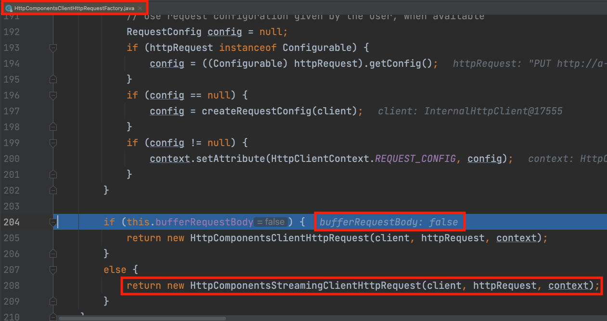
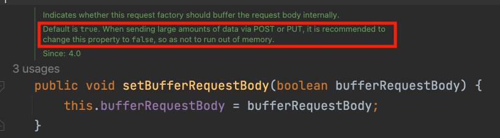
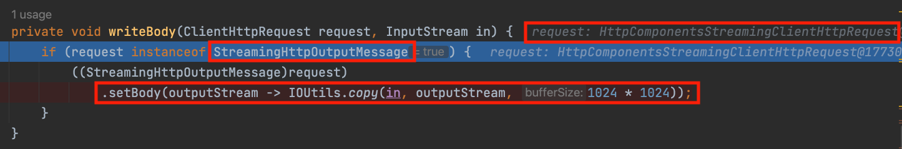
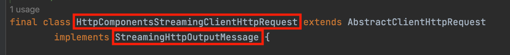
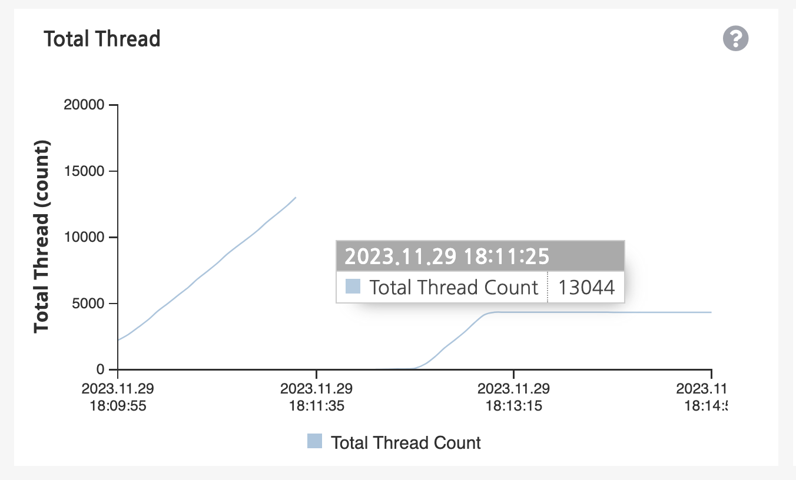

> 본 포스팅은 kotlin과 java 코드가 혼재되어있습니다.

## RestTemplate
Spring MVC에서는 외부 요청을 위해 RestTemplate을 사용합니다. 

### spring boot 3.x 설정
RestTemplate은 커넥션 풀을 지원하지 않아 구성 요소인 HttpClient를 통해서 커넥션과 관련된 추가 세팅을 진행합니다. 아래 RestTemplateGenerator 클래스는 restTemplate을 만들어내서 반환해주는 object 클래스로 spring boot 3.x 버전부터 사용하는 RestTemplate 설정입니다. 

```kotlin
object RestTemplateGenerator {

    // https://www.baeldung.com/httpclient-connection-management
    fun generateRestTemplate(
        restTemplateBuilder: RestTemplateBuilder,
        responseTimeout: Int,
        conMaxTotal: Int,
        maxPerRoute: Int,
        conRequestTimeout: Int,
        conTimeout: Int,
        errorHandler: ResponseErrorHandler? = null,
    ): RestTemplate {
        val connManager = connectionManager(conMaxTotal, maxPerRoute, responseTimeout)
        val httpClient = httpClients(connManager)
        val factory = httpComponentsClientHttpRequestFactory(httpClient, conRequestTimeout, conTimeout)
        val restTemplate = restTemplateBuilder.requestFactory(Supplier { factory }).build()
        errorHandler?.let { restTemplate.errorHandler = it }
        return restTemplate
    }

    fun generateFileRestTemplate(
        restTemplateBuilder: RestTemplateBuilder,
        responseTimeout: Int,
        conMaxTotal: Int,
        maxPerRoute: Int,
        conRequestTimeout: Int,
        conTimeout: Int,
        timeToLive: Long,
        errorHandler: ResponseErrorHandler? = null,
    ): RestTemplate {
        val connManager = connectionManager(conMaxTotal, maxPerRoute, responseTimeout, timeToLive)
        val httpClient = httpClients(connManager)
        val factory = httpComponentsClientHttpRequestFactory(httpClient, conRequestTimeout, conTimeout, false)
        val restTemplate = restTemplateBuilder.requestFactory(Supplier { factory })
            .messageConverters(ResourceHttpMessageConverter(true))
            .build()
        errorHandler?.let { restTemplate.errorHandler = it }
        return restTemplate
    }

    private fun connectionManager(
        maxTotal: Int,
        maxPerRoute: Int,
        responseTimeout: Int,
        timeToLive: Long = 10, // 설정하지 않으면 -1
    ): PoolingHttpClientConnectionManager {
        return PoolingHttpClientConnectionManagerBuilder.create()
            .setMaxConnTotal(maxTotal) // 연결 유지할 커넥션 토탈 개수
            .setMaxConnPerRoute(maxPerRoute) // 특정 경로다 ㅇ커넥션 개수 제한
            .setDefaultSocketConfig(
                SocketConfig.custom() // response timeout
                    .setSoTimeout(responseTimeout, TimeUnit.MILLISECONDS)
                    .build(),
            )
            .setDefaultConnectionConfig(
                // https://stackoverflow.com/questions/39644479/poolingnhttpclientconnectionmanager-what-is-timetolive-attribute-for
                ConnectionConfig.custom() // 커넥션 timeout
                    .setTimeToLive(timeToLive, TimeUnit.SECONDS)
                    .build(),
            )
            .build()
    }

    private fun httpClients(
        poolingHttpClientConnectionManager: PoolingHttpClientConnectionManager,
    ): CloseableHttpClient {
        return HttpClients.custom()
            .setKeepAliveStrategy(DefaultConnectionKeepAliveStrategy())
            .setConnectionManager(poolingHttpClientConnectionManager)
            // 연결이 idle 상태로 남아 있을 때 이를 정리하고 메모리를 관리하기 위한 메서드
            // 커넥션 풀에서 일정 시간 동안 사용되지 않은 연결을 제거
            .evictExpiredConnections()

            // 커넥션 풀에서 설정된 최대 수명이 지난 연결을 제거
            // default는 무한이지만, 업로드 중간에 idle 상태가 되어버리면 완료되지 않았음에도 close 될 수 있어서 주석 처리
            // .evictIdleConnections(TimeValue.ofSeconds(80)) 
            .build()
    }

    private fun httpComponentsClientHttpRequestFactory(
        closeableHttpClient: CloseableHttpClient,
        conRequestTimeout: Int,
        conTimeout: Int,
        bufferRequestBody: Boolean = true, // upload template 은 false 사용
    ): HttpComponentsClientHttpRequestFactory {
        return HttpComponentsClientHttpRequestFactory(closeableHttpClient).apply {
            setConnectionRequestTimeout(conRequestTimeout)
            setConnectTimeout(conTimeout)
            setBufferRequestBody(bufferRequestBody)
        }
    }
}
```
generateRestTemplate 메서드와 generateFileRestTemplate 메서드의 차이는 ResourceHttpMessageConverter 컨버터 등록과 bufferRequestBody 옵션의 차이입니다. 해당 옵션의 설명은 바로 아래서 설명하겠습니다.

### Controller request로부터 받은 파일 업로드 하기
```kotlin
fun upload(
    param: Param,
    data: InputStream
): String {
    return fileRestTemplate.execute(
        param.uri,
        HttpMethod.PUT,
        {
            it.headers.add("X-Upload-Content-Length", param.partLength.toString())
            (it as StreamingHttpOutputMessage).setBody { out -> data.transferTo(out) }
        },
        { it.headers.getFirst("Etag") }
    )!!
}
```
execute 메서드는 uri, method, requestCallback, responseExtractor을 인자로 받습니다. requestCallback은 요청을 보내기 전에 값을 세팅해주는 것이고 responseExtractor는 응답을 받아서 추출(조작)하는 것입니다. requestCallback 부분을 조금 더 살펴봅시다.

<br>



equestCallback 부분의 request부터 디버깅을 따라가다 보면 HttpComponentsClientHttpRequestFactory 클래스의 createRequest() 메소드를 호출하고 있습니다. 해당 메서드 코드를 보면 앞전에 restTemplate 설정에서 bufferRequestBody를 false로 두었기 때문에 else 분기를 타게 되면서 HttpComponentsStreamingClientHttpRequest를 생성하게 됩니다.

<br>



그럼 여기서 이 false 옵션이 도대체 무엇인지 봅시다. 주석에 의하면 POST, PUT을 통해 대량의 데이터를 전송할 때는 메모리가 부족하지 않도록 해당 속성을 false로 변경하라고 되어있습니다. 기본값인 true로 설정하면 요청 본문을 메모리에 버퍼링합니다. 이는 요청을 보내기 전에 전체 본문을 메모리에 저장하고, 그 후 HTTP 요청을 보내는 방식입니다. false의 경우 데이터는 메모리에 버퍼링되지 않고 직접 네트워크를 통해 전송됩니다.

<br>



HttpComponentsStreamingClientHttpRequest가 반환되므로 이제 requestCallback에 들어오는 request가 어떤 request인지 이해할 수 있습니다.

<br>



requestCallback쪽을 보면 instaceof로 StreamingHttpOutputMessage로 형변환하는 것이 있는데 HttpComponentsStreamingClientHttpRequest는 StreamingHttpOutputMessage의 구현체이기 때문에 가능합니다. data.transferTo 메서드를 통해 inputstream을 outputStream으로 write 작업 수행합니다.


## 대용량 다운로드를 위한 restTemplate
ResourceHttpMessageConverter는 spring에서 제공하는 HttpMessageConverter의 한 종류로, 주로 서버에서 클라이언트로 Resource 타입의 데이터(파일, 이미지)를 전송할 때 사용됩니다. ResourceHttpMessageConverter는 모든 유형의 octet-stream 타입 요청에 대해서 Spring에서 제공하는 Resource로 타입으로의 변환을 지원해줍니다. 즉, 이 컨버터를 사용하면, 대용량 파일을 스트림 형태로 직접 다운로드할 수 있어, 메모리 사용량을 줄이면서도 대용량 파일을 효율적으로 다룰 수 있습니다. restTemplate은 기본적으로 성능을 위해 아무런 컨버터가 등록되어있지 않으므로 대용량 파일을 처리하기 위해서는 컨버터로 등록해줘야 합니다.  

RestTemplate은 응답 타입을 Resource 타입으로 지정했을 때, ResourceHttpMessageConverter를 사용하여 응답을 처리하게 됩니다. 이때 바이트 배열을 사용하지 않고 스트림 통신을 사용하게 됩니다.(메모리를 사용하지 않고 통로를 열어둔것)

```java
@Override
protected Resource readInternal(Class<? extends Resource> clazz, HttpInputMessage inputMessage)
        throws IOException, HttpMessageNotReadableException {

    if (this.supportsReadStreaming && InputStreamResource.class == clazz) {
        return new InputStreamResource(inputMessage.getBody()) {
            @Override
            public String getFilename() {
                return inputMessage.getHeaders().getContentDisposition().getFilename();
            }
            @Override
            public long contentLength() throws IOException {
                long length = inputMessage.getHeaders().getContentLength();
                return (length != -1 ? length : super.contentLength());
            }
        };
    }
    else if (Resource.class == clazz || ByteArrayResource.class.isAssignableFrom(clazz)) {
        byte[] body = StreamUtils.copyToByteArray(inputMessage.getBody());
        return new ByteArrayResource(body) {
            @Override
            @Nullable
            public String getFilename() {
                return inputMessage.getHeaders().getContentDisposition().getFilename();
            }
        };
    }
    else {
        throw new HttpMessageNotReadableException("Unsupported resource class: " + clazz, inputMessage);
    }
}
```

내부적으로 코드를 까보면, ResourceHttpMessageConverter를 등록하게 되면 supportsReadStreaming값이 true가 되면서 stream 통신을 하게 되는 것을 확인할 수 있습니다. 따라서 메모리에 올라가지 않아도 스트림으로 통신을 하고 있기 때문에 이 통로가 끊기면 안됩니다. 

```java
// 원본 RestTemplate의 doExecute 메서드
@Nullable
protected <T> T doExecute(URI url, @Nullable HttpMethod method, @Nullable RequestCallback requestCallback,
        @Nullable ResponseExtractor<T> responseExtractor) throws RestClientException {

    Assert.notNull(url, "URI is required");
    Assert.notNull(method, "HttpMethod is required");
    ClientHttpResponse response = null;
    try {
        ClientHttpRequest request = createRequest(url, method);
        if (requestCallback != null) {
            requestCallback.doWithRequest(request);
        }
        response = request.execute();
        handleResponse(url, method, response);
        return (responseExtractor != null ? responseExtractor.extractData(response) : null);
    }
    catch (IOException ex) {
        String resource = url.toString();
        String query = url.getRawQuery();
        resource = (query != null ? resource.substring(0, resource.indexOf('?')) : resource);
        throw new ResourceAccessException("I/O error on " + method.name() +
                " request for \"" + resource + "\": " + ex.getMessage(), ex);
    }
    finally {
        if (response != null) {
            response.close();
        }
    }
}
```
위 코드는 원본 restTemplate의 doExecute 코드입니다. 마지막에 finally 구문으로 인해 대용량 파일 다운로드의 경우 문제가 발생합니다. restTemplate에서 스트림 기반으로 데이터를 처리하는 경우, doExecute가 완료되는 순간 finally 블록에 의해 스트림이 닫힐 수 있습니다. 이는 스트림을 통해 데이터를 계속 읽거나 쓰려는 작업에 영향을 줄 수 있으며, 데이터가 완전히 전송되기 전에 끊어져 데이터 손실이 발생합니다. 따라서 이 부분을 제거해줘야 합니다.

```java
public class NonClosingRestTemplate extends RestTemplate {

    public NonClosingRestTemplate(List<HttpMessageConverter<?>> messageConverters) {
        super(messageConverters);
    }

    @Override
    @Nullable
    protected <T> T doExecute(URI url, @Nullable HttpMethod method, @Nullable RequestCallback requestCallback,
        @Nullable ResponseExtractor<T> responseExtractor) {

        Assert.notNull(url, "URI is required");
        Assert.notNull(method, "HttpMethod is required");
        ClientHttpResponse response = null;
        try {
            ClientHttpRequest request = createRequest(url, method);
            if (requestCallback != null) {
                requestCallback.doWithRequest(request);
            }
            response = request.execute();
            handleResponse(url, method, response);
            return (responseExtractor != null ? responseExtractor.extractData(response) : null);
        } catch (IOException ex) {
            String resource = url.toString();
            String query = url.getRawQuery();
            resource = (query != null ? resource.substring(0, resource.indexOf('?')) : resource);
            if (response != null) {
                response.close();
            }
            throw new ResourceAccessException("I/O error on " + method.name()
                + " request for \"" + resource + "\": " + ex.getMessage(), ex);
        } catch (Exception e) {
            if (response != null) {
                response.close();
            }
            throw e;
        }
    }
}
```
finally 구문만 제거된 것으로 보면 됩니다. finally 구문을 제거해주었기 때문에 어디선가는 이 작업을 해줘야만 합니다. 이 부분은 사용처에서 try-with-resource 구문으로 처리해줍니다.

```java
try (ResponseEntity<InputStreamResource> responseEntity = fileRestTemplate.exchange(
        url,
        HttpMethod.GET,
        new HttpEntity<String>(httpHeaders),
        InputStreamResource.class);
    } catch (IOException e) {
        throw e;
    }
```

## restTemplate 등록 시 주의사항

RestTemplateGenerator object 클래스의 메서드를 통해 restTemplate을 별도로 만들어서 사용하다가 문제가 발생했습니다. 성능 테스트 결과 thread count가 13,000까지 올라갔다가 서버가 죽는 현상이 발생했습니다. thread dump 결과 **idle-connection-evictor-1** 이름을 가진 스레드가 계속 생성되는 것을 확인할 수 있었습니다. 스레드의 이름으로 보았을 때, restTemplate의 evictIdleConnections, evictExpiredConnections 설정을 의심해 볼 수 있었습니다. 해당 메서드에는 다음과 같은 설명이 포함되어 있습니다.

> One MUST explicitly close HttpClient with CloseableHttpClient.close() in order to stop and release the background thread.

백그라운드 스레드를 중지하고 해제하려면 CloseableHttpClient.close()를 사용하여 HttpClient를 명시적으로 닫아야한다고 합니다. 그래서 일단 옵션을 제거해보니 evict 관련 스레드가 아예 생성되지 않아서 스레드가 증가하지 않는 것을 확인할 수 있었습니다. 이후에 다시 옵션을 추가하고 restTemplate을 사용하는 곳에서 finally를 통해 httpClient.close()를 호출하니 evict 관련 스레드는 새로 생성되었다가 close 호출 후 사라지는 것을 확인할 수 있었습니다.  

즉, restTemplate은 커넥션 풀을 지원하지 않아 구성 요소인 HttpClient를 통해서 이를 보완하는데 HttpClient에서 사용한 evictIdleConnections, evictExpiredConnections 옵션으로 인해 문제가 발생한 것입니다. restTemplate을 사용하는 곳마다 별도로 생성해서 사용하고 있는데 과정에서 HttpClient가 계속적으로 생성되다 보니 무거워질 수 밖에 없었던 것이 문제였습니다.  

따라서 이를 위해 restTemplate을 지속적으로 생성하는 것이 아닌 빈등록으로 사용하여 해결할 수 있었습니다.

```kotlin
@Bean
fun fileRestTemplateTimeoutOneMinute(): RestTemplate {
    return generateRestTemplate(
        restTemplateBuilder = restTemplateBuilder,
        responseTimeout = 60000,
        conMaxTotal = 15,
        maxPerRoute = 15,
        conRequestTimeout = 3000,
        conTimeout = 3000,
        errorHandler = ...,
    )
}
```


<br><br>

__참고__  
[How to forward large files with RestTemplate?](https://stackoverflow.com/questions/15781885/how-to-forward-large-files-with-resttemplate/36226006#36226006)