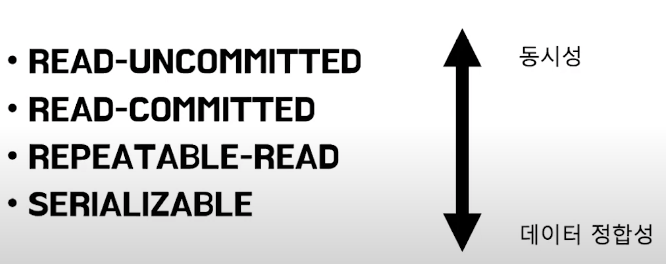
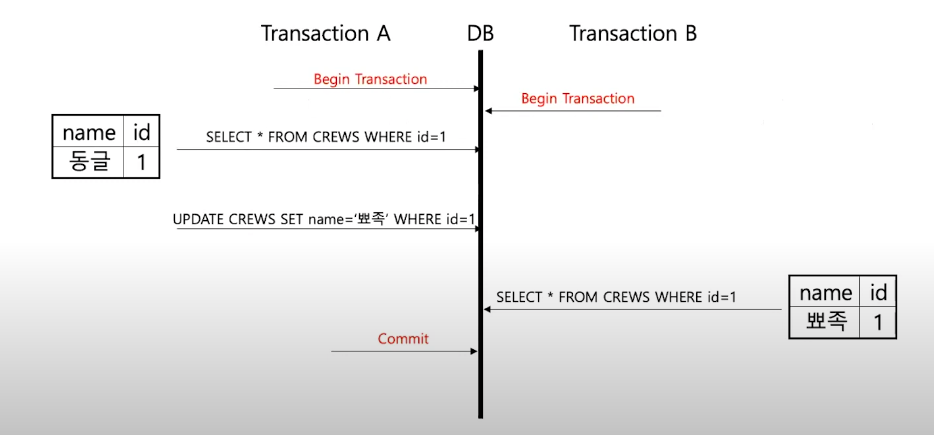
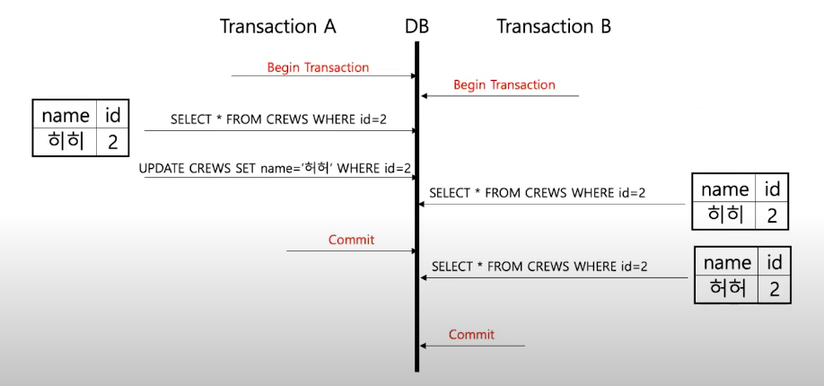
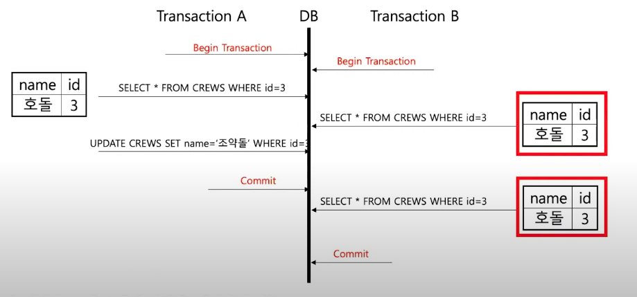
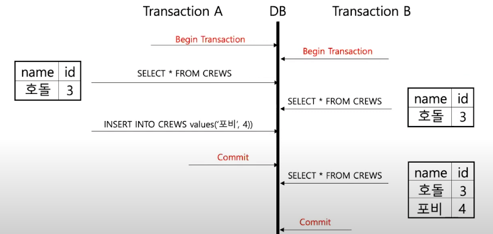
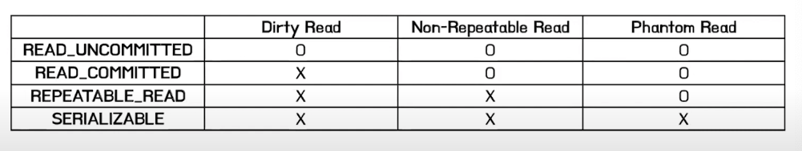
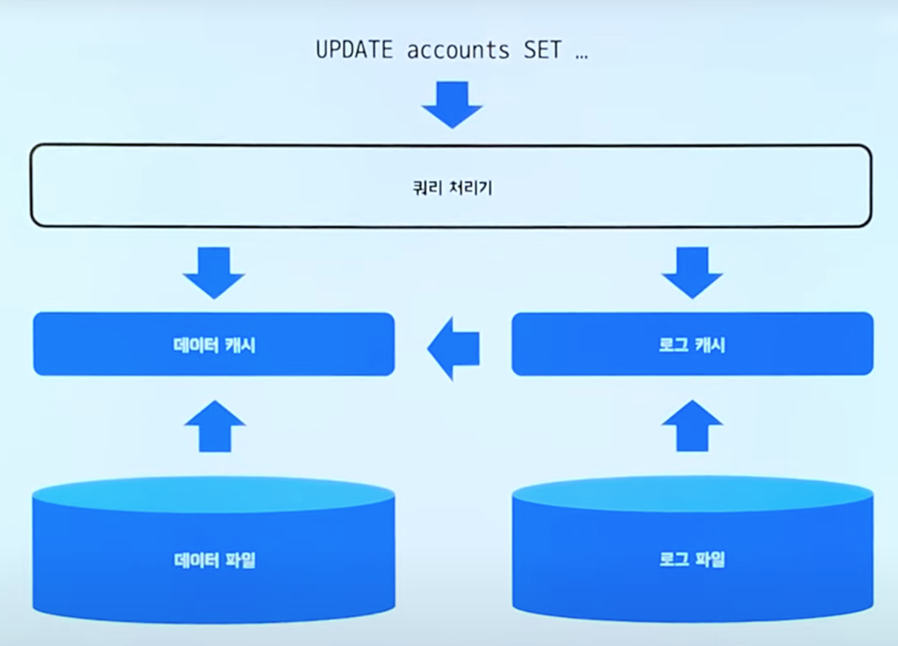
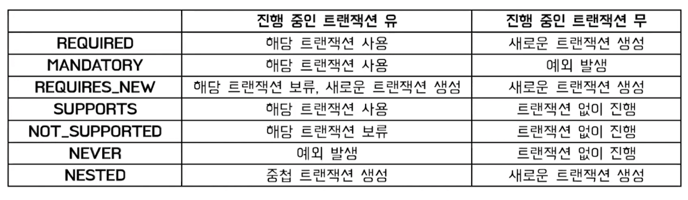
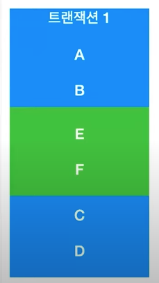
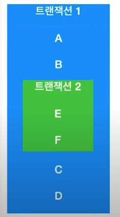

# DB 트랜잭션 이해하기
## 트랜잭션이란?
트랜잭션이란 __데이터베이스의 상태를 변환시키는 하나의 논리적 기능을 수행하기 위한 작업의 단위 또는 한꺼번에 모두 수행되어야 할 일련의 연산들__ 을 의미합니다. 하나의 트랜잭션이 모두 실행되었을 때를 __Commit__ 이라고 합니다. 일종의 확인 도장으로 트랜잭션에 묶인 모든 쿼리가 성공되어 결과가 실제 DB에 반영하는 것입니다. 하나의 트랜잭션이 모두 실행되지 않도록 하는 __RollBack__ 이라고 합니다. 쿼리 실행결과를 취소하고 DB를 트랜잭션 이전 상태로 되돌리는 것입니다.  

## 트랜잭션의 특징
트랜잭션이 안전하게 수행된다는 것을 보장하기 위한 성질을 __ACID__ 라고 합니다.
+ A : Atomicity(원자성)
    - 트랜잭션은 DB에 모두 반영되거나, 전혀 반영되지 않아야 한다.
    - 완료되지 않은 트랜잭션의 중간 상태를 DB에 반영해서는 안 된다.
+ C : Consistency(일관성)
    - 트랜잭션이 성공적으로 완료하면 일관성 있는 데이터베이스 상태로 유지한다.
+ I : Isolation(독립성)
    - 둘 이상의 트랜잭션이 동시 실행되고 있을 때, 어떤 트랜잭션도 다른 트랜잭션 연산에 끼어들 수 없다.
    - 각각의 트랜잭션은 서로 간섭 없이 독립적으로 이루어져야 한다.
+ D : Durability(지속성)
    - 트랜잭션이 완료되었으면 결과는 영구히 반영되어야 한다.

ACID 성질은 트랜잭션이 이론적으로 보장해야하는 성질이고, 실제로는 성능 문제를 위해 격리 수준을 조정하여 성질 보장이 완화되곤 합니다.

## 트랜잭션 격리 수준
  
격리 수준이란 동시에 DB에 접근할 때 그 접근을 어떻게 제어할지에 대한 설정을 의미합니다.  

### READ-UNCOMMITTED
__커밋이나 롤백에 상관없이 트랜잭션의 데이터 변경 내용을 다른 트랜잭션이 읽는 것을 허용하는 트랜잭션 수준입니다.__  

  

트랜잭션 A에서 데이터를 조회하여 변경하고 아직 COMMIT하지 않은 상태에서 트랜잭션 B가 같은 데이터를 읽게 되면 변경되었지만 아직 커밋되지 않은 데이터를 읽어오게 됩니다. 이렇게 __변경 사항이 반영되지 않은 값을 다른 트랜잭션에서 읽는 현상을 Dirty Read__ 라고 합니다. 즉, READ-UNCOMMITTED 수준에서는 Dirty Read의 문제가 발생합니다.(뒤에서 언급되는 Nonrepeatable read, Phantom read도 발생합니다.)

### READ-COMMITTED
__커밋이 완료된 트랜잭션의 변경사항만 다른 트랜잭션에서 조회하는 것을 허용합니다.__  



트랜잭션 A가 데이터를 조회하고 변경한 뒤 커밋하기 전 상태에서 트랜잭션 B가 같은 데이터를 조회하면, 변경하기 전 값을 읽어오게 됩니다. 트랜잭션 A가 커밋한 이후에 트랜잭션 B에서 데이터를 조회하면 커밋된 데이터를 읽어오게 됩니다. 트랜잭션 B에서는 한 트랜잭션 내에서 같은 쿼리를 두 번 수행했는데 그 사이에 트랜잭션 A가 값을 수정 또는 삭제함으로써 두 쿼리의 결과가 다르게 나타나는 비일관성 현상이 발생했습니다. 이렇게 __한 트랜잭션 내에서 같은 쿼리를 두 번 수행할 때 그 사이에 다른 트랜잭션이 값을 수정 또는 삭제함으로써 두 쿼리의 결과가 상이하게 나타나는 비 일관성 발생하는 현상을 Nonrepeatable read__ 라고 합니다. 즉, READ-COMMITTED는 Dirty Read 현상을 해결했지만, Nonrepeatable read 현상이 발생합니다.(뒤에서 언급되는 Phantom read도 발생합니다.)

### REPEATABLE READ
__트랜잭션 범위 내에서 조회한 내용이 항상 동일함을 보장합니다. MySQL InnoDB에서 기본으로 사용되는 격리 수준입니다.__  

트랜잭션은 고유한 번호를 가지며 Undo 영역에서 백업된 모든 레코드에는 변경을 발생시킨 트랜잭션의 번호가 포함되어 있습니다. 하나의 트랜잭션 안에서 일어나는 모든 SELECT 쿼리는 자신의 트랜잭션 번호보다 작은 트랜잭션 번호에서 변경한 사항들만 볼 수 있습니다. 이러한 방식을 MVCC라고 합니다.

> MVCC(Multiversion Concurrency Control)는 다중 버젼 동시성 제어의 약자로 DBMS에서 서로 다른 세션이 동일한 데이터에 접근했을 때 각 세션마다 스냅샷 이미지를 보장해주는 매커니즘입니다. RDBMS에서 동시성을 높이기 위해 등장한 기술입니다. MVCC의 가장 큰 목적은 Lock을 사용하지 않는 일관된 읽기를 제공하기 위함이며, InnoDB에서는 Undo log를 이용하여 이 기능을 제공하고 있습니다.

  

트랜잭션 A에서 데이터를 읽고 수정한 뒤 커밋하기 전 상태에서 트랜잭션 B가 같은 데이터를 읽으면 수정하기 전 상태의 데이터를 읽게 됩니다. 트랜잭션 A가 커밋을 했다고 하더라도, 트랜잭션 B에서는 트랜잭션 B가 시작할때의 스냅샷을 기준으로 데이터를 조회하기 때문에 변경된 값이 아니라 이전에 조회했던 결과값을 그대로 사용합니다.  


  
REPEATABLE READ에서는 Phantom read현상이 발생할 수 있습니다. 한 트랜잭션 안에서 특정 레코드 조회가 아닌 __일정범위의 레코드를 조회할 경우, 첫 번재 쿼리에서 없던 유령 레코드가 두번째 쿼리에서 나타나는 현상을 __Phantom read__ 라고 합니다. 

### SERIALIZABLE
__한 트랜잭션에서 사용하는 데이터를 다른 트랜잭션에서 접근 불가능하도록 하는 것입니다.__ 가장 엄격한 수준으로 앞선 문제들을 방지하지만 동시성 처리 성능이 급격히 하락합니다.


### 정리



## 트랜잭션이 복구하는 방식
계좌 이체 과정을 통해 예시를 들어보겠습니다.
1. 구매자의 계좌에서 돈이 출금된다.
2. 판매자의 계좌에서 돈이 입금된다.

```sql
UPDATE accounts
SET balance = balance - 10000
WHERE user = '구매자'

UPDATE accounts
SET balance = balance + 10000
WHERE user = '판매자'
```
만약 위의 수행 과정 중에 오류가 발생하면 다음과 같은 오류가 예상됩니다.
+ 구매자의 계좌에 돈이 출금된 뒤 DB가 다운
+ 구매자의 계좌에서 돈이 출금되지 않았는데, 판매자에게 돈이 입금
+ 출금도 입금도 X

위와 같은 어중간한 상태로 두면 안되기 때문에 __초기상태로 되돌리는게__ 중요합니다. 이를 해주는 역할을 하는 것이 __트랜잭션__ 입니다.  


```sql
-- 실행되는 쿼리
BEGIN TRAN
UPDATE accounts
SET balance = balance - 10000
WHERE user = '구매자';
UPDATE accounts
SET balance = balance + 10000
WHERE user = '판매자';
COMMIT TRAN
```
1. 구매자의 계좌에서 인출하는 쿼리를 요청합니다.
2. 쿼리 처리기를 통과합니다.
3. 데이터 캐시에 데이터가 있는지 확인합니다.
4. 데이터 파일에서 데이터를 가져와 데이터 캐시로 로드합니다.
5. 로그에 기록합니다.
    + ReDo 로그 : 변경 후의 값을 기록합니다.
    + UndDo 로그 : 변경 전의 값을 기록합니다.
6. 데이터 캐시에 있는 데이터를 업데이트(변경)힙니다.
7. 판매자에게 입금하는 요청도 똑같이 발생합니다.

판매자 입금 요청까지 다 로그 캐시에 쌓인 상태에서 문제가 생겨 ROLLBACK을 해야 한다면 UnDo로그를 역순으로 기록하면 이전 상태로 원상 복구가 가능합니다. 만약 ROLLBACK 명령어 없이 전원이 나가는 등 예상치 못한 오류가 발생할 경우, ReDo로그를 순차적으로 사용해서 일관성있게 데이터를 만들어주고 UnDo 로그를 역순으로 기록하여 원상 복구합니다. 만약 동시 접근이 가능하다면 락을 사용하여 데이터 접근을 트랜잭션이 끝날 때 까지 점유해줍니다.

# Spring Transaction 이해하기
Spring의 트랜잭션을 이해하기 위해서는 Connection pool과 Datasource에 대한 이해가 필요합니다.

## 커넥션 풀 이해

### 커넥션 풀을 사용하지 않을 때

[##_Image|kage@pHX9F/btsCJj3RAwZ/HlCKW8QV6K4x7zlKQ8k9k1/img.png|CDM|1.3|{"originWidth":1015,"originHeight":334,"style":"alignCenter","filename":"1.png"}_##]

1.  애플리케이션 로직은 DB 드라이버를 통해 커넥션을 조회합니다.
2.  DB 드라이버는 DB와 TCP/IP 커넥션을 연결합니다.
3.  DB 드라이버는 연결이 완료되면 ID, PW와 기타 부가정보를 DB에 전달합니다.
4.  DB는 ID, PW를 통해 인증을 완료하고 내부에 DB 세션을 생성합니다.
5.  DB는 커넥션 생성이 완료되었다는 응답을 보냅니다.
6.  DB 드라이버는 커넥션 객체를 생성해서 클라이언트에 반환합니다.

커넥션 풀을 사용하지 않을 경우 매번 커넥션을 생성하는 위와 같은 과정을 거쳐야 합니다.

### 커넥션 풀을 사용할 때

[##_Image|kage@dqHael/btsCSbCMs5f/05IUIK8ZG7yZiGXflmLK31/img.png|CDM|1.3|{"originWidth":595,"originHeight":269,"style":"alignCenter","width":860,"height":389,"filename":"2.png"}_##]

**애플리케이션을 시작하는 시점에 커넥션 풀은 필요한 만큼 커넥션을 미리 확보해서 풀에 보관합니다.** 보통 얼마나 보관할지는 서비스의 특징과 스펙에 따라 다르지만 기본값은 10개입니다. 커넥션 풀에 들어 있는 커넥션은 이미 TCP/IP로 DB와 커넥션이 연결되어 있는 상태이기 때문에 언제든지 즉시 SQL을 DB에 전달할 수 있습니다.

[##_Image|kage@dFx7YZ/btsCOGjfjKN/tSQ3K3DSLyRearjsA4zeak/img.png|CDM|1.3|{"originWidth":611,"originHeight":244,"style":"alignCenter","width":860,"height":343,"filename":"3.png"}_##]

애플리케이션 로직에서는 이제 DB 드라이버를 통해서 새로 커넥션을 획득하는 것이 아니라 커넥션 풀을 통해 이미 생성되어 있는 커넥션을 객체 참조로 그냥 가져다 쓰기만 하면 됩니다. 커넥션 풀에 커넥션을 요청하면 커넥션 풀은 자신이 가지고 있는 커넥션 중 하나를 반환합니다. **커넥션을 모두 사용하고 나면 커넥션을 종료하는 것이 아니라 다음에 다시 사용할 수 있도록 해당 커넥션을 그대로 커넥션 풀에 반환합니다.** 커넥션 풀을 사용함으로써 시간적, 리소스적으로 절약할 수 있음과 더불어 DB에 무한정 연결이 생성되는 것을 막아주어 DB를 보호하는 효과도 있습니다. 커넥션 풀 오픈 소스는 여러 가지 있지만 성능과 사용의 편리함 측면에서 hikariCP를 사용합니다. **스프링 부트 2.0부터는 기본 커넥션 풀로 hikariCP를 제공합니다.**

## DataSource 이해

[##_Image|kage@u8l4b/btsCTvHLTIN/hUPWkcODzDkIclSMmrofwk/img.png|CDM|1.3|{"originWidth":593,"originHeight":275,"style":"alignCenter","width":860,"height":399,"filename":"4.png"}_##]

커넥션을 얻는 방법은 DriverManager를 직접 사용해서 새로운 커넥션을 새로 생성하거나 커넥션 풀을 사용하는 등 다양한 방법이 있습니다. 만약 DriverManager를 통해서 커넥션을 획득하다가 HikariCP 커넥션 풀을 사용하는 방법으로 변경하려고 한다면 커넥션을 획득하는 애플리케이션 로직을 전부 변경해야 하는 문제가 생깁니다. 의존관계가 DriverManager에서 HikariCP로 변경되기 때문입니다. 이런 문제 때문에 등장한 것이 DataSource입니다.

[##_Image|kage@cVWPng/btsCLaL9bye/9Ae7HX0KGQRXe2z3tpIjnk/img.png|CDM|1.3|{"originWidth":829,"originHeight":402,"style":"alignCenter","width":860,"height":417,"filename":"5.png"}_##]

DataSource는 **커넥션을 획득하는 방법을 추상화하는 인터페이스입니다.** 인터페이스의 핵심 기능은 **커넥션 조회입니다.** 대부분의 커넥션 풀은 DataSource 인터페이스를 이미 구현해 두었으므로 커넥션 풀이 아니라 DataSource 인터페이스에만 의존하도록 애플리케이션 로직을 구현하면 됩니다. 이후 커넥션 조회 기술을 변경하고 싶다면 해당 구현체로 갈아 끼우기만 하면 됩니다.

예외적으로 DriverManager는 DataSource 인터페이스를 사용하지 않습니다. 이 문제를 해결하기 위해 DriverManager도 DataSource를 통해 사용할 수 있도록 스프링에서는 DriverManagerDataSource라는 DataSource를 구현한 클래스를 제공합니다.

정리하자면, 커넥션을 생성하고 가져오는 방식에는 여러 가지 오픈 소스 커넥션 풀과 DriverManager가 있는데 코드레벨에서는 다를지라도 논리적인 기능적 측면에서 보면 커넥션을 생성하고 가져오는 일을 하기 때문에 이 기능을 DataSource로 추상화한 것입니다. 따라서, 로직에서는 추상화인 DataSource에 의존하도록 작성하고 기술을 교체해야 하는 일이 생기면 구현체만 교체하면 됩니다.  

spring boot를 사용하는 개발자라면 특별한 경우가 아니라면 따로 DataSource에 대한 설정을 하지 않고 yml 설정으로 대체합니다.
```yml
spring:
  datasource:
    driver-class-name: com.mysql.cj.jdbc.Driver
    url: jdbc:mysql://localhost:3306/transaction_test?serverTimezone=UTC&characterEncoding=UTF-8
    username: root
    password: root
```

## 트랜잭션
### 데이터베이스 연결 구조와 DB 세션

[##_Image|kage@RSdsv/btsCTyLb32y/CKDn9p7U0NZDeYob8h4zKK/img.png|CDM|1.3|{"originWidth":946,"originHeight":280,"style":"alignCenter","filename":"6.png"}_##]

사용자는 WAS나 DB 접근 툴 같은 클라이언트를 사용해 DB 서버에 접근하여 연결을 요청하고 커넥션을 맺습니다. 이때 DB 서버는 내부에 세션을 만들고 앞으로 해당 커넥션을 통한 모든 요청을 해당 세션을 통해 실행합니다. 즉, 개발자가 클라이언트를 통해 SQL을 전달하면 현재 커넥션에 연결된 세션이 SQL을 실행합니다. 세션은 트랜잭션을 시작하고, 커밋 또는 롤백을 통해 트랜잭션을 종료할 수 있으며 이후에 새로운 트랜잭션을 다시 시작할 수도 있습니다.

### 트랜잭션 추상화

[##_Image|kage@bP8GiA/btsCIFMDMgc/CbTPKaTSKAyyLpDUjLcrxK/img.png|CDM|1.3|{"originWidth":661,"originHeight":409,"style":"alignCenter","width":860,"height":532,"filename":"7.png"}_##]

데이터베이스 접근 기술에는 여러 가지가 존재합니다. 만약 JDBC에 의존하는 코드를 작성했다가 JPA로 전환하고자 한다면 기존 코드를 전부 고쳐야 하는 문제가 발생합니다. 하지만 논리적인 로직은 트랜잭션을 열고, 닫고, 커밋하고, 롤백하는 과정은 똑같다고 볼 수 있습니다. 이 문제를 해결하기 위해서 스프링은 트랜잭션을 추상화해서 제공합니다.

[##_Image|kage@b4UWsL/btsCJjQlcpf/m8nbMnFxQ0TkFn6Qd0uOm1/img.png|CDM|1.3|{"originWidth":912,"originHeight":370,"style":"alignCenter","width":860,"height":349,"filename":"8.png"}_##]

PlatformTransactionManager 인터페이스는 **트랜잭션 매니저라고** 불리는데 트랜잭션 시작, 종료, 커밋, 롤백에 관한 내용이 있고 이에 대한 각 접근 기술에 대한 구현체를 제공합니다. 따라서 비즈니스 로직은 스프링 트랜잭션 추상화 인터페이스에 의존하게 하여 전환 시 구현체만 갈아 껴서 사용하면 됩니다.  

트랜잭션 매니저도 dataSource와 마찬가지로 spring boot를 사용하는 개발자라면 따로 설정할 필요가 없습니다. 등록된 datasource와 의존성을 통해서 spring boot가 자동으로 등록해주기 때문입니다.  

### 트랜잭션 매니저와 트랜잭션 동기화 매니저

보통 코드를 작성하면 서비스 단에서 트랜잭션이 시작되고 서비스 로직이 끝나면 트랜잭션이 종료됩니다. 즉, 하나의 서비스 로직에서 리포지토리로 접근하는 로직이 여러 개 있다고 여러 개의 트랜잭션을 사용하는 것이 아니라 같은 트랜잭션을 사용합니다. 이를 위해 스프링은 스레드 로컬을 사용해 커넥션을 동기화해 주는 **트랜잭션 동기화 매니저를** 제공합니다. 트랜잭션 매니저는 내부적으로 트랜잭션 동기화 매니저를 사용합니다. 이 과정의 동작 방식을 하나씩 살펴봅시다.

[##_Image|kage@lGPR4/btsCRhJXetG/XKGzIwESny3zfvezUUT8QK/img.png|CDM|1.3|{"originWidth":826,"originHeight":508,"style":"alignCenter","width":860,"height":529,"filename":"9.png"}_##]

클라이언트의 요청으로 서비스 로직을 실행합니다.

1.  서비스 계층에서 TransactionManager.getTransaction()을 호출해 트랜잭션을 시작합니다.
2.  트랜잭션을 시작하려면 먼저 데이터베이스 커넥션이 필요하기 때문에 트랜잭션 매니저는 생성자의 인자로 전달받는 데이터소스를 사용해 커넥션을 생성합니다.
3.  만든 커넥션을 수동 커밋 모드로 변경하고 나서야 실제 데이터베이스 트랜잭션을 시작합니다.
4.  트랜잭션 동기화 매니저에 해당 커넥션을 보관합니다.
5.  트랜잭션 동기화 매니저는 커넥션을 스레드 로컬에 보관하기 때문에 멀티 스레드 환경에서 안전합니다.

[##_Image|kage@cEBGMd/btsCRfrQGVg/skmK6UcokgJApwCLhc7Sf1/img.png|CDM|1.3|{"originWidth":830,"originHeight":504,"style":"alignCenter","width":860,"height":522}_##]

6.  서비스는 비즈니스 로직을 실행하면서 리포지토리의 메서드를 호출합니다.
7.  리포지토리 메서드들은 트랜잭션이 시작된 커넥션이 필요하므로 DataSourceUtils.getConnection()을 사용해 트랜잭션 동기화 매니저에 보관된 커넥션을 꺼내서 사용합니다. 따라서 같은 커넥션을 사용하기에 트랜잭션도 유지되게 됩니다.
8.  획득한 커넥션을 사용해서 SQL을 데이터베이스에 전달해서 실행합니다.

[##_Image|kage@ALdX9/btsCKTwX3AA/gSoyidWYZJZMa4hkesYff1/img.png|CDM|1.3|{"originWidth":829,"originHeight":505,"style":"alignCenter","width":860,"height":524}_##]


9\. 비즈니스 로직이 전부 끝나면 트랜잭션 종료를 요청합니다.  
10\. 트랜잭션을 종료하기 위해 트랜잭션 동기화 매니저를 통해 동기화된 커넥션을 획득합니다.  
11\. 획득한 커넥션을 통해 데이터베이스에 트랜잭션을 커밋하거나 롤백합니다.  
12\. 전체 리소스를 정리합니다.  
      - 트랜잭션 동기화 매니저 정리(쓰레드 로컬 정리)  
      - con.setAutoCommit(true)로 되돌리기(커넥션 풀을 고려)  
      - con.close()를 호출해서 커넥션을 종료, 커넥션 풀을 사용하는 경우 커넥션 풀에 반환

### 트랜잭션 AOP (@Transactional)

AOP를 살펴보기 전에, 트랜잭션 매니저를 사용하면 작성하게 되는 코드를 살펴봅시다.

```
@Slf4j
@RequiredArgsConstructor
public class MemberServiceV3_1 {

    private final MemberRepositoryV3 memberRepository;
    private final PlatformTransactionManager transactionManager;

    public void accountTransfer(String fromId, String toId, int money) throws SQLException {
        // 트랜잭션 시작
        TransactionStatus status = transactionManager.getTransaction(new DefaultTransactionDefinition());

        try {            
            bizLogic(fromId, toId, money); // 비즈니스 로직
            transactionManager.commit(status); // 성공시 커밋

        } catch (Exception e){
            transactionManager.rollback(status); // 롤백
            throw new IllegalStateException(e);
        }
        // 커넥션 release는 커밋되거나 롤백되면 알아서 transactionManager가 처리한다.
    }
    ... 생략
}
```

코드르 보면 트랜잭션을 처리하는 객체와 비즈니스 로직을 처리하는 서비스 객체가 섞여있는 것을 확인할 수 있습니다. 섞여있으니 당연히 가독성도 떨어지고 유지 보수도 어려워집니다.

[##_Image|kage@qDBfg/btsCIEUujKC/faA995EoGuSmEEYpuidaH0/img.png|CDM|1.3|{"originWidth":821,"originHeight":262,"style":"alignCenter","width":860,"height":274}_##]

스프링에서는 프록시를 사용하여 트랜잭션을 처리하는 객체와 비즈니스 로직을 처리하는 서비스 객체를 명확하게 분리합니다. 생성되는 프록시 객체는 아래와 같습니다.

```
// 프록시 객체
public class TransactionProxy {

    private MemberService target;

    public void logic() { 
        // 트랜잭션 시작
        TransactionStatus status = transactionManager.getTransaction(..);
        try {            
            target.logic(); // 실제 대상 호출
            transactionManager.commit(status); // 성공시 커밋 
        } catch (Exception e) {
            transactionManager.rollback(status); // 실패시 롤백
            throw new IllegalStateException(e);
        }
    }
}
```

**프록시 객체는 트랜잭션 작업을 처리하고 중간에 서비스 로직을 호출하는 역할을 하게 됩니다.** 이로써 서비스 계층에서는 트랜잭션에 대한 코드를 작성하지 않아도 됩니다. 스프링에서 제공하는 __@Transactional 애노테이션__ aop를 사용하여 이와 같은 기능을 제공해줍니다.

```
@Slf4j
@Service
@RequiredArgsConstructor
public class MemberServiceV3_3 {

    private final MemberRepositoryV3 memberRepository;

    @Transactional
    public void accountTransfer(String fromId, String toId, int money) throws SQLException {
        bizLogic(fromId, toId, money);
    }

    ... 생략
}
```

[##_Image|kage@x4T97/btsCN4LlN83/S9yEBRkQpm69LxqN6G8EO0/img.png|CDM|1.3|{"originWidth":961,"originHeight":507,"style":"alignCenter"}_##]

결과적으로 Spring AOP인 @Transactional을 사용하면 위와 같은 방식으로 동작하게 됩니다.

1.  요청이 들어오면 프록시가 호출됩니다.
2.  스프링 컨테이너를 통해 트랜잭션 매니저를 획득합니다.
3.  DataSourceUtils.getConnection()을 호출해 트랜잭션을 시작합니다.
4.  데이터소스를 통해 커넥션을 생성합니다.
5.  만든 커넥션을 수동 커밋 모드로 변경하고 나서야 실제 데이터베이스 트랜잭션을 시작합니다.
6.  커넥션을 트랜잭션 동기화 매니저에 보관합니다.
7.  보관된 커넥션은 스레드 로컬에서 멀티 스레드에 안전하게 보관됩니다.
8.  실제 서비스 로직을 호출합니다.
9.  리포지토리의 데이터 접근 로직에서는 트랜잭션 동기화 매니저에서 커넥션을 가져와 동작합니다.
10.  트랜잭션 처리 로직(AOP 프록시)으로 돌아와 성공이면 커밋하고 예외가 발생하면 롤백을 수행하고 트랜잭션을 종료합니다.

### 트랜잭션 전파 (propagation)
트랜잭션 전파란 __트랜잭션의 경계에서 이미 트랜잭션이 진행 중인 트랜잭션이 있을 때 어떻게 동작할지를 결정하는 것__ 입니다.  



여러가지 전파 방식이 있지만, 대부분 default인 REQUIRED와 REQUIRES_NEW를 사용하게 됩니다. 일반적으로는 default값을 그대로 사용하게 되고, 제 경험상 REQUIRES_NEW의 경우는 서버 A에서 트랜잭션을 시작으로 domain A를 조회한 상태에서 서버 B를 호출하여 domain A의 상태를 변경시키고 서버 A에서 같은 트랜잭션 내에서 변경된 domain A의 상태를 가져오기 위해서 REQUIRED_NEW로 트랜잭션을 새로 여는 경우가 있었습니다. 

#### REQUIRED

```java
@Transactional(propagation=Propagation.REQUIRED)
```
디폴트 설정은 REQUIRED입니다. 진행중인 트랜잭션이 없다면 새로 트랜잭션이 생성하여 사용합니다. 이미 시작된 트랜잭션이 있다면 해당 트랜잭션의 중간에 참여하여 실행되게 됩니다. 따라서 두 메서드가 하나의 트랜잭션으로 실행되기 때문에 어느 곳에서라도 문제가 발생하면 전부 롤백됩니다.

#### REQUIRES_NEW
```java
@Transactional(propagation=Propagation.REQUIRES_NEW)
```
진행중인 트랜잭션이 없다면 새로운 트랜잭션을 만들어 동작하고, 진행중인 트랜잭션이 존재한다면 해당 트랜잭션을 잠시 보류시키고 별도의 트랜잭션을 실행합니다.

#### SUPPORTS
```java
@Transactional(propagation=Propagation.SUPPORTS)
```
진행중인 트랜잭션이 없다면 트랜잭션 없이 메서드를 실행하고, 진행중인 트랜잭션이 있다면 REQUIRED처럼 해당 트랜잭션에 참여합니다.

#### NOT_SUPPORTED
```java
@Transactional(propagation=Propagation.NOT_SUPPORTED)
```
진행중인 트랜잭션이 없다면 트랜잭션이 없이 진행하고, 진행중인 트랜잭션이 있다면 해당 트랜잭션을 보류하고 트랜잭션 없이 진행합니다.

#### MANDATORY
```java
@Transactional(propagation=Propagation.MANDATORY)
```
진행중인 트랜잭션이 없다면 예외가 발생하고, 진행중인 트랜잭션이 있다면 참여합니다.

#### NEVER
```java
@Transactional(propagation=Propagation.NEVER)
```
진행중인 트랜잭션이 없다면 트랜잭션 없이 진행하고, 진행중인 트랜잭션이 있다면 예외를 발생시킵니다.

#### NESTED

```java
@Transactional(propagation=Propagation.NESTED)
```
진행중인 트랜잭션이 없다면 새로운 트랜잭션을 만들어 수행하고, 진행중인 트랜잭션이 있다면 새로운 트랜잭션을 만들고 진행중인 트랜잭션 내에 삽입합니다. 새로 만든 트랜잭션은 부모 트랜잭션의 커밋, 롤백에는 영향을 받지만 부모 트랜잭션은 새로 만든 트랜잭션의 커밋과 롤백에는 영향을 받지 않습니다.

### 격리 수준
기본적으로 데이터베이스에 설정되어 있지만 속성을 통해 재설정이 가능합니다. 앞서 이에 대해서는 설명했기에 적용하는 방식만 작성하겠습니다. DAFAULT 설정은 데이터베이스의 기본 설정을 따른다는 것입니다. 이부분은 대부분 따로 설정할 일이 없습니다.
```java
@Transactional(isolation=Isolation.DEFAULT)
@Transactional(isolation=Isolation.READ_UNCOMMITTED)
...
```

### transaction 기타 옵션
#### timeout
```java
@Transactional(timeout=10)
```
정해준 시간을 기준으로 시간이 지나면 예외가 발생하고 롤백되도록 하는 설정입니다. 따로 설정하지 않으면 지정되지 않습니다.

#### readOnly
```java
@Transactional(readOnly=true)
```
트랜잭션 안에서 update, insert, delete 작업이 일어나는 것을 방지합니다. flush모드가 manual로 설정되어 jpa 더티체킹기능이 무시됩니다.  

#### rollabackFor
```java
@Transactional(rollbackFor=NoSuchElementException.class)
```
__기본적으로 트랜잭션은 런타임 예외와 Error가 발생했을 때만 롤백합니다.__ 특정 Exception을 클래스로 전달해서 사용하면 롤백 대상으로 사용할 수 있습니다.

#### noRollabackFor
```java
@Transactional(noRollbackFor={IOException.class,SqlException.class})
```
rollabackFor과 반대로 예외를 지정해서 롤백 대상에서 제외시킬 수 있습니다.

### 트랜잭션 예외 처리
spring transaction 롤백처리에 관한 내용을 찾다보니 우아한 형제들 기술블로그에 관련된 [포스팅](https://techblog.woowahan.com/2606/) 이 있어서 직접 테스트해보고 정리하고자 합니다. 여기서부터는 kotlin으로 작성합니다.

```kotlin
@Service
class TestInnerService(
    private val bookRepository: BookRepository,
) {

    @Transactional
    fun testB(name: String): String {
        bookRepository.save(
            Book(
                name = name,
                type = BookType.COMPUTER,
            ),
        )
        throw TestException()
    }
}

```
```kotlin
@Service
class TestOuterService(
    private val testInnerService: TestInnerService,
) {

    @Transactional
    fun testA(name: String): String {
        return try {
            testInnerService.testB(name)
        } catch (e: Exception) {
            "ROLLBACK SUCCESS"
        }
    }
}
```
Transactional에 속성값이 없으므로 default인 REQUIRED로 동작하기 때문에 TestInnserService의 testB 메서드는 TestOuterService의 testA 메서드의 트랜잭션에 참여하게 됩니다. testB 메서드는 예외를 발생시키고 testA에서는 예외를 try-catch로 잡고 있기 때문에 처음에는 정상적으로 catch에서 잡은 문자열이 리턴될 것이라고 예상했습니다.

```kotlin
org.springframework.transaction.UnexpectedRollbackException: Transaction silently rolled back because it has been marked as rollback-only
```
하지만 결과는 위와 같이 예러가 발생했습니다. 이는 @Transactional에서 Exception이 터지면 롤백을 마크하기 때문에 더이상 해당 트랜잭션을 재사용하는 것이 불가능하기 때문입니다. 즉, __참여 중인 트랜잭션이 실패하면 기본 정책이 전역 롤백입니다.__  

그렇다면 아래와 같이 테스트해서 참여하는 트랜잭션이 실패하지 않도록 try-catch를 만들어서 테스트해봅니다.
```kotlin
@Service
class TestInnerService(
    private val bookRepository: BookRepository,
) {

    @Transactional
    fun testB(name: String): String {
        return try {
            bookRepository.save(
                Book(
                    name = name,
                    type = BookType.COMPUTER,
                ),
            )
            throw TestException()
        } catch (e: Exception) {
            name
        }
    }
}
```
```kotlin
@Service
class TestOuterService(
    private val testInnerService: TestInnerService,
) {

    @Transactional
    fun testA(name: String): String {
        return testInnerService.testB(name)
    }
}

```
testInnerService는 TestOuterService의 트랜잭션에 참여하지만 처음 테스트와 달리 예외를 상위로 전파하지 않고 터진 그 자리에서 바로 처리하고 있습니다. 따라서 트랜잭션은 rollBack 없이 커밋되므로 book은 save 처리됩니다.

그렇다고 항상 예외가 발생한 곳에서 바로 try-catch로 묶어서 상위로 전파시키지 않아야만 처리할 수 있는 것은 아닙니다. 
```kotlin
@Service
class TestInnerService(
    private val bookRepository: BookRepository,
) {

    @Transactional(propagation = Propagation.REQUIRES_NEW)
    fun testB(name: String): String {
        bookRepository.save(
            Book(
                name = name + ":B",
                type = BookType.COMPUTER,
            ),
        )
        throw TestException()
    }
}
```
```kotlin
@Service
class TestOuterService(
    private val testInnerService: TestInnerService,
    private val bookRepository: BookRepository,
) {

    @Transactional
    fun testA(name: String): String {
        bookRepository.save(
            Book(
                name = name + ":A",
                type = BookType.COMPUTER,
            ),
        )
        testInnerService.testB(name)
        return name
    }
}
```
TestInnerService propagation을 REQUIRED_NEW로 변경해주었습니다. REQUIRED_NEW는 진행중인 트랜잭션이 있다면 보류하고 별도의 트랜잭션을 열게 됩니다. 따라서 처음에는 testB에서 예외가 발생하더라도 별도의 트랜잭션이므로 testB는 롤백되고 testA에서 수행한 book save는 정상적으로 동작하지 않을까라고 예상했지만 모두 롤백되었습니다.  

사실 원인은 간단합니다. testA에서 book이 저장되지 않은 이유는 testB에서의 예외 때문입니다. 자바에서 기본적으로 __예외가 발생했을 때 처리해주지 않으면 콜스택을 하나씩 제거하면서 최초 호출한 곳까지 예외가 전파됩니다.__ 즉, testA에서는 testB 호출부를 try-catch로 감싸서 처리해줘야만 testA의 save를 롤백없이 처리할 수 있는 것입니다.

```kotlin
@Service
class TestOuterService(
    private val testInnerService: TestInnerService,
    private val bookRepository: BookRepository,
) {

    @Transactional
    fun testA(name: String): String {
        bookRepository.save(
            Book(
                name = name + ":A",
                type = BookType.COMPUTER,
            ),
        )
        try {
            testInnerService.testB(name)
        } catch (e: Exception) {
            println("testB exception 발생")
        }
        return name
    }
}
```
testA 메서드만 위와 같이 바꿔서 돌려보면 testB에서의 book save는 롤백되지만 testA에서의 book save는 롤백없이 정상적으로 commit된 것을 확인할 수 있습니다.


## Spring 예외 추상화

각각의 데이터베이스마다 SQL ErrorCode가 전부 다릅니다. 따라서 개발자가 처리하기 위해서는 모든 데이터베이스의 예외에 대해 알아야 하고 각각 따로 처리해야 합니다. 이러한 문제를 Spring에서는 추상화를 통해 해결하여 제공합니다.

[##_Image|kage@v7X9i/btsCQ4YdhfA/dS3vejGIFVS0O1wchIJnI0/img.png|CDM|1.3|{"originWidth":791,"originHeight":567,"style":"alignCenter","width":860,"height":616}_##]

예외의 최고 상위는 DataAccessException입니다. 그림에서 보는 것처럼 런타임 예외를 상속받았기 때문에 스프링이 제공하는 데이터 접근 계층의 모든 예외는 런타임 예외입니다. DataAccessException은 크게 2가지로 구분되는데 NonTransient 예외와 Transient 예외입니다.

-   Transient
    -   일시적이라는 뜻으로 하위 예외는 동일한 SQL을 다시 시도했을 때 성공할 가능성이 존재합니다.
    -   예를 들어 쿼리 타임아웃, 락과 관련된 오류가 이에 해당합니다.
    -   이런 오류들은 데이터베이스 상태가 좋아지거나 락이 풀렸을 때 다시 시도하면 성공할 수 있습니다.
-   NonTransient
    -   일시적이지 않다는 뜻으로 같은 SQL을 그대로 반복해서 실행하면 실패합니다.
    -   SQL 문법 오류, 데이터베이스 제약조건 위배 등이 이에 해당합니다.

단순 JPA를 사용할 경우 JPA 예외를 스프링 프레임워크가 제공하는 추상화된 예외로 변경하려면 스프링빈을 등록해야 합니다.

```
@Bean
public PersistenceExceptionTranslationPostProcessor exceptionTranslation(){
    return new PersistenceExceptionTranslationPostProcessor();
}
```

이것은 @Repository 애노테이션을 사용한 곳에서 예외 변환 AOP를 적용해서 JPA 예외를 스프링 프레임워크가 추상화한 예외로 변환해 줍니다. 만약 Spring Data Jpa를 사용한다면 따로 설정할 필요 없이 알아서 추상화된 예외로 던져집니다.

