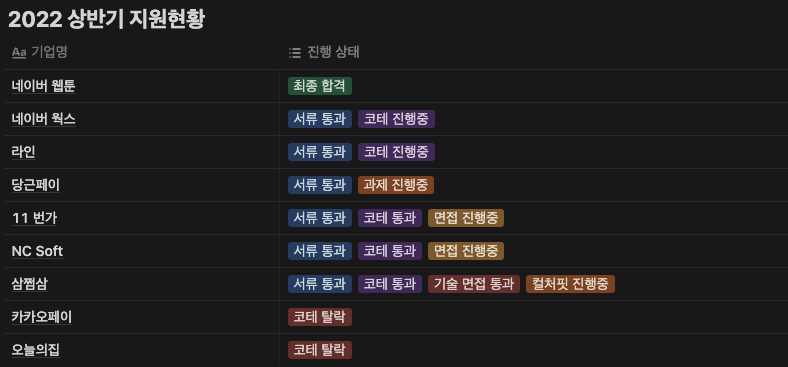
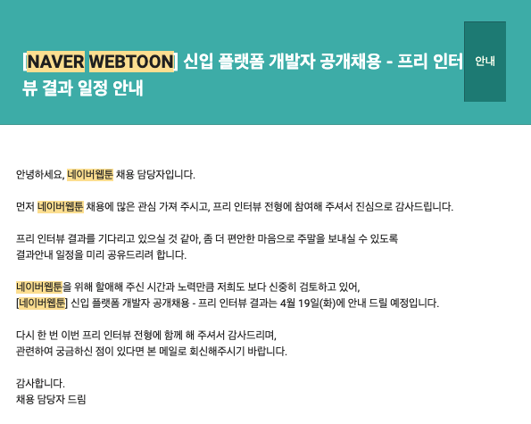
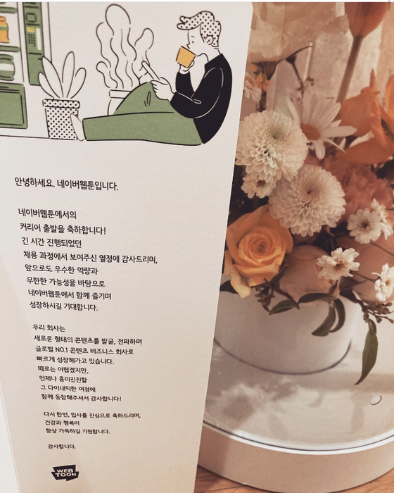

> 2022 상반기에 지원하면서 느꼈던 것들을 정리하고, 신입으로 백엔드 개발 취업을 준비하시는 분들께 도움이 되길 바라며 글을 작성합니다. ✍️

## 🙋‍♂️ **저는..**

저는 재수해서 입학한 첫 대학에서 전기공학과를 전공했고 군 복무를 하면서 자퇴를 결심했습니다. 그리고 군대에서 다시 입시 준비를 하여 들어간 두 번째 대학에서는 기계공학과를 전공했고 2년 동안 수석을 차지했습니다. 그렇게 **"잘"** 하고 있던 기계공학 공부를 포기하고 3학년으로 올라가면서 **"재미"**를 느꼈던 컴퓨터공학과로 전과를 했습니다. 그리고 이와 비슷한 시기에 SW 마에스트로에 합격하여 12기로도 활동했습니다.

## 🏇 **취준 시작**

2022년 3월, 4학년 1학기로 학교를 다니면서 졸업작품 프로젝트와 동시에 취업을 준비하기 시작했습니다.

4학년 1학기부터 취준을 시작한 이유는 `'나는 남들보다 너무 늦었다.'` 라고 생각했기 때문입니다. 늦은 나이에 대학에 입학했을 뿐만 아니라 중간에 진로까지 변경했기 때문에 늦어진 만큼 항상 남들보다 먼저 시작해야 한다는 생각을 가지고 있었습니다. 또한, 주변에서 하나둘씩 취업하는 모습을 보니 부러움과 동시에 한편으로는 조급해지는 마음이 들었습니다.

> 대학교를 24살에 입학했기 때문에 '나는 남들보다 늦었으니까 남들이 쉴 때 쉬어서는 안돼!'라는 생각을 가지고 스스로를 채찍질했지만 지금 와서 돌이켜보면 나 자신에게 너무 엄격했었고, 이런 사고방식이 사람을 금방 지치게 만드는 요인이 된다고 생각해서 좋은 방법은 아닌 것 같아요...😓

그렇게 취준을 해야겠다고 마음을 먹고 아래와 같이 이력서 작성을 시작했습니다.

-   개발바닥 유튜브 채널에서 소개된 [박우빈님 이력서](https://www.youtube.com/watch?v=Yc56NpYW1DM)를 보고 이력서 초안 작성하기
-   인프런 워니님의 [이력서 가이드](https://www.inflearn.com/course/%ED%95%A9%EA%B2%A9%ED%95%98%EB%8A%94-%EC%9D%B4%EB%A0%A5%EC%84%9C-%EC%9E%91%EC%84%B1-%EA%B0%80%EC%9D%B4%EB%93%9C) 강의와 이력서 첨삭 세미나를 통해 부족한 부분을 채우기
-   배민테크코스 코치로 활동 중이신 메이커준님의 이력서 오픈 마이크 세션에 참여하여 부족한 부분 채우기

그렇게 수정에 수정에 수정을 거쳐 이력서를 완성했습니다.

## ✍️ **지원한 회사**

4학년 1학기로 재학 중인 상태라 실패하면 하반기에 준비하면 된다는 생각으로 정말 가고 싶은 회사만 지원했습니다. 위 사진을 보시다시피 9개의 회사에만 지원을 했습니다. `'가고 싶은 곳이 9곳 밖에 없었느냐?'`라고 물으실 수 있지만 대부분의 회사들이 **졸업예정자 및 기졸업자**를 지원자격요건으로 명시하고 있었기 때문에 지원할 수 있는 곳이 많지 않았습니다...😓

## 🖼 **네이버 웹툰**

채용 과정: `서류 → 프리 인터뷰 → 기술 면접 → 최종 면접(온라인 인성검사 포함)`

### **서류 전형**

네이버 웹툰 채용 프로세스의 특이한 점은 코딩 테스트 없이 서류만으로 인터뷰 대상을 선정한다는 것입니다. 결국 모든 지원자의 지원서를 다 읽어본다는 것인데 이점이 굉장히 인상적이었습니다.

> -   희망하는 개발분야 혹은 관심있는 기술분야 위주로, 자신을 소개해주세요. 왜 해당 분야에 관심을 가지고 개발을 시작하게 되었고, 이후 개발자로서 본인의 커리어 플랜 등을 자세히 작성해주시기 바랍니다.
> -   진행했던 개발 프로젝트 중 어려운 기술적 문제를 주도적으로 해결했던 경험을 이야기 해주세요. (학교수업, 대외활동, 경진대회 등)
>
> 본인이 보유한 개발 skill의 활용 정도를 작성하고(1~4점 중 선택), 기술 습득을 위해 노력한 학습 방법을 구체적으로 작성해주세요.
>
> -   '네이버웹툰 유한회사'에서 제공하는 서비스 중 하나를 선택하여, 기술의 관점에서 어떤 장단점이 있는지를 작성해주세요. (경쟁 서비스와의 비교도 가능합니다)

서류 문항은 대부분의 서비스 기업과 일치했습니다. 특이한 점이 있다면 마지막 문항인데 저는 여러 플랫폼의 웹툰을 보고 있었기 때문에 어렵지 않게 작성할 수 있었습니다. 또한, 작년 [채용 설명회](https://www.youtube.com/watch?v=DiSTevbYRpc&t)에서 박찬규 CTO님께서 발표하신 내용이 작성하는 데 도움이 되었습니다.

### **프리 인터뷰**

프리 인터뷰는 약 30분이라는 비교적 짧은 시간 동안 진행되었습니다. 이후 기술 면접이 있어서인지 기본적인 CS 지식과 서버 개발자로 지원했기에 Java/Spring을 위주의 질문을 주셨습니다. 질문의 답변에 대한 꼬리 질문보다는 기초적인 내용을 알고 있는지를 확인하는 느낌의 면접이었습니다.

### **기술 면접**

개인적으로 네이버 웹툰 채용 절차 중에서 가장 어려운 구간이라고 생각합니다. 기술 면접은 총 3시간 동안 보게 되며, 1시간마다 면접관님과 1:1로 30분 기술면접, 20분 라이브 코딩 테스트 형식으로 총 3분의 면접관님과 진행됩니다.

기술면접은 Java/Spring 위주의 질문으로 진행되는데 질문의 답변에 대한 꼬리 질문과 Spring의 동작 원리와 같은 깊은 질문이 주를 이룹니다. 처음에는 기초적인 개념 질문으로 시작해서 그 안의 동작 원리까지 물어보시는 등의 깊은 질문을 주셨습니다. 그 과정에서 처음 듣는 용어가 나오기도 했는데 모르는 내용은 얼버무리지 않고 솔직하게 모른다고 답변드렸습니다. 하지만 알고 있는 내용의 경우 해당 개념의 밑바닥까지 모두 말씀드리려고 노력했습니다. 그리고 일반적인 기술 질문이 아니라 제가 블로그에 작성한 포스팅을 미리 읽어보시고 들어오셔서 해당 포스팅에 관해 질문을 주셨던 것이 굉장히 인상적이었습니다.

저는 코딩 테스트를 항상 Python으로 풀곤 했는데 과거 면접 후기를 보니 Java로 제한한다는 후기가 있어서 급하게 Java로 코딩 테스트를 준비했습니다. 실제로 세분 중 두 분은 Java로 풀이를 부탁하셨습니다. 문제 난이도는 꾸준히 코딩 테스트를 준비했다면 어렵지 않게 풀 수 있는 정도의 난이도였습니다. 또한 면접관님께서 중간중간 "이렇게 해보면 어떨까요?" 라는 형식의 힌트를 주시기 때문에 면접관님과 소통하면서 잘 해결할 수 있었습니다.

### **최종 면접**

최종 면접은 박찬규 CTO님, 기술임원님과 2:1면접 1시간, HR 담당자님과 1:1면접 30분으로 진행되었습니다. 작성했던 이력서를 한 번 더 읽어보고 '나'라는 사람은 어떤 사람이고, 어떻게 성장해왔으며 현재는 어떤 노력을 하고 있는지, 왜 네이버 웹툰이어야만 하는지, 나의 강점은 무엇인지를 위주로 준비했습니다. 박찬규 CTO님, 기술임원님과의 면접은 저의 인생 타임라인에 대한 질문을 시작으로 후반부에는 프로젝트 위주의 질문을 깊게 주셨습니다. 인생 타임라인을 설명드릴 때는 정말 흐뭇한 표정으로 이야기를 들어주셔서 신나게 이야기를 풀어나갈 수 있었습니다. 이후 프로젝트에 대해서는 예상한 것보다 깊게 질문을 주셔서 처음에는 약간 당황했지만 차근차근 기억을 더듬어가며 열심히 답변했습니다. 저는 프로젝트가 끝나면 항상 프로젝트에서 발생했던 기술적 문제와 해결책, 적용했던 기술들을 블로그에 정리하는 편인데, 이 습관이 답변하는 데 있어 많은 도움이 되었던 것 같습니다. 이후 HR 면접은 굉장히 편안한 분위기에서 진행되었습니다. 일반적인 인성 질문과 더불어 어떻게 3개의 전공을 공부하게 됐는지에 대한 질문을 받았습니다. 마지막에는 네이버 웹툰에서의 채용 프로세스 경험이 굉장히 만족스러워서 이에 대한 감사의 말씀을 드리고 모든 전형을 끝마치게 되었습니다.

### **네이버 웹툰에서의 면접경험**

사실 작년에도 몇 번의 취업 기회가 있어 면접을 보았었고, 올해도 좋은 기회가 되어 여러 곳에서 면접을 볼 수 있었습니다. 모든 면접 경험을 통틀어봤을 때 네이버 웹툰에서의 면접 경험이 가장 좋았는데 그 이유는 면접 보는 내내 존중받고 있다는 느낌을 받았기 때문입니다. 과거에 다른 회사의 면접에서 면접이 시작되고 나서야 제 이력서를 읽고 있다는 느낌을 받은 적이 있습니다. 하지만 네이버 웹툰 면접관님들께서는 미리 이력서를 읽으셨을 뿐만 아니라 블로그 포스팅, 진행했던 프로젝트의 코드까지 보고 들어오셨습니다. 그만큼 좋은 개발자를 뽑기 위해 노력하는 곳이라는 느낌을 받았고, 그런 느낌을 받을 때마다 더욱더 네이버 웹툰이라는 회사에서 일하고 싶다는 생각이 들었던 것 같습니다. 그리고 기술 면접에서 답변을 하지 못한 경우가 있었는데 면접관님께서 어떠한 의도로 이런 질문한 것이라고 설명해 주셔서 굉장히 인상적이었습니다. 또한, 기술면접에서 받은 질문들이 깃허브에서 쉽게 볼 수 있는 일반적인 질문들이 아니라 정말 기술적으로 깊게 고민해 봐야 답변할 수 있는 질문들이었기 때문에 면접이 끝난 이후 복기하는 과정에서도 많은 것을 배울 수 있었습니다.

HR 부서분들은 정말 너무너무 친절했습니다. 아직 4학년 1학기 재학 중이고 4학년 2학기는 취업계를 사용해서 입사가 가능한 상황이라 이런 사정을 지원하기 전에 메일로 문의했었는데 기계적인 답변이 아니라 정말 친절하게 답변을 주셨었습니다. 또한 최종 면접에서 30분 동안 HR 담당자님과의 면접 경험은 지금까지 겪은 모든 면접 경험을 통틀어 가장 편안한 분위기에서 진행되었고, ‘나는 어떤 사람이에요!’라고 표현할 수 있는 행복한(?) 시간이었습니다.

보통 채용 프로세스를 진행하다 보면 결과 발표에 대한 일정을 알려주지 않아 무작정 기다려야 하는 경우가 많습니다. 네이버 웹툰에서는 현재 결과 발표가 늦어지고 있고, 언제 발표 예정이라는 날짜까지 명확하게 안내해 준다는 점에서 지원자들을 배려해 주고 있다는 느낌을 받았습니다.

## **🎁 최종 합격**

채용 프로세스를 진행 중이던 기업 중에서는 네이버 웹툰이 가장 먼저 최종 오퍼를 주셨습니다. 어렸을 때부터 웹툰을 너무 좋아하기도 했고 여러 조건을 고려해 보았을 때 현재 상황에서는 네이버 웹툰이 저에게 더 잘 맞을 것 같다는 판단에 네이버 웹툰으로 입사를 결정했습니다. 이후 다른 회사에는 더 이상 채용 프로세스를 진행하지 못할 것 같다고 정중히 의사를 전달했습니다. 🙏

## **🔚 맺음말**

제가 코딩을 시작한 지 약 1년 반 만에 이렇게 좋은 기회를 잡을 수 있었던 이유는 `정말 내가 하고 싶었던 일을 했고 덕분에 꾸준하게 할 수 있었다.` 는 것입니다. 개발자로 취업을 준비하시는 분들은 내가 왜 개발자가 되고 싶은지를 깊이 있게 고민해 보시기를 바랍니다. 개발자가 되기로 결심했다면 조바심을 갖지 않고 하나씩 꾸준히 준비하다 보면 언젠가 기회가 열렸을 때 좋은 결과를 얻을 수 있으리라 생각합니다. 모든 취준생분들을 응원하고, 취준 과정에서 도움을 주신 모든 분들께 감사의 말씀을 전합니다. 🙂

## **💌 팁**

-   [백엔드 기술 면접 정리 Repo](https://github.com/backtony/Backend_Interview_for_Beginner) : 직접 정리한 내용으로 매일 아침에 한 파트씩 면접을 보는 것처럼 스스로 질문하고 답변하는 형태로 연습했습니다.
-   [우아한 테크코스 10분 테코톡](https://www.youtube.com/playlist?list=PLgXGHBqgT2TvpJ_p9L_yZKPifgdBOzdVH) : CS지식에 부족함을 항상 느꼈었는데 테코톡 채널에서 부족한 CS지식을 채우는데 많은 도움이 되었습니다.
-   [김영한님의 Spring & JPA 강의](https://www.inflearn.com/users/@yh) : 저의 모든 Spring 기초 지식은 김영한님으로부터 시작되었습니다.
-   [정수원님 스프링 배치 강의](https://www.inflearn.com/course/%EC%8A%A4%ED%94%84%EB%A7%81-%EB%B0%B0%EC%B9%98#) : 스프링 배치는 정보가 적은 편이어서 공부하기 어려웠으나 정수원님 강의를 통해 개념을 다질 수 있었습니다.
-   프로젝트 진행하면서 기술적 지식을 얻은 곳
    -   [이동욱(jojoldu)님 블로그](https://jojoldu.tistory.com/) : 최적화, Spring batch 관련해서 많은 지식을 얻을 수 있는 곳입니다.
    -   [우아한 형제들 기술 블로그](https://techblog.woowahan.com/) : 기술 공유에 있어서 진심인 곳입니다. 코드레벨까지 상세하게 설명이 되어 있고 Github 링크도 제공하기에 이해하고 적용하기 좋습니다.
-   세미나 녹화 유튜브 채널
    -   [우아한 테크 세미나](https://www.youtube.com/playlist?list=PLgXGHBqgT2TtGi82mCZWuhMu-nQy301ew)
    -   [springcamp.io](https://www.youtube.com/user/springcampkr)
    -   [OKKYCON](https://www.youtube.com/channel/UCuynXsGvMXLviyqVMeS2y-g)
